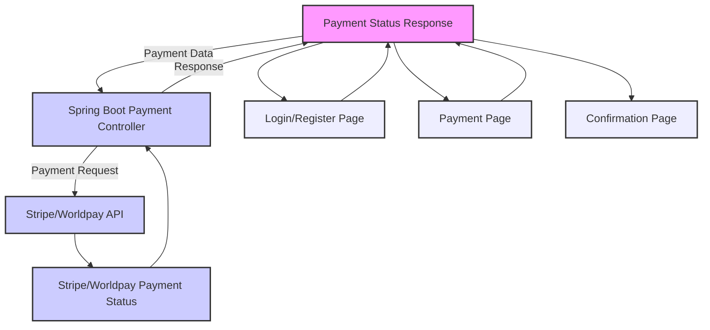

To create a **React** and **Spring Boot microservice** project that integrates with a payment system like **Stripe** or **Worldpay**, we need to break it into multiple components:

1. **Frontend** (React) - This will be responsible for handling user interactions and interacting with the backend for payment processing.
2. **Backend** (Spring Boot Microservice) - This will handle payment logic, like creating payment sessions, verifying payment status, and communicating with the payment provider's API (Stripe/Worldpay).
3. **Mermaid Structure** - We'll visualize the architecture using a Mermaid diagram.

### Project Overview

1. **Frontend (React)**:
   - **React**: A UI component that collects payment details and sends them to the Spring Boot backend.
   - **Stripe/Worldpay SDK**: A library to securely handle payment data (Stripe.js or Worldpay API integration).

2. **Backend (Spring Boot)**:
   - **Spring Boot**: A RESTful microservice that handles payment requests, communicates with the payment processor (Stripe or Worldpay), and processes responses.
   - **Stripe/Worldpay API Integration**: Spring Boot communicates with Stripe/Worldpay’s API to handle payment sessions, verify payments, etc.

### Project Structure

Here's a simplified flow for the project:

#### **Frontend (React)**

- **Login/Register Page**: Users sign in or register.
- **Payment Page**: Where users enter their payment details.
  - Stripe/Worldpay integration for frontend payment handling.
  - Send payment details to backend (Spring Boot).
- **Confirmation Page**: Display payment success or failure message.

#### **Backend (Spring Boot Microservice)**

- **Payment Controller**: Receives payment request from the frontend, processes with Stripe/Worldpay, and sends back status.
- **Payment Service**: Contains logic for interacting with Stripe/Worldpay API.
- **Payment Model**: Stores payment data, such as session ID, payment status, etc.

### **Mermaid Diagram (System Architecture)**

Here's the **Mermaid diagram** to visualize the structure of the system:



### Step-by-Step Implementation

#### 1. **Frontend (React)**

Create a new React project using:

```bash
npx create-react-app react-payment-app
cd react-payment-app
```

**Install Stripe (or Worldpay) SDK for React:**

```bash
npm install @stripe/react-stripe-js @stripe/stripe-js
```

Create a `PaymentPage.js` component:

```jsx
import React, { useState } from "react";
import { loadStripe } from "@stripe/stripe-js";
import { Elements, CardElement, useStripe, useElements } from "@stripe/react-stripe-js";

// Load your public Stripe key
const stripePromise = loadStripe("your-stripe-public-key");

function PaymentForm() {
  const [status, setStatus] = useState("");
  const stripe = useStripe();
  const elements = useElements();

  const handleSubmit = async (event) => {
    event.preventDefault();

    if (!stripe || !elements) {
      return;
    }

    const card = elements.getElement(CardElement);
    const { error, token } = await stripe.createToken(card);

    if (error) {
      setStatus(error.message);
    } else {
      // Send token to backend
      const response = await fetch("http://localhost:8080/payment", {
        method: "POST",
        body: JSON.stringify({ token: token.id }),
        headers: { "Content-Type": "application/json" },
      });

      const data = await response.json();
      setStatus(data.status);
    }
  };

  return (
    <form onSubmit={handleSubmit}>
      <CardElement />
      <button type="submit" disabled={!stripe}>Pay Now</button>
      {status && <p>{status}</p>}
    </form>
  );
}

export default function PaymentPage() {
  return (
    <Elements stripe={stripePromise}>
      <PaymentForm />
    </Elements>
  );
}
```

This component allows users to enter their payment details and sends a token to the backend for processing.

#### 2. **Backend (Spring Boot)**

##### a. **Set up Spring Boot Project**

You can use **Spring Initializr** to create a Spring Boot project with the following dependencies:
- Spring Web
- Spring Boot DevTools
- Spring Data JPA (if needed)
- Stripe SDK (or Worldpay API)

##### b. **Payment Controller in Spring Boot**

```java
package com.example.payment.controller;

import com.example.payment.service.PaymentService;
import org.springframework.web.bind.annotation.*;

@RestController
@RequestMapping("/payment")
public class PaymentController {

    private final PaymentService paymentService;

    public PaymentController(PaymentService paymentService) {
        this.paymentService = paymentService;
    }

    @PostMapping
    public PaymentResponse handlePayment(@RequestBody PaymentRequest paymentRequest) {
        String paymentStatus = paymentService.processPayment(paymentRequest.getToken());
        return new PaymentResponse(paymentStatus);
    }
}
```

##### c. **Payment Service (Stripe/Worldpay Integration)**

For **Stripe**, you’ll use the Stripe Java SDK. First, add the dependency in your `pom.xml`:

```xml
<dependency>
    <groupId>com.stripe</groupId>
    <artifactId>stripe-java</artifactId>
    <version>20.0.0</version>
</dependency>
```

Then create a service to process the payment:

```java
package com.example.payment.service;

import com.stripe.Stripe;
import com.stripe.model.Charge;
import com.stripe.model.Token;
import org.springframework.stereotype.Service;

@Service
public class PaymentService {

    public PaymentService() {
        Stripe.apiKey = "your-stripe-secret-key";
    }

    public String processPayment(String token) {
        try {
            Token stripeToken = Token.retrieve(token);
            Charge charge = Charge.create(
                Map.of(
                    "amount", 5000, // Amount in cents
                    "currency", "usd",
                    "source", stripeToken.getId(),
                    "description", "Payment for order"
                )
            );
            return charge.getStatus();
        } catch (Exception e) {
            e.printStackTrace();
            return "Payment failed";
        }
    }
}
```

#### 3. **Connecting Frontend to Backend**

- In your **React** frontend, the payment form sends a POST request with the token to the Spring Boot backend.
- The Spring Boot backend processes the payment using Stripe and sends a response back to the frontend.

#### 4. **Flow**

The diagram provides a high-level view of how the data flows in the application:


### Conclusion

This structure and flow will give you a clear outline for how to implement a payment solution using **React** and **Spring Boot**, with **Stripe/Worldpay** as the payment processor. This is just a basic example to help you get started; depending on the complexity of your project, you may want to add features like error handling, user authentication, or more advanced payment workflows.
