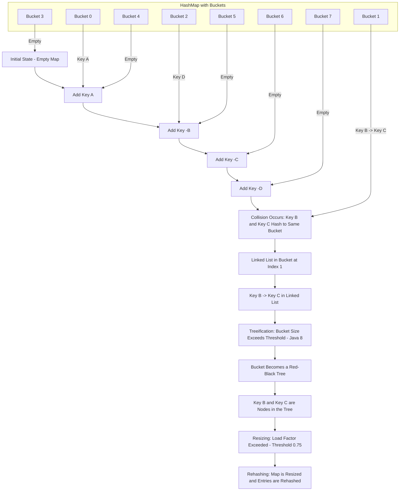

## Concurrency API

The concurrency utilities are contained in the java.util.concurrent package and in its two subpackages: **`java.util.concurrent.atomic`** and **`java.util.concurrent.locks`**.

### java.util.concurrent

**`java.util.concurrent`** defines the core features that support alternatives to the built-in approaches to synchronization and interthread communication. 

These include
- **`Synchronizers`**
- **`Executors`**
- **`Concurrent collections`**
- **`The Fork/Join Framework`**

Synchronizers offer high-level ways of synchronizing the interactions between multiple threads. The synchronizer classes defined by **`java.util.concurrent`** are

- **`Semaphore`**: Implement the classic Semaphore.
- **`CountDownLatch`**: Waits until a specified number of events have occured.
- **`CyclicBarrier`**: Enables a group of threads to wait at a predefined execution point.
- **`Exchanger`**: Exchanges data between two threads.
- **`Phaser`**: Synchronizes thread that advance through multiple phases of an operation.

**`Executors`** manage thread execution. At the top of the executor hierarchy is the **`Executor`** interface, which is used to initiate a thread. **`ExecutorService`** extends **`Executor`** and provides methods that manage execution. 

There are three implementations of **`ExecutorService`**: **`ThreadPoolExecutor`**, **`ScheduledThreadPoolExecutor`**, and **`ForkJoinPool`**. 

**`java.util.concurrent`** also defines the Executors utility class, which includes a number of static methods that simplify the creation of various executors.

Related to executors are the Future and **`Callable`** interfaces. A **`Future`** contains a value that is returned by a thread after it executes. Thus, its value becomes defined “in the future,” when the thread terminates. **`Callable`** defines a thread that returns a value.

**`java.util.concurrent`** defines several concurrent collection classes, including **`ConcurrentHashMap`**, **`ConcurrentLinkedQueue`**, and **`CopyOnWriteArrayList`**. These offer concurrent alternatives to their related classes defined by the Collections Framework.

The **`Fork/Join`** Framework supports parallel programming. Its main classes are **`ForkJoinTask`**, **`ForkJoinPool`**, **`RecursiveTask`**, and **`RecursiveAction`**.
To better handle thread timing, **`java.util.concurrent`** defines the TimeUnit enumeration.

---

Beginning with JDK 9, java.util.concurrent also includes a subsystem that offers a means by which the flow of data can be controlled. It is based on the Flow class and these nested interfaces: **`Flow.Subscriber`**, **`Flow.Publisher`**, **`Flow.Processor`**, and **`Flow.Subscription`**. Although a detailed discussion of the Flow subsystem is outside the focus of this chapter, here is a brief description. Flow and its nested interfaces support the reactive streams specification. This specification defines a means by which a consumer of data can prevent the producer of the data from overrunning the consumer’s ability to process the data. In this approach, data is produced by a publisher and consumed by a subscriber. Control is achieved by mplementing a form of back pressure.

### java.util.concurrent.atomic

**`java.util.concurrent.atomic`** facilitates the use of variables in a concurrent environment. It provides a means of efficiently updating the value of a variable without the use of locks. This is accomplished through the use of classes, such as **`AtomicInteger`** and AtomicLong, and methods, such as **`compareAndSet()`**, **`decrementAndGet()`**, and **`getAndSet()`**. These methods execute as a single, non interruptible operation.

### java.util.concurrent.locks

**`java.util.concurrent.locks`** provides an alternative to the use of synchronized methods. At the core of this alternative is the Lock interface, which defines the basic mechanism used to acquire and relinquish access to an object. The key methods are **`lock()`**, **`tryLock()`**, and **`unlock()`**. The advantage to using these methods is greater control over synchronization.

### Using Synchronization Objects
Synchronization objects are supported by the **`Semaphore`**, **`CountDownLatch`**, **`CyclicBarrier`**, **`Exchanger`**, and **`Phaser`** classes. Collectively, they enable you to handle several formerly difficult synchronization situations with ease. They are also applicable to a wide range of programs—even those that contain only limited concurrency. Because the synchronization objects will be of interest to nearly all Java programs, each is examined here in some detail.

### Semaphore
The synchronization object that many readers will immediately recognize is Semaphore, which implements a classic semaphore. A semaphore controls access to a shared resource through the use of a counter. If the counter is greater than zero, then access is allowed. If it is zero, then access is denied. What the counter is counting are permits that allow access to the shared resource. Thus, to access the resource, a thread must be granted a permit from the semaphore.

In general, to use a semaphore, the thread that wants access to the shared resource tries to acquire a permit. If the semaphore’s count is greater than zero, then the
thread acquires a permit, which causes the semaphore’s count to be decremented.

Otherwise, the thread will be blocked until a permit can be acquired. When the thread no longer needs access to the shared resource, it releases the permit, which causes the semaphore’s count to be incremented. If there is another thread waiting for a permit, then that thread will acquire a permit at that time. Java’s Semaphore class implements this mechanism.

Semaphore has the two constructors shown here:
- Semaphore(int num)
- Semaphore(int num, boolean how)

Here, num specifies the initial permit count. Thus, num specifies the number of threads that can access a shared resource at any one time. If num is one, then only one thread can access the resource at any one time. By default, waiting threads are granted a permit in an undefined order. By setting how to true, you can ensure that waiting threads are granted a permit in the order in which they requested access.

To acquire a permit, call the **`acquire()`** method, which has these two forms:
- void acquire() throws InterruptedException
- void acquire(int num) throws InterruptedException

The first form acquires one permit. The second form acquires num permits. Most often, the first form is used. If the permit cannot be granted at the time of the call,
then the invoking thread suspends until the permit is available.

To release a permit, call **`release()`**, which has these two forms:
- void release()
- void release(int num)

The first form releases one permit. The second form releases the number of permits specified by num.

To use a semaphore to control access to a resource, each thread that wants to use that resource must first call **`acquire()`** before accessing the resource. When the thread is done with the resource, it must call **`release()`**. Here is an example that illustrates the use of a semaphore:

The output from the program is shown here. (The precise order in which the threads execute may vary.)

The program uses a semaphore to control access to the count variable, which is a static variable within the Shared class. Shared.count is incremented five times by the run() method of IncThread and decremented five times by DecThread. To prevent these two threads from accessing Shared.count at the same time, access is allowed only after a permit is acquired from the controlling semaphore. After access is complete, the permit is released. In this way, only one thread at a time will access Shared.count, as the output shows.

In both IncThread and DecThread, notice the call to sleep() within run(). It is used to “prove” that accesses to Shared.count are synchronized by the semaphore.
In run()`**, the call to sleep() causes the invoking thread to pause between each access to Shared.count. This would normally enable the second thread to run.

However, because of the semaphore, the second thread must wait until the first has released the permit, which happens only after all accesses by the first thread are complete. Thus, Shared.count is incremented five times by IncThread and decremented five times by DecThread. The increments and decrements are not intermixed.

Without the use of the semaphore, accesses to Shared.count by both threads would have occurred simultaneously, and the increments and decrements would be intermixed. To confirm this, try commenting out the calls to acquire() and **`release()`**. When you run the program, you will see that access to Shared.count is no longer synchronized, and each thread accesses it as soon as it gets a timeslice.

Although many uses of a semaphore are as straightforward as that shown in the preceding program, more intriguing uses are also possible. Here is an example. The following program reworks the producer/consumer program shown in Chapter 11 so that it uses two semaphores to regulate the producer and consumer threads, ensuring that each call to **`put()`** is followed by a corresponding call to get():

- A portion of the output is shown here:

As you can see, the calls to **`put()`** and **`get()`** are synchronized. That is, each call to put() is followed by a call to **`get()`** and no values are missed. Without the semaphores, multiple calls to **`put()`** would have occurred without matching calls to get(), resulting in values being missed. (To prove this, remove the semaphore code and observe the results.)
The sequencing of **`put()`** and **`get()`** calls is handled by two semaphores: semProd and semCon. Before **`put()`** can produce a value, it must acquire a permit from semProd. After it has set the value, it releases semCon. Before **`get()`** can consume a value, it must acquire a permit from semCon. After it consumes the value, it releases semProd. This “give and take” mechanism ensures that each call to **`put()`** must be followed by a call to get().

Notice that semCon is initialized with no available permits. This ensures that put() executes first. The ability to set the initial synchronization state is one of the more powerful aspects of a semaphore.

### CountDownLatch
Sometimes you will want a thread to wait until one or more events have occurred. To handle such a situation, the concurrent API supplies CountDownLatch. A CountDownLatch is initially created with a count of the number of events that must occur before the latch is released. Each time an event happens, the count is decremented. When the count reaches zero, the latch opens.

CountDownLatch has the following constructor:
- CountDownLatch(int num)

Here, num specifies the number of events that must occur in order for the latch to open.
To wait on the latch, a thread calls await(), which has the forms shown here:
- void await( ) throws InterruptedException
- boolean await(long wait, TimeUnit tu) throws InterruptedException

The first form waits until the count associated with the invoking CountDownLatch reaches zero. The second form waits only for the period of time specified by wait.
The units represented by wait are specified by tu, which is an object the TimeUnit enumeration. (TimeUnit is described later in this chapter.) It returns false if the time
limit is reached and true if the countdown reaches zero.

To signal an event, call the **`countDown()`** method, shown next:
- void countDown()

Each call to **`countDown() decrements the count associated with the invoking object.
The following program demonstrates CountDownLatch. It creates a latch that requires five events to occur before it opens.

The output produced by the program is shown here:

Inside **`main()`**, a CountDownLatch called cdl is created with an initial count of five. Next, an instance of MyThread is created, which begins execution of a new
thread. Notice that cdl is passed as a parameter to MyThread’s constructor and stored in the latch instance variable. Then, the main thread calls **`await()`** on cdl, which causes execution of the main thread to pause until cdl’s count has been decremented five times.

Inside the **`run()`** method of MyThread, a loop is created that iterates five times.

With each iteration, the **`countDown()`** method is called on latch, which refers to cdl in main()`**. After the fifth iteration, the latch opens, which allows the main thread to
resume.

CountDownLatch is a powerful yet easy-to-use synchronization object that is appropriate whenever a thread must wait for one or more events to occur.

### CyclicBarrier
A situation not uncommon in concurrent programming occurs when a set of two or more threads must wait at a predetermined execution point until all threads in the set have reached that point. To handle such a situation, the concurrent API supplies the CyclicBarrier class. It enables you to define a synchronization object that suspends until the specified number of threads has reached the barrier point.
- CyclicBarrier has the following two constructors:
- CyclicBarrier(int numThreads)
- CyclicBarrier(int numThreads, Runnable action)

Here, numThreads specifies the number of threads that must reach the barrier before execution continues. In the second form, action specifies a thread that will be executed when the barrier is reached.

Here is the general procedure that you will follow to use CyclicBarrier. First, create a CyclicBarrier object, specifying the number of threads that you will be waiting for. Next, when each thread reaches the barrier, have it call **`await()`** on that object. This will pause execution of the thread until all of the other threads also call **`await()`**. Once the specified number of threads has reached the barrier, await()`** will return and execution will resume. Also, if you have specified an action, then that thread is executed.

The await() method has the following two forms:
- int await() throws InterruptedException, BrokenBarrierException
- int await(long wait, TimeUnit tu) throws InterruptedException, BrokenBarrierException, TimeoutException

The first form waits until all the threads have reached the barrier point. The second form waits only for the period of time specified by wait. The units represented by wait are specified by tu. Both forms return a value that indicates the order that the threads arrive at the barrier point. The first thread returns a value equal to the number of threads waited upon minus one. The last thread returns zero.

Here is an example that illustrates CyclicBarrier. It waits until a set of three threads has reached the barrier. When that occurs, the thread specified by BarAction
executes.

The output is shown here. (The precise order in which the threads execute may vary.)
A CyclicBarrier can be reused because it will release waiting threads each time the specified number of threads calls **`await()`**. For example, if you change **`main()`** in the preceding program so that it looks like this:

the following output will be produced. (The precise order in which the threads execute may vary.)
As the preceding example shows, the CyclicBarrier offers a streamlined solution to what was previously a complicated problem.

### Exchanger
Perhaps the most interesting of the synchronization classes is Exchanger. It is designed to simplify the exchange of data between two threads. The operation of an Exchanger is astoundingly simple: it simply waits until two separate threads call its **`exchange()`** method. When that occurs, it exchanges the data supplied by the threads. This mechanism is both elegant and easy to use. Uses for Exchanger are easy to imagine. For example, one thread might prepare a buffer for receiving information over a network connection. Another thread might fill that buffer with the information from the connection. The two threads work together so that each time a new buffer is needed, an exchange is made.
Exchanger is a generic class that is declared as shown here:

- Exchanger<V>
Here, V specifies the type of the data being exchanged.
The only method defined by Exchanger is exchange( ), which has the two forms
shown here:
- V exchange(V objRef) throws InterruptedException
- V exchange(V objRef, long wait, TimeUnit tu) throws InterruptedException, TimeoutException

Here, objRef is a reference to the data to exchange. The data received from the other thread is returned. The second form of **`exchange()`** allows a time-out period to be specified. The key point about exchange() is that it won’t succeed until it has been called on the same Exchanger object by two separate threads. Thus, **`exchange()`** synchronizes the exchange of the data.

Here is an example that demonstrates Exchanger. It creates two threads. One thread creates an empty buffer that will receive the data put into it by the second thread. In this case, the data is a string. Thus, the first thread exchanges an empty string for a full one. Here is the output produced by the program:

In the program, the **`main()`** method creates an Exchanger for strings. This object is then used to synchronize the exchange of strings between the MakeString and UseString classes. The MakeString class fills a string with data. The UseString exchanges an empty string for a full one. It then displays the contents of the newly constructed string. The exchange of empty and full buffers is synchronized by the **`exchange()`** method, which is called by both classes’ **`run()`** method.

### Phaser
Another synchronization class is called Phaser. Its primary purpose is to enable the synchronization of threads that represent one or more phases of activity. For example, you might have a set of threads that implement three phases of an order processing application. In the first phase, separate threads are used to validate customer information, check inventory, and confirm pricing. When that phase is complete, the second phase has two threads that compute shipping costs and all applicable tax. After that, a final phase confirms payment and determines estimated shipping time. In the past, to synchronize the multiple threads that comprise this scenario would require a bit of work on your part. With the inclusion of Phaser, the process is now much easier.

To begin, it helps to know that a Phaser works a bit like a CyclicBarrier, described earlier, except that it supports multiple phases. As a result, Phaser lets you define a synchronization object that waits until a specific phase has completed. It then advances to the next phase, again waiting until that phase concludes. It is important to understand that Phaser can also be used to synchronize only a single phase. In this regard, it acts much like a CyclicBarrier. However, its primary use is to synchronize multiple phases.

Phaser defines four constructors. Here are the two used in this section:
- Phaser()
- Phaser(int numParties)

The first creates a phaser that has a registration count of zero. The second sets the registration count to numParties. The term party is often applied to the objects that register with a phaser. Although typically there is a one-to-correspondence between the number of registrants and the number of threads being synchronized, this is not required. In both cases, the current phase is zero. That is, when a Phaser is created, it is initially at phase zero.

In general, here is how you use Phaser. First, create a new instance of Phaser.

Next, register one or more parties with the phaser, either by calling **`register()`** or by specifying the number of parties in the constructor. For each registered party, have the phaser wait until all registered parties complete a phase. A party signals this by calling one of a variety of methods supplied by Phaser, such as **`arrive()`** or **`arriveAndAwaitAdvance()`**. After all parties have arrived, the phase is complete, and the phaser can move on to the next phase (if there is one), or terminate. The following sections explain the process in detail.

To register parties after a Phaser has been constructed, call register(). It is shown here:
- int register()

It returns the phase number of the phase to which it is registered.

To signal that a party has completed a phase, it must call **`arrive()`** or some variation of **`arrive()`**. When the number of arrivals equals the number of registered parties, the phase is completed and the Phaser moves on to the next phase (if there is one). The arrive() method has this general form:

- int arrive()

This method signals that a party (normally a thread of execution) has completed some task (or portion of a task). It returns the current phase number. If the phaser has been terminated, then it returns a negative value. 
The **`arrive()`** method does not suspend execution of the calling thread. This means that it does not wait for the phase to be completed. This method should be called only by a registered party.

If you want to indicate the completion of a phase and then wait until all other registrants have also completed that phase, use **`arriveAndAwaitAdvance()`**. It is shown here:
- int arriveAndAwaitAdvance()

It waits until all parties have arrived. It returns the next phase number or a negative value if the phaser has been terminated. This method should be called only by a registered party.

A thread can arrive and then deregister itself by calling arriveAndDeregister().
It is shown here:
- int arriveAndDeregister()

It returns the current phase number or a negative value if the phaser has been terminated. It does not wait until the phase is complete. This method should be called only by a registered party.

To obtain the current phase number, call getPhase()`**, which is shown here:

- final int getPhase()

When a Phaser is created, the first phase will be 0, the second phase 1, the third phase 2, and so on. A negative value is returned if the invoking Phaser has been terminated.

Here is an example that shows Phaser in action. It creates three threads, each of which have three phases. It uses a Phaser to synchronize each phase.

Sample output is shown here. (Your output may vary.)

Let’s look closely at the key sections of the program. First, in **`main()`**, a Phaser called phsr is created with an initial party count of 1 (which corresponds to the main thread). Then three threads are started by creating three MyThread objects. Notice that MyThread is passed a reference to phsr (the phaser). The MyThread objects use this phaser to synchronize their activities. Next, **`main()`** calls **`getPhase()`** to obtain the current phase number (which is initially zero) and then calls **`arriveAndAwaitAdvance()`**. This causes **`main()`** to suspend until phase zero has completed. This won’t happen until all MyThreads also call **`arriveAndAwaitAdvance()`**. When this occurs, **`main()`** will resume execution, at which point it displays that phase zero has completed, and it moves on to the next phase. This process repeats until all three phases have finished. Then, **`main()`** calls **`arriveAndDeregister()`**. 

At that point, all three MyThreads have also deregistered.
Since this results in there being no registered parties when the phaser advances to the next phase, the phaser is terminated.

Now look at MyThread. First, notice that the constructor is passed a reference to the phaser that it will use and then registers with the new thread as a party on that phaser. Thus, each new MyThread becomes a party registered with the passed-in phaser. Also notice that each thread has three phases. In this example, each phase consists of a placeholder that simply displays the name of the thread and what it is doing. Obviously, in real-world code, the thread would be performing more meaningful actions. Between the first two phases, the thread calls **`arriveAndAwaitAdvance()`**. Thus, each thread waits until all threads have completed the phase (and the main thread is ready). After all threads have arrived (including the main thread), the phaser moves on to the next phase. After the third phase, each thread deregisters itself with a call to **`arriveAndDeregister()`**. As the comments in MyThread explain, the calls to **`sleep()`** are used for the purposes of illustration to ensure that the output is not jumbled because of the multithreading.

They are not needed to make the phaser work properly. If you remove them, the output may look a bit jumbled, but the phases will still be synchronized correctly.
One other point: Although the preceding example used three threads that were all of the same type, this is not a requirement. Each party that uses a phaser can be unique, with each performing some separate task.

It is possible to take control of precisely what happens when a phase advance occurs. To do this, you must override the **`onAdvance()`** method. This method is called by the run time when a Phaser advances from one phase to the next. It is shown here:
- protected boolean onAdvance(int phase, int numParties)

Here, phase will contain the current phase number prior to being incremented and numParties will contain the number of registered parties. To terminate the phaser, onAdvance() must return true. To keep the phaser alive, onAdvance( ) must return false. The default version of onAdvance() returns true (thus terminating the phaser) when there are no registered parties. As a general rule, your override should also follow this practice.

One reason to override **`onAdvance()`** is to enable a phaser to execute a specific number of phases and then stop. The following example gives you the flavor of this usage. It creates a class called MyPhaser that extends Phaser so that it will run a specified number of phases. It does this by overriding the **`onAdvance()`** method.

The MyPhaser constructor accepts one argument, which specifies the number of phases to execute. Notice that MyPhaser automatically registers one party. This behavior is useful in this example, but the needs of your own applications may differ.

The output from the program is shown here:
Inside **`main()`**, one instance of Phaser is created. It is passed 4 as an argument, which means that it will execute four phases and then stop. Next, three threads are
created and then the following loop is entered:

This loop simply calls **`arriveAndAwaitAdvance()`** until the phaser is terminated.

The phaser won’t terminate until the specified number of phases have been executed.

In this case, the loop continues to execute until four phases have run. Next, notice that the threads also call **`arriveAndAwaitAdvance()`** within a loop that runs until the phaser is terminated. This means that they will execute until the specified number of phases has been completed.

Now, look closely at the code for onAdvance(). Each time **`onAdvance()`** is called, it is passed the current phase and the number of registered parties. If the current phase equals the specified phase, or if the number of registered parties is zero, **`onAdvance()`** returns true, thus stopping the phaser. This is accomplished with this line of code:

As you can see, very little code is needed to accommodate the desired outcome.

Before moving on, it is useful to point out that you don’t necessarily need to explicitly extend Phaser as the previous example does to simply override onAdvance(). In some cases, more compact code can be created by using an anonymous inner class to override **`onAdvance()`**.

Phaser has additional capabilities that may be of use in your applications. You can wait for a specific phase by calling **`awaitAdvance()`**, which is shown here:

- int awaitAdvance(int phase)

Here, phase indicates the phase number on which awaitAdvance() will wait until a transition to the next phase takes place. It will return immediately if the argument passed to phase is not equal to the current phase. It will also return immediately if the phaser is terminated. However, if phase is passed the current phase, then it will wait until the phase increments. This method should be called only by a registered party. There is also an interruptible version of this method called **`awaitAdvanceInterruptibly()`**.

To register more than one party, call **`bulkRegister()`**. To obtain the number of registered parties, call getRegisteredParties(). You can also obtain the number of arrived parties and unarrived parties by calling **`getArrivedParties()`** and **`getUnarrivedParties()`**, respectively. To force the phaser to enter a terminated state, call **`forceTermination().

Phaser also lets you create a tree of phasers. This is supported by two additional constructors, which let you specify the parent, and the **`getParent()`** method.
Using an Executor The concurrent API supplies a feature called an executor that initiates and controls the execution of threads. As such, an executor offers an alternative to managing threads through the Thread class.

At the core of an executor is the Executor interface. It defines the following method:
- void execute(Runnable thread)

The thread specified by thread is executed. Thus, **`execute()`** starts the specified thread.

The ExecutorService interface extends Executor by adding methods that help manage and control the execution of threads. For example, ExecutorService defines **`shutdown()`**, shown here, which stops the invoking ExecutorService.
- void shutdown()

ExecutorService also defines methods that execute threads that return results, that execute a set of threads, and that determine the shutdown status. We will look at several of these methods a little later.
Also defined is the interface ScheduledExecutorService, which extends ExecutorService to support the scheduling of threads.

The concurrent API defines three predefined executor classes:
ThreadPoolExecutor and ScheduledThreadPoolExecutor, and ForkJoinPool.

ThreadPoolExecutor implements the Executor and ExecutorService interfaces and provides support for a managed pool of threads.

ScheduledThreadPoolExecutor also implements the ScheduledExecutorService interface to allow a pool of threads to be scheduled. ForkJoinPool implements the Executor and ExecutorService interfaces and is used by the Fork/Join Framework.

It is described later in this chapter.
A thread pool provides a set of threads that is used to execute various tasks.

Instead of each task using its own thread, the threads in the pool are used. This reduces the overhead associated with creating many separate threads. Although you can use ThreadPoolExecutor and ScheduledThreadPoolExecutor directly, most often you will want to obtain an executor by calling one of the following static factory methods defined by the Executors utility class. Here are some examples:
- static ExecutorService newCachedThreadPool( )
- static ExecutorService newFixedThreadPool(int numThreads)
- static ScheduledExecutorService newScheduledThreadPool(int numThreads)

newCachedThreadPool() creates a thread pool that adds threads as needed but reuses threads if possible. newFixedThreadPool() creates a thread pool that consists of a specified number of threads. newScheduledThreadPool( ) creates a thread pool that supports thread scheduling. Each returns a reference to an ExecutorService that can be used to manage the pool.

### A Simple Executor Example
Before going any further, a simple example that uses an executor will be of value.
The following program creates a fixed thread pool that contains two threads. It then uses that pool to execute four tasks. Thus, four tasks share the two threads that are in the pool. After the tasks finish, the pool is shut down and the program ends.

The output from the program is shown here. (The precise order in which the threads execute may vary.)
As the output shows, even though the thread pool contains only two threads, all four tasks are still executed. However, only two can run at the same time. The others must wait until one of the pooled threads is available for use.

The call to **`shutdown()`** is important. If it were not present in the program, then the program would not terminate because the executor would remain active. To try this for yourself, simply comment out the call to shutdown( ) and observe the result.

### Using Callable and Future
One of the most interesting features of the concurrent API is the Callable interface.

This interface represents a thread that returns a value. An application can use Callable objects to compute results that are then returned to the invoking thread.

This is a powerful mechanism because it facilitates the coding of many types of numerical computations in which partial results are computed simultaneously. It can also be used to run a thread that returns a status code that indicates the successful completion of the thread.

Callable is a generic interface that is defined like this:

### interface Callable<V>
Here, V indicates the type of data returned by the task. Callable defines only one method, call()`**, which is shown here:
- V call() throws Exception

Inside **`call()`**, you define the task that you want performed. After that task completes, you return the result. If the result cannot be computed, **`call()`** must throw an exception.

A Callable task is executed by an ExecutorService, by calling its **`submit()`** method. There are three forms of **`submit()`**, but only one is used to execute a Callable. It is shown here:

### <T> Future<T> submit(Callable<T> task)
Here, task is the Callable object that will be executed in its own thread. The result is returned through an object of type Future.
Future is a generic interface that represents the value that will be returned by a Callable object. Because this value is obtained at some future time, the name Future is appropriate. Future is defined like this:

### interface Future<V>
Here, V specifies the type of the result.

To obtain the returned value, you will call Future’s **`get()`** method, which has these two forms:
- V get() throws InterruptedException, ExecutionException
- V get(long wait, TimeUnit tu) throws InterruptedException, ExecutionException, TimeoutException

The first form waits for the result indefinitely. The second form allows you to specify a timeout period in wait. The units of wait are passed in tu, which is an object of the TimeUnit enumeration, described later in this chapter.

The following program illustrates Callable and Future by creating three tasks that perform three different computations. The first returns the summation of a value, the second computes the length of the hypotenuse of a right triangle given the length of its sides, and the third computes the factorial of a value. All three computations occur simultaneously.

The output is shown here:

The TimeUnit Enumeration
The concurrent API defines several methods that take an argument of type TimeUnit, which indicates a time-out period. TimeUnit is an enumeration that is used to specify the granularity (or resolution) of the timing. TimeUnit is defined within java.util.concurrent. It can be one of the following values:
- DAYS
- HOURS
- MINUTES
- SECONDS
- MICROSECONDS
- MILLISECONDS
- NANOSECONDS

Although TimeUnit lets you specify any of these values in calls to methods that take a timing argument, there is no guarantee that the system is capable of the specified resolution.
Here is an example that uses TimeUnit. The CallableDemo class, shown in the previous section, is modified as shown next to use the second form of get( ) that takes a TimeUnit argument.
In this version, no call to **`get()`** will wait more than 10 milliseconds.

The TimeUnit enumeration defines various methods that convert between units.
These are shown here:
- long convert(long tval, TimeUnit tu)
- long toMicros(long tval)
- long toMillis(long tval)
- long toNanos(long tval)
- long toSeconds(long tval)
- long toDays(long tval)
- long toHours(long tval)
- long toMinutes(long tval)

The convert() method converts tval into the specified unit and returns the result.
The to methods perform the indicated conversion and return the result. JDK 9 adds the methods toChronoUnit() and of(), which convert between java.time.temporal.ChronoUnits and TimeUnits.

TimeUnit also defines the following timing methods:

- void sleep(long delay) throws InterruptedExecution
- void timedJoin(Thread thrd, long delay) throws InterruptedExecution
- void timedWait(Object obj, long delay) throws InterruptedExecution

Here, **`sleep()`** pauses execution for the specified delay period, which is specified in terms of the invoking enumeration constant. It translates into a call to **`Thread.sleep()`**. The **`timedJoin()`** method is a specialized version of **`Thread.join()`** in which thrd pauses for the time period specified by delay, which is described in terms of the invoking time unit. The **`timedWait()`** method is a specialized version of Object.wait()`** in which obj is waited on for the period of time specified by delay, which is described in terms of the invoking time unit.

### The Concurrent Collections

As explained, the concurrent API defines several collection classes that have been engineered for concurrent operation. They include:
- ArrayBlockingQueue
- ConcurrentHashMap
- ConcurrentLinkedDeque
- ConcurrentLinkedQueue
- ConcurrentSkipListMap
- ConcurrentSkipListSet
- CopyOnWriteArrayList
- CopyOnWriteArraySet
- DelayQueue
- LinkedBlockingDeque
- LinkedBlockingQueue
- LinkedTransferQueue
- PriorityBlockingQueue
- SynchronousQueue

These offer concurrent alternatives to their related classes defined by the Collections Framework. These collections work much like the other collections except that they provide concurrency support. Programmers familiar with the Collections Framework will have no trouble using these concurrent collections.

### Locks
The java.util.concurrent.locks package provides support for locks, which are objects that offer an alternative to using synchronized to control access to a shared resource. In general, here is how a lock works. Before accessing a shared resource, the lock that protects that resource is acquired. When access to the resource is complete, the lock is released. If a second thread attempts to acquire the lock when it is in use by another thread, the second thread will suspend until the lock is released.

In this way, conflicting access to a shared resource is prevented.

Locks are particularly useful when multiple threads need to access the value of shared data. For example, an inventory application might have a thread that first confirms that an item is in stock and then decreases the number of items on hand as each sale occurs. If two or more of these threads are running, then without some form of synchronization, it would be possible for one thread to be in the middle of a transaction when the second thread begins its transaction. The result could be that both threads would assume that adequate inventory exists, even if there is only sufficient inventory on hand to satisfy one sale. In this type of situation, a lock offers a convenient means of handling the needed synchronization.

The Lock interface defines a lock. The methods defined by Lock are shown in Table 28-1. In general, to acquire a lock, call **`lock()`**. If the lock is unavailable, **`lock()`** will wait. To release a lock, call **`unlock()`**. To see if a lock is available, and to acquire it if it is, call **`tryLock()`**. This method will not wait for the lock if it is unavailable. Instead, it returns true if the lock is acquired and false otherwise. The newCondition() method returns a Condition object associated with the lock. Using a Condition, you gain detailed control of the lock through methods such as **`await() and **`signal(), which provide functionality similar to **`Object.wait() and **`Object.notify()`**.

Table 28-1 The Lock Methods
java.util.concurrent.locks supplies an implementation of Lock called ReentrantLock. ReentrantLock implements a reentrant lock, which is a lock that can be repeatedly entered by the thread that currently holds the lock. Of course, in the case of a thread reentering a lock, all calls to **`lock()`** must be offset by an equal number of calls to **`unlock()`**. Otherwise, a thread seeking to acquire the lock will suspend until the lock is not in use.
The following program demonstrates the use of a lock. It creates two threads that access a shared resource called Shared.count. Before a thread can access Shared.count, it must obtain a lock. After obtaining the lock, Shared.count is incremented and then, before releasing the lock, the thread sleeps. This causes the second thread to attempt to obtain the lock. However, because the lock is still held by the first thread, the second thread must wait until the first thread stops sleeping and releases the lock. The output shows that access to Shared.count is, indeed, synchronized by the lock.

The output is shown here. (The precise order in which the threads execute may vary.)
java.util.concurrent.locks also defines the ReadWriteLock interface. This interface specifies a lock that maintains separate locks for read and write access. This enables multiple locks to be granted for readers of a resource as long as the resource is not being written. ReentrantReadWriteLock provides an implementation of ReadWriteLock.

NOTE There is a specialized lock called StampedLock. It does not implement the Lock or ReadWriteLock interfaces. It does, however, provide a mechanism that enables aspects of it to be used like a Lock or ReadWriteLock.

### Atomic Operations
java.util.concurrent.atomic offers an alternative to the other synchronization features when reading or writing the value of some types of variables. This package offers methods that get, set, or compare the value of a variable in one uninterruptible (that is, atomic) operation. This means that no lock or other synchronization mechanism is required.
Atomic operations are accomplished through the use of classes, such as AtomicInteger and AtomicLong, and methods such as **`get()`**, **`set()`**, **`compareAndSet()`**, **`decrementAndGet()`**, and **`getAndSet()`**, which perform the action indicated by their names.

Here is an example that demonstrates how access to a shared integer can be synchronized by the use of AtomicInteger:
In the program, a static AtomicInteger named ai is created by Shared. Then, three threads of type AtomThread are created. Inside **`run()`**, Shared.ai is modified by calling **`getAndSet()`**. This method returns the previous value and then sets the value to the one passed as an argument. The use of AtomicInteger prevents two threads from writing to ai at the same time.

In general, the atomic operations offer a convenient (and possibly more efficient) alternative to the other synchronization mechanisms when only a single variable is involved. Among other features, java.util.concurrent.atomic also provides four classes that support lock-free cumulative operations. These are DoubleAccumulator, DoubleAdder, LongAccumulator, and LongAdder. The accumulator classes support a series of user-specified operations. The adder classes maintain a cumulative sum.

#### Parallel Programming via the Fork/Join Framework

In recent years, an important trend has emerged in software development: parallel programming. Parallel programming is the name commonly given to the techniques that take advantage of computers that contain two or more processors (multicore). As most readers will know, multicore computers have become commonplace. The advantage that multi-processor environments offer is the ability to significantly increase program performance. As a result, there had been a growing need for a mechanism that gives Java programmers a simple, yet effective way to make use of multiple processors in a clean, scalable manner. To answer this need, JDK 7 added several new classes and interfaces that support parallel programming. They are commonly referred to as the Fork/Join Framework. The Fork/Join Framework is defined in the java.util.concurrent package.

The Fork/Join Framework enhances multithreaded programming in two important ways. First, it simplifies the creation and use of multiple threads. Second, it automatically makes use of multiple processors. In other words, by using the Fork/Join Framework you enable your applications to automatically scale to make use of the number of available processors. These two features make the Fork/Join Framework the recommended approach to multithreading when parallel processing is desired.

Before continuing, it is important to point out the distinction between traditional multithreading and parallel programming. In the past, most computers had a single CPU and multithreading was primarily used to take advantage of idle time, such as when a program is waiting for user input. Using this approach, one thread can execute while another is waiting. In other words, on a single-CPU system, multithreading is used to allow two or more tasks to share the CPU. This type of multithreading is typically supported by an object of type Thread (as described in Chapter 11). Although this type of multithreading will always remain quite useful, it was not optimized for situations in which two or more CPUs are available (multicore computers).

When multiple CPUs are present, a second type of multithreading capability that supports true parallel execution is required. With two or more CPUs, it is possible to execute portions of a program simultaneously, with each part executing on its own CPU. This can be used to significantly speed up the execution of some types of operations, such as sorting, transforming, or searching a large array. In many cases, these types of operations can be broken down into smaller pieces (each acting on a portion of the array), and each piece can be run on its own CPU. As you can imagine, the gain in efficiency can be enormous. Simply put: Parallel programming will be part of nearly every programmer’s future because it offers a way to dramatically improve program performance.

#### The Main Fork/Join Classes
The Fork/Join Framework is packaged in java.util.concurrent. At the core of the Fork/Join Framework are the following four classes:
Here is how they relate. A ForkJoinPool manages the execution of ForkJoinTasks.
ForkJoinTask is an abstract class that is extended by the abstract classes RecursiveAction and RecursiveTask. Typically, your code will extend these classes to create a task. Before looking at the process in detail, an overview of the key aspects of each class will be helpful.

NOTE The class CountedCompleter also extends ForkJoinTask. However, a discussion of CountedCompleter is beyond the scope of this book.

#### ForkJoinTask<V>
ForkJoinTask<V> is an abstract class that defines a task that can be managed by a ForkJoinPool. The type parameter V specifies the result type of the task.
ForkJoinTask differs from Thread in that ForkJoinTask represents lightweight abstraction of a task, rather than a thread of execution. ForkJoinTasks are executed by threads managed by a thread pool of type ForkJoinPool. This mechanism allows a large number of tasks to be managed by a small number of actual threads. Thus, ForkJoinTasks are very efficient when compared to threads.

ForkJoinTask defines many methods. At the core are **`fork() and **`join(), shown here:
- final ForkJoinTask<V> fork()
- final V join( )

The **`fork()`** method submits the invoking task for asynchronous execution of the invoking task. This means that the thread that calls **`fork()`** continues to run. The **`fork()`** method returns this after the task is scheduled for execution. Prior to JDK 8, **`fork()`** could be executed only from within the computational portion of another ForkJoinTask, which is running within a ForkJoinPool. (You will see how to create the computational portion of a task shortly.) However, with the advent of JDK 8, if **`fork()`** is not called while executing within a ForkJoinPool, then a common pool is automatically used. The **`join()`** method waits until the task on which it is called terminates. The result of the task is returned. Thus, through the use of **`fork()`** and **`join()`**, you can start one or more new tasks and then wait for them to finish.
Another important ForkJoinTask method is **`invoke()`**. It combines the fork and join operations into a single call because it begins a task and then waits for it to end.
It is shown here:
- final V invoke()
The result of the invoking task is returned.
You can invoke more than one task at a time by using invokeAll( ). Two of its forms are shown here:
- static void invokeAll(ForkJoinTask<?> taskA, ForkJoinTask<?> taskB)
- static void invokeAll(ForkJoinTask<?> … taskList)

In the first case, taskA and taskB are executed. In the second case, all specified tasks are executed. In both cases, the calling thread waits until all of the specified tasks have terminated. Prior to JDK 8, the **`invokeAll() method could be executed only from within the computational portion of another ForkJoinTask, which is running within a ForkJoinPool. JDK 8’s inclusion of the common pool relaxed this requirement.

#### RecursiveAction
A subclass of ForkJoinTask is RecursiveAction. This class encapsulates a task that does not return a result. Typically, your code will extend RecursiveAction to create a task that has a void return type. RecursiveAction specifies four methods, but only one is usually of interest: the abstract method called **`compute()`**. When you extend RecursiveAction to create a concrete class, you will put the code that defines the task inside **`compute(). The compute() method represents the computational portion of the task.
The compute() method is defined by RecursiveAction like this:
- protected abstract void compute()

Notice that **`compute()`** is protected and abstract. This means that it must be implemented by a subclass (unless that subclass is also abstract).
In general, RecursiveAction is used to implement a recursive, divide-andconquer strategy for tasks that don’t return results. (See “The Divide-and-Conquer Strategy” later in this chapter.)

#### RecursiveTask<V>
Another subclass of ForkJoinTask is RecursiveTask<V>. This class encapsulates a task that returns a result. The result type is specified by V. Typically, your code will extend RecursiveTask<V> to create a task that returns a value. Like RecursiveAction, it too specifies four methods, but often only the abstract compute() method is used, which represents the computational portion of the task. When you extend RecursiveTask<V> to create a concrete class, put the code that represents the task inside **`compute()`**. This code must also return the result of the task.
The **`compute()`** method is defined by RecursiveTask<V> like this:
- protected abstract V compute()
Notice that **`compute()`** is protected and abstract. This means that it must be implemented by a subclass. When implemented, it must return the result of the task.
In general, RecursiveTask is used to implement a recursive, divide-and-conquer strategy for tasks that return results. (See “The Divide-and-Conquer Strategy” later in this chapter.)

#### ForkJoinPool
The execution of ForkJoinTasks takes place within a ForkJoinPool, which also manages the execution of the tasks. Therefore, in order to execute a ForkJoinTask, you must first have a ForkJoinPool. Beginning with JDK 8, there are two ways to acquire a ForkJoinPool. First, you can explicitly create one by using a ForkJoinPool constructor. Second, you can use what is referred to as the common pool. The common pool (which was added by JDK 8) is a static ForkJoinPool that is automatically available for your use. Each method is introduced here, beginning with manually constructing a pool.
ForkJoinPool defines several constructors. Here are two commonly used ones:
- ForkJoinPool()
- ForkJoinPool(int pLevel)

The first creates a default pool that supports a level of parallelism equal to the number of processors available in the system. The second lets you specify the level of parallelism. Its value must be greater than zero and not more than the limits of the implementation. The level of parallelism determines the number of threads that can execute concurrently. 

As a result, the level of parallelism effectively determines the number of tasks that can be executed simultaneously. (Of course, the number of tasks that can execute simultaneously cannot exceed the number of processors.) It is important to understand that the level of parallelism does not, however, limit the number of tasks that can be managed by the pool. A ForkJoinPool can manage many more tasks than its level of parallelism. Also, the level of parallelism is only a target. It is not a guarantee.

After you have created an instance of ForkJoinPool, you can start a task in a number of different ways. The first task started is often thought of as the main task.
Frequently, the main task begins subtasks that are also managed by the pool. 

One common way to begin a main task is to call **`invoke()`** on the ForkJoinPool. It is shown here:
- <T> T invoke(ForkJoinTask<T> task)
This method begins the task specified by task, and it returns the result of the task.
This means that the calling code waits until invoke() returns.
To start a task without waiting for its completion, you can use execute(). 
Here is one of its forms:
- void execute(ForkJoinTask<?> task)

In this case, task is started, but the calling code does not wait for its completion.
Rather, the calling code continues execution asynchronously.

Beginning with JDK 8, it is not necessary to explicitly construct a ForkJoinPool because a common pool is available for your use. In general, if you are not using a pool that you explicitly created, then the common pool will automatically be used.

Although it won’t always be necessary, you can obtain a reference to the common pool by calling **`commonPool()`**, which is defined by ForkJoinPool. 

It is shown here:
- static ForkJoinPool commonPool()

A reference to the common pool is returned. The common pool provides a default level of parallelism. It can be set by use of a system property. (See the API documentation for details.) Typically, the default common pool is a good choice for many applications. Of course, you can always construct your own pool.

There are two basic ways to start a task using the common pool. First, you can obtain a reference to the pool by calling **`commonPool()`** and then use that reference to call **`invoke()`** or **`execute()`**, as just described. Second, you can call ForkJoinTask methods such as **`fork()`** or **`invoke()`** on the task from outside its computational portion. In this case, the common pool will automatically be used. In other words, **`fork()`** and **`invoke()`** will start a task using the common pool if the task is not already running within a ForkJoinPool.

ForkJoinPool manages the execution of its threads using an approach called work-stealing. Each worker thread maintains a queue of tasks. If one worker thread’s queue is empty, it will take a task from another worker thread. This adds to overall efficiency and helps maintain a balanced load. (Because of demands on CPU time by other processes in the system, even two worker threads with identical tasks in their respective queues may not complete at the same time.)

One other point: ForkJoinPool uses daemon threads. A daemon thread is automatically terminated when all user threads have terminated. Thus, there is no need to explicitly shut down a ForkJoinPool. However, with the exception of the common pool, it is possible to do so by calling shutdown ). The **`shutdown()`** method has no effect on the common pool.

#### The Divide-and-Conquer Strategy

As a general rule, users of the Fork/Join Framework will employ a divide-and conquer strategy that is based on recursion. This is why the two subclasses of ForkJoinTask are called RecursiveAction and RecursiveTask. It is anticipated that you will extend one of these classes when creating your own fork/join task.

The divide-and-conquer strategy is based on recursively dividing a task into smaller subtasks until the size of a subtask is small enough to be handled sequentially. For example, a task that applies a transform to each element in an array of N integers can be broken down into two subtasks in which each transforms half the elements in the array. That is, one subtask transforms the elements 0 to N/2, and the other transforms the elements N/2 to N. In turn, each subtask can be reduced to another set of subtasks, each transforming half of the remaining elements. This process of dividing the array will continue until a threshold is reached in which a sequential solution is faster than creating another division.

The advantage of the divide-and-conquer strategy is that the processing can occur in parallel. Therefore, instead of cycling through an entire array using a single thread, pieces of the array can be processed simultaneously. Of course, the divideand-conquer approach works in many cases in which an array (or collection) is not present, but the most common uses involve some type of array, collection, or grouping of data.

One of the keys to best employing the divide-and-conquer strategy is correctly selecting the threshold at which sequential processing (rather than further division) is used. Typically, an optimal threshold is obtained through profiling the execution characteristics. However, very significant speed-ups will still occur even when a less-than-optimal threshold is used. It is, however, best to avoid overly large or overly small thresholds. At the time of this writing, the Java API documentation for ForkJoinTask<T> states that, as a rule-of-thumb, a task should perform somewhere between 100 and 10,000 computational steps.

It is also important to understand that the optimal threshold value is also affected by how much time the computation takes. If each computational step is fairly long, then smaller thresholds might be better. Conversely, if each computational step is quite short, then larger thresholds could yield better results. For applications that are to be run on a known system, with a known number of processors, you can use the number of processors to make informed decisions about the threshold value.

However, for applications that will be running on a variety of systems, the capabilities of which are not known in advance, you can make no assumptions about the execution environment.

One other point: Although multiple processors may be available on a system, other tasks (and the operating system, itself) will be competing with your application for CPU time. Thus, it is important not to assume that your program will have unrestricted access to all CPUs. Furthermore, different runs of the same program may display different run time characteristics because of varying task loads.

#### A Simple First Fork/Join Example

At this point, a simple example that demonstrates the Fork/Join Framework and the divide-and-conquer strategy will be helpful. Following is a program that transforms the elements in an array of double into their square roots. It does so via a subclass of RecursiveAction. Notice that it creates its own ForkJoinPool.

The output from the program is shown here:
As you can see, the values of the array elements have been transformed into their square roots.

Let’s look closely at how this program works. First, notice that SqrtTransform is a class that extends RecursiveAction. As explained, RecursiveAction extends ForkJoinTask for tasks that do not return results. Next, notice the final variable seqThreshold. This is the value that determines when sequential processing will take place. This value is set (somewhat arbitrarily) to 1,000. Next, notice that a reference to the array to be processed is stored in data and that the fields start and end are used to indicate the boundaries of the elements to be accessed.

The main action of the program takes place in compute(). It begins by checking if the number of elements to be processed is below the sequential processing threshold. If it is, then those elements are processed (by computing their square root in this example). If the sequential processing threshold has not been reached, then two new tasks are started by calling **`invokeAll()`**. In this case, each subtask processes half the elements. As explained earlier, **`invokeAll()`** waits until both tasks return. After all of the recursive calls unwind, each element in the array will have been modified, with much of the action taking place in parallel (if multiple processors are available).

As mentioned, beginning with JDK 8, it is not necessary to explicitly construct a ForkJoinPool because a common pool is available for your use. Furthermore, using the common pool is a simple matter. For example, you can obtain a reference to the common pool by calling the static **`commonPool()`** method defined by ForkJoinPool. Therefore, the preceding program could be rewritten to use the common pool by replacing the call to the ForkJoinPool constructor with a call to **`commonPool()`**, as shown here:

Alternatively, there is no need to explicitly obtain a reference to the common pool because calling the ForkJoinTask methods **`invoke()`** or **`fork()`** on a task that is not already part of a pool will cause it to execute within the common pool automatically.
For example, in the preceding program, you can eliminate the fjp variable entirely and start the task using this line:

As this discussion shows, the common pool can be easier to use than creating your own pool. Furthermore, in many cases, the common pool is the preferable approach.

Understanding the Impact of the Level of Parallelism Before moving on, it is important to understand the impact that the level of parallelism has on the performance of a fork/join task and how the parallelism and the threshold interact. The program shown in this section lets you experiment with different degrees of parallelism and threshold values. Assuming that you are using a multicore computer, you can interactively observe the effect of these values.

In the preceding example, the default level of parallelism was used. However, you can specify the level of parallelism that you want. One way is to specify it when you
create a ForkJoinPool using this constructor:
- ForkJoinPool(int pLevel)

Here, pLevel specifies the level of parallelism, which must be greater than zero and less than the implementation defined limit.

The following program creates a fork/join task that transforms an array of doubles. The transformation is arbitrary, but it is designed to consume several CPU cycles. This was done to ensure that the effects of changing the threshold or the level of parallelism would be more clearly displayed. To use the program, specify the threshold value and the level of parallelism on the command line. The program then runs the tasks. It also displays the amount of time it takes the tasks to run. To do this, it uses **`System.nanoTime()`**, which returns the value of the JVM’s high-resolution timer.

To use the program, specify the level of parallelism followed by the threshold limit. You should try experimenting with different values for each, observing the results. Remember, to be effective, you must run the code on a computer with at least two processors. Also, understand that two different runs may (almost certainly will) produce different results because of the effect of other processes in the system consuming CPU time.

To give you an idea of the difference that parallelism makes, try this experiment.
First, execute the program like this:
This requests 1 level of parallelism (essentially sequential execution) with a threshold of 1,000. Here is a sample run produced on a dual-core computer:
Now, specify 2 levels of parallelism like this:

Here is sample output from this run produced by the same dual-core computer:
As is evident, adding parallelism substantially decreases execution time, thus increasing the speed of the program. You should experiment with varying the threshold and parallelism on your own computer. The results may surprise you.

Here are two other methods that you might find useful when experimenting with the execution characteristics of a fork/join program. First, you can obtain the level of parallelism by calling **`getParallelism()`**, which is defined by ForkJoinPool. It is shown here:
- int getParallelism()

It returns the parallelism level currently in effect. Recall that for pools that you create, by default, this value will equal the number of available processors. (To obtain the parallelism level for the common pool, you can also use **`getCommonPoolParallelism()`**. Second, you can obtain the number of processors available in the system by calling **`availableProcessors()`**, which is defined by the Runtime class. It is shown here:
- int availableProcessors()
The value returned may change from one call to the next because of other system demands.

An Example that Uses RecursiveTask<V>

The two preceding examples are based on RecursiveAction, which means that they concurrently execute tasks that do not return results. To create a task that returns a result, use RecursiveTask. In general, solutions are designed in the same manner as just shown. The key difference is that the **`compute()`** method returns a result. Thus, you must aggregate the results, so that when the first invocation finishes, it returns the overall result. Another difference is that you will typically start a subtask by calling **`fork()`** and **`join()`** explicitly (rather than implicitly by calling **`invokeAll()`**, for example).

The following program demonstrates RecursiveTask. It creates a task called Sum that returns the summation of the values in an array of double. In this example, the array consists of 5,000 elements. However, every other value is negative. Thus, the first values in the array are 0, –1, 2, –3, 4, and so on. (Notice that this example creates its own pool. You might try changing it to use the common pool as an exercise.)

Here’s the output from the program:
There are a couple of interesting items in this program. First, notice that the two subtasks are executed by calling **`fork()`**, as shown here:
In this case, **`fork()`** is used because it starts a task but does not wait for it to finish.
(Thus, it asynchronously runs the task.) The result of each task is obtained by calling **`join()`**, as shown here:

This statement waits until each task ends. It then adds the results of each and assigns the total to sum. Thus, the summation of each subtask is added to the running total.
Finally, **`compute()`** ends by returning sum, which will be the final total when the first invocation returns.
There are other ways to approach the handling of the asynchronous execution of the subtasks. For example, the following sequence uses **`fork()`** to start subTaskA and uses **`invoke()`** to start and wait for subTaskB:
Another alternative is to have subTaskB call **`compute()`** directly, as shown here:

#### Executing a Task Asynchronously

The preceding programs have called **`invoke()`** on a ForkJoinPool to initiate a task. This approach is commonly used when the calling thread must wait until the task has completed (which is often the case) because **`invoke()`** does not return until the task has terminated. However, you can start a task asynchronously. In this approach, the calling thread continues to execute. Thus, both the calling thread and the task execute simultaneously. To start a task asynchronously, use **`execute()`**, which is also defined by ForkJoinPool. It has the two forms shown here:
- void execute(ForkJoinTask<?> task)
- void execute(Runnable task)

In both forms, task specifies the task to run. Notice that the second form lets you specify a Runnable rather than a ForkJoinTask task. Thus, it forms a bridge between Java’s traditional approach to multithreading and the new Fork/Join Framework. It is important to remember that the threads used by a ForkJoinPool are daemon. Thus, they will end when the main thread ends. As a result, you may need to keep the main thread alive until the tasks have finished.

#### Cancelling a Task

A task can be cancelled by calling **`cancel()`**, which is defined by ForkJoinTask. It has this general form:
- boolean cancel(boolean interuptOK)

It returns true if the task on which it was called is cancelled. It returns false if the task has ended or can’t be cancelled. At this time, the interruptOK parameter is not used by the default implementation. In general, **`cancel()`** is intended to be called from code outside the task because a task can easily cancel itself by returning.

You can determine if a task has been cancelled by calling **`isCancelled()`**, as shown here:
- final boolean isCancelled()

It returns true if the invoking task has been cancelled prior to completion and false otherwise.

#### Determining a Task’s Completion Status

In addition to **`isCancelled()`**, which was just described, ForkJoinTask includes two other methods that you can use to determine a task’s completion status. The first is **`isCompletedNormally()`**, which is shown here:
- final boolean isCompletedNormally()

It returns true if the invoking task completed normally, that is, if it did not throw an exception and it was not cancelled via a call to **`cancel()`**. It returns false otherwise.
The second is **`isCompletedAbnormally()`**, which is shown here:
- final boolean isCompletedAbnormally()

It returns true if the invoking task completed because it was cancelled or because it threw an exception. It returns false otherwise.

### Restarting a Task

Normally, you cannot rerun a task. In other words, once a task completes, it cannot be restarted. However, you can reinitialize the state of the task (after it has completed) so it can be run again. This is done by calling **`reinitialize(), as shown here:
- void reinitialize()

This method resets the state of the invoking task. However, any modification made to any persistent data that is operated upon by the task will not be undone. For example, if the task modifies an array, then those modifications are not undone by calling **`reinitialize()`**.
Things to Explore

The preceding discussion presented the fundamentals of the Fork/Join Framework and described several commonly used methods. However, Fork/Join is a rich framework that includes additional capabilities that give you extended control over concurrency. Although it is far beyond the scope of this book to examine all of the issues and nuances surrounding parallel programming and the Fork/Join Framework, a sampling of the other features are mentioned here.

#### A Sampling of Other ForkJoinTask Features

In some cases, you will want to ensure that methods such as **`invokeAll()`** and **`fork()`** are called only from within a ForkJoinTask. This is usually a simple matter, but occasionally, you may have code that can be executed from either inside or outside a task. You can determine if your code is executing inside a task by calling inForkJoinPool()`**.

You can convert a Runnable or Callable object into a ForkJoinTask by using the **`adapt()`** method defined by ForkJoinTask. It has three forms, one for converting a Callable, one for a Runnable that does not return a result, and one for a Runnable that does return a result. In the case of a Callable, the **`call()`** method is run. In the case of Runnable, the run()`** method is run.

You can obtain an approximate count of the number of tasks that are in the queue of the invoking thread by calling **`getQueuedTaskCount()`**. You can obtain an approximate count of how many tasks the invoking thread has in its queue that are in excess of the number of other threads in the pool that might “steal” them, by calling **`getSurplusQueuedTaskCount()`**. Remember, in the Fork/Join Framework, work stealing is one way in which a high level of efficiency is obtained. Although this process is automatic, in some cases, the information may prove helpful in optimizing through-put.

ForkJoinTask defines the following variants of **`join()`** and **`invoke()`** that begin with the prefix quietly. They are shown here:

In essence, these methods are similar to their non-quiet counterparts except they don’t return values or throw exceptions.

You can attempt to **`“un-invoke”`** (in other words, unschedule) a task by calling **`tryUnfork()`**.

Several methods, such as **`getForkJoinTaskTag()`** and **`setForkJoinTaskTag()`**, support tags. Tags are short integer values that are linked with a task. They may be useful in specialized applications.
ForkJoinTask implements Serializable. Thus, it can be serialized. However, serialization is not used during execution.

#### A Sampling of Other ForkJoinPool Features

One method that is quite useful when tuning fork/join applications is ForkJoinPool’s override of **`toString()`**. It displays a **`“user-friendly”`** synopsis of the state of the pool. To see it in action, use this sequence to start and then wait for the task in the FJExperiment class of the task experimenter program shown earlier:
When you run the program, you will see a series of messages on the screen that describe the state of the pool. Here is an example of one. Of course, your output may vary, based on the number of processors, threshold values, task load, and so on.

You can determine if a pool is currently idle by calling **`isQuiescent()`**. It returns true if the pool has no active threads and false otherwise.

You can obtain the number of worker threads currently in the pool by calling **`getPoolSize()`**. You can obtain an approximate count of the active threads in the pool by calling getActiveThreadCount()`**.

To shut down a pool, call **`shutdown()`**. Currently active tasks will still be executed, but no new tasks can be started. To stop a pool immediately, call **`shutdownNow()`**. In this case, an attempt is made to cancel currently active tasks. (It is important to point out, however, that neither of these methods affects the common pool.) You can determine if a pool is shut down by calling **`isShutdown()`**. It returns true if the pool has been shut down and false otherwise. To determine if the pool has been shut down and all tasks have been completed, call **`isTerminated()`**. 

### Some Fork/Join Tips

Here are a few tips to help you avoid some of the more troublesome pitfalls associated with using the Fork/Join Framework. First, avoid using a sequential threshold that is too low. In general, erring on the high side is better than erring on the low side. If the threshold is too low, more time can be consumed generating and switching tasks than in processing the tasks. Second, usually it is best to use the default level of parallelism. If you specify a smaller number, it may significantly reduce the benefits of using the Fork/Join Framework.

In general, a ForkJoinTask should not use synchronized methods or synchronized blocks of code. Also, you will not normally want to have the compute() method use other types of synchronization, such as a semaphore. (The Phaser can, however, be used when appropriate because it is compatible with the fork/join mechanism.) Remember, the main idea behind a ForkJoinTask is the divide-andconquer strategy. Such an approach does not normally lend itself to situations in which outside synchronization is needed. Also, avoid situations in which substantial blocking will occur through I/O. Therefore, in general, a ForkJoinTask will not perform I/O. Simply put, to best utilize the Fork/Join Framework, a task should perform a computation that can run without outside blocking or synchronization.

One last point: Except under unusual circumstances, do not make assumptions about the execution environment that your code will run in. This means you should not assume that some specific number of processors will be available, or that the execution characteristics of your program won’t be affected by other processes running at the same time.

### The Concurrency Utilities Versus Java’s

#### Traditional Approach
Given the power and flexibility found in the concurrency utilities, it is natural to ask the following question: Do they replace Java’s traditional approach to multithreading and synchronization? The answer is a resounding no! The original support for multithreading and the built-in synchronization features are still the mechanism that should be employed for many, many Java programs. For example, synchronized, **`wait()`**, and **`notify()`** offer elegant solutions to a wide range of problems. However, when extra control is needed, the concurrency utilities are available to handle the chore. Furthermore, the Fork/Join Framework offers a powerful way to integrate parallel programming techniques into your more sophisticated applications.

---

The `java.util.concurrent` package in Java, which provides thread-safe collections and utilities for concurrent programming. Here’s an overview of each one:

1. **ArrayBlockingQueue**:  
   - A bounded blocking queue backed by an array. 
   - It has a fixed capacity and blocks threads when it’s full (when adding) or empty (when removing).

2. **ConcurrentHashMap**:  
   - A thread-safe, high-performance hash map designed for concurrent use. 
   - It allows concurrent read and write operations without locking the entire map. The map is partitioned internally into segments to allow thread-local locking.

3. **ConcurrentLinkedDeque**:  
   - A non-blocking, thread-safe double-ended queue.
   - It supports lock-free operations and is optimized for low-latency concurrent access.

4. **ConcurrentLinkedQueue**:  
   - A non-blocking, thread-safe queue based on a lock-free algorithm. 
   - It’s suitable for cases where many threads are adding and removing elements concurrently.

5. **ConcurrentSkipListMap**:  
   - A thread-safe map implemented using a skip list. 
   - It provides log(n) time complexity for insertion, deletion, and lookup, and maintains the elements in a sorted order.

6. **ConcurrentSkipListSet**:  
   - A thread-safe set implementation based on a skip list, providing ordered elements.
   - Similar to `ConcurrentSkipListMap`, but it only stores keys (unique elements) and doesn't store values.

7. **CopyOnWriteArrayList**:  
   - A thread-safe list implementation where modifications (like `add()`, `remove()`) result in a copy of the underlying array being created.
   - Ideal for use cases where reads are far more frequent than writes.

8. **CopyOnWriteArraySet**:  
   - A thread-safe set based on `CopyOnWriteArrayList`. 
   - Similar to `CopyOnWriteArrayList`, but it does not allow duplicate elements.

9. **DelayQueue**:  
   - A blocking queue that holds elements until they become eligible for processing based on their delay time.
   - Often used for scheduling tasks where a task can be delayed until its expiration time.

10. **LinkedBlockingDeque**:  
    - A blocking deque (double-ended queue) that supports both blocking and non-blocking operations on both ends (front and back).
    - It can be bounded or unbounded.

11. **LinkedBlockingQueue**:  
    - A blocking queue that stores elements in a linked list structure.
    - It supports a bounded or unbounded queue and provides blocking operations when the queue is full or empty.

12. **LinkedTransferQueue**:  
    - A high-performance, unbounded, thread-safe queue that supports transferring elements directly between threads.
    - It’s similar to `LinkedBlockingQueue` but with enhanced capabilities for transferring elements directly.

13. **PriorityBlockingQueue**:  
    - A blocking queue that orders its elements according to their natural ordering or by a comparator provided at the time of creation.
    - It does not support capacity limits and can hold any number of elements.

14. **SynchronousQueue**:  
    - A special kind of queue that doesn’t hold any elements. Instead, it facilitates direct handoffs between threads.
    - When a thread attempts to `put()` an element into the queue, it blocks until another thread attempts to `take()` an element, and vice versa.

---

### 1. **Internal Memory Structure of `HashMap`:**
   - A `HashMap` is an implementation of the `Map` interface that stores key-value pairs in an array of **buckets**.
   - The **hash function** determines which bucket an entry belongs to. This hash function is applied to the key to compute its hash code, which is then used to determine the index in the bucket array.
   - If multiple keys map to the same bucket (a **hash collision**), the bucket stores a **linked list** or, in the case of Java 8+, a **red-black tree** (more on that later).

### 2. **How `Map.put()` Method Works in `HashMap`:**
   The `put()` method in `HashMap` works as follows:
   1. **Hashing the Key:** When a key-value pair is inserted, the `HashMap` first computes the hash code of the key using the `hashCode()` method.
   2. **Determining the Bucket:** The hash code is used to determine the index of the array (bucket) where the key-value pair should be placed.
   3. **Collision Handling:** If there is already an entry in the bucket (i.e., another key hashes to the same bucket), the `HashMap` checks whether the keys are equal by using the `equals()` method.
   4. **Insertion or Replacement:** If the keys are equal, the value is replaced with the new value. If not, the new entry is added to the bucket (usually a linked list or tree, depending on the number of elements).
   5. **Resize and Rehash:** If the number of entries exceeds the threshold (based on load factor), the `HashMap` will resize (grow the array) and rehash the entries.

### 3. **What is a Hash Collision?**
   A **hash collision** occurs when two or more keys produce the same hash code and thus map to the same bucket index in the hash table. Since the bucket can only hold one element, the `HashMap` must handle collisions by chaining multiple key-value pairs together (linked list) or using more sophisticated structures like a red-black tree in the case of Java 8+.

### 4. **What is the Use of `Object.equals()` Method in `HashMap`?**
   The `equals()` method in `HashMap` is used to compare keys that hash to the same bucket index. After the hash code of a key is computed and a bucket is located, the `equals()` method is used to check whether two keys are logically equal. If they are, the existing value for that key is replaced with the new one.

### 5. **Summary of Internal Working of `Map.put()` Method in `HashMap`:**
   - **Step 1:** Compute the hash code of the key using the `hashCode()` method.
   - **Step 2:** Use the hash code to determine the bucket index.
   - **Step 3:** If the bucket is empty, insert the new key-value pair.
   - **Step 4:** If the bucket already contains an entry, compare the new key with existing keys using `equals()`.
   - **Step 5:** If the key already exists, replace the value. Otherwise, add the new key-value pair to the bucket (handling collisions).
   - **Step 6:** If the size exceeds the threshold, resize the underlying array and rehash the entries.

### 6. **How to Search for an Element in a LinkedList?**
   - To search for an element in a `LinkedList`, iterate through the list from the head node to the tail. For each node, compare the element’s value with the target value.
   - The search time complexity is **O(n)**, where `n` is the number of elements in the list.

### 7. **How `Map.get()` Method Internally Works in `HashMap`:**
   The `get()` method works as follows:
   1. **Hashing the Key:** The method first computes the hash code of the key using the `hashCode()` method.
   2. **Determining the Bucket:** The hash code is used to locate the appropriate bucket.
   3. **Equality Check:** If there are multiple key-value pairs in the bucket (due to collisions), the `equals()` method is used to compare the requested key with the keys in the bucket.
   4. **Return the Value:** If a matching key is found, its corresponding value is returned; otherwise, `null` is returned.

### 8. **Why We Need Enhancement in Java 8 `HashMap`? What Was the Problem Before?**
   Before Java 8, `HashMap` handled collisions using a **linked list**. This could degrade performance significantly if there were many hash collisions, as searching, inserting, or deleting from a long linked list takes **O(n)** time.
   
   **Problem:**
   - When multiple keys hashed to the same bucket, the bucket would store these entries as a linked list, causing performance issues due to long chains in case of high collision.

### 9. **Java 8 Enhancement in `HashMap` (Storing Elements from LinkedList into Tree Structure):**
   In Java 8, if a bucket exceeds a certain threshold (default 8), the linked list is **"treeified"** into a **red-black tree**. This significantly improves performance from **O(n)** to **O(log n)** for operations like searching, inserting, and deleting.

   **Benefits:**
   - **Improved Performance:** Reduces the worst-case time complexity in case of high collision rates.
   - **More Efficient Collision Handling:** Collisions are managed better with a balanced tree rather than a linked list.

### 10. **What is Treefy Threshold in `HashMap`?**
   The **treefy threshold** is the number of entries in a bucket after which the `HashMap` will convert the linked list in that bucket into a **red-black tree**. By default, this threshold is set to 8. If there are more than 8 entries in a bucket, the linked list is converted into a tree to improve performance (i.e., from O(n) to O(log n)).

### 11. **What is Red-Black Tree in `HashMap`?**
   A **red-black tree** is a type of **self-balancing binary search tree**. It ensures that the tree remains balanced, with the following properties:
   - Every node is either red or black.
   - The root is always black.
   - Red nodes cannot have red children.
   - Every path from a node to its descendant NULL nodes has the same number of black nodes.
   
   **In `HashMap`:**
   - Red-black trees are used in the buckets when the number of entries exceeds the treefy threshold. This ensures that the operations of searching, inserting, and deleting have a time complexity of **O(log n)**, improving efficiency in case of hash collisions.

### 12. **Binary Search Tree vs. Self-Balancing Tree:**
   - A **Binary Search Tree (BST)** is a tree in which each node has at most two children, and for every node, the left child is smaller and the right child is larger than the parent. However, a normal BST can become unbalanced, leading to worst-case time complexity of **O(n)**.
   - A **Self-balancing Tree**, like the **red-black tree**, ensures that the tree remains balanced, maintaining a time complexity of **O(log n)** for most operations (insert, delete, search). It automatically adjusts itself during insertions and deletions to maintain balance.

### Conclusion:
Java 8 introduced a significant performance improvement to `HashMap` by converting long linked lists into red-black trees in cases of hash collisions. This enhancement improved the worst-case performance of `HashMap` from O(n) (with linked lists) to O(log n) (with red-black trees). The treefy threshold of 8 elements in a bucket is the key trigger for this optimization.


---

The internal workings of `HashMap` and enhancements in Java 8. Since I can't view videos, I can help explain the topics covered in the video based on the title and common concepts surrounding `HashMap` and its changes in Java 8.

### 1. **Internal Working of `HashMap`**
A `HashMap` in Java is a part of the Java Collections Framework and stores data in key-value pairs. Here's how it works internally:

- **Hashing:** The `HashMap` uses a hash function to compute an index (called the "bucket") where the value for a given key is stored. The index is calculated based on the hash code of the key. 
    - For example, if the key is `"apple"`, the hash code of the key is computed, and a modulo operation with the number of buckets determines the index.

- **Buckets:** The internal storage of `HashMap` is an array of `Node` objects, called buckets. Each bucket holds a linked list (or tree structure in case of high collisions, more on that below). If two different keys hash to the same index, they are stored in the same bucket, creating a "collision." These collisions are resolved using linked lists or trees.

- **Collision Handling:** When multiple keys have the same hash code, a linked list is used at that bucket index to store the key-value pairs. In Java 8, this approach was enhanced to use a **balanced tree** (like a red-black tree) if the number of elements in a bucket exceeds a threshold (usually 8), which improves the time complexity from O(n) to O(log n) for lookups.

- **Resize and Rehashing:** When the number of entries exceeds the load factor (default is 0.75), the `HashMap` is resized (usually doubled in size) and all elements are rehashed to new buckets.

### 2. **Java 8 Enhancements to `HashMap`**
Java 8 introduced several important changes to `HashMap`, particularly to improve performance in case of collisions:

- **Treeification of Buckets:** In Java 7 and earlier, if multiple keys hash to the same bucket, a linked list was used. In Java 8, if the number of entries in a bucket exceeds a threshold (typically 8), the linked list is replaced with a balanced tree structure (red-black tree). This helps reduce the time complexity for lookups from O(n) to O(log n) in the case of hash collisions.

- **Use of `forEach`, `compute`, `computeIfAbsent`, and other new methods:** Java 8 introduced several useful methods to work with `Map` objects, such as:
  - `forEach()`: Used to iterate over the entries in the map.
  - `compute()`: Allows you to update a value based on its existing value.
  - `computeIfAbsent()`: Allows you to compute and insert a value if the key is not already present.
  - `merge()`: Used for combining values based on some logic.

- **Performance Improvements:** The changes in the handling of collisions (treeification) and new methods for efficiently handling updates contributed to overall performance improvements, especially in cases where many collisions occur.

### Recap of Key Points:
- A `HashMap` works by hashing keys and storing them in an array of buckets.
- Collisions are handled with linked lists or, in Java 8 and beyond, a red-black tree.
- Java 8 introduces treeification of buckets for better collision handling, and new methods like `forEach`, `compute`, and `merge` for more functional-style operations.

Here’s a detailed breakdown of how a `HashMap` works internally, including a diagram that shows the various stages, such as bucket array, collision handling, treeification (Java 8), and rehashing.

### Internal Working of `HashMap`

1. **Hashing the Key**:
   - A key in a `HashMap` is first passed through a hash function, which produces a hash code.
   - The hash code is then mapped to an index in the array of buckets (by performing `hashCode % array.length`).
   - If two keys hash to the same index, a collision occurs.

2. **Buckets**:
   - A `HashMap` uses an array of "buckets" (usually an array of linked lists or trees).
   - Each bucket stores key-value pairs.
   - If two different keys hash to the same bucket, they are stored in a linked list at that bucket index (Java 7 and below).

3. **Collision Resolution (Linked List or Tree)**:
   - If multiple keys collide at the same index, they are linked in a **linked list**.
   - Java 8 introduced **treeification**: if the number of entries in a bucket exceeds a threshold (usually 8), the linked list is replaced by a balanced tree (a red-black tree), improving search performance from O(n) to O(log n).

4. **Resizing and Rehashing**:
   - When the `HashMap` size grows and exceeds a load factor threshold (default is 0.75), the entire map is resized, and all the entries are rehashed to new buckets.
   - The resizing helps reduce collisions by increasing the number of available buckets.

### Diagram: **Internal Working of a HashMap**

Here’s how this works with a simplified diagram:

```
1. Initial State: (Assume 4 Buckets)
+---------------------+
| Index 0 | Index 1 | Index 2 | Index 3 |
+---------------------+------------------------+
|   -     |   -     |   -     |   -      |
+---------------------+------------------------+

2. After Adding Keys (Key "A", "B", "C", "D"):
+---------------------+
| Index 0 | Index 1 | Index 2 | Index 3 |
+---------------------+------------------------+
| Key-A |   -     | Key-B | Key-C |
+---------------------+------------------------+
|         |         |         | Key-D |
+---------------------+------------------------+

3. After Collision Occurs (Key "B" and Key "C" Hash to Same Index):
(Linked List for Collisions)
+---------------------+
| Index 0 | Index 1 | Index 2 | Index 3 |
+---------------------+------------------------+
| Key-A  | Key-B -> Key-C |   -     | Key-D |
+---------------------+------------------------+

4. Treeification (Java 8, when bucket has more than 8 elements):
(If there are too many collisions in a bucket, it will become a balanced tree)
+---------------------+
| Index 0 | Index 1 | Index 2 | Index 3 |
+---------------------+------------------------+
| Key-A  |    (Tree)   |   -     | Key-D |
+---------------------+------------------------+
                      | Root   |
                      +-------+
                        |
                  +-----+------+
                  |  Key-B     |
                  +------------+
                        |
                   +----+----+
                   | Key-C    |
                   +----------+

5. Resizing (When Threshold Exceeds, Bucket Size Doubles):
+---------------------+---------------------+---------------------+---------------------+
| Index 0 | Index 1 | Index 2 | Index 3 | Index 4 | Index 5 | Index 6 | Index 7 |
+---------------------+---------------------+---------------------+---------------------+
| Key-A  |   -     | Key-B |   -     | Key-C  |   -     |   -     | Key-D |
+---------------------+---------------------+---------------------+---------------------+

```

### Explanation of the Diagram:

1. **Initial State**: A `HashMap` starts with an array of a fixed size (4 buckets in this example).
2. **After Adding Keys**: As keys `"A"`, `"B"`, `"C"`, and `"D"` are added, each key is placed in a bucket according to its hash code.
3. **Collision Handling**: When `Key-B` and `Key-C` hash to the same index (Index 1), they are stored in a linked list.
4. **Treeification** (Java 8): If the number of elements in the same bucket exceeds a threshold (8), the linked list is transformed into a balanced tree (e.g., a red-black tree), which allows faster lookups.
5. **Resizing**: When the size of the `HashMap` exceeds a certain load factor (default is 0.75), the bucket array is resized, and existing entries are rehashed into the new array. In this case, the array size is doubled.

### Java 8 Enhancements:
- **Treeification of Buckets**: In cases of high collision, linked lists are replaced with balanced trees (red-black trees).
- **Improved Lookup Time**: With treeification, searching within a bucket takes logarithmic time, instead of linear time, improving performance when there are many collisions.
  
This diagram should give you a clear understanding of the internal structure and changes in Java 8's `HashMap` implementation.

Here's a **diagram** that represents the internal working of a `HashMap` in Java, including the stages of bucket array, collision handling, treeification (Java 8), and resizing.



### Key Steps in the Diagram:
- **A1 (Initial State)**: Represents an empty `HashMap` with 4 buckets (array of buckets).
- **B, C, D, E (Adding Keys)**: As keys `"A"`, `"B"`, `"C"`, and `"D"` are added, they get placed in the respective buckets based on their hash.
- **F (Collision Handling)**: If `Key "B"` and `Key "C"` collide (i.e., they hash to the same index), they are stored in a linked list at index 1.
- **I (Treeification)**: If there are more than 8 entries in a bucket, the linked list gets replaced by a balanced tree (red-black tree).
- **L (Resizing and Rehashing)**: When the map exceeds the load factor (default 0.75), it resizes, doubling the number of buckets and rehashing the entries.

---

It looks like you've shared a YouTube link to a video about the **`equals()` and `hashCode()` contract** and their **different variations**. Since I can't watch videos directly, I'll summarize the key concepts related to the `equals()` and `hashCode()` methods, their contract, and various use cases in Java based on common practices.

### **The `equals()` and `hashCode()` Contract in Java**

In Java, the `equals()` and `hashCode()` methods are crucial for objects that are used in collections like `HashMap`, `HashSet`, and `Hashtable`, where hashing and object comparison are involved. These methods follow a **contract** that must be adhered to for correct behavior.

#### 1. **`equals()` Method:**

The `equals()` method is used to compare two objects for equality. The method signature is:

```java
public boolean equals(Object obj);
```

The general contract of `equals()` specifies that:

- **Reflexive:** For any non-null reference `x`, `x.equals(x)` should return `true`.
- **Symmetric:** For any non-null references `x` and `y`, if `x.equals(y)` returns `true`, then `y.equals(x)` must also return `true`.
- **Transitive:** For any non-null references `x`, `y`, and `z`, if `x.equals(y)` returns `true` and `y.equals(z)` returns `true`, then `x.equals(z)` must return `true`.
- **Consistent:** For any non-null references `x` and `y`, multiple calls to `x.equals(y)` should consistently return the same result, as long as the objects' properties don't change.
- **Null comparison:** For any non-null reference `x`, `x.equals(null)` should return `false`.

#### 2. **`hashCode()` Method:**

The `hashCode()` method provides an integer hash value that represents an object. This method is used by hash-based collections, such as `HashMap`, `HashSet`, and `Hashtable`.

The general contract of `hashCode()` specifies that:

- **Consistency:** For any object, the `hashCode()` method should consistently return the same integer value, provided that no information used in `equals()` comparisons has been modified.
- **Equality Consistency:** If two objects are considered equal according to the `equals()` method, then the `hashCode()` method must return the same integer value for both objects.

#### **Contract Between `equals()` and `hashCode()`**:
- If two objects are **equal** according to the `equals()` method, they must have the **same hash code**.
- If two objects have the **same hash code**, they may or may not be equal according to the `equals()` method. However, the reverse is not true — equal objects must have the same hash code.
  
This is critical for hash-based collections like `HashMap`. If `equals()` is overridden, `hashCode()` should also be overridden to maintain the contract.

### **Examples of `equals()` and `hashCode()` Overriding**

#### **Basic Example of Overriding `equals()` and `hashCode()`**:

```java
import java.util.Objects;

public class Person {
    private String name;
    private int age;

    public Person(String name, int age) {
        this.name = name;
        this.age = age;
    }

    @Override
    public boolean equals(Object obj) {
        if (this == obj) return true;
        if (obj == null || getClass() != obj.getClass()) return false;
        Person person = (Person) obj;
        return age == person.age && Objects.equals(name, person.name);
    }

    @Override
    public int hashCode() {
        return Objects.hash(name, age);
    }
}
```

In this example:
- The `equals()` method checks if two `Person` objects have the same `name` and `age`.
- The `hashCode()` method generates a hash based on the `name` and `age` fields using `Objects.hash()`. This ensures that equal objects have the same hash code.

#### **Variation 1: Override `equals()` but Not `hashCode()`**
This is a common mistake and leads to unpredictable behavior in hash-based collections.

```java
public class Person {
    private String name;
    private int age;

    @Override
    public boolean equals(Object obj) {
        if (this == obj) return true;
        if (obj == null || getClass() != obj.getClass()) return false;
        Person person = (Person) obj;
        return age == person.age && name.equals(person.name);
    }

    // Not overriding hashCode(), will cause problems
}
```
- If `equals()` is overridden without overriding `hashCode()`, the `Person` objects that are considered equal may not behave as expected in collections like `HashMap` or `HashSet`. This is because the hash code is used for efficient searching in those collections, and inconsistent hash codes can cause incorrect behavior.

#### **Variation 2: `hashCode()` without `equals()`**
In some cases, overriding only `hashCode()` and not `equals()` is possible if equality checking is not required. For example, when objects are used only as keys in a `HashMap` and there's no need to compare them for equality (just store/retrieve based on the hash code).

#### **Variation 3: Custom `hashCode()` Implementation**
Sometimes, you might want to customize the `hashCode()` implementation. For instance, if you know that some fields are much more likely to change than others, you might exclude those fields from the hash calculation to optimize performance.

```java
@Override
public int hashCode() {
    return Objects.hash(name); // Only use the 'name' field for hash code
}
```

### **Best Practices for `equals()` and `hashCode()`**

1. **Always Override Both `equals()` and `hashCode()` Together**: If you override one, you should override the other to maintain the consistency of the contract.
2. **Use `Objects.equals()` and `Objects.hash()`**: These utility methods make it easier and safer to implement `equals()` and `hashCode()`.
3. **Avoid `hashCode()` Implementation Based on Mutable Fields**: Using mutable fields in `hashCode()` can lead to unpredictable behavior, as changing the mutable field will result in a different hash code, breaking the contract.

### **Visualizing the `equals()` and `hashCode()` Contract with a Diagram**

Here’s a **Mermaid** diagram that illustrates the `equals()` and `hashCode()` contract:

```mermaid
graph LR
    A[Object A] --> B[Object B]
    A --> C{equals(A, B) = true?}
    B --> C
    C -->|Yes| D[hashCode(A) = hashCode(B)]
    C -->|No| E[hashCode(A) ≠ hashCode(B)]

    subgraph Contract
        direction TB
        F[If equals(A, B) = true, hashCode(A) = hashCode(B)]
        G[If hashCode(A) = hashCode(B), equals(A, B) might be true or false]
    end

    D --> F
    E --> G
```

### Key Takeaways:
- **Equality & Hash Code Consistency**: If two objects are equal (via `equals()`), they must have the same hash code.
- **Symmetry & Reflexivity**: If two objects are equal, the comparison must be symmetric and reflexive.
- **Hash Map Behavior**: For collections like `HashMap`, the hash code plays a crucial role in locating the object, and overriding `equals()` without `hashCode()` can lead to unexpected behavior.

Certainly! Here's a **Mermaid diagram** that visually represents the **contract between `equals()` and `hashCode()`** in Java, and how they work together:

```mermaid
graph TD
    A[Object A] --> B[Object B]
    A --> C{Is equals(A, B) true?}
    B --> C
    C -->|Yes| D[hashCode(A) = hashCode(B)]
    C -->|No| E[hashCode(A) != hashCode(B)]

    subgraph Equals & HashCode Contract
        direction TB
        F[If equals(A, B) is true, hashCode(A) must be equal to hashCode(B)]
        G[If hashCode(A) = hashCode(B), equals(A, B) may or may not be true]
    end

    D --> F
    E --> G

    style F fill:#c0e0c0
    style G fill:#e0e0e0
```

### Explanation of the Diagram:
- **Equality Check (`equals(A, B)`)**:
  - If `equals(A, B)` returns **true**, then `hashCode(A)` must be equal to `hashCode(B)` (this is the key part of the contract).
- **Hash Code Check (`hashCode(A) == hashCode(B)`)**:
  - If `hashCode(A)` equals `hashCode(B)`, it does **not necessarily** mean that `equals(A, B)` is true, but if `equals(A, B)` is true, then `hashCode(A)` must also be equal to `hashCode(B)`.

### Key Points:
- **Consistency**: Equal objects must have equal hash codes.
- **Symmetry**: If `equals(A, B)` is true, `hashCode(A)` must equal `hashCode(B)`.
- **Optional Symmetry for Hash Codes**: If `hashCode(A)` equals `hashCode(B)`, it does **not necessarily** mean that `equals(A, B)` is true (because hash codes can collide).

This diagram helps visualize how `equals()` and `hashCode()` are tied together and what the contract between them entails.

---

Explain the key concepts around **static and default methods** in Java 8, which are commonly asked in interviews.

### **Static Methods in Interfaces (Java 8)**

Before Java 8, **interfaces** in Java could not have **static methods**. However, Java 8 introduced **static methods in interfaces**. These methods are part of the interface and are invoked using the interface name, not via instances of the implementing classes.

#### **Key Characteristics of Static Methods in Interfaces:**
- **Interface Static Methods** are defined inside an interface but can be called using the interface name.
- They cannot be overridden by the implementing classes.
- Static methods in interfaces can have any access modifier (e.g., `public`, `private`).
  
#### **Syntax for Static Methods in an Interface:**

```java
interface MyInterface {
    // Static method in interface
    static void staticMethod() {
        System.out.println("Static method in interface");
    }
}

public class MyClass implements MyInterface {
    // Can't override static methods in interfaces
    // This is invalid: public void staticMethod() { }

    public static void main(String[] args) {
        MyInterface.staticMethod(); // Accessing static method via interface
    }
}
```

**Explanation:**
- In this example, the static method `staticMethod()` is defined inside the `MyInterface` interface.
- It is called using the interface name `MyInterface.staticMethod()` inside the `main()` method.
  
**Important Points**:
- You **cannot** override static methods in Java. Static methods belong to the class or interface where they are defined.
- They can be accessed directly via the interface name, not through objects.

### **Default Methods in Interfaces (Java 8)**

Another significant feature introduced in **Java 8** was **default methods**. These are methods with a default implementation in interfaces, which allows developers to add new methods to interfaces without breaking the existing implementations.

#### **Key Characteristics of Default Methods in Interfaces:**
- **Default Methods** provide a default implementation that can be overridden by implementing classes if needed.
- They are defined using the `default` keyword in the interface.
- Default methods help in extending interfaces without breaking backward compatibility.
  
#### **Syntax for Default Methods in Interfaces:**

```java
interface MyInterface {
    // Default method with a body
    default void defaultMethod() {
        System.out.println("Default method in interface");
    }
}

public class MyClass implements MyInterface {
    // Overriding default method (optional)
    @Override
    public void defaultMethod() {
        System.out.println("Overridden default method");
    }

    public static void main(String[] args) {
        MyClass obj = new MyClass();
        obj.defaultMethod(); // Calls the overridden method
    }
}
```

**Explanation:**
- The interface `MyInterface` defines a default method `defaultMethod()`, which provides a default implementation.
- The class `MyClass` can **override** the `defaultMethod()` but is not required to.
- If `MyClass` does not override the `defaultMethod()`, the default implementation from the interface will be used.
  
**Important Points**:
- **Default methods** allow interfaces to provide behavior without requiring that all implementing classes provide their own implementation.
- A class can override a default method if it wants a custom implementation.
- Default methods can co-exist with abstract methods in interfaces.

### **Static vs. Default Methods in Java 8**

Here’s a comparison of **static** and **default** methods in interfaces:

| **Feature**               | **Static Methods**                            | **Default Methods**                               |
|---------------------------|-----------------------------------------------|---------------------------------------------------|
| **Definition**             | Defined using the `static` keyword.           | Defined using the `default` keyword.              |
| **Invocation**             | Invoked by interface name.                    | Invoked by an instance of the implementing class. |
| **Overriding**             | Cannot be overridden.                         | Can be overridden by the implementing class.      |
| **Use Case**               | To provide utility methods related to the interface. | To provide a default behavior that can be customized. |
| **Accessed via**           | Interface name (e.g., `InterfaceName.method()`) | Instance of the class (e.g., `obj.method()`)      |

### **When to Use Static Methods?**
- **Static methods** in interfaces are typically used for utility methods that are closely related to the interface but do not depend on the instance. For example, a factory method or a helper function related to the interface.

### **When to Use Default Methods?**
- **Default methods** are useful when you need to add functionality to an interface without breaking existing code. They allow interfaces to evolve without requiring all implementing classes to provide new implementations.
  
#### **Example: Static and Default Methods in an Interface**

```java
interface Animal {
    // Default method
    default void eat() {
        System.out.println("This animal eats food.");
    }

    // Static method
    static void breathe() {
        System.out.println("This animal breathes air.");
    }
}

class Dog implements Animal {
    // Overriding the default method
    @Override
    public void eat() {
        System.out.println("The dog eats bones.");
    }
}

public class Main {
    public static void main(String[] args) {
        Animal.breathe(); // Calling static method via interface

        Dog dog = new Dog();
        dog.eat(); // Calling overridden default method
    }
}
```

**Explanation:**
- The interface `Animal` has a default method `eat()` and a static method `breathe()`.
- The class `Dog` overrides the `eat()` method but doesn't need to override the static method.
- In `main()`, `breathe()` is called via the interface name, and `eat()` is called on the instance of `Dog`.

### **Interview Questions Related to Static and Default Methods**

1. **What is the difference between static and default methods in Java 8 interfaces?**
   - Static methods are called on the interface name and cannot be overridden, while default methods provide a default implementation that can be overridden by implementing classes.

2. **Can a static method in an interface be overridden?**
   - No, static methods in interfaces cannot be overridden. They are called on the interface itself, not instances of the implementing classes.

3. **What happens if a class implements an interface that has a default method but the class does not provide an implementation?**
   - The default method from the interface will be used.

4. **Can you call a default method from a static context?**
   - No, default methods can only be called on instances of implementing classes, not from static contexts.

5. **Can an interface have both static and default methods?**
   - Yes, an interface can have both static and default methods.

### **Conclusion**

The introduction of **static** and **default methods** in Java 8 was a significant enhancement to interfaces, allowing developers to add functionality to interfaces without breaking existing code. **Static methods** are useful for utility functions that don't rely on instance data, while **default methods** provide default behavior that can be overridden by implementing classes.

---

### **Understanding Static and Default Methods in Java 8**

Java 8 introduced several new features that revolutionized how developers write code, including **Static Methods** and **Default Methods**. These methods address common design challenges and offer powerful tools for writing cleaner, more maintainable, and flexible code. While **Static Methods** simplify the use of utility functions, **Default Methods** offer the ability to add new functionality to interfaces without breaking existing code. This essay will explore both **Static** and **Default Methods** in Java 8, focusing on their purposes, syntax, use cases, and practical benefits.

---

### **Static Methods in Java 8**

#### **What Are Static Methods?**

A **Static Method** is a method that belongs to a class rather than an instance of that class. You can invoke a static method directly on the class without needing to create an object of that class. Static methods are primarily used for utility or helper functions that do not depend on the state of any specific object instance.

#### **Syntax for Declaring Static Methods**

To declare a static method, you simply prepend the `static` keyword to the method signature:

```java
public class MyClass {
    // Static method
    public static void printMessage() {
        System.out.println("Hello, World!");
    }
}
```

#### **How to Call Static Methods**

You can call a static method using the class name, like so:

```java
public class Main {
    public static void main(String[] args) {
        MyClass.printMessage(); // Calling the static method directly from the class
    }
}
```

#### **Use Cases for Static Methods**

1. **Utility Methods**: Static methods are commonly used in utility classes to provide helper methods that perform a task, often without requiring access to an object's state. For instance, methods like `Math.pow()` or `Math.sqrt()` in Java are static because they are useful across all instances.

2. **Singleton Pattern**: Static methods are also frequently used in the Singleton design pattern, where a class has a single, globally accessible instance. This is done by creating a static method to retrieve the single instance of the class.

3. **Performance**: Since static methods do not require object creation, they can improve performance when the logic does not depend on instance-specific data.

#### **Limitations of Static Methods**

- Static methods cannot access instance variables or methods directly because they do not have an associated object.
- Overuse of static methods can lead to tightly coupled code and difficulty in testing, as static methods make it harder to mock dependencies.

---

### **Default Methods in Java 8**

#### **What Are Default Methods?**

Before Java 8, interfaces could only define method signatures but could not provide implementations. If a method was added to an interface, all implementing classes had to provide an implementation for that method. This became problematic when interfaces evolved over time, as adding methods to an interface could break existing code.

To solve this problem, **Default Methods** were introduced in Java 8. A default method is a method in an interface that has a body. This allows interfaces to add new methods with default implementations without breaking existing classes that already implement the interface.

#### **Syntax for Declaring Default Methods**

To declare a default method, use the `default` keyword before the method signature:

```java
public interface MyInterface {
    // Default method with an implementation
    default void defaultMethod() {
        System.out.println("This is a default method.");
    }
}
```

#### **How Default Methods Work**

When a class implements an interface with a default method, it can choose to use the default implementation or override it if custom behavior is needed.

```java
public class MyClass implements MyInterface {
    // Custom implementation (optional)
    @Override
    public void defaultMethod() {
        System.out.println("This is a custom implementation.");
    }
}
```

If the class does not override the default method, the implementation in the interface is used.

#### **Use Cases for Default Methods**

1. **Interface Evolution**: Default methods are extremely useful when you need to add new methods to an interface without breaking backward compatibility. For example, when an interface is used by many classes, adding new abstract methods would force all the implementing classes to update. Default methods provide a way to add methods to interfaces without requiring updates to all the implementations.

2. **Multiple Interface Inheritance**: Java 8 allows a class to implement multiple interfaces. Default methods enable a more seamless experience with multiple interfaces by allowing them to provide default behavior for common methods.

3. **Providing Default Behavior in Interfaces**: Sometimes, interfaces need to provide default behavior that is useful for all implementing classes. For instance, the **`Comparable`** interface has a default `compareTo()` method, which can be overridden if needed but has a default implementation.

#### **Example: Using Default Methods**

```java
public interface Vehicle {
    default void start() {
        System.out.println("Starting the vehicle...");
    }

    void drive();
}

public class Car implements Vehicle {
    @Override
    public void drive() {
        System.out.println("Driving the car.");
    }

    // Using the default start method from Vehicle
}

public class Main {
    public static void main(String[] args) {
        Vehicle car = new Car();
        car.start();  // Outputs: Starting the vehicle...
        car.drive();  // Outputs: Driving the car.
    }
}
```

#### **Limitations of Default Methods**

- **Multiple Interface Inheritance**: A class can implement multiple interfaces that may have default methods with the same signature. In such cases, the class must provide its own implementation, or a compile-time error will occur due to ambiguity.

  ```java
  interface A {
      default void show() {
          System.out.println("A's show()");
      }
  }

  interface B {
      default void show() {
          System.out.println("B's show()");
      }
  }

  class C implements A, B {
      @Override
      public void show() {
          System.out.println("C's show()");
      }
  }
  ```

  In this case, class **`C`** must provide its own implementation of **`show()`** to resolve the ambiguity.

---

### **Differences Between Static and Default Methods**

| Feature                  | **Static Method**                           | **Default Method**                              |
|--------------------------|---------------------------------------------|------------------------------------------------|
| **Belongs to**            | Class                                       | Interface                                      |
| **Access**                | Accessed using the class name              | Accessed using an object of the implementing class |
| **State Dependency**      | Does not depend on object state            | Can use the object state (if overridden)       |
| **Inheritance**           | Cannot be inherited or overridden           | Can be inherited and optionally overridden    |
| **Purpose**               | Utility functions or operations not related to instance state | Provide default behavior in interfaces and enable backward compatibility |

---

### **Conclusion**

Java 8's introduction of **Static** and **Default Methods** has significantly improved the flexibility and expressiveness of the Java programming language. **Static Methods** are ideal for utility functions that don't rely on object state, while **Default Methods** offer a powerful mechanism for extending interfaces without breaking backward compatibility. Together, these features have enhanced the ability to design robust, maintainable, and scalable systems, especially when dealing with evolving codebases and complex hierarchies. They are essential tools for any Java developer looking to embrace modern, functional programming paradigms while maintaining compatibility with legacy code.

---

**Functional Programming** and **Pure Functions** in the context of **Java Interviews**.

### 1. **Functional Programming (FP)**:
Functional Programming is a programming paradigm that treats computation as the evaluation of mathematical functions and avoids changing state and mutable data. In FP, functions are first-class citizens, meaning they can be passed as arguments, returned from other functions, and assigned to variables.

Key Characteristics of Functional Programming:
- **Immutability**: Data is immutable. Once a value is assigned, it cannot be changed.
- **First-Class Functions**: Functions can be passed as arguments, returned as values, and assigned to variables.
- **Higher-Order Functions**: Functions that take other functions as arguments or return them as results.
- **Pure Functions**: Functions that do not modify the state or depend on external variables.
- **Avoiding Side Effects**: Side effects (like modifying global variables, printing output, etc.) are discouraged.

In Java, functional programming concepts can be used via features introduced in Java 8, such as:
- **Lambda Expressions**
- **Streams API**
- **Optional class**
- **Functional Interfaces**

### 2. **Pure Functions**:
A **Pure Function** is a function where:
- The output is solely determined by its input, and it doesn’t modify any external state or variables.
- It doesn't produce side effects like modifying global variables, printing to the console, or changing a database.

### Key Properties of Pure Functions:
- **Referential Transparency**: If a function is pure, calling it with the same arguments will always return the same result, and it can be replaced with its result without changing the program's behavior.
- **No Side Effects**: Pure functions do not alter any outside state or rely on external data.
- **Predictability**: Since pure functions only rely on their input arguments, their output is predictable and consistent.

### Examples in Java:
1. **Pure Function Example:**
   ```java
   public class PureFunctionExample {
       public static int add(int a, int b) {
           return a + b;
       }
   }
   // This function is pure because its output depends only on its input (a, b)
   // and does not modify any external state.
   ```

2. **Impure Function Example:**
   ```java
   public class ImpureFunctionExample {
       private static int counter = 0;

       public static int increment() {
           counter++;
           return counter;
       }
   }
   // This function is impure because it modifies an external state (the counter variable).
   ```

### 3. **Functional Programming in Java**:
Java 8 introduced several features to make functional programming easier:
- **Lambda Expressions**: Allow passing functions as arguments.
  ```java
  List<String> names = Arrays.asList("Alice", "Bob", "Charlie");
  names.forEach(name -> System.out.println(name));  // Lambda expression
  ```

- **Streams API**: Provides a functional approach to processing sequences of elements (like collections).
  ```java
  List<String> names = Arrays.asList("Alice", "Bob", "Charlie");
  names.stream()
       .filter(name -> name.startsWith("A"))
       .forEach(System.out::println);  // Using Stream API
  ```

- **Optional**: Helps to avoid null pointer exceptions by providing a way to handle potentially empty values.
  ```java
  Optional<String> name = Optional.of("Alice");
  name.ifPresent(System.out::println);  // Prints the value if present
  ```

### 4. **Functional Programming in Java Interviews**:
Interviewers often ask about functional programming in Java because it's a popular and powerful paradigm, especially in modern development. Here are some common topics you might be asked about in an interview:
- **Lambda Expressions**: How to use and where they are useful in Java.
- **Streams API**: Understanding how to process collections functionally using streams.
- **Functional Interfaces**: What they are and how to use them (e.g., `Predicate`, `Function`, `Consumer`, etc.).
- **Immutability**: Benefits of immutability in functional programming and how it can be implemented in Java.
- **Pure Functions vs Impure Functions**: Understanding the difference and when each type should be used.

### Why Functional Programming Is Important in Java Interviews:
1. **Modern Java Practices**: Functional programming is increasingly important as Java has adopted more functional features in its later versions.
2. **Concurrency & Parallelism**: Functional programming with immutability and stateless functions is well-suited for concurrency, where avoiding shared state helps reduce bugs and race conditions.
3. **Cleaner, More Expressive Code**: Functional programming leads to more concise and easier-to-read code, especially when working with complex data transformations.
4. **Problem-Solving**: It helps you think differently and solve problems in a more declarative way, focusing on the "what" instead of the "how."

### Common Java Interview Questions on Functional Programming:
1. What is the difference between **imperative** and **declarative** programming styles?
2. Can you explain **lambda expressions** and provide examples of how they are used in Java 8?
3. What is the **Streams API**, and how is it used to process data in Java?
4. What are the benefits of **pure functions** in functional programming, and how do they differ from impure functions?
5. What are **higher-order functions** and how do you implement them in Java?

### Conclusion:
Functional programming is becoming more important in Java due to its clear benefits, including cleaner code, easier debugging, and enhanced concurrency. Pure functions are a foundational concept in functional programming, making your code more predictable and easier to reason about. If you are preparing for a Java interview, understanding these concepts and being able to apply them practically will give you an edge.

---

### **Introduction to Functional Programming and Pure Functions in Java**

Functional programming (FP) has gained significant popularity in recent years due to its emphasis on immutability, modularity, and higher-order functions. Unlike imperative programming, where the focus is on how tasks are executed (step-by-step procedures), functional programming centers on what should be done (expressing the desired behavior as functions). This paradigm enables cleaner, more modular code that is often more predictable and easier to debug.

In this exploration, we will delve into **functional programming**, **pure functions**, and how these concepts are applied in Java, highlighting the benefits and challenges associated with implementing FP techniques in a primarily object-oriented language.

---

### **Functional Programming Overview**

Functional programming treats functions as **first-class citizens**, meaning that functions can:

- **Be assigned to variables**.
- **Be passed as arguments** to other functions.
- **Be returned as values** from other functions.

This approach allows developers to compose simpler functions into more complex ones, promoting **code reusability** and **modularity**. In functional programming, the goal is often to **compose functions** that perform small, single tasks, as opposed to writing large procedural blocks of code that change the state of a program.

A few key concepts that define functional programming include:
- **Immutability**: Data is not modified after it’s created. Instead of changing the state of objects, new data structures are returned.
- **First-Class Functions**: Functions can be passed around as arguments or returned from other functions, similar to other data types.
- **Higher-Order Functions**: Functions that take other functions as arguments or return functions as results.
- **Pure Functions**: Functions that always produce the same output for the same input and have no side effects.

---

### **Pure Functions in Functional Programming**

A **pure function** is one that has the following characteristics:
- **Deterministic**: Given the same input, a pure function will always return the same output.
- **No Side Effects**: It does not modify any external state or variables, nor does it interact with any external systems (like databases, files, or UI).

Pure functions are a cornerstone of functional programming because:
- **Predictability**: Pure functions behave predictably, making it easier to reason about and test the program.
- **Parallelism**: Since pure functions don’t rely on mutable state, they can be executed concurrently without the risk of data races.
- **Debugging**: By avoiding side effects, pure functions reduce the chances of bugs caused by unexpected interactions with external state.

In Java, we can achieve **pure functions** by:
- Ensuring that the method is **deterministic** (it returns the same result for the same input).
- Avoiding **side effects** such as modifying global variables or changing object states.

The use of the `final` keyword in Java can help reinforce immutability by preventing classes or methods from being overridden. For instance, marking a method as `final` ensures that the behavior defined in the method is not modified by subclasses.

#### **Example of Pure Functions in Java**

Here’s an example of a pure function in Java that calculates the **factorial of a number**:

```java
public class PureFunctions {

    // Pure function to calculate factorial
    public static int factorial(int n) {
        if (n == 0) return 1;  // Base case
        return n * factorial(n - 1);  // Recursive call
    }

    public static void main(String[] args) {
        int result = factorial(5);  // Outputs: 120
        System.out.println("Factorial of 5: " + result);
    }
}
```

This `factorial` function is **pure** because:
- It always returns the same result for the same input.
- It doesn’t modify any external state; it only uses the input parameter and returns the result.

#### **Another Example: Sum of a List of Integers**

```java
import java.util.List;

public class PureFunctions {

    // Pure function to compute the sum of a list of integers
    public static int sum(List<Integer> numbers) {
        return numbers.stream().mapToInt(Integer::intValue).sum();
    }

    public static void main(String[] args) {
        List<Integer> numbers = List.of(1, 2, 3, 4, 5);
        int result = sum(numbers);  // Outputs: 15
        System.out.println("Sum: " + result);
    }
}
```

This `sum` function is **pure** because:
- It doesn’t modify any external state.
- It always returns the same result for the same input list.

---

### **Using Pure Functions with the Stream API**

The **Stream API** in Java provides a functional programming interface for working with collections. It supports many operations like **filtering**, **mapping**, and **reducing**, which are common patterns in functional programming.

#### **Example of Filtering and Mapping Using Streams**

```java
import java.util.List;
import java.util.stream.Collectors;

public class PureFunctions {

    // Pure function to filter even numbers and square them
    public static List<Integer> filterAndSquare(List<Integer> numbers) {
        return numbers.stream()
                      .filter(n -> n % 2 == 0)
                      .map(n -> n * n)
                      .collect(Collectors.toList());
    }

    public static void main(String[] args) {
        List<Integer> numbers = List.of(1, 2, 3, 4, 5);
        List<Integer> result = filterAndSquare(numbers);  // Outputs: [4, 16]
        System.out.println("Filtered and squared: " + result);
    }
}
```

The `filterAndSquare` function is **pure** because:
- It does not modify any external state.
- It returns the same result for the same input list.

This demonstrates how Java’s Stream API supports a **functional programming style**, where operations like filtering, mapping, and reducing can be chained together.

---

### **Challenges of Functional Programming in Java**

While Java 8 provides many features that facilitate functional programming, such as lambdas and the Stream API, it is not a **purely functional language**. Some of the challenges developers face when applying functional programming concepts in Java include:

1. **Mutable State**: Java is primarily an **object-oriented** language, and many libraries or APIs expect objects to maintain mutable state. Java does provide support for immutability through `final` variables and classes, but managing immutability across a large system can be challenging.
  
2. **No Pattern Matching**: Unlike some functional languages (e.g., Haskell, Scala), Java does not support **pattern matching** out of the box. This makes certain FP concepts harder to express.

3. **Limited Higher-Order Functions**: Java does not have built-in support for **higher-order functions** (functions that take other functions as arguments or return functions). However, Java's `Function`, `Predicate`, `Consumer`, and other functional interfaces offer some flexibility in this regard.

4. **Verbose Syntax**: Even though Java 8 introduced lambdas, the syntax can sometimes feel verbose compared to more declarative functional programming languages. For example, Java’s lack of **type inference** in certain situations (like working with generics) can make functional code harder to read.

---

### **Conclusion**

In this exploration of **functional programming** and **pure functions in Java**, we've seen how using functions as first-class objects can lead to more modular, reusable, and predictable code. Pure functions, in particular, are a key part of functional programming, enabling developers to write deterministic and side-effect-free code that is easier to test and reason about. 

Java 8 offers several features, like the Stream API and lambda expressions, that make functional programming more accessible. However, the language’s object-oriented roots still present challenges, especially when it comes to handling mutable state and writing higher-order functions. 

Despite these challenges, adopting a functional programming mindset in Java can lead to cleaner and more maintainable code, especially when combined with other programming paradigms like object-oriented and imperative programming.

---
**Title: Functional Interfaces in Java 8: An In-Depth Interview Explanation**

---

### **Introduction**:
In the realm of Java programming, the concept of **functional interfaces** has garnered significant attention with the release of **Java 8**. Functional interfaces serve as the foundation for the introduction of **lambda expressions**, a powerful feature that enables developers to write concise and expressive code. This interview article aims to provide a comprehensive understanding of functional interfaces in Java 8, exploring their definition, characteristics, and practical applications.

---

### **Section 1: The Essence of Functional Interfaces**

#### **1.1 What is a Functional Interface?**

A **functional interface** is an interface that contains **exactly one abstract method**, also known as the **functional method**. This fundamental requirement distinguishes functional interfaces from regular interfaces and enables them to be used in conjunction with **lambda expressions**. A functional interface can also have multiple **default** or **static** methods, but only one **abstract method**.

- **Example of a Functional Interface**:
    ```java
    @FunctionalInterface
    public interface MyFunctionalInterface {
        void performAction();  // Single abstract method
        
        // Default method (not part of the functional contract)
        default void logAction() {
            System.out.println("Action performed.");
        }
        
        // Static method (not part of the functional contract)
        static void staticMethod() {
            System.out.println("This is a static method.");
        }
    }
    ```

**Note**: The annotation `@FunctionalInterface` is optional, but it provides a compile-time check to ensure the interface adheres to the functional interface contract.

---

#### **1.2 The Role of Functional Interfaces in Java 8**

Java 8 introduced **lambda expressions** as a means to simplify the writing of anonymous classes and promote **functional programming** paradigms. Functional interfaces provide the necessary foundation for utilizing lambda expressions effectively. Lambda expressions can be assigned to functional interface variables or passed as method parameters.

- **Example of Lambda Expression with Functional Interface**:
    ```java
    MyFunctionalInterface myFunction = () -> System.out.println("Action performed using lambda!");
    myFunction.performAction();
    ```

In this example, the lambda expression implements the `performAction()` method of the `MyFunctionalInterface`.

---

#### **1.3 Characteristics of Functional Interfaces**

To delve deeper into functional interfaces, we explore their key characteristics:

1. **Single Abstract Method (SAM)**: A functional interface contains exactly one abstract method.
2. **Compatibility with Lambda Expressions**: Functional interfaces are the only type of interface that can be used with lambda expressions.
3. **Default and Static Methods**: While a functional interface must have one abstract method, it can have multiple default and static methods.
4. **SAM Type**: Functional interfaces are often referred to as **SAM types** because they define a single abstract method.

---

### **Section 2: Understanding Lambda Expressions**

#### **2.1 What are Lambda Expressions?**

**Lambda expressions** are concise, anonymous functions that can be treated as first-class citizens in Java. They provide a compact syntax for defining behavior that can be assigned to **functional interface** variables.

- **Syntax of a Lambda Expression**:
    ```java
    (parameter1, parameter2) -> expression
    ```

- **Example of a Simple Lambda**:
    ```java
    (a, b) -> a + b;
    ```

Here, `(a, b)` are the parameters, and `a + b` is the expression that returns the result.

---

#### **2.2 Lambda Expression Syntax**

Lambda expressions follow this general syntax:
- **Parameters**: A comma-separated list of parameters (like a method signature).
- **Arrow Token (`->`)**: Separates parameters from the method body.
- **Body**: The logic executed by the lambda. It can either be a single expression or a block of code.

- **Example with No Parameters**:
    ```java
    () -> System.out.println("Hello, world!");
    ```

- **Example with One Parameter**:
    ```java
    (x) -> x * x;
    ```

- **Example with Multiple Parameters**:
    ```java
    (x, y) -> x + y;
    ```

---

#### **2.3 Capturing Variables in Lambda Expressions**

Lambda expressions can capture **variables** from their surrounding scope. These variables must be **effectively final** (i.e., their value cannot be modified after initialization).

- **Example of Capturing Variables**:
    ```java
    int factor = 2;
    MyFunctionalInterface multiplier = (a) -> a * factor;  // Capturing `factor`
    System.out.println(multiplier.performAction(5));  // Output: 10
    ```

- **Note**: The variable `factor` must be **effectively final**, meaning its value cannot change after it is assigned.

---

#### **2.4 Type Inference in Lambda Expressions**

Java 8 introduces **type inference** for lambda expressions, which allows the compiler to automatically infer the types of parameters based on the target type (i.e., the functional interface).

- **Example with Type Inference**:
    ```java
    MyFunctionalInterface add = (a, b) -> a + b;  // The types of `a` and `b` are inferred by the compiler
    ```

While type inference is convenient, there are scenarios where you might still need to explicitly specify the types, especially in more complex situations.

---

### **Section 3: Working with Functional Interfaces and Lambda Expressions**

#### **3.1 Built-in Functional Interfaces**

Java 8 introduced several built-in functional interfaces in the `java.util.function` package, including:
- **Predicate**: Represents a boolean-valued function.
- **Function**: Represents a function that takes one argument and produces a result.
- **Consumer**: Represents an operation that takes a single argument and returns no result.
- **Supplier**: Represents a supplier of results (no input, but returns an output).

- **Examples**:

    ```java
    Predicate<Integer> isEven = (x) -> x % 2 == 0;
    System.out.println(isEven.test(4));  // Output: true
    ```

    ```java
    Function<Integer, Integer> square = (x) -> x * x;
    System.out.println(square.apply(5));  // Output: 25
    ```

#### **3.2 Implementing Custom Functional Interfaces**

Developers can create their own functional interfaces to encapsulate specific behaviors. This section explains the process of defining custom functional interfaces and demonstrates how they can be used with lambda expressions.

- **Example of a Custom Functional Interface**:
    ```java
    @FunctionalInterface
    public interface MyOperation {
        int operate(int a, int b);
    }
    
    MyOperation add = (a, b) -> a + b;
    System.out.println(add.operate(3, 4));  // Output: 7
    ```

#### **3.3 Method References**

Method references provide an additional syntax for creating lambda expressions by referring to existing methods. They are often more concise and readable than lambdas. There are four types of method references:
1. **Static Method Reference**: Referring to a static method.
   ```java
   Function<String, Integer> stringToInteger = Integer::parseInt;
   ```
2. **Instance Method Reference (on an object)**: Referring to an instance method of an existing object.
   ```java
   String text = "hello";
   Function<String, String> toUpperCase = text::toUpperCase;
   ```
3. **Instance Method Reference (on a class type)**: Referring to an instance method of a particular class type.
   ```java
   Function<String, String> toUpperCase = String::toUpperCase;
   ```
4. **Constructor Reference**: Referring to a constructor to create a new instance.
   ```java
   Supplier<List<String>> listSupplier = ArrayList::new;
   ```

Method references make the code more concise and readable, especially in situations where lambdas just call an existing method.

---

### **Conclusion**

Functional interfaces are a cornerstone of **functional programming** in Java, especially with the introduction of **lambda expressions** in Java 8. Understanding the role and characteristics of functional interfaces, as well as how to leverage **lambda expressions**, **method references**, and **built-in functional interfaces**, is essential for writing modern, concise, and expressive Java code. Mastering these concepts will greatly enhance your coding skills and prepare you for Java-related interviews and real-world development.

---

The concept of the **`Predicate`** functional interface in Java and how it is used, especially in the context of interviews.

### **The `Predicate` Functional Interface in Java**

In Java, the `Predicate` functional interface is part of the **java.util.function** package, and it represents a function that takes one argument and returns a boolean value. It is widely used in functional programming, especially with Java 8 and later versions.

#### **1. Definition of the Predicate Interface**

The `Predicate<T>` interface is defined as:
```java
@FunctionalInterface
public interface Predicate<T> {
    boolean test(T t);
}
```
- **Type Parameter (`T`)**: The type of the input to the predicate.
- **test() method**: It accepts an argument of type `T` and returns a `boolean` value based on a condition.

#### **2. How `Predicate` Works**

The primary purpose of the `Predicate` is to test whether a condition holds for an argument of type `T`. This is useful for filtering, matching, or validating input.

**Basic Example**:
```java
Predicate<Integer> isEven = (num) -> num % 2 == 0;
System.out.println(isEven.test(4)); // Output: true
System.out.println(isEven.test(5)); // Output: false
```
- In this example, the `Predicate` checks if a number is even or not by using the `test()` method, which returns `true` if the number is even and `false` otherwise.

#### **3. Common Methods of Predicate Interface**

Java’s `Predicate` interface has several default and static methods that make it powerful and flexible:

- **and()**: Combines two predicates with a logical AND.
    ```java
    Predicate<Integer> isEven = (num) -> num % 2 == 0;
    Predicate<Integer> isPositive = (num) -> num > 0;
    Predicate<Integer> isEvenAndPositive = isEven.and(isPositive);

    System.out.println(isEvenAndPositive.test(4));  // true
    System.out.println(isEvenAndPositive.test(-4)); // false
    ```

- **or()**: Combines two predicates with a logical OR.
    ```java
    Predicate<Integer> isOdd = (num) -> num % 2 != 0;
    Predicate<Integer> isNegative = (num) -> num < 0;
    Predicate<Integer> isOddOrNegative = isOdd.or(isNegative);

    System.out.println(isOddOrNegative.test(3));   // true
    System.out.println(isOddOrNegative.test(-2));  // true
    ```

- **negate()**: Inverts the result of a predicate.
    ```java
    Predicate<Integer> isNotEven = isEven.negate();
    System.out.println(isNotEven.test(4));  // false
    System.out.println(isNotEven.test(5));  // true
    ```

- **isEqual()**: A static method that returns a predicate that tests whether the argument is equal to a given value.
    ```java
    Predicate<String> isHello = Predicate.isEqual("Hello");
    System.out.println(isHello.test("Hello")); // true
    System.out.println(isHello.test("World")); // false
    ```

#### **4. Using `Predicate` with Streams**

One of the most common use cases of the `Predicate` interface is in combination with the **Streams API** for filtering collections of data.

Example of filtering a list of numbers:
```java
List<Integer> numbers = Arrays.asList(1, 2, 3, 4, 5, 6, 7, 8, 9);
Predicate<Integer> isEven = (num) -> num % 2 == 0;

List<Integer> evenNumbers = numbers.stream()
                                   .filter(isEven)
                                   .collect(Collectors.toList());

System.out.println(evenNumbers);  // Output: [2, 4, 6, 8]
```
In this example:
- We use the `filter()` method of the `Stream` API to select only the even numbers from the list. The `Predicate` `isEven` defines the condition.

#### **5. Use Case in Java Interviews**

The `Predicate` interface is commonly asked about in Java interviews, particularly when the interviewer is testing your knowledge of functional programming and how well you can use the Streams API.

**Common Interview Questions**:
1. **What is a `Predicate` in Java?**
   - Explain that it is a functional interface used for conditions that return a `boolean`.
   
2. **How can `Predicate` be used with Streams?**
   - Describe how predicates are used in filtering and matching elements in streams.
   
3. **What is the difference between `Predicate` and `Function`?**
   - `Predicate` returns a boolean value, while `Function` returns any type of result.
   
4. **How would you combine multiple predicates?**
   - Use the `and()`, `or()`, and `negate()` methods to combine or invert conditions.

#### **6. Benefits of Using `Predicate`**

- **Code Reusability**: Predicates allow reusable, modular conditions that can be applied to various scenarios, improving the readability and maintainability of your code.
  
- **Lambda-Friendly**: Since `Predicate` is a functional interface, you can easily use lambda expressions with it, leading to more concise and expressive code.

- **Compatibility with Streams**: `Predicate` works seamlessly with Java’s `Stream` API, enabling functional-style operations like filtering, mapping, and collecting results.

#### **Conclusion**

The `Predicate` functional interface in Java is an essential tool for implementing conditional logic in functional programming. It plays a crucial role in stream processing, enabling developers to write concise, declarative code. Mastering `Predicate` and its methods, such as `and()`, `or()`, and `negate()`, is essential for handling real-world Java programming tasks and will help you perform better in interviews.

---

### **Title: Predicate Functional Interface in Java: Empowering Effective Programming**

---

### **Introduction**

Functional programming has revolutionized the world of software development by introducing powerful concepts that enhance code modularity, readability, and maintainability. In the realm of Java programming, the **Predicate** functional interface stands as a fundamental building block of functional programming. By understanding its syntax, capabilities, and applications, developers can leverage the **Predicate** interface to unlock the full potential of functional programming paradigms. In this essay, we will explore the **Predicate** functional interface in Java, delving into its syntax, key features, and practical implementations.

---

### **The Predicate Functional Interface: An Overview**

The **Predicate** functional interface in Java belongs to the **java.util.function** package and is designed to represent a boolean-valued function that accepts an input and returns either **true** or **false**. It serves as a versatile tool for filtering, testing, and evaluating objects based on specific conditions. The **Predicate** interface consists of a single abstract method, **test()**, which takes an input parameter and returns a boolean value.

- **Key Characteristics of Predicate**:
  - It is a **functional interface**, meaning it has exactly one abstract method (`test()`).
  - It is used primarily for testing conditions, especially in **stream processing**, filtering, and validation.
  - The **test()** method returns a boolean value, making it ideal for **conditional checks**.

---

### **Syntax and Basic Usage**

To create an instance of the **Predicate** interface, developers can either define a **lambda expression** or refer to an existing method that matches the signature of the `test()` method. The basic syntax for a **Predicate** using a lambda expression is:

```java
(parameter) -> { /* predicate logic */ }
```

**Example of Basic Usage**:
```java
// Predicate to check if a number is even
Predicate<Integer> isEven = (num) -> num % 2 == 0;
System.out.println(isEven.test(4));  // true
System.out.println(isEven.test(5));  // false
```

In this example, the **Predicate** checks if a number is even. The `test()` method evaluates whether the condition is met (i.e., if the number is divisible by 2), returning `true` or `false`.

#### **Basic Operations**:
- **Test an Object**: The most fundamental operation is testing an object against a condition:
    ```java
    Predicate<String> isNotEmpty = str -> !str.isEmpty();
    System.out.println(isNotEmpty.test("Hello"));  // true
    ```
- **Chaining Predicates**: Predicates can be chained using **logical operators** such as **AND**, **OR**, and **NOT**:
    - **AND**: Combines two predicates such that both conditions must be true.
    - **OR**: Combines two predicates such that either condition must be true.
    - **NEGATE**: Reverses the result of a predicate.

---

### **Lambda Expressions and Predicates**

Lambda expressions, introduced in **Java 8**, synergize seamlessly with the **Predicate** functional interface, enabling developers to write concise and expressive code. Instead of creating a full-fledged class to implement the `Predicate` interface, developers can use **lambda expressions** to create inline functions that implement the `test()` method.

- **Lambda Syntax**:
  ```java
  Predicate<Type> predicate = (parameter) -> { /* logic */ };
  ```
  For example, using lambda expressions with **Predicate**:
  ```java
  Predicate<Integer> isPositive = (num) -> num > 0;
  System.out.println(isPositive.test(10));  // true
  ```

Lambda expressions remove the need for verbose class definitions and constructor calls, making the code much more readable, reducing boilerplate, and improving **code reusability**.

---

### **Advanced Predicate Operations**

Beyond the basic functionality, the **Predicate** interface provides advanced operations that further refine data processing.

- **Negating a Predicate**: The `negate()` method inverts the result of a predicate. If a predicate checks for one condition, its negation will check for the opposite condition.

    **Example of Negation**:
    ```java
    Predicate<Integer> isNotEven = isEven.negate();
    System.out.println(isNotEven.test(4));  // false
    System.out.println(isNotEven.test(5));  // true
    ```

- **Combining Multiple Predicates**: You can chain multiple predicates using the **and()**, **or()**, and **negate()** methods to create complex evaluation criteria.
    - **AND**: Combines two predicates, both conditions must be true.
    - **OR**: Combines two predicates, at least one condition must be true.

    **Example of Combining Predicates**:
    ```java
    Predicate<Integer> isEvenAndPositive = isEven.and(isPositive);
    System.out.println(isEvenAndPositive.test(4));  // true
    System.out.println(isEvenAndPositive.test(-4)); // false
    ```

    Similarly, you can combine predicates using **or()** to test whether at least one of the conditions holds:
    ```java
    Predicate<Integer> isOddOrNegative = isOdd.or(isNegative);
    System.out.println(isOddOrNegative.test(3));  // true
    System.out.println(isOddOrNegative.test(-2)); // true
    ```

---

### **Practical Examples and Use Cases**

The **Predicate** functional interface finds extensive applications in **filtering data collections**, **validating inputs**, **sorting and ordering objects**, and **processing streams**. Here are some practical scenarios where predicates are commonly used:

#### **1. Filtering Collections**
You can use predicates in combination with the **Stream API** to filter data collections, removing the need for traditional **for loops** and **if statements**.

```java
List<Integer> numbers = Arrays.asList(1, 2, 3, 4, 5, 6, 7, 8, 9);
Predicate<Integer> isEven = (num) -> num % 2 == 0;

List<Integer> evenNumbers = numbers.stream()
                                   .filter(isEven)
                                   .collect(Collectors.toList());
System.out.println(evenNumbers);  // [2, 4, 6, 8]
```

#### **2. Validating Input**
Predicates can be used to define validation rules, making them reusable across different parts of the application. For example, validating whether a **String** is not empty:

```java
Predicate<String> isValidString = (str) -> str != null && !str.isEmpty();
System.out.println(isValidString.test("Hello"));  // true
System.out.println(isValidString.test(""));       // false
```

#### **3. Sorting and Ordering**
Predicates can be used to check specific conditions before sorting or reordering objects. For example, we could sort a list of people by age and filter based on whether the person is an adult or not.

---

### **Best Practices and Performance Considerations**

While the **Predicate** interface offers a wide array of benefits, it’s important to follow best practices for optimal usage and performance.

1. **Reusability**: Avoid duplicating predicate logic across your code. Instead, use reusable predicates wherever possible to improve maintainability.
   
2. **Readability**: Keep lambda expressions simple. Complex logic inside lambdas can make the code harder to understand.

3. **Performance**: When working with large data sets, be mindful of how predicates are used within streams. Using inefficient predicates can lead to unnecessary computations. Consider leveraging parallel streams if required for better performance.

4. **Avoid Overuse**: While the `Predicate` interface is powerful, avoid overusing it in situations where simpler solutions (such as basic loops or conditions) might be more efficient.

---

### **Conclusion**

The **Predicate** functional interface in Java is a crucial tool that empowers developers to write cleaner, more readable, and modular code. By combining it with lambda expressions, Java 8 introduced a paradigm shift that aligns with **functional programming** principles, allowing for better abstraction and separation of concerns. Whether used for filtering collections, validating data, or stream processing, **Predicate** offers a powerful and flexible means to handle conditions declaratively. By mastering its syntax and advanced features like **negation**, **combination**, and **stream processing**, developers can significantly enhance their ability to write robust Java applications that are easier to maintain and extend.

---

### **The Supplier Predefined Functional Interface in Java**

---

### **Introduction:**

Functional programming has emerged as a powerful paradigm in Java programming, offering improved code readability, modularity, and maintainability. With the introduction of Java 8, functional interfaces became a core feature of the language, enhancing the ability to write cleaner and more concise code. One such crucial predefined functional interface is the **`Supplier`** interface. This essay aims to delve into the **`Supplier`** interface in Java, exploring its purpose, characteristics, and diverse applications. By understanding **`Supplier`**, Java developers can leverage its potential to write efficient, flexible, and maintainable code.

---

### **Overview of Supplier:**

The **`Supplier`** functional interface is part of the **java.util.function** package in Java and is designed to represent a supplier of values. The key aspect of the **`Supplier`** interface is that it **provides or generates values** without taking any input arguments. In simple terms, it is a **producer** that returns a value when requested, typically without any side effects or input requirements.

The **`Supplier`** interface is parameterized with a type parameter `T`, meaning it can return any type of value, and it has a single abstract method:

```java
@FunctionalInterface
public interface Supplier<T> {
    T get();
}
```

### **Characteristics and Features:**

1. **No Input, Only Output**: 
   - The **`Supplier`** interface represents a function that supplies a value of type `T` but takes no parameters.
   - This makes it ideal for situations where values need to be generated or provided dynamically without external input.
   
2. **Single Abstract Method**: 
   - Like all functional interfaces, **`Supplier`** has a single abstract method, **`get()`**, which returns a value of type `T`. Since the method does not accept parameters, its focus is on value generation.

3. **Lazy Evaluation**:
   - **`Supplier`** is particularly useful for **lazy evaluation** or **delayed execution**. It allows the creation of values on demand, making it ideal for scenarios where generating a value may be expensive or resource-intensive, and the computation should only happen when it’s actually needed.

4. **Statelessness**:
   - The **`get()`** method does not modify any external state. It simply provides a value when invoked. This makes **`Supplier`** a good fit for cases where state management or side effects are to be avoided.

5. **Separation of Concerns**:
   - By encapsulating the logic for value generation, **`Supplier`** promotes separation of concerns, allowing developers to decouple the logic of creating values from the code that consumes those values.

### **Syntax and Method Signature:**

The syntax of the **`Supplier`** interface is straightforward. It follows the functional interface pattern, with the **`@FunctionalInterface`** annotation indicating that it is a functional interface. The interface defines the following method:

```java
T get();
```

The `get()` method returns a value of type `T` but does not take any arguments.

- **Example**:
  ```java
  Supplier<String> supplier = () -> "Hello, Supplier!";
  System.out.println(supplier.get());  // Output: Hello, Supplier!
  ```

In this example, the **`Supplier<String>`** instance uses a lambda expression to return a constant value `"Hello, Supplier!"` when the `get()` method is called.

---

### **Applications of Supplier:**

The **`Supplier`** interface is useful in various real-world scenarios. Below are some common use cases:

#### **1. Lazy Evaluation**
   - A typical use case for **`Supplier`** is lazy initialization, where the actual computation or value generation is deferred until it is actually needed. This can help in situations where creating a value is computationally expensive or requires significant resources.

   **Example:**
   ```java
   Supplier<Double> expensiveCalculation = () -> {
       // Simulate an expensive computation
       return Math.random() * 100;
   };
   
   // Value is not computed yet
   System.out.println("Before: " + expensiveCalculation.get());
   // Value is computed on-demand
   System.out.println("After: " + expensiveCalculation.get());
   ```

   In this case, the value is only calculated when `get()` is called, demonstrating lazy evaluation.

#### **2. Providing Default Values**
   - **`Supplier`** can be used to provide default values in situations where a value might be absent. For instance, if an optional value is missing, a **`Supplier`** can be used to supply a default value.

   **Example:**
   ```java
   Supplier<String> defaultName = () -> "Default Name";
   String name = getName().orElseGet(defaultName);  // Using Supplier for default value
   ```

   Here, **`defaultName`** is used as a fallback value for the name when the **`getName()`** function returns an empty result.

#### **3. Object Creation**
   - **`Supplier`** can be used to create objects lazily, without specifying the actual object creation logic upfront. This is especially useful in factories or dependency injection frameworks.

   **Example:**
   ```java
   Supplier<MyObject> myObjectSupplier = MyObject::new;
   MyObject obj1 = myObjectSupplier.get();  // Creates a new MyObject
   MyObject obj2 = myObjectSupplier.get();  // Creates another new MyObject
   ```

   In this case, **`MyObject::new`** is a method reference that refers to the constructor of `MyObject`. The `get()` method creates a new instance every time it is called.

#### **4. Random Value Generation**
   - A **`Supplier`** can be used for generating random values, which is particularly useful for simulations or when random behavior is required.

   **Example:**
   ```java
   Supplier<Integer> randomInt = () -> (int) (Math.random() * 100);
   System.out.println(randomInt.get());  // Outputs a random integer between 0 and 99
   ```

   Here, **`randomInt.get()`** generates a random integer value on demand.

---

### **Best Practices and Performance Considerations:**

1. **Avoid Overusing Expensive Suppliers**:
   - Since **`Supplier`** can defer computation, be cautious about overusing it, especially for expensive operations. Ensure that the computation deferred by the supplier is truly necessary.

2. **Thread Safety**:
   - When using **`Supplier`** in multi-threaded environments, ensure that the supplier logic is thread-safe, especially if the supplier creates shared resources.

3. **Avoid Side Effects**:
   - **`Supplier`** should not modify the state of the system. Using a supplier that produces side effects can lead to unpredictable behavior, especially in concurrent contexts.

4. **Readability**:
   - Use **`Supplier`** when the value generation logic is simple and can be represented easily. If the logic becomes complex, consider encapsulating it into a separate function or class for clarity.

---

### **Conclusion:**

The **`Supplier`** functional interface in Java provides an elegant and flexible mechanism for generating values lazily, making it a powerful tool in functional programming. By allowing developers to defer computation until it is actually required, **`Supplier`** enhances performance, modularity, and maintainability in Java applications. Whether used for lazy initialization, providing default values, or simplifying object creation, **`Supplier`** empowers developers to write cleaner, more efficient, and more readable code. By understanding the core principles and use cases of **`Supplier`**, Java developers can effectively harness its potential to improve application design and performance.

---

### **The Consumer Predefined Functional Interface in Java**

---

### **Introduction:**

The **`Consumer`** functional interface in Java is an essential component of the Java 8 **java.util.function** package, playing a pivotal role in functional programming. It represents an operation that accepts a single input of type `T` and performs an action on it without returning any result. In essence, a **`Consumer`** is a function that consumes an input and performs some side-effect or operation, but it does not produce a return value. This characteristic makes it distinct from other functional interfaces like **`Function`**, which returns a value. The **`Consumer`** interface is widely used for various tasks in Java programming, especially when working with collections, batch operations, or performing actions that change the state of objects.

This essay aims to provide an in-depth understanding of the **`Consumer`** interface, its characteristics, use cases, and how it can be leveraged effectively in Java programs.

---

### **Overview of the Consumer Interface:**

The **`Consumer`** interface belongs to the **java.util.function** package and is parameterized with a type `T`. It represents an operation that accepts a single argument of type `T` and performs some action on it, without producing a result. The method signature of the **`Consumer`** interface is:

```java
@FunctionalInterface
public interface Consumer<T> {
    void accept(T t);
}
```

- **`accept(T t)`**: This is the abstract method that takes a single input of type `T` and performs some operation on it, typically causing a side-effect like modifying an object or printing data to the console.

Unlike other functional interfaces such as **`Function`**, which transforms data and returns a result, **`Consumer`** focuses on performing actions such as **side-effects** or **modifying states**, making it ideal for scenarios where no result is needed after performing the operation.

---

### **Characteristics of the Consumer Interface:**

1. **No Return Value**:
   - The **`Consumer`** interface does not return any value. This is its most defining characteristic. It simply takes an input and performs some operation on it. If you want a function that processes data but doesn’t produce an output, **`Consumer`** is ideal.

2. **Single Abstract Method**:
   - Like all functional interfaces, **`Consumer`** has only one abstract method, **`accept()`**, which defines the operation to be performed on the input object.

3. **Usage with Lambda Expressions and Method References**:
   - **`Consumer`** is a functional interface, so it can be easily used with **lambda expressions** or **method references**, providing a concise and expressive way to define behavior in your code.

   **Example**:
   ```java
   Consumer<String> printString = (str) -> System.out.println(str);
   printString.accept("Hello, Consumer!");  // Output: Hello, Consumer!
   ```

   Or with method reference:

   ```java
   Consumer<String> printString = System.out::println;
   printString.accept("Hello, Method Reference!");  // Output: Hello, Method Reference!
   ```

4. **Supports Composing Multiple Consumers**:
   - One powerful feature of **`Consumer`** is the ability to **compose** multiple consumers using default methods. This allows developers to chain operations on a single input, combining several actions into one.

   - The **`andThen()`** method enables chaining consumers to perform multiple actions on the same input. When you chain consumers, the actions are executed in the order they are added.

   **Example**:
   ```java
   Consumer<String> consumer1 = (s) -> System.out.println(s.toUpperCase());
   Consumer<String> consumer2 = (s) -> System.out.println(s.length());

   Consumer<String> combinedConsumer = consumer1.andThen(consumer2);
   combinedConsumer.accept("Hello, Java!");  
   // Output:
   // HELLO, JAVA!
   // 12
   ```

---

### **Common Use Cases of the Consumer Interface:**

#### **1. Iterating Over Collections:**
   - One of the most common applications of **`Consumer`** is **iterating over collections** and performing an operation on each element. This is useful when you need to perform an action on each item in a list, such as printing, updating, or transforming elements.

   **Example:**
   ```java
   List<String> names = Arrays.asList("Alice", "Bob", "Charlie");
   names.forEach(name -> System.out.println(name.toUpperCase()));
   ```

   The **`forEach()`** method from the **`Iterable`** interface is a perfect fit for **`Consumer`**, as it accepts a **`Consumer`** to perform an action on each element in the collection.

#### **2. Performing Batch Operations:**
   - **`Consumer`** is often used in scenarios where you need to perform batch operations on a set of objects, such as updating records in a database, applying transformations to a set of values, or logging multiple pieces of data.

   **Example:**
   ```java
   List<Product> products = Arrays.asList(new Product("Laptop", 1000), new Product("Phone", 500));
   Consumer<Product> applyDiscount = (product) -> product.setPrice(product.getPrice() * 0.9); // 10% discount
   products.forEach(applyDiscount);
   ```

   In this example, we use **`forEach()`** to apply a discount to each product in the list by using a **`Consumer`**.

#### **3. Performing Side Effects:**
   - **`Consumer`** is ideal for performing **side-effects** like printing values to the console, logging, or modifying external states without the need to return a result.

   **Example:**
   ```java
   Consumer<String> logAction = (action) -> System.out.println("Action performed: " + action);
   logAction.accept("Login");
   ```

   In this case, **`Consumer`** is used to log the action performed.

#### **4. Chaining Consumers for Complex Operations:**
   - By chaining multiple **`Consumer`** instances, you can build complex sequences of operations on the same input. The **`andThen()`** method allows consumers to be combined, making it easy to perform multiple actions on each element.

   **Example:**
   ```java
   Consumer<Integer> square = (n) -> System.out.println("Square: " + (n * n));
   Consumer<Integer> cube = (n) -> System.out.println("Cube: " + (n * n * n));

   Consumer<Integer> squareAndCube = square.andThen(cube);
   squareAndCube.accept(5);
   // Output:
   // Square: 25
   // Cube: 125
   ```

---

### **Best Practices for Using the Consumer Interface:**

1. **Avoid Modifying the Same Object in Multiple Consumers**:
   - When chaining consumers, avoid modifying the same object in each consumer, as it can lead to unpredictable results or unintended side effects. Ensure that each consumer performs a separate action that doesn't conflict with others.

2. **Use `Consumer` When No Return Value is Needed**:
   - If the task at hand requires processing an object but doesn't need a result (like printing, updating, or performing a side effect), **`Consumer`** is the most appropriate choice.

3. **Leverage `forEach` and Streams**:
   - **`Consumer`** works seamlessly with Java Streams and **`forEach()`** method. Use it to iterate over collections or stream elements and apply the desired actions efficiently.

4. **Ensure Stateless Consumers**:
   - Try to keep **`Consumer`** implementations stateless to avoid any unintended side effects. Stateless consumers are easier to reason about and more predictable, especially when used in parallel or in large-scale systems.

---

### **Conclusion:**

The **`Consumer`** functional interface in Java is a powerful tool for performing operations that process input values without returning a result. It is ideal for scenarios where you need to perform actions such as side effects, transformations, or batch processing. By leveraging lambda expressions and method references, **`Consumer`** makes it possible to write concise, readable, and expressive code. Whether it's iterating over collections, applying operations in streams, or chaining multiple actions, **`Consumer`** plays a crucial role in simplifying code and adhering to functional programming principles in Java.

---

### **The Function Functional Interface in Java: A Detailed Overview**

---

### **Introduction:**

With the introduction of Java 8, functional programming paradigms became an integral part of Java, enabling more concise, modular, and maintainable code. The **`Function`** functional interface is one of the core components of this paradigm. It represents a function that takes an input of type `T` and returns a result of type `R`, facilitating data transformations and computations. By understanding how the **`Function`** interface works and how to leverage it, developers can significantly improve the flexibility and reusability of their code.

This essay explores the **`Function`** interface, detailing its structure, key methods, function composition capabilities, and practical applications.

---

### **What is the Function Interface?**

The **`Function`** interface is part of the **java.util.function** package in Java and is parameterized with two types: 
- **`T`** (the input type),
- **`R`** (the output type).

It defines a **single abstract method**, **`apply()`**, that accepts an argument of type `T` and produces a result of type `R`. This design allows the **`Function`** interface to represent functions that encapsulate a computation or transformation. By providing this interface, Java enables functional-style operations, where functions can be passed as arguments, returned from other functions, or composed to create more complex behavior.

The method signature of the **`Function`** interface is as follows:

```java
@FunctionalInterface
public interface Function<T, R> {
    R apply(T t);
}
```

- **`apply(T t)`**: The core method that performs the computation or transformation.

---

### **Key Features and Methods of the Function Interface**

1. **apply(T t)**:
   - This is the primary method of the **`Function`** interface, which accepts an input of type `T` and returns a result of type `R`. It encapsulates the logic for transforming or computing the output based on the given input.

   **Example**:
   ```java
   Function<Integer, String> intToString = (Integer i) -> "Number: " + i;
   String result = intToString.apply(5); // Output: "Number: 5"
   ```

2. **andThen(Function<? super R, ? extends V> after)**:
   - This method allows you to **chain two functions** together. The function defined by the `Function` interface (referred to as `this`) is applied first, and then the result is passed to the `after` function.
   - The **output** of the first function (`this`) becomes the **input** of the second function (`after`).

   **Example**:
   ```java
   Function<Integer, Integer> multiplyBy2 = (x) -> x * 2;
   Function<Integer, Integer> add3 = (x) -> x + 3;

   Function<Integer, Integer> combinedFunction = multiplyBy2.andThen(add3);
   System.out.println(combinedFunction.apply(4)); // Output: 11 (4 * 2 = 8, 8 + 3 = 11)
   ```

3. **compose(Function<? super V, ? extends T> before)**:
   - The **`compose()`** method performs the opposite operation to **`andThen()`**. It allows you to compose two functions, where the **`before`** function is applied first, and the result is then passed to the function (`this`) on which `compose()` was called.
   - In other words, the **input** to the second function (`this`) is the **output** of the first function (`before`).

   **Example**:
   ```java
   Function<Integer, Integer> subtract3 = (x) -> x - 3;
   Function<Integer, Integer> multiplyBy2 = (x) -> x * 2;

   Function<Integer, Integer> composedFunction = subtract3.compose(multiplyBy2);
   System.out.println(composedFunction.apply(6)); // Output: 9 (6 * 2 = 12, 12 - 3 = 9)
   ```

4. **identity()**:
   - The **`identity()`** method is a static method that returns a function that always returns the same input as the output, i.e., the identity transformation.
   - It is useful in cases where you need to pass a function that does nothing but returns the input as-is.

   **Example**:
   ```java
   Function<String, String> identityFunction = Function.identity();
   System.out.println(identityFunction.apply("Hello")); // Output: "Hello"
   ```

---

### **Function Composition: Chaining Functions Together**

One of the standout features of the **`Function`** interface is its ability to compose multiple functions into one, allowing you to chain multiple operations and create more complex behaviors. The two methods, **`andThen()`** and **`compose()`**, allow you to combine functions in different orders to achieve the desired outcome.

#### **1. Chaining Functions with `andThen()`**
- **`andThen()`** is used when you want to apply two functions **sequentially**, i.e., one after another. First, the function on which `andThen()` is called is applied, and then the result is passed to the second function.

#### **2. Reversing the Order with `compose()`**
- **`compose()`** reverses the order of function application. First, the function passed to `compose()` is applied, and its output is passed to the original function. This method is useful when you need to apply operations in the opposite sequence.

**Example of Combining Functions**:
```java
Function<Integer, Integer> multiplyBy2 = (x) -> x * 2;
Function<Integer, Integer> subtract3 = (x) -> x - 3;

Function<Integer, Integer> combinedFunction = multiplyBy2.andThen(subtract3);
System.out.println(combinedFunction.apply(4)); // Output: 5 (4 * 2 = 8, 8 - 3 = 5)

Function<Integer, Integer> reversedFunction = multiplyBy2.compose(subtract3);
System.out.println(reversedFunction.apply(4)); // Output: 2 (4 - 3 = 1, 1 * 2 = 2)
```

---

### **Practical Use Cases of the Function Interface**

1. **Data Transformation**:
   - The **`Function`** interface is often used for transforming data from one form to another, such as converting one type to another, formatting strings, or applying business logic.

   **Example**:
   ```java
   Function<String, Integer> stringToLength = (str) -> str.length();
   System.out.println(stringToLength.apply("Hello"));  // Output: 5
   ```

2. **Stream API Integration**:
   - The **`Function`** interface is heavily used in the **Stream API**, where it facilitates operations like mapping and transforming elements in a stream.
   - **`map()`** uses **`Function`** to transform elements in a stream.

   **Example**:
   ```java
   List<String> words = Arrays.asList("Java", "Lambda", "Stream");
   List<Integer> lengths = words.stream()
                                 .map((String word) -> word.length())
                                 .collect(Collectors.toList());
   System.out.println(lengths);  // Output: [4, 6, 6]
   ```

3. **Custom Business Logic**:
   - Developers can define custom **business rules** or **validation** logic using the **`Function`** interface, which can then be passed as arguments to methods or API functions.

   **Example**:
   ```java
   Function<Integer, Boolean> isEven = (n) -> n % 2 == 0;
   System.out.println(isEven.apply(4));  // Output: true
   ```

4. **Pipeline of Operations**:
   - Functions can be chained to build a **pipeline** of operations, enabling cleaner and more declarative code. By combining multiple smaller functions, you can break down complex transformations into simpler, reusable units.

---

### **Conclusion**

The **`Function`** interface is one of the cornerstone interfaces in Java's functional programming toolkit. By defining a function that takes an input and returns a result, it enables the creation of reusable, modular functions that can be composed, chained, and passed around as first-class citizens in Java programs. The ability to **compose** functions using methods like **`andThen()`** and **`compose()`** adds significant power and flexibility, allowing developers to create complex workflows with simple, declarative code. Whether used in the **Stream API**, for data transformation, or in custom business logic, the **`Function`** interface is an essential tool for writing efficient, maintainable, and expressive Java code.

---

### **The UnaryOperator Functional Interface in Java: A Key Component of Functional Programming**

---

### **Introduction:**

In the era of functional programming, Java introduced several powerful constructs to support more modular, declarative, and readable code. One such construct is the **`UnaryOperator`** functional interface. Introduced in Java 8 as part of the **`java.util.function`** package, it represents a function that takes a single argument and returns a result of the **same type**. This interface enables developers to create transformations or operations that modify an object in place without altering its type, promoting code reusability and composability.

In this essay, we will delve into the **`UnaryOperator`** interface, examining its purpose, structure, and practical applications in Java programming.

---

### **What is the UnaryOperator Interface?**

The **`UnaryOperator`** interface is a specialized version of the **`Function`** interface, which ensures that both the input and output types are the same. Specifically, it takes one argument of type `T` and returns a value of the same type `T`. This makes it ideal for cases where you want to apply an operation or transformation on a single object and return the result as the same type.

The interface is defined as follows:

```java
@FunctionalInterface
public interface UnaryOperator<T> extends Function<T, T> {
    T apply(T t);
}
```

- **`apply(T t)`**: This is the core method of the **`UnaryOperator`** interface. It takes an input `t` of type `T` and returns a result of the same type `T`, representing a transformation or operation applied to the input.

Since **`UnaryOperator`** extends **`Function<T, T>`**, it inherits the **`apply()`** method from the `Function` interface but enforces the constraint that the input and output types must match.

---

### **Key Features and Benefits of UnaryOperator**

1. **Symmetry in Input and Output**:
   - Unlike the more general **`Function`** interface, which can have different types for input (`T`) and output (`R`), **`UnaryOperator`** ensures that the input type and the output type are the same. This symmetry is useful when performing operations like mathematical transformations, object modifications, or simple data transformations where the type remains unchanged.

2. **Lambda Expression Support**:
   - As a functional interface, **`UnaryOperator`** can be easily used with lambda expressions or method references. This allows for concise and expressive definitions of transformation logic without the need for boilerplate code.

   **Example with Lambda Expression**:
   ```java
   UnaryOperator<Integer> square = (x) -> x * x;
   System.out.println(square.apply(5));  // Output: 25
   ```

3. **Composition of Functions**:
   - Like other functional interfaces, **`UnaryOperator`** supports the composition of functions, enabling the chaining of multiple operations. This is particularly useful in functional programming, where the goal is often to compose smaller, reusable functions into more complex behavior.

---

### **UnaryOperator and Function Composition**

One of the primary advantages of functional programming is the ability to compose functions to create new ones. The **`UnaryOperator`** interface provides two important methods to achieve this:

1. **`andThen(UnaryOperator<? super T> after)`**:
   - The **`andThen()`** method allows you to chain a transformation function after the current one. The output of the original **`UnaryOperator`** will be passed as input to the next **`UnaryOperator`**.
   - The **`andThen()`** method returns a new **`UnaryOperator`** that applies both the original operation and the next operation.

   **Example**:
   ```java
   UnaryOperator<Integer> add5 = (x) -> x + 5;
   UnaryOperator<Integer> multiplyBy2 = (x) -> x * 2;

   UnaryOperator<Integer> combined = add5.andThen(multiplyBy2);
   System.out.println(combined.apply(3));  // Output: 16 (3 + 5 = 8, 8 * 2 = 16)
   ```

2. **`compose(UnaryOperator<? super T> before)`**:
   - The **`compose()`** method works in reverse order to **`andThen()`**. It allows you to apply the **`before`** function first and then apply the original **`UnaryOperator`** on the result of that function.
   - This method is useful when you need to change the order in which transformations occur.

   **Example**:
   ```java
   UnaryOperator<Integer> subtract3 = (x) -> x - 3;
   UnaryOperator<Integer> multiplyBy2 = (x) -> x * 2;

   UnaryOperator<Integer> combinedReverse = multiplyBy2.compose(subtract3);
   System.out.println(combinedReverse.apply(10));  // Output: 14 (10 - 3 = 7, 7 * 2 = 14)
   ```

These two methods allow for flexible chaining and composition, enabling the creation of complex transformations by combining simpler operations.

---

### **Practical Applications of UnaryOperator**

The **`UnaryOperator`** interface is useful in various programming scenarios, particularly when the goal is to apply simple transformations to data or objects of the same type.

#### 1. **Mathematical Operations**:
   **`UnaryOperator`** is commonly used for mathematical transformations, such as squaring a number, finding the absolute value, or applying any other function where the input and output types are the same.

   **Example**:
   ```java
   UnaryOperator<Integer> absoluteValue = (x) -> Math.abs(x);
   System.out.println(absoluteValue.apply(-10));  // Output: 10
   ```

#### 2. **Object Modifications**:
   **`UnaryOperator`** is also useful for modifying objects in place. For example, updating the properties of an object or applying some transformation to a collection of objects.

   **Example** (modifying strings):
   ```java
   UnaryOperator<String> toUpperCase = (str) -> str.toUpperCase();
   System.out.println(toUpperCase.apply("hello"));  // Output: "HELLO"
   ```

#### 3. **Stream Operations**:
   **`UnaryOperator`** is often used in conjunction with **Java Streams** to transform elements within a stream. For instance, the **`map()`** operation in streams can accept a **`UnaryOperator`** to transform the stream elements in a consistent way.

   **Example**:
   ```java
   List<Integer> numbers = Arrays.asList(1, 2, 3, 4);
   List<Integer> squaredNumbers = numbers.stream()
                                          .map((Integer x) -> x * x)
                                          .collect(Collectors.toList());
   System.out.println(squaredNumbers);  // Output: [1, 4, 9, 16]
   ```

#### 4. **Optional Transformations**:
   The **`UnaryOperator`** can be used with **`Optional`** to perform a transformation on the value contained in the `Optional` object, if present.

   **Example**:
   ```java
   Optional<Integer> number = Optional.of(5);
   UnaryOperator<Integer> multiplyBy2 = (x) -> x * 2;
   Optional<Integer> result = number.map(multiplyBy2);
   System.out.println(result.get());  // Output: 10
   ```

---

### **Conclusion**

The **`UnaryOperator`** interface plays a pivotal role in Java's functional programming ecosystem by enabling developers to perform operations or transformations on data of the same type. By extending the **`Function`** interface, it enforces a consistent input-output contract, making it a specialized and highly useful interface for scenarios where the transformation does not change the type of the input data.

Whether used for mathematical operations, object modifications, or stream processing, **`UnaryOperator`** promotes clean, concise, and modular code. Its ability to compose and chain operations further enhances the flexibility and composability of Java programs, allowing for the creation of complex, reusable logic from simple building blocks. As a core part of Java 8's functional programming features, the **`UnaryOperator`** interface is a powerful tool for any Java developer looking to embrace functional programming techniques.
