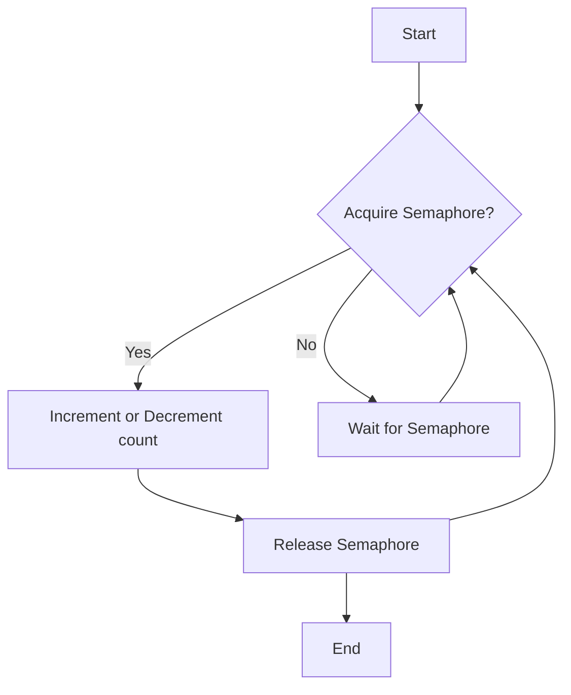
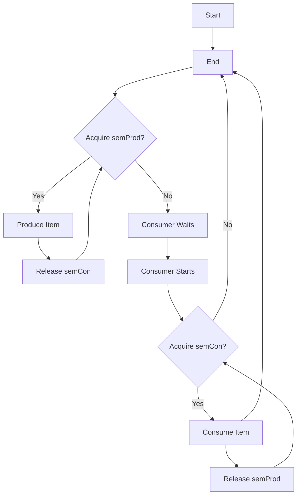
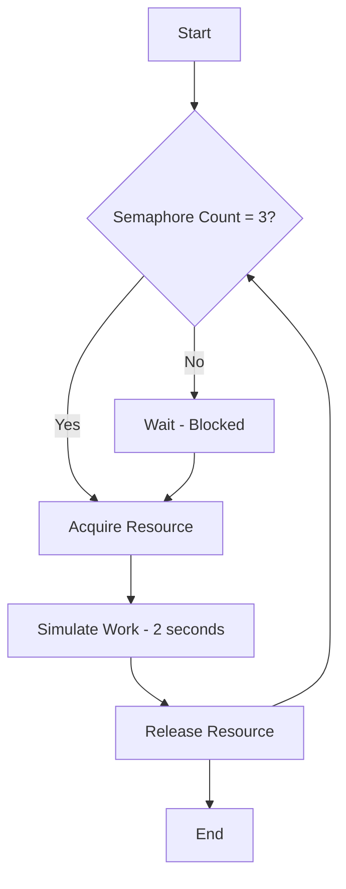
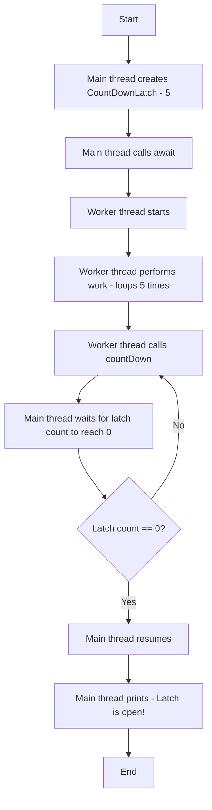
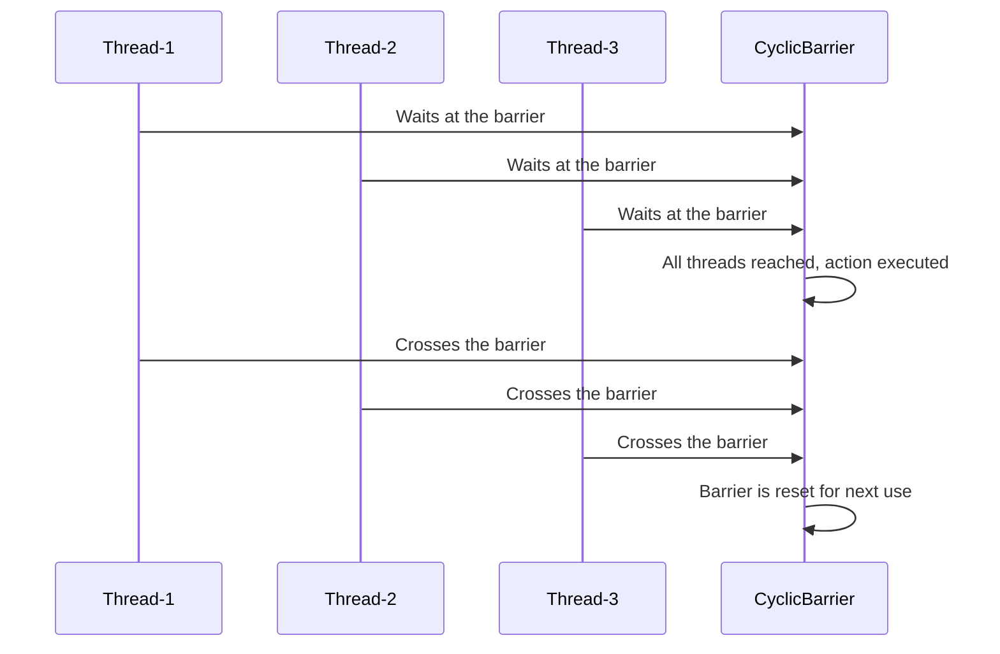
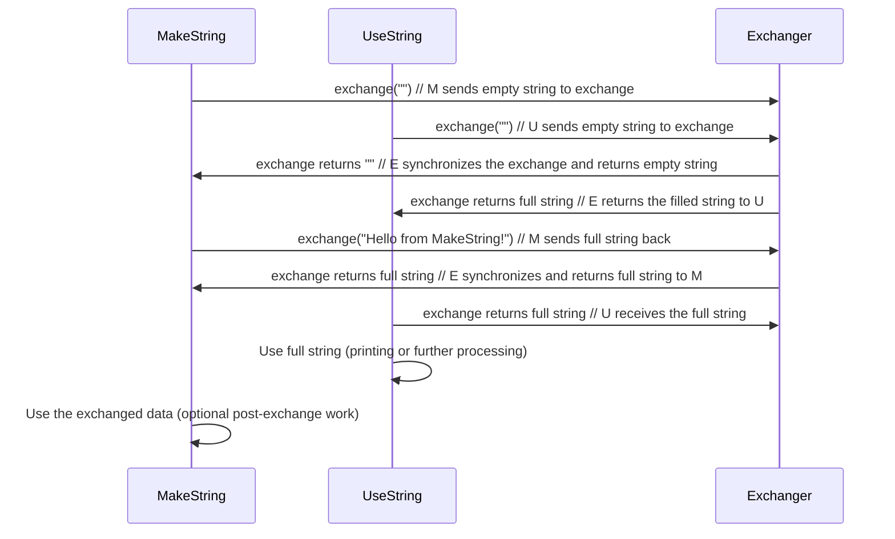
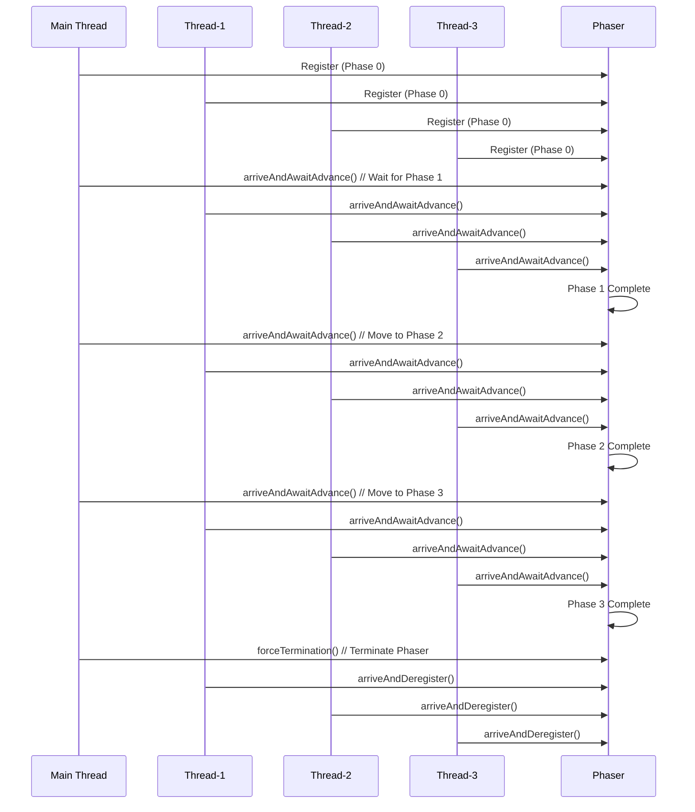
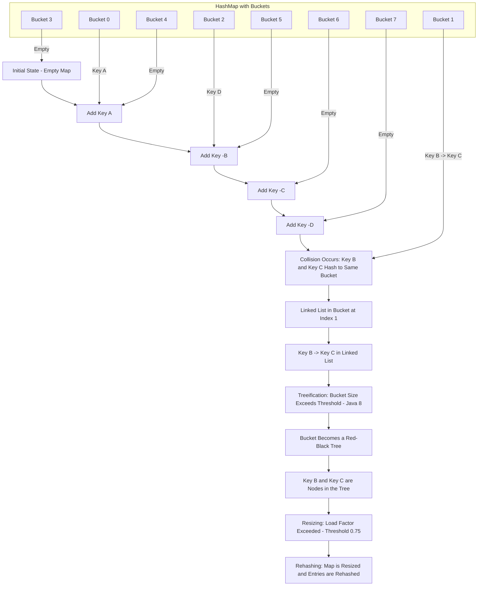

## Concurrency API

The concurrency utilities are contained in the java.util.concurrent package and in its two subpackages: **`java.util.concurrent.atomic`** and **`java.util.concurrent.locks`**.

### java.util.concurrent

**`java.util.concurrent`** defines the core features that support alternatives to the built-in approaches to synchronization and interthread communication. 

These include
- **`Synchronizers`**
- **`Executors`**
- **`Concurrent collections`**
- **`The Fork/Join Framework`**

Synchronizers offer high-level ways of synchronizing the interactions between multiple threads. The synchronizer classes defined by **`java.util.concurrent`** are

- **`Semaphore`**: Implement the classic Semaphore.
- **`CountDownLatch`**: Waits until a specified number of events have occured.
- **`CyclicBarrier`**: Enables a group of threads to wait at a predefined execution point.
- **`Exchanger`**: Exchanges data between two threads.
- **`Phaser`**: Synchronizes thread that advance through multiple phases of an operation.

**`Executors`** manage thread execution. At the top of the executor hierarchy is the **`Executor`** interface, which is used to initiate a thread. **`ExecutorService`** extends **`Executor`** and provides methods that manage execution. 

There are three implementations of **`ExecutorService`**: **`ThreadPoolExecutor`**, **`ScheduledThreadPoolExecutor`**, and **`ForkJoinPool`**. 

**`java.util.concurrent`** also defines the Executors utility class, which includes a number of static methods that simplify the creation of various executors.

Related to executors are the Future and **`Callable`** interfaces. A **`Future`** contains a value that is returned by a thread after it executes. Thus, its value becomes defined “in the future,” when the thread terminates. **`Callable`** defines a thread that returns a value.

**`java.util.concurrent`** defines several concurrent collection classes, including **`ConcurrentHashMap`**, **`ConcurrentLinkedQueue`**, and **`CopyOnWriteArrayList`**. These offer concurrent alternatives to their related classes defined by the Collections Framework.

The **`Fork/Join`** Framework supports parallel programming. Its main classes are **`ForkJoinTask`**, **`ForkJoinPool`**, **`RecursiveTask`**, and **`RecursiveAction`**.
To better handle thread timing, **`java.util.concurrent`** defines the TimeUnit enumeration.

---

Beginning with JDK 9, java.util.concurrent also includes a subsystem that offers a means by which the flow of data can be controlled. It is based on the Flow class and these nested interfaces: **`Flow.Subscriber`**, **`Flow.Publisher`**, **`Flow.Processor`**, and **`Flow.Subscription`**. Although a detailed discussion of the Flow subsystem is outside the focus of this chapter, here is a brief description. Flow and its nested interfaces support the reactive streams specification. This specification defines a means by which a consumer of data can prevent the producer of the data from overrunning the consumer’s ability to process the data. In this approach, data is produced by a publisher and consumed by a subscriber. Control is achieved by mplementing a form of back pressure.

### java.util.concurrent.atomic

**`java.util.concurrent.atomic`** facilitates the use of variables in a concurrent environment. It provides a means of efficiently updating the value of a variable without the use of locks. This is accomplished through the use of classes, such as **`AtomicInteger`** and AtomicLong, and methods, such as **`compareAndSet()`**, **`decrementAndGet()`**, and **`getAndSet()`**. These methods execute as a single, non interruptible operation.

### java.util.concurrent.locks

**`java.util.concurrent.locks`** provides an alternative to the use of synchronized methods. At the core of this alternative is the Lock interface, which defines the basic mechanism used to acquire and relinquish access to an object. The key methods are **`lock()`**, **`tryLock()`**, and **`unlock()`**. The advantage to using these methods is greater control over synchronization.

### Using Synchronization Objects
Synchronization objects are supported by the **`Semaphore`**, **`CountDownLatch`**, **`CyclicBarrier`**, **`Exchanger`**, and **`Phaser`** classes. Collectively, they enable you to handle several formerly difficult synchronization situations with ease. They are also applicable to a wide range of programs—even those that contain only limited concurrency. Because the synchronization objects will be of interest to nearly all Java programs, each is examined here in some detail.

### Semaphore
The synchronization object that many readers will immediately recognize is Semaphore, which implements a classic semaphore. A semaphore controls access to a shared resource through the use of a counter. If the counter is greater than zero, then access is allowed. If it is zero, then access is denied. What the counter is counting are permits that allow access to the shared resource. Thus, to access the resource, a thread must be granted a permit from the semaphore.

In general, to use a semaphore, the thread that wants access to the shared resource tries to acquire a permit. If the semaphore’s count is greater than zero, then the
thread acquires a permit, which causes the semaphore’s count to be decremented.

Otherwise, the thread will be blocked until a permit can be acquired. When the thread no longer needs access to the shared resource, it releases the permit, which causes the semaphore’s count to be incremented. If there is another thread waiting for a permit, then that thread will acquire a permit at that time. Java’s Semaphore class implements this mechanism.

Semaphore has the two constructors shown here:
- Semaphore(int num)
- Semaphore(int num, boolean how)

Here, num specifies the initial permit count. Thus, num specifies the number of threads that can access a shared resource at any one time. If num is one, then only one thread can access the resource at any one time. By default, waiting threads are granted a permit in an undefined order. By setting how to true, you can ensure that waiting threads are granted a permit in the order in which they requested access.

To acquire a permit, call the **`acquire()`** method, which has these two forms:
- void acquire() throws InterruptedException
    - The first form acquires one permit from the semaphore. 
    - If a permit is available the thread aquires it and continue execution.
    - If no permit is available the thread will block until a perimt become available.
  
- void acquire(int num) throws InterruptedException
    - The second form acquires a specified number of permits from the semaphore. Most often, the first form is used.
    - The thread will block until the requested number of perimts become available. 
    - If the requested number of perimts is greater than the available permits, the thread will wait until enough permits are available.
    - If the permit cannot be granted at the time of the call, then the invoking thread suspends until the permit is available.

To release a permit, call **`release()`**, which has these two forms:
- void release()
- void release(int num)
    - The first form releases one permit. 
    - The second form releases the number of permits specified by num.

To use a semaphore to control access to a resource, each thread that wants to use that resource must first call **`acquire()`** before accessing the resource. When the thread is done with the resource, it must call **`release()`**. 

Here is an example that illustrates the use of a semaphore:

A semaphore is used to control access to a shared resource (in this case, `Shared.count`) in a multithreaded environment. The program uses a semaphore to ensure that only one thread (either `IncThread` or `DecThread`) can access and modify the `count` variable at a time. This prevents simultaneous access to `Shared.count`, ensuring thread safety. 

Let’s break down the example and provide the code, followed by an explanation of how it works, as well as a Mermaid diagram to visualize the process.

### Java Code Example

Here's an implementation based on your description using a semaphore to synchronize access to a shared variable (`Shared.count`).

#### Java Code with Semaphore Example

```java
import java.util.concurrent.Semaphore;

class Shared {
    static int count = 0; // Shared resource
}

class IncThread extends Thread {
    private Semaphore semaphore;

    public IncThread(Semaphore semaphore) {
        this.semaphore = semaphore;
    }

    @Override
    public void run() {
        for (int i = 0; i < 5; i++) {
            try {
                semaphore.acquire(); // Acquire a permit to access Shared.count
                Shared.count++; // Increment the shared count
                System.out.println(Thread.currentThread().getName() + " increments count: " + Shared.count);
                Thread.sleep(500); // Simulate time taken to increment
            } catch (InterruptedException e) {
                Thread.currentThread().interrupt();
            } finally {
                semaphore.release(); // Release the permit
            }
        }
    }
}

class DecThread extends Thread {
    private Semaphore semaphore;

    public DecThread(Semaphore semaphore) {
        this.semaphore = semaphore;
    }

    @Override
    public void run() {
        for (int i = 0; i < 5; i++) {
            try {
                semaphore.acquire(); // Acquire a permit to access Shared.count
                Shared.count--; // Decrement the shared count
                System.out.println(Thread.currentThread().getName() + " decrements count: " + Shared.count);
                Thread.sleep(500); // Simulate time taken to decrement
            } catch (InterruptedException e) {
                Thread.currentThread().interrupt();
            } finally {
                semaphore.release(); // Release the permit
            }
        }
    }
}

public class SemaphoreExample {
    public static void main(String[] args) {
        Semaphore semaphore = new Semaphore(1); // Only 1 permit available, ensuring mutual exclusion
        Thread incThread = new IncThread(semaphore);
        Thread decThread = new DecThread(semaphore);

        incThread.start();
        decThread.start();
    }
}
```

### Explanation of the Code:
1. **Shared Class**: 
   - It contains the static variable `count` which is accessed and modified by both threads (`IncThread` and `DecThread`).
   
2. **Semaphore**:
   - A `Semaphore` is used to control access to `Shared.count`. It is initialized with a single permit (`new Semaphore(1)`), meaning that only one thread can access `Shared.count` at a time.

3. **IncThread**:
   - This thread increments the value of `Shared.count` five times. It first acquires the semaphore (`semaphore.acquire()`) before accessing `Shared.count`. After incrementing, it releases the semaphore (`semaphore.release()`).
   - A `Thread.sleep(500)` is used to simulate a delay in processing.

4. **DecThread**:
   - Similar to `IncThread`, this thread decrements the value of `Shared.count` five times while respecting the semaphore, ensuring it only modifies `count` when it holds the permit.

5. **Mutual Exclusion**:
   - The semaphore ensures that only one thread can increment or decrement `Shared.count` at a time, even though both threads are running concurrently. The threads alternate based on the availability of the semaphore.

### Output

The output might look something like this (though the exact order of execution can vary due to the nature of multithreading):
The output from the program is shown here. (The precise order in which the threads execute may vary.)

```
Thread-0 increments count: 1
Thread-1 decrements count: 0
Thread-0 increments count: 1
Thread-1 decrements count: 0
Thread-0 increments count: 1
Thread-1 decrements count: 0
Thread-0 increments count: 1
Thread-1 decrements count: 0
Thread-0 increments count: 1
Thread-1 decrements count: 0
```

- **Important Notes**:
  - The output will show that each thread (either `IncThread` or `DecThread`) completes its full series of operations before the other thread is allowed to access `Shared.count`.
  - Without the semaphore, the two threads would interleave, and you could observe incorrect values of `Shared.count` (such as incrementing and decrementing happening simultaneously).

### Mermaid Diagram

Here’s a **Mermaid** diagram to illustrate how the semaphore controls the access to `Shared.count`.



### Explanation of the Mermaid Diagram:
- **Start**: The program begins, and the threads are ready to run.
- **Acquire Semaphore?**: The thread checks whether it can acquire the semaphore. If the semaphore is available (permit is free), the thread proceeds.
  - **Yes**: The thread accesses and modifies `Shared.count` (either increment or decrement).
  - **No**: If the semaphore is not available, the thread waits (blocks) until it can acquire the permit.
- **Release Semaphore**: After modifying `Shared.count`, the thread releases the semaphore, making the permit available for other threads.
- **End**: The process ends when both threads finish their respective tasks.

### Conclusion

This example demonstrates the use of a semaphore to ensure mutual exclusion in a multithreaded Java application. The semaphore prevents both threads from accessing `Shared.count` at the same time, ensuring thread safety and the correct sequencing of operations. The use of `sleep()` within each thread proves that access to `Shared.count` is synchronized — only one thread at a time can modify the shared resource.

The program uses a semaphore to control access to the count variable, which is a static variable within the Shared class. Shared.count is incremented five times by the run() method of IncThread and decremented five times by DecThread. To prevent these two threads from accessing Shared.count at the same time, access is allowed only after a permit is acquired from the controlling semaphore. After access is complete, the permit is released. In this way, only one thread at a time will access Shared.count, as the output shows.

In both IncThread and DecThread, notice the call to sleep() within run(). It is used to “prove” that accesses to Shared.count are synchronized by the semaphore.
In **`run()`**, the call to sleep() causes the invoking thread to pause between each access to Shared.count. This would normally enable the second thread to run.

However, because of the semaphore, the second thread must wait until the first has released the permit, which happens only after all accesses by the first thread are complete. Thus, Shared.count is incremented five times by IncThread and decremented five times by DecThread. The increments and decrements are not intermixed.

Without the use of the semaphore, accesses to Shared.count by both threads would have occurred simultaneously, and the increments and decrements would be intermixed. To confirm this, try commenting out the calls to acquire() and **`release()`**. When you run the program, you will see that access to Shared.count is no longer synchronized, and each thread accesses it as soon as it gets a timeslice.

Although many uses of a semaphore are as straightforward as that shown in the preceding program, more intriguing uses are also possible. Here is an example. The following program reworks the producer/consumer program shown in Chapter 11 so that it uses two semaphores to regulate the producer and consumer threads, ensuring that each call to **`put()`** is followed by a corresponding call to get():

- A portion of the output is shown here:

As you can see, the calls to **`put()`** and **`get()`** are synchronized. That is, each call to put() is followed by a call to **`get()`** and no values are missed. Without the semaphores, multiple calls to **`put()`** would have occurred without matching calls to get(), resulting in values being missed. (To prove this, remove the semaphore code and observe the results.)
The sequencing of **`put()`** and **`get()`** calls is handled by two semaphores: semProd and semCon. Before **`put()`** can produce a value, it must acquire a permit from semProd. After it has set the value, it releases semCon. Before **`get()`** can consume a value, it must acquire a permit from semCon. After it consumes the value, it releases semProd. This “give and take” mechanism ensures that each call to **`put()`** must be followed by a call to get().

Notice that semCon is initialized with no available permits. This ensures that put() executes first. The ability to set the initial synchronization state is one of the more powerful aspects of a semaphore.

In this case, we are reworking the **Producer-Consumer** problem using two semaphores to synchronize the `put()` and `get()` methods. The main idea is to ensure that each `put()` operation is followed by a corresponding `get()` operation, with no `put()`s occurring without a matching `get()`.

### Explanation of Semaphores
- **`semProd`**: Controls the producer thread (how many items are available to produce). It's initialized to 1, allowing the producer to run when it needs to produce.
- **`semCon`**: Controls the consumer thread (ensures that there is at least one item to consume). It’s initialized to 0, meaning the consumer is initially blocked and the producer must produce something first.

The synchronization is achieved by having the **producer** acquire a permit from `semProd` before producing an item, and the **consumer** acquire a permit from `semCon` before consuming an item. After the producer produces an item, it releases `semCon` so the consumer can proceed, and after the consumer consumes an item, it releases `semProd` to allow the producer to produce again.

Here’s the Java implementation of this problem:

### Java Code Example (Producer-Consumer using Semaphores)

```java
import java.util.concurrent.Semaphore;

class SharedBuffer {
    static int item = -1; // Shared resource between producer and consumer
}

class Producer extends Thread {
    private Semaphore semProd;
    private Semaphore semCon;

    public Producer(Semaphore semProd, Semaphore semCon) {
        this.semProd = semProd;
        this.semCon = semCon;
    }

    @Override
    public void run() {
        for (int i = 0; i < 5; i++) {
            try {
                semProd.acquire();  // Ensure producer runs first, control synchronization
                SharedBuffer.item = i; // Produce the item (for simplicity, just storing an integer)
                System.out.println("Produced: " + SharedBuffer.item);
                semCon.release();  // Allow the consumer to consume the item
                Thread.sleep(1000); // Simulate time taken to produce
            } catch (InterruptedException e) {
                Thread.currentThread().interrupt();
            }
        }
    }
}

class Consumer extends Thread {
    private Semaphore semProd;
    private Semaphore semCon;

    public Consumer(Semaphore semProd, Semaphore semCon) {
        this.semProd = semProd;
        this.semCon = semCon;
    }

    @Override
    public void run() {
        for (int i = 0; i < 5; i++) {
            try {
                semCon.acquire();  // Ensure consumer can only run after producer
                System.out.println("Consumed: " + SharedBuffer.item);
                semProd.release();  // Allow the producer to produce the next item
                Thread.sleep(1000); // Simulate time taken to consume
            } catch (InterruptedException e) {
                Thread.currentThread().interrupt();
            }
        }
    }
}

public class ProducerConsumerWithSemaphores {
    public static void main(String[] args) {
        Semaphore semProd = new Semaphore(1); // Semaphore for producer (initially 1)
        Semaphore semCon = new Semaphore(0); // Semaphore for consumer (initially 0, to block consumer initially)

        // Create and start producer and consumer threads
        Thread producer = new Producer(semProd, semCon);
        Thread consumer = new Consumer(semProd, semCon);

        producer.start();
        consumer.start();
    }
}
```

### Key Concepts and Steps in the Code:
1. **Shared Resource**:
   - `SharedBuffer` contains a static variable `item` which represents the item being produced and consumed.
   
2. **Producer Thread**:
   - The producer acquires a permit from `semProd` before producing an item. This ensures that the producer operates when necessary.
   - Once the producer has produced an item, it releases a permit for `semCon`, allowing the consumer to consume the item.
   
3. **Consumer Thread**:
   - The consumer acquires a permit from `semCon` before consuming an item. This ensures that the consumer waits until there’s an item to consume.
   - After consuming the item, the consumer releases a permit for `semProd`, allowing the producer to produce the next item.
   
4. **Initialization of Semaphores**:
   - `semProd` is initialized with 1, indicating that the producer can initially produce.
   - `semCon` is initialized with 0, ensuring the consumer waits for the producer to produce the first item.

### Output Example

The output might look like this:

```
Produced: 0
Consumed: 0
Produced: 1
Consumed: 1
Produced: 2
Consumed: 2
Produced: 3
Consumed: 3
Produced: 4
Consumed: 4
```

- The output confirms that each `put()` (production) is followed by a corresponding `get()` (consumption) with no values skipped or interleaved.
- The `Produced: x` and `Consumed: x` messages show the synchronization in action. The consumer waits for the producer to finish producing before consuming.

### Mermaid Diagram to Visualize the Producer-Consumer Workflow

Here’s a **Mermaid** diagram that visualizes the flow of the producer and consumer threads using semaphores:



### Diagram Explanation:
- **Producer**: 
  - The producer waits until it acquires a permit from `semProd`, then produces an item, releases `semCon` (to signal the consumer), and repeats.
- **Consumer**: 
  - The consumer waits until it acquires a permit from `semCon`, then consumes the item, releases `semProd` (to allow the producer to produce), and repeats.

### Conclusion:
In this producer-consumer problem, semaphores are used to ensure synchronization between the `put()` and `get()` operations. By using two semaphores (`semProd` and `semCon`), we ensure that each `put()` operation is followed by a corresponding `get()`. This avoids the potential for missed values or interleaving operations that could occur in an unsynchronized environment.

In Java, you can use the `Semaphore` class from the `java.util.concurrent` package to manage access to shared resources. Below is a simple example of how you can implement a semaphore in Java and how to visualize the process using a Mermaid diagram.

### Java Example with Semaphore

Here is a simple Java program that uses a `Semaphore` to control access to a shared resource with a maximum of 3 available permits (resources).

#### Java Code Example
```java
import java.util.concurrent.Semaphore;

public class SemaphoreExample {

    // Create a semaphore with 3 permits (resources)
    private static final Semaphore semaphore = new Semaphore(3);

    public static void main(String[] args) {
        // Create and start 5 threads
        for (int i = 0; i < 5; i++) {
            Thread thread = new Thread(new Task("Thread-" + (i + 1)));
            thread.start();
        }
    }

    // Task to simulate resource access
    static class Task implements Runnable {
        private String threadName;

        public Task(String threadName) {
            this.threadName = threadName;
        }

        @Override
        public void run() {
            try {
                // Thread tries to acquire a permit (resource)
                System.out.println(threadName + " is waiting to access the resource.");
                semaphore.acquire();
                System.out.println(threadName + " has acquired the resource.");

                // Simulate work with the resource
                Thread.sleep(2000); // Simulating resource access time

                // Release the permit (resource)
                System.out.println(threadName + " has released the resource.");
                semaphore.release();

            } catch (InterruptedException e) {
                Thread.currentThread().interrupt();
            }
        }
    }
}
```

### Explanation of the Java Code:
1. **Semaphore Initialization**: 
   - `Semaphore semaphore = new Semaphore(3);` initializes the semaphore with 3 permits, meaning only 3 threads can access the resource simultaneously.
2. **Thread Creation**: 
   - The `main` method creates 5 threads (`Thread-1` to `Thread-5`) that each run the `Task` class.
3. **Acquire the Semaphore**: 
   - Each thread calls `semaphore.acquire()` to request access to the resource. If all 3 permits are taken, any additional threads will block until a permit is released.
4. **Simulate Work**: 
   - After acquiring the permit, each thread simulates accessing the resource by sleeping for 2 seconds.
5. **Release the Semaphore**: 
   - Once done, each thread calls `semaphore.release()` to return the permit and allow other threads to acquire it.

### Mermaid Diagram Representation

Here is a **Mermaid** diagram that illustrates the flow of the semaphore mechanism in Java. It shows how threads request and release resources based on the semaphore count.



### Diagram Explanation:
- **Start**: The program starts, and multiple threads are created.
- **Semaphore Count = 3?**: Check whether there are any available permits.
  - **Yes**: If the semaphore has available permits, the thread acquires the resource.
  - **No**: If the semaphore count is 0, the thread is blocked (waits) until a permit becomes available.
- **Simulate Work**: After acquiring the resource, the thread simulates some work (in this case, sleeping for 2 seconds).
- **Release Resource**: After completing its work, the thread releases the permit, making it available for other threads.
- **End**: The process ends when all threads finish executing.

### Conclusion:
This Java example and the accompanying Mermaid diagram show how a semaphore can be used to manage access to a resource in a concurrent program, ensuring that only a limited number of threads can access the resource at any given time.

---

### CountDownLatch
Sometimes you will want a thread to wait until one or more events have occurred. To handle such a situation, the concurrent API supplies CountDownLatch. A CountDownLatch is initially created with a count of the number of events that must occur before the latch is released. Each time an event happens, the count is decremented. When the count reaches zero, the latch opens.

CountDownLatch has the following constructor:
- CountDownLatch(int num)

Here, num specifies the number of events that must occur in order for the latch to open.

To wait on the latch, a thread calls await(), which has the forms shown here:
- void await( ) throws InterruptedException
      - The first form waits until the count associated with the invoking CountDownLatch reaches zero. If the count is already zero, the method returns immidietely.

- boolean await(long wait, TimeUnit tu) throws InterruptedException
    - The second form waits only for the period of time specified by wait.
    - The units represented by wait are specified by tu, which is an object the **`TimeUnit`** enumeration. It returns `false` if the time limit is reached and `true` if the countdown reaches zero.

To signal an event, call the **`countDown()`** method, shown next:
- void countDown()
    - Each call to **`countDown()`** decrements the count associated with the invoking object.
    - It is used to decrement the count of the latch by 1.
    - If the count becomes zero (meaning all tasks are completed) all waiting threads are released.
  
Inside **`main()`**, a CountDownLatch called cdl is created with an initial count of five. Next, an instance of MyThread is created, which begins execution of a new
thread. Notice that cdl is passed as a parameter to MyThread’s constructor and stored in the latch instance variable. Then, the main thread calls **`await()`** on cdl, which causes execution of the main thread to pause until cdl’s count has been decremented five times.

Inside the **`run()`** method of MyThread, a loop is created that iterates five times.

With each iteration, the **`countDown()`** method is called on latch, which refers to cdl in main()`**. After the fifth iteration, the latch opens, which allows the main thread to
resume.

CountDownLatch is a powerful yet easy-to-use synchronization object that is appropriate whenever a thread must wait for one or more events to occur.

---
The `CountDownLatch` is a useful synchronization aid in Java that allows one or more threads to wait for a set of events to occur before proceeding. It is especially helpful in situations where you want to wait for multiple tasks to complete before allowing further processing in the main thread or another part of your application.

### Explanation of CountDownLatch

- **Constructor**: 
   - `CountDownLatch(int num)` — This constructor creates a `CountDownLatch` with a count of `num`, which specifies how many events need to occur before the latch opens.
   
- **Methods**:
  - `void await() throws InterruptedException` — This method causes the calling thread to wait until the count of the latch reaches zero. If the latch is already at zero, the thread continues immediately.
  - `boolean await(long wait, TimeUnit tu) throws InterruptedException` — This version of `await()` waits for the latch to reach zero or the specified time to elapse. If the latch opens before the timeout, it returns `true`; otherwise, it returns `false`.
  - `void countDown()` — This method is called to signal that one event has occurred. Each call to `countDown()` decrements the latch's count by one.

When the count reaches zero, all waiting threads are released.

### Java Example Using CountDownLatch

The following example demonstrates the use of `CountDownLatch` to synchronize threads. The main thread waits for 5 events (simulated by the worker thread), after which the latch opens and the main thread proceeds.

#### Code Example

```java
import java.util.concurrent.CountDownLatch;

class MyThread extends Thread {
    private CountDownLatch latch;

    public MyThread(CountDownLatch latch) {
        this.latch = latch;
    }

    @Override
    public void run() {
        for (int i = 0; i < 5; i++) {
            try {
                // Simulate some work by the thread
                System.out.println("Thread working: " + (i + 1));
                Thread.sleep(1000); // Simulating time taken for each event
            } catch (InterruptedException e) {
                Thread.currentThread().interrupt();
            }
            latch.countDown(); // Signal that one event has occurred
        }
    }
}

public class CountDownLatchExample {
    public static void main(String[] args) {
        // Create a CountDownLatch with a count of 5
        CountDownLatch cdl = new CountDownLatch(5);

        // Start the worker thread
        MyThread worker = new MyThread(cdl);
        worker.start();

        try {
            // Main thread waits until the latch's count reaches 0
            System.out.println("Main thread is waiting for the latch to open...");
            cdl.await(); // The main thread waits here until the latch count reaches 0
            System.out.println("Main thread resumed, latch is open!");
        } catch (InterruptedException e) {
            Thread.currentThread().interrupt();
        }
    }
}
```

### How It Works:
1. **Main Thread (`CountDownLatchExample`)**:
   - A `CountDownLatch` (`cdl`) is created with an initial count of `5`, meaning it needs five events (calls to `countDown()`) before it opens.
   - The main thread calls `cdl.await()`, which makes it wait until the latch count reaches zero.

2. **Worker Thread (`MyThread`)**:
   - This thread simulates some work (for example, by calling `Thread.sleep(1000)` to simulate delays).
   - After each iteration, the worker thread calls `latch.countDown()`, decrementing the count of the latch.
   - After five iterations, the latch count becomes zero, and the main thread can resume.

3. **Synchronization**:
   - The main thread will not continue until all five events have been signaled by `countDown()` calls in the worker thread. Only when the latch count reaches zero will the main thread resume execution and print "Main thread resumed, latch is open!".

### Output Example

```
Main thread is waiting for the latch to open...
Thread working: 1
Thread working: 2
Thread working: 3
Thread working: 4
Thread working: 5
Main thread resumed, latch is open!
```

### Key Points:
- **`await()`**: The main thread will block here and wait until the latch count is decremented to zero by the worker thread.
- **`countDown()`**: The worker thread calls `countDown()` five times to signal that it has completed a part of its work.
- The main thread only resumes after all five events are signaled by the worker thread.
- **Thread Coordination**: This mechanism ensures that the main thread synchronizes with the completion of events in the worker thread.

### Example With TimeOut

You can also use the timed version of `await()`, which allows the main thread to wait for a specified amount of time before either resuming (if the latch count reaches zero) or continuing due to the timeout.

```java
cdl.await(2, TimeUnit.SECONDS); // Wait for a maximum of 2 seconds
```

This would wait up to 2 seconds for the latch count to reach zero. If the latch doesn’t reach zero within that time, the method will return `false` and the main thread will continue.

### Use Cases for CountDownLatch:
- **Parallel Task Completion**: Waiting for multiple threads to finish their work before proceeding with the next task (like in map-reduce frameworks).
- **Testing**: Waiting for all parts of a test to be set up before starting the test.
- **Event-driven Synchronization**: Waiting for one or more events to occur in concurrent applications (e.g., waiting for responses from multiple external services).

### Summary:
The `CountDownLatch` is a powerful synchronization mechanism that enables a thread to wait for multiple events to occur before continuing. It’s simple to use, and the decrementing mechanism ensures threads are coordinated effectively.

---
Here is the flow of the `CountDownLatch` in the example.



### Explanation of the Diagram:

1. **Start**: The program starts.
2. **Main thread creates `CountDownLatch`**: The main thread creates a `CountDownLatch` with a count of 5.
3. **Main thread calls `await()`**: The main thread calls `await()`, which causes it to wait until the latch count reaches zero.
4. **Worker thread starts**: The worker thread starts and begins its work (looping 5 times).
5. **Worker thread performs work**: Each iteration of the loop simulates some work being done by the worker thread.
6. **Worker thread calls `countDown()`**: After completing each iteration, the worker thread calls `countDown()` to decrement the latch count.
7. **Main thread waits**: The main thread is blocked at the `await()` call, waiting for the latch count to reach 0.
8. **Latch count check**: The main thread checks if the latch count has reached 0. If not, it continues waiting for the worker thread to call `countDown()`.
9. **Main thread resumes**: Once the latch count reaches 0, the main thread is unblocked and resumes execution.
10. **Main thread prints**: The main thread prints "Latch is open!" to indicate that it has resumed after the latch count reached zero.
11. **End**: The program ends.

---

### CyclicBarrier

A situation not uncommon in concurrent programming occurs when a set of two or more threads must wait at a predetermined execution point until all threads in the set have reached that point. To handle such a situation, the concurrent API supplies the CyclicBarrier class. It enables you to define a synchronization object that suspends until the specified number of threads has reached the barrier point.

**Enables a group of threads to wait at a predefined execution point.**

- CyclicBarrier has the following two constructors:
    - CyclicBarrier(int numThreads)
    - CyclicBarrier(int numThreads, Runnable action)

        - Here, numThreads specifies the number of threads that must reach the barrier before execution continues. 
        - In the second form, action specifies a thread that will be executed when the barrier is reached.

Here is the general procedure that you will follow to use CyclicBarrier. First, create a CyclicBarrier object, specifying the number of threads that you will be waiting for. Next, when each thread reaches the barrier, have it call **`await()`** on that object. This will pause execution of the thread until all of the other threads also call **`await()`**. Once the specified number of threads has reached the barrier, await()`** will return and execution will resume. Also, if you have specified an action, then that thread is executed.

The await() method has the following two forms:
- int await() throws InterruptedException, BrokenBarrierException
- int await(long wait, TimeUnit tu) throws InterruptedException, BrokenBarrierException, TimeoutException

    - The first form waits until all the threads have reached the barrier point. 
    - The second form waits only for the period of time specified by wait. The units represented by wait are specified by tu.
    - Both forms return a value that indicates the order that the threads arrive at the barrier point. The first thread returns a value equal to the number of threads waited upon minus one. The last thread returns zero.

A CyclicBarrier can be reused because it will release waiting threads each time the specified number of threads calls **`await()`**. 

---

The `CyclicBarrier` class in Java is a useful tool in concurrent programming to coordinate multiple threads. It allows threads to wait for each other at a specific point, which is referred to as the "barrier". Once all threads have reached the barrier, they are released to continue executing.

### Key Concepts

1. **CyclicBarrier Constructor**:
   - **CyclicBarrier(int numThreads)**: Creates a barrier that waits for `numThreads` to reach it before proceeding.
   - **CyclicBarrier(int numThreads, Runnable action)**: Similar to the above, but additionally executes the provided `Runnable` action once the barrier is tripped.

2. **await() Method**:
   - **int await() throws InterruptedException, BrokenBarrierException**: Waits until all threads reach the barrier. It returns an integer indicating the thread's position at the barrier.
   - **int await(long wait, TimeUnit unit) throws InterruptedException, BrokenBarrierException, TimeoutException**: Waits for a specified time before proceeding, throwing an exception if the time expires.

3. **Return Values**: The `await()` method returns an integer indicating the order in which threads reached the barrier:
   - The first thread to reach the barrier returns the number of threads waiting.
   - The last thread to reach the barrier (the one that trips it) returns `0`.
   
4. **Reusability**: After all threads reach the barrier, it can be reused by invoking `await()` again. This is what makes it "cyclic" — it can be reused multiple times in the same program.

### Example

Here’s an example demonstrating the usage of `CyclicBarrier` with 3 threads:

```java
import java.util.concurrent.*;

public class CyclicBarrierExample {
    public static void main(String[] args) {
        // Define the number of threads that need to reach the barrier
        int numThreads = 3;
        
        // Create a CyclicBarrier with a Runnable action
        CyclicBarrier barrier = new CyclicBarrier(numThreads, new Runnable() {
            @Override
            public void run() {
                System.out.println("All threads have reached the barrier. The action is executed!");
            }
        });

        // Create and start 3 threads
        for (int i = 0; i < numThreads; i++) {
            new Thread(new Task(barrier)).start();
        }
    }
}

class Task implements Runnable {
    private CyclicBarrier barrier;

    public Task(CyclicBarrier barrier) {
        this.barrier = barrier;
    }

    @Override
    public void run() {
        try {
            // Simulate some work by the thread
            System.out.println(Thread.currentThread().getName() + " is working.");
            Thread.sleep((int) (Math.random() * 1000));

            // Each thread reaches the barrier and waits
            System.out.println(Thread.currentThread().getName() + " is waiting at the barrier.");
            barrier.await();  // This causes the thread to wait until all threads reach the barrier

            // After all threads pass the barrier
            System.out.println(Thread.currentThread().getName() + " has crossed the barrier.");
        } catch (InterruptedException | BrokenBarrierException e) {
            e.printStackTrace();
        }
    }
}
```

### Output
The output will vary, but it should follow this basic structure:
```
Thread-0 is working.
Thread-1 is working.
Thread-2 is working.
Thread-0 is waiting at the barrier.
Thread-1 is waiting at the barrier.
Thread-2 is waiting at the barrier.
All threads have reached the barrier. The action is executed!
Thread-0 has crossed the barrier.
Thread-1 has crossed the barrier.
Thread-2 has crossed the barrier.
```

### Explanation:
- The `barrier.await()` call inside each thread causes it to wait until all threads reach the barrier.
- Once all threads reach the barrier, the `Runnable` action provided during the `CyclicBarrier` creation is executed, which prints "All threads have reached the barrier..."
- After the action is executed, all threads continue their execution after crossing the barrier.

### Reusability
You can reuse a `CyclicBarrier` in the same program to synchronize threads at multiple points. This is especially useful when you have multiple phases or rounds of processing that need to be synchronized across threads.

To demonstrate reusability, you could modify the `main()` method to call the barrier in multiple rounds:

```java
public class CyclicBarrierExample {
    public static void main(String[] args) {
        int numThreads = 3;

        // Create a CyclicBarrier with a Runnable action
        CyclicBarrier barrier = new CyclicBarrier(numThreads, new Runnable() {
            @Override
            public void run() {
                System.out.println("All threads have reached the barrier. The action is executed!");
            }
        });

        // Create and start 3 threads
        for (int i = 0; i < numThreads; i++) {
            new Thread(new Task(barrier)).start();
        }

        // Simulate a second round of synchronization
        try {
            Thread.sleep(2000);  // Give threads time to complete their first round
            System.out.println("Reusing the barrier for another round of synchronization.");
            for (int i = 0; i < numThreads; i++) {
                new Thread(new Task(barrier)).start();
            }
        } catch (InterruptedException e) {
            e.printStackTrace();
        }
    }
}
```

This will cause a second round of synchronization after the first one completes. Each round will print the message from the action when all threads arrive at the barrier.

### Conclusion:
The `CyclicBarrier` class is a powerful tool in Java for managing thread synchronization at specific points in time. It simplifies the process of waiting for multiple threads to reach a certain point, and it can be reused for multiple synchronization phases, making it ideal for scenarios where threads need to be synchronized in rounds or stages.

Mermaid diagrams are a great way to visualize processes and structures, and can be used to represent things like flowcharts, Gantt charts, or sequence diagrams. In the context of the `CyclicBarrier` example you provided, we can create a simple **sequence diagram** to represent how threads interact with the `CyclicBarrier`.

Here’s a diagram for a simple sequence of threads interacting with a `CyclicBarrier`:



### Explanation:
- **Thread-1**, **Thread-2**, and **Thread-3** all wait at the `CyclicBarrier` (B) until all threads have reached the barrier.
- Once all threads are at the barrier, the action defined in the `CyclicBarrier` is executed.
- After the action completes, all threads cross the barrier and continue execution.
- The barrier is reset and ready for reuse for the next round of synchronization if needed.

---

Here’s a comparison between `CountDownLatch` and `CyclicBarrier` in tabular form to highlight the key differences and use cases:

| **Feature**                        | **CountDownLatch**                              | **CyclicBarrier**                             |
|------------------------------------|------------------------------------------------|----------------------------------------------|
| **Purpose**                        | Used to make threads wait until a certain count reaches zero. | Used to synchronize threads at a common barrier point for each phase. |
| [**Use Case**](#)                       | One-time synchronization for waiting for other threads to complete tasks. | Repeated synchronization of threads at a barrier, typically for multiple phases. |
| **Behavior**                       | Blocks threads until the latch count reaches zero. Once counted down, it cannot be reused. | Blocks threads at a specified barrier point. After a barrier is released, it can be reused. |
| [**Reusability**](#)                   | **Non-reusable**: Once the count reaches zero, it cannot be reset or reused. | **Reusable**: The barrier can be reused for multiple phases or cycles. |
| **Constructor**                    | `CountDownLatch(int count)`                    | `CyclicBarrier(int parties)`                  |
| [**Count/Parties**](#)                 | Number of threads to wait for (specified during construction). | Number of parties (threads) that must arrive at the barrier before it is released. |
| **Wait Method**                    | `await()` — threads wait until the latch count reaches zero. | `await()` — threads wait until all parties arrive at the barrier. |
| **Action After Countdown/Barrier** | No action can be triggered directly after countdown. | Can execute a barrier action after the barrier is released. |
| **Behavior After Countdown**       | After the count reaches zero, all waiting threads are released. No further interaction is possible with the latch. | Once the barrier is broken (all threads arrive), threads are released, and the barrier can be reused. |
| [**Main Use Case**](#)               | One-time event completion synchronization (e.g., waiting for workers to complete before proceeding). | Multi-phase synchronization (e.g., parallel computation where threads need to sync at multiple points). |
| **Interruptions**                  | Can be interrupted while waiting with `await()`. | Can also be interrupted during the `await()` phase. |
| **Exception Handling**             | Throws `InterruptedException` if the thread is interrupted while waiting. | Throws `InterruptedException` if the thread is interrupted while waiting. |
| **Example Use Case**               | Waiting for all threads to finish processing before moving on (e.g., after all database operations complete). | Performing parallel computations across threads that need to synchronize at multiple phases (e.g., in a parallel algorithm with multiple stages). |

### Key Differences in Behavior:

1. **One-time vs. Reusable**:  
   - **`CountDownLatch`** is for one-time synchronization. Once the count reaches zero, the latch cannot be reused.
   - **`CyclicBarrier`** is reusable and is typically used for multiple synchronization phases, with the barrier being reset after each phase.

2. **Phase-Specific Synchronization**:
   - **`CountDownLatch`** simply waits until a specified number of threads have finished their work, and it doesn’t deal with multiple phases.
   - **`CyclicBarrier`** allows for multiple phases of synchronization. Each time all threads reach the barrier, they are released and can move on to the next phase.

### When to Use Each:
- **Use `CountDownLatch`** when you need to wait for a specific number of events to occur before proceeding, and you don't need to reuse the synchronization mechanism (e.g., waiting for several threads to finish their tasks).
- **Use `CyclicBarrier`** when you need to coordinate a set of threads that need to synchronize at multiple points during execution (e.g., multiple rounds of parallel processing).

---

### Exchanger

Perhaps the most interesting of the synchronization classes is Exchanger. It is designed to simplify the exchange of data between two threads. 

The operation of an Exchanger is astoundingly simple: it simply waits until two separate threads call its **`exchange()`** method. When that occurs, it exchanges the data supplied by the threads. This mechanism is both elegant and easy to use. Uses for Exchanger are easy to imagine. 

For example, one thread might prepare a buffer for receiving information over a network connection. Another thread might fill that buffer with the information from the connection. The two threads work together so that each time a new buffer is needed, an exchange is made.

Exchanger is a generic class that is declared as shown here:

#### Exchanger<V>
   
Here, V specifies the type of the data being exchanged.

The only method defined by Exchanger is exchange( ), which has the two forms shown here:

- V exchange(V objRef) throws InterruptedException

    Here, objRef is a reference to the data to exchange. The data received from the other thread is returned.

    - It causes the current thread to block until the prtner thread arrives at the exchange point.
    - Once both threads have arrives, they exchange their data, and the method returns the object provided by the partner thread.
    - If the partner thread is not ready to exchange, the current thread blocked until the partner arrives.

- V exchange(V objRef, long wait, TimeUnit tu) throws InterruptedException, TimeoutException

    - The second form of **`exchange()`** allows a time-out period to be specified.
    - The key point about exchange() is that it won’t succeed until it has been called on the same Exchanger object by two separate threads. Thus, **`exchange()`** synchronizes the exchange of the data.
    - This method allows for a specified time-out period for the exchange opertion.
    - It causes the current thread to block until the prtner thread arrives at the exchange point or until the specified timeout elapse.
    - The objRef parameter specifieds the object to be exchanged and the timeout parameter specifies the maximum time the thread should wait.
    - The tu parameter specifieds the TimeUnit for the timeout.
      
Here is an example that demonstrates Exchanger. It creates two threads. One thread creates an empty buffer that will receive the data put into it by the second thread. In this case, the data is a string. Thus, the first thread exchanges an empty string for a full one. Here is the output produced by the program:

In the program, the **`main()`** method creates an Exchanger for strings. This object is then used to synchronize the exchange of strings between the MakeString and UseString classes. The MakeString class fills a string with data. The UseString exchanges an empty string for a full one. It then displays the contents of the newly constructed string. The exchange of empty and full buffers is synchronized by the **`exchange()`** method, which is called by both classes’ **`run()`** method.

---

The **`Exchanger`** class in Java provides a straightforward way to synchronize two threads by allowing them to exchange data. Both threads involved must call the **`exchange()`** method on the same **`Exchanger`** object. The method does not return until both threads have called it, at which point the data is exchanged between them.

### Key Concepts of `Exchanger`
1. **Generics**: `Exchanger` is a generic class, meaning you can specify the type of data exchanged. For example, `Exchanger<String>` will exchange `String` objects.
   
2. **Methods**:
   - **`exchange(V objRef)`**: This method waits for another thread to call `exchange()` and then exchanges the data provided by both threads.
   - **`exchange(V objRef, long wait, TimeUnit tu)`**: Similar to the first method but allows specifying a timeout. The method throws a `TimeoutException` if the exchange isn't completed within the given time.

3. **Synchronization**: The `exchange()` method will block until both threads have called it. This ensures that both threads exchange their data simultaneously.

### Example of Using `Exchanger`

Let's look at an example where one thread (`MakeString`) fills a string with some content, and another thread (`UseString`) waits to exchange an empty string for the filled one. The `Exchanger` synchronizes the data transfer between them.

#### Example Code:

```java
import java.util.concurrent.*;

class MakeString implements Runnable {
    private Exchanger<String> exchanger;

    public MakeString(Exchanger<String> exchanger) {
        this.exchanger = exchanger;
    }

    @Override
    public void run() {
        try {
            // Prepare the string to exchange
            String str = "Hello from MakeString!";
            System.out.println("MakeString: Preparing the string.");
            
            // Exchange the empty string for the full one
            String exchangedStr = exchanger.exchange("");  // Send an empty string
            System.out.println("MakeString: Exchanged empty string for filled string: " + str);
            // You can now use the exchanged string (if needed)
            
            // Send back the filled string
            exchanger.exchange(str);
        } catch (InterruptedException e) {
            e.printStackTrace();
        }
    }
}

class UseString implements Runnable {
    private Exchanger<String> exchanger;

    public UseString(Exchanger<String> exchanger) {
        this.exchanger = exchanger;
    }

    @Override
    public void run() {
        try {
            // Exchange an empty string with the filled one
            String str = exchanger.exchange("");  // Expects an empty string to be filled
            System.out.println("UseString: Received string: " + str);
            
            // After the exchange, the string will be used here (could be further processing)
        } catch (InterruptedException e) {
            e.printStackTrace();
        }
    }
}

public class ExchangerExample {
    public static void main(String[] args) {
        // Create an Exchanger object for String type
        Exchanger<String> exchanger = new Exchanger<>();

        // Create the threads for MakeString and UseString
        Thread makeStringThread = new Thread(new MakeString(exchanger));
        Thread useStringThread = new Thread(new UseString(exchanger));

        // Start the threads
        makeStringThread.start();
        useStringThread.start();
    }
}
```

### Explanation:

1. **`Exchanger<String> exchanger = new Exchanger<>();`**:
   - This creates an `Exchanger` that will exchange `String` objects between two threads.

2. **`MakeString` Class**:
   - The `MakeString` class represents the thread that prepares the data to exchange. It first fills a string (in this case `"Hello from MakeString!"`), then exchanges an empty string for the filled one. After the exchange, it sends the filled string back.

3. **`UseString` Class**:
   - The `UseString` class represents the thread that waits for the string exchange. It first calls `exchange("")`, which provides an empty string and waits for the other thread to exchange a filled string. Once the filled string is received, it is displayed.

4. **`main()`**:
   - The `main()` method creates the `Exchanger`, then starts the two threads: `MakeString` and `UseString`.

### Output:
```
MakeString: Preparing the string.
UseString: Received string: 
MakeString: Exchanged empty string for filled string: Hello from MakeString!
```

### Key Points:
- The **`exchange()`** method in `Exchanger` ensures that the data exchange only happens when both threads are ready. Until both threads call `exchange()`, neither will proceed, effectively synchronizing their operations.
- If you use the second form of the `exchange()` method with a timeout, it ensures that the thread doesn't block indefinitely if the other thread doesn't call `exchange()` in time.

### Timeout Example:
If you want to set a timeout for the `exchange()`, you can use the following form:

```java
String exchangedStr = exchanger.exchange("", 5, TimeUnit.SECONDS);
```

In this case, if the second thread doesn't call `exchange()` within 5 seconds, a `TimeoutException` will be thrown.

### Use Cases:
- **Data Preparation and Processing**: One thread prepares data (e.g., reading from a file or network) and another processes it. Both threads synchronize and exchange data at specific points.
- **Buffer Filling**: One thread fills a buffer (e.g., a producer) and another thread consumes the buffer (e.g., a consumer). The two threads exchange buffers to ensure synchronized operation.

### Conclusion:
The `Exchanger` class is an elegant solution for scenarios where two threads need to exchange data. Its simplicity, with the `exchange()` method, ensures that both threads are synchronized and can share data safely and efficiently.

To visualize the `Exchanger` concept using a **Mermaid** sequence diagram, we'll map the interactions between the two threads: `MakeString` and `UseString`, and the `Exchanger` object used to synchronize the data exchange.

Here's the **Mermaid sequence diagram** for the `Exchanger` example:



### Explanation:
1. **MakeString (`M`)** and **UseString (`U`)** both send an empty string to the `Exchanger` (`E`) by calling `exchange("")`.
2. **`Exchanger` (`E`)** synchronizes the exchange between the two threads:
   - First, it returns the empty string to `MakeString`.
   - Then, it returns the filled string to `UseString` after synchronizing the data.
3. **MakeString** exchanges the filled string (`"Hello from MakeString!"`) back to **Exchanger**.
4. **Exchanger** then returns the filled string back to **MakeString** and **UseString**.

### Visualized Steps:
- The `Exchanger` ensures that both threads are synchronized at each step of the data exchange. 
- Both threads start by exchanging empty data (the empty string) to synchronize.
- Once synchronized, the `Exchanger` facilitates the exchange of the filled string between the threads.
- After the exchange, both threads can use the exchanged data.

---

### Phaser

Another synchronization class is called Phaser. Its primary purpose is to enable the synchronization of threads that represent one or more phases of activity. For example, you might have a set of threads that implement three phases of an order processing application. In the first phase, separate threads are used to validate customer information, check inventory, and confirm pricing. When that phase is complete, the second phase has two threads that compute shipping costs and all applicable tax. After that, a final phase confirms payment and determines estimated shipping time. In the past, to synchronize the multiple threads that comprise this scenario would require a bit of work on your part. With the inclusion of Phaser, the process is now much easier.

To begin, it helps to know that a Phaser works a bit like a CyclicBarrier, described earlier, except that it supports multiple phases. As a result, Phaser lets you define a synchronization object that waits until a specific phase has completed. It then advances to the next phase, again waiting until that phase concludes. It is important to understand that Phaser can also be used to synchronize only a single phase. In this regard, it acts much like a CyclicBarrier. However, its primary use is to synchronize multiple phases.

Phaser defines four constructors. Here are the two used in this section:
- Phaser()
- Phaser(int numParties)

The first creates a phaser that has a registration count of zero. The second sets the registration count to numParties. The term party is often applied to the objects that register with a phaser. Although typically there is a one-to-correspondence between the number of registrants and the number of threads being synchronized, this is not required. In both cases, the current phase is zero. That is, when a Phaser is created, it is initially at phase zero.

In general, here is how you use Phaser. First, create a new instance of Phaser.

Next, register one or more parties with the phaser, either by calling **`register()`** or by specifying the number of parties in the constructor. For each registered party, have the phaser wait until all registered parties complete a phase. A party signals this by calling one of a variety of methods supplied by Phaser, such as **`arrive()`** or **`arriveAndAwaitAdvance()`**. After all parties have arrived, the phase is complete, and the phaser can move on to the next phase (if there is one), or terminate. The following sections explain the process in detail.

To register parties after a Phaser has been constructed, call register(). It is shown here:
- int register()

It returns the phase number of the phase to which it is registered.

To signal that a party has completed a phase, it must call **`arrive()`** or some variation of **`arrive()`**. When the number of arrivals equals the number of registered parties, the phase is completed and the Phaser moves on to the next phase (if there is one). The arrive() method has this general form:

- int arrive()

This method signals that a party (normally a thread of execution) has completed some task (or portion of a task). It returns the current phase number. If the phaser has been terminated, then it returns a negative value. 
The **`arrive()`** method does not suspend execution of the calling thread. This means that it does not wait for the phase to be completed. This method should be called only by a registered party.

If you want to indicate the completion of a phase and then wait until all other registrants have also completed that phase, use **`arriveAndAwaitAdvance()`**. It is shown here:
- int arriveAndAwaitAdvance()

It waits until all parties have arrived. It returns the next phase number or a negative value if the phaser has been terminated. This method should be called only by a registered party.

A thread can arrive and then deregister itself by calling arriveAndDeregister().
It is shown here:
- int arriveAndDeregister()

It returns the current phase number or a negative value if the phaser has been terminated. It does not wait until the phase is complete. This method should be called only by a registered party.

To obtain the current phase number, call getPhase()`**, which is shown here:

- final int getPhase()

When a Phaser is created, the first phase will be 0, the second phase 1, the third phase 2, and so on. A negative value is returned if the invoking Phaser has been terminated.

Here is an example that shows Phaser in action. It creates three threads, each of which have three phases. It uses a Phaser to synchronize each phase.

Sample output is shown here. (Your output may vary.)

Let’s look closely at the key sections of the program. First, in **`main()`**, a Phaser called phsr is created with an initial party count of 1 (which corresponds to the main thread). Then three threads are started by creating three MyThread objects. Notice that MyThread is passed a reference to phsr (the phaser). The MyThread objects use this phaser to synchronize their activities. Next, **`main()`** calls **`getPhase()`** to obtain the current phase number (which is initially zero) and then calls **`arriveAndAwaitAdvance()`**. This causes **`main()`** to suspend until phase zero has completed. This won’t happen until all MyThreads also call **`arriveAndAwaitAdvance()`**. When this occurs, **`main()`** will resume execution, at which point it displays that phase zero has completed, and it moves on to the next phase. This process repeats until all three phases have finished. Then, **`main()`** calls **`arriveAndDeregister()`**. 

At that point, all three MyThreads have also deregistered.
Since this results in there being no registered parties when the phaser advances to the next phase, the phaser is terminated.

Now look at MyThread. First, notice that the constructor is passed a reference to the phaser that it will use and then registers with the new thread as a party on that phaser. Thus, each new MyThread becomes a party registered with the passed-in phaser. Also notice that each thread has three phases. In this example, each phase consists of a placeholder that simply displays the name of the thread and what it is doing. Obviously, in real-world code, the thread would be performing more meaningful actions. Between the first two phases, the thread calls **`arriveAndAwaitAdvance()`**. Thus, each thread waits until all threads have completed the phase (and the main thread is ready). After all threads have arrived (including the main thread), the phaser moves on to the next phase. After the third phase, each thread deregisters itself with a call to **`arriveAndDeregister()`**. As the comments in MyThread explain, the calls to **`sleep()`** are used for the purposes of illustration to ensure that the output is not jumbled because of the multithreading.

They are not needed to make the phaser work properly. If you remove them, the output may look a bit jumbled, but the phases will still be synchronized correctly.
One other point: Although the preceding example used three threads that were all of the same type, this is not a requirement. Each party that uses a phaser can be unique, with each performing some separate task.

It is possible to take control of precisely what happens when a phase advance occurs. To do this, you must override the **`onAdvance()`** method. This method is called by the run time when a Phaser advances from one phase to the next. It is shown here:
- protected boolean onAdvance(int phase, int numParties)

Here, phase will contain the current phase number prior to being incremented and numParties will contain the number of registered parties. To terminate the phaser, onAdvance() must return true. To keep the phaser alive, onAdvance( ) must return false. The default version of onAdvance() returns true (thus terminating the phaser) when there are no registered parties. As a general rule, your override should also follow this practice.

One reason to override **`onAdvance()`** is to enable a phaser to execute a specific number of phases and then stop. The following example gives you the flavor of this usage. It creates a class called MyPhaser that extends Phaser so that it will run a specified number of phases. It does this by overriding the **`onAdvance()`** method.

The MyPhaser constructor accepts one argument, which specifies the number of phases to execute. Notice that MyPhaser automatically registers one party. This behavior is useful in this example, but the needs of your own applications may differ.

The output from the program is shown here:
Inside **`main()`**, one instance of Phaser is created. It is passed 4 as an argument, which means that it will execute four phases and then stop. Next, three threads are
created and then the following loop is entered:

This loop simply calls **`arriveAndAwaitAdvance()`** until the phaser is terminated.

The phaser won’t terminate until the specified number of phases have been executed.

In this case, the loop continues to execute until four phases have run. Next, notice that the threads also call **`arriveAndAwaitAdvance()`** within a loop that runs until the phaser is terminated. This means that they will execute until the specified number of phases has been completed.

Now, look closely at the code for onAdvance(). Each time **`onAdvance()`** is called, it is passed the current phase and the number of registered parties. If the current phase equals the specified phase, or if the number of registered parties is zero, **`onAdvance()`** returns true, thus stopping the phaser. This is accomplished with this line of code:

As you can see, very little code is needed to accommodate the desired outcome.

Before moving on, it is useful to point out that you don’t necessarily need to explicitly extend Phaser as the previous example does to simply override onAdvance(). In some cases, more compact code can be created by using an anonymous inner class to override **`onAdvance()`**.

Phaser has additional capabilities that may be of use in your applications. You can wait for a specific phase by calling **`awaitAdvance()`**, which is shown here:

- int awaitAdvance(int phase)

Here, phase indicates the phase number on which awaitAdvance() will wait until a transition to the next phase takes place. It will return immediately if the argument passed to phase is not equal to the current phase. It will also return immediately if the phaser is terminated. However, if phase is passed the current phase, then it will wait until the phase increments. This method should be called only by a registered party. There is also an interruptible version of this method called **`awaitAdvanceInterruptibly()`**.

To register more than one party, call **`bulkRegister()`**. To obtain the number of registered parties, call getRegisteredParties(). You can also obtain the number of arrived parties and unarrived parties by calling **`getArrivedParties()`** and **`getUnarrivedParties()`**, respectively. To force the phaser to enter a terminated state, call **`forceTermination().

Phaser also lets you create a tree of phasers. This is supported by two additional constructors, which let you specify the parent, and the **`getParent()`** method.

---

### Understanding the `Phaser` in Java

The `Phaser` class is a synchronization tool that allows for more flexible thread synchronization across multiple phases. It’s used to manage a sequence of phases where multiple threads must synchronize at the end of each phase. The `Phaser` can be used to implement scenarios like order processing or multi-step computations where threads must coordinate at different stages of a process.

### Key Concepts of `Phaser`
1. **Phases**: A `Phaser` is organized into phases. Threads wait until all registered parties (threads) have completed the current phase before moving on to the next.
2. **Parties**: The threads or tasks that are synchronized by the `Phaser` are called "parties".
3. **Methods**:
   - **`register()`**: Registers a new party with the `Phaser`. This can also be done through the constructor.
   - **`arrive()`**: A thread calls this to signal that it has completed its task in the current phase.
   - **`arriveAndAwaitAdvance()`**: A thread calls this to signal completion of its task and wait until all other threads complete the current phase.
   - **`arriveAndDeregister()`**: This method signals the end of the phase and also deregisters the thread from the phaser, so it will no longer participate in future phases.
   - **`getPhase()`**: Returns the current phase number.
   - **`onAdvance()`**: A callback method that can be overridden to define custom behavior when a phase transitions (e.g., to terminate after a certain number of phases).
   - **`forceTermination()`**: Forces the `Phaser` to enter a terminated state, causing it to stop any further phase transitions.

### Example: Order Processing with Multiple Phases

Imagine an order processing system with three phases:
1. **Phase 1**: Validate customer information.
2. **Phase 2**: Compute shipping costs and tax.
3. **Phase 3**: Confirm payment and estimate shipping time.

Each phase requires multiple threads to complete their tasks, and at the end of each phase, the threads need to synchronize before moving to the next phase.

### Code Example Using `Phaser`

Here’s an example that simulates the behavior of the `Phaser` with multiple threads involved in processing different phases:

```java
import java.util.concurrent.*;

class MyThread implements Runnable {
    private Phaser phaser;

    public MyThread(Phaser phaser) {
        this.phaser = phaser;
        phaser.register();  // Register this thread as a party in the phaser
    }

    @Override
    public void run() {
        try {
            // Phase 1: Validate customer information
            System.out.println(Thread.currentThread().getName() + " is validating customer info.");
            Thread.sleep(1000);  // Simulate task
            phaser.arriveAndAwaitAdvance();  // Wait for others to finish phase 1

            // Phase 2: Compute shipping costs and tax
            System.out.println(Thread.currentThread().getName() + " is computing shipping costs.");
            Thread.sleep(1000);  // Simulate task
            phaser.arriveAndAwaitAdvance();  // Wait for others to finish phase 2

            // Phase 3: Confirm payment and estimate shipping time
            System.out.println(Thread.currentThread().getName() + " is confirming payment.");
            Thread.sleep(1000);  // Simulate task
            phaser.arriveAndAwaitAdvance();  // Wait for others to finish phase 3

            phaser.arriveAndDeregister();  // Deregister this thread from the phaser
        } catch (InterruptedException e) {
            Thread.currentThread().interrupt();
        }
    }
}

public class PhaserExample {
    public static void main(String[] args) {
        // Create a phaser with 1 registered party (main thread)
        Phaser phaser = new Phaser(1);

        // Create and start three threads, passing them the phaser
        Thread t1 = new Thread(new MyThread(phaser), "Thread-1");
        Thread t2 = new Thread(new MyThread(phaser), "Thread-2");
        Thread t3 = new Thread(new MyThread(phaser), "Thread-3");

        t1.start();
        t2.start();
        t3.start();

        // Main thread (also a party in the phaser) executes its own tasks and waits for others
        for (int i = 0; i < 3; i++) {
            // Main thread is also involved in each phase
            System.out.println("Main thread is performing phase " + (i + 1));
            phaser.arriveAndAwaitAdvance();  // Wait for threads to complete each phase
        }

        // After all phases, terminate the phaser
        phaser.forceTermination();
        System.out.println("All phases completed, phaser terminated.");
    }
}
```

### Breakdown of the Code:
1. **`MyThread` Class**:
   - Each thread is a "party" in the `Phaser`.
   - The thread performs tasks in three phases, waiting for all parties to complete each phase using `arriveAndAwaitAdvance()`.
   - After the third phase, it calls `arriveAndDeregister()` to deregister itself.

2. **`PhaserExample` Class**:
   - The main method creates a `Phaser` and registers itself as the first party.
   - It then starts three threads (`t1`, `t2`, `t3`), each of which is registered with the phaser and synchronized through the phases.
   - The main thread also participates in all three phases.
   - After all threads complete their tasks, the phaser is forcefully terminated using `forceTermination()`.

### Output (Sample):
```
Main thread is performing phase 1
Thread-1 is validating customer info.
Thread-2 is validating customer info.
Thread-3 is validating customer info.
Main thread is performing phase 2
Thread-1 is computing shipping costs.
Thread-2 is computing shipping costs.
Thread-3 is computing shipping costs.
Main thread is performing phase 3
Thread-1 is confirming payment.
Thread-2 is confirming payment.
Thread-3 is confirming payment.
All phases completed, phaser terminated.
```

### Key Concepts:
- **Multiple Phases**: The `Phaser` is designed for synchronizing tasks that occur in multiple phases. Each thread waits until all parties (including the main thread) have completed the current phase before proceeding to the next.
- **`arriveAndAwaitAdvance()`**: This method blocks a thread until all registered parties have completed the current phase.
- **`arriveAndDeregister()`**: Once a thread completes all phases, it can deregister from the `Phaser` to signal that it’s finished with the process.

### Customizing Phase Transitions:
You can override the `onAdvance()` method to define what should happen when a phase transition occurs. For example, you might want to terminate the `Phaser` after a certain number of phases, or implement custom logic for each phase.

Here’s an example of overriding `onAdvance()`:

```java
class MyPhaser extends Phaser {
    private int maxPhases;

    public MyPhaser(int maxPhases) {
        this.maxPhases = maxPhases;
    }

    @Override
    protected boolean onAdvance(int phase, int numParties) {
        if (phase >= maxPhases) {
            return true;  // Terminate after reaching the maximum number of phases
        }
        return false;  // Continue to the next phase
    }
}
```

### Visualizing Phaser with Mermaid Diagram:

Here’s a **Mermaid Sequence Diagram** that demonstrates how the threads synchronize in the Phaser process.



This diagram illustrates the flow of phases with all parties synchronizing at each step. The threads (`T1`, `T2`, `T3`) and the `Main` thread are all synchronized using the `Phaser` at the end of each phase, and after all phases, the phaser is terminated.

### Summary:
- **Phaser** provides a sophisticated mechanism for managing complex multi-phase synchronization scenarios.
- It is more flexible than a `CyclicBarrier`, as it allows you to synchronize multiple phases and manage the number of parties dynamically.
- You can customize the behavior of the phaser using the `onAdvance()` method to control when the phases should stop.

Here’s a detailed comparison of `CountDownLatch`, `CyclicBarrier`, and `Phaser` in a tabular format, highlighting their key features and differences:

| **Feature**                        | **CountDownLatch**                              | **CyclicBarrier**                             | **Phaser**                                    |
|------------------------------------|------------------------------------------------|----------------------------------------------|-----------------------------------------------|
| **Purpose**                        | Used to block threads until a specific number of events occur (countdown reaches zero). | Used to synchronize a set of threads at a common barrier point. | Used to synchronize threads across multiple phases of execution. |
| **Use Case**                       | One-time synchronization for waiting for other threads to complete. | Repeated synchronization, typically for multiple rounds or phases. | Multi-phase synchronization (e.g., different phases of a task that require coordination). |
| **Reusability**                    | **Non-reusable**: Once the count reaches zero, it cannot be reused. | **Reusable**: Barrier can be reused for multiple cycles. | **Reusable**: Phaser can be reused across multiple phases. |
| **Constructor**                    | `CountDownLatch(int count)`                    | `CyclicBarrier(int parties)`                  | `Phaser()` or `Phaser(int numParties)`        |
| **Count/Parties**                  | A specified number of events (threads) to wait for. | Number of threads (parties) that must reach the barrier before proceeding. | Number of registered parties (threads). Can be dynamically adjusted. |
| **Wait Method**                    | `await()` — blocks the thread until the count reaches zero. | `await()` — blocks the thread until all parties arrive at the barrier. | `arrive()`, `arriveAndAwaitAdvance()`, `awaitAdvance()`, etc. |
| **Action After Countdown/Barrier** | No action can be executed after countdown. | Can trigger a specific action after the barrier is released. | Can execute actions at each phase transition, and `onAdvance()` method allows customizing phase behavior. |
| **Behavior After Countdown**       | Once the countdown reaches zero, all waiting threads are released and the latch is no longer useful. | Once all parties reach the barrier, they are released and the barrier can be reused for the next cycle. | Once all parties finish a phase, the phase transitions to the next, and the phaser can be reused. |
| **Phase Synchronization**          | No phases. Simply waits for a countdown to reach zero. | Supports synchronization of threads at specific points, often used in multiple phases. | Explicit support for multiple phases. Threads synchronize at each phase of execution. |
| **Main Use Case**                  | Use when you need to wait for a set of threads to finish their work before proceeding (e.g., waiting for multiple workers to complete their tasks). | Use when you need threads to wait for each other at a common point and then continue (e.g., coordinating multiple rounds of parallel work). | Use when you have multiple phases of computation or tasks that require synchronization at each stage (e.g., order processing across multiple phases). |
| **Behavior on Thread Arrival**     | Thread arrives and waits for countdown to reach zero. | Thread arrives and waits for all threads to reach the barrier. | Thread arrives and signals completion of a phase, waits for all threads to finish the current phase. |
| **Interruptions**                  | Can be interrupted while waiting with `await()`. | Can be interrupted during `await()`. | Can be interrupted during phase waiting. |
| **Exception Handling**             | Throws `InterruptedException` if the thread is interrupted while waiting. | Throws `InterruptedException` if the thread is interrupted while waiting. | Throws `InterruptedException`, `BrokenBarrierException`, or `TimeoutException` depending on method used. |
| **Custom Phase Handling**          | No support for custom phase handling. | No support for custom phase handling. | Supports custom phase handling via `onAdvance()` to define when to stop or modify phase transitions. |
| **Deregistering Parties**          | Not applicable. Once the latch count reaches zero, it’s done. | Not applicable. Threads that arrive at the barrier are just released. | Can deregister a party using `arriveAndDeregister()` to remove a thread from the phaser. |
| **Example Use Case**               | Waiting for all tasks to complete before proceeding, e.g., waiting for all workers to finish. | Synchronizing multiple threads at specific points, e.g., parallel computation phases. | Synchronizing threads across multiple stages of a complex task, e.g., order processing with multiple validation, calculation, and confirmation steps. |
| **Termination**                    | No explicit termination. Once count reaches zero, latch is no longer useful. | No explicit termination. Barrier can be reused unless terminated. | Can terminate after a specific number of phases by returning `true` in `onAdvance()` or using `forceTermination()`. |

### Summary of Key Differences:
1. **Reusability:**
   - `CountDownLatch`: **Not reusable**—once the count reaches zero, it cannot be reused.
   - `CyclicBarrier`: **Reusable**—you can reuse it for multiple cycles after each barrier release.
   - `Phaser`: **Reusable**—you can synchronize threads across multiple phases, and dynamically register or deregister threads.

2. **Phase Synchronization:**
   - `CountDownLatch`: No support for phases. Simply waits for a countdown to reach zero.
   - `CyclicBarrier`: Synchronizes threads at a single barrier point but can be used for multiple rounds of synchronization.
   - `Phaser`: Explicit support for multiple phases of synchronization with custom phase transitions.

3. **Custom Phase Handling:**
   - `CountDownLatch` and `CyclicBarrier` don't offer direct support for custom behavior after synchronization (except CyclicBarrier’s optional action).
   - `Phaser` allows for full control over phase transitions with the `onAdvance()` method.

### When to Use Each:
- **`CountDownLatch`**: Use when you need to wait for a fixed number of events or threads to complete before proceeding.
- **`CyclicBarrier`**: Use when you need to synchronize threads at the same point multiple times (e.g., in rounds of work).
- **`Phaser`**: Use for complex synchronization scenarios that involve multiple phases, with dynamic registration of threads and the ability to customize phase behavior.

---

### Executor

Using an Executor The concurrent API supplies a feature called an executor that initiates and controls the execution of threads. As such, an executor offers an alternative to managing threads through the Thread class.

At the core of an executor is the Executor interface. It defines the following method:
- void execute(Runnable thread)

The thread specified by thread is executed. Thus, **`execute()`** starts the specified thread.

The ExecutorService interface extends Executor by adding methods that help manage and control the execution of threads. For example, ExecutorService defines **`shutdown()`**, shown here, which stops the invoking ExecutorService.
- void shutdown()

ExecutorService also defines methods that execute threads that return results, that execute a set of threads, and that determine the shutdown status. We will look at several of these methods a little later.

Also defined is the interface ScheduledExecutorService, which extends ExecutorService to support the scheduling of threads.

The concurrent API defines three predefined executor classes:
**ThreadPoolExecutor** and **ScheduledThreadPoolExecutor**, and **ForkJoinPool**.

ThreadPoolExecutor implements the Executor and ExecutorService interfaces and provides support for a managed pool of threads.

ScheduledThreadPoolExecutor also implements the ScheduledExecutorService interface to allow a pool of threads to be scheduled. ForkJoinPool implements the Executor and ExecutorService interfaces and is used by the Fork/Join Framework.

It is described later in this chapter.
A thread pool provides a set of threads that is used to execute various tasks.

Instead of each task using its own thread, the threads in the pool are used. This reduces the overhead associated with creating many separate threads. Although you can use ThreadPoolExecutor and ScheduledThreadPoolExecutor directly, most often you will want to obtain an executor by calling one of the following static factory methods defined by the Executors utility class. Here are some examples:
- static ExecutorService newCachedThreadPool( )
- static ExecutorService newFixedThreadPool(int numThreads)
- static ScheduledExecutorService newScheduledThreadPool(int numThreads)

newCachedThreadPool() creates a thread pool that adds threads as needed but reuses threads if possible. newFixedThreadPool() creates a thread pool that consists of a specified number of threads. newScheduledThreadPool( ) creates a thread pool that supports thread scheduling. Each returns a reference to an ExecutorService that can be used to manage the pool.

### A Simple Executor Example
Before going any further, a simple example that uses an executor will be of value.
The following program creates a fixed thread pool that contains two threads. It then uses that pool to execute four tasks. Thus, four tasks share the two threads that are in the pool. After the tasks finish, the pool is shut down and the program ends.

The output from the program is shown here. (The precise order in which the threads execute may vary.)
As the output shows, even though the thread pool contains only two threads, all four tasks are still executed. However, only two can run at the same time. The others must wait until one of the pooled threads is available for use.

The call to **`shutdown()`** is important. If it were not present in the program, then the program would not terminate because the executor would remain active. To try this for yourself, simply comment out the call to shutdown( ) and observe the result.

### Using Callable and Future
One of the most interesting features of the concurrent API is the Callable interface.

This interface represents a thread that returns a value. An application can use Callable objects to compute results that are then returned to the invoking thread.

This is a powerful mechanism because it facilitates the coding of many types of numerical computations in which partial results are computed simultaneously. It can also be used to run a thread that returns a status code that indicates the successful completion of the thread.

Callable is a generic interface that is defined like this:

### interface Callable<V>
Here, V indicates the type of data returned by the task. Callable defines only one method, call()`**, which is shown here:
- V call() throws Exception

Inside **`call()`**, you define the task that you want performed. After that task completes, you return the result. If the result cannot be computed, **`call()`** must throw an exception.

A Callable task is executed by an ExecutorService, by calling its **`submit()`** method. There are three forms of **`submit()`**, but only one is used to execute a Callable. It is shown here:

### <T> Future<T> submit(Callable<T> task)
Here, task is the Callable object that will be executed in its own thread. The result is returned through an object of type Future.
Future is a generic interface that represents the value that will be returned by a Callable object. Because this value is obtained at some future time, the name Future is appropriate. Future is defined like this:

### interface Future<V>
Here, V specifies the type of the result.

To obtain the returned value, you will call Future’s **`get()`** method, which has these two forms:
- V get() throws InterruptedException, ExecutionException
- V get(long wait, TimeUnit tu) throws InterruptedException, ExecutionException, TimeoutException

The first form waits for the result indefinitely. The second form allows you to specify a timeout period in wait. The units of wait are passed in tu, which is an object of the TimeUnit enumeration, described later in this chapter.

The following program illustrates Callable and Future by creating three tasks that perform three different computations. The first returns the summation of a value, the second computes the length of the hypotenuse of a right triangle given the length of its sides, and the third computes the factorial of a value. All three computations occur simultaneously.

The output is shown here:

#### The TimeUnit Enumeration
The concurrent API defines several methods that take an argument of type TimeUnit, which indicates a time-out period. TimeUnit is an enumeration that is used to specify the granularity (or resolution) of the timing. TimeUnit is defined within java.util.concurrent. It can be one of the following values:
- DAYS
- HOURS
- MINUTES
- SECONDS
- MICROSECONDS
- MILLISECONDS
- NANOSECONDS

Although TimeUnit lets you specify any of these values in calls to methods that take a timing argument, there is no guarantee that the system is capable of the specified resolution.
Here is an example that uses TimeUnit. The CallableDemo class, shown in the previous section, is modified as shown next to use the second form of get( ) that takes a TimeUnit argument.
In this version, no call to **`get()`** will wait more than 10 milliseconds.

The TimeUnit enumeration defines various methods that convert between units.
These are shown here:
- long convert(long tval, TimeUnit tu)
- long toMicros(long tval)
- long toMillis(long tval)
- long toNanos(long tval)
- long toSeconds(long tval)
- long toDays(long tval)
- long toHours(long tval)
- long toMinutes(long tval)

The convert() method converts tval into the specified unit and returns the result.
The to methods perform the indicated conversion and return the result. JDK 9 adds the methods toChronoUnit() and of(), which convert between java.time.temporal.ChronoUnits and TimeUnits.

TimeUnit also defines the following timing methods:

- void sleep(long delay) throws InterruptedExecution
- void timedJoin(Thread thrd, long delay) throws InterruptedExecution
- void timedWait(Object obj, long delay) throws InterruptedExecution

Here, **`sleep()`** pauses execution for the specified delay period, which is specified in terms of the invoking enumeration constant. It translates into a call to **`Thread.sleep()`**. The **`timedJoin()`** method is a specialized version of **`Thread.join()`** in which thrd pauses for the time period specified by delay, which is described in terms of the invoking time unit. The **`timedWait()`** method is a specialized version of Object.wait()`** in which obj is waited on for the period of time specified by delay, which is described in terms of the invoking time unit.

### The Concurrent Collections

As explained, the concurrent API defines several collection classes that have been engineered for concurrent operation. They include:
- ArrayBlockingQueue
- ConcurrentHashMap
- ConcurrentLinkedDeque
- ConcurrentLinkedQueue
- ConcurrentSkipListMap
- ConcurrentSkipListSet
- CopyOnWriteArrayList
- CopyOnWriteArraySet
- DelayQueue
- LinkedBlockingDeque
- LinkedBlockingQueue
- LinkedTransferQueue
- PriorityBlockingQueue
- SynchronousQueue

These offer concurrent alternatives to their related classes defined by the Collections Framework. These collections work much like the other collections except that they provide concurrency support. Programmers familiar with the Collections Framework will have no trouble using these concurrent collections.

### Locks
The java.util.concurrent.locks package provides support for locks, which are objects that offer an alternative to using synchronized to control access to a shared resource. In general, here is how a lock works. Before accessing a shared resource, the lock that protects that resource is acquired. When access to the resource is complete, the lock is released. If a second thread attempts to acquire the lock when it is in use by another thread, the second thread will suspend until the lock is released.

In this way, conflicting access to a shared resource is prevented.

Locks are particularly useful when multiple threads need to access the value of shared data. For example, an inventory application might have a thread that first confirms that an item is in stock and then decreases the number of items on hand as each sale occurs. If two or more of these threads are running, then without some form of synchronization, it would be possible for one thread to be in the middle of a transaction when the second thread begins its transaction. The result could be that both threads would assume that adequate inventory exists, even if there is only sufficient inventory on hand to satisfy one sale. In this type of situation, a lock offers a convenient means of handling the needed synchronization.

The Lock interface defines a lock. The methods defined by Lock are shown in Table 28-1. In general, to acquire a lock, call **`lock()`**. If the lock is unavailable, **`lock()`** will wait. To release a lock, call **`unlock()`**. To see if a lock is available, and to acquire it if it is, call **`tryLock()`**. This method will not wait for the lock if it is unavailable. Instead, it returns true if the lock is acquired and false otherwise. The newCondition() method returns a Condition object associated with the lock. Using a Condition, you gain detailed control of the lock through methods such as **`await() and **`signal(), which provide functionality similar to **`Object.wait() and **`Object.notify()`**.

Table 28-1 The Lock Methods
java.util.concurrent.locks supplies an implementation of Lock called ReentrantLock. ReentrantLock implements a reentrant lock, which is a lock that can be repeatedly entered by the thread that currently holds the lock. Of course, in the case of a thread reentering a lock, all calls to **`lock()`** must be offset by an equal number of calls to **`unlock()`**. Otherwise, a thread seeking to acquire the lock will suspend until the lock is not in use.
The following program demonstrates the use of a lock. It creates two threads that access a shared resource called Shared.count. Before a thread can access Shared.count, it must obtain a lock. After obtaining the lock, Shared.count is incremented and then, before releasing the lock, the thread sleeps. This causes the second thread to attempt to obtain the lock. However, because the lock is still held by the first thread, the second thread must wait until the first thread stops sleeping and releases the lock. The output shows that access to Shared.count is, indeed, synchronized by the lock.

The output is shown here. (The precise order in which the threads execute may vary.)
java.util.concurrent.locks also defines the ReadWriteLock interface. This interface specifies a lock that maintains separate locks for read and write access. This enables multiple locks to be granted for readers of a resource as long as the resource is not being written. ReentrantReadWriteLock provides an implementation of ReadWriteLock.

NOTE There is a specialized lock called StampedLock. It does not implement the Lock or ReadWriteLock interfaces. It does, however, provide a mechanism that enables aspects of it to be used like a Lock or ReadWriteLock.

### Atomic Operations
java.util.concurrent.atomic offers an alternative to the other synchronization features when reading or writing the value of some types of variables. This package offers methods that get, set, or compare the value of a variable in one uninterruptible (that is, atomic) operation. This means that no lock or other synchronization mechanism is required.
Atomic operations are accomplished through the use of classes, such as AtomicInteger and AtomicLong, and methods such as **`get()`**, **`set()`**, **`compareAndSet()`**, **`decrementAndGet()`**, and **`getAndSet()`**, which perform the action indicated by their names.

Here is an example that demonstrates how access to a shared integer can be synchronized by the use of AtomicInteger:
In the program, a static AtomicInteger named ai is created by Shared. Then, three threads of type AtomThread are created. Inside **`run()`**, Shared.ai is modified by calling **`getAndSet()`**. This method returns the previous value and then sets the value to the one passed as an argument. The use of AtomicInteger prevents two threads from writing to ai at the same time.

In general, the atomic operations offer a convenient (and possibly more efficient) alternative to the other synchronization mechanisms when only a single variable is involved. Among other features, java.util.concurrent.atomic also provides four classes that support lock-free cumulative operations. These are DoubleAccumulator, DoubleAdder, LongAccumulator, and LongAdder. The accumulator classes support a series of user-specified operations. The adder classes maintain a cumulative sum.

#### Parallel Programming via the Fork/Join Framework

In recent years, an important trend has emerged in software development: parallel programming. Parallel programming is the name commonly given to the techniques that take advantage of computers that contain two or more processors (multicore). As most readers will know, multicore computers have become commonplace. The advantage that multi-processor environments offer is the ability to significantly increase program performance. As a result, there had been a growing need for a mechanism that gives Java programmers a simple, yet effective way to make use of multiple processors in a clean, scalable manner. To answer this need, JDK 7 added several new classes and interfaces that support parallel programming. They are commonly referred to as the Fork/Join Framework. The Fork/Join Framework is defined in the java.util.concurrent package.

The Fork/Join Framework enhances multithreaded programming in two important ways. First, it simplifies the creation and use of multiple threads. Second, it automatically makes use of multiple processors. In other words, by using the Fork/Join Framework you enable your applications to automatically scale to make use of the number of available processors. These two features make the Fork/Join Framework the recommended approach to multithreading when parallel processing is desired.

Before continuing, it is important to point out the distinction between traditional multithreading and parallel programming. In the past, most computers had a single CPU and multithreading was primarily used to take advantage of idle time, such as when a program is waiting for user input. Using this approach, one thread can execute while another is waiting. In other words, on a single-CPU system, multithreading is used to allow two or more tasks to share the CPU. This type of multithreading is typically supported by an object of type Thread (as described in Chapter 11). Although this type of multithreading will always remain quite useful, it was not optimized for situations in which two or more CPUs are available (multicore computers).

When multiple CPUs are present, a second type of multithreading capability that supports true parallel execution is required. With two or more CPUs, it is possible to execute portions of a program simultaneously, with each part executing on its own CPU. This can be used to significantly speed up the execution of some types of operations, such as sorting, transforming, or searching a large array. In many cases, these types of operations can be broken down into smaller pieces (each acting on a portion of the array), and each piece can be run on its own CPU. As you can imagine, the gain in efficiency can be enormous. Simply put: Parallel programming will be part of nearly every programmer’s future because it offers a way to dramatically improve program performance.

#### The Main Fork/Join Classes
The Fork/Join Framework is packaged in java.util.concurrent. At the core of the Fork/Join Framework are the following four classes:
Here is how they relate. A ForkJoinPool manages the execution of ForkJoinTasks.
ForkJoinTask is an abstract class that is extended by the abstract classes RecursiveAction and RecursiveTask. Typically, your code will extend these classes to create a task. Before looking at the process in detail, an overview of the key aspects of each class will be helpful.

NOTE The class CountedCompleter also extends ForkJoinTask. However, a discussion of CountedCompleter is beyond the scope of this book.

#### ForkJoinTask<V>
ForkJoinTask<V> is an abstract class that defines a task that can be managed by a ForkJoinPool. The type parameter V specifies the result type of the task.
ForkJoinTask differs from Thread in that ForkJoinTask represents lightweight abstraction of a task, rather than a thread of execution. ForkJoinTasks are executed by threads managed by a thread pool of type ForkJoinPool. This mechanism allows a large number of tasks to be managed by a small number of actual threads. Thus, ForkJoinTasks are very efficient when compared to threads.

ForkJoinTask defines many methods. At the core are **`fork() and **`join(), shown here:
- final ForkJoinTask<V> fork()
- final V join( )

The **`fork()`** method submits the invoking task for asynchronous execution of the invoking task. This means that the thread that calls **`fork()`** continues to run. The **`fork()`** method returns this after the task is scheduled for execution. Prior to JDK 8, **`fork()`** could be executed only from within the computational portion of another ForkJoinTask, which is running within a ForkJoinPool. (You will see how to create the computational portion of a task shortly.) However, with the advent of JDK 8, if **`fork()`** is not called while executing within a ForkJoinPool, then a common pool is automatically used. The **`join()`** method waits until the task on which it is called terminates. The result of the task is returned. Thus, through the use of **`fork()`** and **`join()`**, you can start one or more new tasks and then wait for them to finish.
Another important ForkJoinTask method is **`invoke()`**. It combines the fork and join operations into a single call because it begins a task and then waits for it to end.
It is shown here:
- final V invoke()
The result of the invoking task is returned.
You can invoke more than one task at a time by using invokeAll( ). Two of its forms are shown here:
- static void invokeAll(ForkJoinTask<?> taskA, ForkJoinTask<?> taskB)
- static void invokeAll(ForkJoinTask<?> … taskList)

In the first case, taskA and taskB are executed. In the second case, all specified tasks are executed. In both cases, the calling thread waits until all of the specified tasks have terminated. Prior to JDK 8, the **`invokeAll() method could be executed only from within the computational portion of another ForkJoinTask, which is running within a ForkJoinPool. JDK 8’s inclusion of the common pool relaxed this requirement.

#### RecursiveAction
A subclass of ForkJoinTask is RecursiveAction. This class encapsulates a task that does not return a result. Typically, your code will extend RecursiveAction to create a task that has a void return type. RecursiveAction specifies four methods, but only one is usually of interest: the abstract method called **`compute()`**. When you extend RecursiveAction to create a concrete class, you will put the code that defines the task inside **`compute(). The compute() method represents the computational portion of the task.
The compute() method is defined by RecursiveAction like this:
- protected abstract void compute()

Notice that **`compute()`** is protected and abstract. This means that it must be implemented by a subclass (unless that subclass is also abstract).
In general, RecursiveAction is used to implement a recursive, divide-andconquer strategy for tasks that don’t return results. (See “The Divide-and-Conquer Strategy” later in this chapter.)

#### RecursiveTask<V>
Another subclass of ForkJoinTask is RecursiveTask<V>. This class encapsulates a task that returns a result. The result type is specified by V. Typically, your code will extend RecursiveTask<V> to create a task that returns a value. Like RecursiveAction, it too specifies four methods, but often only the abstract compute() method is used, which represents the computational portion of the task. When you extend RecursiveTask<V> to create a concrete class, put the code that represents the task inside **`compute()`**. This code must also return the result of the task.
The **`compute()`** method is defined by RecursiveTask<V> like this:
- protected abstract V compute()
Notice that **`compute()`** is protected and abstract. This means that it must be implemented by a subclass. When implemented, it must return the result of the task.
In general, RecursiveTask is used to implement a recursive, divide-and-conquer strategy for tasks that return results. (See “The Divide-and-Conquer Strategy” later in this chapter.)

#### ForkJoinPool
The execution of ForkJoinTasks takes place within a ForkJoinPool, which also manages the execution of the tasks. Therefore, in order to execute a ForkJoinTask, you must first have a ForkJoinPool. Beginning with JDK 8, there are two ways to acquire a ForkJoinPool. First, you can explicitly create one by using a ForkJoinPool constructor. Second, you can use what is referred to as the common pool. The common pool (which was added by JDK 8) is a static ForkJoinPool that is automatically available for your use. Each method is introduced here, beginning with manually constructing a pool.
ForkJoinPool defines several constructors. Here are two commonly used ones:
- ForkJoinPool()
- ForkJoinPool(int pLevel)

The first creates a default pool that supports a level of parallelism equal to the number of processors available in the system. The second lets you specify the level of parallelism. Its value must be greater than zero and not more than the limits of the implementation. The level of parallelism determines the number of threads that can execute concurrently. 

As a result, the level of parallelism effectively determines the number of tasks that can be executed simultaneously. (Of course, the number of tasks that can execute simultaneously cannot exceed the number of processors.) It is important to understand that the level of parallelism does not, however, limit the number of tasks that can be managed by the pool. A ForkJoinPool can manage many more tasks than its level of parallelism. Also, the level of parallelism is only a target. It is not a guarantee.

After you have created an instance of ForkJoinPool, you can start a task in a number of different ways. The first task started is often thought of as the main task.
Frequently, the main task begins subtasks that are also managed by the pool. 

One common way to begin a main task is to call **`invoke()`** on the ForkJoinPool. It is shown here:
- <T> T invoke(ForkJoinTask<T> task)
This method begins the task specified by task, and it returns the result of the task.
This means that the calling code waits until invoke() returns.
To start a task without waiting for its completion, you can use execute(). 
Here is one of its forms:
- void execute(ForkJoinTask<?> task)

In this case, task is started, but the calling code does not wait for its completion.
Rather, the calling code continues execution asynchronously.

Beginning with JDK 8, it is not necessary to explicitly construct a ForkJoinPool because a common pool is available for your use. In general, if you are not using a pool that you explicitly created, then the common pool will automatically be used.

Although it won’t always be necessary, you can obtain a reference to the common pool by calling **`commonPool()`**, which is defined by ForkJoinPool. 

It is shown here:
- static ForkJoinPool commonPool()

A reference to the common pool is returned. The common pool provides a default level of parallelism. It can be set by use of a system property. (See the API documentation for details.) Typically, the default common pool is a good choice for many applications. Of course, you can always construct your own pool.

There are two basic ways to start a task using the common pool. First, you can obtain a reference to the pool by calling **`commonPool()`** and then use that reference to call **`invoke()`** or **`execute()`**, as just described. Second, you can call ForkJoinTask methods such as **`fork()`** or **`invoke()`** on the task from outside its computational portion. In this case, the common pool will automatically be used. In other words, **`fork()`** and **`invoke()`** will start a task using the common pool if the task is not already running within a ForkJoinPool.

ForkJoinPool manages the execution of its threads using an approach called work-stealing. Each worker thread maintains a queue of tasks. If one worker thread’s queue is empty, it will take a task from another worker thread. This adds to overall efficiency and helps maintain a balanced load. (Because of demands on CPU time by other processes in the system, even two worker threads with identical tasks in their respective queues may not complete at the same time.)

One other point: ForkJoinPool uses daemon threads. A daemon thread is automatically terminated when all user threads have terminated. Thus, there is no need to explicitly shut down a ForkJoinPool. However, with the exception of the common pool, it is possible to do so by calling shutdown ). The **`shutdown()`** method has no effect on the common pool.

#### The Divide-and-Conquer Strategy

As a general rule, users of the Fork/Join Framework will employ a divide-and conquer strategy that is based on recursion. This is why the two subclasses of ForkJoinTask are called RecursiveAction and RecursiveTask. It is anticipated that you will extend one of these classes when creating your own fork/join task.

The divide-and-conquer strategy is based on recursively dividing a task into smaller subtasks until the size of a subtask is small enough to be handled sequentially. For example, a task that applies a transform to each element in an array of N integers can be broken down into two subtasks in which each transforms half the elements in the array. That is, one subtask transforms the elements 0 to N/2, and the other transforms the elements N/2 to N. In turn, each subtask can be reduced to another set of subtasks, each transforming half of the remaining elements. This process of dividing the array will continue until a threshold is reached in which a sequential solution is faster than creating another division.

The advantage of the divide-and-conquer strategy is that the processing can occur in parallel. Therefore, instead of cycling through an entire array using a single thread, pieces of the array can be processed simultaneously. Of course, the divideand-conquer approach works in many cases in which an array (or collection) is not present, but the most common uses involve some type of array, collection, or grouping of data.

One of the keys to best employing the divide-and-conquer strategy is correctly selecting the threshold at which sequential processing (rather than further division) is used. Typically, an optimal threshold is obtained through profiling the execution characteristics. However, very significant speed-ups will still occur even when a less-than-optimal threshold is used. It is, however, best to avoid overly large or overly small thresholds. At the time of this writing, the Java API documentation for ForkJoinTask<T> states that, as a rule-of-thumb, a task should perform somewhere between 100 and 10,000 computational steps.

It is also important to understand that the optimal threshold value is also affected by how much time the computation takes. If each computational step is fairly long, then smaller thresholds might be better. Conversely, if each computational step is quite short, then larger thresholds could yield better results. For applications that are to be run on a known system, with a known number of processors, you can use the number of processors to make informed decisions about the threshold value.

However, for applications that will be running on a variety of systems, the capabilities of which are not known in advance, you can make no assumptions about the execution environment.

One other point: Although multiple processors may be available on a system, other tasks (and the operating system, itself) will be competing with your application for CPU time. Thus, it is important not to assume that your program will have unrestricted access to all CPUs. Furthermore, different runs of the same program may display different run time characteristics because of varying task loads.

#### A Simple First Fork/Join Example

At this point, a simple example that demonstrates the Fork/Join Framework and the divide-and-conquer strategy will be helpful. Following is a program that transforms the elements in an array of double into their square roots. It does so via a subclass of RecursiveAction. Notice that it creates its own ForkJoinPool.

The output from the program is shown here:
As you can see, the values of the array elements have been transformed into their square roots.

Let’s look closely at how this program works. First, notice that SqrtTransform is a class that extends RecursiveAction. As explained, RecursiveAction extends ForkJoinTask for tasks that do not return results. Next, notice the final variable seqThreshold. This is the value that determines when sequential processing will take place. This value is set (somewhat arbitrarily) to 1,000. Next, notice that a reference to the array to be processed is stored in data and that the fields start and end are used to indicate the boundaries of the elements to be accessed.

The main action of the program takes place in compute(). It begins by checking if the number of elements to be processed is below the sequential processing threshold. If it is, then those elements are processed (by computing their square root in this example). If the sequential processing threshold has not been reached, then two new tasks are started by calling **`invokeAll()`**. In this case, each subtask processes half the elements. As explained earlier, **`invokeAll()`** waits until both tasks return. After all of the recursive calls unwind, each element in the array will have been modified, with much of the action taking place in parallel (if multiple processors are available).

As mentioned, beginning with JDK 8, it is not necessary to explicitly construct a ForkJoinPool because a common pool is available for your use. Furthermore, using the common pool is a simple matter. For example, you can obtain a reference to the common pool by calling the static **`commonPool()`** method defined by ForkJoinPool. Therefore, the preceding program could be rewritten to use the common pool by replacing the call to the ForkJoinPool constructor with a call to **`commonPool()`**, as shown here:

Alternatively, there is no need to explicitly obtain a reference to the common pool because calling the ForkJoinTask methods **`invoke()`** or **`fork()`** on a task that is not already part of a pool will cause it to execute within the common pool automatically.
For example, in the preceding program, you can eliminate the fjp variable entirely and start the task using this line:

As this discussion shows, the common pool can be easier to use than creating your own pool. Furthermore, in many cases, the common pool is the preferable approach.

Understanding the Impact of the Level of Parallelism Before moving on, it is important to understand the impact that the level of parallelism has on the performance of a fork/join task and how the parallelism and the threshold interact. The program shown in this section lets you experiment with different degrees of parallelism and threshold values. Assuming that you are using a multicore computer, you can interactively observe the effect of these values.

In the preceding example, the default level of parallelism was used. However, you can specify the level of parallelism that you want. One way is to specify it when you
create a ForkJoinPool using this constructor:
- ForkJoinPool(int pLevel)

Here, pLevel specifies the level of parallelism, which must be greater than zero and less than the implementation defined limit.

The following program creates a fork/join task that transforms an array of doubles. The transformation is arbitrary, but it is designed to consume several CPU cycles. This was done to ensure that the effects of changing the threshold or the level of parallelism would be more clearly displayed. To use the program, specify the threshold value and the level of parallelism on the command line. The program then runs the tasks. It also displays the amount of time it takes the tasks to run. To do this, it uses **`System.nanoTime()`**, which returns the value of the JVM’s high-resolution timer.

To use the program, specify the level of parallelism followed by the threshold limit. You should try experimenting with different values for each, observing the results. Remember, to be effective, you must run the code on a computer with at least two processors. Also, understand that two different runs may (almost certainly will) produce different results because of the effect of other processes in the system consuming CPU time.

To give you an idea of the difference that parallelism makes, try this experiment.
First, execute the program like this:
This requests 1 level of parallelism (essentially sequential execution) with a threshold of 1,000. Here is a sample run produced on a dual-core computer:
Now, specify 2 levels of parallelism like this:

Here is sample output from this run produced by the same dual-core computer:
As is evident, adding parallelism substantially decreases execution time, thus increasing the speed of the program. You should experiment with varying the threshold and parallelism on your own computer. The results may surprise you.

Here are two other methods that you might find useful when experimenting with the execution characteristics of a fork/join program. First, you can obtain the level of parallelism by calling **`getParallelism()`**, which is defined by ForkJoinPool. It is shown here:
- int getParallelism()

It returns the parallelism level currently in effect. Recall that for pools that you create, by default, this value will equal the number of available processors. (To obtain the parallelism level for the common pool, you can also use **`getCommonPoolParallelism()`**. Second, you can obtain the number of processors available in the system by calling **`availableProcessors()`**, which is defined by the Runtime class. It is shown here:
- int availableProcessors()
The value returned may change from one call to the next because of other system demands.

An Example that Uses RecursiveTask<V>

The two preceding examples are based on RecursiveAction, which means that they concurrently execute tasks that do not return results. To create a task that returns a result, use RecursiveTask. In general, solutions are designed in the same manner as just shown. The key difference is that the **`compute()`** method returns a result. Thus, you must aggregate the results, so that when the first invocation finishes, it returns the overall result. Another difference is that you will typically start a subtask by calling **`fork()`** and **`join()`** explicitly (rather than implicitly by calling **`invokeAll()`**, for example).

The following program demonstrates RecursiveTask. It creates a task called Sum that returns the summation of the values in an array of double. In this example, the array consists of 5,000 elements. However, every other value is negative. Thus, the first values in the array are 0, –1, 2, –3, 4, and so on. (Notice that this example creates its own pool. You might try changing it to use the common pool as an exercise.)

Here’s the output from the program:
There are a couple of interesting items in this program. First, notice that the two subtasks are executed by calling **`fork()`**, as shown here:
In this case, **`fork()`** is used because it starts a task but does not wait for it to finish.
(Thus, it asynchronously runs the task.) The result of each task is obtained by calling **`join()`**, as shown here:

This statement waits until each task ends. It then adds the results of each and assigns the total to sum. Thus, the summation of each subtask is added to the running total.
Finally, **`compute()`** ends by returning sum, which will be the final total when the first invocation returns.
There are other ways to approach the handling of the asynchronous execution of the subtasks. For example, the following sequence uses **`fork()`** to start subTaskA and uses **`invoke()`** to start and wait for subTaskB:
Another alternative is to have subTaskB call **`compute()`** directly, as shown here:

#### Executing a Task Asynchronously

The preceding programs have called **`invoke()`** on a ForkJoinPool to initiate a task. This approach is commonly used when the calling thread must wait until the task has completed (which is often the case) because **`invoke()`** does not return until the task has terminated. However, you can start a task asynchronously. In this approach, the calling thread continues to execute. Thus, both the calling thread and the task execute simultaneously. To start a task asynchronously, use **`execute()`**, which is also defined by ForkJoinPool. It has the two forms shown here:
- void execute(ForkJoinTask<?> task)
- void execute(Runnable task)

In both forms, task specifies the task to run. Notice that the second form lets you specify a Runnable rather than a ForkJoinTask task. Thus, it forms a bridge between Java’s traditional approach to multithreading and the new Fork/Join Framework. It is important to remember that the threads used by a ForkJoinPool are daemon. Thus, they will end when the main thread ends. As a result, you may need to keep the main thread alive until the tasks have finished.

#### Cancelling a Task

A task can be cancelled by calling **`cancel()`**, which is defined by ForkJoinTask. It has this general form:
- boolean cancel(boolean interuptOK)

It returns true if the task on which it was called is cancelled. It returns false if the task has ended or can’t be cancelled. At this time, the interruptOK parameter is not used by the default implementation. In general, **`cancel()`** is intended to be called from code outside the task because a task can easily cancel itself by returning.

You can determine if a task has been cancelled by calling **`isCancelled()`**, as shown here:
- final boolean isCancelled()

It returns true if the invoking task has been cancelled prior to completion and false otherwise.

#### Determining a Task’s Completion Status

In addition to **`isCancelled()`**, which was just described, ForkJoinTask includes two other methods that you can use to determine a task’s completion status. The first is **`isCompletedNormally()`**, which is shown here:
- final boolean isCompletedNormally()

It returns true if the invoking task completed normally, that is, if it did not throw an exception and it was not cancelled via a call to **`cancel()`**. It returns false otherwise.
The second is **`isCompletedAbnormally()`**, which is shown here:
- final boolean isCompletedAbnormally()

It returns true if the invoking task completed because it was cancelled or because it threw an exception. It returns false otherwise.

### Restarting a Task

Normally, you cannot rerun a task. In other words, once a task completes, it cannot be restarted. However, you can reinitialize the state of the task (after it has completed) so it can be run again. This is done by calling **`reinitialize(), as shown here:
- void reinitialize()

This method resets the state of the invoking task. However, any modification made to any persistent data that is operated upon by the task will not be undone. For example, if the task modifies an array, then those modifications are not undone by calling **`reinitialize()`**.
Things to Explore

The preceding discussion presented the fundamentals of the Fork/Join Framework and described several commonly used methods. However, Fork/Join is a rich framework that includes additional capabilities that give you extended control over concurrency. Although it is far beyond the scope of this book to examine all of the issues and nuances surrounding parallel programming and the Fork/Join Framework, a sampling of the other features are mentioned here.

#### A Sampling of Other ForkJoinTask Features

In some cases, you will want to ensure that methods such as **`invokeAll()`** and **`fork()`** are called only from within a ForkJoinTask. This is usually a simple matter, but occasionally, you may have code that can be executed from either inside or outside a task. You can determine if your code is executing inside a task by calling inForkJoinPool()`**.

You can convert a Runnable or Callable object into a ForkJoinTask by using the **`adapt()`** method defined by ForkJoinTask. It has three forms, one for converting a Callable, one for a Runnable that does not return a result, and one for a Runnable that does return a result. In the case of a Callable, the **`call()`** method is run. In the case of Runnable, the run()`** method is run.

You can obtain an approximate count of the number of tasks that are in the queue of the invoking thread by calling **`getQueuedTaskCount()`**. You can obtain an approximate count of how many tasks the invoking thread has in its queue that are in excess of the number of other threads in the pool that might “steal” them, by calling **`getSurplusQueuedTaskCount()`**. Remember, in the Fork/Join Framework, work stealing is one way in which a high level of efficiency is obtained. Although this process is automatic, in some cases, the information may prove helpful in optimizing through-put.

ForkJoinTask defines the following variants of **`join()`** and **`invoke()`** that begin with the prefix quietly. They are shown here:

In essence, these methods are similar to their non-quiet counterparts except they don’t return values or throw exceptions.

You can attempt to **`“un-invoke”`** (in other words, unschedule) a task by calling **`tryUnfork()`**.

Several methods, such as **`getForkJoinTaskTag()`** and **`setForkJoinTaskTag()`**, support tags. Tags are short integer values that are linked with a task. They may be useful in specialized applications.
ForkJoinTask implements Serializable. Thus, it can be serialized. However, serialization is not used during execution.

#### A Sampling of Other ForkJoinPool Features

One method that is quite useful when tuning fork/join applications is ForkJoinPool’s override of **`toString()`**. It displays a **`“user-friendly”`** synopsis of the state of the pool. To see it in action, use this sequence to start and then wait for the task in the FJExperiment class of the task experimenter program shown earlier:
When you run the program, you will see a series of messages on the screen that describe the state of the pool. Here is an example of one. Of course, your output may vary, based on the number of processors, threshold values, task load, and so on.

You can determine if a pool is currently idle by calling **`isQuiescent()`**. It returns true if the pool has no active threads and false otherwise.

You can obtain the number of worker threads currently in the pool by calling **`getPoolSize()`**. You can obtain an approximate count of the active threads in the pool by calling getActiveThreadCount()`**.

To shut down a pool, call **`shutdown()`**. Currently active tasks will still be executed, but no new tasks can be started. To stop a pool immediately, call **`shutdownNow()`**. In this case, an attempt is made to cancel currently active tasks. (It is important to point out, however, that neither of these methods affects the common pool.) You can determine if a pool is shut down by calling **`isShutdown()`**. It returns true if the pool has been shut down and false otherwise. To determine if the pool has been shut down and all tasks have been completed, call **`isTerminated()`**. 

### Some Fork/Join Tips

Here are a few tips to help you avoid some of the more troublesome pitfalls associated with using the Fork/Join Framework. First, avoid using a sequential threshold that is too low. In general, erring on the high side is better than erring on the low side. If the threshold is too low, more time can be consumed generating and switching tasks than in processing the tasks. Second, usually it is best to use the default level of parallelism. If you specify a smaller number, it may significantly reduce the benefits of using the Fork/Join Framework.

In general, a ForkJoinTask should not use synchronized methods or synchronized blocks of code. Also, you will not normally want to have the compute() method use other types of synchronization, such as a semaphore. (The Phaser can, however, be used when appropriate because it is compatible with the fork/join mechanism.) Remember, the main idea behind a ForkJoinTask is the divide-andconquer strategy. Such an approach does not normally lend itself to situations in which outside synchronization is needed. Also, avoid situations in which substantial blocking will occur through I/O. Therefore, in general, a ForkJoinTask will not perform I/O. Simply put, to best utilize the Fork/Join Framework, a task should perform a computation that can run without outside blocking or synchronization.

One last point: Except under unusual circumstances, do not make assumptions about the execution environment that your code will run in. This means you should not assume that some specific number of processors will be available, or that the execution characteristics of your program won’t be affected by other processes running at the same time.

### The Concurrency Utilities Versus Java’s

#### Traditional Approach
Given the power and flexibility found in the concurrency utilities, it is natural to ask the following question: Do they replace Java’s traditional approach to multithreading and synchronization? The answer is a resounding no! The original support for multithreading and the built-in synchronization features are still the mechanism that should be employed for many, many Java programs. For example, synchronized, **`wait()`**, and **`notify()`** offer elegant solutions to a wide range of problems. However, when extra control is needed, the concurrency utilities are available to handle the chore. Furthermore, the Fork/Join Framework offers a powerful way to integrate parallel programming techniques into your more sophisticated applications.

---

### 1) **What is Multi-threading?**

**Multi-threading** is a technique in computer programming where multiple threads run concurrently within a single program or process. Each thread represents a separate path of execution, and multi-threading allows the CPU to handle multiple tasks at once, improving the efficiency and performance of the application.

In Java, threads can be implemented by:
- Extending the `Thread` class.
- Implementing the `Runnable` interface.

For example:

```java
class MyThread extends Thread {
    public void run() {
        System.out.println("Thread is running");
    }
}

public class Main {
    public static void main(String[] args) {
        MyThread t = new MyThread();
        t.start(); // Start the thread
    }
}
```

Multi-threading is useful in tasks like parallel processing, handling multiple user requests, or improving responsiveness in applications, like web servers or GUIs.

---

### 2) **What is a Race Condition with Example?**

A **race condition** occurs in multi-threaded programs when two or more threads attempt to update shared resources simultaneously, and the final outcome depends on the order in which the threads are executed. This can lead to inconsistent or incorrect results.

#### **Example of Race Condition:**

```java
class Counter {
    private int count = 0;

    public void increment() {
        count++; // Incrementing count
    }

    public int getCount() {
        return count;
    }
}

public class RaceConditionExample {
    public static void main(String[] args) {
        Counter counter = new Counter();

        // Thread 1
        Thread t1 = new Thread(() -> {
            for (int i = 0; i < 1000; i++) {
                counter.increment();
            }
        });

        // Thread 2
        Thread t2 = new Thread(() -> {
            for (int i = 0; i < 1000; i++) {
                counter.increment();
            }
        });

        t1.start();
        t2.start();

        try {
            t1.join();
            t2.join();
        } catch (InterruptedException e) {
            e.printStackTrace();
        }

        System.out.println("Count: " + counter.getCount());
    }
}
```

In the above example, the `increment()` method is not synchronized, so the final `count` value might be incorrect, because both threads may read and modify the `count` variable simultaneously, resulting in a race condition.

---

### 3) **How to Solve Race Condition Using Synchronized?**

The **synchronized** keyword ensures that only one thread at a time can execute a block of code. By synchronizing methods or blocks of code that modify shared resources, you can avoid race conditions.

#### **Example using Synchronized:**

```java
class Counter {
    private int count = 0;

    // Synchronized method to avoid race condition
    public synchronized void increment() {
        count++;
    }

    public int getCount() {
        return count;
    }
}

public class RaceConditionExample {
    public static void main(String[] args) {
        Counter counter = new Counter();

        // Thread 1
        Thread t1 = new Thread(() -> {
            for (int i = 0; i < 1000; i++) {
                counter.increment();
            }
        });

        // Thread 2
        Thread t2 = new Thread(() -> {
            for (int i = 0; i < 1000; i++) {
                counter.increment();
            }
        });

        t1.start();
        t2.start();

        try {
            t1.join();
            t2.join();
        } catch (InterruptedException e) {
            e.printStackTrace();
        }

        System.out.println("Count: " + counter.getCount());
    }
}
```

In this example, the `increment()` method is synchronized, ensuring that only one thread can modify the `count` value at a time, thus preventing race conditions.

---

### 4) **What is Cache Incoherence?**

**Cache incoherence** occurs in multi-threaded systems when multiple processors or cores maintain copies of the same memory location in their local caches. When one thread modifies a value, other threads may be working with stale or outdated values from their cache, leading to inconsistent behavior and incorrect results.

For example, in a multi-core system, each core might cache values from shared memory. If one core updates a value in memory, the other cores may not immediately see the updated value because they are using their cached version.

---

### 5) **How It Is Solved Using Volatile with Example?**

In Java, **volatile** is a keyword that ensures that a variable's value is directly read from and written to the main memory, rather than being cached in a thread’s local memory. This helps solve cache incoherence issues by ensuring all threads see the most up-to-date value of the variable.

#### **Example of Volatile:**

```java
class SharedResource {
    private volatile boolean flag = false;

    public void setFlagTrue() {
        flag = true;
    }

    public boolean isFlag() {
        return flag;
    }
}

public class VolatileExample {
    public static void main(String[] args) {
        SharedResource resource = new SharedResource();

        // Thread 1
        Thread t1 = new Thread(() -> {
            resource.setFlagTrue();
        });

        // Thread 2
        Thread t2 = new Thread(() -> {
            while (!resource.isFlag()) {
                // Busy wait until flag is true
            }
            System.out.println("Flag is true!");
        });

        t1.start();
        t2.start();
    }
}
```

In this example, the `flag` variable is marked as `volatile`, which ensures that changes made by one thread are visible to all other threads immediately, thus solving the cache incoherence problem.

---

### 6) **What is Atomic?**

**Atomic operations** are operations that are completed in a single step from the perspective of other threads. In multi-threading, atomic operations prevent threads from interfering with each other when they access shared resources.

Java provides the **`java.util.concurrent.atomic`** package, which includes classes like `AtomicInteger`, `AtomicLong`, and `AtomicBoolean`, which provide atomic operations for manipulating variables.

For example, the `AtomicInteger` class allows atomic updates to an integer value without needing synchronization.

#### **Example of Atomic:**

```java
import java.util.concurrent.atomic.AtomicInteger;

class Counter {
    private AtomicInteger count = new AtomicInteger(0);

    public void increment() {
        count.incrementAndGet(); // Atomic increment
    }

    public int getCount() {
        return count.get();
    }
}

public class AtomicExample {
    public static void main(String[] args) {
        Counter counter = new Counter();

        // Thread 1
        Thread t1 = new Thread(() -> {
            for (int i = 0; i < 1000; i++) {
                counter.increment();
            }
        });

        // Thread 2
        Thread t2 = new Thread(() -> {
            for (int i = 0; i < 1000; i++) {
                counter.increment();
            }
        });

        t1.start();
        t2.start();

        try {
            t1.join();
            t2.join();
        } catch (InterruptedException e) {
            e.printStackTrace();
        }

        System.out.println("Count: " + counter.getCount());
    }
}
```

In this example, `AtomicInteger` ensures thread-safe updates to the `count` variable without the need for synchronization.

---

### 7) **Differences Between Volatile, Atomic, and Synchronized**

| Feature           | **Volatile**                                   | **Atomic**                                    | **Synchronized**                              |
|-------------------|------------------------------------------------|-----------------------------------------------|-----------------------------------------------|
| **Purpose**       | Ensures visibility of variables across threads | Ensures atomicity of operations               | Ensures mutual exclusion for shared resources |
| **Thread Safety** | Only ensures visibility, not atomicity        | Provides atomic operations for variables      | Ensures exclusive access to critical sections |
| **Performance**   | Very lightweight and fast                     | Efficient for simple atomic operations        | Can be slower due to context switching       |
| **Use Case**      | When variable visibility is required (e.g., flags) | When atomic operations like incrementing counters are needed | When complex operations need to be performed atomically |
| **Examples**      | `volatile boolean flag;`                       | `AtomicInteger count = new AtomicInteger(0);`  | `synchronized void increment() { count++; }` |
| **Behavior**      | Guarantees visibility but does not ensure atomicity | Guarantees atomicity of the operation         | Locks a block of code to ensure only one thread executes it at a time |

---

### 8) **When to Use Volatile, Atomic, and Synchronized**

- **Volatile**: Use `volatile` when you need to ensure visibility of a variable across threads, but don't need atomicity for operations on that variable. It is ideal for flags or state indicators that are updated by one thread and read by others.
  
  **Example Use Case**: A shared flag to indicate when a thread should stop.
  
- **Atomic**: Use **atomic variables** when you need atomicity for specific operations, like incrementing or updating a value, without requiring the overhead of synchronization.
  
  **Example Use Case**: Counting events or processing a queue with atomic increments.

- **Synchronized**: Use **synchronized** blocks or methods when you need to ensure that only one thread can access a particular section of code at a time, particularly for complex operations involving multiple shared resources or when atomic operations aren't sufficient.
  
  **Example Use Case**: Updating multiple fields in an object or performing multiple steps that must be executed atomically (e.g., transferring money between accounts).

---

The `java.util.concurrent` package in Java, which provides thread-safe collections and utilities for concurrent programming. Here’s an overview of each one:

1. **ArrayBlockingQueue**:  
   - A bounded blocking queue backed by an array. 
   - It has a fixed capacity and blocks threads when it’s full (when adding) or empty (when removing).

2. **ConcurrentHashMap**:  
   - A thread-safe, high-performance hash map designed for concurrent use. 
   - It allows concurrent read and write operations without locking the entire map. The map is partitioned internally into segments to allow thread-local locking.

3. **ConcurrentLinkedDeque**:  
   - A non-blocking, thread-safe double-ended queue.
   - It supports lock-free operations and is optimized for low-latency concurrent access.

4. **ConcurrentLinkedQueue**:  
   - A non-blocking, thread-safe queue based on a lock-free algorithm. 
   - It’s suitable for cases where many threads are adding and removing elements concurrently.

5. **ConcurrentSkipListMap**:  
   - A thread-safe map implemented using a skip list. 
   - It provides log(n) time complexity for insertion, deletion, and lookup, and maintains the elements in a sorted order.

6. **ConcurrentSkipListSet**:  
   - A thread-safe set implementation based on a skip list, providing ordered elements.
   - Similar to `ConcurrentSkipListMap`, but it only stores keys (unique elements) and doesn't store values.

7. **CopyOnWriteArrayList**:  
   - A thread-safe list implementation where modifications (like `add()`, `remove()`) result in a copy of the underlying array being created.
   - Ideal for use cases where reads are far more frequent than writes.

8. **CopyOnWriteArraySet**:  
   - A thread-safe set based on `CopyOnWriteArrayList`. 
   - Similar to `CopyOnWriteArrayList`, but it does not allow duplicate elements.

9. **DelayQueue**:  
   - A blocking queue that holds elements until they become eligible for processing based on their delay time.
   - Often used for scheduling tasks where a task can be delayed until its expiration time.

10. **LinkedBlockingDeque**:  
    - A blocking deque (double-ended queue) that supports both blocking and non-blocking operations on both ends (front and back).
    - It can be bounded or unbounded.

11. **LinkedBlockingQueue**:  
    - A blocking queue that stores elements in a linked list structure.
    - It supports a bounded or unbounded queue and provides blocking operations when the queue is full or empty.

12. **LinkedTransferQueue**:  
    - A high-performance, unbounded, thread-safe queue that supports transferring elements directly between threads.
    - It’s similar to `LinkedBlockingQueue` but with enhanced capabilities for transferring elements directly.

13. **PriorityBlockingQueue**:  
    - A blocking queue that orders its elements according to their natural ordering or by a comparator provided at the time of creation.
    - It does not support capacity limits and can hold any number of elements.

14. **SynchronousQueue**:  
    - A special kind of queue that doesn’t hold any elements. Instead, it facilitates direct handoffs between threads.
    - When a thread attempts to `put()` an element into the queue, it blocks until another thread attempts to `take()` an element, and vice versa.

---

### 1. **Internal Memory Structure of `HashMap`:**
   - A `HashMap` is an implementation of the `Map` interface that stores key-value pairs in an array of **buckets**.
   - The **hash function** determines which bucket an entry belongs to. This hash function is applied to the key to compute its hash code, which is then used to determine the index in the bucket array.
   - If multiple keys map to the same bucket (a **hash collision**), the bucket stores a **linked list** or, in the case of Java 8+, a **red-black tree** (more on that later).

### 2. **How `Map.put()` Method Works in `HashMap`:**
   The `put()` method in `HashMap` works as follows:
   1. **Hashing the Key:** When a key-value pair is inserted, the `HashMap` first computes the hash code of the key using the `hashCode()` method.
   2. **Determining the Bucket:** The hash code is used to determine the index of the array (bucket) where the key-value pair should be placed.
   3. **Collision Handling:** If there is already an entry in the bucket (i.e., another key hashes to the same bucket), the `HashMap` checks whether the keys are equal by using the `equals()` method.
   4. **Insertion or Replacement:** If the keys are equal, the value is replaced with the new value. If not, the new entry is added to the bucket (usually a linked list or tree, depending on the number of elements).
   5. **Resize and Rehash:** If the number of entries exceeds the threshold (based on load factor), the `HashMap` will resize (grow the array) and rehash the entries.

### 3. **What is a Hash Collision?**
   A **hash collision** occurs when two or more keys produce the same hash code and thus map to the same bucket index in the hash table. Since the bucket can only hold one element, the `HashMap` must handle collisions by chaining multiple key-value pairs together (linked list) or using more sophisticated structures like a red-black tree in the case of Java 8+.

### 4. **What is the Use of `Object.equals()` Method in `HashMap`?**
   The `equals()` method in `HashMap` is used to compare keys that hash to the same bucket index. After the hash code of a key is computed and a bucket is located, the `equals()` method is used to check whether two keys are logically equal. If they are, the existing value for that key is replaced with the new one.

### 5. **Summary of Internal Working of `Map.put()` Method in `HashMap`:**
   - **Step 1:** Compute the hash code of the key using the `hashCode()` method.
   - **Step 2:** Use the hash code to determine the bucket index.
   - **Step 3:** If the bucket is empty, insert the new key-value pair.
   - **Step 4:** If the bucket already contains an entry, compare the new key with existing keys using `equals()`.
   - **Step 5:** If the key already exists, replace the value. Otherwise, add the new key-value pair to the bucket (handling collisions).
   - **Step 6:** If the size exceeds the threshold, resize the underlying array and rehash the entries.

### 6. **How to Search for an Element in a LinkedList?**
   - To search for an element in a `LinkedList`, iterate through the list from the head node to the tail. For each node, compare the element’s value with the target value.
   - The search time complexity is **O(n)**, where `n` is the number of elements in the list.

### 7. **How `Map.get()` Method Internally Works in `HashMap`:**
   The `get()` method works as follows:
   1. **Hashing the Key:** The method first computes the hash code of the key using the `hashCode()` method.
   2. **Determining the Bucket:** The hash code is used to locate the appropriate bucket.
   3. **Equality Check:** If there are multiple key-value pairs in the bucket (due to collisions), the `equals()` method is used to compare the requested key with the keys in the bucket.
   4. **Return the Value:** If a matching key is found, its corresponding value is returned; otherwise, `null` is returned.

### 8. **Why We Need Enhancement in Java 8 `HashMap`? What Was the Problem Before?**
   Before Java 8, `HashMap` handled collisions using a **linked list**. This could degrade performance significantly if there were many hash collisions, as searching, inserting, or deleting from a long linked list takes **O(n)** time.
   
   **Problem:**
   - When multiple keys hashed to the same bucket, the bucket would store these entries as a linked list, causing performance issues due to long chains in case of high collision.

### 9. **Java 8 Enhancement in `HashMap` (Storing Elements from LinkedList into Tree Structure):**
   In Java 8, if a bucket exceeds a certain threshold (default 8), the linked list is **"treeified"** into a **red-black tree**. This significantly improves performance from **O(n)** to **O(log n)** for operations like searching, inserting, and deleting.

   **Benefits:**
   - **Improved Performance:** Reduces the worst-case time complexity in case of high collision rates.
   - **More Efficient Collision Handling:** Collisions are managed better with a balanced tree rather than a linked list.

### 10. **What is Treefy Threshold in `HashMap`?**
   The **treefy threshold** is the number of entries in a bucket after which the `HashMap` will convert the linked list in that bucket into a **red-black tree**. By default, this threshold is set to 8. If there are more than 8 entries in a bucket, the linked list is converted into a tree to improve performance (i.e., from O(n) to O(log n)).

### 11. **What is Red-Black Tree in `HashMap`?**
   A **red-black tree** is a type of **self-balancing binary search tree**. It ensures that the tree remains balanced, with the following properties:
   - Every node is either red or black.
   - The root is always black.
   - Red nodes cannot have red children.
   - Every path from a node to its descendant NULL nodes has the same number of black nodes.
   
   **In `HashMap`:**
   - Red-black trees are used in the buckets when the number of entries exceeds the treefy threshold. This ensures that the operations of searching, inserting, and deleting have a time complexity of **O(log n)**, improving efficiency in case of hash collisions.

### 12. **Binary Search Tree vs. Self-Balancing Tree:**
   - A **Binary Search Tree (BST)** is a tree in which each node has at most two children, and for every node, the left child is smaller and the right child is larger than the parent. However, a normal BST can become unbalanced, leading to worst-case time complexity of **O(n)**.
   - A **Self-balancing Tree**, like the **red-black tree**, ensures that the tree remains balanced, maintaining a time complexity of **O(log n)** for most operations (insert, delete, search). It automatically adjusts itself during insertions and deletions to maintain balance.

### Conclusion:
Java 8 introduced a significant performance improvement to `HashMap` by converting long linked lists into red-black trees in cases of hash collisions. This enhancement improved the worst-case performance of `HashMap` from O(n) (with linked lists) to O(log n) (with red-black trees). The treefy threshold of 8 elements in a bucket is the key trigger for this optimization.


---

The internal workings of `HashMap` and enhancements in Java 8. Since I can't view videos, I can help explain the topics covered in the video based on the title and common concepts surrounding `HashMap` and its changes in Java 8.

### 1. **Internal Working of `HashMap`**
A `HashMap` in Java is a part of the Java Collections Framework and stores data in key-value pairs. Here's how it works internally:

- **Hashing:** The `HashMap` uses a hash function to compute an index (called the "bucket") where the value for a given key is stored. The index is calculated based on the hash code of the key. 
    - For example, if the key is `"apple"`, the hash code of the key is computed, and a modulo operation with the number of buckets determines the index.

- **Buckets:** The internal storage of `HashMap` is an array of `Node` objects, called buckets. Each bucket holds a linked list (or tree structure in case of high collisions, more on that below). If two different keys hash to the same index, they are stored in the same bucket, creating a "collision." These collisions are resolved using linked lists or trees.

- **Collision Handling:** When multiple keys have the same hash code, a linked list is used at that bucket index to store the key-value pairs. In Java 8, this approach was enhanced to use a **balanced tree** (like a red-black tree) if the number of elements in a bucket exceeds a threshold (usually 8), which improves the time complexity from O(n) to O(log n) for lookups.

- **Resize and Rehashing:** When the number of entries exceeds the load factor (default is 0.75), the `HashMap` is resized (usually doubled in size) and all elements are rehashed to new buckets.

### 2. **Java 8 Enhancements to `HashMap`**
Java 8 introduced several important changes to `HashMap`, particularly to improve performance in case of collisions:

- **Treeification of Buckets:** In Java 7 and earlier, if multiple keys hash to the same bucket, a linked list was used. In Java 8, if the number of entries in a bucket exceeds a threshold (typically 8), the linked list is replaced with a balanced tree structure (red-black tree). This helps reduce the time complexity for lookups from O(n) to O(log n) in the case of hash collisions.

- **Use of `forEach`, `compute`, `computeIfAbsent`, and other new methods:** Java 8 introduced several useful methods to work with `Map` objects, such as:
  - `forEach()`: Used to iterate over the entries in the map.
  - `compute()`: Allows you to update a value based on its existing value.
  - `computeIfAbsent()`: Allows you to compute and insert a value if the key is not already present.
  - `merge()`: Used for combining values based on some logic.

- **Performance Improvements:** The changes in the handling of collisions (treeification) and new methods for efficiently handling updates contributed to overall performance improvements, especially in cases where many collisions occur.

### Recap of Key Points:
- A `HashMap` works by hashing keys and storing them in an array of buckets.
- Collisions are handled with linked lists or, in Java 8 and beyond, a red-black tree.
- Java 8 introduces treeification of buckets for better collision handling, and new methods like `forEach`, `compute`, and `merge` for more functional-style operations.

Here’s a detailed breakdown of how a `HashMap` works internally, including a diagram that shows the various stages, such as bucket array, collision handling, treeification (Java 8), and rehashing.

### Internal Working of `HashMap`

1. **Hashing the Key**:
   - A key in a `HashMap` is first passed through a hash function, which produces a hash code.
   - The hash code is then mapped to an index in the array of buckets (by performing `hashCode % array.length`).
   - If two keys hash to the same index, a collision occurs.

2. **Buckets**:
   - A `HashMap` uses an array of "buckets" (usually an array of linked lists or trees).
   - Each bucket stores key-value pairs.
   - If two different keys hash to the same bucket, they are stored in a linked list at that bucket index (Java 7 and below).

3. **Collision Resolution (Linked List or Tree)**:
   - If multiple keys collide at the same index, they are linked in a **linked list**.
   - Java 8 introduced **treeification**: if the number of entries in a bucket exceeds a threshold (usually 8), the linked list is replaced by a balanced tree (a red-black tree), improving search performance from O(n) to O(log n).

4. **Resizing and Rehashing**:
   - When the `HashMap` size grows and exceeds a load factor threshold (default is 0.75), the entire map is resized, and all the entries are rehashed to new buckets.
   - The resizing helps reduce collisions by increasing the number of available buckets.

### Diagram: **Internal Working of a HashMap**

Here’s how this works with a simplified diagram:

```
1. Initial State: (Assume 4 Buckets)
+---------------------+
| Index 0 | Index 1 | Index 2 | Index 3 |
+---------------------+------------------------+
|   -     |   -     |   -     |   -      |
+---------------------+------------------------+

2. After Adding Keys (Key "A", "B", "C", "D"):
+---------------------+
| Index 0 | Index 1 | Index 2 | Index 3 |
+---------------------+------------------------+
| Key-A |   -     | Key-B | Key-C |
+---------------------+------------------------+
|         |         |         | Key-D |
+---------------------+------------------------+

3. After Collision Occurs (Key "B" and Key "C" Hash to Same Index):
(Linked List for Collisions)
+---------------------+
| Index 0 | Index 1 | Index 2 | Index 3 |
+---------------------+------------------------+
| Key-A  | Key-B -> Key-C |   -     | Key-D |
+---------------------+------------------------+

4. Treeification (Java 8, when bucket has more than 8 elements):
(If there are too many collisions in a bucket, it will become a balanced tree)
+---------------------+
| Index 0 | Index 1 | Index 2 | Index 3 |
+---------------------+------------------------+
| Key-A  |    (Tree)   |   -     | Key-D |
+---------------------+------------------------+
                      | Root   |
                      +-------+
                        |
                  +-----+------+
                  |  Key-B     |
                  +------------+
                        |
                   +----+----+
                   | Key-C    |
                   +----------+

5. Resizing (When Threshold Exceeds, Bucket Size Doubles):
+---------------------+---------------------+---------------------+---------------------+
| Index 0 | Index 1 | Index 2 | Index 3 | Index 4 | Index 5 | Index 6 | Index 7 |
+---------------------+---------------------+---------------------+---------------------+
| Key-A  |   -     | Key-B |   -     | Key-C  |   -     |   -     | Key-D |
+---------------------+---------------------+---------------------+---------------------+

```

### Explanation of the Diagram:

1. **Initial State**: A `HashMap` starts with an array of a fixed size (4 buckets in this example).
2. **After Adding Keys**: As keys `"A"`, `"B"`, `"C"`, and `"D"` are added, each key is placed in a bucket according to its hash code.
3. **Collision Handling**: When `Key-B` and `Key-C` hash to the same index (Index 1), they are stored in a linked list.
4. **Treeification** (Java 8): If the number of elements in the same bucket exceeds a threshold (8), the linked list is transformed into a balanced tree (e.g., a red-black tree), which allows faster lookups.
5. **Resizing**: When the size of the `HashMap` exceeds a certain load factor (default is 0.75), the bucket array is resized, and existing entries are rehashed into the new array. In this case, the array size is doubled.

### Java 8 Enhancements:
- **Treeification of Buckets**: In cases of high collision, linked lists are replaced with balanced trees (red-black trees).
- **Improved Lookup Time**: With treeification, searching within a bucket takes logarithmic time, instead of linear time, improving performance when there are many collisions.
  
This diagram should give you a clear understanding of the internal structure and changes in Java 8's `HashMap` implementation.

Here's a **diagram** that represents the internal working of a `HashMap` in Java, including the stages of bucket array, collision handling, treeification (Java 8), and resizing.



### Key Steps in the Diagram:
- **A1 (Initial State)**: Represents an empty `HashMap` with 4 buckets (array of buckets).
- **B, C, D, E (Adding Keys)**: As keys `"A"`, `"B"`, `"C"`, and `"D"` are added, they get placed in the respective buckets based on their hash.
- **F (Collision Handling)**: If `Key "B"` and `Key "C"` collide (i.e., they hash to the same index), they are stored in a linked list at index 1.
- **I (Treeification)**: If there are more than 8 entries in a bucket, the linked list gets replaced by a balanced tree (red-black tree).
- **L (Resizing and Rehashing)**: When the map exceeds the load factor (default 0.75), it resizes, doubling the number of buckets and rehashing the entries.

---

It looks like you've shared a YouTube link to a video about the **`equals()` and `hashCode()` contract** and their **different variations**. Since I can't watch videos directly, I'll summarize the key concepts related to the `equals()` and `hashCode()` methods, their contract, and various use cases in Java based on common practices.

### **The `equals()` and `hashCode()` Contract in Java**

In Java, the `equals()` and `hashCode()` methods are crucial for objects that are used in collections like `HashMap`, `HashSet`, and `Hashtable`, where hashing and object comparison are involved. These methods follow a **contract** that must be adhered to for correct behavior.

#### 1. **`equals()` Method:**

The `equals()` method is used to compare two objects for equality. The method signature is:

```java
public boolean equals(Object obj);
```

The general contract of `equals()` specifies that:

- **Reflexive:** For any non-null reference `x`, `x.equals(x)` should return `true`.
- **Symmetric:** For any non-null references `x` and `y`, if `x.equals(y)` returns `true`, then `y.equals(x)` must also return `true`.
- **Transitive:** For any non-null references `x`, `y`, and `z`, if `x.equals(y)` returns `true` and `y.equals(z)` returns `true`, then `x.equals(z)` must return `true`.
- **Consistent:** For any non-null references `x` and `y`, multiple calls to `x.equals(y)` should consistently return the same result, as long as the objects' properties don't change.
- **Null comparison:** For any non-null reference `x`, `x.equals(null)` should return `false`.

#### 2. **`hashCode()` Method:**

The `hashCode()` method provides an integer hash value that represents an object. This method is used by hash-based collections, such as `HashMap`, `HashSet`, and `Hashtable`.

The general contract of `hashCode()` specifies that:

- **Consistency:** For any object, the `hashCode()` method should consistently return the same integer value, provided that no information used in `equals()` comparisons has been modified.
- **Equality Consistency:** If two objects are considered equal according to the `equals()` method, then the `hashCode()` method must return the same integer value for both objects.

#### **Contract Between `equals()` and `hashCode()`**:
- If two objects are **equal** according to the `equals()` method, they must have the **same hash code**.
- If two objects have the **same hash code**, they may or may not be equal according to the `equals()` method. However, the reverse is not true — equal objects must have the same hash code.
  
This is critical for hash-based collections like `HashMap`. If `equals()` is overridden, `hashCode()` should also be overridden to maintain the contract.

### **Examples of `equals()` and `hashCode()` Overriding**

#### **Basic Example of Overriding `equals()` and `hashCode()`**:

```java
import java.util.Objects;

public class Person {
    private String name;
    private int age;

    public Person(String name, int age) {
        this.name = name;
        this.age = age;
    }

    @Override
    public boolean equals(Object obj) {
        if (this == obj) return true;
        if (obj == null || getClass() != obj.getClass()) return false;
        Person person = (Person) obj;
        return age == person.age && Objects.equals(name, person.name);
    }

    @Override
    public int hashCode() {
        return Objects.hash(name, age);
    }
}
```

In this example:
- The `equals()` method checks if two `Person` objects have the same `name` and `age`.
- The `hashCode()` method generates a hash based on the `name` and `age` fields using `Objects.hash()`. This ensures that equal objects have the same hash code.

#### **Variation 1: Override `equals()` but Not `hashCode()`**
This is a common mistake and leads to unpredictable behavior in hash-based collections.

```java
public class Person {
    private String name;
    private int age;

    @Override
    public boolean equals(Object obj) {
        if (this == obj) return true;
        if (obj == null || getClass() != obj.getClass()) return false;
        Person person = (Person) obj;
        return age == person.age && name.equals(person.name);
    }

    // Not overriding hashCode(), will cause problems
}
```
- If `equals()` is overridden without overriding `hashCode()`, the `Person` objects that are considered equal may not behave as expected in collections like `HashMap` or `HashSet`. This is because the hash code is used for efficient searching in those collections, and inconsistent hash codes can cause incorrect behavior.

#### **Variation 2: `hashCode()` without `equals()`**
In some cases, overriding only `hashCode()` and not `equals()` is possible if equality checking is not required. For example, when objects are used only as keys in a `HashMap` and there's no need to compare them for equality (just store/retrieve based on the hash code).

#### **Variation 3: Custom `hashCode()` Implementation**
Sometimes, you might want to customize the `hashCode()` implementation. For instance, if you know that some fields are much more likely to change than others, you might exclude those fields from the hash calculation to optimize performance.

```java
@Override
public int hashCode() {
    return Objects.hash(name); // Only use the 'name' field for hash code
}
```

### **Best Practices for `equals()` and `hashCode()`**

1. **Always Override Both `equals()` and `hashCode()` Together**: If you override one, you should override the other to maintain the consistency of the contract.
2. **Use `Objects.equals()` and `Objects.hash()`**: These utility methods make it easier and safer to implement `equals()` and `hashCode()`.
3. **Avoid `hashCode()` Implementation Based on Mutable Fields**: Using mutable fields in `hashCode()` can lead to unpredictable behavior, as changing the mutable field will result in a different hash code, breaking the contract.

### **Visualizing the `equals()` and `hashCode()` Contract with a Diagram**

Here’s a **Mermaid** diagram that illustrates the `equals()` and `hashCode()` contract:

```mermaid
graph LR
    A[Object A] --> B[Object B]
    A --> C{equals(A, B) = true?}
    B --> C
    C -->|Yes| D[hashCode(A) = hashCode(B)]
    C -->|No| E[hashCode(A) ≠ hashCode(B)]

    subgraph Contract
        direction TB
        F[If equals(A, B) = true, hashCode(A) = hashCode(B)]
        G[If hashCode(A) = hashCode(B), equals(A, B) might be true or false]
    end

    D --> F
    E --> G
```

### Key Takeaways:
- **Equality & Hash Code Consistency**: If two objects are equal (via `equals()`), they must have the same hash code.
- **Symmetry & Reflexivity**: If two objects are equal, the comparison must be symmetric and reflexive.
- **Hash Map Behavior**: For collections like `HashMap`, the hash code plays a crucial role in locating the object, and overriding `equals()` without `hashCode()` can lead to unexpected behavior.

Certainly! Here's a **Mermaid diagram** that visually represents the **contract between `equals()` and `hashCode()`** in Java, and how they work together:

```mermaid
graph TD
    A[Object A] --> B[Object B]
    A --> C{Is equals(A, B) true?}
    B --> C
    C -->|Yes| D[hashCode(A) = hashCode(B)]
    C -->|No| E[hashCode(A) != hashCode(B)]

    subgraph Equals & HashCode Contract
        direction TB
        F[If equals(A, B) is true, hashCode(A) must be equal to hashCode(B)]
        G[If hashCode(A) = hashCode(B), equals(A, B) may or may not be true]
    end

    D --> F
    E --> G

    style F fill:#c0e0c0
    style G fill:#e0e0e0
```

### Explanation of the Diagram:
- **Equality Check (`equals(A, B)`)**:
  - If `equals(A, B)` returns **true**, then `hashCode(A)` must be equal to `hashCode(B)` (this is the key part of the contract).
- **Hash Code Check (`hashCode(A) == hashCode(B)`)**:
  - If `hashCode(A)` equals `hashCode(B)`, it does **not necessarily** mean that `equals(A, B)` is true, but if `equals(A, B)` is true, then `hashCode(A)` must also be equal to `hashCode(B)`.

### Key Points:
- **Consistency**: Equal objects must have equal hash codes.
- **Symmetry**: If `equals(A, B)` is true, `hashCode(A)` must equal `hashCode(B)`.
- **Optional Symmetry for Hash Codes**: If `hashCode(A)` equals `hashCode(B)`, it does **not necessarily** mean that `equals(A, B)` is true (because hash codes can collide).

This diagram helps visualize how `equals()` and `hashCode()` are tied together and what the contract between them entails.

---
