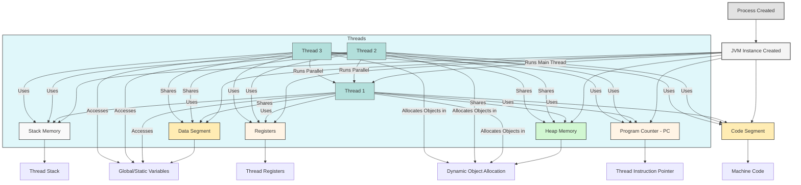
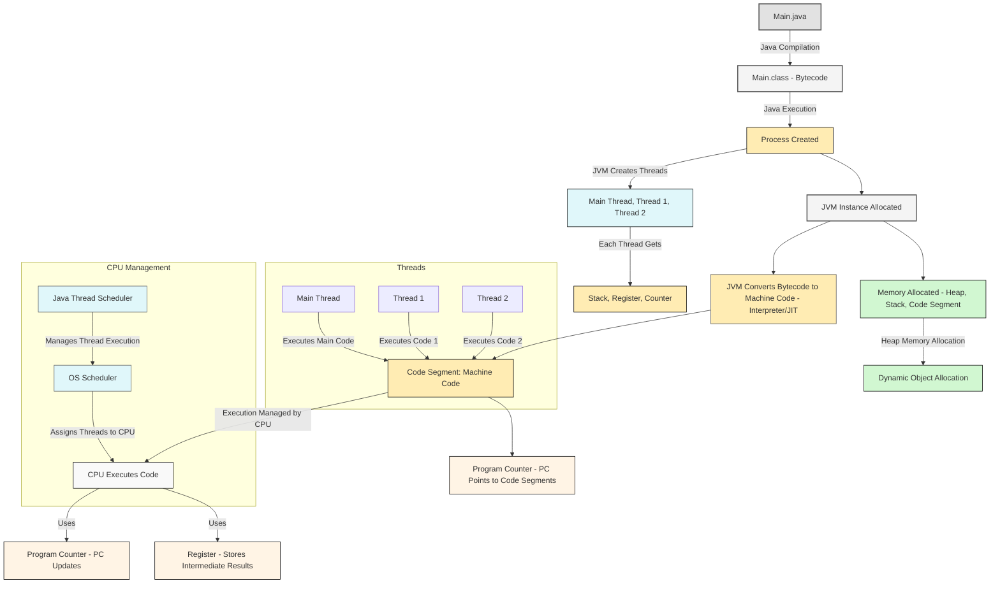
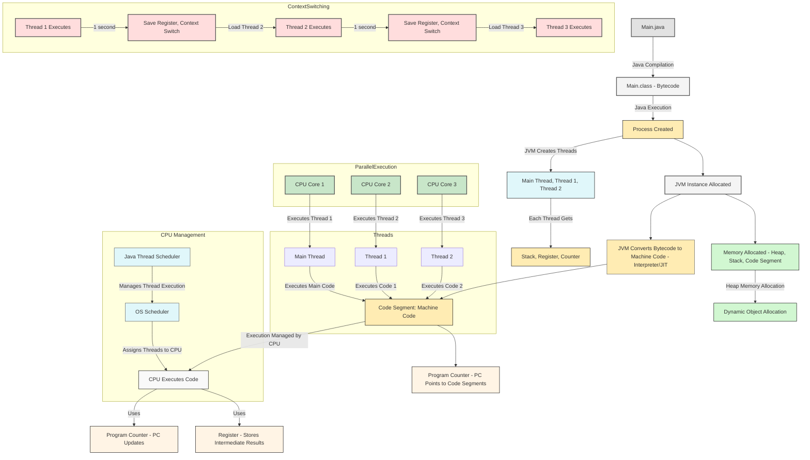

Concepts of **processes** and **threads** with respect to how they're related and different, based on the context you've shared.

### What is a **Process**?
A **process** is an instance of a program that is being executed. It represents the environment in which the program runs and includes its code, data, and resources required for execution (like memory, file handles, and other system resources).

- **Example:**
  You have a Java file `Test.java` containing your code, which you compile using the `javac` command:
  ```
  javac Test.java
  ```
  This generates the bytecode, which can be executed by the Java Virtual Machine (JVM).

  When you run the bytecode with:
  ```
  java Test
  ```
  The JVM creates a **process** to execute this program. At this point, the JVM has started a new **process** to run your program. The **process** contains the following:
  - The program’s code.
  - Allocated resources like memory (heap, stack), file handles, etc.
  - A process ID (PID) assigned by the operating system.


### Example of a Process in Java

Suppose you have a Java file called `Test.java` that contains the following code:

```java
public class Test {
    public static void main(String[] args) {
        // Your code here
    }
}
```

### Compilation

The first step in executing this program is compiling it. You would run:

```bash
javac Test.java
```

This command will compile the Java file and generate **bytecode** (`Test.class`) that can be executed by the Java Virtual Machine (JVM).

### Execution

To run the program, you would use:

```bash
java Test
```

At this point, the JVM starts a new process to execute the program. This is why we say a **process** is an "instance of a program being executed." The program is now running inside a process, and the process provides the resources (such as memory) required to run the program.

### Resources for Processes

When a process is created, the operating system allocates necessary resources to it, including memory (heap, stack), CPU time, and more. This is why a process has its own memory, and no two processes share memory unless explicitly allowed (e.g., via inter-process communication).

For example, when JVM starts a process to execute `Test`, it gets its own allocated heap memory, and another process that is created for a different program will have its own separate heap memory. These processes are independent of each other and can run in parallel.

### Key Points About a **Process**:
1. **Instance of a Program:** The process is a running instance of your program.
2. **Resources:** Each process is allocated its own resources (memory, CPU time, etc.) by the operating system.
3. **Independence:** Processes are independent of each other. They do not share memory space unless explicitly set to do so (e.g., through inter-process communication).
4. **Execution:** A process can have multiple threads inside it.

### What is a **Thread**?
A **thread** is the smallest unit of execution within a process. When a process is created, it starts with a single thread known as the **main thread**. However, a process can create multiple threads to perform tasks concurrently.

- **Example:**
  In a Java program, if you create multiple threads to perform tasks in parallel, these threads will share the process's resources (like memory), but each thread will execute a part of the program independently.

### Threads in a Process

A **thread** is a lightweight process, or more accurately, the smallest unit of execution within a process. A thread is responsible for executing a sequence of instructions. 

Every time a process is created, it starts with a **main thread**, which is the first thread that runs. From this main thread, additional threads can be spawned to perform tasks concurrently.

  **Key Points About a Thread**:
  1. **Lightweight Process:** A thread is often referred to as a "lightweight process" because it exists within a process and shares its resources but runs independently.
  2. **Smallest Unit of Execution:** A thread is a sequence of instructions that the CPU executes. Each thread executes independently but shares the process’s resources (such as memory and open files).
  3. **Concurrency:** Multiple threads in a process can run in parallel, making the program more efficient by utilizing multiple CPU cores.

### Thread Characteristics

- A thread is the smallest sequence of instructions that can be independently executed by the CPU.
- A single process can have multiple threads, each executing a different sequence of instructions concurrently.
- Threads share the resources of the process they belong to, such as memory, but each thread has its own **execution stack**.

### Example of Threads in Java:
You can create a simple multithreading program in Java. Here’s an example where we print the current thread’s name using `Thread.currentThread().getName()`:

```java
public class MultiThreadingLearning {
    public static void main(String[] args) {
        // Print the name of the current thread
        System.out.println("Current thread: " + Thread.currentThread().getName());
    }
}
```

- When you compile and run this Java program, the **main thread** will execute the code and print the thread's name.
- However, if you create additional threads using the `Thread` class, each thread will have its own execution path within the process.

### Compilation

First, you would compile the class:

```bash
javac MultiThreadingLearning.java
```

This generates the bytecode that the JVM can execute.

### Execution

When you run the program using:

```bash
java MultiThreadingLearning
```

The JVM starts a process to run the program, and the **main thread** starts executing the `main` method. In this case, it simply prints the name of the current thread (which is typically "main" for the main thread).

### Example of Threads in Java

Let's consider a basic Java class that demonstrates threading. Below is an example Java class:

```java
public class MultiThreadingLearning {
    public static void main(String[] args) {
        System.out.println(Thread.currentThread().getName());
    }
}
```

### Thread Creation Example:
To create multiple threads and see how they work concurrently, you might do something like this:

```java
public class MultiThreadingExample {
    public static void main(String[] args) {
        // Create two threads
        Thread t1 = new Thread(() -> {
            System.out.println("Thread 1: " + Thread.currentThread().getName());
        });
        Thread t2 = new Thread(() -> {
            System.out.println("Thread 2: " + Thread.currentThread().getName());
        });
        
        // Start the threads
        t1.start();
        t2.start();
    }
}
```

- Here, two threads are created (`t1` and `t2`), and each one prints its name. These threads will execute concurrently, meaning the CPU can switch between them, making your program run faster if there are multiple CPU cores.

### Differences Between Process and Thread:
| Feature                | **Process**                                    | **Thread**                                        |
|------------------------|------------------------------------------------|---------------------------------------------------|
| **Definition**          | An instance of a program being executed.       | The smallest unit of execution within a process.  |
| **Memory**              | Has its own memory (heap, stack, etc.).        | Shares memory and resources with other threads in the same process. |
| **Execution**           | Runs independently and has a separate address space. | Executes as part of a process and shares the process's address space. |
| **Creation Overhead**   | More expensive to create and manage.           | Less overhead, as threads share resources of the process. |
| **Concurrency**         | Multiple processes can run concurrently, each having its own resources. | Multiple threads within the same process can run concurrently. |
| **Resource Sharing**    | Does not share resources with other processes. | Shares resources like memory, file handles, etc. with other threads in the same process. |


### Multiple Threads in Action

You can create multiple threads to perform tasks concurrently by creating instances of the `Thread` class or implementing the `Runnable` interface. 

### Summary:
- A **process** is a program in execution that has its own resources (memory, file handles, etc.), and the operating system assigns it a process ID.
- **Process**: A process is an instance of a program that is being executed. It has its own resources (memory, CPU time) allocated by the OS.

- A **thread** is a smaller unit of execution within a process, capable of running independently and concurrently with other threads in the same process.
- **Thread**: A thread is the smallest unit of execution within a process. A process can have multiple threads, and they share the resources of the process.
- 
Thus, threads are part of processes, and multiple threads can exist in a process to perform tasks concurrently, improving efficiency and performance.

You're delving deeper into the inner workings of Java, particularly how **processes** and **threads** are managed by the **JVM (Java Virtual Machine)**. Let’s break this down step-by-step, especially the interaction between processes, threads, JVM memory, and the overall execution process.


# Understanding Process and Thread Creation in Java

Now, let's continue exploring how the JVM works with processes and threads.

## Process Creation in Java

When you execute a Java program, such as running the class `JavaMultiThreadLearning`, it triggers a series of operations. The **JVM** creates a **new process** to convert the bytecode to machine code, which is then executed by the CPU. The process involves allocating memory and other resources needed to run the program.

### Steps Involved in Executing a Java Program

1. **Process Creation**: When you run a Java program, a new **process** is created by the JVM to manage the execution of the program.
2. **JVM Instance**: A new **JVM instance** is allocated to this process. The JVM instance includes the memory and resources necessary to run the program, such as:
   - Heap memory
   - Stack memory
   - Code segment
   - Data segment
   - Registers
   - Program counter
3. **Memory Management**: Each process has its own memory space. For instance, when a process is created, it gets its own heap memory, stack memory, and other memory areas needed for execution.
4. **Execution Flow**: The process manages the program's execution, including converting bytecode into machine code, handling memory management, and passing instructions to the CPU for execution.

### The Main Thread

When a process is created, the JVM starts with a **main thread**, which is the first thread that runs. You can create additional threads from this main thread to perform tasks concurrently.

For example, consider the following code:

```java
public class MultiThreadLearning {
    public static void main(String[] args) {
        System.out.println(Thread.currentThread().getName());
    }
}
```

- **Main Thread**: By default, the JVM creates the main thread for the program.
- **Creating Additional Threads**: From this main thread, you can spawn additional threads (e.g., `Thread1`, `Thread2`) to perform tasks concurrently.

### Example Execution Flow

- **Main Thread**: When you execute the program, the main thread starts executing the code.
- **Additional Threads**: After that, additional threads can be created to run concurrently.
- The process manages all threads, allocating resources as needed.

## Process and JVM Instance Relationship

When a process is created to execute a Java program, the JVM assigns a new **JVM instance** to this process. This JVM instance contains all the necessary memory segments required for execution:

- **Heap Memory**: Stores objects and data used by the program.
- **Stack Memory**: Stores method calls, local variables, and control flow.
- **Code Segment**: Contains the compiled bytecode.
- **Data Segment**: Stores global variables and program data.
- **Registers and Program Counter**: Helps the JVM execute instructions.

### How JVM Handles Heap Memory Allocation

Each **JVM instance** created for a process gets a specific amount of **heap memory** allocated for the execution of that process. You can control the minimum and maximum heap size using JVM flags:

- `-Xms<size>`: Defines the initial heap size (e.g., `-Xms512m` for 512 MB).
- `-Xmx<size>`: Defines the maximum heap size (e.g., `-Xmx2g` for 2 GB).

For example, when you run the command:

```bash
java -Xms512m -Xmx2g MultiThreadLearning
```

- The JVM allocates **512 MB** as the initial heap size (`-Xms512m`).
- The JVM can grow the heap up to a **maximum of 2 GB** (`-Xmx2g`).

### Memory Management in JVM

When a process is created, the JVM instance for that process is allocated a portion of the total heap memory defined by the JVM settings. If there are multiple processes running on the system, each process gets its own **JVM instance**, and the heap memory for each process is allocated independently based on the maximum heap size defined during execution.

For instance:

- If there are 3 processes running on the JVM, each process gets its own JVM instance with its allocated heap memory. Even if the total heap memory for the JVM is large, each process will be limited to the heap size defined for it.

### Questions You Might Have

1. **How much heap memory is allocated for each process?**
   - When you run the Java program, you can set the
   - minimum and maximum heap size using the `-Xms` and `-Xmx` flags.
   - The heap memory for each process is allocated from the total available heap memory of the JVM.

2. **Can one process use all the available heap memory?**
   - No. The heap memory for each process is allocated based on the settings you provide when starting the process.
   - If a process requires more memory than what is allocated, you will encounter an **OutOfMemoryError**, even if the JVM has additional available heap memory.

### Summary

- When a Java program is executed, the JVM creates a new **process** to handle the execution.
- A new **JVM instance** is created for each process and includes all the necessary memory areas (heap, stack, code segment, etc.).
- The JVM allocates **heap memory** to each process based on the settings provided (e.g., `-Xms`, `-Xmx`).
- A **main thread** is created when the process starts, and you can create additional threads for concurrent tasks.

---
# Understanding Threads, Registers, and Memory Segments

Now, let's dive deeper into how different components work within a process, focusing on **threads**, **registers**, **stack**, and **program counter** (PC). We will also examine how different memory segments are shared or isolated between threads and processes.

## Threads and Shared Memory

Consider a scenario where we have three threads: **Thread 1**, **Thread 2**, and **Thread 3**. These threads are created within the same process and share certain memory areas, while others are private to each thread.

### Memory Segments in Threads

1. **Register, Stack, and Program Counter (PC)**:
   - These are **local** to each thread and are **not shared** between threads.
   - Each thread has its own **stack**, **register**, and **program counter**.

2. **Shared Memory**:
   - The **code segment**, **data segment**, and **heap** are **shared** among all threads in a process.

### Memory Breakdown

- **Code Segment**: 
  - Contains the compiled bytecode (machine code) of the Java program. This is **read-only** and shared among all threads. It holds the instructions that the CPU will execute.
  
- **Data Segment**: 
  - Stores global and static variables. This segment is **shared** among all threads in the process, meaning all threads have access to and can modify these variables.
  - Since multiple threads can modify shared data, **synchronization** is required to prevent conflicts or data corruption.

- **Heap Memory**:
  - The **heap** is used for dynamic memory allocation, primarily for objects created via the `new` keyword. 
  - Heap memory is **shared** between threads in the same process, but **not** across different processes.
  - Each thread can read from and modify heap data, which is why **synchronization** is crucial when multiple threads access heap memory concurrently.

### Key Takeaways:
- Threads **do not** share the **stack**, **register**, or **program counter**.
- Threads **do** share the **code segment**, **data segment**, and **heap memory**.
- Synchronization is required when multiple threads access shared resources like the **data segment** and **heap**.

---

### Understanding the Process Creation in JVM:

When you execute a Java program using a command like:
```bash
java MultiThreadLearning
```

Here's what happens internally:

1. **Process Creation**: The operating system creates a new **process** for your Java program. This process is an instance of the program that is being executed, and it requires various resources like memory, CPU time, and others to run.

2. **JVM Instance for the Process**: As part of this process creation, a new **JVM instance** is launched. The JVM is responsible for running the bytecode of your Java program. Each **process** that you run requires a separate JVM instance to manage the execution of your code.

3. **JVM Memory Areas**: The JVM itself has various memory areas such as:
   - **Heap memory**: Where objects are allocated.
   - **Stack memory**: Used for method calls and local variables.
   - **Code Segment**: Contains the bytecode of the program.
   - **Data Segment**: Stores data like static variables.
   - **Program Counter**: Keeps track of the current instruction being executed.
   - **Registers**: Small, fast memory storage used for intermediate calculations.

   These memory areas are **allocated** for each **JVM instance** associated with a process.

4. **Heap Size Configuration**: You can control how much memory the JVM can use for the **heap** by specifying parameters during the process launch:
   - `-Xms` specifies the **initial heap size**.
   - `-Xmx` specifies the **maximum heap size**.

   Example:
   ```bash
   java -Xms512m -Xmx2g MultiThreadLearning
   ```
   This command would start the JVM with an initial heap of 512 MB and a maximum heap size of 2 GB.

5. **Memory Allocation and JVM Instances**:
   Each **process** gets its own **JVM instance**, and each JVM instance gets its own **heap** memory (and other memory segments like stack, code segment, etc.). The total amount of heap memory available to the JVM is controlled by the `-Xms` and `-Xmx` parameters.

### How Does the JVM Manage Multiple Processes?

When you run **multiple Java programs**, each will have its own **process** and each **process** gets its own **JVM instance** with its own memory allocation. 

For example:
- **Process 1** might be allocated a heap size of **1 GB**.
- **Process 2** might be allocated a heap size of **2 GB**.

These processes are independent, and their memory is isolated. The operating system and the JVM handle the allocation and management of these resources.

### Threads within a Process:

Each **process** starts with a single thread, which is the **main thread**. The main thread is responsible for executing the program’s entry point (i.e., the `main` method in Java).

- **Threads** are the smallest units of execution within a process. Once the main thread starts executing, it can create additional **worker threads** to perform tasks concurrently, thus enabling parallelism and multitasking.

- **Concurrency**: Multiple threads within a process can run concurrently. These threads share the resources allocated to the process (such as heap memory), but they execute independently. 

#### Example: Multi-threading in Java

When you write a Java program that uses **multiple threads**, the JVM creates a new **thread** within the existing **process**. For example:

```java
public class MultiThreadingExample {
    public static void main(String[] args) {
        // Print the name of the current main thread
        System.out.println("Main thread: " + Thread.currentThread().getName());

        // Create and start Thread 1
        Thread t1 = new Thread(() -> {
            System.out.println("Thread 1: " + Thread.currentThread().getName());
        });

        // Create and start Thread 2
        Thread t2 = new Thread(() -> {
            System.out.println("Thread 2: " + Thread.currentThread().getName());
        });

        t1.start(); // Start Thread 1
        t2.start(); // Start Thread 2
    }
}
```

- When you run this, the JVM will create one **main thread** and then spawn **Thread 1** and **Thread 2**.
- These threads will share the same heap memory (allocated for the JVM instance), but each will execute independently.

### Threads and Memory Sharing:

- **Heap Memory**: All threads within a process share the **heap memory** of the process. This means they can share objects and data stored on the heap. However, each thread has its own **stack memory** that holds method calls, local variables, and other thread-specific data.
  
- **Stack Memory**: Each thread has its own **stack**. The stack stores data like method calls and local variables, and it is private to each thread. No thread can directly access another thread's stack.

- **Garbage Collection**: The JVM automatically handles **garbage collection** for objects stored in the heap. This means that the heap memory used by objects that are no longer reachable will be reclaimed to prevent memory leaks.

### Process and Thread Management in the JVM:

1. **Process Creation**: When you execute a Java program (e.g., `java MultiThreadLearning`), the operating system creates a new **process**.
2. **JVM Instance**: A **JVM instance** is created for the process, and the program's bytecode is loaded and executed by the JVM.
3. **Main Thread**: The JVM automatically creates a **main thread** for each process.
4. **Additional Threads**: From the main thread, you can create additional threads to execute tasks concurrently.
5. **Heap Allocation**: Each JVM instance is allocated memory (heap, stack, etc.) based on the parameters like `-Xms` and `-Xmx` during execution.
6. **Memory Usage**: The threads share the heap but have their own stack memory. Garbage collection takes care of memory management in the heap.

### Summary:
- **Process**: A process is an instance of a program in execution, managed by the operating system, and it includes the JVM instance.
- **Thread**: A thread is a unit of execution within a process. Each process starts with one thread (the main thread), but more threads can be created to perform tasks concurrently.
- **JVM and Memory**: When a process is created, the JVM allocates memory for it (heap, stack, etc.). You can control the heap size with `-Xms` and `-Xmx`.
- **Thread Management**: Threads share the heap memory but have separate stack memory. Each thread executes independently but shares the resources of the process.

In your example, when you run the `MultiThreadLearning` Java program, the JVM creates a new process, initializes a JVM instance, and then creates threads for concurrent execution. Each thread shares the heap memory allocated to that JVM instance but has its own stack. This is how Java manages memory and execution flow for multi-threaded programs.
You're diving deep into the **internal architecture of processes, threads, and memory management** in Java. The concepts you've mentioned—such as **code segments**, **data segments**, **heap memory**, **stack memory**, **registers**, and **program counters**—are critical for understanding how Java programs are executed on the JVM and how these resources are managed by the operating system and CPU.


## Detailed Explanation of Memory Segments

Let's now take a closer look at each of the segments mentioned and understand their roles:

### Code Segment

- **What is the Code Segment?**
  - The **code segment** stores the **compiled bytecode** or **machine code** that is generated when the Java program is compiled (`javac`) and then run (`java`).
  - The machine code in this segment is **read-only**, which means that it cannot be modified by any thread. The CPU can only **read** and **execute** this code.

- **How It Works**:
  1. You start with a `.java` file (e.g., `Main.java`).
  2. After compilation (`javac Main.java`), a `.class` file containing bytecode is generated.
  3. When you execute the program (`java Main`), the JVM creates a **process** and allocates a **JVM instance** for the process.
  4. The JVM uses an **interpreter** or **JIT compiler** to convert the bytecode into **machine code** (which the CPU can understand).
  5. This machine code is stored in the **code segment**.

### Data Segment

- **What is the Data Segment?**
  - The **data segment** stores **global** and **static** variables.
  - These variables are **shared among all threads** in a process, meaning that any thread can access and modify them.

- **Concurrency Consideration**:
  - Since the **data segment** is shared, **synchronization** is required when threads modify global or static variables to avoid race conditions and ensure thread safety.

### Heap Memory

- **What is Heap Memory?**
  - The **heap** is used for dynamic memory allocation, especially for objects created at runtime using the `new` keyword.
  - Heap memory is **shared among threads** in the same process but is **isolated** from heap memory in other processes.

- **Heap Memory Allocation**:
  - When threads execute, they may allocate memory for objects in the **heap**. These objects can be accessed and modified by any thread in the process.
  - Proper **synchronization** is required to prevent multiple threads from modifying the same object at the same time.

### Stack, Register, and Program Counter (PC)

1. **Stack**:
   - Each thread has its own **stack** which stores local variables and method calls.
   - The stack is **not shared** between threads.
   - It is used to store method frames and the data needed for method execution (e.g., local variables, return addresses, etc.).

2. **Register**:
   - The **register** is used to store intermediate values and temporary data during the execution of machine code.
   - The **register** is **local to each thread**.
   - The **JIT compiler** uses registers to optimize machine code, especially when reordering instructions and handling intermediate values.

3. **Program Counter (PC)**:
   - The **program counter** (also known as **PC**) is a register that tracks the instruction that the CPU is currently executing.
   - The PC points to the next instruction to be executed in the **code segment**.
   - It is **local to each thread** and helps in managing the flow of execution for that thread.

### Example Flow

1. **JVM Process Creation**:
   - When you execute a Java program (`java Main`), a new **process** is created.
   - The JVM allocates a new **JVM instance** for the process, with its own memory segments: **heap**, **stack**, **code segment**, and **data segment**.
   
2. **Thread Creation**:
   - The process starts with a **main thread** and may spawn additional threads.
   - All threads share the **code segment**, **data segment**, and **heap** memory, but each has its own **stack**, **register**, and **program counter**.

3. **Executing the Code**:
   - Each thread reads from the **code segment** (where machine code is stored) and executes the corresponding instructions.
   - The **program counter** (PC) tracks the current instruction that each thread is executing.
   - Threads can modify the **data segment** (global/static variables) and **heap** memory (objects), but access to these shared resources requires **synchronization**.

---

## Summary

- **Code Segment**: Contains compiled bytecode or machine code, shared among all threads, read-only.
- **Data Segment**: Contains global and static variables, shared among threads, needs synchronization for modification.
- **Heap Memory**: Used for dynamic object allocation, shared among threads in the same process, requires synchronization.
- **Stack, Register, and Program Counter**: Local to each thread, responsible for storing local data, intermediate values, and tracking the instruction execution point.

---

Let's break down the flow and interactions between all of these components more clearly:

### Key Components: Code Segment, Data Segment, Heap, Stack, Registers, and Program Counter

#### 1. **Code Segment**:
   - **What it is**: The **code segment** stores the **compiled bytecode** (or machine code) of the program. When you compile a Java program using `javac`, it creates **bytecode** (a .class file). The JVM then loads this bytecode and uses either an **interpreter** or **JIT (Just-In-Time) compiler** to convert it into native machine code that the CPU can execute.
   - **Sharing**: This code segment is **read-only** and shared among all the threads in a process. Since machine code is fixed, threads just read from this segment—they do not modify it.
   - **What it stores**: The **compiled machine code** that is executed by the CPU.

#### 2. **Data Segment**:
   - **What it is**: The **data segment** stores **global variables** and **static variables** from the program. These variables are shared among all the threads within the same process.
   - **Sharing**: Since global/static variables are shared across threads, synchronization is required if multiple threads need to modify these variables to prevent **race conditions** or **data inconsistency**.
   - **What it stores**: **Global** and **static variables** that are accessed by all threads.

#### 3. **Heap Memory**:
   - **What it is**: The **heap** is where objects are allocated dynamically using the `new` keyword in Java. When threads create objects (such as instances of classes), those objects are placed in the heap.
   - **Sharing**: The **heap memory** is shared among all threads within the same process. However, **processes do not share heap memory**. Each process has its own separate heap memory. 
   - **Synchronization**: Since multiple threads can access and modify the heap, **synchronization** is necessary to prevent concurrent modification issues (e.g., **race conditions**).
   - **What it stores**: All dynamically allocated objects.

#### 4. **Stack Memory**:
   - **What it is**: Each **thread** has its own **stack**. The stack is used to store **method call frames**, including **local variables**, **method parameters**, and the return address for methods.
   - **Isolation**: The stack is **local to the thread** and is not shared with other threads. Each thread has its own stack.
   - **What it stores**: **Local variables**, **method call frames**, and **return addresses** for the executing thread.

#### 5. **Registers**:
   - **What it is**: **Registers** are small, high-speed memory locations in the **CPU**. They store intermediate data and addresses during instruction execution. The JVM also uses its internal registers for optimizing the conversion of bytecode to machine code.
   - **Thread-Specific**: Each thread has its own set of **registers**. The registers store temporary or intermediate values required for the execution of the thread’s instructions.
   - **Usage**: The **JIT compiler** uses registers to optimize the machine code, and registers are also used for **context switching** during multitasking. The CPU itself uses registers to perform arithmetic, store data, and execute instructions.
   - **What it stores**: Intermediate values, addresses for instruction fetching, and data needed for the current instruction.

#### 6. **Program Counter (PC)**:
   - **What it is**: The **Program Counter** (PC) is a register that holds the address of the next instruction to be executed by the thread. The **PC** is used to keep track of the instruction flow, ensuring that each thread executes instructions in sequence (unless altered by control flow statements like loops or method calls).
   - **Thread-Specific**: Each thread has its own **Program Counter**, which keeps track of the instruction it is currently executing.
   - **Usage**: The **PC** helps ensure that threads execute the correct sequence of instructions from the **code segment** (i.e., the machine code). It points to the next instruction for the CPU to execute.

### The Flow of Execution (Complete Flow of a Thread and Process)

Here’s how all these components come together in a **real execution scenario**:

1. **Java Program Compilation**: 
   - You write a Java program (e.g., `Main.java`), and you compile it using `javac`. This creates a bytecode file (`Main.class`), which contains machine-readable code but is platform-independent.
   - **What happens**: The bytecode is loaded into the **code segment** when the JVM starts.

2. **Process Creation**:
   - You execute the program using `java Main`. The **operating system** creates a **process** for your program.
   - **What happens**: The JVM instance is created for this process. This JVM will have its own memory space, including the heap, stack, code segment, data segment, and other internal JVM areas.

3. **Thread Creation**:
   - When the JVM starts, the first thread, **the main thread**, is created automatically. 
   - **What happens**: The main thread begins executing, starting with the `main()` method of your program. 

4. **Execution Flow in the Main Thread**:
   - The **main thread** starts executing the program. The JVM reads instructions from the **code segment** and uses the **PC (Program Counter)** to keep track of which instruction to execute next.
   - As the main thread runs, it may create additional threads (using `Thread t = new Thread()` in Java).
   - **What happens**: The main thread executes instructions, creating more threads if needed. Each thread will have its own **stack**, **registers**, and **program counter** to manage its execution flow independently.

5. **Heap Memory Access**:
   - As the threads execute, they may create **new objects** using the `new` keyword, which places objects in the **heap memory**.
   - **What happens**: The heap is shared among all threads within the same process. If multiple threads access the same object, **synchronization** is necessary to prevent data corruption or inconsistent behavior.

6. **Data Segment Access**:
   - Any **static** or **global variables** are stored in the **data segment**.
   - **What happens**: These variables are **shared** by all threads in the process. If multiple threads modify the same static or global variables, proper synchronization (like `synchronized` blocks or `ReentrantLocks`) is required to prevent **race conditions**.

7. **Instruction Execution**:
   - As each thread executes, it fetches instructions from the **code segment**. The **Program Counter (PC)** is updated to point to the next instruction after the current one is executed.
   - **What happens**: Each thread’s **PC** keeps track of the next instruction in the **code segment** it needs to execute. The thread fetches the machine code from the **code segment** and executes it, updating its **registers** with intermediate results.

8. **Context Switching**:
   - If the operating system uses **multitasking** (which it usually does), it may switch between threads during execution. This is called **context switching**.
   - **What happens**: When a thread is suspended, the **CPU** saves its state (registers, program counter, stack pointer, etc.) and loads the state of the next thread to execute. This is done so that threads can run in parallel on multiple CPU cores, or in a time-sharing fashion on a single core.

### Final Summary of the Interaction:

- **Threads share** the **code segment**, **data segment**, and **heap memory**.
- Each thread has its own **stack**, **registers**, and **program counter**.
- The **code segment** stores the **compiled machine code**.
- The **data segment** stores **global** and **static variables**, which are shared among threads, requiring synchronization when modified.
- The **heap** is used for dynamically allocated objects, shared by threads, but synchronization is needed to modify shared objects.
- **Registers** store temporary values and are specific to each thread.
- The **program counter** tracks which instruction each thread needs to execute next in the code segment.

### Next Steps:
If you want to explore further, you could look into how the **JVM’s garbage collector** interacts with this memory management system, how **thread synchronization** is implemented, and how different types of threads (e.g., daemon threads) interact within a process.

Let me know if you'd like to dive into any specific part of this flow in more detail!


To represent the flow and architecture you've described using a **Mermaid diagram**, we'll illustrate the key components of the **JVM process execution model**, showing how the **main thread** interacts with various memory segments, registers, and other resources.

Here's how you can structure the diagram in **Mermaid** syntax:



### Explanation of the Diagram:

- **Process Creation**: When the Java program is executed, a **Process** is created, which in turn leads to the creation of a **JVM instance**.
- **JVM Instance**: The **JVM instance** consists of multiple segments that handle different tasks:
  - **Code Segment**: Holds the **machine code** or bytecode instructions.
  - **Data Segment**: Contains **global** and **static variables**.
  - **Heap Memory**: Used for dynamically allocated objects.
  - **Stack Memory**: Each thread has its own stack to store local variables and method calls.
  - **Registers**: Each thread has its own set of registers for holding intermediate values and addresses.
  - **Program Counter (PC)**: Each thread has its own program counter that points to the next instruction to execute.

- **Threads**: Multiple threads (e.g., **Thread 1, Thread 2, Thread 3**) are created within the **JVM process**:
  - Threads share the **code segment** and **data segment**, meaning they can read and write to global/static variables and execute the same machine code.
  - Each thread has its own **stack**, **registers**, and **program counter**, meaning that their execution is independent in terms of local state and progress.

#### How Threads Interact:
- All threads share access to the **heap memory**, meaning they can allocate objects. This can lead to shared state, so synchronization is needed when multiple threads modify the heap data.
- Threads access the **data segment** for global/static variables, and they execute instructions in the **code segment**, as managed by their individual **program counters**.


The entire sequence from compiling the Java program to executing it with multiple threads managed by the JVM, and how the CPU executes the machine code.

Here’s the outline of what the system does:

1. **Compilation Phase**:
   - You first compile the Java program (`javac Main.java`), which produces bytecode (`Main.class`).
   
2. **Execution Phase**:
   - When you run the program (`java Main`), a process is created, and a JVM instance is allocated for that process.
   - The JVM allocates memory regions like heap, stack, code segment, etc.
   - The JVM then starts converting the bytecode to machine code (via either interpretation or JIT compilation).
   
3. **Thread Creation**:
   - The JVM determines that it needs to create multiple threads (main thread, thread 1, thread 2).
   - Each thread is assigned its own stack, registers, and program counter (PC).

4. **Execution by the CPU**:
   - The CPU executes machine code in the context of the threads, with the OS and JVM scheduler managing the execution of threads.
   - The program counter (PC) in each thread points to a specific part of the machine code that is being executed.

Now, let’s structure this in **Mermaid syntax** to depict the flow:



### Key Points Represented in the Diagram:

1. **Compilation**:
   - `javac Main.java` compiles the code into bytecode, stored in `Main.class`.

2. **Execution**:
   - The `java Main` command creates a **process**.
   - The **JVM instance** is allocated for the process and various memory segments (heap, stack, code segment) are created.

3. **Thread Creation**:
   - The JVM identifies the need for multiple threads: **main thread**, **thread 1**, and **thread 2**.
   - Each thread is allocated its **own stack**, **registers**, and **program counter**.

4. **Code Execution**:
   - The JVM starts converting the bytecode to **machine code** (via **interpretation** or **JIT compilation**).
   - The **program counter** for each thread points to specific instructions in the **code segment**.
   - The CPU executes the machine code, using its **registers** to store intermediate results.

5. **Thread Scheduling**:
   - The **OS scheduler** assigns threads to the CPU for execution.
   - The **JVM scheduler** helps manage the execution flow, deciding which thread to run next.

### Explanation of Key Components:

- **Code Segment**: Contains the compiled machine code (generated from bytecode).
- **Data Segment**: Stores **global** and **static** variables that threads can access.
- **Heap**: Dynamically allocated memory where objects are created. Threads share access to the heap but need synchronization to prevent race conditions.
- **Stack, Registers, and Program Counter**: Each thread has its own stack, registers, and program counter, which is essential for managing the local execution state of the thread.

This diagram provides a visual flow from code compilation, process creation, thread creation, and execution by the CPU, all while managing memory and synchronization between threads. It helps illustrate how the JVM and the CPU work together to run a multi-threaded Java program. 
Yes, you’ve explained the concepts clearly! Let me summarize and reinforce the key points, especially focusing on **context switching**, **parallel execution**, and how the various components interact within the process.

### Key Concepts Recap:

1. **Program Counter (PC)**: 
   - The **Program Counter** is responsible for tracking the **address** of the instruction in the code segment that the thread is currently executing.
   - For each thread, the PC ensures that the thread picks up where it left off during its next time slice, making **context switching** possible.

2. **Code Segment**: 
   - All threads in a process share the **code segment**, which contains the compiled machine code (i.e., the bytecode converted to native machine code).
   - Each thread has its own **Program Counter (PC)**, which points to the address of the next instruction in the code segment for that specific thread.

3. **Context Switching**: 
   - When the **OS scheduler** allocates CPU time to a thread, it loads the instruction from the program counter into the CPU registers and begins execution.
   - After a time slice (say, 1 second), **context switching** happens:
     - The CPU **saves the state** of the current thread (its register contents and progress).
     - The OS then **loads the state** of another thread and begins execution at the address specified by that thread’s program counter.
     - This process repeats as the OS switches between different threads (even though only one CPU core is available).

4. **Parallel Execution vs Context Switching**:
   - **Context Switching**: When only one CPU core is available, **only one thread can run at a time**. However, it **appears** that all threads are running simultaneously because the CPU quickly switches between them. The threads are actually **not running in parallel**, they are simply **time-shared**.
   - **True Parallel Execution**: If there are **multiple CPU cores**, each core can run a thread simultaneously. In this case, the threads are **actually running in parallel** without the need for context switching between them.

### Diagram for Context Switching and Parallel Execution

Let’s update the **Mermaid diagram** to reflect the concepts of context switching and parallel execution, as well as how the **program counter** works for each thread.



### Explanation of the Diagram Changes:

1. **Context Switching Subgraph** (`ContextSwitching`):
   - **Context switching** occurs when the **OS scheduler** allocates a time slice for each thread. After the time slice (e.g., 1 second) completes, the **CPU registers** are saved, and the next thread is executed.
   - The **Program Counter (PC)** is updated to point to the next instruction that needs to be executed when the thread resumes.

2. **Parallel Execution Subgraph** (`ParallelExecution`):
   - When there are **multiple CPU cores**, the threads can run **in parallel** without context switching.
   - Each CPU core runs one thread at a time, so in this case, **Thread 1** runs on **CPU Core 1**, **Thread 2** runs on **CPU Core 2**, and **Thread 3** runs on **CPU Core 3**.
   - There is no context switching in this case since the threads are actually running simultaneously.

### Summary:

- **Program Counter (PC)** helps track where each thread is in the code segment.
- **Context Switching** happens when the OS scheduler allocates a time slice for each thread and switches between them if there is only one CPU core. The **registers** are saved and restored for each thread to ensure that it can resume from where it left off.
- With **multiple CPU cores**, threads can run **in parallel** without the need for context switching, improving performance.

This process ensures that the system runs multiple threads efficiently, either by **time-sharing** (context switching) or **parallel execution** (multiple CPU cores), depending on the available hardware.

You’ve provided a great explanation of **multithreading**, its benefits, challenges, and its distinction from **multitasking**. Let me break it down and highlight the important points for clarity and better understanding, especially focusing on **multithreading** concepts and how they relate to **context switching** and **resource sharing**.

### **Multithreading Definition**:
Multithreading allows a program to perform **multiple operations at the same time**. Rather than running tasks sequentially, multithreading enables a program to break down the tasks into smaller operations (threads) and execute them simultaneously (or in parallel, depending on the number of CPUs/cores).

- **Multiple threads** share the same **resources** (e.g., heap memory, code segments) but can **perform tasks independently**. 
- Each thread can run a separate part of the program, but they can access the shared resources (memory, variables) and can even interact with each other.

### **Key Benefits of Multithreading**:

1. **Improved Performance**: 
   - **Task Parallelism**: When multiple threads are running in parallel (across multiple CPU cores), the program’s performance improves because tasks are divided and executed simultaneously.
   - If a program only had one thread, all tasks would run sequentially on one CPU, leading to slower performance. With multithreading, tasks are executed concurrently (or in parallel), making use of available CPU cores efficiently.

2. **Responsiveness**:
   - A program that uses multithreading can respond faster to user input. For instance, one thread could be handling user interactions (UI thread) while another thread performs background calculations. This way, the program remains responsive to the user while doing heavy work in the background.

3. **Resource Sharing**:
   - Threads share the same memory space (heap, data segment, code segment). This **shared memory** allows threads to interact with each other and exchange information efficiently. 
   - **Resource sharing** is cost-effective because threads don't need separate copies of resources like a separate heap for each thread. They share common resources, which leads to less memory usage.
   
### **Challenges of Multithreading**:

1. **Concurrency Issues**:
   - **Concurrency issues** arise when multiple threads try to access and modify shared resources (e.g., heap memory or global variables) at the same time, leading to **data inconsistency** or **deadlocks**.
   - For example, two threads might simultaneously try to write to the same memory location, causing inconsistent data or crashing the program.
   - **Deadlock** occurs when two or more threads are blocked forever, waiting for each other to release resources.

2. **Synchronization**:
   - To prevent concurrency issues, we use **synchronization** mechanisms like **locks** and **synchronized blocks** to ensure that only one thread accesses shared resources at a time.
   - Synchronization adds **overhead** to the system, as the program must manage access to shared resources, which can slow down execution.

3. **Difficulty in Debugging**:
   - Multithreading can make debugging **challenging** because of **race conditions** and the non-deterministic order in which threads are scheduled. Testing multithreaded applications can be difficult because bugs may only occur when threads are scheduled in a particular way, which is hard to reproduce in a controlled testing environment.

4. **Complexity in Code**:
   - Writing, testing, and maintaining multithreaded programs is **more complex** compared to single-threaded programs. Proper synchronization, managing shared resources, and dealing with concurrency issues require careful programming and advanced debugging techniques.

### **Difference Between Multitasking and Multithreading**:

- **Multitasking** refers to running **multiple processes** at the same time. Each process has its own memory space (heap, stack, data segments) and doesn’t share resources with other processes. 
  - **Example**: Running a web browser and a text editor simultaneously are two different processes. The operating system switches between them (context switching), but they do not share memory resources.

- **Multithreading**, on the other hand, refers to running **multiple threads** within a single process. These threads share the same memory space and resources (code, data segments, heap), but each thread can perform its own tasks independently.
  - **Example**: A word processor might have one thread for handling user input, another for saving files, and another for background spell-checking. All of these threads run within the same process and share memory resources.

### **Visualization of Multithreading vs Multitasking**:

- **Multitasking**: 
   - Multiple **processes** running concurrently, with each process having its own memory space.
   - Context switching happens between processes, and the OS manages which process runs on the CPU at any given time.
   
- **Multithreading**: 
   - Multiple **threads** run within a single process and share memory space. 
   - Threads within a process can be scheduled to run in parallel (if multiple CPU cores are available), or the OS can use context switching for thread scheduling if there's only one CPU core.

### **Context Switching and Multithreading**:
- **Context switching** is used to switch between threads when only one CPU core is available. The OS saves the state of the currently running thread (its register values, program counter, etc.) and loads the state of another thread, allowing that thread to continue execution.
- This context switching gives the **illusion of parallel execution**, even though the threads are actually time-shared on a single CPU core.
- If multiple CPU cores are available, then **true parallelism** can occur, with each thread running on a different core simultaneously, eliminating the need for context switching.

### **Summary**:
- **Multithreading** is a programming technique where multiple threads share the same memory resources but can execute different parts of a program concurrently, improving performance and responsiveness.
- **Benefits**: Improved performance via parallelism, better resource utilization, and faster response times.
- **Challenges**: Concurrency issues, synchronization overhead, and difficulty in debugging.
- **Multitasking vs Multithreading**: Multitasking involves running multiple processes independently, while multithreading involves multiple threads within a single process that share resources but run independently.

### Next Steps (Creating Threads in Java):
You mentioned you’d be looking into how to create threads in Java next. Here’s a brief overview:
1. **Extending `Thread` class**: You can create a thread by extending the `Thread` class and overriding its `run()` method.
2. **Implementing `Runnable` interface**: Alternatively, you can implement the `Runnable` interface and pass it to a `Thread` object.


# Understanding Multi-threading, Context Switching, and Java Threading

### 1. **Multi-threading Overview**
Multi-threading allows a **single process** to perform multiple operations simultaneously by using **multiple threads**. This helps improve **performance**, especially in systems with **multi-core processors**, by allowing different threads to run on different cores simultaneously.

- **Threads share common resources** such as:
  - **Code segment** (same program code, i.e., the instructions).
  - **Heap memory** (for dynamically allocated memory, shared between threads).
  - **Data segment** (for global and static variables).
  
However, each thread also has its own:
  - **Stack** (for local variables and function calls).
  - **Program counter** (which tracks the thread's position in the code).

### 2. **Benefits of Multi-threading**
- **Task Parallelism**: By splitting a task into multiple threads, you can leverage multiple CPU cores to execute these threads in parallel, speeding up the execution. For example:
  - With **two CPU cores**, **Thread 1** can run on **Core 1**, and **Thread 2** can run on **Core 2**. This allows both threads to work at the same time, improving performance.
  
- **Improved Responsiveness**: Multi-threading allows an application to remain responsive even while doing lengthy tasks. For example, a UI thread can remain active to handle user input while other background threads perform computations or data processing.
  
- **Resource Sharing**: Threads share resources like memory, which makes multi-threading **more efficient** and **less resource-intensive** than starting multiple processes. The OS doesn’t need to allocate separate resources for each thread, as would happen in multi-tasking with different processes.

### 3. **Challenges of Multi-threading**
While multi-threading offers many benefits, there are challenges associated with it:
- **Concurrency Issues**: When multiple threads access shared resources (e.g., heap memory or global variables) at the same time, there are risks like **data inconsistency**, **deadlocks**, and **race conditions**. For example:
  - **Deadlock** occurs when two or more threads wait indefinitely for each other to release resources, leading to a standstill.
  - **Race conditions** happen when two threads access shared data concurrently, and the final result depends on the order of execution, leading to unpredictable behavior.

  To handle these issues, **synchronization** is used to control access to shared resources, ensuring that only one thread can access a critical section of code at a time (e.g., by using **synchronized blocks** or **locks**).

- **Complexity**: Writing multi-threaded code can be difficult because it introduces new challenges in terms of **debugging** and **testing**. It's harder to reproduce and diagnose issues like race conditions or deadlocks in a multi-threaded environment, and test cases might behave differently depending on the timing of thread execution.

### 4. **Multi-threading vs. Multi-tasking**
- **Multi-tasking** involves running multiple **independent processes** concurrently, where each process has its own memory and resources. The OS switches between processes to give the illusion of parallel execution, but these processes **don’t share memory** (e.g., processes A and B don’t share resources).
  
- **Multi-threading** occurs within a **single process**. Multiple threads share the same memory resources (e.g., heap and code segments), but each thread has its own execution context (such as stack, program counter, and register values). This allows for more efficient resource use within a single application.

To summarize:
- **Multi-tasking**: Different processes (independent), **no shared resources**.
- **Multi-threading**: Multiple threads within a **single process**, **shared resources**.

---

### 5. **How Context Switching Works in Multi-threading**
Context switching is a critical aspect of multi-threading, particularly when the system has only one CPU core (or even multiple cores, where threads might still need to share CPU time). Here's how context switching works:

1. **Time Slice**: The OS allocates a small amount of time (called a **time slice**) for each thread to execute. When the time slice expires, the OS performs a context switch to give the next thread a chance to run.
  
2. **Saving the State**: During context switching, the CPU saves the **state** of the currently running thread (its registers, program counter, etc.) into its **thread context** (a special data structure).
   - For example, when **Thread 1** finishes its time slice, the CPU saves its state (registers, program counter, stack data).
  
3. **Loading the State**: The OS then loads the **state** of the next thread (say **Thread 2**), restoring its context, and the CPU continues executing from where **Thread 2** left off.
  
4. **Context Switch**: This process of saving and restoring the state is called a **context switch**. This enables threads to "pause" and later resume execution from the exact point they were interrupted.

   - **Multi-core CPUs**: On a multi-core CPU, multiple threads can be executed **truly in parallel**, so context switching is only required if threads need to be run on the same core. However, if there are more threads than cores, context switching is still necessary.

### 6. **Summary: Key Concepts**
- **Multi-threading** allows for concurrent execution of tasks within a single process, improving performance and responsiveness by utilizing multiple CPU cores.
- Threads share resources like **heap memory** and **code segments**, but have their own execution contexts (e.g., program counter, stack, and registers).
- **Context switching** allows threads to take turns using the CPU, and in a **multi-core system**, true parallelism can occur, where multiple threads are executed simultaneously without switching.
- Challenges in multi-threading include issues like **deadlock**, **data inconsistency**, and the complexity of debugging.
- **Multi-threading** shares resources between threads in the same process, whereas **multi-tasking** involves different processes with separate resources.

---

### 7. **Next Steps: Creating Threads in Java**
Now that we understand the underlying concepts, let's look at how we can create threads in Java.

1. **Extending the Thread Class**:
   ```java
   class MyThread extends Thread {
       @Override
       public void run() {
           // Code to execute in this thread
           System.out.println("Thread is running");
       }
   }

   public class Main {
       public static void main(String[] args) {
           MyThread t = new MyThread();
           t.start();  // Start the thread
       }
   }
   ```

2. **Implementing the Runnable Interface**:
   ```java
   class MyRunnable implements Runnable {
       @Override
       public void run() {
           // Code to execute in this thread
           System.out.println("Thread is running");
       }
   }

   public class Main {
       public static void main(String[] args) {
           MyRunnable myRunnable = new MyRunnable();
           Thread t = new Thread(myRunnable);
           t.start();  // Start the thread
       }
   }
   ```

   - In the **Runnable** approach, you define the task in the `run()` method, then pass it to a **Thread** object for execution.

3. **Managing Threads**: 
   - You can use methods like `Thread.sleep()`, `Thread.join()`, and `Thread.yield()` to control thread execution and synchronization.
   - Java also provides **Executors** for better management of thread pools and concurrency.

---


# Java Multithreading: Process Creation and Thread Execution

Let's walk through a detailed explanation of how Java's multithreading mechanism works when executing a Java program. We'll break down the process from code execution to the actual scheduling and running of threads, and how the JVM and CPU work together.

## Step 1: Writing and Compiling Java Code

Suppose you have the following Java code in a file `Main.java`:

```java
public class Main {
    public static void main(String[] args) {
        // Main thread execution
        System.out.println("Main thread is running");

        // Creating thread 1
        Thread thread1 = new Thread(() -> {
            System.out.println("Thread 1 is running");
        });
        thread1.start();

        // Creating thread 2
        Thread thread2 = new Thread(() -> {
            System.out.println("Thread 2 is running");
        });
        thread2.start();

        // After threads, main thread resumes
        System.out.println("Main thread resumes");
    }
}
```

### Compiling the Code
The first thing you do is compile the Java code:

```bash
javac Main.java
```

This generates the bytecode for your program, which is stored in `Main.class`.

---

## Step 2: Executing the Java Program

Now, when you run the Java program using the `java` command:

```bash
java Main
```

### What Happens Internally?
1. **Process Creation**:
   - The JVM creates a **new process** to execute the program. A process is a running instance of your program and will have its own memory space.

2. **JVM Instance Allocation**:
   - The JVM creates a **new JVM instance** to handle this process.
   - This JVM instance will be allocated the necessary memory for execution, including:
     - **Heap Memory**: Where objects are dynamically allocated.
     - **Code Segment**: Where the machine code (after JIT compilation) resides.
     - **Data Segment**: Where global and static variables are stored.

3. **Memory Configuration**:
   - The JVM allocates heap memory based on the configuration you provide, for example:
   
   ```bash
   java -Xmx2g -Xms512m Main
   ```
   
   This means the JVM is allocated 2 GB of maximum heap memory and 512 MB of initial heap memory.

---

## Step 3: Bytecode Interpretation and Thread Creation

As the program starts execution, the JVM needs to **interpret** or **compile** the bytecode into machine code that the CPU can understand. The JVM does this using either an interpreter or the **Just-in-Time (JIT) compiler**.

### Creating Threads
- While interpreting the bytecode and converting it into machine code, the JVM identifies that the program requires multiple threads:
  - **Main Thread**: The thread that starts executing the `main` method.
  - **Thread 1**: A new thread created to execute part of the code (in this case, printing `"Thread 1 is running"`).
  - **Thread 2**: Another new thread created to execute another part of the code (in this case, printing `"Thread 2 is running"`).

Thus, the JVM creates **three threads**: `main thread`, `thread 1`, and `thread 2`.

For each thread, the JVM allocates:
- **Stack**: Stores local variables and method calls.
- **Register**: Stores intermediate values used by the thread.
- **Program Counter (PC)**: Keeps track of the current instruction that the thread is executing in the machine code.

---

## Step 4: Loading the Machine Code into the Code Segment

Once the bytecode is compiled into machine code by the JIT compiler, the machine code is stored in the **code segment** of the JVM memory. This is the area where the CPU will execute the instructions.

### Program Counter and Execution
- Each thread has its own **program counter** (PC), which points to the address of the instruction in the **code segment** that the thread should execute.
- For example:
  - The **main thread**'s program counter points to the part of the machine code that corresponds to the `main()` method.
  - **Thread 1**'s program counter points to the machine code corresponding to the task it needs to execute.
  - Similarly, **Thread 2** has its own program counter pointing to its specific task.

---

## Step 5: Thread Execution

Now that all threads have been created, the program is ready for execution. But how does this happen?

### Who Executes the Code?
- The **CPU** is responsible for executing the machine code. However, it can only execute one thread at a time (on a single-core CPU), so what happens when multiple threads are involved?
  
### CPU Scheduling
- The **Operating System (OS)**, and sometimes **JVM's own scheduler**, is responsible for managing which thread gets executed on the CPU at any given time.
- Even if you have multiple threads (main thread, thread 1, and thread 2), only one thread can run on a single-core CPU at any moment.
  
    - If you have a **multi-core CPU**, different threads can be executed concurrently on different cores, but for simplicity, let's assume a single-core CPU.

### Context Switching
- The CPU will use a process called **context switching** to switch between threads. At any given moment, the CPU can run only one thread, but it will quickly switch between them, giving the illusion that they are running concurrently.
- The **program counter** (PC) tells the CPU where to continue execution when switching threads.

---

## Step 6: Thread Execution Flow

Let's walk through the thread execution with the example of a **single-core CPU**:

1. The **main thread** starts executing. The CPU loads the machine code for the `main()` method from the **code segment** and starts executing it.
2. When the **main thread** reaches the point where it creates **Thread 1**, it gives control to the OS, which schedules **Thread 1** to run.
3. The **program counter** for **Thread 1** points to the location in the code where **Thread 1** needs to start. The CPU loads the relevant machine code and starts executing **Thread 1**'s task.
4. After **Thread 1** finishes its task, the OS schedules **Thread 2** to run, and the same process happens.

The **program counter** for each thread ensures that each thread resumes where it left off in the machine code.

---

## Step 7: Synchronization and Final Output

Since threads share resources like the **data segment** and **heap memory**, proper synchronization is required to avoid conflicts when multiple threads access these shared resources. Java provides various mechanisms (like `synchronized` blocks or `ReentrantLocks`) to ensure thread safety.

Once all threads complete their execution, the program terminates, and the output is displayed as:

```
Main thread is running
Thread 1 is running
Thread 2 is running
Main thread resumes
```

---

## Summary

1. **Java Compilation**: You compile the Java code into bytecode using `javac`.
2. **Process Creation**: The JVM creates a process and allocates memory, including the code segment, heap, and data segment.
3. **JVM and Threads**: The JVM creates multiple threads (main thread, thread 1, and thread 2) and assigns stack, register, and program counters to each thread.
4. **Thread Execution**: The OS schedules threads, and the CPU executes the machine code, with the program counter tracking which instruction each thread is executing.
5. **Context Switching**: The CPU switches between threads, and synchronization mechanisms ensure thread safety when accessing shared resources.

---

Yes, this is a very detailed explanation of how threads work, how the CPU schedules them, and how context switching plays a crucial role when there's only one CPU core, as well as how multiple CPU cores can truly run threads in parallel. Let me break this down for better clarity and flow:

### 1. **Context Switching with One CPU Core**
   - **What is Context Switching?**
     - Context switching is a process where the CPU saves the state of a currently running thread (including its register values, progress, etc.), so that it can switch to another thread and resume execution later.
     - This is necessary because, with only one CPU core, the CPU can only run one thread at a time. The operating system (OS) schedules which thread runs at any given moment.

   - **Scenario: Main Thread Execution**
     - Let's say **Thread 1 (Main Thread)** starts running first. The CPU loads the machine code (from the **code segment**) that corresponds to what **Thread 1** has to execute.
     - The **Program Counter (PC)** for **Thread 1** points to the current instruction in the machine code, and the CPU fetches this instruction, executes it, and updates the program counter to point to the next instruction.
     - As **Thread 1** executes, the CPU uses its internal **register** to store intermediate results (like variables or calculations) during execution.

   - **After Time Slice (e.g., 1 second):**
     - After a given time slice (let's assume 1 second), the OS will perform **context switching**.
     - **What happens during context switching?**
       - The OS **saves the state** of **Thread 1**: All the intermediate data, register values, and the current state of the program counter (PC) are saved.
       - The **register** values are saved to **Thread 1's context** (basically stored in memory).
       - The OS now picks **Thread 2** (or any other thread) to run next, and the process continues similarly.

   - **Thread 2 Execution:**
     - Now, **Thread 2** starts executing. The OS loads the machine code corresponding to **Thread 2** into the CPU, and the program counter for **Thread 2** will point to its specific starting point in the machine code.
     - Once **Thread 2** finishes its time slice, the OS will again perform context switching, saving its state, and possibly allowing **Thread 3** (or another thread) to execute.

   - **When **Thread 1** gets a turn again:**
     - Once it's **Thread 1's turn again**, the OS will load the saved state (register values, program counter, etc.) from **Thread 1's context**.
     - The CPU will pick up right where it left off (using the program counter), and continue executing **Thread 1**.

   - **Summary of Context Switching with One CPU:**
     - Context switching allows **multiple threads to appear to run concurrently**, but actually, they run one after another. It’s like a fast switching between threads, so it **appears** that they're all running in parallel, but in reality, only one thread is being executed by the CPU at any given time.

### 2. **How the Program Counter and Code Segment Work**
   - Each thread has its own **program counter (PC)** that points to the address in the **code segment** where the thread is supposed to execute.
   - The **code segment** contains the machine code generated by the JIT compiler, which is shared by all threads. 
     - **Thread 1**, **Thread 2**, and **Thread 3** all point to the same **code segment** for execution.
   - The **program counter** for each thread indicates which instruction in the **code segment** the thread should execute next. The program counter keeps updating after each instruction is executed, pointing to the next instruction.

### 3. **Multiple CPU Cores: True Parallelism**
   - **Scenario with Multiple CPU Cores (e.g., 2 cores):**
     - In the case of **multiple CPU cores**, context switching is **not needed** because different threads can be executed in **parallel** on different CPU cores.
     - For example, if you have **Thread 1**, **Thread 2**, and **Thread 3**:
       - **Thread 1** could run on **CPU core 1**.
       - **Thread 2** could run on **CPU core 2**.
     - Since the threads are now running on different cores, they can truly execute at the same time, without the need for context switching.
   
   - **How is this different from single-core CPUs?**
     - On a **single-core CPU**, only one thread can be executed at a time, so the OS must manage which thread runs using context switching.
     - On a **multi-core CPU**, multiple threads can be executed simultaneously on different cores, so there's no need for context switching to give the illusion of parallel execution.

### 4. **Program Counter and Code Segment in Multi-Core Systems**
   - Even in multi-core systems, **each thread** still has its own **program counter** that points to the machine code in the **shared code segment**.
   - Each thread executes its instructions in parallel on different cores, but each thread maintains its own **program counter** that points to the next instruction to execute in the shared **code segment**.
   - **Thread 1** could be running on **Core 1**, **Thread 2** on **Core 2**, and so on, each fetching instructions from the same **code segment** but executing independently in parallel.

### 5. **Visualizing Context Switching and Multi-Core Parallelism**

- **Single-Core Scenario (Context Switching):**
  ```
  | Time | Main Thread | Thread 1 | Thread 2 | Thread 3 |
  |------|-------------|----------|----------|----------|
  | T1   | Running     |          |          |          |
  | T2   | Waiting     | Running  |          |          |
  | T3   | Waiting     | Waiting  | Running  |          |
  | T4   | Waiting     | Waiting  | Waiting  | Running  |
  ```
  - In the above table, you can see that all threads are not actually running simultaneously. Instead, they're being switched in and out of the CPU, with each having a "turn" to execute.

- **Multi-Core Scenario (True Parallelism):**
  ```
  | Time | Core 1     | Core 2     | Core 3     |
  |------|------------|------------|------------|
  | T1   | Running    |            |            |
  | T2   |            | Running    |            |
  | T3   |            |            | Running    |
  ```
  - In the multi-core example, threads are truly running in parallel. Each thread is executing on a different core, so no context switching is needed.

---

### Key Concepts Recap:

- **Context Switching**: When the CPU switches between threads (saves and loads the thread state) to give the illusion of concurrency on a single-core CPU.
- **Program Counter (PC)**: Each thread has its own program counter, which points to the address in the **code segment** where the thread should execute next.
- **Code Segment**: Contains the machine code shared by all threads, but each thread uses its own program counter to track which instruction it needs to execute.
- **Heap and Data Segments**: Shared memory locations for threads to store data, requiring synchronization to avoid conflicts.
- **Multi-Core CPU**: Multiple threads can run on different cores in parallel, removing the need for context switching between threads.

---

### Conclusion:
In summary:
- With **one CPU core**, the threads are **context switched** by the OS, giving the illusion of parallel execution.
- With **multiple CPU cores**, **true parallelism** is achieved, where threads can run simultaneously without needing to switch between them.
- The **program counter** helps each thread track where it should resume execution in the shared **code segment**.
- **Context switching** ensures that threads continue from where they left off when their turn comes around, but with multiple cores, threads can actually run concurrently. 

This explanation should provide a clearer picture of how threads are scheduled, executed, and how the program counter, code segment, and context switching are integral to thread management in both single-core and multi-core systems.

Yes, your explanation about **multi-threading**, **context switching**, and the difference between **multi-threading** and **multi-tasking** is quite comprehensive. Let's break it down and expand on the concepts you've explained to ensure clarity.

### 1. **Multi-threading Overview**
Multi-threading allows a **single process** to perform multiple operations simultaneously by using **multiple threads**. This helps improve **performance**, especially in systems with **multi-core processors**, by allowing different threads to run on different cores simultaneously.

- **Threads share common resources** such as:
  - **Code segment** (same program code, i.e., the instructions).
  - **Heap memory** (for dynamically allocated memory, shared between threads).
  - **Data segment** (for global and static variables).
  
However, each thread also has its own **stack** (for local variables and function calls) and **program counter** (which tracks the thread's position in the code).

### 2. **Benefits of Multi-threading**
- **Task Parallelism**: By splitting a task into multiple threads, you can leverage multiple CPU cores to execute these threads in parallel, speeding up the execution. For example:
  - With **two CPU cores**, **Thread 1** can run on **Core 1**, and **Thread 2** can run on **Core 2**. This allows both threads to work at the same time, improving performance.
- **Improved Responsiveness**: Multi-threading allows an application to remain responsive even while doing lengthy tasks. For example, a UI thread can remain active to handle user input while other background threads perform computations or data processing.
- **Resource Sharing**: Threads share resources like memory, which makes multi-threading **more efficient** and **less resource-intensive** than starting multiple processes. The OS doesn’t need to allocate separate resources for each thread, as would happen in multi-tasking with different processes.

### 3. **Challenges of Multi-threading**
While multi-threading offers many benefits, there are challenges associated with it:
- **Concurrency Issues**: When multiple threads access shared resources (e.g., heap memory or global variables) at the same time, there are risks like **data inconsistency**, **deadlocks**, and **race conditions**. For example:
  - **Deadlock** occurs when two or more threads wait indefinitely for each other to release resources, leading to a standstill.
  - **Race conditions** happen when two threads access shared data concurrently, and the final result depends on the order of execution, leading to unpredictable behavior.
  
  To handle these issues, **synchronization** is used to control access to shared resources, ensuring that only one thread can access a critical section of code at a time (e.g., by using **synchronized blocks** or **locks**).

- **Complexity**: Writing multi-threaded code can be difficult because it introduces new challenges in terms of **debugging** and **testing**. It's harder to reproduce and diagnose issues like race conditions or deadlocks in a multi-threaded environment, and test cases might behave differently depending on the timing of thread execution.

### 4. **Multi-threading vs. Multi-tasking**
- **Multi-tasking** involves running multiple **independent processes** concurrently, where each process has its own memory and resources. The OS switches between processes to give the illusion of parallel execution, but these processes **don’t share memory** (e.g., processes A and B don’t share resources).
  
- **Multi-threading** occurs within a **single process**. Multiple threads share the same memory resources (e.g., heap and code segments), but each thread has its own execution context (such as stack, program counter, and register values). This allows for more efficient resource use within a single application.

To summarize:
- **Multi-tasking**: Different processes (independent), **no shared resources**.
- **Multi-threading**: Multiple threads within a **single process**, **shared resources**.

---

### 5. **How Context Switching Works in Multi-threading**
Context switching is a critical aspect of multi-threading, particularly when the system has only one CPU core (or even multiple cores, where threads might still need to share CPU time). Here's how context switching works:

1. **Time Slice**: The OS allocates a small amount of time (called a **time slice**) for each thread to execute. When the time slice expires, the OS performs a context switch to give the next thread a chance to run.
  
2. **Saving the State**: During context switching, the CPU saves the **state** of the currently running thread (its registers, program counter, etc.) into its **thread context** (a special data structure).
   - For example, when **Thread 1** finishes its time slice, the CPU saves its state (registers, program counter, stack data).
  
3. **Loading the State**: The OS then loads the **state** of the next thread (say **Thread 2**), restoring its context, and the CPU continues executing from where **Thread 2** left off.
  
4. **Context Switch**: This process of saving and restoring the state is called a **context switch**. This enables threads to "pause" and later resume execution from the exact point they were interrupted.

   - **Multi-core CPUs**: On a multi-core CPU, multiple threads can be executed **truly in parallel**, so context switching is only required if threads need to be run on the same core. However, if there are more threads than cores, context switching is still necessary.

### 6. **Summary: Key Concepts**
- **Multi-threading** allows for concurrent execution of tasks within a single process, improving performance and responsiveness by utilizing multiple CPU cores.
- Threads share resources like **heap memory** and **code segments**, but have their own execution contexts (e.g., program counter, stack, and registers).
- **Context switching** allows threads to take turns using the CPU, and in a **multi-core system**, true parallelism can occur, where multiple threads are executed simultaneously without switching.
- Challenges in multi-threading include issues like **deadlock**, **data inconsistency**, and the complexity of debugging.
- **Multi-threading** shares resources between threads in the same process, whereas **multi-tasking** involves different processes with separate resources.

---

### 7. **Next Steps: Creating Threads in Java**
You mentioned that you'd discuss **how to create threads in Java** next. Here’s a brief overview of how to create and manage threads in Java:

1. **Extending the Thread Class**:
   ```java
   class MyThread extends Thread {
       @Override
       public void run() {
           // Code to execute in this thread
           System.out.println("Thread is running");
       }
   }

   public class Main {
       public static void main(String[] args) {
           MyThread t = new MyThread();
           t.start();  // Start the thread
       }
   }
   ```

2. **Implementing the Runnable Interface**:
   ```java
   class MyRunnable implements Runnable {
       @Override
       public void run() {
           // Code to execute in this thread
           System.out.println("Thread is running");
       }
   }

   public class Main {
       public static void main(String[] args) {
           MyRunnable myRunnable = new MyRunnable();
           Thread t = new Thread(myRunnable);
           t.start();  // Start the thread
       }
   }
   ```

   - In the **Runnable** approach, you define the task in the `run()` method, then pass it to a **Thread** object for execution.

3. **Managing Threads**: 
   - You can use methods like `Thread.sleep()`, `Thread.join()`, and `Thread.yield()` to control thread execution and synchronization.
   - Java also provides **Executors** for better management of thread pools and concurrency.

---
