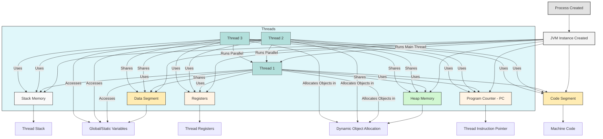

Concepts of **processes** and **threads** with respect to how they're related and different, based on the context you've shared.

### What is a **Process**?
A **process** is an instance of a program that is being executed. It represents the environment in which the program runs and includes its code, data, and resources required for execution (like memory, file handles, and other system resources).

- **Example:**
  You have a Java file `Test.java` containing your code, which you compile using the `javac` command:
  ```
  javac Test.java
  ```
  This generates the bytecode, which can be executed by the Java Virtual Machine (JVM).

  When you run the bytecode with:
  ```
  java Test
  ```
  The JVM creates a **process** to execute this program. At this point, the JVM has started a new **process** to run your program. The **process** contains the following:
  - The program’s code.
  - Allocated resources like memory (heap, stack), file handles, etc.
  - A process ID (PID) assigned by the operating system.

### Key Points About a **Process**:
1. **Instance of a Program:** The process is a running instance of your program.
2. **Resources:** Each process is allocated its own resources (memory, CPU time, etc.) by the operating system.
3. **Independence:** Processes are independent of each other. They do not share memory space unless explicitly set to do so (e.g., through inter-process communication).
4. **Execution:** A process can have multiple threads inside it.

### What is a **Thread**?
A **thread** is the smallest unit of execution within a process. When a process is created, it starts with a single thread known as the **main thread**. However, a process can create multiple threads to perform tasks concurrently.

- **Example:**
  In a Java program, if you create multiple threads to perform tasks in parallel, these threads will share the process's resources (like memory), but each thread will execute a part of the program independently.

  **Key Points About a Thread**:
  1. **Lightweight Process:** A thread is often referred to as a "lightweight process" because it exists within a process and shares its resources but runs independently.
  2. **Smallest Unit of Execution:** A thread is a sequence of instructions that the CPU executes. Each thread executes independently but shares the process’s resources (such as memory and open files).
  3. **Concurrency:** Multiple threads in a process can run in parallel, making the program more efficient by utilizing multiple CPU cores.

### Example of Threads in Java:
You can create a simple multithreading program in Java. Here’s an example where we print the current thread’s name using `Thread.currentThread().getName()`:

```java
public class MultiThreadingLearning {
    public static void main(String[] args) {
        // Print the name of the current thread
        System.out.println("Current thread: " + Thread.currentThread().getName());
    }
}
```

- When you compile and run this Java program, the **main thread** will execute the code and print the thread's name.
- However, if you create additional threads using the `Thread` class, each thread will have its own execution path within the process.

### Thread Creation Example:
To create multiple threads and see how they work concurrently, you might do something like this:

```java
public class MultiThreadingExample {
    public static void main(String[] args) {
        // Create two threads
        Thread t1 = new Thread(() -> {
            System.out.println("Thread 1: " + Thread.currentThread().getName());
        });
        Thread t2 = new Thread(() -> {
            System.out.println("Thread 2: " + Thread.currentThread().getName());
        });
        
        // Start the threads
        t1.start();
        t2.start();
    }
}
```

- Here, two threads are created (`t1` and `t2`), and each one prints its name. These threads will execute concurrently, meaning the CPU can switch between them, making your program run faster if there are multiple CPU cores.

### Differences Between Process and Thread:
| Feature                | **Process**                                    | **Thread**                                        |
|------------------------|------------------------------------------------|---------------------------------------------------|
| **Definition**          | An instance of a program being executed.       | The smallest unit of execution within a process.  |
| **Memory**              | Has its own memory (heap, stack, etc.).        | Shares memory and resources with other threads in the same process. |
| **Execution**           | Runs independently and has a separate address space. | Executes as part of a process and shares the process's address space. |
| **Creation Overhead**   | More expensive to create and manage.           | Less overhead, as threads share resources of the process. |
| **Concurrency**         | Multiple processes can run concurrently, each having its own resources. | Multiple threads within the same process can run concurrently. |
| **Resource Sharing**    | Does not share resources with other processes. | Shares resources like memory, file handles, etc. with other threads in the same process. |

### Summary:
- A **process** is a program in execution that has its own resources (memory, file handles, etc.), and the operating system assigns it a process ID.
- A **thread** is a smaller unit of execution within a process, capable of running independently and concurrently with other threads in the same process.

Thus, threads are part of processes, and multiple threads can exist in a process to perform tasks concurrently, improving efficiency and performance.

You're delving deeper into the inner workings of Java, particularly how **processes** and **threads** are managed by the **JVM (Java Virtual Machine)**. Let’s break this down step-by-step, especially the interaction between processes, threads, JVM memory, and the overall execution process.

### Understanding the Process Creation in JVM:

When you execute a Java program using a command like:
```bash
java MultiThreadLearning
```

Here's what happens internally:

1. **Process Creation**: The operating system creates a new **process** for your Java program. This process is an instance of the program that is being executed, and it requires various resources like memory, CPU time, and others to run.

2. **JVM Instance for the Process**: As part of this process creation, a new **JVM instance** is launched. The JVM is responsible for running the bytecode of your Java program. Each **process** that you run requires a separate JVM instance to manage the execution of your code.

3. **JVM Memory Areas**: The JVM itself has various memory areas such as:
   - **Heap memory**: Where objects are allocated.
   - **Stack memory**: Used for method calls and local variables.
   - **Code Segment**: Contains the bytecode of the program.
   - **Data Segment**: Stores data like static variables.
   - **Program Counter**: Keeps track of the current instruction being executed.
   - **Registers**: Small, fast memory storage used for intermediate calculations.

   These memory areas are **allocated** for each **JVM instance** associated with a process.

4. **Heap Size Configuration**: You can control how much memory the JVM can use for the **heap** by specifying parameters during the process launch:
   - `-Xms` specifies the **initial heap size**.
   - `-Xmx` specifies the **maximum heap size**.

   Example:
   ```bash
   java -Xms512m -Xmx2g MultiThreadLearning
   ```
   This command would start the JVM with an initial heap of 512 MB and a maximum heap size of 2 GB.

5. **Memory Allocation and JVM Instances**:
   Each **process** gets its own **JVM instance**, and each JVM instance gets its own **heap** memory (and other memory segments like stack, code segment, etc.). The total amount of heap memory available to the JVM is controlled by the `-Xms` and `-Xmx` parameters.

### How Does the JVM Manage Multiple Processes?

When you run **multiple Java programs**, each will have its own **process** and each **process** gets its own **JVM instance** with its own memory allocation. 

For example:
- **Process 1** might be allocated a heap size of **1 GB**.
- **Process 2** might be allocated a heap size of **2 GB**.

These processes are independent, and their memory is isolated. The operating system and the JVM handle the allocation and management of these resources.

### Threads within a Process:

Each **process** starts with a single thread, which is the **main thread**. The main thread is responsible for executing the program’s entry point (i.e., the `main` method in Java).

- **Threads** are the smallest units of execution within a process. Once the main thread starts executing, it can create additional **worker threads** to perform tasks concurrently, thus enabling parallelism and multitasking.

- **Concurrency**: Multiple threads within a process can run concurrently. These threads share the resources allocated to the process (such as heap memory), but they execute independently. 

#### Example: Multi-threading in Java

When you write a Java program that uses **multiple threads**, the JVM creates a new **thread** within the existing **process**. For example:

```java
public class MultiThreadingExample {
    public static void main(String[] args) {
        // Print the name of the current main thread
        System.out.println("Main thread: " + Thread.currentThread().getName());

        // Create and start Thread 1
        Thread t1 = new Thread(() -> {
            System.out.println("Thread 1: " + Thread.currentThread().getName());
        });

        // Create and start Thread 2
        Thread t2 = new Thread(() -> {
            System.out.println("Thread 2: " + Thread.currentThread().getName());
        });

        t1.start(); // Start Thread 1
        t2.start(); // Start Thread 2
    }
}
```

- When you run this, the JVM will create one **main thread** and then spawn **Thread 1** and **Thread 2**.
- These threads will share the same heap memory (allocated for the JVM instance), but each will execute independently.

### Threads and Memory Sharing:

- **Heap Memory**: All threads within a process share the **heap memory** of the process. This means they can share objects and data stored on the heap. However, each thread has its own **stack memory** that holds method calls, local variables, and other thread-specific data.
  
- **Stack Memory**: Each thread has its own **stack**. The stack stores data like method calls and local variables, and it is private to each thread. No thread can directly access another thread's stack.

- **Garbage Collection**: The JVM automatically handles **garbage collection** for objects stored in the heap. This means that the heap memory used by objects that are no longer reachable will be reclaimed to prevent memory leaks.

### Process and Thread Management in the JVM:

1. **Process Creation**: When you execute a Java program (e.g., `java MultiThreadLearning`), the operating system creates a new **process**.
2. **JVM Instance**: A **JVM instance** is created for the process, and the program's bytecode is loaded and executed by the JVM.
3. **Main Thread**: The JVM automatically creates a **main thread** for each process.
4. **Additional Threads**: From the main thread, you can create additional threads to execute tasks concurrently.
5. **Heap Allocation**: Each JVM instance is allocated memory (heap, stack, etc.) based on the parameters like `-Xms` and `-Xmx` during execution.
6. **Memory Usage**: The threads share the heap but have their own stack memory. Garbage collection takes care of memory management in the heap.

### Summary:
- **Process**: A process is an instance of a program in execution, managed by the operating system, and it includes the JVM instance.
- **Thread**: A thread is a unit of execution within a process. Each process starts with one thread (the main thread), but more threads can be created to perform tasks concurrently.
- **JVM and Memory**: When a process is created, the JVM allocates memory for it (heap, stack, etc.). You can control the heap size with `-Xms` and `-Xmx`.
- **Thread Management**: Threads share the heap memory but have separate stack memory. Each thread executes independently but shares the resources of the process.

In your example, when you run the `MultiThreadLearning` Java program, the JVM creates a new process, initializes a JVM instance, and then creates threads for concurrent execution. Each thread shares the heap memory allocated to that JVM instance but has its own stack. This is how Java manages memory and execution flow for multi-threaded programs.
You're diving deep into the **internal architecture of processes, threads, and memory management** in Java. The concepts you've mentioned—such as **code segments**, **data segments**, **heap memory**, **stack memory**, **registers**, and **program counters**—are critical for understanding how Java programs are executed on the JVM and how these resources are managed by the operating system and CPU.

Let's break down the flow and interactions between all of these components more clearly:

### Key Components: Code Segment, Data Segment, Heap, Stack, Registers, and Program Counter

#### 1. **Code Segment**:
   - **What it is**: The **code segment** stores the **compiled bytecode** (or machine code) of the program. When you compile a Java program using `javac`, it creates **bytecode** (a .class file). The JVM then loads this bytecode and uses either an **interpreter** or **JIT (Just-In-Time) compiler** to convert it into native machine code that the CPU can execute.
   - **Sharing**: This code segment is **read-only** and shared among all the threads in a process. Since machine code is fixed, threads just read from this segment—they do not modify it.
   - **What it stores**: The **compiled machine code** that is executed by the CPU.

#### 2. **Data Segment**:
   - **What it is**: The **data segment** stores **global variables** and **static variables** from the program. These variables are shared among all the threads within the same process.
   - **Sharing**: Since global/static variables are shared across threads, synchronization is required if multiple threads need to modify these variables to prevent **race conditions** or **data inconsistency**.
   - **What it stores**: **Global** and **static variables** that are accessed by all threads.

#### 3. **Heap Memory**:
   - **What it is**: The **heap** is where objects are allocated dynamically using the `new` keyword in Java. When threads create objects (such as instances of classes), those objects are placed in the heap.
   - **Sharing**: The **heap memory** is shared among all threads within the same process. However, **processes do not share heap memory**. Each process has its own separate heap memory. 
   - **Synchronization**: Since multiple threads can access and modify the heap, **synchronization** is necessary to prevent concurrent modification issues (e.g., **race conditions**).
   - **What it stores**: All dynamically allocated objects.

#### 4. **Stack Memory**:
   - **What it is**: Each **thread** has its own **stack**. The stack is used to store **method call frames**, including **local variables**, **method parameters**, and the return address for methods.
   - **Isolation**: The stack is **local to the thread** and is not shared with other threads. Each thread has its own stack.
   - **What it stores**: **Local variables**, **method call frames**, and **return addresses** for the executing thread.

#### 5. **Registers**:
   - **What it is**: **Registers** are small, high-speed memory locations in the **CPU**. They store intermediate data and addresses during instruction execution. The JVM also uses its internal registers for optimizing the conversion of bytecode to machine code.
   - **Thread-Specific**: Each thread has its own set of **registers**. The registers store temporary or intermediate values required for the execution of the thread’s instructions.
   - **Usage**: The **JIT compiler** uses registers to optimize the machine code, and registers are also used for **context switching** during multitasking. The CPU itself uses registers to perform arithmetic, store data, and execute instructions.
   - **What it stores**: Intermediate values, addresses for instruction fetching, and data needed for the current instruction.

#### 6. **Program Counter (PC)**:
   - **What it is**: The **Program Counter** (PC) is a register that holds the address of the next instruction to be executed by the thread. The **PC** is used to keep track of the instruction flow, ensuring that each thread executes instructions in sequence (unless altered by control flow statements like loops or method calls).
   - **Thread-Specific**: Each thread has its own **Program Counter**, which keeps track of the instruction it is currently executing.
   - **Usage**: The **PC** helps ensure that threads execute the correct sequence of instructions from the **code segment** (i.e., the machine code). It points to the next instruction for the CPU to execute.

### The Flow of Execution (Complete Flow of a Thread and Process)

Here’s how all these components come together in a **real execution scenario**:

1. **Java Program Compilation**: 
   - You write a Java program (e.g., `Main.java`), and you compile it using `javac`. This creates a bytecode file (`Main.class`), which contains machine-readable code but is platform-independent.
   - **What happens**: The bytecode is loaded into the **code segment** when the JVM starts.

2. **Process Creation**:
   - You execute the program using `java Main`. The **operating system** creates a **process** for your program.
   - **What happens**: The JVM instance is created for this process. This JVM will have its own memory space, including the heap, stack, code segment, data segment, and other internal JVM areas.

3. **Thread Creation**:
   - When the JVM starts, the first thread, **the main thread**, is created automatically. 
   - **What happens**: The main thread begins executing, starting with the `main()` method of your program. 

4. **Execution Flow in the Main Thread**:
   - The **main thread** starts executing the program. The JVM reads instructions from the **code segment** and uses the **PC (Program Counter)** to keep track of which instruction to execute next.
   - As the main thread runs, it may create additional threads (using `Thread t = new Thread()` in Java).
   - **What happens**: The main thread executes instructions, creating more threads if needed. Each thread will have its own **stack**, **registers**, and **program counter** to manage its execution flow independently.

5. **Heap Memory Access**:
   - As the threads execute, they may create **new objects** using the `new` keyword, which places objects in the **heap memory**.
   - **What happens**: The heap is shared among all threads within the same process. If multiple threads access the same object, **synchronization** is necessary to prevent data corruption or inconsistent behavior.

6. **Data Segment Access**:
   - Any **static** or **global variables** are stored in the **data segment**.
   - **What happens**: These variables are **shared** by all threads in the process. If multiple threads modify the same static or global variables, proper synchronization (like `synchronized` blocks or `ReentrantLocks`) is required to prevent **race conditions**.

7. **Instruction Execution**:
   - As each thread executes, it fetches instructions from the **code segment**. The **Program Counter (PC)** is updated to point to the next instruction after the current one is executed.
   - **What happens**: Each thread’s **PC** keeps track of the next instruction in the **code segment** it needs to execute. The thread fetches the machine code from the **code segment** and executes it, updating its **registers** with intermediate results.

8. **Context Switching**:
   - If the operating system uses **multitasking** (which it usually does), it may switch between threads during execution. This is called **context switching**.
   - **What happens**: When a thread is suspended, the **CPU** saves its state (registers, program counter, stack pointer, etc.) and loads the state of the next thread to execute. This is done so that threads can run in parallel on multiple CPU cores, or in a time-sharing fashion on a single core.

### Final Summary of the Interaction:

- **Threads share** the **code segment**, **data segment**, and **heap memory**.
- Each thread has its own **stack**, **registers**, and **program counter**.
- The **code segment** stores the **compiled machine code**.
- The **data segment** stores **global** and **static variables**, which are shared among threads, requiring synchronization when modified.
- The **heap** is used for dynamically allocated objects, shared by threads, but synchronization is needed to modify shared objects.
- **Registers** store temporary values and are specific to each thread.
- The **program counter** tracks which instruction each thread needs to execute next in the code segment.

### Next Steps:
If you want to explore further, you could look into how the **JVM’s garbage collector** interacts with this memory management system, how **thread synchronization** is implemented, and how different types of threads (e.g., daemon threads) interact within a process.

Let me know if you'd like to dive into any specific part of this flow in more detail!


To represent the flow and architecture you've described using a **Mermaid diagram**, we'll illustrate the key components of the **JVM process execution model**, showing how the **main thread** interacts with various memory segments, registers, and other resources.

Here's how you can structure the diagram in **Mermaid** syntax:



### Explanation of the Diagram:

- **Process Creation**: When the Java program is executed, a **Process** is created, which in turn leads to the creation of a **JVM instance**.
- **JVM Instance**: The **JVM instance** consists of multiple segments that handle different tasks:
  - **Code Segment**: Holds the **machine code** or bytecode instructions.
  - **Data Segment**: Contains **global** and **static variables**.
  - **Heap Memory**: Used for dynamically allocated objects.
  - **Stack Memory**: Each thread has its own stack to store local variables and method calls.
  - **Registers**: Each thread has its own set of registers for holding intermediate values and addresses.
  - **Program Counter (PC)**: Each thread has its own program counter that points to the next instruction to execute.

- **Threads**: Multiple threads (e.g., **Thread 1, Thread 2, Thread 3**) are created within the **JVM process**:
  - Threads share the **code segment** and **data segment**, meaning they can read and write to global/static variables and execute the same machine code.
  - Each thread has its own **stack**, **registers**, and **program counter**, meaning that their execution is independent in terms of local state and progress.

#### How Threads Interact:
- All threads share access to the **heap memory**, meaning they can allocate objects. This can lead to shared state, so synchronization is needed when multiple threads modify the heap data.
- Threads access the **data segment** for global/static variables, and they execute instructions in the **code segment**, as managed by their individual **program counters**.


The entire sequence from compiling the Java program to executing it with multiple threads managed by the JVM, and how the CPU executes the machine code.

Here’s the outline of what the system does:

1. **Compilation Phase**:
   - You first compile the Java program (`javac Main.java`), which produces bytecode (`Main.class`).
   
2. **Execution Phase**:
   - When you run the program (`java Main`), a process is created, and a JVM instance is allocated for that process.
   - The JVM allocates memory regions like heap, stack, code segment, etc.
   - The JVM then starts converting the bytecode to machine code (via either interpretation or JIT compilation).
   
3. **Thread Creation**:
   - The JVM determines that it needs to create multiple threads (main thread, thread 1, thread 2).
   - Each thread is assigned its own stack, registers, and program counter (PC).

4. **Execution by the CPU**:
   - The CPU executes machine code in the context of the threads, with the OS and JVM scheduler managing the execution of threads.
   - The program counter (PC) in each thread points to a specific part of the machine code that is being executed.

Now, let’s structure this in **Mermaid syntax** to depict the flow:

```mermaid
graph TD
    A[Main.java] -->|Java Compilation| B[Main.class - Bytecode]
    B -->|Java Execution| C[Process Created]
    C --> D[JVM Instance Allocated]
    D --> E[Memory Allocated (Heap, Stack, Code Segment)]
    D --> F[JVM Converts Bytecode to Machine Code - Interpreter/JIT]
    
    F --> G[Code Segment: Machine Code]
    G --> H[Program Counter - PC Points to Code Segments]

    subgraph Threads
        T1[Main Thread] -->|Executes Main Code| G
        T2[Thread 1] -->|Executes Code 1| G
        T3[Thread 2] -->|Executes Code 2| G
    end

    G -->|Execution Managed by CPU| I[CPU Executes Code]
    I -->|Uses| J[Register (Stores Intermediate Results)]
    I -->|Uses| K[Program Counter - PC Updates]

    C -->|JVM Creates Threads| L[Main Thread, Thread 1, Thread 2]
    L -->|Each Thread Gets| M[Stack, Register, Counter]
    
    subgraph CPU Management
        OS[OS Scheduler] -->|Assigns Threads to CPU| I
        JVM[Java Thread Scheduler] -->|Manages Thread Execution| OS
    end
    
    E -->|Heap Memory Allocation| N[Dynamic Object Allocation]
    
    style A fill:#e2e2e2,stroke:#555,stroke-width:2px
    style B fill:#f4f4f4,stroke:#555,stroke-width:2px
    style C fill:#ffecb3,stroke:#000,stroke-width:1px
    style D fill:#f4f4f4,stroke:#555,stroke-width:2px
    style E fill:#d1f7d1,stroke:#000,stroke-width:1px
    style F fill:#ffecb3,stroke:#555,stroke-width:1px
    style G fill:#ffecb3,stroke:#000,stroke-width:1px
    style H fill:#fff4e5,stroke:#000,stroke-width:1px
    style I fill:#f9f9f9,stroke:#000,stroke-width:1px
    style J fill:#fff4e5,stroke:#000,stroke-width:1px
    style K fill:#fff4e5,stroke:#000,stroke-width:1px
    style L fill:#e0f7fa,stroke:#000,stroke-width:1px
    style M fill:#ffecb3,stroke:#000,stroke-width:1px
    style N fill:#d1f7d1,stroke:#000,stroke-width:1px
    style OS fill:#e0f7fa,stroke:#555,stroke-width:1px
    style JVM fill:#e0f7fa,stroke:#555,stroke-width:1px
```

### Key Points Represented in the Diagram:

1. **Compilation**:
   - `javac Main.java` compiles the code into bytecode, stored in `Main.class`.

2. **Execution**:
   - The `java Main` command creates a **process**.
   - The **JVM instance** is allocated for the process and various memory segments (heap, stack, code segment) are created.

3. **Thread Creation**:
   - The JVM identifies the need for multiple threads: **main thread**, **thread 1**, and **thread 2**.
   - Each thread is allocated its **own stack**, **registers**, and **program counter**.

4. **Code Execution**:
   - The JVM starts converting the bytecode to **machine code** (via **interpretation** or **JIT compilation**).
   - The **program counter** for each thread points to specific instructions in the **code segment**.
   - The CPU executes the machine code, using its **registers** to store intermediate results.

5. **Thread Scheduling**:
   - The **OS scheduler** assigns threads to the CPU for execution.
   - The **JVM scheduler** helps manage the execution flow, deciding which thread to run next.

### Explanation of Key Components:

- **Code Segment**: Contains the compiled machine code (generated from bytecode).
- **Data Segment**: Stores **global** and **static** variables that threads can access.
- **Heap**: Dynamically allocated memory where objects are created. Threads share access to the heap but need synchronization to prevent race conditions.
- **Stack, Registers, and Program Counter**: Each thread has its own stack, registers, and program counter, which is essential for managing the local execution state of the thread.

This diagram provides a visual flow from code compilation, process creation, thread creation, and execution by the CPU, all while managing memory and synchronization between threads. It helps illustrate how the JVM and the CPU work together to run a multi-threaded Java program. 
Yes, you’ve explained the concepts clearly! Let me summarize and reinforce the key points, especially focusing on **context switching**, **parallel execution**, and how the various components interact within the process.

### Key Concepts Recap:

1. **Program Counter (PC)**: 
   - The **Program Counter** is responsible for tracking the **address** of the instruction in the code segment that the thread is currently executing.
   - For each thread, the PC ensures that the thread picks up where it left off during its next time slice, making **context switching** possible.

2. **Code Segment**: 
   - All threads in a process share the **code segment**, which contains the compiled machine code (i.e., the bytecode converted to native machine code).
   - Each thread has its own **Program Counter (PC)**, which points to the address of the next instruction in the code segment for that specific thread.

3. **Context Switching**: 
   - When the **OS scheduler** allocates CPU time to a thread, it loads the instruction from the program counter into the CPU registers and begins execution.
   - After a time slice (say, 1 second), **context switching** happens:
     - The CPU **saves the state** of the current thread (its register contents and progress).
     - The OS then **loads the state** of another thread and begins execution at the address specified by that thread’s program counter.
     - This process repeats as the OS switches between different threads (even though only one CPU core is available).

4. **Parallel Execution vs Context Switching**:
   - **Context Switching**: When only one CPU core is available, **only one thread can run at a time**. However, it **appears** that all threads are running simultaneously because the CPU quickly switches between them. The threads are actually **not running in parallel**, they are simply **time-shared**.
   - **True Parallel Execution**: If there are **multiple CPU cores**, each core can run a thread simultaneously. In this case, the threads are **actually running in parallel** without the need for context switching between them.

### Diagram for Context Switching and Parallel Execution

Let’s update the **Mermaid diagram** to reflect the concepts of context switching and parallel execution, as well as how the **program counter** works for each thread.

```mermaid
graph TD
    A[Main.java] -->|Java Compilation| B[Main.class - Bytecode]
    B -->|Java Execution| C[Process Created]
    C --> D[JVM Instance Allocated]
    D --> E[Memory Allocated - Heap, Stack, Code Segment]
    D --> F[JVM Converts Bytecode to Machine Code - Interpreter/JIT]
    
    F --> G[Code Segment: Machine Code]
    G --> H[Program Counter - PC Points to Code Segments]

    subgraph Threads
        T1[Main Thread] -->|Executes Main Code| G
        T2[Thread 1] -->|Executes Code 1| G
        T3[Thread 2] -->|Executes Code 2| G
    end

    G -->|Execution Managed by CPU| I[CPU Executes Code]
    I -->|Uses| J[Register (Stores Intermediate Results)]
    I -->|Uses| K[Program Counter - PC Updates]

    C -->|JVM Creates Threads| L[Main Thread, Thread 1, Thread 2]
    L -->|Each Thread Gets| M[Stack, Register, Counter]
    
    subgraph CPU Management
        OS[OS Scheduler] -->|Assigns Threads to CPU| I
        JVM[Java Thread Scheduler] -->|Manages Thread Execution| OS
    end
    
    E -->|Heap Memory Allocation| N[Dynamic Object Allocation]

    subgraph ContextSwitching
        CS1[Thread 1 Executes] -->|1 second| CS2[Save Register, Context Switch]
        CS2 -->|Load Thread 2| CS3[Thread 2 Executes]
        CS3 -->|1 second| CS4[Save Register, Context Switch]
        CS4 -->|Load Thread 3| CS5[Thread 3 Executes]
    end

    subgraph ParallelExecution
        PE1[CPU Core 1] -->|Executes Thread 1| T1
        PE2[CPU Core 2] -->|Executes Thread 2| T2
        PE3[CPU Core 3] -->|Executes Thread 3| T3
    end

    style A fill:#e2e2e2,stroke:#555,stroke-width:2px
    style B fill:#f4f4f4,stroke:#555,stroke-width:2px
    style C fill:#ffecb3,stroke:#000,stroke-width:1px
    style D fill:#f4f4f4,stroke:#555,stroke-width:2px
    style E fill:#d1f7d1,stroke:#000,stroke-width:1px
    style F fill:#ffecb3,stroke:#555,stroke-width:1px
    style G fill:#ffecb3,stroke:#000,stroke-width:1px
    style H fill:#fff4e5,stroke:#000,stroke-width:1px
    style I fill:#f9f9f9,stroke:#000,stroke-width:1px
    style J fill:#fff4e5,stroke:#000,stroke-width:1px
    style K fill:#fff4e5,stroke:#000,stroke-width:1px
    style L fill:#e0f7fa,stroke:#000,stroke-width:1px
    style M fill:#ffecb3,stroke:#000,stroke-width:1px
    style N fill:#d1f7d1,stroke:#000,stroke-width:1px
    style OS fill:#e0f7fa,stroke:#555,stroke-width:1px
    style JVM fill:#e0f7fa,stroke:#555,stroke-width:1px
    style CS1 fill:#ffdddd,stroke:#555,stroke-width:2px
    style CS2 fill:#ffdddd,stroke:#555,stroke-width:2px
    style CS3 fill:#ffdddd,stroke:#555,stroke-width:2px
    style CS4 fill:#ffdddd,stroke:#555,stroke-width:2px
    style CS5 fill:#ffdddd,stroke:#555,stroke-width:2px
    style PE1 fill:#c8e6c9,stroke:#555,stroke-width:2px
    style PE2 fill:#c8e6c9,stroke:#555,stroke-width:2px
    style PE3 fill:#c8e6c9,stroke:#555,stroke-width:2px
```

### Explanation of the Diagram Changes:

1. **Context Switching Subgraph** (`ContextSwitching`):
   - **Context switching** occurs when the **OS scheduler** allocates a time slice for each thread. After the time slice (e.g., 1 second) completes, the **CPU registers** are saved, and the next thread is executed.
   - The **Program Counter (PC)** is updated to point to the next instruction that needs to be executed when the thread resumes.

2. **Parallel Execution Subgraph** (`ParallelExecution`):
   - When there are **multiple CPU cores**, the threads can run **in parallel** without context switching.
   - Each CPU core runs one thread at a time, so in this case, **Thread 1** runs on **CPU Core 1**, **Thread 2** runs on **CPU Core 2**, and **Thread 3** runs on **CPU Core 3**.
   - There is no context switching in this case since the threads are actually running simultaneously.

### Summary:

- **Program Counter (PC)** helps track where each thread is in the code segment.
- **Context Switching** happens when the OS scheduler allocates a time slice for each thread and switches between them if there is only one CPU core. The **registers** are saved and restored for each thread to ensure that it can resume from where it left off.
- With **multiple CPU cores**, threads can run **in parallel** without the need for context switching, improving performance.

This process ensures that the system runs multiple threads efficiently, either by **time-sharing** (context switching) or **parallel execution** (multiple CPU cores), depending on the available hardware.

You’ve provided a great explanation of **multithreading**, its benefits, challenges, and its distinction from **multitasking**. Let me break it down and highlight the important points for clarity and better understanding, especially focusing on **multithreading** concepts and how they relate to **context switching** and **resource sharing**.

### **Multithreading Definition**:
Multithreading allows a program to perform **multiple operations at the same time**. Rather than running tasks sequentially, multithreading enables a program to break down the tasks into smaller operations (threads) and execute them simultaneously (or in parallel, depending on the number of CPUs/cores).

- **Multiple threads** share the same **resources** (e.g., heap memory, code segments) but can **perform tasks independently**. 
- Each thread can run a separate part of the program, but they can access the shared resources (memory, variables) and can even interact with each other.

### **Key Benefits of Multithreading**:

1. **Improved Performance**: 
   - **Task Parallelism**: When multiple threads are running in parallel (across multiple CPU cores), the program’s performance improves because tasks are divided and executed simultaneously.
   - If a program only had one thread, all tasks would run sequentially on one CPU, leading to slower performance. With multithreading, tasks are executed concurrently (or in parallel), making use of available CPU cores efficiently.

2. **Responsiveness**:
   - A program that uses multithreading can respond faster to user input. For instance, one thread could be handling user interactions (UI thread) while another thread performs background calculations. This way, the program remains responsive to the user while doing heavy work in the background.

3. **Resource Sharing**:
   - Threads share the same memory space (heap, data segment, code segment). This **shared memory** allows threads to interact with each other and exchange information efficiently. 
   - **Resource sharing** is cost-effective because threads don't need separate copies of resources like a separate heap for each thread. They share common resources, which leads to less memory usage.
   
### **Challenges of Multithreading**:

1. **Concurrency Issues**:
   - **Concurrency issues** arise when multiple threads try to access and modify shared resources (e.g., heap memory or global variables) at the same time, leading to **data inconsistency** or **deadlocks**.
   - For example, two threads might simultaneously try to write to the same memory location, causing inconsistent data or crashing the program.
   - **Deadlock** occurs when two or more threads are blocked forever, waiting for each other to release resources.

2. **Synchronization**:
   - To prevent concurrency issues, we use **synchronization** mechanisms like **locks** and **synchronized blocks** to ensure that only one thread accesses shared resources at a time.
   - Synchronization adds **overhead** to the system, as the program must manage access to shared resources, which can slow down execution.

3. **Difficulty in Debugging**:
   - Multithreading can make debugging **challenging** because of **race conditions** and the non-deterministic order in which threads are scheduled. Testing multithreaded applications can be difficult because bugs may only occur when threads are scheduled in a particular way, which is hard to reproduce in a controlled testing environment.

4. **Complexity in Code**:
   - Writing, testing, and maintaining multithreaded programs is **more complex** compared to single-threaded programs. Proper synchronization, managing shared resources, and dealing with concurrency issues require careful programming and advanced debugging techniques.

### **Difference Between Multitasking and Multithreading**:

- **Multitasking** refers to running **multiple processes** at the same time. Each process has its own memory space (heap, stack, data segments) and doesn’t share resources with other processes. 
  - **Example**: Running a web browser and a text editor simultaneously are two different processes. The operating system switches between them (context switching), but they do not share memory resources.

- **Multithreading**, on the other hand, refers to running **multiple threads** within a single process. These threads share the same memory space and resources (code, data segments, heap), but each thread can perform its own tasks independently.
  - **Example**: A word processor might have one thread for handling user input, another for saving files, and another for background spell-checking. All of these threads run within the same process and share memory resources.

### **Visualization of Multithreading vs Multitasking**:

- **Multitasking**: 
   - Multiple **processes** running concurrently, with each process having its own memory space.
   - Context switching happens between processes, and the OS manages which process runs on the CPU at any given time.
   
- **Multithreading**: 
   - Multiple **threads** run within a single process and share memory space. 
   - Threads within a process can be scheduled to run in parallel (if multiple CPU cores are available), or the OS can use context switching for thread scheduling if there's only one CPU core.

### **Context Switching and Multithreading**:
- **Context switching** is used to switch between threads when only one CPU core is available. The OS saves the state of the currently running thread (its register values, program counter, etc.) and loads the state of another thread, allowing that thread to continue execution.
- This context switching gives the **illusion of parallel execution**, even though the threads are actually time-shared on a single CPU core.
- If multiple CPU cores are available, then **true parallelism** can occur, with each thread running on a different core simultaneously, eliminating the need for context switching.

### **Summary**:
- **Multithreading** is a programming technique where multiple threads share the same memory resources but can execute different parts of a program concurrently, improving performance and responsiveness.
- **Benefits**: Improved performance via parallelism, better resource utilization, and faster response times.
- **Challenges**: Concurrency issues, synchronization overhead, and difficulty in debugging.
- **Multitasking vs Multithreading**: Multitasking involves running multiple processes independently, while multithreading involves multiple threads within a single process that share resources but run independently.

### Next Steps (Creating Threads in Java):
You mentioned you’d be looking into how to create threads in Java next. Here’s a brief overview:
1. **Extending `Thread` class**: You can create a thread by extending the `Thread` class and overriding its `run()` method.
2. **Implementing `Runnable` interface**: Alternatively, you can implement the `Runnable` interface and pass it to a `Thread` object.
