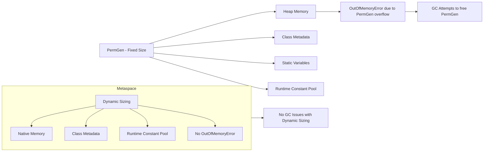
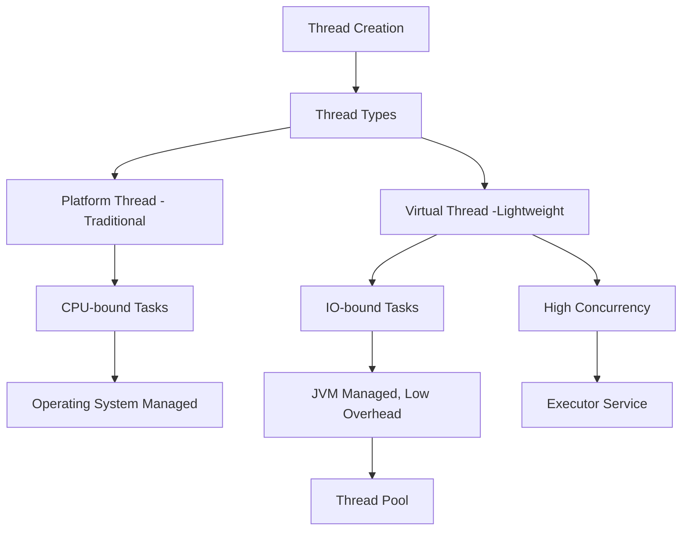
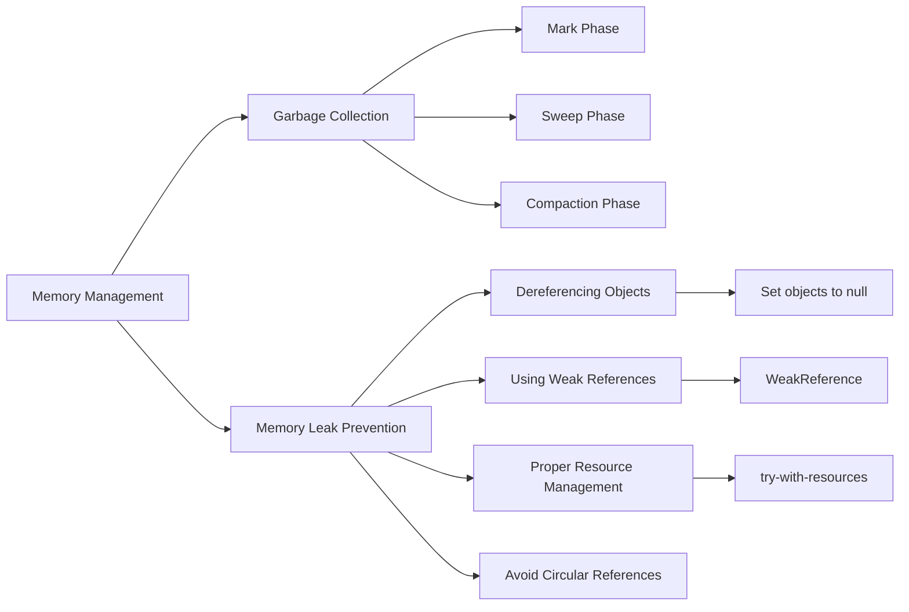

### **Virtual Threads Concept**

Virtual threads are lightweight threads that allow you to create many threads without the heavy memory and resource overhead associated with traditional OS threads. In languages like **Java**, virtual threads are part of the **Project Loom** initiative, aiming to simplify concurrency and scalability.

#### **Key Characteristics of Virtual Threads:**
1. **Lightweight**: Virtual threads are cheaper to create and manage than traditional operating system threads. They consume less memory and can be created in large numbers.
2. **Managed by the JVM**: The Java Virtual Machine (JVM) manages virtual threads, not the operating system. This allows more efficient scheduling and handling of a large number of threads.
3. **Concurrency without blocking**: Virtual threads allow you to handle many I/O-bound tasks (e.g., network requests, file operations) concurrently without blocking threads. They are especially useful in high-concurrency applications, like web servers or databases.

#### **How Virtual Threads Work:**
- Virtual threads are scheduled by the **Java scheduler** rather than the OS. The JVM can run many virtual threads on a smaller number of physical threads (OS threads). 
- This is particularly beneficial for I/O-bound workloads, where threads spend a lot of time waiting for external resources (like network responses or disk operations), and the scheduler can switch between threads without blocking.

### **Example of Using Virtual Threads in Java**

Here's a simple example of using virtual threads in Java (Java 19+ with Project Loom):

```java
public class VirtualThreadExample {
    public static void main(String[] args) {
        // Creating virtual threads using Thread.ofVirtual().start()
        Runnable task = () -> {
            try {
                // Simulate a task that takes time, like I/O operation
                Thread.sleep(1000);
                System.out.println("Task completed by " + Thread.currentThread().getName());
            } catch (InterruptedException e) {
                Thread.currentThread().interrupt();
            }
        };

        // Start virtual threads
        for (int i = 0; i < 10; i++) {
            Thread.ofVirtual().start(task); // Virtual thread is created and started
        }
    }
}
```

In this example:
- We create virtual threads using `Thread.ofVirtual().start()`.
- The task simulates some I/O-bound operation (e.g., `Thread.sleep()`).
- You can start a large number of virtual threads because they are lightweight and don’t consume significant resources.

### **How Virtual Threads Manage Memory and Prevent Memory Leaks**

When dealing with virtual threads, **memory management** is key to preventing issues like memory leaks. The Java garbage collector and the JVM are responsible for managing the memory used by virtual threads, but you need to take care of certain aspects:

1. **Thread Lifecycle Management**:
   - Virtual threads are lightweight and are designed to be short-lived. Ensure threads are terminated properly once they are done executing their tasks. If virtual threads are not properly terminated or cleaned up, they could lead to memory leaks.
   - Always use proper exception handling and resource cleanup (e.g., closing streams or sockets).

2. **Avoiding Memory Leaks**:
   - **Weak References**: Use `WeakReference` or `SoftReference` when caching objects in memory. These references allow the garbage collector to clean up objects when memory is needed.
   - **Thread Pooling**: Instead of creating new virtual threads continuously, reuse threads from a thread pool. This avoids the overhead of creating and destroying threads repeatedly.
   - **Resource Management**: Ensure that any resources (e.g., database connections, file handles) used within virtual threads are released when the task completes.
   
3. **Memory Consumption**:
   - Since virtual threads share the same OS thread, they don't have their own dedicated stack memory like traditional threads. However, if you hold on to large objects or data structures for too long within the virtual thread, it can lead to increased memory consumption.
   - Regularly monitor memory usage using profiling tools (e.g., **JProfiler**, **VisualVM**) to detect memory issues.

### **Handling Large Amounts of Data Efficiently**

When dealing with large datasets, especially in concurrent programming, you must be careful to avoid excessive memory consumption and slow performance.

1. **Data Streaming and Chunking**:
   - Instead of loading large datasets entirely into memory, process data in chunks or streams. This reduces the memory footprint.
   - Use techniques like **streaming I/O** (e.g., `BufferedReader` or `InputStream`) to read data in smaller, manageable pieces. This is especially helpful when reading large files or making network calls.
   
   **Example:**
   ```java
   public class DataStreamExample {
       public static void main(String[] args) throws IOException {
           Path path = Paths.get("largeFile.txt");
           try (BufferedReader reader = Files.newBufferedReader(path)) {
               String line;
               while ((line = reader.readLine()) != null) {
                   processLine(line); // Process each line without loading the entire file into memory
               }
           }
       }

       private static void processLine(String line) {
           // Process the data (e.g., parsing, transforming)
           System.out.println(line);
       }
   }
   ```

2. **Efficient Data Structures**:
   - Use data structures that are memory-efficient. For instance, consider **maps** and **sets** with hash-based structures or specialized memory-efficient collections (like `Int2IntMap` from the **FastUtil** library).
   
3. **Memory-Mapped Files**:
   - For extremely large files, **memory-mapped files** allow you to map large chunks of files into memory and access them directly, without needing to load the entire file into RAM.
   - In Java, you can use `MappedByteBuffer` from the `java.nio` package to work with large datasets efficiently.

4. **Offload Processing**:
   - Offload parts of your data processing to external systems or use distributed processing frameworks (like **Apache Kafka**, **Apache Spark**, or **Flink**) to handle large-scale data in a distributed manner.

### **Diagram: Virtual Threads and Memory Management**

Here’s a conceptual diagram that shows how virtual threads are managed in terms of memory and handling large data:

```
 +--------------------------------------------+
 |                 JVM (Thread Scheduler)     |          
 |                                            |  
 |  +-----------+  +-----------+  +-----------+  |
 |  | Virtual   |  | Virtual   |  | Virtual   |  |
 |  | Thread 1  |  | Thread 2  |  | Thread 3  |  |
 |  +-----------+  +-----------+  +-----------+  | 
 |        |              |              |        |
 |    I/O Blocked     I/O Blocked     I/O Blocked  | 
 +--------------------------------------------+  
            |
     +--------------------+                 
     |    Resource Pool   |   -> Handles resources like DB connections
     +--------------------+
            |
 +--------------------------------------------+
 |             Garbage Collector (GC)         | <- Periodically frees up memory, including virtual threads
 +--------------------------------------------+
```

#### **Explanation of the Diagram**:
- **JVM Scheduler**: Manages the execution of virtual threads, switching between them when they are blocked (e.g., waiting for I/O).
- **Virtual Threads**: These are lightweight threads that execute tasks asynchronously. When they block on I/O (like waiting for data from a database or network), the JVM can switch to other threads.
- **Resource Pool**: A pool can be used to manage external resources like database connections, file handles, etc. This avoids creating new resources repeatedly.
- **Garbage Collector (GC)**: It periodically frees up memory, including the memory used by terminated virtual threads, preventing memory leaks.


Here's the **flow diagram** based on the flow you described:


### Explanation:
- **JVM (Thread Scheduler)** schedules and manages virtual threads.
- Virtual threads (`Virtual Thread 1`, `Virtual Thread 2`, `Virtual Thread 3`) are lightweight threads that perform tasks.
- Each virtual thread might be **I/O blocked** (waiting for external resources), so it connects to a **Resource Pool**.
- The **Garbage Collector (GC)** periodically cleans up unused memory, including resources held by virtual threads. 

### **Summary**
- **Virtual Threads** provide an efficient way to handle high concurrency, especially for I/O-bound operations. They are lightweight and managed by the JVM, reducing resource consumption compared to OS threads.
- **Memory Management** involves using tools like thread pooling, weak references, and ensuring that resources are properly released after use to avoid memory leaks.
- **Handling Large Data** is achieved by using techniques like chunking, streaming, memory-mapped files, and offloading processing to external systems.
---
In Java, **virtual threads** are a new lightweight implementation of threads introduced in **Java 19** as part of the **Project Loom**. These virtual threads are different from traditional platform threads in how they are managed by the **Java Virtual Machine (JVM)**. Here's a comparison of how **virtual threads** differ from **platform threads**:

- **Platform Threads**: These are traditional Java threads that map directly to native OS threads, which means the operating system schedules and manages them. They are generally heavier because each thread consumes more system resources (like memory for stack space).
  
- **Virtual Threads**: These are lightweight threads managed by the JVM rather than the OS. The JVM schedules virtual threads on a smaller set of platform threads, allowing the creation of many more virtual threads with minimal overhead.

### **Mermaid Diagram: Virtual Threads vs Platform Threads in JVM**


### **Explanation of Diagram**:

- **Java Application**: This represents the Java program which creates threads.
- **Thread**: Java code uses the `Thread` class to create either platform or virtual threads.
- **Platform Thread**: In the traditional model, the `Thread` object is directly mapped to a platform (native) thread, and the **Operating System** schedules it.
- **Virtual Thread**: A virtual thread is created by the JVM. The JVM has a **JVM Scheduler** that manages virtual threads in a more lightweight way. The **JVM Scheduler** maps virtual threads onto a small number of platform threads that the **Operating System** schedules.
- **Platform Threads Pool**: Multiple virtual threads are mapped to a pool of platform threads, reducing the overhead of creating many individual threads.

### **Key Differences**:

1. **Thread Creation Overhead**:
   - **Platform Threads**: The OS directly manages these threads, so they consume significant memory and CPU resources for each thread created.
   - **Virtual Threads**: The JVM manages them, and they have minimal overhead, enabling the creation of a large number of virtual threads.

2. **Scheduling**:
   - **Platform Threads**: The operating system schedules platform threads, which can be inefficient if there are too many threads.
   - **Virtual Threads**: The JVM schedules virtual threads and can efficiently handle thousands of virtual threads without burdening the OS.

3. **Use Cases**:
   - **Platform Threads**: Best suited for applications where the number of concurrent threads is limited, and the tasks are CPU-bound or require native OS interaction.
   - **Virtual Threads**: Ideal for IO-bound tasks or highly concurrent applications, as they allow you to manage thousands or even millions of concurrent tasks without overwhelming the OS.

This comparison illustrates how virtual threads optimize the management of threads in Java by offloading scheduling to the JVM, allowing for more efficient and scalable concurrency.

---

To achieve improvements in throughput, latency, scaling, and performance, it's important to focus on different strategies tailored to each area. Here's how you can address each aspect:

### 1. **Throughput (Work Done in a Given Time)**
   - **Concurrency (Threads, Virtual Threads)**: 
     - Use multi-threading or virtual threads to execute multiple tasks concurrently. This allows your system to process more tasks simultaneously, increasing throughput.
     - Virtual threads (in Java, for example) are lightweight and consume fewer resources, allowing you to scale better when there are many tasks to process.
     - Use thread pools to manage threads efficiently, avoiding the overhead of creating and destroying threads repeatedly.
     - Example: In Java, using `ExecutorService` for thread pooling or `java.util.concurrent` to manage concurrency can improve throughput.

   - **Parallel Processing**:
     - Break down tasks into smaller sub-tasks that can be processed in parallel across multiple CPUs or cores.
     - Leverage parallelism through frameworks like **ForkJoinPool** in Java or **Parallel Streams** in Java 8 and later.
   
### 2. **Latency (Time Delay Before Task Completes)**
   - **Non-Blocking I/O**:
     - Use non-blocking I/O operations (e.g., async I/O, reactive programming models) to prevent tasks from being delayed while waiting for I/O operations (like reading from a disk or network).
     - In Java, you can use frameworks like **NIO (New I/O)** or **reactor pattern** libraries such as **Project Reactor** to handle asynchronous tasks.
     - Node.js, for example, uses non-blocking I/O for high-performance network requests.

   - **Optimize Algorithms**:
     - Analyze the algorithms used in your system and identify inefficiencies. Implement more efficient algorithms or data structures to reduce the time complexity of key operations (e.g., using hash maps for lookups instead of linear searches).
     - Example: Use algorithms with better time complexity, like sorting with merge sort (O(n log n)) instead of bubble sort (O(n²)).

   - **Caching**:
     - Implement caching strategies to store frequently accessed data in memory, which can dramatically reduce access time compared to fetching data from slower storage systems (e.g., databases).
     - Use **LRU (Least Recently Used)** or **LFU (Least Frequently Used)** cache eviction strategies depending on your use case.
     - Tools like **Redis** or **Memcached** are widely used for caching.

### 3. **Scaling (Handling More Load by Adding Resources)**
   - **Horizontal Scaling** (Adding More Servers/Instances):
     - Distribute the workload across multiple servers to handle increased traffic or demand. This can be achieved through load balancers to distribute requests evenly.
     - Use cloud-based solutions like AWS, Azure, or Google Cloud for auto-scaling, where new instances are added dynamically based on traffic patterns.
   
   - **Sharding and Partitioning**:
     - Divide your data into smaller, manageable chunks (shards) and distribute them across different servers or databases.
     - This approach ensures that a single system or database doesn't become a bottleneck as your load grows.

   - **Microservices Architecture**:
     - Split your application into smaller services (microservices) that can scale independently. This allows you to scale only the components that need more resources, rather than the entire system.
     - Use orchestration platforms like **Kubernetes** to manage microservices and auto-scale based on load.

   - **Distributed Systems**:
     - Implement a distributed system where tasks are distributed across multiple machines or nodes. This ensures that adding resources (e.g., machines or virtual machines) can handle higher demand.
     - Use distributed databases like **Cassandra** or **Couchbase**, or distributed caching systems like **Redis Cluster** for scaling storage and processing.

### 4. **Performance (Efficiency of Resource Usage)**
   - **Profiling and Identifying Bottlenecks**:
     - Use profiling tools to identify bottlenecks in the system (CPU, memory, or I/O). Tools like **JProfiler**, **YourKit**, or **VisualVM** for Java, or **perf** for Linux, can help you understand where your system is inefficient.
     - Analyze stack traces, memory usage, CPU usage, and thread contention to pinpoint where optimizations are needed.
   
   - **Reducing Bottlenecks**:
     - Once you identify bottlenecks, focus on optimizing those specific parts of the system. For example:
       - Optimize slow database queries using indexing or query restructuring.
       - Improve network performance by reducing the number of requests or using faster communication protocols (e.g., HTTP/2, gRPC).
   
   - **Efficient Algorithms and Data Structures**:
     - Use optimized algorithms and data structures based on your use case. For example, use **hash-based structures** (like `HashMap`) for fast lookups instead of list-based structures.
     - Ensure you're not overusing expensive operations (e.g., unnecessary deep copying of large objects) or memory usage (e.g., large in-memory data structures).
   
   - **Concurrency and Resource Allocation**:
     - Efficiently manage your resources (CPU, memory) by allocating tasks to workers only when they are ready and ensuring tasks don’t block other processes unnecessarily.
     - Avoid over-provisioning of resources, which can lead to resource contention and poor performance. Optimize the number of threads or processes based on workload.

### Summary:
- **Throughput**: Achieve concurrency through multi-threading or virtual threads to process more tasks in parallel.
- **Latency**: Reduce time delays by using non-blocking I/O, optimizing algorithms, and leveraging caching mechanisms.
- **Scaling**: Scale horizontally by adding more servers, sharding data, and adopting microservices.
- **Performance**: Profile your system, reduce bottlenecks, and use efficient algorithms and data structures to optimize resource usage.

---

### **Memory Management and Garbage Collection Overview**

To provide a complete explanation of **garbage collection memory management**, how it works, and how it helps prevent **memory leaks**, Let's walk through the process, including the **algorithms** used, and represent the flow using a **flow diagram**.

1. **Heap Memory Allocation**:
   - When objects are created in a program, they are stored in the **heap** memory. 
   - The JVM (Java Virtual Machine) uses garbage collection (GC) to automatically manage memory by reclaiming space occupied by objects that are no longer in use.

2. **Reachability of Objects**:
   - Objects are considered reachable if they are still being referenced by active parts of the program.
   - Objects that are no longer reachable (i.e., there are no references pointing to them) are eligible for garbage collection.

3. **Garbage Collection Algorithms**:
   - **Mark-and-Sweep**: This is the most common algorithm where the GC marks reachable objects and sweeps (frees) the unreachable ones.
   - **Generational Garbage Collection**: This is based on the idea that most objects have short lifetimes. The heap is divided into generations:
     - **Young Generation** (for short-lived objects)
     - **Old Generation** (for long-lived objects)
     - **Permanent Generation** (for metadata, class structures)
   - **Reference Counting**: Each object has a counter to track how many references point to it. When the count goes to zero, it can be collected.
   - **Copying Collectors**: This method divides the heap into two parts. Objects are copied from one part to another, compacting memory while collecting unreachable objects.

4. **Steps to Prevent Memory Leaks**:
   - **Ensure Proper Object Dereferencing**: Ensure objects that are no longer needed are explicitly dereferenced.
   - **Avoid Circular References**: Circular references (e.g., two objects referencing each other) should be avoided because they can prevent proper garbage collection if there are no external references.
   - **Resource Management**: Make sure resources like file handles, network connections, or database connections are closed when not needed.

5. **How Garbage Collection Works**:
   - **Mark Phase**: The GC identifies which objects are reachable by tracing through all active references.
   - **Sweep Phase**: It frees memory by deleting all unreachable objects.
   - **Compact Phase**: After objects are deleted, the remaining objects might be moved to compact memory, reducing fragmentation.

### **Diagram: Garbage Collection Process**

The following diagram represents how garbage collection operates within a JVM, how objects are dereferenced, and how memory leaks are avoided.


### **Explanation of the Diagram**:

1. **Heap Memory Allocation**:
   - Objects are created and stored in the **heap** memory, which is managed by the garbage collector.

2. **Mark Phase**:
   - The garbage collector first marks objects that are reachable by tracing through references from active program components.

3. **Reachability Check**:
   - The GC checks if each object is reachable. If an object is still being referenced by any part of the program, it is retained in memory.
   - If an object is unreachable (i.e., no references point to it), it is considered eligible for garbage collection.

4. **Sweep Phase**:
   - The GC **frees** the memory occupied by objects that are no longer reachable.

5. **Compaction Phase**:
   - After sweeping, the GC may perform **compaction**. This process moves the remaining objects together, reducing fragmentation and improving memory usage.

6. **Avoiding Memory Leaks**:
   - To prevent memory leaks, ensure proper **dereferencing** of objects when they are no longer needed. **Close resources properly** (e.g., file handles, database connections).
   - Avoid **circular references**, where two objects refer to each other without any external references.

### **Memory Leak Prevention Strategies**:

- **Dereferencing Objects**: If objects are no longer in use, they should be dereferenced explicitly to ensure they become eligible for garbage collection.
- **Resource Management**: Open resources (like network connections, file handles, etc.) should be closed after use to prevent resources from being held unnecessarily.
- **Circular References**: Be mindful of circular references in your data structures. These can prevent garbage collection from freeing memory if there are no external references.

### **Summary**

- **Garbage Collection** automatically reclaims memory used by objects that are no longer reachable.
- The process involves **marking** reachable objects, **sweeping** unreachable ones, and **compacting** memory to prevent fragmentation.
- To **avoid memory leaks**, ensure proper **dereferencing** of objects, avoid circular references, and close resources properly. The JVM garbage collector helps with automatic memory management, but careful design can prevent situations where objects are unintentionally retained in memory.

This process and strategy help maintain the efficiency of the system and avoid unnecessary resource usage, preventing memory leaks in long-running applications.

By focusing on these strategies, you can significantly enhance the throughput, latency, scaling, and overall performance of your system.

---

### **Types of Threads in Java**

In Java, there are primarily **two types of threads** based on how they are created and managed:
1. **User Threads (Application Threads)**
2. **Daemon Threads**

#### **1. User Threads (Application Threads)**

- **Definition**: User threads are the threads that are created and controlled by the application. These threads run as long as the program is running.
- **Lifecycle**: The application (main thread) waits for the user threads to finish before terminating. If there are any user threads running, the JVM will wait for them to complete execution.
- **Example Use Case**: Typically, user threads are used for tasks like reading data from a file, processing data, or interacting with a database.

##### **Java Example (User Thread)**

```java
class UserThread extends Thread {
    @Override
    public void run() {
        System.out.println("User thread running...");
        try {
            Thread.sleep(1000); // Simulating task execution
        } catch (InterruptedException e) {
            System.out.println(e);
        }
        System.out.println("User thread finished.");
    }

    public static void main(String[] args) {
        UserThread thread1 = new UserThread();
        thread1.start(); // Start user thread
    }
}
```

**Explanation**:
- The `UserThread` class extends `Thread` and overrides the `run()` method.
- When the thread is started using `thread1.start()`, the `run()` method is executed. The main thread waits for this user thread to finish.

#### **2. Daemon Threads**

- **Definition**: Daemon threads are background threads that provide services to user threads. They are typically used for tasks such as garbage collection, background cleanup, etc.
- **Lifecycle**: Daemon threads are not essential to the completion of the program. The JVM terminates daemon threads as soon as all user threads finish. Hence, they run in the background and don’t prevent the application from terminating.
- **Example Use Case**: Daemon threads are used for background tasks like garbage collection or monitoring tasks.

##### **Java Example (Daemon Thread)**

```java
class DaemonThread extends Thread {
    @Override
    public void run() {
        while (true) {
            System.out.println("Daemon thread running...");
            try {
                Thread.sleep(500);
            } catch (InterruptedException e) {
                System.out.println(e);
            }
        }
    }

    public static void main(String[] args) {
        DaemonThread thread2 = new DaemonThread();
        thread2.setDaemon(true); // Set the thread as daemon
        thread2.start(); // Start daemon thread

        try {
            Thread.sleep(2000); // Simulate main thread work
        } catch (InterruptedException e) {
            System.out.println(e);
        }

        System.out.println("Main thread finished.");
    }
}
```

**Explanation**:
- The `DaemonThread` runs in the background printing "Daemon thread running..." every 500ms.
- The `setDaemon(true)` method makes the thread a daemon thread.
- The JVM will terminate the daemon thread once the main thread finishes its execution.

### **Thread Communication (Inter-Thread Communication)**

In Java, threads can communicate with each other using **inter-thread communication** via:
1. **wait()**
2. **notify()**
3. **notifyAll()**

The communication occurs on an object lock. A thread can signal another thread to wake up or proceed based on specific conditions.

#### **Mermaid Diagram for Inter-Thread Communication**


**Explanation**:
- **Thread A** is waiting for a signal to proceed using the `wait()` method.
- **Thread B** sends a notification using `notify()` to wake up **Thread A**.
- After being notified, **Thread A** continues its execution.

### **Memory Management Algorithms in Java**

Java uses **automatic memory management** (garbage collection) to manage memory, which involves several algorithms to reclaim memory. These include:

#### **1. Mark-and-Sweep Algorithm**
- **Definition**: This is one of the most fundamental garbage collection algorithms. It works in two phases:
  - **Mark Phase**: The garbage collector marks all reachable objects.
  - **Sweep Phase**: It removes all unmarked objects and reclaims their memory.

#### **2. Generational Garbage Collection**
- **Definition**: Objects in the heap are divided into generations based on their age:
  - **Young Generation** (new objects)
  - **Old Generation** (long-lived objects)
  - **Permanent Generation** (metadata)
- The idea is that most objects die young, so the young generation is collected more frequently and efficiently.
  
#### **3. Reference Counting**
- **Definition**: Each object keeps a count of how many references are pointing to it. When the count reaches zero, the object is eligible for collection.
- This method can be inefficient due to **circular references**, where two objects refer to each other but are not reachable by any external references.

#### **4. Copying Collectors (e.g., Scavenge)**:
- **Definition**: The heap is divided into two halves. Objects are copied from one half to another, and the garbage collector reclaims memory by eliminating objects that are no longer referenced.
- This method also compacts memory, reducing fragmentation.

### **Memory Leak Prevention Techniques in Java**

Memory leaks can happen when the program unintentionally retains references to objects, preventing the garbage collector from reclaiming their memory. The following techniques help prevent memory leaks:

1. **Proper Dereferencing**:
   - Ensure that objects no longer needed are dereferenced explicitly (set references to `null`).
   
2. **Use of Weak References**:
   - Use `WeakReference` for objects that can be collected if no strong references exist. This is useful for caches, listeners, etc.

3. **Avoid Circular References**:
   - Circular references can prevent garbage collection. In particular, static references that are never cleared can lead to memory leaks.

4. **Proper Resource Management**:
   - Ensure resources (like database connections, file streams) are properly closed after use. Using `try-with-resources` in Java helps ensure that resources are closed automatically.

### **Java Example: Memory Leak Prevention**

```java
import java.lang.ref.WeakReference;

class MemoryLeakDemo {
    public static void main(String[] args) {
        // Example of WeakReference to avoid memory leak
        Object strongRef = new Object();
        WeakReference<Object> weakRef = new WeakReference<>(strongRef);

        // Dereference the object
        strongRef = null;

        // At this point, the object is eligible for GC
        System.out.println("Weak Reference Object: " + weakRef.get());
    }
}
```

**Explanation**:
- A `WeakReference` allows an object to be garbage collected when there are no strong references pointing to it.
- The object referenced by `strongRef` is dereferenced, and the `WeakReference` helps prevent a memory leak by allowing the object to be collected.

### **Mermaid Diagram for Memory Management Algorithms**


### **Summary**

- **Thread Types**: Java supports **User Threads** for application tasks and **Daemon Threads** for background services. Daemon threads run until all user threads finish.
- **Inter-Thread Communication**: Java provides `wait()`, `notify()`, and `notifyAll()` for communication between threads.
- **Memory Management Algorithms**: Java uses algorithms like **Mark-and-Sweep**, **Generational Garbage Collection**, and **Reference Counting** to manage memory. It uses **Copying Collectors** for efficient memory management.
- **Memory Leak Prevention**: Techniques include **dereferencing**, **using weak references**, **avoiding circular references**, and **proper resource management** to prevent memory leaks.

These diagrams and examples illustrate how Java manages threads and memory, and how proper memory management can prevent common issues like memory leaks.

---

### **Permanent Generation vs Metaspace in Java**

In Java, **Permanent Generation** and **Metaspace** are two concepts related to the **JVM memory management** specifically dealing with **class metadata** storage. These areas hold data related to the JVM's internal structure and the loaded classes, such as class definitions, method definitions, and other metadata. However, they differ in how they are managed in memory and how they impact performance and memory usage.

### **1. Permanent Generation (PermGen)**

#### **Definition**:
- **Permanent Generation** (often referred to as **PermGen**) was a part of the heap memory in earlier versions of Java (before Java 8).
- It was specifically reserved for **class metadata**, which included:
  - **Class definitions**
  - **Method definitions**
  - **Static variables**
  - **JVM internals** (e.g., garbage collection metadata)
  - **Runtime constant pool**
  
#### **Characteristics**:
- **Fixed Size**: The size of the **PermGen** was fixed at the JVM startup, and you could control it using the `-XX:PermSize` and `-XX:MaxPermSize` flags.
- **Memory Exhaustion**: PermGen could lead to **OutOfMemoryError** if the memory for class metadata ran out, especially in applications that dynamically loaded/unloaded classes (such as in servlet containers or application servers).
- **GC Management**: The **Garbage Collector** was responsible for cleaning up class metadata in PermGen, but it wasn’t as efficient as the heap garbage collection process.

#### **Issues**:
- The main problem with **PermGen** was that its memory was **fixed** and difficult to resize dynamically, making it prone to **OutOfMemoryErrors** when large applications with many dynamic class loads (like using reflection or in web applications) ran out of space.

#### **Example**:
- In earlier versions of Java, you would use flags like:
  ```bash
  -XX:PermSize=64m -XX:MaxPermSize=128m
  ```

#### **Example Use Case**:
- **Web Servers** like Apache Tomcat or application servers like JBoss, which dynamically load and unload classes, faced issues with PermGen space running out.

---

### **2. Metaspace (Introduced in Java 8)**

#### **Definition**:
- **Metaspace** was introduced in **Java 8** as a replacement for **PermGen**.
- Instead of being a part of the heap, **Metaspace** is located outside the heap and holds the same class metadata as **PermGen**, but with a **significantly improved design**.

#### **Characteristics**:
- **Dynamic Sizing**: Unlike **PermGen**, the size of **Metaspace** is **dynamic**. It grows automatically as needed, only limited by the available system memory.
  - If Metaspace memory is running low, it can expand as long as the system has free memory.
  - You can control the initial size and maximum size of Metaspace using JVM flags like `-XX:MetaspaceSize` and `-XX:MaxMetaspaceSize`.
  
- **No Fixed Size Limit**: Since Metaspace resides outside the heap, it does not suffer from fixed size limitations as **PermGen** did. This significantly reduces the chances of **OutOfMemoryError** related to class metadata.
  
- **Memory Management**: The garbage collection of Metaspace is managed by the JVM itself, and it does not require special management like PermGen.
  
#### **Memory Usage**:
- **Metaspace** uses **native memory** (not JVM heap space). This allows Java applications to avoid the memory bottlenecks associated with heap memory allocation.
  
#### **Example**:
- In **Java 8** and beyond, you can configure Metaspace size using the following flags:
  ```bash
  -XX:MetaspaceSize=64m -XX:MaxMetaspaceSize=512m
  ```
- By default, **Metaspace** will automatically grow until the system's available memory is exhausted.

#### **Example Use Case**:
- **Dynamic Class Loading**: Web servers and frameworks that dynamically load and unload classes (such as **Tomcat** or **Spring Framework**) benefit from the dynamic sizing of **Metaspace** to avoid the risk of memory overflow.
  
---

### **Comparison: Permanent Generation (PermGen) vs Metaspace**

| Feature                     | **Permanent Generation (PermGen)**                               | **Metaspace**                                                   |
|-----------------------------|------------------------------------------------------------------|---------------------------------------------------------------|
| **Location in Memory**      | Inside the JVM heap.                                            | Outside the JVM heap, uses native memory.                      |
| **Memory Management**       | Fixed size; can cause **OutOfMemoryError** if full.             | Dynamic size; grows as needed, constrained by system memory.    |
| **GC Behavior**             | Garbage collection only for class metadata. Can lead to issues. | Managed by the JVM, collects and resizes as needed.            |
| **Size Configuration**      | Configured using `-XX:PermSize` and `-XX:MaxPermSize`.           | Configured using `-XX:MetaspaceSize` and `-XX:MaxMetaspaceSize`. |
| **Memory Exhaustion**       | Can cause **OutOfMemoryError** due to fixed memory size.        | Less likely to cause **OutOfMemoryError** due to dynamic sizing. |
| **JVM Versions Supported**  | Java 7 and earlier.                                             | Java 8 and beyond.                                              |
| **Use Cases**               | Dynamic class loading/unloading (web servers, frameworks).      | Dynamic class loading/unloading with better memory management. |

---

### **Metaspace Example Code**:

```java
public class MetaspaceDemo {
    public static void main(String[] args) {
        System.out.println("Metaspace Example");

        // Example of dynamically loading classes at runtime
        for (int i = 0; i < 1000; i++) {
            String className = "Class" + i;
            try {
                // Dynamically load classes (simulation)
                Class<?> clazz = Class.forName(className);
                System.out.println("Class Loaded: " + clazz.getName());
            } catch (ClassNotFoundException e) {
                // Handle exception if class doesn't exist
                System.out.println("Class not found: " + className);
            }
        }
    }
}
```

**Explanation**:
- This code simulates dynamically loading classes. In **Java 8** and beyond, these classes are loaded into the **Metaspace**.
- Since Metaspace is dynamic, it will grow as needed, avoiding the problems seen with **PermGen**.

---

### **Mermaid Diagram: PermGen vs Metaspace**



**Explanation**:
- **PermGen** has a **fixed size** inside the **heap memory** and can cause **OutOfMemoryError** if exceeded.
- **Metaspace**, introduced in **Java 8**, is dynamically sized, located outside the heap, and uses **native memory**. It eliminates issues like **OutOfMemoryError** related to class metadata.

---

### **Conclusion**

- **Permanent Generation** (PermGen) was replaced by **Metaspace** in Java 8 for improved memory management.
- **Metaspace** offers dynamic resizing, reducing the chances of **OutOfMemoryError** and provides better handling of memory for class metadata and other JVM internals.
- In **Java 8 and beyond**, the shift to **Metaspace** offers more flexibility in memory usage, particularly for dynamic applications that load and unload many classes during runtime.

---

### **Java 21 Thread Concept**

In **Java 21**, the thread concept follows the general principles of thread management in Java, but with some updates and optimizations, especially with the introduction of **virtual threads** and enhancements for concurrency. The key components of thread management and how threads are handled in **Java 21** are summarized below.

#### **Thread Types in Java 21**

Java 21 introduces several advancements in thread management, including:

1. **Traditional Threads**:
   - Managed by the **JVM thread scheduler** and typically mapped to operating system threads.
   - These are **platform threads** and are ideal for blocking or CPU-intensive tasks.

2. **Virtual Threads**:
   - Introduced as part of **Project Loom** in Java 19 and 20, **Virtual Threads** are a lightweight, scalable approach to concurrency.
   - Virtual threads are **managed by the JVM**, not the OS, allowing thousands or even millions of threads to be created with minimal overhead.
   - Virtual threads are designed for **IO-bound** operations or high-concurrency scenarios, where you need to run many threads but don't want to be limited by OS thread management.

---

#### **Java 21 Thread Lifecycle**

1. **Creating and Starting Threads**:
   - Threads can be created by extending the `Thread` class or implementing the `Runnable` interface.
   - In Java 21, you can create virtual threads using the `Thread.ofVirtual().start()` API, which helps to easily manage lightweight threads.

2. **Managing Thread States**:
   - A thread in Java can exist in various states like **New**, **Runnable**, **Blocked**, **Waiting**, **Timed Waiting**, and **Terminated**.
   
3. **Concurrency and Synchronization**:
   - **ExecutorService** is often used to manage thread pools efficiently, especially for virtual threads.
   - Java 21 has optimizations for managing large numbers of threads with **ExecutorService** and **VirtualThreadExecutor**.

---

### **Java 21 Example of Virtual Thread**

```java
public class VirtualThreadExample {
    public static void main(String[] args) {
        // Creating a virtual thread
        Thread virtualThread = Thread.ofVirtual().start(() -> {
            System.out.println("This is a virtual thread running!");
        });

        // Wait for the virtual thread to finish
        try {
            virtualThread.join();
        } catch (InterruptedException e) {
            e.printStackTrace();
        }
    }
}
```

**Explanation**:
- `Thread.ofVirtual().start()` creates a virtual thread that runs the given task in a very lightweight manner.
- Virtual threads are suitable for high-concurrency tasks like handling many client requests.

---

### **Java 21 Thread Management Diagram**



---

### **Garbage Collection in Java 21**

Garbage collection (GC) is a key part of memory management in Java. **Java 21** continues to use a combination of GC algorithms for managing memory efficiently. The primary algorithms are:

1. **G1 Garbage Collector**:
   - **G1 GC** is the default GC in Java and is designed for applications that prioritize **low latency**.
   - It divides the heap into **regions** and collects **young** and **old generations** concurrently.

2. **Z Garbage Collector (ZGC)**:
   - **ZGC** is a **low-latency** garbage collector designed for applications that require very low pause times and can handle large heaps.

3. **Shenandoah Garbage Collector**:
   - Similar to ZGC, it is designed to offer low pause times, making it suitable for applications that require high availability.

4. **Serial Garbage Collector**:
   - A simple, single-threaded garbage collector, typically used for small applications or environments with limited resources.

#### **Garbage Collection Process**:

1. **Marking Phase**:
   - **GC** marks all reachable objects in the heap.
   
2. **Sweeping Phase**:
   - Unreachable objects are cleared from the heap, freeing up memory.

3. **Compacting Phase**:
   - Objects in memory are compacted to reduce fragmentation and ensure efficient memory usage.

---

### **Java 21 Memory Management and Garbage Collection Example**

```java
public class GCExample {
    public static void main(String[] args) {
        // Creating objects to simulate memory allocation
        for (int i = 0; i < 1000; i++) {
            MyClass obj = new MyClass(i);
        }

        // Suggesting garbage collection (not guaranteed)
        System.gc();

        System.out.println("Garbage collection triggered!");
    }
}

class MyClass {
    int value;

    public MyClass(int value) {
        this.value = value;
    }

    @Override
    protected void finalize() {
        // Called during garbage collection
        System.out.println("Finalizing object with value: " + value);
    }
}
```

**Explanation**:
- The program creates multiple instances of `MyClass`, triggering the **garbage collector**.
- The `System.gc()` call suggests the JVM perform garbage collection, though it is not guaranteed.
- The `finalize()` method in `MyClass` is invoked when the object is collected.

---

### **Memory Leak Prevention Techniques**

Memory leaks in Java can occur when objects are retained in memory unnecessarily. Java has a **garbage collector**, but developers still need to take steps to avoid memory leaks. Some common techniques include:

1. **Dereferencing Objects**:
   - Set objects to `null` after use to make them eligible for garbage collection.
   
2. **Weak References**:
   - Use **`WeakReference`** for objects that can be collected when there are no strong references pointing to them.

3. **Closing Resources Properly**:
   - Always close **resources** (like file streams, database connections) using `try-with-resources` or in a `finally` block to prevent resource leaks.

4. **Avoiding Circular References**:
   - Avoid situations where objects refer to each other, as it can prevent the garbage collector from cleaning them up.

---

### **Memory Leak Prevention Example in Java**

```java
import java.lang.ref.WeakReference;

public class MemoryLeakExample {
    public static void main(String[] args) {
        // Creating a strong reference and a weak reference
        MyClass strongRef = new MyClass();
        WeakReference<MyClass> weakRef = new WeakReference<>(strongRef);

        // Dereferencing the strong reference
        strongRef = null;

        // At this point, the object is eligible for GC, and weakRef will be cleared
        System.out.println("Weak Reference Object: " + weakRef.get()); // Should be null if GC occurred
    }
}

class MyClass {
    // Some fields and methods
}
```

**Explanation**:
- The `WeakReference` is used to allow the object to be garbage collected once there are no strong references to it.
- After dereferencing `strongRef`, the object is eligible for garbage collection.

---

### **Memory Management and Leak Prevention Diagram**



**Explanation**:
- The memory management process consists of **garbage collection** and **memory leak prevention** techniques.
- **Garbage collection** includes phases like **marking**, **sweeping**, and **compacting** memory.
- **Memory leak prevention** includes techniques like **dereferencing objects**, **using weak references**, and **avoiding circular references**.

---

### **Conclusion**

- **Java 21** introduces significant improvements in **thread management** with the inclusion of **virtual threads**, allowing for **high concurrency** with low overhead.
- Java's **garbage collection** and **memory management** in **Java 21** have been enhanced for better performance, with multiple collectors available like **G1**, **ZGC**, and **Shenandoah**.
- Developers need to actively avoid memory leaks by using techniques like **dereferencing**, **weak references**, and **proper resource management** to ensure that Java applications run efficiently.
