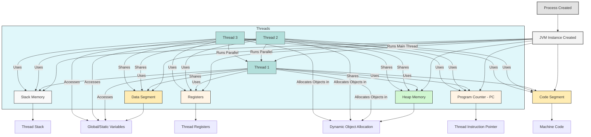
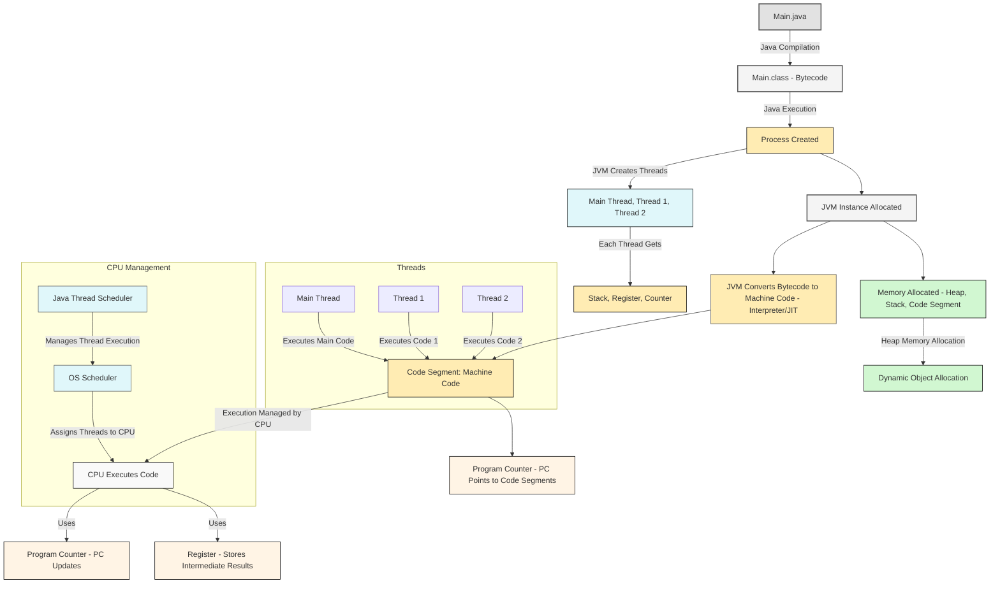
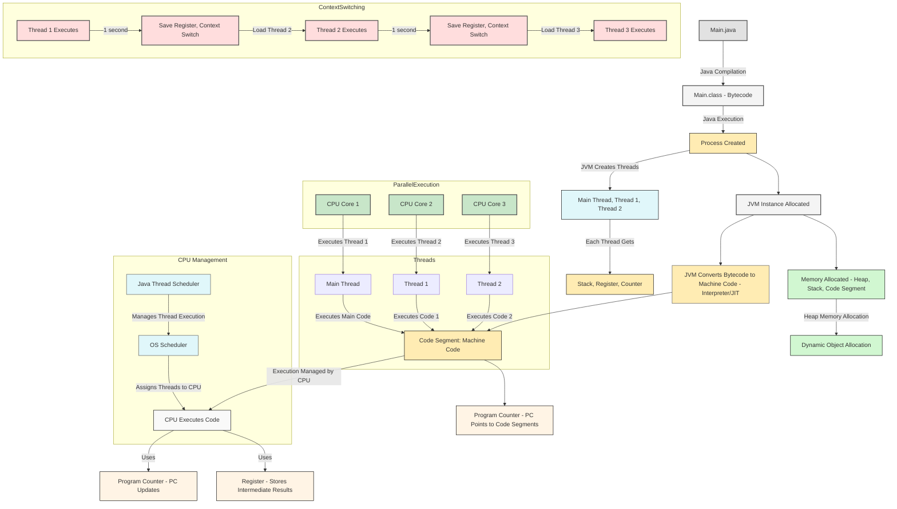
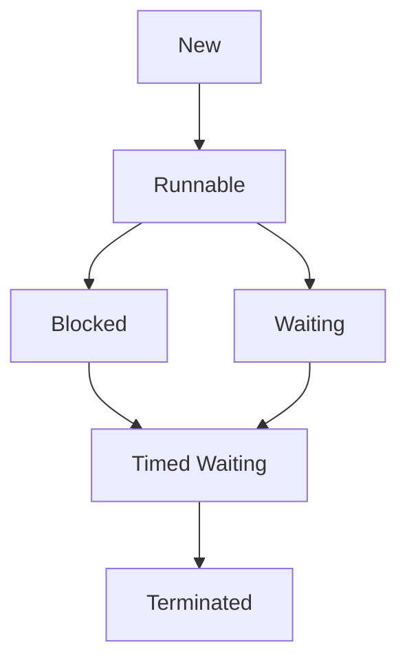

### **Table of Contents**

1. [Introduction to Multithreading](#1-introduction-to-multithreading)
   - [1.1. Definition of Multithreading](#11-definition-of-multithreading)
   - [1.2. Benefits of Multithreading](#12-benefits-of-multithreading)
   - [1.3. Challenges of Multithreading](#13-challenges-of-multithreading)
   - [1.4. Processes vs Threads](#14-processes-vs-threads)
   - [1.5. Multithreading in Java](#15-multithreading-in-java)

2. [Java Memory Model of Process and Thread](#2-java-memory-model-of-process-and-thread)

3. [Basics of Threads - Part 1: Creating Threads](#3-basics-of-threads-part-1-creating-threads)
   - [3.1. Creating Threads](#31-creating-threads)
   - [3.2. Extending the `Thread` Class](#32-extending-the-thread-class)
   - [3.3. Implementing the `Runnable` Interface](#33-implementing-the-runnable-interface)
   - [3.4. Thread Lifecycle](#34-thread-lifecycle)
     - [3.4.1. New](#341-new)
     - [3.4.2. Runnable](#342-runnable)
     - [3.4.3. Blocked](#343-blocked)
     - [3.4.4. Waiting](#344-waiting)
     - [3.4.5. Timed Waiting](#345-timed-waiting)
     - [3.4.6. Terminated](#346-terminated)

4. [Basics of Threads - Part 2: Inter-Thread Communication and Synchronization](#4-basics-of-threads-part-2-inter-thread-communication-and-synchronization)
   - [4.1. Synchronization and Thread Safety](#41-synchronization-and-thread-safety)
   - [4.2. Synchronized Methods and Blocks](#42-synchronized-methods-and-blocks)
   - [4.3. Inter-Thread Communication](#43-inter-thread-communication)
     - [4.3.1. `wait()`](#431-wait)
     - [4.3.2. `notify()` and `notifyAll()`](#432-notify-and-notifyall)
   - [4.4. Producer-Consumer Problem (Assignment)](#44-producer-consumer-problem-assignment)

5. [Basics of Threads - Part 3: Advanced Thread Management](#5-basics-of-threads-part-3-advanced-thread-management)
   - [5.1. Producer-Consumer Problem - Solution Discussion](#51-producer-consumer-problem-solution-discussion)
   - [5.2. Deprecated Methods: `stop()`, `suspend()`, and `resume()`](#52-deprecated-methods-stop-suspend-and-resume)
   - [5.3. Thread Joining](#53-thread-joining)
   - [5.4. `volatile` Keyword](#54-volatile-keyword)
   - [5.5. Thread Priority and Daemon Threads](#55-thread-priority-and-daemon-threads)

6. [Some Advanced Topics](#6-some-advanced-topics)
   - [6.1. Thread Pools](#61-thread-pools)
     - [6.1.1. Executor Framework](#611-executor-framework)
     - [6.1.2. `ThreadPoolExecutor`](#612-threadpoolexecutor)
   - [6.2. `Callable` and `Future`](#62-callable-and-future)
   - [6.3. Fork/Join Framework](#63-forkjoin-framework)
   - [6.4. ThreadLocal in Multithreading](#64-threadlocal-in-multithreading)

7. [Concurrency Utilities](#7-concurrency-utilities)
   - [7.1. Overview of `java.util.concurrent` Package](#71-overview-of-javautilconcurrent-package)
   - [7.2. Executors and ExecutorService](#72-executors-and-executorservice)
   - [7.3. `Callable` and `Future`](#73-callable-and-future-1)
   - [7.4. CompletableFuture](#74-completablefuture)
   - [7.5. ScheduledExecutorService](#75-scheduledexecutorservice)
   - [7.6. CountDownLatch, CyclicBarrier, Phaser, and Exchanger](#76-countdownlatch-cyclicbarrier-phaser-and-exchanger)

8. [Concurrent Collections](#8-concurrent-collections)
   - [8.1. ConcurrentHashMap](#81-concurrenthashmap)
   - [8.2. ConcurrentLinkedQueue and ConcurrentLinkedDeque](#82-concurrentlinkedqueue-and-concurrentlinkeddeque)
   - [8.3. CopyOnWriteArrayList](#83-copyonwritearraylist)
   - [8.4. BlockingQueue Interface](#84-blockingqueue-interface)
     - [8.4.1. ArrayBlockingQueue](#841-arrayblockingqueue)
     - [8.4.2. LinkedBlockingQueue](#842-linkedblockingqueue)
     - [8.4.3. PriorityBlockingQueue](#843-priorityblockingqueue)

9. [Atomic Variables](#9-atomic-variables)
   - [9.1. AtomicInteger, AtomicLong, AtomicBoolean](#91-atomicinteger-atomiclong-atomicboolean)
   - [9.2. AtomicReference and AtomicReferenceArray](#92-atomicreference-and-atomicreferencearray)
   - [9.3. Compare-and-Swap Operations](#93-compare-and-swap-operations)

10. [Locks and Semaphores](#10-locks-and-semaphores)
   - [10.1. ReentrantLock](#101-reentrantlock)
   - [10.2. ReadWriteLock](#102-readwritelock)
   - [10.3. StampedLock](#103-stampedlock)
   - [10.4. Semaphores](#104-semaphores)
   - [10.5. Lock and Condition Interface](#105-lock-and-condition-interface)

11. [Parallel Streams](#11-parallel-streams)
   - [11.1. Introduction to Parallel Streams](#111-introduction-to-parallel-streams)
   - [11.2. Working with Parallel Streams](#112-working-with-parallel-streams)

12. [Best Practices and Patterns](#12-best-practices-and-patterns)
   - [12.1. Thread Safety Best Practices](#121-thread-safety-best-practices)
   - [12.2. Immutable Objects](#122-immutable-objects)
   - [12.3. ThreadLocal Usage](#123-threadlocal-usage)
   - [12.4. Double-Checked Locking and its Issues](#124-double-checked-locking-and-its-issues)
   - [12.5. Concurrency Design Patterns](#125-concurrency-design-patterns)

13. [Common Concurrency Issues and Solutions](#13-common-concurrency-issues-and-solutions)
   - [13.1. Deadlocks](#131-deadlocks)
   - [13.2. Starvation](#132-starvation)
   - [13.3. Livelocks](#133-livelocks)
   - [13.4. Race Conditions](#134-race-conditions)
   - [13.5. Strategies for Avoiding Concurrency Issues](#135-strategies-for-avoiding-concurrency-issues)

14. [Java 9+ Features](#14-java-9-features)
   - [14.1. Reactive Programming with Flow API](#141-reactive-programming-with-flow-api)
   - [14.2. CompletableFuture Enhancements](#142-completablefuture-enhancements)
   - [14.3. Process API Updates](#143-process-api-updates)

15. [Java 11+ Features](#15-java-11-features)
   - [15.1. Local-Variable Type Inference (`var` keyword)](#151-local-variable-type-inference-var-keyword)
   - [15.2. Enhancements in `Optional` Class](#152-enhancements-in-optional-class)
   - [15.3. New Methods in the String Class Relevant to Concurrency](#153-new-methods-in-the-string-class-relevant-to-concurrency)

---

## 1. Introduction to Multithreading

Multithreading refers to the ability of a CPU to provide multiple threads of execution concurrently, with each thread sharing resources such as memory. This allows a program to execute multiple operations in parallel, improving performance in certain cases.

### 1.1. Definition of Multithreading

Multithreading is a concurrent execution technique where multiple threads run independently but share resources, allowing for better utilization of CPU.

Multithreading allows a program to perform **multiple operations at the same time**. Rather than running tasks sequentially, multithreading enables a program to break down the tasks into smaller operations (threads) and execute them simultaneously (or in parallel, depending on the number of CPUs/cores).

- **Multiple threads** share the same **resources** (e.g., heap memory, code segments) but can **perform tasks independently**. 
- Each thread can run a separate part of the program, but they can access the shared resources (memory, variables) and can even interact with each other.
- 
### 1.2. Benefits of Multithreading
- **Improved Performance**: Multithreading allows CPU cores to be used more efficiently by executing multiple threads in parallel.
- **Better Resource Utilization**: In multi-core systems, threads can run on different cores, fully utilizing the hardware resources.
- **Increased Responsiveness**: Multithreading is especially useful in GUI applications or real-time systems, where the main thread remains responsive while performing background tasks.
- **Concurrency**: It enables tasks such as data fetching, computations, or I/O operations to be performed concurrently without blocking other operations.

- **Task Parallelism**: By splitting a task into multiple threads, you can leverage multiple CPU cores to execute these threads in parallel, speeding up the execution. For example:
  - With **two CPU cores**, **Thread 1** can run on **Core 1**, and **Thread 2** can run on **Core 2**. This allows both threads to work at the same time, improving performance.
- **Improved Responsiveness**: Multi-threading allows an application to remain responsive even while doing lengthy tasks. For example, a UI thread can remain active to handle user input while other background threads perform computations or data processing.
- **Resource Sharing**: Threads share resources like memory, which makes multi-threading **more efficient** and **less resource-intensive** than starting multiple processes. The OS doesn’t need to allocate separate resources for each thread, as would happen in multi-tasking with different processes.

### **Key Benefits of Multithreading**:

1. **Improved Performance**: 
   - **Task Parallelism**: When multiple threads are running in parallel (across multiple CPU cores), the program’s performance improves because tasks are divided and executed simultaneously.
   - If a program only had one thread, all tasks would run sequentially on one CPU, leading to slower performance. With multithreading, tasks are executed concurrently (or in parallel), making use of available CPU cores efficiently.

2. **Responsiveness**:
   - A program that uses multithreading can respond faster to user input. For instance, one thread could be handling user interactions (UI thread) while another thread performs background calculations. This way, the program remains responsive to the user while doing heavy work in the background.

3. **Resource Sharing**:
   - Threads share the same memory space (heap, data segment, code segment). This **shared memory** allows threads to interact with each other and exchange information efficiently. 
   - **Resource sharing** is cost-effective because threads don't need separate copies of resources like a separate heap for each thread. They share common resources, which leads to less memory usage.
     
### 1.3. Challenges of Multithreading

1. **Concurrency Issues**:
   
- **Concurrency Issues**: Multithreaded programs are prone to problems like **deadlocks**, **race conditions**, and **thread interference** if not managed correctly.
- **Concurrency Issues**: Deadlocks, race conditions, etc.
- **Concurrency issues** arise when multiple threads try to access and modify shared resources (e.g., heap memory or global variables) at the same time, leading to **data inconsistency** or **deadlocks**.

   - For example, two threads might simultaneously try to write to the same memory location, causing inconsistent data or crashing the program.
   - **Deadlock** occurs when two or more threads are blocked forever, waiting for each other to release resources.

While multi-threading offers many benefits, there are challenges associated with it:
- **Concurrency Issues**: When multiple threads access shared resources (e.g., heap memory or global variables) at the same time, there are risks like **data inconsistency**, **deadlocks**, and **race conditions**. For example:
  - **Deadlock** occurs when two or more threads wait indefinitely for each other to release resources, leading to a standstill.
  - **Race conditions** happen when two threads access shared data concurrently, and the final result depends on the order of execution, leading to unpredictable behavior.

2. **Synchronization**:
   - To prevent concurrency issues, we use **synchronization** mechanisms like **locks** and **synchronized blocks** to ensure that only one thread accesses shared resources at a time.
   - Synchronization adds **overhead** to the system, as the program must manage access to shared resources, which can slow down execution.

To handle these issues, **synchronization** is used to control access to shared resources, ensuring that only one thread can access a critical section of code at a time (e.g., by using **synchronized blocks** or **locks**).

- **Synchronization Overhead**: Implementing synchronization mechanisms (like locks) can incur performance overhead.
- **Synchronization Overhead**: Performance hit when using synchronization mechanisms.
  
3. **Difficulty in Debugging**:
   - Multithreading can make debugging **challenging** because of **race conditions** and the non-deterministic order in which threads are scheduled. Testing multithreaded applications can be difficult because bugs may only occur when threads are scheduled in a particular way, which is hard to reproduce in a controlled testing environment.

- **Debugging Complexity**: Multithreaded programs often exhibit non-deterministic behavior, making bugs difficult to reproduce and debug.
- **Debugging Complexity**: Multithreaded programs can be harder to debug due to non-deterministic behavior.
  
4. **Complexity in Code**:
   - Writing, testing, and maintaining multithreaded programs is **more complex** compared to single-threaded programs. Proper synchronization, managing shared resources, and dealing with concurrency issues require careful programming and advanced debugging techniques.

- **Complexity**: Writing multi-threaded code can be difficult because it introduces new challenges in terms of **debugging** and **testing**. It's harder to reproduce and diagnose issues like race conditions or deadlocks in a multi-threaded environment, and test cases might behave differently depending on the timing of thread execution.

- **Thread Safety**: Managing shared resources safely between threads requires extra care to avoid data corruption.

### 1.4. Processes vs Threads
- **Process**: A process is an independent program running in its own memory space. Each process has its own address space, and processes communicate through inter-process communication (IPC).
- **Thread**: A thread is a lightweight unit of execution within a process. Threads share the same memory space and resources, which allows for more efficient communication and resource utilization compared to processes.

### 1. **Processes in Java**
A **process** in Java refers to a program that is executed by the operating system. Each process runs independently, has its own memory space, and interacts with the operating system to perform tasks. Java provides several mechanisms to create and manage processes, such as the `ProcessBuilder` class and the `Runtime` class.


### What is a **Process**?
A **process** is an instance of a program that is being executed. It represents the environment in which the program runs and includes its code, data, and resources required for execution (like memory, file handles, and other system resources).

- **Example:**
  You have a Java file `Test.java` containing your code, which you compile using the `javac` command:
  ```
  javac Test.java
  ```
  This generates the bytecode, which can be executed by the Java Virtual Machine (JVM).

  When you run the bytecode with:
  ```
  java Test
  ```
  The JVM creates a **process** to execute this program. At this point, the JVM has started a new **process** to run your program. The **process** contains the following:
  - The program’s code.
  - Allocated resources like memory (heap, stack), file handles, etc.
  - A process ID (PID) assigned by the operating system.

### Key Points About a **Process**:
1. **Instance of a Program:** The process is a running instance of your program.
2. **Resources:** Each process is allocated its own resources (memory, CPU time, etc.) by the operating system.
3. **Independence:** Processes are independent of each other. They do not share memory space unless explicitly set to do so (e.g., through inter-process communication).
4. **Execution:** A process can have multiple threads inside it.

#### Key Points about Processes:
- A **process** is a separate execution unit that runs in its own address space.
- Processes are isolated from each other, meaning one process cannot directly access the memory of another process.
- Processes communicate with each other through inter-process communication (IPC) mechanisms, such as pipes, sockets, or shared files.

#### Managing Processes in Java:
Java provides two main classes to manage processes:
- **`Runtime` class**: This class allows the execution of system-level commands and launching external programs.
- **`ProcessBuilder` class**: A more flexible and powerful way to create and manage processes. It allows setting environment variables, working directory, and redirecting I/O streams.

##### Example: Running an External Process

```java
import java.io.*;

public class RunExternalProcess {
    public static void main(String[] args) {
        try {
            // Creating a process to run the 'ls' command on UNIX-based systems
            Process process = Runtime.getRuntime().exec("ls");

            // Reading the output of the process
            BufferedReader reader = new BufferedReader(new InputStreamReader(process.getInputStream()));
            String line;
            while ((line = reader.readLine()) != null) {
                System.out.println(line);
            }

            // Wait for the process to exit
            process.waitFor();
        } catch (IOException | InterruptedException e) {
            e.printStackTrace();
        }
    }
}
```

In this example:
- `exec("ls")` runs the `ls` command (on Unix/Linux/Mac).
- The output of the process is read from its `InputStream`.

### 2. **Threads in Java**
A **thread** is a smaller unit of a process. Threads within the same process share the same memory space, making communication between them easier and more efficient than between processes. Java provides robust support for multithreading, allowing you to write concurrent programs that can perform multiple tasks simultaneously.


### What is a **Thread**?
A **thread** is the smallest unit of execution within a process. When a process is created, it starts with a single thread known as the **main thread**. However, a process can create multiple threads to perform tasks concurrently.

- **Example:**
  In a Java program, if you create multiple threads to perform tasks in parallel, these threads will share the process's resources (like memory), but each thread will execute a part of the program independently.

  **Key Points About a Thread**:
  1. **Lightweight Process:** A thread is often referred to as a "lightweight process" because it exists within a process and shares its resources but runs independently.
  2. **Smallest Unit of Execution:** A thread is a sequence of instructions that the CPU executes. Each thread executes independently but shares the process’s resources (such as memory and open files).
  3. **Concurrency:** Multiple threads in a process can run in parallel, making the program more efficient by utilizing multiple CPU cores.

#### Key Points about Threads:
- Threads are lightweight and execute concurrently within a single process.
- Threads within the same process share resources like memory, file descriptors, etc.
- Java provides built-in mechanisms to create and manage threads.

#### Creating and Managing Threads in Java:
There are two main ways to create a thread in Java:
1. **By Extending the `Thread` class**.
2. **By Implementing the `Runnable` interface**.

##### 1. **Using the `Thread` class**
You can create a thread by extending the `Thread` class and overriding the `run()` method.

```java
class MyThread extends Thread {
    public void run() {
        System.out.println("Thread is running...");
    }
}

public class ThreadExample {
    public static void main(String[] args) {
        // Creating and starting the thread
        MyThread thread = new MyThread();
        thread.start(); // This invokes the run() method
    }
}
```

In this example:
- `MyThread` extends `Thread` and overrides the `run()` method.
- The `start()` method is called to begin the execution of the thread.

##### 2. **Using the `Runnable` interface**
Alternatively, you can create a thread by implementing the `Runnable` interface. This method is preferred when the class already extends another class (because Java doesn't support multiple inheritance).

```java
class MyRunnable implements Runnable {
    public void run() {
        System.out.println("Thread is running...");
    }
}

public class ThreadExample {
    public static void main(String[] args) {
        // Creating a Runnable object and passing it to a Thread
        MyRunnable myRunnable = new MyRunnable();
        Thread thread = new Thread(myRunnable);
        thread.start(); // This invokes the run() method of MyRunnable
    }
}
```

In this example:
- `MyRunnable` implements `Runnable` and overrides the `run()` method.
- A new `Thread` is created, passing the `Runnable` object to its constructor.

### Example of Threads in Java:
You can create a simple multithreading program in Java. Here’s an example where we print the current thread’s name using `Thread.currentThread().getName()`:

```java
public class MultiThreadingLearning {
    public static void main(String[] args) {
        // Print the name of the current thread
        System.out.println("Current thread: " + Thread.currentThread().getName());
    }
}
```

- When you compile and run this Java program, the **main thread** will execute the code and print the thread's name.
- However, if you create additional threads using the `Thread` class, each thread will have its own execution path within the process.

### Thread Creation Example:
To create multiple threads and see how they work concurrently, you might do something like this:

```java
public class MultiThreadingExample {
    public static void main(String[] args) {
        // Create two threads
        Thread t1 = new Thread(() -> {
            System.out.println("Thread 1: " + Thread.currentThread().getName());
        });
        Thread t2 = new Thread(() -> {
            System.out.println("Thread 2: " + Thread.currentThread().getName());
        });
        
        // Start the threads
        t1.start();
        t2.start();
    }
}
```

- Here, two threads are created (`t1` and `t2`), and each one prints its name. These threads will execute concurrently, meaning the CPU can switch between them, making your program run faster if there are multiple CPU cores.

### Differences Between Process and Thread:
| Feature                | **Process**                                    | **Thread**                                        |
|------------------------|------------------------------------------------|---------------------------------------------------|
| **Definition**          | An instance of a program being executed.       | The smallest unit of execution within a process.  |
| **Memory**              | Has its own memory (heap, stack, etc.).        | Shares memory and resources with other threads in the same process. |
| **Execution**           | Runs independently and has a separate address space. | Executes as part of a process and shares the process's address space. |
| **Creation Overhead**   | More expensive to create and manage.           | Less overhead, as threads share resources of the process. |
| **Concurrency**         | Multiple processes can run concurrently, each having its own resources. | Multiple threads within the same process can run concurrently. |
| **Resource Sharing**    | Does not share resources with other processes. | Shares resources like memory, file handles, etc. with other threads in the same process. |

### Summary:
- A **process** is a program in execution that has its own resources (memory, file handles, etc.), and the operating system assigns it a process ID.
- A **thread** is a smaller unit of execution within a process, capable of running independently and concurrently with other threads in the same process.

Thus, threads are part of processes, and multiple threads can exist in a process to perform tasks concurrently, improving efficiency and performance.

#### Managing Threads Using the `Executor` Framework
For managing multiple threads, especially in complex applications, Java provides the `Executor` framework, which simplifies thread management and provides a higher level of abstraction for thread pooling.

##### Example: Using an ExecutorService
```java
import java.util.concurrent.*;

class MyTask implements Runnable {
    public void run() {
        System.out.println("Task is running...");
    }
}

public class ExecutorExample {
    public static void main(String[] args) {
        // Creating a thread pool with 2 threads
        ExecutorService executorService = Executors.newFixedThreadPool(2);

        // Submitting tasks to the thread pool
        executorService.submit(new MyTask());
        executorService.submit(new MyTask());

        // Shutdown the executor after tasks are complete
        executorService.shutdown();
    }
}
```

In this example:
- `ExecutorService` manages a pool of worker threads and executes tasks in parallel.
- `Executors.newFixedThreadPool(2)` creates a pool of 2 threads.
- `submit()` is used to submit tasks to the executor.

### Thread Lifecycle in Java
The lifecycle of a thread can be in one of the following states:
1. **New:** A thread is in this state when it is created but has not yet started.
2. **Runnable:** A thread is in this state when the `start()` method has been invoked but it hasn't yet been scheduled for execution by the CPU.
3. **Blocked:** A thread is blocked when it is waiting for a lock or resource that is being used by another thread.
4. **Waiting:** A thread is in this state when it is waiting indefinitely for another thread to perform a particular action (e.g., using `Object.wait()`).
5. **Timed Waiting:** A thread is in this state when it is waiting for a specified period (e.g., using `Thread.sleep()`).
6. **Terminated:** A thread enters this state when it has finished executing, either normally or due to an exception.


### Thread Synchronization in Java
Threads can access shared resources, which can lead to concurrency issues (e.g., data corruption). To solve this, Java provides synchronization mechanisms to ensure that only one thread can access a resource at a time.

#### Using `synchronized` block:
```java
class Counter {
    private int count = 0;

    // Synchronized method
    public synchronized void increment() {
        count++;
    }

    public int getCount() {
        return count;
    }
}

public class SynchronizedExample {
    public static void main(String[] args) throws InterruptedException {
        Counter counter = new Counter();
        
        // Create two threads that access the same shared object
        Thread t1 = new Thread(() -> {
            for (int i = 0; i < 1000; i++) {
                counter.increment();
            }
        });
        
        Thread t2 = new Thread(() -> {
            for (int i = 0; i < 1000; i++) {
                counter.increment();
            }
        });

        // Start both threads
        t1.start();
        t2.start();

        // Wait for both threads to finish
        t1.join();
        t2.join();

        // Print the final result
        System.out.println("Final count: " + counter.getCount());
    }
}
```

In this example:
- The `increment()` method is synchronized to ensure only one thread can access it at a time.
- `join()` is used to wait for both threads to finish before printing the final count.

### Conclusion
- **Process**: An independent program running in its own memory space.
- **Processes** are independent execution units with their own memory space, and in Java, you can manage them using `Runtime` and `ProcessBuilder`.
- **Threads** are lightweight units of execution within a process, sharing the same memory space (i.e.  A lightweight process that shares memory space with other threads within the same process.). Java provides mechanisms like the `Thread` class, `Runnable` interface, and the `Executor` framework for managing threads.
- **Thread synchronization** is essential to avoid concurrency issues when multiple threads access shared resources.

- **Multithreading in Java**
  Java provides a robust multithreading model, including built-in thread management, synchronization mechanisms, and concurrency utilities through the `java.util.concurrent` package.

---

### How **processes** and **threads** are managed by the **JVM (Java Virtual Machine)**

Let’s break this down step-by-step, especially the interaction between processes, threads, JVM memory, and the overall execution process.

### Understanding the Process Creation in JVM:

When you execute a Java program using a command like:
```bash
java MultiThreadLearning
```

Here's what happens internally:

1. **Process Creation**: The operating system creates a new **process** for your Java program. This process is an instance of the program that is being executed, and it requires various resources like memory, CPU time, and others to run.

2. **JVM Instance for the Process**: As part of this process creation, a new **JVM instance** is launched. The JVM is responsible for running the bytecode of your Java program. Each **process** that you run requires a separate JVM instance to manage the execution of your code.

3. **JVM Memory Areas**: The JVM itself has various memory areas such as:
   - **Heap memory**: Where objects are allocated.
   - **Stack memory**: Used for method calls and local variables.
   - **Code Segment**: Contains the bytecode of the program.
   - **Data Segment**: Stores data like static variables.
   - **Program Counter**: Keeps track of the current instruction being executed.
   - **Registers**: Small, fast memory storage used for intermediate calculations.

   These memory areas are **allocated** for each **JVM instance** associated with a process.

4. **Heap Size Configuration**: You can control how much memory the JVM can use for the **heap** by specifying parameters during the process launch:
   - `-Xms` specifies the **initial heap size**.
   - `-Xmx` specifies the **maximum heap size**.

   Example:
   ```bash
   java -Xms512m -Xmx2g MultiThreadLearning
   ```
   This command would start the JVM with an initial heap of 512 MB and a maximum heap size of 2 GB.

5. **Memory Allocation and JVM Instances**:
   Each **process** gets its own **JVM instance**, and each JVM instance gets its own **heap** memory (and other memory segments like stack, code segment, etc.). The total amount of heap memory available to the JVM is controlled by the `-Xms` and `-Xmx` parameters.

### How Does the JVM Manage Multiple Processes?

When you run **multiple Java programs**, each will have its own **process** and each **process** gets its own **JVM instance** with its own memory allocation. 

For example:
- **Process 1** might be allocated a heap size of **1 GB**.
- **Process 2** might be allocated a heap size of **2 GB**.

These processes are independent, and their memory is isolated. The operating system and the JVM handle the allocation and management of these resources.

### Threads within a Process:

Each **process** starts with a single thread, which is the **main thread**. The main thread is responsible for executing the program’s entry point (i.e., the `main` method in Java).

- **Threads** are the smallest units of execution within a process. Once the main thread starts executing, it can create additional **worker threads** to perform tasks concurrently, thus enabling parallelism and multitasking.

- **Concurrency**: Multiple threads within a process can run concurrently. These threads share the resources allocated to the process (such as heap memory), but they execute independently. 

#### Example: Multi-threading in Java

When you write a Java program that uses **multiple threads**, the JVM creates a new **thread** within the existing **process**. For example:

```java
public class MultiThreadingExample {
    public static void main(String[] args) {
        // Print the name of the current main thread
        System.out.println("Main thread: " + Thread.currentThread().getName());

        // Create and start Thread 1
        Thread t1 = new Thread(() -> {
            System.out.println("Thread 1: " + Thread.currentThread().getName());
        });

        // Create and start Thread 2
        Thread t2 = new Thread(() -> {
            System.out.println("Thread 2: " + Thread.currentThread().getName());
        });

        t1.start(); // Start Thread 1
        t2.start(); // Start Thread 2
    }
}
```

- When you run this, the JVM will create one **main thread** and then spawn **Thread 1** and **Thread 2**.
- These threads will share the same heap memory (allocated for the JVM instance), but each will execute independently.

### Threads and Memory Sharing:

- **Heap Memory**: All threads within a process share the **heap memory** of the process. This means they can share objects and data stored on the heap. However, each thread has its own **stack memory** that holds method calls, local variables, and other thread-specific data.
  
- **Stack Memory**: Each thread has its own **stack**. The stack stores data like method calls and local variables, and it is private to each thread. No thread can directly access another thread's stack.

- **Garbage Collection**: The JVM automatically handles **garbage collection** for objects stored in the heap. This means that the heap memory used by objects that are no longer reachable will be reclaimed to prevent memory leaks.

### Process and Thread Management in the JVM:

1. **Process Creation**: When you execute a Java program (e.g., `java MultiThreadLearning`), the operating system creates a new **process**.
2. **JVM Instance**: A **JVM instance** is created for the process, and the program's bytecode is loaded and executed by the JVM.
3. **Main Thread**: The JVM automatically creates a **main thread** for each process.
4. **Additional Threads**: From the main thread, you can create additional threads to execute tasks concurrently.
5. **Heap Allocation**: Each JVM instance is allocated memory (heap, stack, etc.) based on the parameters like `-Xms` and `-Xmx` during execution.
6. **Memory Usage**: The threads share the heap but have their own stack memory. Garbage collection takes care of memory management in the heap.

### Summary:
- **Process**: A process is an instance of a program in execution, managed by the operating system, and it includes the JVM instance.
- **Thread**: A thread is a unit of execution within a process. Each process starts with one thread (the main thread), but more threads can be created to perform tasks concurrently.
- **JVM and Memory**: When a process is created, the JVM allocates memory for it (heap, stack, etc.). You can control the heap size with `-Xms` and `-Xmx`.
- **Thread Management**: Threads share the heap memory but have separate stack memory. Each thread executes independently but shares the resources of the process.

In your example, when you run the `MultiThreadLearning` Java program, the JVM creates a new process, initializes a JVM instance, and then creates threads for concurrent execution. Each thread shares the heap memory allocated to that JVM instance but has its own stack. This is how Java manages memory and execution flow for multi-threaded programs.

---

### Internal architecture of processes, threads, and memory management** in Java. 

The concepts you've mentioned—such as **code segments**, **data segments**, **heap memory**, **stack memory**, **registers**, and **program counters**—are critical for understanding how Java programs are executed on the JVM and how these resources are managed by the operating system and CPU.

Let's break down the flow and interactions between all of these components more clearly:

### Key Components: Code Segment, Data Segment, Heap, Stack, Registers, and Program Counter

#### 1. **Code Segment**:
   - **What it is**: The **code segment** stores the **compiled bytecode** (or machine code) of the program. When you compile a Java program using `javac`, it creates **bytecode** (a .class file). The JVM then loads this bytecode and uses either an **interpreter** or **JIT (Just-In-Time) compiler** to convert it into native machine code that the CPU can execute.
   - **Sharing**: This code segment is **read-only** and shared among all the threads in a process. Since machine code is fixed, threads just read from this segment—they do not modify it.
   - **What it stores**: The **compiled machine code** that is executed by the CPU.

#### 2. **Data Segment**:
   - **What it is**: The **data segment** stores **global variables** and **static variables** from the program. These variables are shared among all the threads within the same process.
   - **Sharing**: Since global/static variables are shared across threads, synchronization is required if multiple threads need to modify these variables to prevent **race conditions** or **data inconsistency**.
   - **What it stores**: **Global** and **static variables** that are accessed by all threads.

#### 3. **Heap Memory**:
   - **What it is**: The **heap** is where objects are allocated dynamically using the `new` keyword in Java. When threads create objects (such as instances of classes), those objects are placed in the heap.
   - **Sharing**: The **heap memory** is shared among all threads within the same process. However, **processes do not share heap memory**. Each process has its own separate heap memory. 
   - **Synchronization**: Since multiple threads can access and modify the heap, **synchronization** is necessary to prevent concurrent modification issues (e.g., **race conditions**).
   - **What it stores**: All dynamically allocated objects.

#### 4. **Stack Memory**:
   - **What it is**: Each **thread** has its own **stack**. The stack is used to store **method call frames**, including **local variables**, **method parameters**, and the return address for methods.
   - **Isolation**: The stack is **local to the thread** and is not shared with other threads. Each thread has its own stack.
   - **What it stores**: **Local variables**, **method call frames**, and **return addresses** for the executing thread.

#### 5. **Registers**:
   - **What it is**: **Registers** are small, high-speed memory locations in the **CPU**. They store intermediate data and addresses during instruction execution. The JVM also uses its internal registers for optimizing the conversion of bytecode to machine code.
   - **Thread-Specific**: Each thread has its own set of **registers**. The registers store temporary or intermediate values required for the execution of the thread’s instructions.
   - **Usage**: The **JIT compiler** uses registers to optimize the machine code, and registers are also used for **context switching** during multitasking. The CPU itself uses registers to perform arithmetic, store data, and execute instructions.
   - **What it stores**: Intermediate values, addresses for instruction fetching, and data needed for the current instruction.

#### 6. **Program Counter (PC)**:
   - **What it is**: The **Program Counter** (PC) is a register that holds the address of the next instruction to be executed by the thread. The **PC** is used to keep track of the instruction flow, ensuring that each thread executes instructions in sequence (unless altered by control flow statements like loops or method calls).
   - **Thread-Specific**: Each thread has its own **Program Counter**, which keeps track of the instruction it is currently executing.
   - **Usage**: The **PC** helps ensure that threads execute the correct sequence of instructions from the **code segment** (i.e., the machine code). It points to the next instruction for the CPU to execute.

### The Flow of Execution (Complete Flow of a Thread and Process)

Here’s how all these components come together in a **real execution scenario**:

1. **Java Program Compilation**: 
   - You write a Java program (e.g., `Main.java`), and you compile it using `javac`. This creates a bytecode file (`Main.class`), which contains machine-readable code but is platform-independent.
   - **What happens**: The bytecode is loaded into the **code segment** when the JVM starts.

2. **Process Creation**:
   - You execute the program using `java Main`. The **operating system** creates a **process** for your program.
   - **What happens**: The JVM instance is created for this process. This JVM will have its own memory space, including the heap, stack, code segment, data segment, and other internal JVM areas.

3. **Thread Creation**:
   - When the JVM starts, the first thread, **the main thread**, is created automatically. 
   - **What happens**: The main thread begins executing, starting with the `main()` method of your program. 

4. **Execution Flow in the Main Thread**:
   - The **main thread** starts executing the program. The JVM reads instructions from the **code segment** and uses the **PC (Program Counter)** to keep track of which instruction to execute next.
   - As the main thread runs, it may create additional threads (using `Thread t = new Thread()` in Java).
   - **What happens**: The main thread executes instructions, creating more threads if needed. Each thread will have its own **stack**, **registers**, and **program counter** to manage its execution flow independently.

5. **Heap Memory Access**:
   - As the threads execute, they may create **new objects** using the `new` keyword, which places objects in the **heap memory**.
   - **What happens**: The heap is shared among all threads within the same process. If multiple threads access the same object, **synchronization** is necessary to prevent data corruption or inconsistent behavior.

6. **Data Segment Access**:
   - Any **static** or **global variables** are stored in the **data segment**.
   - **What happens**: These variables are **shared** by all threads in the process. If multiple threads modify the same static or global variables, proper synchronization (like `synchronized` blocks or `ReentrantLocks`) is required to prevent **race conditions**.

7. **Instruction Execution**:
   - As each thread executes, it fetches instructions from the **code segment**. The **Program Counter (PC)** is updated to point to the next instruction after the current one is executed.
   - **What happens**: Each thread’s **PC** keeps track of the next instruction in the **code segment** it needs to execute. The thread fetches the machine code from the **code segment** and executes it, updating its **registers** with intermediate results.

8. **Context Switching**:
   - If the operating system uses **multitasking** (which it usually does), it may switch between threads during execution. This is called **context switching**.
   - **What happens**: When a thread is suspended, the **CPU** saves its state (registers, program counter, stack pointer, etc.) and loads the state of the next thread to execute. This is done so that threads can run in parallel on multiple CPU cores, or in a time-sharing fashion on a single core.

### Final Summary of the Interaction:

- **Threads share** the **code segment**, **data segment**, and **heap memory**.
- Each thread has its own **stack**, **registers**, and **program counter**.
- The **code segment** stores the **compiled machine code**.
- The **data segment** stores **global** and **static variables**, which are shared among threads, requiring synchronization when modified.
- The **heap** is used for dynamically allocated objects, shared by threads, but synchronization is needed to modify shared objects.
- **Registers** store temporary values and are specific to each thread.
- The **program counter** tracks which instruction each thread needs to execute next in the code segment.

### Next Steps:
If you want to explore further, you could look into how the **JVM’s garbage collector** interacts with this memory management system, how **thread synchronization** is implemented, and how different types of threads (e.g., daemon threads) interact within a process.

The key components of the **JVM process execution model**, showing how the **main thread** interacts with various memory segments, registers, and other resources.

**Diagram**:



### Explanation of the Diagram:

- **Process Creation**: When the Java program is executed, a **Process** is created, which in turn leads to the creation of a **JVM instance**.
- **JVM Instance**: The **JVM instance** consists of multiple segments that handle different tasks:
  - **Code Segment**: Holds the **machine code** or bytecode instructions.
  - **Data Segment**: Contains **global** and **static variables**.
  - **Heap Memory**: Used for dynamically allocated objects.
  - **Stack Memory**: Each thread has its own stack to store local variables and method calls.
  - **Registers**: Each thread has its own set of registers for holding intermediate values and addresses.
  - **Program Counter (PC)**: Each thread has its own program counter that points to the next instruction to execute.

- **Threads**: Multiple threads (e.g., **Thread 1, Thread 2, Thread 3**) are created within the **JVM process**:
  - Threads share the **code segment** and **data segment**, meaning they can read and write to global/static variables and execute the same machine code.
  - Each thread has its own **stack**, **registers**, and **program counter**, meaning that their execution is independent in terms of local state and progress.

#### How Threads Interact:
- All threads share access to the **heap memory**, meaning they can allocate objects. This can lead to shared state, so synchronization is needed when multiple threads modify the heap data.
- Threads access the **data segment** for global/static variables, and they execute instructions in the **code segment**, as managed by their individual **program counters**.

---

### Process step by step and represent it visually using a **diagram**. 

The entire sequence from compiling the Java program to executing it with multiple threads managed by the JVM, and how the CPU executes the machine code.

Here’s the outline of what the system does:

1. **Compilation Phase**:
   - You first compile the Java program (`javac Main.java`), which produces bytecode (`Main.class`).
   
2. **Execution Phase**:
   - When you run the program (`java Main`), a process is created, and a JVM instance is allocated for that process.
   - The JVM allocates memory regions like heap, stack, code segment, etc.
   - The JVM then starts converting the bytecode to machine code (via either interpretation or JIT compilation).
   
3. **Thread Creation**:
   - The JVM determines that it needs to create multiple threads (main thread, thread 1, thread 2).
   - Each thread is assigned its own stack, registers, and program counter (PC).

4. **Execution by the CPU**:
   - The CPU executes machine code in the context of the threads, with the OS and JVM scheduler managing the execution of threads.
   - The program counter (PC) in each thread points to a specific part of the machine code that is being executed.

Now, let’s structure this in **diagram syntax** to depict the flow:



### Key Points Represented in the Diagram:

1. **Compilation**:
   - `javac Main.java` compiles the code into bytecode, stored in `Main.class`.

2. **Execution**:
   - The `java Main` command creates a **process**.
   - The **JVM instance** is allocated for the process and various memory segments (heap, stack, code segment) are created.

3. **Thread Creation**:
   - The JVM identifies the need for multiple threads: **main thread**, **thread 1**, and **thread 2**.
   - Each thread is allocated its **own stack**, **registers**, and **program counter**.

4. **Code Execution**:
   - The JVM starts converting the bytecode to **machine code** (via **interpretation** or **JIT compilation**).
   - The **program counter** for each thread points to specific instructions in the **code segment**.
   - The CPU executes the machine code, using its **registers** to store intermediate results.

5. **Thread Scheduling**:
   - The **OS scheduler** assigns threads to the CPU for execution.
   - The **JVM scheduler** helps manage the execution flow, deciding which thread to run next.

### Explanation of Key Components:

- **Code Segment**: Contains the compiled machine code (generated from bytecode).
- **Data Segment**: Stores **global** and **static** variables that threads can access.
- **Heap**: Dynamically allocated memory where objects are created. Threads share access to the heap but need synchronization to prevent race conditions.
- **Stack, Registers, and Program Counter**: Each thread has its own stack, registers, and program counter, which is essential for managing the local execution state of the thread.

This diagram provides a visual flow from code compilation, process creation, thread creation, and execution by the CPU, all while managing memory and synchronization between threads. It helps illustrate how the JVM and the CPU work together to run a multi-threaded Java program. 

---

### **Context switching**, **parallel execution**, and how the various components interact within the process.

### Key Concepts Recap:

1. **Program Counter (PC)**: 
   - The **Program Counter** is responsible for tracking the **address** of the instruction in the code segment that the thread is currently executing.
   - For each thread, the PC ensures that the thread picks up where it left off during its next time slice, making **context switching** possible.

2. **Code Segment**: 
   - All threads in a process share the **code segment**, which contains the compiled machine code (i.e., the bytecode converted to native machine code).
   - Each thread has its own **Program Counter (PC)**, which points to the address of the next instruction in the code segment for that specific thread.

3. **Context Switching**: 
   - When the **OS scheduler** allocates CPU time to a thread, it loads the instruction from the program counter into the CPU registers and begins execution.
   - After a time slice (say, 1 second), **context switching** happens:
     - The CPU **saves the state** of the current thread (its register contents and progress).
     - The OS then **loads the state** of another thread and begins execution at the address specified by that thread’s program counter.
     - This process repeats as the OS switches between different threads (even though only one CPU core is available).

4. **Parallel Execution vs Context Switching**:
   - **Context Switching**: When only one CPU core is available, **only one thread can run at a time**. However, it **appears** that all threads are running simultaneously because the CPU quickly switches between them. The threads are actually **not running in parallel**, they are simply **time-shared**.
   - **True Parallel Execution**: If there are **multiple CPU cores**, each core can run a thread simultaneously. In this case, the threads are **actually running in parallel** without the need for context switching between them.

### Diagram for Context Switching and Parallel Execution

Let’s update the **diagram** to reflect the concepts of context switching and parallel execution, as well as how the **program counter** works for each thread.



### Explanation of the Diagram Changes:

1. **Context Switching Subgraph** (`ContextSwitching`):
   - **Context switching** occurs when the **OS scheduler** allocates a time slice for each thread. After the time slice (e.g., 1 second) completes, the **CPU registers** are saved, and the next thread is executed.
   - The **Program Counter (PC)** is updated to point to the next instruction that needs to be executed when the thread resumes.

2. **Parallel Execution Subgraph** (`ParallelExecution`):
   - When there are **multiple CPU cores**, the threads can run **in parallel** without context switching.
   - Each CPU core runs one thread at a time, so in this case, **Thread 1** runs on **CPU Core 1**, **Thread 2** runs on **CPU Core 2**, and **Thread 3** runs on **CPU Core 3**.
   - There is no context switching in this case since the threads are actually running simultaneously.

### Summary:

- **Program Counter (PC)** helps track where each thread is in the code segment.
- **Context Switching** happens when the OS scheduler allocates a time slice for each thread and switches between them if there is only one CPU core. The **registers** are saved and restored for each thread to ensure that it can resume from where it left off.
- With **multiple CPU cores**, threads can run **in parallel** without the need for context switching, improving performance.

This process ensures that the system runs multiple threads efficiently, either by **time-sharing** (context switching) or **parallel execution** (multiple CPU cores), depending on the available hardware.

---

### 1.5. Multithreading in Java

Java provides a powerful multithreading framework. The `java.lang.Thread` class and `java.lang.Runnable` interface are fundamental to thread creation and management. Java also offers built-in synchronization mechanisms and concurrency utilities, such as the `java.util.concurrent` package, to help handle complex threading scenarios.

### 1. **Multi-threading Overview**
Multi-threading allows a **single process** to perform multiple operations simultaneously by using **multiple threads**. This helps improve **performance**, especially in systems with **multi-core processors**, by allowing different threads to run on different cores simultaneously.

- **Threads share common resources** such as:
  - **Code segment** (same program code, i.e., the instructions).
  - **Heap memory** (for dynamically allocated memory, shared between threads).
  - **Data segment** (for global and static variables).
  
However, each thread also has its own **stack** (for local variables and function calls) and **program counter** (which tracks the thread's position in the code).

### **Multithreading Definition**:

Multithreading allows a program to perform **multiple operations at the same time**. Rather than running tasks sequentially, multithreading enables a program to break down the tasks into smaller operations (threads) and execute them simultaneously (or in parallel, depending on the number of CPUs/cores).

- **Multiple threads** share the same **resources** (e.g., heap memory, code segments) but can **perform tasks independently**. 
- Each thread can run a separate part of the program, but they can access the shared resources (memory, variables) and can even interact with each other.

### **Key Benefits of Multithreading**:

1. **Improved Performance**: 
   - **Task Parallelism**: When multiple threads are running in parallel (across multiple CPU cores), the program’s performance improves because tasks are divided and executed simultaneously.
   - If a program only had one thread, all tasks would run sequentially on one CPU, leading to slower performance. With multithreading, tasks are executed concurrently (or in parallel), making use of available CPU cores efficiently.

2. **Responsiveness**:
   - A program that uses multithreading can respond faster to user input. For instance, one thread could be handling user interactions (UI thread) while another thread performs background calculations. This way, the program remains responsive to the user while doing heavy work in the background.

3. **Resource Sharing**:
   - Threads share the same memory space (heap, data segment, code segment). This **shared memory** allows threads to interact with each other and exchange information efficiently. 
   - **Resource sharing** is cost-effective because threads don't need separate copies of resources like a separate heap for each thread. They share common resources, which leads to less memory usage.

### 2. **Benefits of Multi-threading**
- **Task Parallelism**: By splitting a task into multiple threads, you can leverage multiple CPU cores to execute these threads in parallel, speeding up the execution. For example:
  - With **two CPU cores**, **Thread 1** can run on **Core 1**, and **Thread 2** can run on **Core 2**. This allows both threads to work at the same time, improving performance.
- **Improved Responsiveness**: Multi-threading allows an application to remain responsive even while doing lengthy tasks. For example, a UI thread can remain active to handle user input while other background threads perform computations or data processing.
- **Resource Sharing**: Threads share resources like memory, which makes multi-threading **more efficient** and **less resource-intensive** than starting multiple processes. The OS doesn’t need to allocate separate resources for each thread, as would happen in multi-tasking with different processes.

### **Challenges of Multithreading**:

1. **Concurrency Issues**:
   - **Concurrency issues** arise when multiple threads try to access and modify shared resources (e.g., heap memory or global variables) at the same time, leading to **data inconsistency** or **deadlocks**.
   - For example, two threads might simultaneously try to write to the same memory location, causing inconsistent data or crashing the program.
   - **Deadlock** occurs when two or more threads are blocked forever, waiting for each other to release resources.

2. **Synchronization**:
   - To prevent concurrency issues, we use **synchronization** mechanisms like **locks** and **synchronized blocks** to ensure that only one thread accesses shared resources at a time.
   - Synchronization adds **overhead** to the system, as the program must manage access to shared resources, which can slow down execution.

3. **Difficulty in Debugging**:
   - Multithreading can make debugging **challenging** because of **race conditions** and the non-deterministic order in which threads are scheduled. Testing multithreaded applications can be difficult because bugs may only occur when threads are scheduled in a particular way, which is hard to reproduce in a controlled testing environment.

4. **Complexity in Code**:
   - Writing, testing, and maintaining multithreaded programs is **more complex** compared to single-threaded programs. Proper synchronization, managing shared resources, and dealing with concurrency issues require careful programming and advanced debugging techniques.

### 3. **Challenges of Multi-threading**
While multi-threading offers many benefits, there are challenges associated with it:
- **Concurrency Issues**: When multiple threads access shared resources (e.g., heap memory or global variables) at the same time, there are risks like **data inconsistency**, **deadlocks**, and **race conditions**. For example:
  - **Deadlock** occurs when two or more threads wait indefinitely for each other to release resources, leading to a standstill.
  - **Race conditions** happen when two threads access shared data concurrently, and the final result depends on the order of execution, leading to unpredictable behavior.
  
  To handle these issues, **synchronization** is used to control access to shared resources, ensuring that only one thread can access a critical section of code at a time (e.g., by using **synchronized blocks** or **locks**).

- **Complexity**: Writing multi-threaded code can be difficult because it introduces new challenges in terms of **debugging** and **testing**. It's harder to reproduce and diagnose issues like race conditions or deadlocks in a multi-threaded environment, and test cases might behave differently depending on the timing of thread execution.

### **Difference Between Multitasking and Multithreading**:

- **Multitasking** refers to running **multiple processes** at the same time. Each process has its own memory space (heap, stack, data segments) and doesn’t share resources with other processes. 
  - **Example**: Running a web browser and a text editor simultaneously are two different processes. The operating system switches between them (context switching), but they do not share memory resources.

- **Multithreading**, on the other hand, refers to running **multiple threads** within a single process. These threads share the same memory space and resources (code, data segments, heap), but each thread can perform its own tasks independently.
  - **Example**: A word processor might have one thread for handling user input, another for saving files, and another for background spell-checking. All of these threads run within the same process and share memory resources.

### 4. **Multi-threading vs. Multi-tasking**
- **Multi-tasking** involves running multiple **independent processes** concurrently, where each process has its own memory and resources. The OS switches between processes to give the illusion of parallel execution, but these processes **don’t share memory** (e.g., processes A and B don’t share resources).
  
- **Multi-threading** occurs within a **single process**. Multiple threads share the same memory resources (e.g., heap and code segments), but each thread has its own execution context (such as stack, program counter, and register values). This allows for more efficient resource use within a single application.

To summarize:
- **Multi-tasking**: Different processes (independent), **no shared resources**.
- **Multi-threading**: Multiple threads within a **single process**, **shared resources**.

### **Visualization of Multithreading vs Multitasking**:

- **Multitasking**: 
   - Multiple **processes** running concurrently, with each process having its own memory space.
   - Context switching happens between processes, and the OS manages which process runs on the CPU at any given time.
   
- **Multithreading**: 
   - Multiple **threads** run within a single process and share memory space. 
   - Threads within a process can be scheduled to run in parallel (if multiple CPU cores are available), or the OS can use context switching for thread scheduling if there's only one CPU core.

### **Context Switching and Multithreading**:
- **Context switching** is used to switch between threads when only one CPU core is available. The OS saves the state of the currently running thread (its register values, program counter, etc.) and loads the state of another thread, allowing that thread to continue execution.
- This context switching gives the **illusion of parallel execution**, even though the threads are actually time-shared on a single CPU core.
- If multiple CPU cores are available, then **true parallelism** can occur, with each thread running on a different core simultaneously, eliminating the need for context switching.

### 5. **How Context Switching Works in Multi-threading**
Context switching is a critical aspect of multi-threading, particularly when the system has only one CPU core (or even multiple cores, where threads might still need to share CPU time). Here's how context switching works:

1. **Time Slice**: The OS allocates a small amount of time (called a **time slice**) for each thread to execute. When the time slice expires, the OS performs a context switch to give the next thread a chance to run.
  
2. **Saving the State**: During context switching, the CPU saves the **state** of the currently running thread (its registers, program counter, etc.) into its **thread context** (a special data structure).
   - For example, when **Thread 1** finishes its time slice, the CPU saves its state (registers, program counter, stack data).
  
3. **Loading the State**: The OS then loads the **state** of the next thread (say **Thread 2**), restoring its context, and the CPU continues executing from where **Thread 2** left off.
  
4. **Context Switch**: This process of saving and restoring the state is called a **context switch**. This enables threads to "pause" and later resume execution from the exact point they were interrupted.

   - **Multi-core CPUs**: On a multi-core CPU, multiple threads can be executed **truly in parallel**, so context switching is only required if threads need to be run on the same core. However, if there are more threads than cores, context switching is still necessary.

### **Summary**:
- **Multithreading** is a programming technique where multiple threads share the same memory resources but can execute different parts of a program concurrently, improving performance and responsiveness.
- **Benefits**: Improved performance via parallelism, better resource utilization, and faster response times.
- **Challenges**: Concurrency issues, synchronization overhead, and difficulty in debugging.
- **Multitasking vs Multithreading**: Multitasking involves running multiple processes independently, while multithreading involves multiple threads within a single process that share resources but run independently.

### 6. **Summary: Key Concepts**
- **Multi-threading** allows for concurrent execution of tasks within a single process, improving performance and responsiveness by utilizing multiple CPU cores.
- Threads share resources like **heap memory** and **code segments**, but have their own execution contexts (e.g., program counter, stack, and registers).
- **Context switching** allows threads to take turns using the CPU, and in a **multi-core system**, true parallelism can occur, where multiple threads are executed simultaneously without switching.
- Challenges in multi-threading include issues like **deadlock**, **data inconsistency**, and the complexity of debugging.
- **Multi-threading** shares resources between threads in the same process, whereas **multi-tasking** involves different processes with separate resources.

### Next Steps (Creating Threads in Java):
You mentioned you’d be looking into how to create threads in Java next. Here’s a brief overview:
1. **Extending `Thread` class**: You can create a thread by extending the `Thread` class and overriding its `run()` method.
2. **Implementing `Runnable` interface**: Alternatively, you can implement the `Runnable` interface and pass it to a `Thread` object.

### 7. **Next Steps: Creating Threads in Java**
You mentioned that you'd discuss **how to create threads in Java** next. Here’s a brief overview of how to create and manage threads in Java:

1. **Extending the Thread Class**:
   ```java
   class MyThread extends Thread {
       @Override
       public void run() {
           // Code to execute in this thread
           System.out.println("Thread is running");
       }
   }

   public class Main {
       public static void main(String[] args) {
           MyThread t = new MyThread();
           t.start();  // Start the thread
       }
   }
   ```

2. **Implementing the Runnable Interface**:
   ```java
   class MyRunnable implements Runnable {
       @Override
       public void run() {
           // Code to execute in this thread
           System.out.println("Thread is running");
       }
   }

   public class Main {
       public static void main(String[] args) {
           MyRunnable myRunnable = new MyRunnable();
           Thread t = new Thread(myRunnable);
           t.start();  // Start the thread
       }
   }
   ```

   - In the **Runnable** approach, you define the task in the `run()` method, then pass it to a **Thread** object for execution.

3. **Managing Threads**: 
   - You can use methods like `Thread.sleep()`, `Thread.join()`, and `Thread.yield()` to control thread execution and synchronization.
   - Java also provides **Executors** for better management of thread pools and concurrency.

---

### 2. Java Memory Model of Process and Thread
- Understanding the **Java Memory Model (JMM)** is crucial in multithreading because it defines how variables are read/written and how threads interact with shared memory.

Understanding the **Java Memory Model (JMM)** is essential when dealing with **multithreading** in Java because it defines how **variables** are read and written and how **threads** interact with shared memory. The JMM explains how different threads can see the same data differently due to caching, and how synchronization mechanisms (like `synchronized` blocks and `volatile` variables) ensure proper visibility and ordering of actions across threads.

### Key Concepts of Java Memory Model (JMM)

### 1. **Main Memory and Working Memory**
The JMM defines two kinds of memory for each thread:

- **Main Memory**: This is the global memory where all threads share variables (like heap memory). It's the **actual memory** that holds all variables in the Java program.
  
- **Working Memory**: Each thread has its own working memory (local memory or thread cache). This is where the thread keeps copies of variables it uses. A thread will perform operations on these variables in its working memory, and not directly on the main memory.

### 2. **Visibility and Ordering**
Visibility refers to the concept that changes made by one thread to a shared variable in **main memory** might not be visible to other threads. Ordering refers to the sequence in which operations (like reading and writing variables) appear to be executed by different threads.

#### **Visibility Problem**
- When one thread writes to a variable, it might not be immediately visible to other threads. This is because threads keep a **local copy** of the variable in their working memory.
- If two threads modify the same shared variable, one thread’s changes may **not be reflected in the other thread’s working memory**.
  
#### **Reordering**
- The Java compiler and the JVM are allowed to **reorder** instructions to optimize performance, which can lead to unexpected behaviors in multithreading scenarios.
- For example, **store-to-load reordering** can make it seem like one thread's operations are happening in a different order than intended.

### 3. **Happens-Before Relationship**
The JMM defines a **happens-before** relationship between actions in threads that helps determine the visibility of changes across threads. If one action happens before another, then the result of the first action will be visible to the second one.

The **happens-before** relationship includes the following rules:

- **Program order rule**: Within a single thread, each action happens before the next action in the program order (i.e., execution order).
- **Monitor lock rule**: An unlock on a monitor happens before any subsequent lock on the same monitor (e.g., the release of a lock by one thread happens before the acquisition of that lock by another thread).
- **Volatile variable rule**: A write to a volatile variable happens-before any subsequent read of that variable by another thread.
- **Thread start rule**: A call to `Thread.start()` happens-before any actions in the started thread.
- **Thread join rule**: All actions in a thread happen-before any action in the thread that calls `join()` on that thread.

### 4. **Volatile Keyword**
The `volatile` keyword is used to ensure that changes to a variable in one thread are immediately visible to other threads. When a variable is declared as `volatile`, the JVM ensures the following:

- **Visibility**: A write to a volatile variable by one thread is immediately visible to other threads that read that variable.
- **No Caching**: The variable is not cached in the thread's working memory. Instead, every read and write operation on a volatile variable is directly from and to **main memory**.

However, volatile does **not** guarantee atomicity, so it is not enough for operations like **incrementing a variable**.

### 5. **Synchronization and Locks**
To ensure that changes to shared data are visible and happen in the correct order, Java provides synchronization mechanisms:

- **Synchronized Blocks**: `synchronized` blocks are used to ensure that only one thread at a time can access a critical section of code. This guarantees that updates to shared variables happen atomically and that other threads see the updated value.
  
- **Locks**: Java provides explicit lock mechanisms (e.g., `ReentrantLock`) that can be used in a similar way as `synchronized`, but with more flexibility (like **tryLock**, **lockTimeout**, and **interruptible lock acquisition**).

- **Atomic Variables**: Java provides atomic variables (e.g., `AtomicInteger`, `AtomicBoolean`, `AtomicReference`) which ensure **atomic** operations on variables, guaranteeing **visibility and atomicity** without the need for explicit synchronization.

### 6. **JMM and Thread Synchronization**
Thread synchronization ensures that threads interact with shared memory correctly, adhering to the **happens-before** relationship. Without synchronization, there is no guarantee about the visibility and ordering of shared data, which can lead to issues like **race conditions** or **inconsistent states**.

For example, when two threads are incrementing a shared counter:
```java
class Counter {
    private int count = 0;

    public void increment() {
        count++; // Not thread-safe
    }

    public int getCount() {
        return count;
    }
}
```
Here, the `increment()` method is **not thread-safe** because the `count++` operation is not atomic. The **read-modify-write** operation could be interrupted by another thread, leading to **inconsistent values**.

To fix this, you can use **synchronized** blocks:
```java
class Counter {
    private int count = 0;

    public synchronized void increment() {
        count++;
    }

    public synchronized int getCount() {
        return count;
    }
}
```

### 7. **Java's Memory Model and Performance Considerations**
- **Atomicity**: Using synchronization guarantees atomicity, but it can also cause performance overhead due to context switching, lock contention, and memory barriers.
- **Cache Coherency**: On multi-core processors, caches in different CPUs might not immediately reflect changes made by other CPUs. Java provides synchronization mechanisms to ensure **cache coherency** and to avoid issues like stale data.
  
### 8. **JMM and Java Threads in Practice**

#### Example: `volatile` vs. `synchronized`
```java
class SharedData {
    private volatile boolean flag = false; // Volatile keyword

    public void toggleFlag() {
        flag = !flag; // This change will be immediately visible to other threads
    }

    public boolean isFlagSet() {
        return flag; // Always reads the most up-to-date value from main memory
    }
}
```

```java
class SharedData {
    private boolean flag = false;

    public synchronized void toggleFlag() {
        flag = !flag; // Changes are synchronized for atomicity and visibility
    }

    public synchronized boolean isFlagSet() {
        return flag;
    }
}
```

In the `volatile` version, the flag's value is **immediately visible** to other threads but does not guarantee atomicity of the `toggleFlag` method. In the `synchronized` version, synchronization ensures both **atomicity** and **visibility**.

### 9. **Final Thoughts on the JMM**
- The **Java Memory Model (JMM)** defines how threads interact with memory in a **multi-threaded** environment.
- It establishes rules for **visibility**, **ordering**, and **atomicity** of shared data, using mechanisms like **volatile variables**, **synchronization**, and **locks**.
- Proper synchronization is critical to avoid issues like **data inconsistency**, **deadlocks**, and **race conditions**.

Understanding the **JMM** and how memory works in Java is vital for writing **thread-safe**, **efficient**, and **scalable** multi-threaded applications.

---

### 3. Basics of Threads - Part 1: Creating Threads
- **Creating Threads**
  - **Extending the `Thread` class**: Create a subclass of `Thread` and override its `run()` method.
  - **Implementing

 the `Runnable` interface**: Implement `Runnable` and pass it to a `Thread` object.

In Java, multithreading is an important concept for executing multiple tasks concurrently. Let's break down how to create and manage threads in Java, and also understand the **thread lifecycle**.

## 3.1. Creating Threads in Java

There are two primary ways to create threads in Java:

### 3.1.1. Extending the `Thread` class

In this approach, you **extend** the `Thread` class and override its `run()` method. The `run()` method contains the code that will be executed by the thread when it starts.

#### Example of Extending the `Thread` Class:
```java
class MyThread extends Thread {
    @Override
    public void run() {
        // Code to be executed by this thread
        System.out.println("Thread is running...");
    }

    public static void main(String[] args) {
        MyThread thread = new MyThread();
        thread.start(); // Start the thread
    }
}
```

- **Explanation**: Here, the `MyThread` class extends `Thread` and overrides the `run()` method. The `start()` method is called to initiate the thread, which internally calls the `run()` method.

### 3.1.2. Implementing the `Runnable` Interface

In this approach, you **implement** the `Runnable` interface, which requires you to define the `run()` method. Then, you can pass this `Runnable` object to a `Thread` object.

#### Example of Implementing the `Runnable` Interface:
```java
class MyRunnable implements Runnable {
    @Override
    public void run() {
        // Code to be executed by this thread
        System.out.println("Runnable thread is running...");
    }

    public static void main(String[] args) {
        MyRunnable myRunnable = new MyRunnable();
        Thread thread = new Thread(myRunnable); // Pass the Runnable object to the Thread constructor
        thread.start(); // Start the thread
    }
}
```

- **Explanation**: Here, the `MyRunnable` class implements the `Runnable` interface, and the `run()` method contains the task to be executed by the thread. A `Thread` object is created using the `Runnable` instance and started by calling `start()`.

### **Differences Between `Thread` and `Runnable` Approach**
- Extending `Thread` is simple, but it doesn't allow you to extend any other class (since Java supports only single inheritance).
- Implementing `Runnable` is more flexible, as it allows you to implement other interfaces or extend other classes, which is helpful for more complex applications.

---

## 3.2. Thread Lifecycle

A thread goes through several stages during its lifecycle. Understanding these states is key to managing and controlling thread execution.

### 3.2.1. Thread States

1. **New**:  
   - A thread is in the **new** state when it is created but has not yet started. At this point, the `start()` method has not been called.
   - Example: `Thread thread = new Thread();`

2. **Runnable**:  
   - A thread enters the **runnable** state once the `start()` method is called.
   - It is now ready to run, but the thread scheduler decides when to execute the thread. It may or may not be running at any given time (depending on the availability of CPU resources).
   - Example: `thread.start();`

3. **Blocked**:  
   - A thread enters the **blocked** state when it is waiting for a resource that is currently being used by another thread. For example, if a thread is trying to access a synchronized block or method that is already locked by another thread, it will be blocked.
   - Example: A thread trying to access a resource in a `synchronized` block when another thread is holding the lock.

4. **Waiting**:  
   - A thread enters the **waiting** state when it is waiting indefinitely for another thread to perform a specific action (such as notifying it to proceed). It can be moved to the waiting state by calling methods like `Object.wait()`, `Thread.join()`, or `Lock.lock()`.
   - Example: `thread.wait();`

5. **Timed Waiting**:  
   - A thread enters the **timed waiting** state when it is waiting for a specific period of time. It will return to the runnable state after the specified time has passed.
   - Example: `thread.sleep(1000);` or `thread.join(1000);`

6. **Terminated**:  
   - A thread enters the **terminated** state when it has completed its execution or when it has been terminated. The thread can be terminated in two ways:
     - It finishes executing the `run()` method.
     - It is terminated prematurely due to an exception or other interruption.

### 3.2.2. Visualizing Thread Lifecycle

The thread lifecycle can be represented in a diagram as follows:

```
        +----------------------+
        |        New           |
        +----------------------+
                  |
                  v
        +----------------------+
        |      Runnable        |
        +----------------------+
                  |
        +---------+---------+
        |                   |
        v                   v
+-----------------+   +-----------------+
|    Blocked      |   |     Waiting     |
+-----------------+   +-----------------+
        |                   |
        v                   v
+------------------+    +---------------------+
| Timed Waiting    |    |     Terminated      |
+------------------+    +---------------------+
```

- A thread starts in the **New** state.
- It then enters the **Runnable** state after the `start()` method is called.
- If it requires resources (e.g., a synchronized block), it can enter the **Blocked** state.
- If it is waiting for another thread (e.g., using `join()`), it can enter the **Waiting** state.
- If it needs to wait for a fixed period, it enters **Timed Waiting**.
- Finally, the thread finishes execution and enters the **Terminated** state.

Here’s the equivalent **diagram** for the thread lifecycle:



- **New**: Thread is created but not yet started.
- **Runnable**: Thread is ready to run and may be running.
- **Blocked**: Thread is blocked waiting for resources.
- **Waiting**: Thread is waiting indefinitely for another thread.
- **Timed Waiting**: Thread is waiting for a specified time.
- **Terminated**: Thread has finished executing.

### 1.4. Explain various states of the Thread lifecycle. Explain the state transitions.
During its lifetime, a thread can be in the following states:

- NEW
- RUNNABLE (Ready or Running)
- WAITING
- TIMED WAITING
- BLOCKED
- DEAD or TERMINATED

- When you create an instance of the Thread class, the thread is in the NEW state.

- When you call the `start()` method on that thread class object, the thread is in the RUNNABLE (Ready to Run) state. In this state, the thread is waiting for the thread scheduler to assign the processor to it.

- When the thread acquired the processor from thread-scheduler it starts executing the run() method, and it’s in the RUNNABLE (running) state.

- On the running thread, if you call `sleep(time)`, `join(time)` or `wait(time)`, the thread enters into the TIMED WAITING state, and when the corresponding event takes place, then the thread returns back to the RUNNABLE (Ready to Run) state.

- On the running thread, if you call `join()`, `wait()` or `suspend()`, the thread enters into the WAITING state, and when the corresponding event takes place then the thread returns back to the RUNNABLE (Ready to Run) state.

- While calling `notify()` or `notifyAll()` method thread does not immediately release the lock that’s why the waiting thread that got the notification has to wait for the running thread to release the lock of the object. At this stage, the thread is in the BLOCKED state. Once the thread acquires the lock then it moves to the RUNNABLE (Ready to Run) state.

- If the `run()` method completes or we call the stop() method on the running thread, the thread enters into the DEAD or TERMINATED state.

Here's a diagram representing the thread life cycle based on the provided details:


 
### Explanation of States:

- **NEW**: The thread is created but not started.
- **RUNNABLE**: The thread is ready to run and waiting for CPU time.
- **RUNNING**: The thread is actively executing.
- **TIMED_WAITING**: The thread is waiting for a specified time (e.g., sleep, join).
- **WAITING**: The thread is waiting indefinitely for another thread to perform a particular action.
- **BLOCKED**: The thread is waiting to acquire a lock held by another thread.
- **DEAD**: The thread has finished execution or has been terminated.

This diagram visually illustrates the transitions between the various states in a thread's life cycle.

### **2.3. Example of Thread Lifecycle**

```java
class MyThread extends Thread {
    @Override
    public void run() {
        System.out.println("Thread is starting...");
        try {
            // Simulating some task
            Thread.sleep(2000);
        } catch (InterruptedException e) {
            e.printStackTrace();
        }
        System.out.println("Thread is finished!");
    }

    public static void main(String[] args) {
        MyThread thread = new MyThread(); // New state
        thread.start(); // Runnable state
    }
}
```

- Initially, the thread is in the **New** state.
- After calling `thread.start()`, it moves to the **Runnable** state.
- Inside the `run()` method, the thread sleeps for 2 seconds, moving to the **Timed Waiting** state.
- After 2 seconds, it finishes execution and enters the **Terminated** state.

---

## **Summary of Thread Lifecycle States:**
1. **New**: Thread is created but not started.
2. **Runnable**: Thread is ready and may be running.
3. **Blocked**: Thread is blocked waiting for a resource.
4. **Waiting**: Thread is waiting indefinitely for another thread to act or perform a particular action.
5. **Timed Waiting**: Thread is waiting for a specified period (i.e. amount of time).
6. **Terminated**: Thread has completed its task (i.e. finished executing or was terminated).
    
With this knowledge, you now understand how to **create threads**, and how they transition between different **states** in their lifecycle. 

Next, we will discuss **Thread Synchronization** and how to manage shared resources in multithreaded applications.

---

### 4. Basics of Thread - Part 2: Inter-Thread Communication and Synchronization
- **Synchronization and Thread Safety**
  - Use of `synchronized` methods and blocks to ensure mutual exclusion and thread safety.
  
- **Inter-Thread Communication**
  - **`wait()`**: Makes the current thread release the lock and wait until another thread sends a signal.
  - **`notify()`**: Wakes up a single thread that is waiting.
  - **`notifyAll()`**: Wakes up all threads that are waiting.

- **Producer-Consumer Problem (Assignment)**  
  Discuss how this classic synchronization problem can be solved using the concepts of `wait()` and `notify()`.

Inter-thread communication and synchronization are crucial concepts for writing safe and efficient multi-threaded programs. Java provides mechanisms for threads to communicate with each other and synchronize their actions to avoid race conditions and ensure thread safety.

---

#### 4.1 Synchronization and Thread Safety

In a multi-threaded environment, multiple threads may attempt to access shared resources concurrently. To prevent inconsistent results (such as corrupt data), synchronization ensures that only one thread can access a shared resource at a time.

- **`synchronized` keyword**: This keyword is used to ensure that only one thread can execute a block of code or method at a time. When a thread enters a synchronized block, it acquires the lock associated with the object or method, preventing other threads from entering that block until the lock is released.

- **`synchronized` methods**: You can synchronize entire methods, which ensures mutual exclusion for the method's execution.

- **`synchronized` blocks**: You can synchronize specific blocks of code within a method, offering finer control over which parts of the method are synchronized.

#### **Example: Synchronized Method**

```java
public class Counter {
    private int count = 0;

    // Synchronized method to ensure thread safety
    public synchronized void increment() {
        count++;
    }

    public int getCount() {
        return count;
    }
}
```

In the example above, the `increment()` method is synchronized, ensuring that only one thread can modify the `count` variable at a time. This prevents race conditions.

---

#### 4.2. Inter-Thread Communication

Java provides a way for threads to communicate with each other using the `wait()`, `notify()`, and `notifyAll()` methods. These methods are typically used in synchronization scenarios where one thread needs to wait for another thread to perform an action.

- **`wait()`**: Causes the current thread to release the lock and enter the "waiting" state. The thread will remain in this state until another thread calls `notify()` or `notifyAll()` on the same object.
- **`notify()`**: Wakes up one thread that is currently waiting on the object's monitor. If multiple threads are waiting, one of them will be chosen.
- **`notifyAll()`**: Wakes up all threads that are currently waiting on the object's monitor.

These methods can only be called from within a synchronized context, as they rely on the thread holding the lock on the object.

#### **Example: Producer-Consumer Problem Using `wait()` and `notify()`**

The Producer-Consumer problem is a classic synchronization problem where multiple threads are working on a shared resource. One thread (the producer) generates data and stores it in a shared buffer, while another thread (the consumer) consumes that data. The synchronization challenge arises because both threads must operate on the same buffer but cannot do so concurrently.

- The producer needs to wait if the buffer is full.
- The consumer needs to wait if the buffer is empty.
- Both threads must notify each other when the buffer has space or data available.

#### **Solution Using `wait()` and `notify()`**

```java
import java.util.LinkedList;
import java.util.Queue;

class Buffer {
    private final int MAX_SIZE = 10;
    private final Queue<Integer> buffer = new LinkedList<>();

    // Method to produce items and add them to the buffer
    public synchronized void produce(int item) throws InterruptedException {
        while (buffer.size() == MAX_SIZE) {
            // If the buffer is full, wait for space to become available
            wait();
        }
        buffer.add(item);
        System.out.println("Produced: " + item);
        // Notify the consumer that data is available
        notify();
    }

    // Method to consume items from the buffer
    public synchronized int consume() throws InterruptedException {
        while (buffer.isEmpty()) {
            // If the buffer is empty, wait for data to be produced
            wait();
        }
        int item = buffer.poll();
        System.out.println("Consumed: " + item);
        // Notify the producer that space is available
        notify();
        return item;
    }
}

class Producer extends Thread {
    private final Buffer buffer;

    public Producer(Buffer buffer) {
        this.buffer = buffer;
    }

    @Override
    public void run() {
        try {
            for (int i = 0; i < 20; i++) {
                buffer.produce(i);
                Thread.sleep(100); // Simulate time taken to produce an item
            }
        } catch (InterruptedException e) {
            e.printStackTrace();
        }
    }
}

class Consumer extends Thread {
    private final Buffer buffer;

    public Consumer(Buffer buffer) {
        this.buffer = buffer;
    }

    @Override
    public void run() {
        try {
            for (int i = 0; i < 20; i++) {
                buffer.consume();
                Thread.sleep(150); // Simulate time taken to consume an item
            }
        } catch (InterruptedException e) {
            e.printStackTrace();
        }
    }
}

public class ProducerConsumerExample {
    public static void main(String[] args) {
        Buffer buffer = new Buffer();
        Thread producer = new Producer(buffer);
        Thread consumer = new Consumer(buffer);
        
        producer.start();
        consumer.start();
    }
}
```

#### **Explanation**:
- **Buffer**: A shared buffer between the producer and consumer. It has a maximum capacity (`MAX_SIZE`) and a queue to store items.
- **`produce()`**: The producer adds an item to the buffer if there is space. If the buffer is full, it calls `wait()` to pause until there is space.
- **`consume()`**: The consumer removes an item from the buffer if it is not empty. If the buffer is empty, it calls `wait()` to pause until there is data to consume.
- **`notify()`**: After adding or removing an item, both threads call `notify()` to wake up the other thread if it is waiting.
- **Producer and Consumer Threads**: These threads simulate the actions of producing and consuming items in the buffer.

#### **Key Points**:
- **Producer-Consumer Problem**: The problem is solved by ensuring that threads wait when necessary (if the buffer is full or empty) and notify other threads when space or data becomes available.
- **`wait()` and `notify()`**: These methods provide a way for threads to wait for conditions to be met (such as space in the buffer) and then signal other threads when those conditions are met.
- **Synchronized Methods**: The `produce()` and `consume()` methods are synchronized to ensure mutual exclusion when accessing the shared buffer.

---

### **Conclusion**

Thread synchronization and inter-thread communication are essential for creating thread-safe applications that work in a multi-threaded environment. The `wait()`, `notify()`, and `notifyAll()` methods allow threads to communicate and coordinate their activities, ensuring that resources are accessed safely and efficiently.

The **Producer-Consumer problem** is a classic example where proper synchronization ensures that multiple threads can work together without conflicts, and Java's synchronization mechanisms provide a straightforward way to implement such patterns effectively.

---

### 5. Basics of Threads - Part 3: Advanced Thread Management
- **Producer-Consumer Problem - Solution Discussion**
  Detailed explanation of solving the problem using proper synchronization techniques.

- **Deprecated Methods**:  
  - **`stop()`, `suspend()`, and `resume()`**: These methods are deprecated due to issues like deadlocks and resource leaks. We will discuss alternatives such as flags, interrupts, and safer thread management.

- **Thread Joining**:  
  A thread can be joined to another thread, meaning one thread waits for another to finish before it proceeds.

- **`volatile` Keyword**:  
  Ensures visibility of changes to variables across threads, preventing issues like caching or thread-local storage.

- **Thread Priority and Daemon Threads**:  
  - **Thread Priority**: Threads can be assigned priority, but it’s ultimately determined by the JVM.
  - **Daemon Threads**: These threads run in the background and are terminated when the main thread finishes execution.

Here’s the section on **Advanced Thread Management** in detail:

#### 5.1. Producer-Consumer Problem - Solution Discussion

The **Producer-Consumer Problem** is a classic synchronization problem where two threads (the producer and the consumer) share a common buffer. The producer adds items to the buffer, while the consumer removes items. The key challenge is managing access to the buffer, ensuring the producer doesn’t add items when it’s full, and the consumer doesn’t remove items when it’s empty.

##### **Solution**:
The solution involves proper synchronization using techniques like:

- **Locks and `synchronized` blocks**: To ensure that only one thread accesses the shared buffer at a time.
- **`wait()` and `notify()`/`notifyAll()`**: To allow threads to wait until certain conditions are met (i.e., the buffer isn’t empty for the consumer or isn’t full for the producer).

Here’s a basic structure for the producer-consumer problem:

```java
class Buffer {
    private int[] buffer = new int[10];
    private int count = 0;

    public synchronized void produce(int item) throws InterruptedException {
        while (count == buffer.length) {
            wait(); // Wait if buffer is full
        }
        buffer[count++] = item;
        notify(); // Notify consumer that an item is produced
    }

    public synchronized int consume() throws InterruptedException {
        while (count == 0) {
            wait(); // Wait if buffer is empty
        }
        int item = buffer[--count];
        notify(); // Notify producer that an item is consumed
        return item;
    }
}
```

---

#### 5.2. Deprecated Methods 
Java provides some methods for thread management that are now deprecated due to potential risks like **deadlocks**, **resource leaks**, and lack of proper thread synchronization. These methods are:

- **`stop()`**: Forces a thread to terminate, but doesn’t release the resources it holds, which can lead to inconsistent states or deadlocks.
- **`suspend()`**: Suspends a thread indefinitely without releasing its resources, which can cause issues if other threads are waiting on it.
- **`resume()`**: Resumes a suspended thread, but it doesn't guarantee safe synchronization, and can lead to race conditions.

##### **Alternatives**:
Instead of using the deprecated methods, consider using:

- **`interrupt()`**: To safely stop a thread or signal it to stop.
- **Flags**: Use a boolean flag to control the execution flow of a thread.
- **Executor Services**: Use higher-level thread management using `ExecutorService` for cleaner and more robust thread management.

Example using `interrupt()`:
```java
Thread thread = new Thread(() -> {
    while (!Thread.currentThread().isInterrupted()) {
        // Do work here
    }
});
```

---

#### 5.3. Thread Joining

- **`join()` Method**: Allows one thread to wait for another to finish before continuing its own execution.
- It’s a way to ensure that the main thread or any other thread doesn't proceed until a specific thread has completed its execution.

Example of `join()`:
```java
Thread thread1 = new Thread(() -> {
    // Perform task
});
Thread thread2 = new Thread(() -> {
    // Perform task
});

thread1.start();
thread2.start();

// Main thread waits for thread1 and thread2 to finish
try {
    thread1.join();
    thread2.join();
} catch (InterruptedException e) {
    e.printStackTrace();
}
```

In this example, the main thread will wait for both `thread1` and `thread2` to finish before continuing its execution.

---

#### **`volatile` Keyword**

- The **`volatile`** keyword in Java ensures that any changes made to a variable are immediately visible to all threads.
- Without `volatile`, a thread may see a cached or stale value, leading to inconsistent results.
  
##### **Use Case**:
```java
class SharedResource {
    private volatile boolean flag = false;

    public void toggleFlag() {
        flag = !flag;  // Changes to 'flag' are visible to all threads immediately
    }
}
```
- In this example, the `flag` variable will be updated immediately across all threads, ensuring visibility of changes.

---

#### 5.4. Thread Priority and Daemon Threads

##### **Thread Priority**:
- **Thread priority** determines the relative importance of a thread when the JVM scheduler assigns CPU time.
- Java allows you to set thread priority using `Thread.setPriority()`, but it’s important to note that the actual thread scheduling depends on the underlying operating system and JVM.

```java
Thread thread = new Thread(() -> {
    // Thread task
});
thread.setPriority(Thread.MAX_PRIORITY);  // Setting the highest priority
thread.start();
```

##### **Daemon Threads**:
- **Daemon threads** run in the background and do not prevent the JVM from exiting when the main thread finishes.
- These threads are typically used for tasks like garbage collection or background monitoring.
  
Example of a **daemon thread**:
```java
Thread daemonThread = new Thread(() -> {
    while (true) {
        // Background work
    }
});
daemonThread.setDaemon(true); // Marking the thread as a daemon
daemonThread.start();
```

- When the main thread finishes, the JVM will exit, and the daemon thread will be terminated, regardless of whether it is still running.

---

### **Summary**

- **Producer-Consumer Problem** is solved using synchronization (`synchronized`, `wait()`, `notify()`).
- Deprecated thread methods like `stop()`, `suspend()`, and `resume()` should be avoided in favor of more modern and safe approaches like `interrupt()` and flags.
- **Thread Joining** ensures one thread waits for others to finish.
- The **`volatile`** keyword ensures visibility of variable updates across threads.
- **Thread Priority** allows controlling the relative importance of threads, but actual scheduling depends on the JVM and OS.
- **Daemon Threads** run in the background and are terminated when the main thread completes.

This advanced thread management gives you the tools to effectively control and synchronize multiple threads in a Java application, ensuring better performance and avoiding common concurrency pitfalls.

---

### 6. Some Advanced Topics


#### 6.1. Thread Pools

**Thread Pools** are a fundamental part of multithreading in Java, allowing for efficient management of multiple threads by reusing a fixed number of threads instead of creating and destroying them repeatedly. This is especially useful when you need to perform multiple concurrent tasks, as it improves performance by reducing the overhead of thread creation.

##### **Executor Framework**

Manages thread execution, improves resource management.

- The **Executor Framework** in Java, introduced in Java 5, provides a higher-level replacement for working directly with threads. It decouples task submission from the mechanics of how each task will be executed.
  
  - **Executor** interface: The main entry point for task submission.
  - **ExecutorService** interface: Extends `Executor` and provides additional methods for managing the lifecycle of tasks.
  - **ScheduledExecutorService**: For scheduling tasks with fixed-rate or fixed-delay execution.

**Key Benefits** of using Executor Framework:
- Thread management is handled automatically, reducing the need for manual thread management.
- Better resource management by reusing existing threads in the pool.
- Task submission is simplified through interfaces like `ExecutorService.submit()` and `ExecutorService.invokeAll()`.

##### **`ThreadPoolExecutor`**

Implementation of thread pools with flexible configurations.

The **`ThreadPoolExecutor`** is the most commonly used implementation of the Executor framework. It provides greater flexibility and fine control over the thread pool configuration.

Key configurations:
- **Core Pool Size**: The number of threads that should always be kept alive.
- **Maximum Pool Size**: The maximum number of threads that can be created in the pool.
- **Keep-Alive Time**: The time for which idle threads are kept alive when the pool size exceeds the core pool size.
- **Blocking Queue**: The queue in which tasks wait before being executed.

Example using `ThreadPoolExecutor`:

```java
import java.util.concurrent.*;

public class ThreadPoolExample {
    public static void main(String[] args) {
        ExecutorService executor = new ThreadPoolExecutor(
            2,  // Core pool size
            4,  // Max pool size
            10, TimeUnit.SECONDS, // Keep-alive time
            new ArrayBlockingQueue<>(10) // Queue to hold tasks
        );

        for (int i = 0; i < 10; i++) {
            executor.submit(new RunnableTask());
        }
        
        executor.shutdown();
    }

    static class RunnableTask implements Runnable {
        @Override
        public void run() {
            System.out.println(Thread.currentThread().getName() + " is executing task");
        }
    }
}
```

In this example:
- A `ThreadPoolExecutor` with 2 core threads and a maximum of 4 threads.
- Tasks are submitted, and the thread pool will manage their execution.

---

#### 6.2. `Callable` and `Future`**

Allows tasks to return values and handle exceptions, unlike `Runnable`.

While **`Runnable`** only defines a task to execute and does not return a result, **`Callable`** is a more powerful alternative that allows tasks to return results and handle exceptions.

##### **`Callable` Interface**:
- Similar to `Runnable`, but it returns a result via the `call()` method instead of `run()`.
- The `call()` method can throw checked exceptions, unlike `run()`.

##### **`Future` Interface**:
- Represents the result of an asynchronous computation. The `Future` object is returned when submitting a `Callable` to an executor.
- You can use `Future.get()` to block the current thread until the task completes and obtain the result.

Example using `Callable` and `Future`:

```java
import java.util.concurrent.*;

public class CallableExample {
    public static void main(String[] args) throws ExecutionException, InterruptedException {
        ExecutorService executor = Executors.newFixedThreadPool(2);
        
        Callable<Integer> task = () -> {
            Thread.sleep(1000);
            return 42;  // Returning a result
        };
        
        Future<Integer> future = executor.submit(task);
        
        // Get the result of the callable task
        Integer result = future.get(); // This will block until the result is available
        
        System.out.println("Task result: " + result);
        
        executor.shutdown();
    }
}
```

In this example:
- A `Callable` task is executed that returns an integer after sleeping for 1 second.
- The `Future.get()` blocks until the task completes and the result is returned.

---

#### 6.3. Fork/Join Framework

A framework designed for parallel tasks, particularly for divide-and-conquer problems.

The **Fork/Join Framework**, introduced in Java 7, is designed to help with **parallelizing divide-and-conquer** tasks. This framework is especially useful for tasks that can be recursively divided into smaller subtasks.

##### **How It Works**:
1. **Fork**: A task is split into two or more smaller tasks.
2. **Join**: The results of these smaller tasks are combined after they have been completed.

The **`ForkJoinPool`** is the main entry point for this framework. It works by utilizing work-stealing algorithms, where idle threads "steal" tasks from other busy threads.

##### **Example of Fork/Join Framework**:

```java
import java.util.concurrent.*;

public class ForkJoinExample {
    public static void main(String[] args) throws InterruptedException, ExecutionException {
        ForkJoinPool forkJoinPool = new ForkJoinPool();

        RecursiveTask<Integer> task = new SumTask(0, 100);
        int result = forkJoinPool.invoke(task);
        
        System.out.println("Sum result: " + result);
    }

    static class SumTask extends RecursiveTask<Integer> {
        private int start, end;
        
        public SumTask(int start, int end) {
            this.start = start;
            this.end = end;
        }

        @Override
        protected Integer compute() {
            if (end - start <= 10) { // Base case
                int sum = 0;
                for (int i = start; i <= end; i++) {
                    sum += i;
                }
                return sum;
            } else {
                int middle = (start + end) / 2;
                
                // Forking tasks
                SumTask leftTask = new SumTask(start, middle);
                SumTask rightTask = new SumTask(middle + 1, end);
                
                leftTask.fork(); // Fork left task
                rightTask.fork(); // Fork right task
                
                // Joining tasks
                return leftTask.join() + rightTask.join();
            }
        }
    }
}
```

In this example:
- The task is recursively divided into smaller tasks until the base case (when the range is small enough) is reached.
- `fork()` and `join()` are used to divide the task and then combine the results.

---

#### 6.4. ThreadLocal in Multithreading
 
Ensures that each thread has its own independent copy of a variable, preventing conflicts.
  
**`ThreadLocal`** provides a simple mechanism to ensure that each thread has its own independent copy of a variable. This is particularly useful in multithreading to avoid conflicts between threads that may be sharing the same resources, such as variables or objects.

Each thread has its own isolated copy of the variable, preventing other threads from modifying it.

##### **Example of `ThreadLocal`**:

```java
public class ThreadLocalExample {
    private static ThreadLocal<Integer> threadLocal = ThreadLocal.withInitial(() -> 0);

    public static void main(String[] args) throws InterruptedException {
        Thread thread1 = new Thread(() -> {
            threadLocal.set(100);
            System.out.println("Thread 1 value: " + threadLocal.get());
        });

        Thread thread2 = new Thread(() -> {
            threadLocal.set(200);
            System.out.println("Thread 2 value: " + threadLocal.get());
        });

        thread1.start();
        thread2.start();
        
        thread1.join();
        thread2.join();
    }
}
```

In this example:
- Each thread has its own independent value of the `ThreadLocal` variable.
- This ensures that there are no conflicts between the threads' local data.

---

### **Summary**

- **Thread Pools** (via the Executor Framework) help manage thread resources efficiently, reusing threads and minimizing the overhead of creating and destroying threads.
- **`Callable` and `Future`** allow asynchronous tasks to return values and handle exceptions.
- The **Fork/Join Framework** is ideal for parallelizing recursive tasks using the divide-and-conquer approach.
- **ThreadLocal** ensures that each thread has its own independent copy of a variable, avoiding conflicts in multithreading environments.

These advanced topics provide more robust solutions for managing multithreading in Java, improving performance, and making thread management safer and more efficient.

---

### 7. Concurrency Utilities

Java provides a robust set of utilities in the **`java.util.concurrent`** package that simplify the development of concurrent applications. These utilities offer enhanced control over thread management, synchronization, and task execution, making it easier to implement complex concurrency scenarios in Java.

- **`java.util.concurrent` Package**  
  This package provides a range of tools for managing concurrency:
  - **Executors and ExecutorService**: Manage a pool of threads.
  - **Callable and Future**: Handle tasks that return results.
  - **CompletableFuture**: Allows asynchronous programming with better composition of tasks.
  - **ScheduledExecutorService**: Schedule tasks with fixed-rate or fixed-delay execution.
  - **CountDownLatch**, **CyclicBarrier**, **Phaser**, **Exchanger**: Used for synchronization between threads.
  
#### 7.1. Executors and `ExecutorService`

- **Executor** and **ExecutorService** provide a higher-level mechanism for managing and controlling thread execution. Instead of directly managing threads, you submit tasks to an executor that handles the creation and execution of threads for you.
  
  - **`Executor` Interface**: The basic interface for executing submitted tasks asynchronously.
  - **`ExecutorService` Interface**: Extends `Executor` and provides additional methods to manage and control task execution, such as shutting down the executor, waiting for tasks to complete, and managing the lifecycle of tasks.
  
**Key Methods:**
- `submit()`: Submit a task for execution and return a `Future` object for tracking the result.
- `invokeAll()`: Submit a collection of tasks and wait for all of them to finish.
- `shutdown()`: Initiates an orderly shutdown in which previously submitted tasks are executed, but no new tasks will be accepted.
  
**Example Using `ExecutorService`:**

```java
import java.util.concurrent.*;

public class ExecutorServiceExample {
    public static void main(String[] args) throws InterruptedException, ExecutionException {
        ExecutorService executor = Executors.newFixedThreadPool(2);
        
        Callable<String> task1 = () -> {
            Thread.sleep(1000);
            return "Task 1 Completed";
        };
        
        Callable<String> task2 = () -> {
            Thread.sleep(500);
            return "Task 2 Completed";
        };

        // Submit tasks
        Future<String> future1 = executor.submit(task1);
        Future<String> future2 = executor.submit(task2);

        // Wait for tasks to complete and retrieve the results
        System.out.println(future1.get());
        System.out.println(future2.get());

        executor.shutdown();
    }
}
```

In this example, two tasks are submitted to a fixed thread pool, and the results are retrieved using the `Future.get()` method.

---

#### 7.2. `Callable` and `Future`

- **`Callable`** is similar to `Runnable`, but it can return a result and throw checked exceptions. This makes it more flexible for asynchronous tasks that need to produce a result or handle exceptions.
- **`Future`** represents the result of an asynchronous computation. You can use `Future.get()` to block the current thread and wait for the result of the task.

**Example Using `Callable` and `Future`:**

```java
import java.util.concurrent.*;

public class CallableFutureExample {
    public static void main(String[] args) throws InterruptedException, ExecutionException {
        ExecutorService executor = Executors.newFixedThreadPool(2);

        // Define a Callable task
        Callable<Integer> task = () -> {
            Thread.sleep(2000);
            return 42;  // Returning result after 2 seconds
        };

        Future<Integer> future = executor.submit(task);
        
        // Block and get the result
        Integer result = future.get();
        System.out.println("Task result: " + result);

        executor.shutdown();
    }
}
```

In this example, the task returns an integer after sleeping for 2 seconds. The main thread waits for the result by calling `future.get()`.

---

#### 7.3. `CompletableFuture`

- **`CompletableFuture`** is a more advanced version of `Future`. It allows you to handle asynchronous computation in a more flexible and powerful way, supporting non-blocking tasks, chaining of asynchronous operations, and better error handling.
- You can compose multiple asynchronous tasks, handle results as they arrive, and combine them into a larger workflow using methods like `thenApply()`, `thenAccept()`, and `exceptionally()`.

**Example Using `CompletableFuture`:**

```java
import java.util.concurrent.*;

public class CompletableFutureExample {
    public static void main(String[] args) throws InterruptedException, ExecutionException {
        CompletableFuture<Integer> future = CompletableFuture.supplyAsync(() -> {
            // Simulating a task that takes 2 seconds
            try { Thread.sleep(2000); } catch (InterruptedException e) { e.printStackTrace(); }
            return 100;
        });

        // Using thenApply to transform the result once it’s available
        CompletableFuture<Integer> result = future.thenApplyAsync(value -> value * 2);

        // Blocking call to get the result
        System.out.println("Final Result: " + result.get());

        // Chaining multiple operations
        CompletableFuture<Integer> finalResult = future
                .thenApplyAsync(value -> value + 50)
                .thenApplyAsync(value -> value * 3);

        System.out.println("Chained Result: " + finalResult.get());
    }
}
```

In this example, the result is first multiplied by 2, then further transformed in a series of operations. The tasks are executed asynchronously, and the main thread can continue without blocking until the final result is needed.

---

#### 7.4. `ScheduledExecutorService`

- **`ScheduledExecutorService`** is an extension of `ExecutorService` that can schedule tasks to run after a fixed delay or at a fixed rate. It’s ideal for running recurring tasks or tasks that need to start after a delay.

**Key Methods:**
- `schedule()`: Schedules a task to run after a fixed delay.
- `scheduleAtFixedRate()`: Schedules a task to run repeatedly at fixed intervals.
- `scheduleWithFixedDelay()`: Schedules a task to run repeatedly with a fixed delay between the end of one execution and the start of the next.

**Example Using `ScheduledExecutorService`:**

```java
import java.util.concurrent.*;

public class ScheduledExecutorExample {
    public static void main(String[] args) throws InterruptedException {
        ScheduledExecutorService scheduler = Executors.newScheduledThreadPool(1);

        // Schedule a task with a fixed delay of 2 seconds
        scheduler.scheduleWithFixedDelay(() -> {
            System.out.println("Task executed at: " + System.nanoTime());
        }, 0, 2, TimeUnit.SECONDS);

        // Allow task to run for some time
        Thread.sleep(10000);
        scheduler.shutdown();
    }
}
```

In this example, the task will execute every 2 seconds with a fixed delay between the end of one execution and the start of the next.

---

#### 7.5. Synchronization Utilities

- **`CountDownLatch`**: A synchronization aid that allows one or more threads to wait until a set of operations in other threads are completed. It is initialized with a count, and threads are blocked until the count reaches zero.

**Example Using `CountDownLatch`:**

```java
import java.util.concurrent.*;

public class CountDownLatchExample {
    public static void main(String[] args) throws InterruptedException {
        CountDownLatch latch = new CountDownLatch(3);

        Runnable task = () -> {
            System.out.println("Task is executing.");
            latch.countDown();  // Decrease the count of the latch
        };

        // Start 3 threads
        for (int i = 0; i < 3; i++) {
            new Thread(task).start();
        }

        // Main thread waits until the latch count is zero
        latch.await();

        System.out.println("All tasks are complete.");
    }
}
```

In this example, the main thread waits for the 3 worker threads to finish by calling `latch.await()`.

- **`CyclicBarrier`**: A synchronization aid that allows a set of threads to wait for each other to reach a common barrier point. It is useful in scenarios where multiple threads need to synchronize at specific points.

- **`Phaser`**: Similar to `CyclicBarrier`, but more flexible. It allows threads to join and leave phases dynamically.

- **`Exchanger`**: Used to exchange data between two threads. It’s often used for situations where two threads need to exchange some objects.

---

### **Summary**

The **`java.util.concurrent`** package provides a rich set of tools that help manage multithreaded applications in Java:

- **ExecutorService** and **Executors** help manage thread pools and simplify task execution.
- **Callable** and **Future** provide a mechanism for asynchronous task execution with results.
- **CompletableFuture** offers more advanced capabilities for asynchronous programming and task composition.
- **ScheduledExecutorService** is ideal for scheduling tasks with fixed delays or intervals.
- Synchronization utilities like **CountDownLatch**, **CyclicBarrier**, and **Phaser** help synchronize threads in complex scenarios.

These utilities make working with concurrency in Java more manageable, enabling the development of scalable and efficient multithreaded applications.

---

### 8. Concurrent Collections

Java provides a set of **Concurrent Collections** that are specifically designed to handle multi-threaded environments. These collections ensure thread-safe operations, minimizing synchronization overhead, and providing higher performance compared to traditional synchronized collections. Some of the most commonly used concurrent collections are:

- **Concurrent Collections** (already discussed during Collections topic):
  - **ConcurrentHashMap**
  - **ConcurrentLinkedQueue and ConcurrentLinkedDeque**
  - **CopyOnWriteArrayList**
  - **BlockingQueue**: e.g., `ArrayBlockingQueue`, `LinkedBlockingQueue`, and `PriorityBlockingQueue`

---

#### 8.1. `ConcurrentHashMap`

- **`ConcurrentHashMap`** is a thread-safe, high-performance implementation of the `Map` interface. It allows concurrent access to the map by multiple threads while maintaining good performance through partitioning and fine-grained locking.
  
  - It divides the map into segments, each of which can be locked independently, allowing for greater concurrency than other synchronized maps.
  - Operations like `put()`, `get()`, `remove()`, and `containsKey()` are thread-safe.
  - `ConcurrentHashMap` doesn’t lock the entire map for reading; instead, it locks only the portion of the map being modified.

**Example:**

```java
import java.util.concurrent.*;

public class ConcurrentHashMapExample {
    public static void main(String[] args) throws InterruptedException {
        ConcurrentHashMap<String, Integer> map = new ConcurrentHashMap<>();

        // Thread 1: Put some values
        Thread t1 = new Thread(() -> {
            map.put("A", 1);
            map.put("B", 2);
        });

        // Thread 2: Put some values
        Thread t2 = new Thread(() -> {
            map.put("C", 3);
            map.put("D", 4);
        });

        t1.start();
        t2.start();

        t1.join();
        t2.join();

        // Access map safely
        System.out.println("Map: " + map);
    }
}
```

- **Key Features**:
  - Supports **high concurrency** for updates and reads.
  - Handles thread safety internally without requiring external synchronization.

---

#### 8.2. `ConcurrentLinkedQueue` and `ConcurrentLinkedDeque`

- **`ConcurrentLinkedQueue`** is an implementation of a **non-blocking queue** based on **linked nodes**. It supports thread-safe, lock-free operations for adding and removing elements.
  
- **`ConcurrentLinkedDeque`** extends the `ConcurrentLinkedQueue` to implement a **deque (double-ended queue)**. It allows elements to be added or removed from both ends of the queue.

Both of these collections allow efficient concurrent access and are ideal for implementing queues where multiple threads need to enqueue or dequeue items simultaneously without blocking.

**Example:**

```java
import java.util.concurrent.*;

public class ConcurrentQueueExample {
    public static void main(String[] args) throws InterruptedException {
        ConcurrentLinkedQueue<Integer> queue = new ConcurrentLinkedQueue<>();

        // Producer thread
        Thread producer = new Thread(() -> {
            for (int i = 0; i < 5; i++) {
                queue.offer(i);  // Add elements to the queue
                System.out.println("Produced: " + i);
            }
        });

        // Consumer thread
        Thread consumer = new Thread(() -> {
            for (int i = 0; i < 5; i++) {
                Integer item = queue.poll();  // Remove elements from the queue
                System.out.println("Consumed: " + item);
            }
        });

        producer.start();
        consumer.start();

        producer.join();
        consumer.join();
    }
}
```

- **Key Features**:
  - **Lock-free**: Both `ConcurrentLinkedQueue` and `ConcurrentLinkedDeque` support non-blocking, lock-free operations.
  - Useful for scenarios like **task queues**, **producer-consumer problems**, and **event-driven systems**.

---

#### 8.3. `CopyOnWriteArrayList`

- **`CopyOnWriteArrayList`** is a thread-safe implementation of the `List` interface. It creates a **copy** of the underlying array whenever a modification is made (e.g., adding or removing an element). This provides thread-safety for iteration operations, but it can incur higher overhead for frequent modifications.

- **Ideal Use Case**: This collection is best for **read-heavy** scenarios where iteration occurs more frequently than modifications.

**Example:**

```java
import java.util.concurrent.*;

public class CopyOnWriteArrayListExample {
    public static void main(String[] args) {
        CopyOnWriteArrayList<String> list = new CopyOnWriteArrayList<>();

        // Thread 1: Add elements
        Thread t1 = new Thread(() -> {
            list.add("A");
            list.add("B");
            list.add("C");
        });

        // Thread 2: Add elements
        Thread t2 = new Thread(() -> {
            list.add("D");
        });

        t1.start();
        t2.start();

        try {
            t1.join();
            t2.join();
        } catch (InterruptedException e) {
            e.printStackTrace();
        }

        // Iterating safely
        for (String item : list) {
            System.out.println(item);
        }
    }
}
```

- **Key Features**:
  - **Thread-safe for iteration**: No need to synchronize read operations, as the underlying array is copied for every write operation.
  - **Overhead for writes**: Copying the array can be expensive, so it is less suitable for **write-heavy** scenarios.

---

#### 8.4. `BlockingQueue`

A **`BlockingQueue`** is a special kind of queue that supports operations that block the caller until the operation can be successfully completed. It’s typically used in **producer-consumer** scenarios, where one thread inserts elements into the queue, and another thread removes them.

- **Types of `BlockingQueue`**:
  - **`ArrayBlockingQueue`**: A fixed-size blocking queue backed by an array.
  - **`LinkedBlockingQueue`**: A potentially unbounded blocking queue backed by a linked node structure.
  - **`PriorityBlockingQueue`**: A blocking queue that orders elements according to their natural ordering or a comparator.

**Example:**

```java
import java.util.concurrent.*;

public class BlockingQueueExample {
    public static void main(String[] args) throws InterruptedException {
        BlockingQueue<Integer> queue = new ArrayBlockingQueue<>(3);

        // Producer thread
        Thread producer = new Thread(() -> {
            try {
                for (int i = 1; i <= 5; i++) {
                    queue.put(i);  // Blocks if the queue is full
                    System.out.println("Produced: " + i);
                }
            } catch (InterruptedException e) {
                e.printStackTrace();
            }
        });

        // Consumer thread
        Thread consumer = new Thread(() -> {
            try {
                for (int i = 1; i <= 5; i++) {
                    Integer item = queue.take();  // Blocks if the queue is empty
                    System.out.println("Consumed: " + item);
                }
            } catch (InterruptedException e) {
                e.printStackTrace();
            }
        });

        producer.start();
        consumer.start();

        producer.join();
        consumer.join();
    }
}
```

- **Key Features**:
  - **Blocking Operations**: `put()` blocks if the queue is full, and `take()` blocks if the queue is empty.
  - **Ideal for Producer-Consumer Problems**: Helps implement task queues where producers and consumers operate at different rates.
  - **Bounded vs. Unbounded**: `ArrayBlockingQueue` has a fixed size, while `LinkedBlockingQueue` is unbounded, meaning it grows as needed.

---

### **Summary**

Java's **`java.util.concurrent`** package provides several thread-safe collection classes, each designed to handle specific concurrency use cases:

- **`ConcurrentHashMap`**: High-performance, thread-safe map with fine-grained locking.
- **`ConcurrentLinkedQueue`** and **`ConcurrentLinkedDeque`**: Non-blocking, lock-free queues and deques.
- **`CopyOnWriteArrayList`**: Thread-safe list optimized for read-heavy workloads.
- **`BlockingQueue`**: Ideal for producer-consumer scenarios, offering blocking operations when the queue is full or empty.

These concurrent collections enable developers to easily build scalable, thread-safe applications with minimal synchronization overhead.

---

### 9. Atomic Variables

In multithreaded environments, managing shared data between threads without causing **race conditions** is a significant challenge. **Atomic variables** help solve this problem by ensuring that operations on variables are performed atomically, meaning no other thread can interfere during the execution of the operation. These variables provide a way to update shared variables in a thread-safe manner without using synchronization blocks, making the code more efficient and scalable.

---

#### 9.1. Atomic Variables

Java provides a set of classes in the **`java.util.concurrent.atomic`** package that implements **atomic operations**. These classes include various types of atomic variables that work for different data types, such as integers, booleans, long values, and object references.

 These variables provide atomic operations on single variables, preventing race conditions:
 
- **`AtomicInteger`**: Provides atomic operations for integers.
- **`AtomicLong`**: Provides atomic operations for long values.
- **`AtomicBoolean`**: Provides atomic operations for boolean values.
- **`AtomicReference`**: Provides atomic operations for object references.
- **`AtomicReferenceArray`**: Provides atomic operations for arrays of objects.

These classes internally use **low-level machine operations** (such as **Compare-and-Swap** or **CAS**) to ensure that the operation is performed atomically, preventing interference from other threads.

---

#### 9.2. Compare-and-Swap (CAS) Operations

Low-level atomic operations for thread-safe variable updates.
 
The key feature behind atomic variables is the **Compare-and-Swap** (CAS) operation. CAS is a low-level atomic operation that compares the current value of a variable with an expected value and, if they are equal, swaps the current value with a new one.

- **CAS** prevents the race conditions that occur when multiple threads attempt to modify a shared resource concurrently.
- If another thread modifies the variable before the CAS operation completes, the CAS operation will fail, allowing the thread to retry the update.
  
CAS is the foundation for the atomic classes in Java. It ensures that updates to variables happen atomically, without the need for external synchronization (such as using `synchronized` blocks or locks).

---

#### 9.3. Example: AtomicInteger

The `AtomicInteger` class allows you to perform atomic operations like `increment()`, `decrement()`, and `add()` on integers.

**Example:**

```java
import java.util.concurrent.atomic.AtomicInteger;

public class AtomicIntegerExample {
    public static void main(String[] args) throws InterruptedException {
        AtomicInteger counter = new AtomicInteger(0);

        // Thread 1: Increment the counter
        Thread t1 = new Thread(() -> {
            for (int i = 0; i < 1000; i++) {
                counter.incrementAndGet();  // Atomic increment
            }
        });

        // Thread 2: Increment the counter
        Thread t2 = new Thread(() -> {
            for (int i = 0; i < 1000; i++) {
                counter.incrementAndGet();  // Atomic increment
            }
        });

        t1.start();
        t2.start();

        t1.join();
        t2.join();

        // The final value will be 2000
        System.out.println("Counter value: " + counter.get());
    }
}
```

- **Key Methods for `AtomicInteger`**:
  - `get()`: Retrieves the current value.
  - `set(int newValue)`: Sets a new value.
  - `incrementAndGet()`: Increments the current value atomically and returns the updated value.
  - `decrementAndGet()`: Decrements the current value atomically and returns the updated value.
  - `addAndGet(int delta)`: Adds a given value atomically and returns the updated value.
  - `compareAndSet(int expectedValue, int newValue)`: Atomically updates the value only if it equals the expected value.

---

#### 9.4. Example: AtomicBoolean

The `AtomicBoolean` class is used for managing a boolean value atomically. It’s often used in situations where you need to manage flags between threads.

**Example:**

```java
import java.util.concurrent.atomic.AtomicBoolean;

public class AtomicBooleanExample {
    public static void main(String[] args) throws InterruptedException {
        AtomicBoolean flag = new AtomicBoolean(false);

        // Thread 1: Set the flag to true
        Thread t1 = new Thread(() -> {
            flag.set(true);
            System.out.println("Thread 1: Flag set to " + flag.get());
        });

        // Thread 2: Check and update the flag
        Thread t2 = new Thread(() -> {
            boolean currentValue = flag.get();
            System.out.println("Thread 2: Current flag value is " + currentValue);
            if (currentValue) {
                flag.set(false);
                System.out.println("Thread 2: Flag set to " + flag.get());
            }
        });

        t1.start();
        t2.start();

        t1.join();
        t2.join();
    }
}
```

- **Key Methods for `AtomicBoolean`**:
  - `get()`: Retrieves the current value (true or false).
  - `set(boolean newValue)`: Sets the value atomically.
  - `compareAndSet(boolean expectedValue, boolean newValue)`: Atomically updates the value if it equals the expected value.

---

#### 9.5. Example: AtomicReference

The `AtomicReference` class allows atomic operations on object references. This is particularly useful when you need to safely update references to mutable objects in multithreaded environments.

**Example:**

```java
import java.util.concurrent.atomic.AtomicReference;

class Person {
    String name;

    Person(String name) {
        this.name = name;
    }
}

public class AtomicReferenceExample {
    public static void main(String[] args) throws InterruptedException {
        AtomicReference<Person> ref = new AtomicReference<>(new Person("John"));

        // Thread 1: Update the person's name
        Thread t1 = new Thread(() -> {
            Person person = ref.get();
            person.name = "Alice";
            ref.set(person);
            System.out.println("Thread 1: Updated person name to " + ref.get().name);
        });

        // Thread 2: Check and update the person's name
        Thread t2 = new Thread(() -> {
            Person person = ref.get();
            if ("Alice".equals(person.name)) {
                person.name = "Bob";
                ref.set(person);
                System.out.println("Thread 2: Updated person name to " + ref.get().name);
            }
        });

        t1.start();
        t2.start();

        t1.join();
        t2.join();
    }
}
```

- **Key Methods for `AtomicReference`**:
  - `get()`: Retrieves the current reference.
  - `set(V newValue)`: Sets a new reference atomically.
  - `compareAndSet(V expectedValue, V newValue)`: Atomically updates the reference if it equals the expected value.

---

#### 9.6. Key Benefits of Atomic Variables

- **Atomicity**: The operations on atomic variables are guaranteed to be atomic, meaning they cannot be interrupted by other threads.
- **Performance**: Using atomic variables avoids the need for synchronized blocks, leading to better performance and less contention.
- **Thread Safety**: Atomic variables provide built-in thread safety for common operations on variables, such as incrementing or setting values.
- **No Locks**: These variables provide atomic operations without the need for explicit locking (like using `synchronized` blocks), which can improve scalability and reduce the chances of deadlocks.

---

### **Summary**

Atomic variables in Java, such as `AtomicInteger`, `AtomicLong`, `AtomicBoolean`, and `AtomicReference`, provide a way to safely manipulate variables across multiple threads without the overhead of locks. They leverage **Compare-and-Swap (CAS)** operations for thread-safe updates, ensuring that race conditions are avoided. These atomic operations are essential for building high-performance, concurrent applications without using traditional synchronization mechanisms.

---

### 10. Locks and Semaphores

In concurrent programming, thread synchronization is crucial to ensure that multiple threads do not interfere with each other while accessing shared resources. Java provides a variety of mechanisms for managing synchronization, each suited for different use cases. **Locks** and **semaphores** are fundamental tools for handling concurrency and avoiding issues like race conditions and deadlocks.

- **ReentrantLock**: A lock that allows a thread to re-acquire the lock it already holds.
- **ReadWriteLock**: Provides separate locks for read and write operations.
- **StampedLock**: A more advanced lock with better performance characteristics.
- **Semaphores**: Controls access to a resource pool.
- **Lock and Condition Interface**: A more flexible approach to managing thread synchronization compared to `synchronized`.

#### 10.1. ReentrantLock

- **ReentrantLock** is a part of the `java.util.concurrent.locks` package and provides more flexibility and control over synchronization than the `synchronized` keyword.
- It is **reentrant**, meaning that the thread holding the lock can acquire the same lock multiple times without causing a deadlock. The lock is released only after it has been unlocked the same number of times it was locked.
  
**Example:**

```java
import java.util.concurrent.locks.ReentrantLock;

public class ReentrantLockExample {
    private final ReentrantLock lock = new ReentrantLock();
    private int counter = 0;

    public void increment() {
        lock.lock();  // Acquire the lock
        try {
            counter++;
            System.out.println("Counter: " + counter);
        } finally {
            lock.unlock();  // Ensure the lock is always released
        }
    }

    public static void main(String[] args) {
        ReentrantLockExample example = new ReentrantLockExample();
        
        Thread t1 = new Thread(example::increment);
        Thread t2 = new Thread(example::increment);
        
        t1.start();
        t2.start();
    }
}
```

- **Key Features of `ReentrantLock`**:
  - **lock()**: Acquires the lock.
  - **unlock()**: Releases the lock.
  - **tryLock()**: Attempts to acquire the lock without blocking.
  - **lockInterruptibly()**: Allows the lock acquisition to be interrupted by another thread.
  - **newCondition()**: Creates a `Condition` object for managing thread communication.

---

#### 10.2. ReadWriteLock

- **ReadWriteLock** provides a mechanism that allows multiple threads to read a resource concurrently while ensuring exclusive access for threads that write to the resource.
- This is useful when there are many more reads than writes, as it improves performance by allowing concurrent read operations.

**Example:**

```java
import java.util.concurrent.locks.ReentrantReadWriteLock;

public class ReadWriteLockExample {
    private final ReentrantReadWriteLock rwLock = new ReentrantReadWriteLock();
    private int counter = 0;

    public void increment() {
        rwLock.writeLock().lock();  // Acquire the write lock
        try {
            counter++;
            System.out.println("Counter incremented: " + counter);
        } finally {
            rwLock.writeLock().unlock();  // Release the write lock
        }
    }

    public void read() {
        rwLock.readLock().lock();  // Acquire the read lock
        try {
            System.out.println("Current counter: " + counter);
        } finally {
            rwLock.readLock().unlock();  // Release the read lock
        }
    }

    public static void main(String[] args) {
        ReadWriteLockExample example = new ReadWriteLockExample();

        // Multiple threads reading the counter
        for (int i = 0; i < 5; i++) {
            new Thread(example::read).start();
        }

        // A single thread writing to the counter
        new Thread(example::increment).start();
    }
}
```

- **Key Methods of `ReadWriteLock`**:
  - **readLock()**: Returns the read lock for concurrent read access.
  - **writeLock()**: Returns the write lock for exclusive write access.

---

#### 10.3. StampedLock

- **StampedLock** is a more advanced lock introduced in Java 8. It provides better performance for situations where a resource needs to be read frequently and occasionally written to.
- It is similar to `ReadWriteLock`, but it offers **optimistic locking**, which allows threads to attempt to acquire a lock without blocking. If they fail, they can retry or back off.
- StampedLock has three types of locks: **write lock**, **read lock**, and **optimistic read lock**.

**Example:**

```java
import java.util.concurrent.locks.StampedLock;

public class StampedLockExample {
    private final StampedLock lock = new StampedLock();
    private int counter = 0;

    public void increment() {
        long stamp = lock.writeLock();  // Acquire the write lock
        try {
            counter++;
            System.out.println("Counter incremented: " + counter);
        } finally {
            lock.unlockWrite(stamp);  // Release the write lock
        }
    }

    public void read() {
        long stamp = lock.tryOptimisticRead();  // Attempt optimistic read
        int currentCounter = counter;

        // If the read is not valid due to a write, re-acquire the read lock
        if (!lock.validate(stamp)) {
            stamp = lock.readLock();
            try {
                currentCounter = counter;
            } finally {
                lock.unlockRead(stamp);
            }
        }

        System.out.println("Current counter: " + currentCounter);
    }

    public static void main(String[] args) {
        StampedLockExample example = new StampedLockExample();

        // Multiple threads reading the counter
        for (int i = 0; i < 5; i++) {
            new Thread(example::read).start();
        }

        // A single thread writing to the counter
        new Thread(example::increment).start();
    }
}
```

- **Key Features of `StampedLock`**:
  - **writeLock()**: Acquires the write lock.
  - **readLock()**: Acquires the read lock.
  - **tryOptimisticRead()**: Attempts to acquire a read lock optimistically without blocking.
  - **validate()**: Validates the success of an optimistic read.
  - **unlockWrite()** and **unlockRead()**: Release the write and read locks, respectively.

---

#### 10.4. Semaphores

- **Semaphore** is a synchronization primitive that controls access to a shared resource by limiting the number of threads that can access the resource at the same time.
- A semaphore is initialized with a certain number of "permits". Threads can acquire permits before accessing the resource, and release permits when they are done.

**Example:**

```java
import java.util.concurrent.Semaphore;

public class SemaphoreExample {
    private static final Semaphore semaphore = new Semaphore(3);  // Allow 3 threads

    public static void accessResource() {
        try {
            semaphore.acquire();  // Acquire a permit
            System.out.println(Thread.currentThread().getName() + " is accessing the resource");
            Thread.sleep(1000);  // Simulate resource access
        } catch (InterruptedException e) {
            Thread.currentThread().interrupt();
        } finally {
            semaphore.release();  // Release the permit
            System.out.println(Thread.currentThread().getName() + " has released the resource");
        }
    }

    public static void main(String[] args) throws InterruptedException {
        for (int i = 0; i < 5; i++) {
            new Thread(SemaphoreExample::accessResource).start();
        }
    }
}
```

- **Key Methods of `Semaphore`**:
  - **acquire()**: Acquires a permit, blocking if necessary.
  - **release()**: Releases a permit.
  - **availablePermits()**: Returns the number of available permits.

---

#### 10.5. Lock and Condition Interface

- The **Lock** and **Condition** interfaces are part of the `java.util.concurrent.locks` package and offer a more flexible approach to managing thread synchronization compared to the built-in `synchronized` blocks and `wait()`/`notify()` methods.
- **Lock** provides more control over acquiring and releasing locks.
- **Condition** is used to manage thread communication, allowing threads to wait for specific conditions to be met before continuing execution.

**Example:**

```java
import java.util.concurrent.locks.Lock;
import java.util.concurrent.locks.ReentrantLock;
import java.util.concurrent.locks.Condition;

public class LockConditionExample {
    private static final Lock lock = new ReentrantLock();
    private static final Condition condition = lock.newCondition();
    private static int counter = 0;

    public static void increment() throws InterruptedException {
        lock.lock();  // Acquire lock
        try {
            counter++;
            System.out.println("Counter incremented: " + counter);
            condition.signalAll();  // Notify all waiting threads
        } finally {
            lock.unlock();  // Release lock
        }
    }

    public static void waitForCondition() throws InterruptedException {
        lock.lock();  // Acquire lock
        try {
            while (counter == 0) {
                condition.await();  // Wait until condition is met
            }
            System.out.println("Condition met, counter: " + counter);
        } finally {
            lock.unlock();  // Release lock
        }
    }

    public static void main(String[] args) throws InterruptedException {
        Thread t1 = new Thread(LockConditionExample::waitForCondition);
        Thread t2 = new Thread(LockConditionExample::increment);

        t1.start();
        Thread.sleep(1000);
        t2.start();

        t1.join();
        t2.join();
    }
}
```

- **Key Methods of `Lock` and `Condition`**:
  - **lock()** and **unlock()**: Acquire and release the lock, respectively.
  - **newCondition()**: Creates a new `Condition` object.
  -

 **await()**: Causes the current thread to wait until it is signaled.
  - **signal()** and **signalAll()**: Wake up one or all threads waiting on the condition.

---

### **Summary**

Locks and semaphores are crucial synchronization mechanisms for managing thread access to shared resources in concurrent programming:

- **`ReentrantLock`**: Provides flexible, reentrant locking with additional capabilities like interruptible locks and conditions.
- **`ReadWriteLock`**: Allows multiple readers or a single writer, improving performance in read-heavy workloads.
- **`StampedLock`**: An advanced lock that supports optimistic locking for improved performance.
- **`Semaphore`**: Controls access to a resource by limiting the number of threads that can access it simultaneously.
- **`Lock` and `Condition`**: Offer finer control over thread synchronization and communication compared to traditional `synchronized` blocks.

Each of these tools serves different concurrency scenarios and should be chosen based on the specific needs of the application.

---

### 11. Parallel Streams
- Parallel streams are a feature of the Java Streams API that allows for parallel processing of data. We will provide examples of how to use parallel streams to improve performance.

Parallel streams in Java are part of the **Java Streams API**, which was introduced in Java 8. They allow you to process data in parallel by utilizing multiple threads, thus improving the performance of certain operations, especially on large collections.

---

#### 11.1. How Parallel Streams Work

A **parallel stream** divides the data in the stream into smaller chunks, which can then be processed in parallel by multiple threads, typically managed by the **ForkJoinPool**. This provides a way to harness the power of multi-core processors for parallel computing.

By default, parallel streams use the common **ForkJoinPool**, but you can also configure a custom thread pool if needed.

---

#### 11.2. Parallel Streams Syntax

You can create a parallel stream by simply calling `.parallelStream()` on a collection:

```java
List<Integer> numbers = Arrays.asList(1, 2, 3, 4, 5, 6, 7, 8, 9, 10);

// Sequential stream (default behavior)
numbers.stream().forEach(System.out::println);

// Parallel stream
numbers.parallelStream().forEach(System.out::println);
```

In the parallel stream, the processing of elements can happen in parallel, i.e., concurrently on multiple threads.

---

#### 11.3. Performance Benefits of Parallel Streams

Parallel streams can significantly improve the performance of CPU-intensive tasks. For example, in large datasets or computationally expensive operations, parallel streams can utilize all available CPU cores to divide the task into smaller sub-tasks and execute them concurrently.

Consider the following example of using a parallel stream to calculate the sum of a list of numbers:

```java
List<Integer> numbers = Arrays.asList(1, 2, 3, 4, 5, 6, 7, 8, 9, 10);
int sum = numbers.parallelStream().mapToInt(Integer::intValue).sum();
System.out.println("Sum: " + sum);
```

In this example, instead of processing the list sequentially, the stream is divided into chunks, and the `mapToInt()` operation is applied concurrently on different threads.

---

#### 11.4. When to Use Parallel Streams

Although parallel streams can improve performance, they are not always the best option. Here are some scenarios where parallel streams might be beneficial:

- **Large Collections**: When you have a large collection of data that requires heavy computation, parallel streams can speed up the process.
- **CPU-Bound Tasks**: Tasks that require significant CPU resources benefit the most from parallel processing.
  
However, parallel streams might not offer benefits for:

- **Small datasets**: For small collections or simple tasks, the overhead of managing parallelism can negate any potential performance gains.
- **I/O-bound tasks**: Parallel streams are not suitable for tasks that are I/O bound (such as file reading/writing, database access, etc.) because the overhead of managing threads can outweigh the benefits.

---

#### 11.5. Example of Parallel Stream for Sorting

Here’s an example of using parallel streams to sort a list of numbers:

```java
List<Integer> numbers = Arrays.asList(10, 3, 7, 8, 1, 6, 9, 2, 5, 4);
numbers.parallelStream().sorted().forEach(System.out::println);
```

This example shows how sorting operations can benefit from parallelism when working with large datasets.

---

#### 11.6. Combining Sequential and Parallel Operations

You can mix sequential and parallel operations in a stream pipeline. For instance, you might process part of the stream in parallel and the other part sequentially, depending on the complexity of the operations.

Example:

```java
List<Integer> numbers = Arrays.asList(1, 2, 3, 4, 5, 6, 7, 8, 9, 10);
numbers.parallelStream()
    .filter(n -> n % 2 == 0)
    .map(n -> n * 2)
    .sequential()
    .forEach(System.out::println);
```

In this case, the stream operates in parallel for the filtering and mapping operations but switches to sequential execution for the `forEach()` operation.

---

#### 11.7. Common Pitfalls with Parallel Streams

- **Thread Safety**: Be cautious when using parallel streams with shared mutable state. If you modify shared variables within a parallel stream, it can lead to race conditions. Make sure the operations you perform are **stateless** or that shared variables are handled correctly (e.g., using `synchronized` blocks or thread-safe collections).
- **Unpredictable Results**: The order of execution in parallel streams is not guaranteed, so the order of results might not be the same as when using sequential streams. If order matters, use `.forEachOrdered()`.

---

#### 11.8. Example of Thread Safety with Parallel Streams

If you use shared variables or collections in a parallel stream, make sure to synchronize or use thread-safe structures. Here’s an example of using a `ConcurrentHashMap` safely within a parallel stream:

```java
ConcurrentHashMap<Integer, Integer> map = new ConcurrentHashMap<>();
List<Integer> numbers = Arrays.asList(1, 2, 3, 4, 5);

numbers.parallelStream().forEach(n -> map.put(n, n * 2));

map.forEach((key, value) -> System.out.println(key + " -> " + value));
```

In this example, the `ConcurrentHashMap` allows safe concurrent updates.

---

### **Summary:**

- **Parallel Streams** in Java offer a simple way to parallelize tasks and take advantage of multi-core processors.
- **Use parallel streams** when you have large datasets or CPU-intensive tasks that can be divided into independent sub-tasks.
- **Be mindful of thread safety** and the overhead of managing parallelism for small or I/O-bound tasks.
- **Mix sequential and parallel operations** as needed to optimize your program’s performance.

---

### 12. Best Practices and Patterns

Effective management of threads in Java can help avoid common pitfalls and improve both performance and maintainability. Here are some **best practices** and **design patterns** for working with threads and concurrency:

---

#### 12.1. Thread Safety Best Practices

 Use synchronization correctly, prefer immutability where possible, and be aware of concurrency pitfalls.
 
- **Minimize Shared State**:  
  Whenever possible, minimize or eliminate shared state between threads. This reduces the need for synchronization and prevents issues such as race conditions.

- **Synchronization**:  
  Use synchronization carefully to protect shared resources. However, avoid excessive synchronization that can lead to thread contention, which can degrade performance.

  - **Use `synchronized` Blocks**: Ensure that critical sections of code that access shared resources are properly synchronized.
  - **Use Reentrant Locks (`ReentrantLock`)**: For more complex synchronization, such as the need for fairness or the ability to try locking, prefer `ReentrantLock` over `synchronized`.

- **Avoid Deadlocks**:  
  Deadlocks occur when two or more threads are waiting on each other to release resources. To avoid deadlocks:
  - Always acquire locks in the same order across all threads.
  - Use timeout-based locking (e.g., `tryLock()` in `ReentrantLock`) to avoid waiting indefinitely.
  
---

#### 12.2. Immutable Objects

Immutable objects are naturally thread-safe.

- **Immutability for Thread Safety**:  
  Immutable objects are inherently thread-safe because their state cannot be changed after they are created. For example, **Strings** and **Wrapper classes** (`Integer`, `Double`, etc.) in Java are immutable.

  - When designing your own classes, make them immutable by:
    - Declaring fields `final` and `private`.
    - Providing no setter methods.
    - Initializing fields through a constructor and ensuring they cannot be modified later.

  Immutable objects make your code simpler and safer to use in multi-threaded environments because they don't require synchronization. Here's an example of an immutable object:

  ```java
  public final class Employee {
      private final String name;
      private final int id;

      public Employee(String name, int id) {
          this.name = name;
          this.id = id;
      }

      public String getName() {
          return name;
      }

      public int getId() {
          return id;
      }
  }
  ```

  Since the state of the `Employee` object can't be modified after it's constructed, it is naturally thread-safe.

---

#### 12.3. ThreadLocal Usage

Use `ThreadLocal` for per-thread data storage, particularly useful in multi-threaded server applications.

- **ThreadLocal**:  
  `ThreadLocal` provides a mechanism to store data that is specific to the current thread. Each thread accessing a `ThreadLocal` variable gets its own independent copy, preventing data corruption caused by concurrent access.

  This is particularly useful when you need thread-specific data, such as database connections or user sessions in a multi-threaded environment.

  Example:

  ```java
  public class ThreadLocalExample {
      private static ThreadLocal<Integer> threadLocal = ThreadLocal.withInitial(() -> 1);

      public static void main(String[] args) {
          Runnable task = () -> {
              Integer value = threadLocal.get();
              value++;
              System.out.println(Thread.currentThread().getName() + " value: " + value);
              threadLocal.set(value);
          };

          Thread t1 = new Thread(task);
          Thread t2 = new Thread(task);
          
          t1.start();
          t2.start();
      }
  }
  ```

  In this example, each thread maintains its own value of the `ThreadLocal` variable.

- **When to Use ThreadLocal**:
  - For storing per-thread data in a multi-threaded environment (e.g., database connections, user sessions).
  - When using libraries or frameworks that require thread-specific data (e.g., logging frameworks like `Log4j`).

---

#### 12.4. Double-Checked Locking

A pattern to reduce the overhead of acquiring locks but may lead to issues if not implemented correctly.

- **Double-Checked Locking Pattern**:  
  This pattern is used to reduce the performance overhead of acquiring a lock in situations where the lock is rarely needed. The idea is to check a condition before entering the synchronized block, and then check it again inside the block.

  Example:

  ```java
  public class Singleton {
      private static volatile Singleton instance;

      private Singleton() {}

      public static Singleton getInstance() {
          if (instance == null) {
              synchronized (Singleton.class) {
                  if (instance == null) {
                      instance = new Singleton();
                  }
              }
          }
          return instance;
      }
  }
  ```

  The first check (`if (instance == null)`) happens outside the synchronized block to avoid locking when the instance is already created. The second check inside the synchronized block ensures that only one thread can create the instance, ensuring thread safety.

  **Important**: Always declare the variable as `volatile` to ensure proper visibility of changes across threads.

---

#### 12.5. Concurrency Design Patterns

 Design patterns such as **Thread Pool** and **Producer-Consumer**.
 
- **Thread Pool Pattern**:  
  The thread pool design pattern allows you to reuse a fixed number of threads to execute multiple tasks. This is particularly useful when you have a large number of tasks but don’t want to create a new thread for each task, which can be inefficient.

  Java provides the **Executor Framework**, which includes `ThreadPoolExecutor` and `ExecutorService` for managing a pool of threads. For example:

  ```java
  ExecutorService executorService = Executors.newFixedThreadPool(10);
  for (int i = 0; i < 100; i++) {
      executorService.submit(() -> {
          // Task to be executed
      });
  }
  executorService.shutdown();
  ```

  - **Benefits**: Thread pools help to reduce overhead associated with thread creation and destruction.
  - **Common Use Cases**: Handling a large number of small tasks, web servers, or any application that needs to manage multiple threads efficiently.

- **Producer-Consumer Pattern**:  
  In the producer-consumer pattern, you have two threads: one producing data and another consuming it. A shared queue or buffer is used to hold the data. The consumer waits for data to be produced by the producer, and the producer waits when the buffer is full.

  Example with `BlockingQueue`:

  ```java
  public class ProducerConsumer {
      private static final BlockingQueue<Integer> queue = new LinkedBlockingQueue<>(10);

      public static void main(String[] args) throws InterruptedException {
          Thread producer = new Thread(() -> {
              try {
                  for (int i = 0; i < 100; i++) {
                      queue.put(i);
                      System.out.println("Produced: " + i);
                  }
              } catch (InterruptedException e) {
                  Thread.currentThread().interrupt();
              }
          });

          Thread consumer = new Thread(() -> {
              try {
                  for (int i = 0; i < 100; i++) {
                      Integer value = queue.take();
                      System.out.println("Consumed: " + value);
                  }
              } catch (InterruptedException e) {
                  Thread.currentThread().interrupt();
              }
          });

          producer.start();
          consumer.start();

          producer.join();
          consumer.join();
      }
  }
  ```

  In this example, the producer puts items into the queue, and the consumer takes items from the queue. The `BlockingQueue` automatically handles synchronization and waiting.

---

### **Summary of Best Practices and Patterns:**

- **Minimize shared mutable state** and use synchronization where necessary.
- Prefer **immutable objects** to naturally avoid synchronization issues.
- Use **ThreadLocal** for thread-specific data storage.
- **Double-Checked Locking** can optimize the locking mechanism but must be implemented carefully.
- Leverage **concurrency design patterns** like the **Thread Pool** and **Producer-Consumer** patterns to handle tasks efficiently and safely in multi-threaded environments.

By following these best practices and design patterns, you can avoid common concurrency issues and write more efficient, maintainable, and thread-safe code in Java.

---

### 13. Common Concurrency Issues and Solutions

Concurrency is essential for efficient multi-threaded applications, but it comes with its own set of challenges. When not managed properly, concurrent execution can lead to issues like **deadlocks**, **starvation**, **livelocks**, and **race conditions**. Below is a discussion of these issues and strategies for mitigating them.

---

#### 13.1. Deadlocks
- **Definition**:  
  A **deadlock** occurs when two or more threads are blocked forever because they are each waiting on the other to release resources. This situation leads to a standstill where no thread can proceed, potentially freezing parts of the application.

- **Example of Deadlock**:  
  Imagine two threads trying to acquire two locks (e.g., `Lock A` and `Lock B`). Thread 1 locks `Lock A` and waits for `Lock B`, while Thread 2 locks `Lock B` and waits for `Lock A`. This circular wait results in both threads being deadlocked.

  ```java
  class DeadlockExample {
      private final Object lock1 = new Object();
      private final Object lock2 = new Object();

      public void thread1() {
          synchronized (lock1) {
              System.out.println("Thread 1: Locking lock1");
              try { Thread.sleep(50); } catch (InterruptedException e) {}
              synchronized (lock2) {
                  System.out.println("Thread 1: Locking lock2");
              }
          }
      }

      public void thread2() {
          synchronized (lock2) {
              System.out.println("Thread 2: Locking lock2");
              try { Thread.sleep(50); } catch (InterruptedException e) {}
              synchronized (lock1) {
                  System.out.println("Thread 2: Locking lock1");
              }
          }
      }
  }
  ```

- **Solution**:  
  To avoid deadlocks:
  - **Lock Ordering**: Always acquire locks in a consistent order to prevent circular waiting.
  - **Timeouts**: Use `tryLock()` with timeouts (e.g., `ReentrantLock.tryLock()`) to avoid indefinite waiting.
  - **Deadlock Detection**: Monitor system states to detect deadlocks, and take corrective action (e.g., aborting one of the threads).
  
  Example with `tryLock()` to avoid deadlock:

  ```java
  ReentrantLock lock1 = new ReentrantLock();
  ReentrantLock lock2 = new ReentrantLock();

  if (lock1.tryLock() && lock2.tryLock()) {
      try {
          // Critical section
      } finally {
          lock1.unlock();
          lock2.unlock();
      }
  }
  ```

---

#### 13.2. Starvation
- **Definition**:  
  **Starvation** occurs when a thread is perpetually denied access to resources because other threads with higher priority or more favorable conditions continue to acquire the resources, leaving the starved thread unable to make progress.

- **Example of Starvation**:  
  Consider a thread with low priority that is continually outpaced by higher-priority threads. The low-priority thread may never get the CPU time it needs to execute.

- **Solution**:
  - **Fair Scheduling**: Use fair locking mechanisms like `ReentrantLock` with the `fair` argument set to `true`. This ensures that threads acquire locks in the order they requested them.
  - **Thread Priorities**: Balance thread priorities so that no thread is starved.
  - **Round-Robin Scheduling**: Use scheduling algorithms that ensure that every thread gets a chance to execute.

  Example of using a fair lock:

  ```java
  ReentrantLock fairLock = new ReentrantLock(true); // true ensures fair lock
  fairLock.lock();
  try {
      // Critical section
  } finally {
      fairLock.unlock();
  }
  ```

---

#### 13.3. Livelocks
- **Definition**:  
  A **livelock** occurs when threads are actively performing actions but are unable to make progress. Unlike deadlocks where threads are blocked, in a livelock, threads continuously change states in response to each other but are unable to complete their work.

- **Example of Livelock**:  
  Two threads that are trying to acquire two locks, but they keep releasing and retrying the locks to avoid a deadlock situation. However, since each thread is reacting to the other's actions, neither thread ever makes progress.

- **Solution**:  
  - **Backoff Strategy**: Introduce a backoff strategy (e.g., `Thread.sleep()`) to avoid repeatedly attempting the same actions that lead to the livelock.
  - **Timeouts**: Implement timeouts and abort a thread's attempt to acquire resources after a certain time.
  - **Deadlock Avoidance**: Use techniques such as **deadlock prevention** or **detection** to ensure that livelocks do not happen in the first place.

  Example of a backoff strategy to avoid livelocks:

  ```java
  // Backoff strategy example
  while (!lock1.tryLock() && !lock2.tryLock()) {
      try { Thread.sleep(10); } catch (InterruptedException e) {}
  }
  ```

---

#### 13.4. Race Conditions
- **Definition**:  
  A **race condition** occurs when multiple threads access shared data concurrently and the final result depends on the non-deterministic order in which the threads execute. This leads to unpredictable behavior, as the data is modified by multiple threads simultaneously.

- **Example of Race Condition**:  
  Two threads modifying a shared variable without synchronization can cause inconsistent results.

  ```java
  class RaceConditionExample {
      private int counter = 0;

      public void increment() {
          counter++; // Potential race condition
      }

      public int getCounter() {
          return counter;
      }
  }
  ```

  Without synchronization, two threads calling `increment()` simultaneously could both read the same value of `counter`, increment it, and then write the same value back, causing a lost increment.

- **Solution**:
  - **Synchronization**: Ensure that access to shared data is controlled using synchronization. This can be done using the `synchronized` keyword or using explicit locks like `ReentrantLock`.
  - **Atomic Variables**: Use atomic classes (`AtomicInteger`, `AtomicLong`, etc.) for simple operations on variables to ensure thread-safety without the need for locks.
  
  Example using `AtomicInteger` to prevent race condition:

  ```java
  class AtomicExample {
      private AtomicInteger counter = new AtomicInteger(0);

      public void increment() {
          counter.incrementAndGet(); // Atomic operation
      }

      public int getCounter() {
          return counter.get();
      }
  }
  ```

---

#### 13.5. Strategies for Avoiding Concurrency Issues

To avoid common concurrency issues such as deadlocks, starvation, livelocks, and race conditions, the following strategies should be adopted:

- **Proper Synchronization**:  
  Always synchronize shared data access using appropriate locks or synchronized blocks to avoid race conditions and ensure thread safety.

- **Minimize Shared State**:  
  Limit shared data between threads. If shared data is necessary, use thread-safe data structures (e.g., `ConcurrentHashMap`, `CopyOnWriteArrayList`) or employ synchronization techniques like `synchronized` blocks or `ReentrantLock`.

- **Use High-Level Concurrency Utilities**:  
  Java provides several high-level utilities in the `java.util.concurrent` package (e.g., `ExecutorService`, `Semaphore`, `CountDownLatch`, `CyclicBarrier`) that abstract away the complexity of thread management and provide more robust solutions to concurrency problems.

- **Thread Communication**:  
  Use synchronization techniques like **wait-notify** or **BlockingQueue** to coordinate threads in producer-consumer scenarios and other situations where threads need to communicate with each other.

- **Timeouts and Deadlock Detection**:  
  Implement timeouts in thread operations (e.g., `tryLock()` with timeouts) and use algorithms to detect and resolve deadlocks when they occur.

- **Immutability**:  
  Favor immutable objects wherever possible, as they are naturally thread-safe and can eliminate many potential concurrency problems.

---

### 14. Java 9+ Features

Java 9 and later versions introduced several important features, particularly for managing concurrency and improving performance. These include enhancements in **reactive programming**, **future management**, and the **Process API**. Below are some key features added in Java 9+.

---

#### 14.1. Reactive Programming with Flow API (Java 9)

Java 9 introduced the **Flow API**, a new reactive programming library that facilitates the development of asynchronous, non-blocking, and event-driven applications. The API is designed to handle streams of data that can be processed asynchronously, making it ideal for scalable systems.

- **Flow API Interfaces**:
  - **`Flow.Publisher`**: Represents a data source that publishes items to subscribers.
  - **`Flow.Subscriber`**: Represents a consumer that consumes the items published by a `Publisher`.
  - **`Flow.Subscription`**: Represents the relationship between a `Publisher` and a `Subscriber` that can manage data flow.
  - **`Flow.Processor`**: Combines the behavior of both `Publisher` and `Subscriber`, acting as an intermediary that transforms data.

The Flow API is particularly useful in building systems that require handling high-throughput data streams, such as reactive web applications or applications that interact with external APIs in an asynchronous manner.

- **Example**: A simple implementation of `Flow.Publisher` and `Flow.Subscriber`.

  ```java
  import java.util.concurrent.Flow;
  import java.util.List;
  import java.util.ArrayList;

  class MyPublisher implements Flow.Publisher<Integer> {
      private List<Flow.Subscriber<? super Integer>> subscribers = new ArrayList<>();

      @Override
      public void subscribe(Flow.Subscriber<? super Integer> subscriber) {
          subscribers.add(subscriber);
          subscriber.onSubscribe(new MySubscription(subscriber));
      }

      void publish(int item) {
          for (Flow.Subscriber<? super Integer> subscriber : subscribers) {
              subscriber.onNext(item);
          }
      }
  }

  class MySubscription implements Flow.Subscription {
      private final Flow.Subscriber<? super Integer> subscriber;

      MySubscription(Flow.Subscriber<? super Integer> subscriber) {
          this.subscriber = subscriber;
      }

      @Override
      public void request(long n) {
          // Handle request
      }

      @Override
      public void cancel() {
          // Handle cancellation
      }
  }

  class MySubscriber implements Flow.Subscriber<Integer> {
      @Override
      public void onSubscribe(Flow.Subscription subscription) {
          // On subscribe logic
      }

      @Override
      public void onNext(Integer item) {
          System.out.println("Received: " + item);
      }

      @Override
      public void onError(Throwable throwable) {
          // Handle error
      }

      @Override
      public void onComplete() {
          System.out.println("Processing Complete");
      }
  }

  public class FlowExample {
      public static void main(String[] args) {
          MyPublisher publisher = new MyPublisher();
          MySubscriber subscriber = new MySubscriber();
          publisher.subscribe(subscriber);

          publisher.publish(1);
          publisher.publish(2);
          publisher.publish(3);
      }
  }
  ```

This example shows how a `Publisher` can send data to a `Subscriber`. The subscriber consumes the data asynchronously.

---

#### 14.2. CompletableFuture Enhancements (Java 9)

Java 9 introduced several enhancements to the `CompletableFuture` class to make working with asynchronous tasks more powerful and flexible. These improvements simplify the management of complex asynchronous workflows.

- **Key Enhancements**:
  - **`orTimeout()`**: Adds a timeout to a `CompletableFuture`. If the `CompletableFuture` doesn't complete within the specified duration, it throws a `TimeoutException`.
  - **`completeOnTimeout()`**: Completes a `CompletableFuture` with a given value if it does not complete within the specified timeout.
  - **`newIncompleteFuture()`**: This new method allows developers to create a `CompletableFuture` that isn't yet completed.

These additions make it easier to manage timeouts and handle situations where an asynchronous task could hang indefinitely, improving the robustness and reliability of asynchronous workflows.

- **Example**:

  ```java
  import java.util.concurrent.*;

  public class CompletableFutureExample {
      public static void main(String[] args) {
          ExecutorService executor = Executors.newCachedThreadPool();

          // Simulate an asynchronous task
          CompletableFuture<String> future = CompletableFuture.supplyAsync(() -> {
              try {
                  Thread.sleep(2000);  // Simulate long-running task
              } catch (InterruptedException e) {
                  Thread.currentThread().interrupt();
              }
              return "Task Completed";
          }, executor);

          future.orTimeout(1, TimeUnit.SECONDS)  // Timeout after 1 second
                .exceptionally(ex -> "Task Timeout")
                .thenAccept(System.out::println);  // Print the result or error message

          executor.shutdown();
      }
  }
  ```

In this example, the `orTimeout()` method ensures that if the task takes longer than 1 second, it is considered a timeout.

---

#### 14.3. Process API Updates (Java 9)

The **Process API** in Java 9 introduced several new methods to better manage operating system processes. These updates make it easier to interact with system processes, manage their state, and retrieve additional information about them.

- **Key Updates**:
  - **`Process.info()`**: Provides access to information about the process, such as the PID, start time, user, and more.
  - **`ProcessBuilder.command(List<String> command)`**: A new `command()` method to provide better handling of process arguments.
  - **`ProcessBuilder.redirectInput()` and `redirectOutput()`**: These methods offer a more flexible approach to redirect input/output streams for processes.
  
- **Example**: Get information about a running process.

  ```java
  import java.io.IOException;
  import java.util.List;

  public class ProcessAPIExample {
      public static void main(String[] args) throws IOException {
          // Create a new process
          ProcessBuilder builder = new ProcessBuilder("ping", "google.com");
          Process process = builder.start();

          // Get process information
          ProcessHandle processHandle = process.toHandle();
          ProcessHandle.Info processInfo = processHandle.info();

          // Print PID and command
          System.out.println("PID: " + processHandle.pid());
          System.out.println("Command: " + processInfo.command().orElse("Unknown"));

          // Wait for the process to exit
          try {
              int exitCode = process.waitFor();
              System.out.println("Process exited with code: " + exitCode);
          } catch (InterruptedException e) {
              e.printStackTrace();
          }
      }
  }
  ```

In this example, the `ProcessHandle` is used to retrieve process details like the PID and the command that started the process. This is useful for managing and monitoring system processes.

---

### Summary of Key Java 9+ Features:
1. **Flow API (Java 9)**: Introduces reactive programming for building asynchronous, non-blocking systems, with `Publisher` and `Subscriber` interfaces.
2. **CompletableFuture Enhancements (Java 9)**: New methods like `orTimeout()` and `completeOnTimeout()` for better handling of timeouts and asynchronous workflows.
3. **Process API Updates (Java 9)**: New methods for managing system processes and retrieving process details (e.g., PID, command, start time).

These features significantly improve the ease of handling concurrent tasks, building responsive systems, and interacting with external processes in Java.

---

### 15. Java 11+ Features

Java 11 and later versions introduced several enhancements that streamline development, improve performance, and provide better handling of concurrency-related tasks. Key features in Java 11 and beyond include **local-variable type inference**, **enhanced `Optional` class**, and **new methods in the `String` class** for thread-safe operations.

#### 15.1. Local-Variable Type Inference (`var` keyword)

Introduced in Java 10, the `var` keyword continues to be supported in Java 11 and later versions. It simplifies the declaration of local variables by allowing the compiler to infer the type of a variable based on its initializer expression. This reduces boilerplate code and improves readability.

- **Key Points**:
  - The type is inferred by the compiler at compile-time, making the code more concise.
  - `var` is only allowed for local variables, not for fields, method parameters, or return types.
  - It does not mean dynamic typing; Java still remains statically typed.
  - It is particularly useful in simplifying complex generic declarations or in anonymous classes.

- **Example**:

  ```java
  public class VarExample {
      public static void main(String[] args) {
          // Using var for type inference
          var message = "Hello, Java 11!"; // Compiler infers the type as String
          var count = 100; // Compiler infers the type as int
          
          System.out.println(message);
          System.out.println(count);
      }
  }
  ```

In this example, `var` helps avoid explicitly specifying the types (`String` and `int`), making the code cleaner while retaining type safety.

---

#### 15.2. Enhancements in `Optional` Class

Java 11 introduced several new utility methods to the `Optional` class, improving its ability to handle optional values and reduce `NullPointerExceptions` more effectively. The main enhancements make `Optional` a more powerful tool for dealing with optional values in concurrent environments, particularly for avoiding null-related bugs.

- **Key Enhancements**:
  - **`ifPresentOrElse()`**: Allows more flexible handling of present and absent values in a single statement.
  - **`or()`**: Allows chaining of `Optional` values, providing an alternative if the original `Optional` is empty.
  - **`stream()`**: Converts the `Optional` to a stream, allowing it to be processed in a stream pipeline.

- **Example**:

  ```java
  import java.util.Optional;

  public class OptionalEnhancements {
      public static void main(String[] args) {
          Optional<String> name = Optional.of("John");

          // Using ifPresentOrElse
          name.ifPresentOrElse(
              value -> System.out.println("Name: " + value),
              () -> System.out.println("No name provided")
          );

          // Using or() method to provide a fallback
          Optional<String> fallbackName = name.or(() -> Optional.of("Fallback"));
          System.out.println("Name: " + fallbackName.get());

          // Using stream() method to convert to stream
          name.stream().forEach(System.out::println);
      }
  }
  ```

In this example, the `ifPresentOrElse()` method handles both the cases where the `Optional` is present or absent in a concise manner. The `or()` method provides a fallback value, and the `stream()` method converts the `Optional` into a stream for further processing.

These enhancements help reduce boilerplate code, and they provide a safer and more elegant way to deal with optional values in Java applications.

---

#### 15.3. New Methods in the String Class Relevant to Concurrency

Java 11 introduced several enhancements in the `String` class that are particularly useful for multi-threaded applications, especially where string handling can be a source of performance issues. These improvements allow better memory management and thread-safety when working with strings.

- **Key Enhancements**:
  - **`isBlank()`**: Checks if a string is empty or contains only whitespace.
  - **`lines()`**: Returns a stream of lines extracted from a string, improving ease of processing multi-line strings in a concurrent or parallel stream context.
  - **`strip()`**: Removes leading and trailing whitespaces more effectively compared to `trim()`, which only handles ASCII whitespace.
  - **`stripLeading()`** and **`stripTrailing()`**: Provides fine-grained control to strip only leading or trailing whitespaces.

- **Example**:

  ```java
  public class StringEnhancements {
      public static void main(String[] args) {
          String text = "   Hello, World!   ";

          // Using strip() to remove leading and trailing spaces
          String strippedText = text.strip();
          System.out.println("Stripped text: '" + strippedText + "'");

          // Using isBlank() to check if a string is empty or contains only whitespace
          String emptyText = "  ";
          System.out.println("Is the text blank? " + emptyText.isBlank());

          // Using lines() to split a string into a stream of lines
          String multilineText = "Line 1\nLine 2\nLine 3";
          multilineText.lines().forEach(System.out::println);
      }
  }
  ```

In this example, the `strip()` method is used to remove spaces from both ends of the string. The `isBlank()` method checks if the string contains only whitespace, and the `lines()` method splits a multi-line string into a stream of individual lines for easy processing.

These methods improve string manipulation in multi-threaded environments by making string operations cleaner, safer, and more efficient.

---

### **Summary of Java 11+ Features**:

1. **Local-Variable Type Inference (`var` keyword)**: Reduces verbosity and enhances code readability by letting the compiler infer the variable type.
2. **Enhancements in `Optional` Class**: New utility methods like `ifPresentOrElse()`, `or()`, and `stream()` provide more flexibility in handling optional values safely and concisely.
3. **New Methods in the `String` Class**: Methods such as `isBlank()`, `lines()`, `strip()`, and `stripLeading()` offer better support for string handling, particularly useful in concurrent programming where string manipulation is frequent.

These Java 11+ features help developers write more efficient, concise, and safer code, especially in concurrent or multi-threaded environments. They also bring the Java language closer to modern paradigms like functional programming and reactive programming.

---

### JIT (Just-In-Time) vs AOT (Ahead-Of-Time) Compilation

JIT and AOT are two different approaches to compiling and executing code in programming languages like Java. Both have their advantages and disadvantages depending on the application and its requirements. Below is a detailed comparison of **JIT** and **AOT** compilation.

---

### **1. What is JIT (Just-In-Time) Compilation?**

**JIT Compilation** is a dynamic compilation technique where the code is compiled at runtime, just before it is executed. This means that the source code or intermediate code (like bytecode in Java) is compiled into machine code only when it is needed by the system during execution.

#### **How JIT works:**
- When you run a Java program, the Java Virtual Machine (JVM) first compiles the Java source code into **bytecode**.
- The **bytecode** is interpreted by the JVM, and as the program runs, the JIT compiler identifies frequently executed code paths (hot spots) and compiles them into **native machine code** at runtime.
- The compiled machine code is then cached in memory, and the JVM can reuse it in subsequent runs, improving performance.

#### **Advantages of JIT:**
1. **Performance Optimization:** JIT compilers optimize code at runtime based on actual execution profiles, such as CPU usage and memory access patterns. This allows for aggressive optimization like inlining, loop unrolling, and dead code elimination.
2. **Adaptive Compilation:** JIT can make optimizations specific to the current hardware and operating system, resulting in better performance.
3. **Portability:** Since JIT uses bytecode, the same Java program can run on any platform with a compatible JVM, and the JIT compiler will optimize it for that specific platform.

#### **Disadvantages of JIT:**
1. **Startup Time:** Since JIT compiles code during execution, there can be a delay in the start-up time of the application, especially if a lot of code needs to be compiled.
2. **Memory Overhead:** The native machine code generated by the JIT compiler occupies memory. If the application has a large number of hot spots, this can result in higher memory usage.
3. **Performance Variability:** The performance of the program might vary because JIT is based on runtime profiling, and it can take time before the optimal machine code is generated.

---

### **2. What is AOT (Ahead-Of-Time) Compilation?**

**AOT Compilation** is a static compilation technique where the code is compiled into machine code before it is executed, during the build process, rather than at runtime. This means that the source code is compiled into native machine code ahead of time and is ready to be executed immediately without the need for additional compilation.

#### **How AOT works:**
- In AOT compilation, the **source code** or **bytecode** is compiled into machine code during the build phase, typically before the program is deployed to production.
- The resulting **native machine code** can then be directly executed by the operating system without any need for a virtual machine or interpreter.

In Java, AOT compilation was introduced in JDK 9 as part of the **JVM compilation** improvements.

#### **Advantages of AOT:**
1. **Faster Startup:** Since the code is already compiled into machine code ahead of time, the application starts much faster, with no need for runtime compilation.
2. **Predictable Performance:** The performance of the application is generally more predictable because the machine code is generated ahead of time and does not depend on runtime profiling.
3. **Lower Memory Usage:** Since no compilation is happening at runtime, there is less memory usage compared to JIT, especially for long-running applications.
4. **Optimization for Specific Platforms:** AOT allows you to optimize the application specifically for the target platform, which can lead to better performance for certain workloads.

#### **Disadvantages of AOT:**
1. **Less Optimized:** AOT cannot perform runtime optimizations based on actual program execution, so the code may not be as optimized as JIT-compiled code.
2. **Lack of Adaptability:** Since the compilation happens ahead of time, AOT cannot adapt to changes in runtime conditions like JIT can.
3. **Longer Build Time:** Since the compilation is done ahead of time, it may increase the time required to build and deploy the application, especially for large applications.

---

### **3. Key Differences Between JIT and AOT**

| **Feature**                | **JIT (Just-In-Time)**                                | **AOT (Ahead-Of-Time)**                                |
|----------------------------|-------------------------------------------------------|-------------------------------------------------------|
| **Compilation Timing**      | Compiled at runtime (just before execution).         | Compiled before runtime (during build/deployment).    |
| **Startup Time**            | Slower startup because of runtime compilation.       | Faster startup since the code is precompiled.         |
| **Performance Optimization**| Optimizes code dynamically based on execution profile. | No dynamic optimizations; optimizations are limited to build time. |
| **Memory Usage**            | Higher memory usage due to runtime compilation.      | Lower memory usage since no compilation happens at runtime. |
| **Adaptability**            | Can optimize for specific hardware and runtime conditions. | Cannot adapt to runtime conditions.                   |
| **Portability**             | Highly portable (runs on any system with a JVM).     | Platform-specific, as machine code is generated ahead of time for the target platform. |
| **Overhead**                | Some runtime overhead due to profiling and compiling. | Minimal runtime overhead since no compilation occurs at runtime. |
| **Use Cases**               | Suitable for long-running applications with significant execution time. | Suitable for applications where fast startup and low memory usage are critical, like microservices or containerized applications. |

---

### **4. When to Use JIT vs AOT**

- **Use JIT When:**
  - You need highly optimized performance for long-running applications.
  - You are working with dynamic workloads that can benefit from runtime profiling and optimization.
  - The application will be run on multiple platforms, and you want it to adapt to different hardware at runtime.
  - Quick startup time is not critical.

- **Use AOT When:**
  - Fast startup time is critical (e.g., microservices, serverless applications).
  - You want to reduce memory overhead by avoiding runtime compilation.
  - Predictable performance is important.
  - You are targeting a specific platform and want to optimize for that platform ahead of time.
  - You are working in environments where the application is expected to run with limited resources.

---

### **5. JIT + AOT: Combining Both Approaches**

In modern JVM implementations, especially with the introduction of **GraalVM** and other JVM optimizations, it's possible to combine both JIT and AOT compilation. Some parts of the code can be compiled ahead of time (using AOT) while others are compiled at runtime (using JIT).

For example, **GraalVM** allows for the use of both AOT and JIT in the same application, where:
- Critical or frequently used code paths are compiled using JIT.
- Some core libraries or parts of the application that are not expected to change often can be precompiled using AOT.

---

### **Conclusion**

- **JIT** is ideal for applications where runtime optimization and adaptation to changing conditions can provide significant performance gains.
- **AOT** is beneficial for applications that need quick startup, lower memory usage, and predictable performance.

Both JIT and AOT have their respective strengths and weaknesses, and their use depends on the specific requirements of the application, such as startup time, performance needs, and resource availability.
