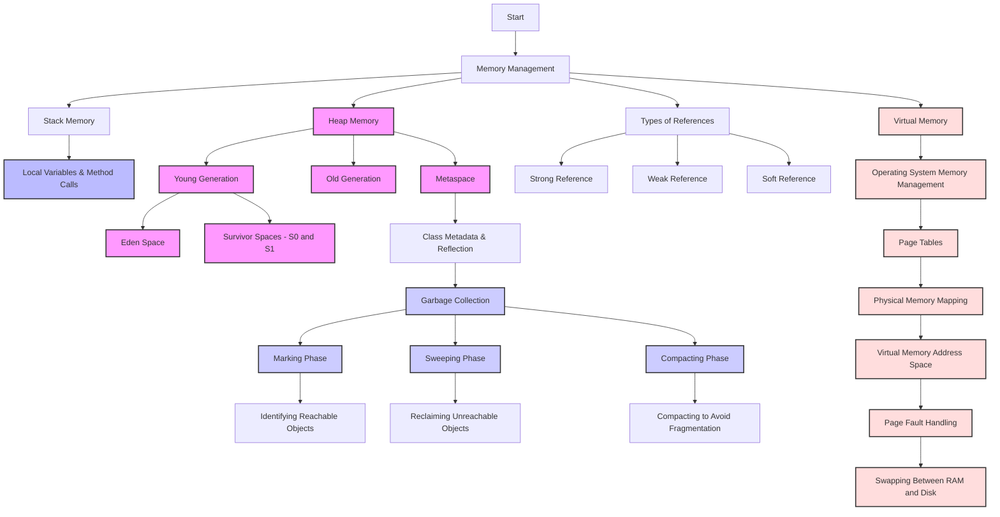

# **Memory Management in Java**

### **1. [Introduction](#1-introduction)**
Java manages memory in a way that abstracts the complexities of memory allocation, deallocation, and garbage collection. Understanding how memory is managed in Java is crucial for writing efficient and scalable applications. This chapter introduces the basic concepts of memory management in Java, focusing on Stack and Heap memory, and the role of garbage collection.

---

Below is the flow diagram that illustrates **Memory Management** and **Virtual Memory** in Java, including the basic flow of how objects are allocated, the memory structure (stack, heap, and metaspace), and the process of garbage collection. This can be useful to visualize how Java handles memory allocation and garbage collection.

### **[Diagram for Memory Management and Virtual Memory](#7-diagram-for-memory-management-and-virtual-memory)**



### Breakdown of the Diagram:

1. **Memory Management**:
   - **Stack Memory**: Used to store method calls, local variables, and references to objects.
   - **Heap Memory**: Used for dynamically created objects, including instances of classes and arrays.
     - **Young Generation**: Initially allocated objects, including Eden Space and Survivor Spaces (S0 and S1).
     - **Old Generation**: Stores long-lived objects that survive multiple garbage collection cycles.
     - **Metaspace**: Stores class metadata (class structure, methods, etc.).
   
2. **Garbage Collection**:
   - The garbage collection process works through three phases:
     1. **Marking**: Identifies reachable objects.
     2. **Sweeping**: Reclaims memory occupied by unreachable objects.
     3. **Compacting**: Reduces fragmentation by compacting live objects together.

3. **Types of References**:
   - **Strong Reference**: Standard reference, objects are not garbage collected as long as they have strong references.
   - **Weak Reference**: Objects are eligible for garbage collection when no strong references exist.
   - **Soft Reference**: Objects are collected when the JVM is low on memory.

4. **Virtual Memory**:
   - **Operating System Memory Management**: The OS manages virtual memory with the help of page tables and physical memory mapping.
   - **Page Tables**: Map virtual memory to physical memory addresses.
   - **Page Fault Handling**: If a page is not in physical memory, it will be swapped between RAM and disk (virtual memory).

This diagram helps show the flow from memory management, types of references, garbage collection, and the working of virtual memory. If you need further customization or specific details in any part of the diagram, feel free to ask!

---
### **2. [What Kind of Data is Stored in Stack and Heap](#2-what-kind-of-data-is-stored-in-stack-and-heap)**

In Java, memory is divided into two main parts: **Stack** and **Heap**. Each part serves a different purpose in terms of storage and lifecycle of data.

- **Stack Memory**:
  - **What is stored**: The **stack** is used for method calls, local variables, and references to objects in the heap. It is structured in a LIFO (Last In, First Out) manner.
  - **Data**: 
    - Method calls and local variables.
    - Primitive types like `int`, `float`, `boolean`, etc.
    - References to objects in the heap.
  - **Lifetime**: The data in the stack is temporary, and it gets destroyed as soon as the method that created them finishes execution.
  - **Example**:  
    ```java
    public void exampleMethod() {
        int x = 10; // x is stored in the stack
        MyClass obj = new MyClass(); // Reference to obj is in the stack, obj is in heap
    }
    ```
  
- **Heap Memory**:
  - **What is stored**: The **heap** is used to store all objects created during runtime. Objects in the heap are dynamic and have a longer lifespan than stack variables.
  - **Data**: 
    - Instances of classes (objects).
    - Arrays, collections, and other complex data structures.
  - **Lifetime**: The data in the heap persists as long as there are active references to it. It is subject to garbage collection.
  - **Example**:
    ```java
    MyClass obj = new MyClass(); // Object is stored in heap memory
    ```

---

### **3. [Stack and Heap Understanding with Example](#3-stack-and-heap-understanding-with-example)**

**Stack Example**:  
In a typical method call, local variables and method calls are stored in the stack:

```java
public class Example {
    public static void main(String[] args) {
        int num = 5; // num is stored in stack
        String name = "John"; // name is stored in stack as a reference
    }
}
```

Here, `num` is a primitive variable stored in the stack, while `name` is a reference variable pointing to a string object stored in the heap.

**Heap Example**:

```java
public class Example {
    public static void main(String[] args) {
        MyClass obj = new MyClass(); // obj reference in stack, MyClass object in heap
    }
}
```

The object `obj` itself is stored in the heap, while the reference to it is stored in the stack.

---

### **4. [Different Types of References (Strong, Weak, and Soft)](#4-different-types-of-references-strong-weak-and-soft)**

In Java, references determine how an object is accessed and whether or not it can be garbage collected. There are several types of references in Java, each with its own rules for garbage collection:

#### **Strong Reference**
- **Definition**: A reference that prevents an object from being garbage collected as long as the reference exists.
- **Example**: 
  ```java
  MyClass obj = new MyClass(); // Strong reference
  ```

#### **Weak Reference**
- **Definition**: Objects referenced by weak references are garbage collected as soon as they are no longer strongly reachable.
- **Use case**: Used when you want to allow objects to be collected when memory is low.
- **Example**:
  ```java
  WeakReference<MyClass> weakRef = new WeakReference<>(new MyClass());
  ```

#### **Soft Reference**
- **Definition**: Similar to weak references, but with a longer lifespan. Soft references are only cleared when the JVM is low on memory.
- **Use case**: Useful for implementing caches that can grow in size but will allow cleanup when memory is constrained.
- **Example**:
  ```java
  SoftReference<MyClass> softRef = new SoftReference<>(new MyClass());
  ```

---

### **5. [Heap Memory Structure Explanation with Example](#5-heap-memory-structure-explanation-with-example)**

The heap in Java is divided into different regions, each serving a different purpose in memory management. Here's a breakdown of the heap structure:

#### **Young Generation**
- **Eden Space**: This is where new objects are initially allocated. It is typically the smallest area of the heap.
- **Survivor Spaces (S0 and S1)**: Objects that survive the first garbage collection in the Eden space are moved to one of the two survivor spaces, S0 or S1.

**Example**:  
When an object is created, it is placed in the Eden space. If it survives a minor garbage collection, it is moved to one of the survivor spaces.

#### **Old Generation**
- **Definition**: Objects that have survived multiple garbage collection cycles in the young generation are promoted to the old generation. These objects have a longer lifespan.
- **Example**:  
  Long-lived objects like cache data or persistent objects are usually in the old generation.

#### **Metaspace**
- **Definition**: Metaspace stores class metadata (such as class definitions, methods, etc.). In Java 8 and later, the Metaspace replaces the PermGen space used in earlier versions.
- **Example**:  
  Class metadata for loaded classes in the JVM is stored here.

---

### **6. [Garbage Collection Algorithm and Types](#6-garbage-collection-algorithm-and-types)**

The Java garbage collector automatically reclaims memory used by objects that are no longer reachable. Several algorithms are available in Java, depending on the application's needs.

#### **How Garbage Collection Works**
- The garbage collector works by identifying objects that are no longer reachable (i.e., objects that have no references pointing to them). Once identified, these objects are marked for deletion and their memory is freed.
- **Minor GC**: This is a collection in the **young generation** (Eden and Survivor spaces).
- **Major GC**: This is a collection in the **old generation** where objects that survived many GC cycles are collected.
  
#### **Types of Garbage Collectors**
1. **Single GC** (Serial GC)
   - **Characteristics**: The Serial GC uses a single thread for garbage collection and is typically used for small applications.
   - **When to Use**: Best for applications with limited heap size and fewer threads.

2. **Parallel GC**
   - **Characteristics**: Uses multiple threads for garbage collection. Suitable for multiprocessor systems.
   - **When to Use**: For applications where throughput is more important than latency.

3. **CMS (Concurrent Mark and Sweep)**
   - **Characteristics**: CMS minimizes pause times by performing most of the garbage collection work concurrently with the application threads.
   - **When to Use**: For applications that require low pause times but can tolerate some throughput loss.

4. **G1 GC**
   - **Characteristics**: The Garbage-First (G1) GC is designed for large applications with large heaps. It aims to prioritize low-latency garbage collection while also balancing throughput.
   - **When to Use**: For large heap applications requiring low-latency and high throughput.[Latency and Throughput](#latency-and-throughput)

---

### **7. Conclusion**

Java's memory management system is designed to be efficient and automatic, with features like garbage collection ensuring that unused objects are cleaned up without manual intervention. By understanding the distinctions between stack and heap memory, the different types of references, and the working of garbage collectors, developers can write more efficient and optimized Java applications.

---

### Latency and Throughput 

### Key Concepts in Performance and Networking

**Latency** and **Throughput** are two important metrics used to measure the performance of systems, networks, and applications, especially in computing, networking, and distributed systems. They are related but distinct concepts.

### 1. **Latency**
**Latency** refers to the time delay between initiating a request and receiving a response. It is essentially the time it takes for data to travel from the source to the destination.

#### Key Points:
- **Definition**: Latency is the **delay** in communication or processing. It is the time taken for a message to go from one point to another.
- **Units**: It is typically measured in **milliseconds (ms)** or **microseconds (µs)**.
- **Types of Latency**:
  - **Network Latency**: The time it takes for data to travel between two points on a network (e.g., from your computer to a server).
  - **Disk Latency**: The time it takes for a hard drive or SSD to respond to a request.
  - **Application Latency**: The time taken by an application to process a request (e.g., time taken for a web page to load).
  - **Round-Trip Latency**: The total time taken for a message to go from the sender to the receiver and back (e.g., ping time).
- **Factors Affecting Latency**:
  - **Propagation delay**: The time it takes for data to travel through a medium (e.g., fiber-optic cables, wireless signals).
  - **Processing delay**: Time spent on processing requests at intermediate systems (e.g., routers, servers).
  - **Queuing delay**: Time spent waiting in queues at routers, switches, or other network devices.
  - **Transmission delay**: Time taken to transmit data over the link based on bandwidth.

#### Example:
- **Low Latency**: In a gaming or video conference, low latency means there is minimal delay between the actions of players and the feedback they see (e.g., the response time when you move your mouse in a game).
- **High Latency**: In a satellite internet connection, there might be high latency because of the long distance the signal travels between Earth and the satellite.

### 2. **Throughput**
**Throughput** refers to the amount of data successfully transferred from one point to another within a given time period. It is a measure of **how much data can be processed or transmitted** over a specific time frame, typically in terms of bits per second (bps) or bytes per second (Bps).

#### Key Points:
- **Definition**: Throughput is the **rate** at which data is transferred over a network or processed by a system.
- **Units**: Measured in **bits per second (bps)**, **kilobits per second (Kbps)**, **megabits per second (Mbps)**, **gigabits per second (Gbps)**, or **bytes per second (Bps)**.
- **Factors Affecting Throughput**:
  - **Bandwidth**: The maximum rate at which data can be transmitted over a network connection. It is often confused with throughput but refers to the potential maximum speed.
  - **Network Congestion**: High levels of traffic on a network can reduce throughput as packets are delayed or lost.
  - **Packet Loss**: Lost or corrupted packets must be retransmitted, reducing the effective throughput.
  - **Protocol Overhead**: The headers and metadata added to packets in network protocols (e.g., TCP/IP) can reduce the effective throughput because the actual payload (useful data) is smaller than the total packet size.
  - **Latency**: High latency can indirectly reduce throughput, especially in protocols like TCP, which require acknowledgments and retransmissions.

#### Example:
- **High Throughput**: A high-speed fiber-optic connection can transfer large amounts of data very quickly, resulting in high throughput.
- **Low Throughput**: A slow Wi-Fi connection might have low throughput, even if the network’s bandwidth is technically capable of higher speeds.

### **Key Differences Between Latency and Throughput:**
| **Aspect**         | **Latency**                                      | **Throughput**                                         |
|--------------------|-------------------------------------------------|-------------------------------------------------------|
| **Definition**     | Time delay for a message or data to travel from sender to receiver. | The amount of data transferred or processed per unit of time. |
| **Measurement**    | Typically measured in **milliseconds (ms)** or **microseconds (µs)**. | Measured in **bits per second (bps)** or **bytes per second (Bps)**. |
| **Impact on Systems** | Affects the responsiveness of applications or systems (e.g., web page loading time). | Affects how much data can be transferred or processed in a given period (e.g., file transfer speed). |
| **Relation**        | High latency can limit the throughput because it takes longer for data to be transferred and acknowledged. | High throughput may require high bandwidth, but it may not be possible with high latency. |
| **Example**         | The time taken for a request to go from your browser to the web server and back. | The speed at which a file is downloaded from the internet. |

### **Example of the Relationship Between Latency and Throughput:**
Consider the scenario where you’re downloading a file over the internet:
- **High Latency**: If the latency is high (e.g., due to a satellite internet connection), it will take a long time for data packets to travel back and forth between your computer and the server. Even if the throughput is high, the user might experience delays in starting the download because of the initial latency.
- **High Throughput**: If the throughput is high (e.g., 1 Gbps fiber connection), you can download large files quickly, but if latency is also high, the transfer may still feel slower due to delays in packet acknowledgment and retransmissions.

### **How to Optimize Latency and Throughput:**
- **To Reduce Latency**:
  - Use low-latency connections (e.g., fiber-optic instead of satellite).
  - Optimize server-side processing and reduce the number of hops or intermediaries between the client and server.
  - Use caching to avoid redundant data transfers.
  - Implement protocols that are designed for low-latency communications (e.g., QUIC instead of TCP).
  
- **To Increase Throughput**:
  - Increase the available bandwidth (e.g., upgrade to higher-speed internet or use a faster local network).
  - Reduce congestion on the network.
  - Optimize network protocols to reduce overhead (e.g., using efficient compression).
  - Use parallel processing or multi-threading to allow multiple data streams to transfer concurrently.

### **Real-World Examples**:

- **Video Streaming**:
  - **Latency**: Low latency is important for real-time streaming, like video conferencing, where delays between the speaker and the viewer can cause communication issues.
  - **Throughput**: High throughput is crucial for streaming high-definition (HD) or 4K video without buffering. Higher throughput allows for faster download of the video content, ensuring smooth playback.

- **Web Browsing**:
  - **Latency**: When you load a webpage, lower latency ensures faster response times, which reduces the time you wait for a page to load.
  - **Throughput**: Higher throughput allows for faster downloads of content (images, videos, etc.) from the server to the browser, leading to a smoother experience.

---

### **Summary**:
- **Latency** is the delay or time it takes for data to travel from source to destination (measured in milliseconds).
- **Throughput** is the rate at which data is transferred or processed over a period of time (measured in bits or bytes per second).
- Both metrics are important for different performance aspects of applications and networks.
  - **Latency** affects the responsiveness and delay.
  - **Throughput** affects the volume of data transferred in a given period.
