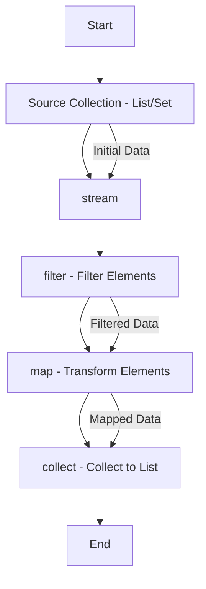

### Features introduced in Java from **Java 7 to Java 21**

| **Java Version** | **Feature** | **Description** | **Use Case** | **Benefits** |
|------------------|-------------|-----------------|--------------|--------------|
| **Java 7** (Released in July 2011) | **Try-with-resources** | Simplifies the management of resources such as streams, connections, and files by automatically closing them after use. | Ideal for managing resources like file streams and database connections. | Reduces boilerplate code, prevents resource leaks, and ensures better resource management. |
| | **Diamond Operator (`<>`)** | Allows the compiler to infer the type arguments in generics. | Used in generic classes and methods. Example: `Map<String, List<String>> map = new HashMap<>();` | Improves code readability and reduces redundancy in specifying generic types. |
| | **Strings in Switch Statements** | Enables `String` objects to be used in `switch` statements. | Common in cases where actions depend on string values (e.g., command line inputs). | Increases performance and readability when switching over string values. |
| | **NIO.2 (New I/O API)** | Enhanced file I/O with better file system APIs. Includes features like symbolic links, file attributes, and improved Path API. | Used for file manipulation and directory management (e.g., copying files, walking directories). | Simplifies file handling and provides more flexibility compared to previous I/O APIs. |
| | **Fork/Join Framework** | Designed for parallelism, it allows efficient parallel processing of tasks. | Useful in multi-core processors where tasks can be split and executed in parallel. | Improves performance by taking advantage of multicore processors and simplifying parallel processing. |
| **Java 8** (Released in March 2014) | **Lambda Expressions** | Introduces functional programming concepts such as lambda expressions for passing behavior as parameters. | Used in collections, event handling, and parallel streams. Example: `list.forEach(e -> System.out.println(e));` | Increases conciseness, readability, and allows functional programming in Java. |
| | **Streams API** | Supports functional-style operations on sequences of elements. Allows filter, map, reduce operations in a declarative style. | Useful for working with large data sets, filtering, transforming, or aggregating collections. | Facilitates cleaner, more expressive code, and can potentially improve performance with parallel streams. |
| | **Default Methods in Interfaces** | Interfaces can now have method implementations. | Allows for backward compatibility in interfaces while adding new functionality. | Reduces the need for creating abstract classes or breaking existing code when adding new methods. |
| | **Method References** | Provides a shorthand syntax to invoke methods. | Simplifies lambda expressions where the function is already implemented. Example: `list.forEach(System.out::println);` | Enhances code readability and eliminates redundancy. |
| | **Optional Class** | Represents a container object which may or may not contain a value. | Helps to avoid `NullPointerException` and reduces null checks in the code. | Improves null safety and promotes better handling of absent values. |
| | **New Date/Time API (java.time)** | A new date and time library that addresses problems with the old `Date` and `Calendar` classes. | Used for manipulating date and time, time zones, and durations. | Solves problems with old Date API, provides immutability, and is more user-friendly. |
| **Java 9** (Released in September 2017) | **Module System (Project Jigsaw)** | Introduces a module system that enables better encapsulation and modularization of code. | Ideal for large applications to divide the code into modules for better maintainability. | Improves code maintainability, security, and allows creating smaller, more efficient applications. |
| | **JShell (Java Shell)** | An interactive REPL (Read-Eval-Print Loop) tool for Java. | Used for quick experimentation and testing small code snippets. | Increases productivity and allows quick prototyping without the need for writing full programs. |
| | **Private Methods in Interfaces** | Allows private methods in interfaces to share code between default methods. | Used for reusing logic within default methods without exposing it publicly. | Promotes code reuse and cleaner interface design. |
| | **Improved Javadoc** | New features in `Javadoc`, including support for generating HTML5 output. | Used in generating API documentation. | Enhances the quality and readability of API documentation. |
| | **Compact Strings** | Optimizes string storage by using a more compact representation when only ASCII characters are used. | Automatically applied to `String` objects that only contain ASCII characters. | Reduces memory footprint for applications dealing with lots of text in ASCII. |
| **Java 10** (Released in March 2018) | **Local-Variable Type Inference** | Allows `var` keyword for local variable declarations, letting the compiler infer the type. | Used for variable declarations where the type is obvious from context. Example: `var list = new ArrayList<String>();` | Increases code readability and reduces verbosity. |
| | **Application Class-Data Sharing (AppCDS)** | Enhances the Class Data Sharing (CDS) feature to share application classes. | Helps in reducing startup time for applications by sharing classes across multiple Java processes. | Reduces application startup time and improves memory usage efficiency. |
| **Java 11** (Released in September 2018) | **HTTP Client API (Standard)** | The new `HttpClient` API replaces the old `HttpURLConnection` for making HTTP requests. | Used for making HTTP requests, handling responses, and working with REST APIs. | Simplifies HTTP operations and offers better support for HTTP/2, WebSockets, and asynchronous requests. |
| | **String Methods** | New methods added to the `String` class like `isBlank()`, `lines()`, `strip()`, etc. | Used for string manipulation (e.g., stripping whitespace, checking if a string is blank). | Improves string handling and makes it easier to work with strings. |
| | **Running Java Code in Containers** | Java 11 optimizes its use in containerized environments (like Docker). | Enables better resource management when running Java applications in containers. | Ensures predictable resource usage and performance inside containers. |
| | **Deprecation of `java.awt` and `java.applet`** | Marks some older APIs (e.g., `Applet`) for removal. | Encourages migration away from outdated APIs. | Reduces maintenance overhead and encourages the use of modern technologies. |
| **Java 12** (Released in March 2019) | **Switch Expressions** | Extends the `switch` statement to return a value and use multiple labels. | Used for more concise, readable, and flexible switch statements. Example: `var result = switch (day) { case MONDAY -> "Start"; default -> "End"; };` | Enhances code clarity and simplifies control flow in cases with multiple conditions. |
| | **Shenandoah GC (Garbage Collector)** | A low-latency garbage collector. | Used for applications where minimizing garbage collection pauses is critical. | Reduces pause times, improving the responsiveness of latency-sensitive applications. |
| **Java 13** (Released in September 2019) | **Text Blocks** | Introduces multi-line string literals. | Used for handling multi-line strings such as JSON or SQL queries. Example: `String query = """SELECT * FROM users""";` | Simplifies the use of multi-line strings and improves code readability. |
| **Java 14** (Released in March 2020) | **Records** | Introduces a new type of class that acts as a transparent carrier for immutable data. | Ideal for simple data-holding classes (DTOs, value objects). Example: `record Person(String name, int age) {}` | Reduces boilerplate code by auto-generating `toString()`, `equals()`, `hashCode()`, and constructors. |
| | **Pattern Matching for `instanceof`** | Simplifies the `instanceof` check by combining it with type casting. | Used to simplify code where an object needs to be checked for type and cast. Example: `if (obj instanceof String s) {}` | Increases code readability and reduces boilerplate. |
| **Java 15** (Released in September 2020) | **Sealed Classes** | Allows classes and interfaces to control which other classes or interfaces can extend or implement them. | Used in domain modeling to limit the set of subclasses for better maintainability. | Provides better control over inheritance hierarchies. |
| | **Hidden Classes** | Allows for defining classes that are not accessible from outside the JVM, typically used by frameworks. | Useful for frameworks and tools that generate bytecode at runtime. | Improves performance and security by restricting access to generated classes. |
| **Java 16** (Released in March 2021) | **JEP 376: ZGC (Garbage Collector) on macOS** | Extends ZGC to macOS, bringing the low-latency garbage collector to this platform. | Useful for applications running on macOS that need low-latency GC. | Increases the cross-platform support for ZGC and optimizes memory management. |
| | **Records (Finalized)** | Finalizing the Record feature introduced in Java 14. | Used for more concise and immutable data classes. | Further simplifies code and promotes immutability. |
| **Java 17** (Released in September 2021) | **Sealed Classes (Finalized)** | Finalizes sealed classes feature from Java 15. | Used for data modeling and limiting subclassing. | Enhances domain modeling and control over class hierarchies. |
| | **JEP 356: Enhanced Pseudo-Random Number Generators** | Introduces new interfaces and implementations for random number generation. | Used in cryptographic applications and simulations. | Improves random number generation for better performance and security. |
| **Java 18** (Released in March 2022) | **Simple Web Server** | A simple HTTP server that can be used for testing, debugging, or development purposes. | Ideal for quick prototyping or testing web-based applications. | Simplifies development and testing workflows without needing full-fledged web servers. |
| **Java 19** (Released in September 2022) | **Record Patterns (Preview)** | Introduces pattern matching for records. | Allows deconstructing records in pattern matching. Example: `if (person instanceof Person(String name, int age)) {}` | Enhances the flexibility of pattern matching with records. |
| **Java 20** (Released in March 2023) | **Vector API (Incubator)** | Offers a vector API for working with SIMD (Single Instruction, Multiple Data) operations. | Used in high-performance computing, scientific applications, and graphics. | Boosts performance by enabling vectorized operations. |
| **Java 21** (Released in September 2023) | **Pattern Matching for Switch (Preview)** | Extends pattern matching to `switch` statements. | Enhances readability and flexibility when using `switch`. Example: `switch (obj) { case Integer i -> ...; }` | Simplifies complex `switch` statements, making them more powerful and concise. |
| | **Virtual Threads** | Introduces lightweight threads to handle high concurrency with minimal overhead. | Ideal for applications with high concurrency, such as web servers or microservices. | Significantly reduces the overhead of handling large numbers of threads, improving scalability. |

Java 8 introduced several key updates and new features to the **Collections Framework**, significantly enhancing how collections are handled, processed, and manipulated. Below are the most notable changes and additions that Java 8 brought to the Collections Framework:

### 1. **Introduction of the Streams API**

The **Streams API** in Java 8 is one of the most significant changes to the Collections Framework. It allows you to process collections in a more functional and declarative style, with support for both sequential and parallel operations.

- **Stream Interface**: The `Stream` interface represents a sequence of elements and provides methods to perform aggregate operations on them (e.g., filtering, mapping, reducing).
- **Key Methods**:
  - `filter(Predicate<? super T> predicate)` – Filters elements based on the provided predicate.
  - `map(Function<? super T, ? extends R> mapper)` – Transforms each element into another form.
  - `reduce(T identity, BinaryOperator<T> accumulator)` – Performs a reduction on the elements using an associative accumulation function.
  - `forEach(Consumer<? super T> action)` – Performs an action for each element of the stream.
  - `collect(Collector<? super T, A, R> collector)` – Collects the elements of the stream into a collection or other containers.
  - `sorted(Comparator<? super T> comparator)` – Sorts elements according to a comparator.
  - **Parallel Streams**: `parallelStream()` can be used to process data in parallel, making full use of multi-core processors.

**Example**:
```java
List<String> list = Arrays.asList("apple", "banana", "cherry", "date");
list.stream()
    .filter(s -> s.startsWith("a"))
    .map(String::toUpperCase)
    .forEach(System.out::println);  // Output: APPLE
```

**Benefits**:
- Simplifies working with large collections of data.
- Supports both sequential and parallel execution.
- Reduces boilerplate code for filtering, mapping, and collecting.

---

### 2. **Lambda Expressions and Functional Interfaces**

Lambda expressions in Java 8 allowed for more concise and flexible ways to write functional-style code. They can be used extensively with the **Streams API** and other new collection methods.

- **Lambda Syntax**: `(parameters) -> expression` or `(parameters) -> { statements; }`
- **Functional Interfaces**: Java 8 introduced the concept of **functional interfaces**, which are interfaces that have only one abstract method. Common examples include `Predicate<T>`, `Function<T, R>`, `Consumer<T>`, and `Supplier<T>`.

**Example**:
```java
List<String> list = Arrays.asList("one", "two", "three");
list.forEach(s -> System.out.println(s));  // Prints each element of the list
```

**Benefits**:
- Improves readability by reducing boilerplate code (e.g., no need for anonymous inner classes).
- Enables functional programming in Java, allowing collections to be processed in a more declarative manner.

---

### 3. **Default Methods in Interfaces**

Java 8 allows interfaces to have **default methods**—methods with a body. This change was made to enable the addition of new methods to existing interfaces without breaking existing implementations. Now, collection interfaces like `Collection`, `List`, `Set`, `Queue`, and `Map` have default methods.

- **Example of Default Method**:
  ```java
  interface MyInterface {
      default void print() {
          System.out.println("Default print method");
      }
  }
  ```

- **Example in Collections**:
  - `forEach(Consumer<? super E> action)` is a default method added to the `Collection` interface. It allows iterating over the elements of the collection using a lambda expression or method reference.

**Benefits**:
- Enables the extension of interfaces without breaking backward compatibility.
- Reduces the need for abstract classes.

---

### 4. **New Methods in the `Collection` Interface**

Java 8 added several new methods to the **`Collection`** interface. These methods are now available to all collections (`List`, `Set`, `Queue`, etc.):

- **`forEach(Consumer<? super E> action)`**: Iterates over each element in the collection and performs the given action.
  
  **Example**:
  ```java
  List<String> list = Arrays.asList("apple", "banana", "cherry");
  list.forEach(System.out::println);  // Output: apple, banana, cherry
  ```

- **`removeIf(Predicate<? super E> filter)`**: Removes elements from the collection that satisfy the given predicate.

  **Example**:
  ```java
  List<String> list = new ArrayList<>(Arrays.asList("a", "b", "c"));
  list.removeIf(s -> s.equals("b"));
  System.out.println(list);  // Output: [a, c]
  ```

- **`stream()`**: Converts the collection into a stream for further processing.

  **Example**:
  ```java
  List<String> list = Arrays.asList("one", "two", "three");
  list.stream().filter(s -> s.length() == 3).forEach(System.out::println);  // Output: one two
  ```

- **`parallelStream()`**: Returns a parallel stream for concurrent processing of the collection.

  **Example**:
  ```java
  list.parallelStream().forEach(System.out::println);  // Processes elements in parallel
  ```

**Benefits**:
- Makes iteration and filtering easier with lambdas.
- Improves performance with parallel streams.
- Allows for more concise and readable code.

---

### 5. **New Methods in the `Map` Interface**

Several new methods were introduced to the **`Map`** interface in Java 8 to improve how maps are manipulated:

- **`forEach(BiConsumer<? super K, ? super V> action)`**: Iterates over the map's key-value pairs and applies the given action.

  **Example**:
  ```java
  Map<Integer, String> map = Map.of(1, "one", 2, "two");
  map.forEach((key, value) -> System.out.println(key + ": " + value));
  ```

- **`replaceAll(BiFunction<? super K, ? super V, ? extends V> function)`**: Replaces each value in the map with the result of applying the provided function.

  **Example**:
  ```java
  Map<Integer, String> map = new HashMap<>();
  map.put(1, "apple");
  map.replaceAll((key, value) -> value.toUpperCase());
  System.out.println(map);  // Output: {1=APPLE}
  ```

- **`computeIfAbsent(K key, Function<? super K, ? extends V> mappingFunction)`**: Computes a value for the key if it is absent.

  **Example**:
  ```java
  Map<Integer, String> map = new HashMap<>();
  map.computeIfAbsent(1, k -> "one");
  System.out.println(map);  // Output: {1=one}
  ```

- **`merge(K key, V value, BiFunction<? super V, ? super V, ? extends V> remappingFunction)`**: Merges a value with the existing value for the given key.

  **Example**:
  ```java
  Map<Integer, String> map = new HashMap<>();
  map.put(1, "apple");
  map.merge(1, "fruit", (oldValue, newValue) -> oldValue + " & " + newValue);
  System.out.println(map);  // Output: {1=apple & fruit}
  ```

**Benefits**:
- More flexible and functional methods for manipulating maps.
- Simplifies operations like replacing, merging, and computing values.

---

### 6. **The `Optional` Class**

The **`Optional`** class was introduced in **`java.util`** to help avoid `NullPointerException`. It represents a value that might or might not be present, encouraging safer handling of nulls, especially when working with collections.

- **Example**:
  ```java
  Optional<String> name = Optional.ofNullable(getName());
  name.ifPresent(n -> System.out.println("Name is: " + n));
  ```

- **Methods**:
  - `isPresent()` – Checks if a value is present.
  - `ifPresent(Consumer<? super T> action)` – Executes a given action if the value is present.
  - `orElse(T other)` – Returns the value if present, otherwise returns the provided default value.

**Benefits**:
- Reduces the need for explicit null checks.
- Prevents `NullPointerException` by enforcing handling of absent values.

---

### 7. **Collectors Utility Class**

The **`Collectors`** utility class provides predefined implementations for common collection operations that can be used with streams:

- **`toList()`**: Collects elements into a `List`.
- **`toSet()`**: Collects elements into a `Set`.
- **`joining()`**: Concatenates elements into a string.
- **`groupingBy()`**: Groups elements by a classifier function.
- **`partitioningBy()`**: Partitions elements into two groups based on a predicate.

**Example**:
```java
List<String> list = Arrays.asList("apple", "banana", "cherry");
String result = list.stream().collect(Collectors.joining(", ", "[", "]"));
System.out.println(result);  // Output: [apple, banana, cherry]
```

**Benefits**:
- Simplifies collecting and grouping elements from a stream.
- Provides a consistent way to

 convert stream data into various collection types.

---

### Summary of Key Java 8 Updates to the Collections Framework:

| **Feature**            | **Description**                                                                 | **Example**                                                       | **Benefits**                                                              |
|------------------------|---------------------------------------------------------------------------------|-------------------------------------------------------------------|---------------------------------------------------------------------------|
| **Streams API**         | Functional-style operations on collections, supporting parallelism.            | `stream().filter().map().reduce()`                                | Concise, readable, and performant data processing.                        |
| **Lambda Expressions**  | Enables functional programming style with shorter syntax.                       | `forEach(s -> System.out.println(s))`                             | Reduces boilerplate, increases flexibility.                               |
| **Default Methods**     | Allows interfaces to have default implementations without breaking existing code.| `forEach()`, `removeIf()`                                         | Extends interfaces while maintaining backward compatibility.              |
| **New Collection Methods** | New methods in `Collection`, like `forEach`, `removeIf`, `stream()`.             | `list.forEach()`, `list.stream()`                                  | Simplifies iteration, filtering, and collection processing.               |
| **Optional Class**      | Encapsulates an optional value to avoid `NullPointerException`.                | `Optional.ofNullable(value).ifPresent()`                          | Safer handling of null values, prevents `NullPointerException`.           |
| **Map Updates**         | New methods in `Map`, like `computeIfAbsent()`, `replaceAll()`, and `merge()`. | `map.merge()`, `map.replaceAll()`                                  | Simplifies map manipulation and functional handling of key-value pairs.   |
| **Collectors Class**    | Utility methods for collecting stream elements.                               | `Collectors.toList()`, `Collectors.groupingBy()`                   | Provides convenient ways to gather stream results into collections.      |

---

In **Java 8**, the **`Map`** interface was enhanced with several new methods, making it more flexible, functional, and easier to work with. These updates enable you to perform a variety of operations on maps in a more concise and expressive manner, often using **lambdas** and **streams**.

Here are the key updates and new methods introduced to the **`Map`** interface in Java 8:

### 1. **`forEach(BiConsumer<? super K, ? super V> action)`**
- **Description**: This method allows you to iterate over the entries (key-value pairs) in a `Map` and perform an action for each entry. The action is provided as a `BiConsumer`, which takes two parameters: the key and the value.
- **Example**:
  ```java
  Map<Integer, String> map = Map.of(1, "one", 2, "two", 3, "three");
  map.forEach((key, value) -> System.out.println(key + ": " + value));
  ```
  **Output**:
  ```
  1: one
  2: two
  3: three
  ```

- **Benefits**: 
  - Simplifies iteration over `Map` entries.
  - Makes the code more readable and concise.
  - Can be combined with **lambda expressions** or **method references**.

---

### 2. **`replaceAll(BiFunction<? super K, ? super V, ? extends V> function)`**
- **Description**: This method allows you to replace all values in the map by applying a given function to each key-value pair. The function takes the key and value, and returns the new value.
- **Example**:
  ```java
  Map<Integer, String> map = new HashMap<>();
  map.put(1, "apple");
  map.put(2, "banana");
  map.put(3, "cherry");
  
  map.replaceAll((key, value) -> value.toUpperCase());
  
  System.out.println(map);  // Output: {1=APPLE, 2=BANANA, 3=CHERRY}
  ```

- **Benefits**: 
  - Provides a more concise way to modify all values in the map.
  - Enables transformations to be performed on map values in a functional style.

---

### 3. **`computeIfAbsent(K key, Function<? super K, ? extends V> mappingFunction)`**
- **Description**: This method computes a value for the specified key if the key is not already present in the map. If the key is absent, the `mappingFunction` is applied to compute the value and insert it into the map.
- **Example**:
  ```java
  Map<Integer, String> map = new HashMap<>();
  map.put(1, "apple");
  
  map.computeIfAbsent(2, key -> "banana");
  map.computeIfAbsent(1, key -> "grape");  // This won't change the value for key 1
  
  System.out.println(map);  // Output: {1=apple, 2=banana}
  ```

- **Benefits**:
  - Helps in populating the map with computed values only when necessary.
  - Avoids unnecessary recomputation when the key already exists.
  - Useful for lazy loading or default values.

---

### 4. **`computeIfPresent(K key, BiFunction<? super K, ? super V, ? extends V> remappingFunction)`**
- **Description**: This method computes a new value for an existing key if the key is present in the map. If the key is absent, nothing happens. The provided `remappingFunction` takes both the key and the current value, and computes a new value.
- **Example**:
  ```java
  Map<Integer, String> map = new HashMap<>();
  map.put(1, "apple");
  map.put(2, "banana");
  
  map.computeIfPresent(1, (key, value) -> value.toUpperCase());
  map.computeIfPresent(3, (key, value) -> value.toLowerCase());  // No effect, as key 3 is not present
  
  System.out.println(map);  // Output: {1=APPLE, 2=banana}
  ```

- **Benefits**:
  - Enables updating an existing value if the key is present.
  - Provides a functional way to modify map entries conditionally.

---

### 5. **`merge(K key, V value, BiFunction<? super V, ? super V, ? extends V> remappingFunction)`**
- **Description**: This method allows you to merge the specified value with the existing value for the given key in the map. If the key is absent, the given value is inserted. If the key is present, the `remappingFunction` is used to combine the existing value with the new value.
- **Example**:
  ```java
  Map<Integer, String> map = new HashMap<>();
  map.put(1, "apple");
  map.put(2, "banana");
  
  map.merge(1, "fruit", (oldValue, newValue) -> oldValue + " & " + newValue);
  map.merge(3, "cherry", (oldValue, newValue) -> oldValue + " & " + newValue);  // Key 3 is absent, value is inserted
  
  System.out.println(map);  // Output: {1=apple & fruit, 2=banana, 3=cherry}
  ```

- **Benefits**:
  - Provides a powerful mechanism to update or insert values based on a custom merge logic.
  - Useful for scenarios where the value for an existing key needs to be modified or combined with a new value.

---

### 6. **`getOrDefault(Object key, V defaultValue)`**
- **Description**: This method returns the value associated with the specified key, or the provided default value if the key is not found in the map.
- **Example**:
  ```java
  Map<Integer, String> map = new HashMap<>();
  map.put(1, "apple");
  
  String value = map.getOrDefault(2, "banana");
  System.out.println(value);  // Output: banana
  ```

- **Benefits**:
  - Simplifies retrieving a value with a fallback if the key is missing.
  - Reduces the need for null checks when the key might be absent.

---

### 7. **`putIfAbsent(K key, V value)`**
- **Description**: This method inserts the value for the given key only if the key is not already present in the map. If the key already exists, the existing value is retained.
- **Example**:
  ```java
  Map<Integer, String> map = new HashMap<>();
  map.put(1, "apple");
  
  map.putIfAbsent(1, "banana");  // Does nothing because key 1 already exists.
  map.putIfAbsent(2, "cherry");  // Adds key 2 with value "cherry".
  
  System.out.println(map);  // Output: {1=apple, 2=cherry}
  ```

- **Benefits**:
  - Prevents overwriting existing values.
  - Useful for ensuring that a key has a default value only if it is not already set.

---

### Summary of Key Java 8 Updates to the `Map` Interface:

| **Method**                         | **Description**                                                                 | **Example Use Case**                                                    |
|------------------------------------|---------------------------------------------------------------------------------|------------------------------------------------------------------------|
| **`forEach(BiConsumer<? super K, ? super V> action)`** | Iterates over the map and applies the action on each key-value pair. | `map.forEach((key, value) -> System.out.println(key + ": " + value));` |
| **`replaceAll(BiFunction<? super K, ? super V, ? extends V> function)`** | Replaces all values in the map using the provided function. | `map.replaceAll((key, value) -> value.toUpperCase());`                 |
| **`computeIfAbsent(K key, Function<? super K, ? extends V> mappingFunction)`** | Computes a value for a missing key if it is not already present. | `map.computeIfAbsent(2, key -> "banana");`                             |
| **`computeIfPresent(K key, BiFunction<? super K, ? super V, ? extends V> remappingFunction)`** | Computes a new value if the key is present in the map. | `map.computeIfPresent(1, (key, value) -> value.toUpperCase());`       |
| **`merge(K key, V value, BiFunction<? super V, ? super V, ? extends V> remappingFunction)`** | Merges a value with an existing value for a key. | `map.merge(1, "fruit", (oldValue, newValue) -> oldValue + " & " + newValue);` |
| **`getOrDefault(Object key, V defaultValue)`** | Returns the value or the default if the key is absent. | `String value = map.getOrDefault(2, "banana");`                       |
| **`putIfAbsent(K key, V value)`**   | Adds a key-value pair only if the key is not already present. | `map.putIfAbsent(2, "cherry");`                                         |

### Benefits of Java 8 Updates to `Map`:
- **Conciseness**: The new methods simplify map manipulations, making the code more concise and readable.
- **Functional Style**: These methods encourage the use of functional programming techniques (like lambdas and higher-order functions) for

 handling maps.
- **Performance**: Some methods like `computeIfAbsent` or `merge` can be more efficient than manually checking if a key exists and performing operations.

These updates to the `Map` interface make it easier and more flexible to work with key-value pairs in a more modern, functional programming style in Java.

---

In **Java 8**, the **`String`** class received several important updates that enhanced its functionality and made string manipulation more powerful, especially in the context of **lambda expressions**, **streams**, and **functional programming**. Below are the key updates introduced to the **`String`** class in Java 8:

### 1. **`String.join(CharSequence delimiter, CharSequence... elements)`**
- **Description**: The `String.join()` method was introduced to simplify joining multiple strings (or other `CharSequence` objects) with a specified delimiter. It works with any collection of `CharSequence` elements, including arrays, lists, or any iterable collection.
  
- **Example**:
  ```java
  String result = String.join(", ", "apple", "banana", "cherry");
  System.out.println(result);  // Output: apple, banana, cherry
  ```

  You can also use `String.join()` with collections or arrays:
  ```java
  List<String> list = Arrays.asList("one", "two", "three");
  String result = String.join("-", list);
  System.out.println(result);  // Output: one-two-three
  ```

- **Benefits**:
  - Simplifies the process of joining strings with a delimiter.
  - Avoids the need for manually iterating over collections to concatenate elements.
  
---

### 2. **`String.lines()`**
- **Description**: The `String.lines()` method was added to split a `String` into a stream of lines. It returns a **Stream<String>**, where each element in the stream represents a line from the string (based on line separators such as `\n` or `\r\n`).
  
- **Example**:
  ```java
  String text = "First line\nSecond line\nThird line";
  text.lines().forEach(System.out::println);
  ```

  **Output**:
  ```
  First line
  Second line
  Third line
  ```

- **Benefits**:
  - Provides an easy and functional way to process text line by line.
  - Can be used in combination with the **Streams API** for more complex text processing tasks.

---

### 3. **`String.strip()` and `String.stripLeading()` / `String.stripTrailing()`**
- **Description**: Java 8 introduced new methods for removing whitespace from the beginning and end of a string:
  - `String.strip()` removes both leading and trailing whitespace.
  - `String.stripLeading()` removes leading whitespace (beginning of the string).
  - `String.stripTrailing()` removes trailing whitespace (end of the string).
  
  These methods are an improvement over `trim()`, as they are Unicode-aware and follow the Unicode standard for whitespace characters.

- **Example**:
  ```java
  String text = "   Hello World!   ";
  
  System.out.println(text.strip());       // Output: "Hello World!"
  System.out.println(text.stripLeading());  // Output: "Hello World!   "
  System.out.println(text.stripTrailing()); // Output: "   Hello World!"
  ```

- **Benefits**:
  - Handles Unicode whitespace characters, not just the ASCII space.
  - Provides more accurate string trimming according to Unicode definitions.

---

### 4. **`String.repeat(int count)`**
- **Description**: The `String.repeat()` method was added to repeat a string a given number of times. This makes it much easier to create repeated patterns or strings without needing to write loops.

- **Example**:
  ```java
  String repeated = "abc".repeat(3);
  System.out.println(repeated);  // Output: abcabcabc
  ```

- **Benefits**:
  - Provides a more concise and readable way to repeat strings compared to using a loop or `StringBuilder`.
  - Great for generating repeated patterns or generating text content dynamically.

---

### 5. **`String.chars()`**
- **Description**: The `String.chars()` method was introduced to return an **IntStream** of the code points of a string. This allows you to work with the individual Unicode code points of a string in a more functional and stream-based way.

- **Example**:
  ```java
  String text = "Hello";
  text.chars().forEach(c -> System.out.println((char) c));
  ```

  **Output**:
  ```
  H
  e
  l
  l
  o
  ```

- **Benefits**:
  - Facilitates working with individual characters in a more functional and stream-based manner.
  - Useful for processing non-ASCII characters and surrogate pairs in Unicode.

---

### 6. **`String.codePoints()`**
- **Description**: The `String.codePoints()` method returns an **IntStream** of Unicode code points from a string. This is similar to `chars()`, but it allows you to process code points in a way that properly handles characters outside the Basic Multilingual Plane (BMP), such as emoji or characters from other scripts that require multiple `char` values.

- **Example**:
  ```java
  String text = "Hello 🌍";
  text.codePoints().forEach(c -> System.out.println((char) c));
  ```

  **Output**:
  ```
  H
  e
  l
  l
  o
  (space)
  🌍
  ```

- **Benefits**:
  - Handles Unicode characters and surrogate pairs properly.
  - Useful for processing complex characters (e.g., emoji, Asian scripts, etc.) in a functional style.

---

### 7. **`String.isBlank()`**
- **Description**: The `String.isBlank()` method was introduced to check whether a string is empty or consists only of whitespace characters (spaces, tabs, newlines, etc.). This is an improvement over `isEmpty()`, as it accounts for strings that might contain only spaces or other whitespace characters.

- **Example**:
  ```java
  String str1 = "   ";
  String str2 = "Hello";
  
  System.out.println(str1.isBlank());  // Output: true
  System.out.println(str2.isBlank());  // Output: false
  ```

- **Benefits**:
  - Provides a simple and reliable way to check for blank (whitespace-only) strings.
  - Useful for validation checks where only non-empty, non-blank strings are acceptable.

---

### 8. **`String.format(Locale, String, Object...)`**
- **Description**: Java 8 introduced the ability to pass a `Locale` explicitly to the `String.format()` method, making it easier to format strings in a locale-specific way. This is particularly useful for internationalization (i18n) and ensuring the correct format for dates, numbers, and currencies.

- **Example**:
  ```java
  Locale locale = Locale.FRANCE;
  String formatted = String.format(locale, "Price: %.2f", 1234.56);
  System.out.println(formatted);  // Output: Price: 1234,56 (using French locale formatting)
  ```

- **Benefits**:
  - Helps in formatting strings based on a specific locale, ensuring that numbers, currencies, and other locale-sensitive data are displayed correctly.

---

### Summary of Key String Updates in Java 8:

| **Method**                        | **Description**                                                       | **Example**                                                              |
|-----------------------------------|-----------------------------------------------------------------------|--------------------------------------------------------------------------|
| **`String.join(CharSequence delimiter, CharSequence... elements)`** | Joins multiple strings with a delimiter.                             | `String.join(", ", "apple", "banana", "cherry")`                          |
| **`String.lines()`**              | Splits a string into a stream of lines.                               | `"First line\nSecond line".lines().forEach(System.out::println)`          |
| **`String.strip()`**              | Removes leading and trailing whitespace (Unicode-aware).             | `"   Hello   ".strip()`                                                  |
| **`String.stripLeading()`**       | Removes leading whitespace (Unicode-aware).                          | `"   Hello   ".stripLeading()`                                            |
| **`String.stripTrailing()`**      | Removes trailing whitespace (Unicode-aware).                         | `"   Hello   ".stripTrailing()`                                           |
| **`String.repeat(int count)`**    | Repeats the string a given number of times.                           | `"abc".repeat(3)`  (Output: `"abcabcabc"`)                                |
| **`String.chars()`**              | Returns an `IntStream` of the string’s characters.                    | `"Hello".chars().forEach(c -> System.out.println((char) c))`              |
| **`String.codePoints()`**         | Returns an `IntStream` of Unicode code points.                        | `"Hello 🌍".codePoints().forEach(c -> System.out.println((char) c))`      |
| **`String.isBlank()`**            | Checks if a string is empty or only contains whitespace.              | `"   ".isBlank()`  (Output: `true`)                                       |
| **`String.format(Locale, String, Object...)`** | Formats a string with a given locale.                                | `String.format(Locale.FRANCE, "Price: %.2f", 1234.56)`                   |

### Benefits of Java 8 String Updates:
- **Simplification**: Many of these updates simplify common string operations, such as joining, trimming, and checking for blank strings.
- **Functional Programming**: Methods like `lines()`, `chars()`, and `codePoints()` provide stream-based, functional-style operations for working with strings.
- **Unicode Support**: Methods like `strip()`, `chars()`, and `codePoints()` ensure proper handling of Unicode characters, including whitespace and surrogate pairs.

These enhancements to

 the **`String`** class in Java 8 provide a more powerful and flexible set of tools for string manipulation and improve compatibility with modern programming paradigms, like functional programming and internationalization.

---

In **Java 8**, abstract classes received some important updates, primarily with the addition of **default methods** and **static methods**. These changes allowed abstract classes to have behavior (in addition to just defining an API) and also improved the overall flexibility and usability of abstract classes in Java. Below are the key updates introduced to abstract classes in Java 8:

### 1. **Default Methods in Abstract Classes**
- **Description**: Java 8 introduced the concept of **default methods** in interfaces, but abstract classes can also define methods with a body (which behave similarly to default methods in interfaces). This allows abstract classes to provide concrete behavior that can be inherited by subclasses, making it easier to add new methods without breaking existing implementations.
  
- **Key Points**:
  - A default method in an abstract class is a method with a body, defined using the `default` keyword.
  - Abstract classes can now provide a default implementation for some methods, which can be overridden by subclasses if needed.
  
- **Example**:
  ```java
  abstract class Shape {
      abstract void draw(); // Abstract method (must be implemented by subclasses)

      // Default method with a body
      public void color() {
          System.out.println("Coloring the shape");
      }
  }

  class Circle extends Shape {
      @Override
      void draw() {
          System.out.println("Drawing Circle");
      }
  }

  public class Main {
      public static void main(String[] args) {
          Circle circle = new Circle();
          circle.draw();  // Output: Drawing Circle
          circle.color(); // Output: Coloring the shape (default implementation)
      }
  }
  ```

- **Benefits**:
  - **Backward Compatibility**: You can add new methods to abstract classes without forcing subclasses to implement them.
  - **Code Reusability**: Provides common functionality (like `color()` in the example) in the abstract class that can be shared by all subclasses.
  - **Flexibility**: Subclasses can override default methods to provide their own specific behavior.

---

### 2. **Static Methods in Abstract Classes**
- **Description**: Java 8 also introduced the ability to define **static methods** in abstract classes. This allows abstract classes to provide utility methods or other static behavior, which is common in base classes. Static methods in abstract classes are not inherited by subclasses but can be accessed through the class name.

- **Example**:
  ```java
  abstract class Shape {
      static void printShapeType() {
          System.out.println("This is a shape.");
      }
  }

  class Circle extends Shape {
      // No need to override the static method
  }

  public class Main {
      public static void main(String[] args) {
          // Accessing the static method via the abstract class
          Shape.printShapeType();  // Output: This is a shape.
      }
  }
  ```

- **Benefits**:
  - **Utility Methods**: Abstract classes can now have static utility methods (like `printShapeType()`) that are related to the class but are not required to be overridden by subclasses.
  - **Organized Code**: Helps in organizing common static methods in abstract classes, reducing code duplication.

---

### 3. **Private Methods in Abstract Classes**
- **Description**: Java 9 (after Java 8) introduced **private methods** in interfaces, but in Java 8, abstract classes already supported private methods. This means that in Java 8, you could have **private helper methods** inside abstract classes. These methods cannot be overridden, and they are only accessible within the class itself.

- **Example**:
  ```java
  abstract class Shape {
      abstract void draw(); // Abstract method

      // Private helper method
      private void printMessage() {
          System.out.println("Shape is being drawn.");
      }

      // Method using the private method
      public void drawShape() {
          printMessage();
          draw();
      }
  }

  class Circle extends Shape {
      @Override
      void draw() {
          System.out.println("Drawing Circle");
      }
  }

  public class Main {
      public static void main(String[] args) {
          Circle circle = new Circle();
          circle.drawShape();  // Output: Shape is being drawn. Drawing Circle
      }
  }
  ```

- **Benefits**:
  - **Encapsulation**: The ability to use private methods allows for better encapsulation within abstract classes.
  - **Helper Methods**: Private methods can be used as helper methods that are not intended to be accessed outside the abstract class.
  
---

### 4. **Increased Flexibility with Method Overriding**
- **Description**: Java 8 abstract classes can now have methods that are already implemented with a default implementation or static methods, giving subclasses the flexibility to override or not override methods based on the need.

  - Abstract classes can define methods with default behaviors, and subclasses can override them if they require specialized behavior.
  
- **Example**:
  ```java
  abstract class Animal {
      abstract void sound();  // Abstract method

      // Default method
      public void breathe() {
          System.out.println("Breathing...");
      }
  }

  class Dog extends Animal {
      @Override
      void sound() {
          System.out.println("Barking");
      }

      // No need to override breathe() if the default behavior is sufficient
  }

  public class Main {
      public static void main(String[] args) {
          Dog dog = new Dog();
          dog.sound();  // Output: Barking
          dog.breathe(); // Output: Breathing...
      }
  }
  ```

- **Benefits**:
  - **Reduced Boilerplate**: You can provide default behavior to reduce the need for every subclass to implement every method.
  - **Enhanced Flexibility**: Subclasses can choose to override methods as needed, or use the default methods directly.

---

### Summary of Java 8 Updates to Abstract Classes:

| **Feature**              | **Description**                                                                 | **Example Use Case**                                         |
|--------------------------|---------------------------------------------------------------------------------|-------------------------------------------------------------|
| **Default Methods**       | Abstract classes can provide method implementations, which can be inherited or overridden by subclasses. | Allows providing common method implementations for subclasses. |
| **Static Methods**        | Abstract classes can now have static methods, which can be called without instantiating the class. | Utility or helper methods that don't need to be overridden.  |
| **Private Methods**       | Abstract classes can define private methods that are only used internally.        | Helper methods for internal use that don't need to be accessed outside the class. |
| **Method Overriding Flexibility** | Subclasses can choose to override default methods or use them as-is. | Subclasses can choose to override or use default behavior from the abstract class. |

### Benefits of Java 8 Updates to Abstract Classes:
- **Code Reusability**: Abstract classes can now provide default behavior, reducing the amount of code that subclasses need to write.
- **Backward Compatibility**: Default methods allow you to add new methods to abstract classes without breaking existing subclasses.
- **Flexible Design**: Subclasses can now inherit behavior from abstract classes but still override methods as needed.
- **Improved Organization**: Static and private methods help in organizing and structuring code more effectively.

These updates to abstract classes in **Java 8** allow for more flexible and powerful object-oriented design, where abstract classes can provide behavior while still maintaining their role as templates for subclasses.

---

In **Java 8**, interfaces, abstract classes, and regular interfaces (before Java 8) have distinct characteristics. The introduction of new features like **default methods** and **static methods** in interfaces has blurred the lines between abstract classes and interfaces, but there are still key differences between them. Here’s a detailed comparison between **Java 8 interfaces**, **abstract classes**, and **regular interfaces (before Java 8)**:

### 1. **Regular Interface (Before Java 8)**
In Java versions prior to **Java 8**, interfaces were used primarily to define **abstract methods** that must be implemented by any class that implements the interface. They could not have any method implementations (except for `static` and `default` methods, which were introduced in Java 8).

#### Key Characteristics:
- **All methods are abstract by default** (except for `static` and `default` methods in Java 8).
- **Cannot have instance fields**; they can only have `static` constants (public, static, final fields).
- **Cannot have method implementations** (all methods are implicitly abstract before Java 8).
- **Cannot have constructors**.

#### Example of Regular Interface (Before Java 8):
```java
interface Animal {
    void sound();  // Abstract method, no implementation

    // All fields are implicitly public, static, final
    int age = 5;

    // No constructors allowed
}
```

### 2. **Java 8 Interface (With Default and Static Methods)**
Java 8 introduced the concept of **default methods** and **static methods** in interfaces, allowing interfaces to provide method implementations. This gave interfaces more functionality, similar to abstract classes, but with certain restrictions.

#### Key Characteristics of Java 8 Interface:
- **Can have abstract methods** (which must be implemented by classes that implement the interface).
- **Can have default methods**: These are methods with a body, which provide a default implementation. They can be overridden by implementing classes but are not required to be.
- **Can have static methods**: These are methods that belong to the interface itself and can be called without an instance of the interface.
- **Can have constants**: Like regular interfaces, all fields are `public`, `static`, and `final`.
- **Cannot have instance fields or constructors**.
  
#### Example of Java 8 Interface (With Default and Static Methods):
```java
interface Animal {
    void sound();  // Abstract method

    // Default method
    default void eat() {
        System.out.println("Eating food");
    }

    // Static method
    static void sleep() {
        System.out.println("Sleeping");
    }
}
```

### 3. **Abstract Class**
An abstract class is a class that cannot be instantiated directly and is meant to be subclassed. It can contain both abstract methods (without a body) and concrete methods (with a body). Abstract classes are a more flexible alternative to interfaces when you need shared code in the base class.

#### Key Characteristics of Abstract Classes:
- **Can have both abstract and concrete methods**: Abstract methods must be implemented by subclasses, while concrete methods provide a default implementation.
- **Can have instance fields** (non-static fields). Unlike interfaces, abstract classes can hold state.
- **Can have constructors**: Abstract classes can define constructors, which can be invoked by subclasses.
- **Can implement interfaces**: An abstract class can implement one or more interfaces.
- **Can inherit from other classes**: Unlike interfaces, abstract classes can extend other classes, making it possible to create a class hierarchy.
  
#### Example of Abstract Class:
```java
abstract class Animal {
    int age;  // Instance field

    // Constructor
    Animal(int age) {
        this.age = age;
    }

    // Abstract method
    abstract void sound();

    // Concrete method
    void breathe() {
        System.out.println("Breathing...");
    }
}
```

---

### **Comparison Table: Interface vs Abstract Class vs Regular Interface**

| Feature                            | **Regular Interface (Before Java 8)**                               | **Java 8 Interface (With Default and Static Methods)**         | **Abstract Class**                                      |
|------------------------------------|---------------------------------------------------------------------|----------------------------------------------------------------|----------------------------------------------------------|
| **Method Implementation**          | No method implementation (only abstract methods)                   | Can have abstract methods, default methods, and static methods | Can have both abstract and concrete methods              |
| **Instance Fields**                | Cannot have instance fields (only static final constants)          | Cannot have instance fields (only static final constants)     | Can have instance fields (non-static fields)             |
| **Static Methods**                 | Not allowed (only constants)                                        | Can have static methods                                         | Can have static methods                                  |
| **Default Methods**                | Not available (methods must be implemented in classes)              | Can have default methods (methods with a body)                 | Not applicable (methods must be implemented or abstract)  |
| **Constructor**                    | Cannot have constructors                                            | Cannot have constructors                                       | Can have constructors                                    |
| **Inheritance**                    | Can implement multiple interfaces, but cannot extend another class | Can implement multiple interfaces, but cannot extend another class | Can extend one class (abstract or concrete) and implement interfaces |
| **Access Modifiers**              | All methods are implicitly `public`; no other access modifiers allowed | Methods can be `public` (default and static methods); constants are `public static final` | Methods and fields can have any access modifiers (private, protected, public) |
| **Multiple Inheritance**           | No multiple inheritance of implementation (since all methods are abstract, no method body) | Supports multiple inheritance of behavior via default methods | Single inheritance from a base class; can implement multiple interfaces |
| **Purpose**                        | Used to define a contract for implementing classes; no shared state or behavior | Used to define a contract with optional default behavior, but still primarily a contract | Used to define a common base class that can share code and state, and enforce a contract through abstract methods |
| **Example**                        | ```interface Animal { void sound(); }```                          | ```interface Animal { void sound(); default void eat() { ... } }``` | ```abstract class Animal { void sound(); abstract void breathe(); }``` |

---

### **When to Use Which:**
- **Use a regular interface (before Java 8)** when you want to define a contract that must be implemented by any class, without providing any behavior or state. Typically used when you need polymorphism (i.e., classes can implement multiple interfaces).
  
- **Use a Java 8 interface** when you need to define a contract, but also want to provide default behavior in the form of default methods. This is particularly useful when you want to add new functionality to interfaces without breaking existing classes. Java 8 interfaces are great for functional programming paradigms, such as passing behavior via lambdas or using `Stream` APIs.

- **Use an abstract class** when you need to share code (methods or state) among multiple subclasses. Abstract classes allow you to define a base class with both abstract and concrete methods, as well as instance fields, which can be inherited and customized by subclasses. Use an abstract class when your base class has some shared behavior and common fields that multiple subclasses will need to use.

### **Summary:**
- **Regular Interfaces (Before Java 8)**: Only abstract methods, no method implementations or state.
- **Java 8 Interfaces**: Can have abstract methods, default methods (with implementation), static methods, but no instance fields or constructors.
- **Abstract Classes**: Can have abstract and concrete methods, instance fields, constructors, and can inherit from other classes.
  
---

### Stream API Enhancements in Java 8

Java 8 introduced the **Stream API**, which brought a powerful and expressive way to handle sequences of elements in a functional style. The Stream API allows for processing collections (such as lists, sets, or other data structures) in a declarative and parallel manner. This makes code more concise, readable, and potentially more efficient by leveraging parallelism.

Here’s a breakdown of the key **Stream API enhancements** introduced in Java 8:

### 1. **Stream Interface Overview**
The `Stream` interface is the core of the Stream API and provides several key methods that allow for functional-style operations on data. A stream represents a sequence of elements that can be processed in a variety of ways, such as filtering, mapping, or reducing.

The **Stream interface** defines several methods, including:
- **`filter()`**: Filters elements based on a condition.
- **`map()`**: Transforms elements into other types.
- **`reduce()`**: Combines elements into a single result.
- **`forEach()`**: Performs an action for each element.
- **`collect()`**: Collects the results into a different type (e.g., a List or a Set).
- **`sorted()`**: Sorts elements.
- **`distinct()`**: Removes duplicates.
- **`limit()`**: Limits the number of elements.

### 2. **Key Methods in Stream API**

#### a) **`filter()`**
The `filter()` method is used to **exclude** elements that don't match a given predicate.

```java
List<Integer> numbers = Arrays.asList(1, 2, 3, 4, 5, 6);
List<Integer> evenNumbers = numbers.stream()
                                    .filter(n -> n % 2 == 0)  // Filter even numbers
                                    .collect(Collectors.toList());

System.out.println(evenNumbers);  // [2, 4, 6]
```

#### b) **`map()`**
The `map()` method transforms each element in the stream based on the provided function.

```java
List<String> words = Arrays.asList("Java", "Stream", "API");
List<Integer> wordLengths = words.stream()
                                 .map(String::length)  // Map each word to its length
                                 .collect(Collectors.toList());

System.out.println(wordLengths);  // [4, 6, 3]
```

#### c) **`reduce()`**
The `reduce()` method is used to **aggregate** elements into a single result by repeatedly applying a binary operator (e.g., sum, max, concatenation).

```java
List<Integer> numbers = Arrays.asList(1, 2, 3, 4, 5);
int sum = numbers.stream()
                 .reduce(0, Integer::sum);  // Sum the numbers

System.out.println(sum);  // 15
```

#### d) **`forEach()`**
The `forEach()` method is a terminal operation that performs an action on each element.

```java
List<String> names = Arrays.asList("John", "Jane", "Doe");
names.stream()
     .forEach(System.out::println);
```

#### e) **`collect()`**
The `collect()` method is a **terminal operation** that transforms the elements of the stream into a different form, usually a collection.

```java
List<Integer> numbers = Arrays.asList(1, 2, 3, 4, 5);
List<Integer> squaredNumbers = numbers.stream()
                                      .map(n -> n * n)
                                      .collect(Collectors.toList());

System.out.println(squaredNumbers);  // [1, 4, 9, 16, 25]
```

### 3. **Intermediate vs Terminal Operations**
- **Intermediate operations** return a new stream and are **lazy**. They are only executed when a terminal operation is invoked. Examples: `filter()`, `map()`, `distinct()`.
- **Terminal operations** produce a result (e.g., collection, single value) and are **eager**. They trigger the processing of the stream. Examples: `collect()`, `reduce()`, `forEach()`.

### 4. **Lazy Evaluation**
Stream operations are **lazy** by default, meaning that intermediate operations (like `filter()`, `map()`) are not executed until a terminal operation is invoked. This enables **efficient processing** and **short-circuiting**.

For example, calling `filter()` or `map()` on a stream won’t process any elements until a terminal operation like `collect()` or `forEach()` is executed.

### 5. **Parallel Streams**
Java 8 allows you to process streams in parallel, utilizing multi-core processors for better performance.

```java
List<Integer> numbers = Arrays.asList(1, 2, 3, 4, 5, 6);
int sum = numbers.parallelStream()
                 .filter(n -> n % 2 == 0)
                 .mapToInt(Integer::intValue)
                 .sum();

System.out.println(sum);  // Output: 12 (sum of even numbers: 2 + 4 + 6)
```

### 6. **Common Operations on Streams**

#### a) **`sorted()`**
Sorts the elements of the stream.

```java
List<Integer> numbers = Arrays.asList(5, 3, 8, 1);
List<Integer> sortedNumbers = numbers.stream()
                                     .sorted()
                                     .collect(Collectors.toList());

System.out.println(sortedNumbers);  // [1, 3, 5, 8]
```

#### b) **`distinct()`**
Removes duplicate elements from the stream.

```java
List<Integer> numbers = Arrays.asList(1, 2, 2, 3, 4, 4, 5);
List<Integer> distinctNumbers = numbers.stream()
                                       .distinct()
                                       .collect(Collectors.toList());

System.out.println(distinctNumbers);  // [1, 2, 3, 4, 5]
```

#### c) **`limit()`**
Limits the number of elements in the stream.

```java
List<Integer> numbers = Arrays.asList(1, 2, 3, 4, 5);
List<Integer> limitedNumbers = numbers.stream()
                                      .limit(3)
                                      .collect(Collectors.toList());

System.out.println(limitedNumbers);  // [1, 2, 3]
```

#### d) **`skip()`**
Skips the first `n` elements of the stream.

```java
List<Integer> numbers = Arrays.asList(1, 2, 3, 4, 5);
List<Integer> skippedNumbers = numbers.stream()
                                      .skip(2)
                                      .collect(Collectors.toList());

System.out.println(skippedNumbers);  // [3, 4, 5]
```

### 7. **Collectors**
The **`Collectors`** class provides various methods that help in collecting the results of stream operations, such as grouping, joining, and reducing.

#### a) **`Collectors.toList()`**
Collects the elements of the stream into a `List`.

```java
List<Integer> numbers = Arrays.asList(1, 2, 3, 4, 5);
List<Integer> list = numbers.stream().collect(Collectors.toList());
```

#### b) **`Collectors.toSet()`**
Collects the elements into a `Set`, eliminating duplicates.

```java
Set<Integer> uniqueNumbers = numbers.stream().collect(Collectors.toSet());
```

#### c) **`Collectors.joining()`**
Concatenates elements into a single string.

```java
List<String> words = Arrays.asList("Java", "Stream", "API");
String sentence = words.stream().collect(Collectors.joining(" "));
System.out.println(sentence);  // "Java Stream API"
```

#### d) **`Collectors.groupingBy()`**
Groups elements by a classifier function.

```java
List<String> words = Arrays.asList("apple", "banana", "cherry", "avocado");
Map<Integer, List<String>> groupedByLength = words.stream()
                                                  .collect(Collectors.groupingBy(String::length));

System.out.println(groupedByLength);  // {5=[apple, avocado], 6=[banana], 7=[cherry]}
```

#### e) **`Collectors.partitioningBy()`**
Partitions elements into two groups based on a predicate.

```java
List<Integer> numbers = Arrays.asList(1, 2, 3, 4, 5);
Map<Boolean, List<Integer>> partitioned = numbers.stream()
                                                .collect(Collectors.partitioningBy(n -> n % 2 == 0));

System.out.println(partitioned);  // {false=[1, 3, 5], true=[2, 4]}
```

### 8. **Method References**
Java 8 introduced **method references**, which provide a shorthand for lambda expressions that call a method.

```java
List<String> words = Arrays.asList("java", "stream", "api");
words.stream()
     .map(String::toUpperCase)  // Using method reference instead of lambda
     .forEach(System.out::println);
```

### 9. **Optional Class**
Java 8 also introduced the **`Optional`** class to handle nullable values in a functional way. While not directly part of the Stream API, it is commonly used with streams to prevent `NullPointerException`.

```java
Optional<String> result = Optional.ofNullable("Hello");
result.ifPresent(System.out::println);  // Prints "Hello"
```

### 10. **Stream Pipelines**
A **Stream pipeline** is a sequence of operations (like `map()`, `filter()`, `reduce()`) that process data.

 The Stream API allows you to build complex pipelines in a readable and declarative way.

```java
List<String> words = Arrays.asList("Java", "Stream", "API");
int totalLength = words.stream()
                       .filter(w -> w.length() > 3)
                       .mapToInt(String::length)
                       .sum();

System.out.println(totalLength);  // 14 (length of "Stream" + "Java" + "API")
```

### Conclusion:
Java 8's **Stream API** revolutionized how developers work with collections by enabling functional programming patterns like **map**, **filter**, **reduce**, and **collect**. It allows for concise, parallelized, and more readable code while making full use of modern multi-core processors.

- **Streams** allow for declarative data processing with operations like `filter()`, `map()`, `reduce()`, and `collect()`.
- **Collectors** enable complex aggregation, grouping, and joining operations.
- **Parallel Streams** allow for multi-core optimizations without changing the core logic.
- **Lazy Evaluation** ensures performance optimizations through short-circuiting.

Here's a **diagram** that visually represents a simple **Stream API pipeline** in Java, showing the flow of operations like `filter()`, `map()`, and `collect()`. This will give you a high-level view of how elements flow through a stream.

### Mermaid Diagram for a Stream API Pipeline:



### Explanation of the Diagram:
- **Start**: Represents the starting point of the Stream API operation.
- **Source Collection (List/Set)**: This is the data source, like a `List` or `Set` from which we create a stream.
- **stream()**: This method is called on the source collection to create a stream.
- **filter()**: Filters the stream based on some condition (e.g., even numbers, non-null values).
- **map()**: Transforms the elements of the stream (e.g., doubling numbers, converting strings to uppercase).
- **collect()**: Collects the processed stream into a new collection, such as a `List` or `Set`.

### Example Code that Matches the Diagram:

```java
import java.util.*;
import java.util.stream.*;

public class StreamExample {
    public static void main(String[] args) {
        List<Integer> numbers = Arrays.asList(1, 2, 3, 4, 5, 6, 7, 8, 9, 10);

        List<Integer> result = numbers.stream()
                                      .filter(n -> n % 2 == 0)  // Filter even numbers
                                      .map(n -> n * n)          // Square each number
                                      .collect(Collectors.toList()); // Collect into a List

        System.out.println(result);  // Output: [4, 16, 36, 64, 100]
    }
}
```

This code filters even numbers, squares them, and collects the results into a list. The diagram above represents the sequence of operations in the Stream API pipeline.

### Mermaid Diagram Workflow:
1. **Start**: Execution starts.
2. **Source Collection**: The stream is created from a source collection (`List`, `Set`, etc.).
3. **filter()**: Filters elements based on a condition (e.g., only even numbers).
4. **map()**: Transforms elements, such as squaring each even number.
5. **collect()**: The result is collected into a new collection (a list in this case).
6. **End**: The result is available.

Here's a **diagram** that represents the flow of operations in a **Stream Pipeline** in Java, which demonstrates how elements flow through a series of operations in a pipeline like `filter()`, `map()`, `reduce()`, and `collect()`.

### Diagram for a Stream Pipeline:


### Explanation of the Diagram:

- **Start**: Represents the starting point of the Stream API operation.
- **Source Collection (List/Set)**: This is the input collection (like a `List` or `Set`) that is transformed into a stream.
- **stream()**: The `stream()` method is invoked on the source collection to create a stream.
- **filter()**: Filters out elements based on a condition (e.g., even numbers, non-null values).
- **map()**: Transforms each element in the stream (e.g., squaring numbers, converting strings to uppercase).
- **reduce()**: Aggregates the elements into a single result (e.g., sum, maximum, concatenation).
- **collect()**: Collects the result into a different collection, like a `List`, `Set`, or `Map`.
- **End**: The stream pipeline is complete and the results are collected.

### Example Java Code that Matches the Diagram:

```java
import java.util.*;
import java.util.stream.*;

public class StreamPipelineExample {
    public static void main(String[] args) {
        List<Integer> numbers = Arrays.asList(1, 2, 3, 4, 5, 6, 7, 8, 9, 10);

        // Stream pipeline with filter, map, reduce, and collect
        int sumOfSquares = numbers.stream()
                                  .filter(n -> n % 2 == 0)     // Filter even numbers
                                  .map(n -> n * n)             // Square the numbers
                                  .reduce(0, Integer::sum);    // Sum the squared numbers

        System.out.println("Sum of squares of even numbers: " + sumOfSquares);
        
        // Collect the results into a list
        List<Integer> resultList = numbers.stream()
                                          .filter(n -> n % 2 == 0)
                                          .map(n -> n * n)
                                          .collect(Collectors.toList()); // Collect into a List

        System.out.println("Squared even numbers: " + resultList);
    }
}
```

### Breakdown of the Code and Corresponding Diagram Flow:
1. **Source Collection**: The source collection is a `List<Integer> numbers` that contains values from 1 to 10.
2. **stream()**: We invoke `stream()` on the collection to start the stream pipeline.
3. **filter()**: Filters only the even numbers (e.g., `2, 4, 6, 8, 10`).
4. **map()**: Each filtered number is then squared (e.g., `4, 16, 36, 64, 100`).
5. **reduce()**: The squared values are then aggregated by summing them up (e.g., `4 + 16 + 36 + 64 + 100 = 220`).
6. **collect()**: Alternatively, the squared values are collected into a new list.

### Notes on Stream Pipeline:
- **Intermediate Operations**: Operations like `filter()` and `map()` are intermediate operations and are **lazy** (i.e., they don't do anything until a terminal operation like `collect()` or `reduce()` is called).
- **Terminal Operations**: Operations like `reduce()` and `collect()` are terminal operations and trigger the processing of the stream.
- **Chaining**: The operations can be chained together to form a pipeline, as shown in the diagram and code.

### Conclusion:
The **diagram** above visualizes the flow of a Stream pipeline, from the source collection to filtering, transforming, aggregating, and collecting the results. This concise representation helps in understanding the sequence of operations and how they are executed in a stream.


---
In **Java 8**, the **Concurrency API** saw several important updates and additions that significantly enhanced the way multithreading and parallel processing are handled. These improvements aimed to make concurrency easier to manage, more efficient, and more scalable. Some of the major updates introduced in Java 8 and beyond include new classes, methods, and concepts for better thread management, parallelism, and synchronization.

Here’s an overview of the key new features and enhancements in the **Concurrency API** introduced in **Java 8 and later**, along with their uses and purposes:

---

### 1. **`CompletableFuture` (Java 8)**
- **Description**: The **`CompletableFuture`** class was introduced in Java 8 as part of the `java.util.concurrent` package. It provides a more flexible and powerful way to handle asynchronous programming and concurrency, allowing for non-blocking asynchronous tasks, combining tasks, and working with results in a fluent and functional style.
  
- **Key Features**:
  - **Asynchronous Execution**: You can run tasks asynchronously and then chain actions on the result.
  - **Composability**: `CompletableFuture` can be used to chain multiple tasks together and manage them concurrently.
  - **Non-blocking**: You can write asynchronous code in a more readable, non-blocking manner.
  
- **Example**:
  ```java
  CompletableFuture<Integer> future = CompletableFuture.supplyAsync(() -> {
      return 10;
  }).thenApplyAsync(result -> {
      return result * 2;
  });

  // Combine futures
  future.thenAcceptAsync(System.out::println);  // Output: 20
  ```

- **Use Case**:
  - Ideal for handling long-running or IO-bound tasks (like reading data from a file or making HTTP requests) asynchronously without blocking the main thread.
  - You can easily chain multiple tasks that depend on each other, making your asynchronous code more readable and maintainable.


### **`CompletableFuture`** in Depth

`CompletableFuture` is a powerful utility introduced in **Java 8** as part of the **`java.util.concurrent`** package, designed to handle asynchronous computations. It extends **`Future`** by allowing you to manually complete the computation and manage the results of the computation asynchronously. The class provides several methods to work with asynchronous tasks, and it allows for **non-blocking** operations, **task composition**, and **exception handling**.

A **`CompletableFuture`** provides a way to model computations that may or may not complete immediately, allowing for deferred computation and non-blocking interactions. It’s particularly useful when dealing with I/O-bound tasks, parallel tasks, or long-running computations.

---

### **Core Features of `CompletableFuture`**:

1. **Asynchronous Computations**: Allows tasks to run in the background asynchronously without blocking the main thread.
2. **Task Composition**: Supports chaining and combining multiple asynchronous tasks, which helps in building complex workflows.
3. **Manual Completion**: You can explicitly complete a `CompletableFuture` using `complete()` and `completeExceptionally()`.
4. **Exception Handling**: Provides better tools for handling errors in asynchronous computations.
5. **Non-blocking Results**: Methods like `thenApply`, `thenAccept`, and `thenCompose` return results asynchronously without blocking.
6. **Functional Style**: It provides a fluent API to chain tasks, transforming results or applying actions once the task is complete.

---

### **Basic Structure of a `CompletableFuture`**

A `CompletableFuture` represents a result of an asynchronous computation. You can either create it directly or obtain it via a factory method. The most common ways to create `CompletableFuture` objects are:

- **`supplyAsync()`**: To start an asynchronous task that returns a result.
- **`runAsync()`**: To start an asynchronous task that doesn't return a result.

#### **Creating a CompletableFuture**

```java
// Create a CompletableFuture without a result
CompletableFuture<Void> future = CompletableFuture.runAsync(() -> {
    System.out.println("Running task asynchronously");
});

// Create a CompletableFuture with a result
CompletableFuture<Integer> futureWithResult = CompletableFuture.supplyAsync(() -> {
    return 42; // Perform computation
});
```

---

### **Key Methods in `CompletableFuture`**

#### **1. Running Asynchronously:**

- **`supplyAsync()`**: Runs a task asynchronously and returns a result.
- **`runAsync()`**: Runs a task asynchronously without returning any result.

```java
// Supply Async (returns a result)
CompletableFuture<Integer> future = CompletableFuture.supplyAsync(() -> 42);

// Run Async (no result)
CompletableFuture<Void> futureWithoutResult = CompletableFuture.runAsync(() -> System.out.println("Task done"));
```

#### **2. Task Chaining:**

You can chain multiple tasks together to create complex workflows. The methods `thenApply()`, `thenAccept()`, and `thenCompose()` allow you to specify actions that should occur when the previous task completes.

- **`thenApply()`**: Transforms the result of the previous stage.
- **`thenAccept()`**: Consumes the result of the previous stage without returning a result.
- **`thenCompose()`**: Used to chain two asynchronous tasks, where the second task depends on the result of the first.

```java
// Chaining with thenApply()
CompletableFuture<Integer> result = CompletableFuture.supplyAsync(() -> 42)
        .thenApply(result -> result * 2);

// Chaining with thenAccept() - just consume the result, no return
result.thenAccept(value -> System.out.println("Result is: " + value));

// Chaining with thenCompose() - chaining asynchronous tasks
CompletableFuture<Integer> finalResult = CompletableFuture.supplyAsync(() -> 10)
        .thenCompose(result -> CompletableFuture.supplyAsync(() -> result * 3));
```

#### **3. Combining Futures:**

You can combine multiple `CompletableFuture` instances using methods like `allOf()`, `anyOf()`, and `thenCombine()`.

- **`allOf()`**: Waits for all futures to complete and returns an array of results.
- **`anyOf()`**: Waits for any one future to complete and returns the result of the first one that completes.
- **`thenCombine()`**: Combines the results of two futures once both have completed.

```java
// Using allOf() - wait for multiple futures to finish
CompletableFuture<Void> allDone = CompletableFuture.allOf(
    CompletableFuture.supplyAsync(() -> 10),
    CompletableFuture.supplyAsync(() -> 20)
);

// Using anyOf() - wait for any future to finish
CompletableFuture<Object> firstDone = CompletableFuture.anyOf(
    CompletableFuture.supplyAsync(() -> 10),
    CompletableFuture.supplyAsync(() -> 20)
);

// Using thenCombine() - combine two independent futures
CompletableFuture<Integer> combined = CompletableFuture.supplyAsync(() -> 10)
        .thenCombine(CompletableFuture.supplyAsync(() -> 20), Integer::sum);
```

#### **4. Exception Handling:**

`CompletableFuture` provides ways to handle exceptions during asynchronous computation using methods like `exceptionally()` and `handle()`.

- **`exceptionally()`**: Allows you to handle exceptions and provide an alternative result.
- **`handle()`**: Allows you to handle both the result and the exception.

```java
// Using exceptionally() to handle exceptions
CompletableFuture<Integer> futureWithException = CompletableFuture.supplyAsync(() -> {
    if (true) throw new RuntimeException("Something went wrong");
    return 42;
}).exceptionally(ex -> {
    System.out.println("Handled exception: " + ex.getMessage());
    return 0;
});

// Using handle() to handle both result and exception
CompletableFuture<Integer> resultWithHandle = CompletableFuture.supplyAsync(() -> {
    return 10 / 0; // ArithmeticException
}).handle((result, ex) -> {
    if (ex != null) {
        System.out.println("Handled exception: " + ex.getMessage());
        return 0;
    }
    return result;
});
```

#### **5. Completing a Future Manually:**

You can manually complete a `CompletableFuture` by calling **`complete()`** or **`completeExceptionally()`**.

- **`complete()`**: Completes the future successfully with a result.
- **`completeExceptionally()`**: Completes the future with an exception.

```java
CompletableFuture<Integer> future = new CompletableFuture<>();

// Completing manually
future.complete(42); // Completes the future successfully
future.completeExceptionally(new RuntimeException("Task failed")); // Completes with an exception
```

#### **6. Waiting for Completion:**

To block and wait for a result, you can use **`get()`** or **`join()`**:

- **`get()`**: Waits for the completion and retrieves the result, throwing checked exceptions if something goes wrong.
- **`join()`**: Waits for the completion and retrieves the result, but wraps exceptions in **`CompletionException`**.

```java
try {
    Integer result = future.get(); // Waits and retrieves the result, throws checked exceptions
} catch (ExecutionException | InterruptedException e) {
    e.printStackTrace();
}

// Using join() which wraps the exception in CompletionException
Integer resultJoin = future.join();
```

---

### **Advanced Features of `CompletableFuture`**

1. **Async Pipelines:**
   - **`thenApplyAsync()`** and **`thenAcceptAsync()`**: Execute asynchronously in a different thread or executor than the original task.

   ```java
   CompletableFuture.supplyAsync(() -> 10)
       .thenApplyAsync(result -> result * 2)
       .thenAcceptAsync(System.out::println);
   ```

2. **Timeout Handling:**
   - You can handle timeouts by using **`orTimeout()`** (Java 9+) to add a timeout to a `CompletableFuture`.

   ```java
   CompletableFuture<String> futureWithTimeout = CompletableFuture.supplyAsync(() -> {
       try {
           Thread.sleep(5000); // Simulating a long-running task
       } catch (InterruptedException e) {
           Thread.currentThread().interrupt();
       }
       return "Hello";
   }).orTimeout(3, TimeUnit.SECONDS);
   ```

3. **Custom Executor:**
   - You can supply a custom **`Executor`** to control thread management. This is useful when you want to control the threading model (e.g., limiting the number of threads).

   ```java
   Executor executor = Executors.newFixedThreadPool(2);
   CompletableFuture<Void> futureWithExecutor = CompletableFuture.runAsync(() -> {
       // Task execution
   }, executor);
   ```

---

### **Use Cases for `CompletableFuture`**

1. **Handling Multiple Independent Async Tasks**: If you need to perform multiple independent asynchronous tasks, **`CompletableFuture`** is perfect for chaining and combining them efficiently.
   
2. **Parallel Computation**: When you need to perform parallel computations and then combine the results, **`CompletableFuture`** enables you to do this cleanly with **`allOf()`** and **`thenCombine()`**.

3. **Non-blocking IO**: For applications that require non-blocking IO operations (e.g., web servers, microservices), **`CompletableFuture`** allows you to handle tasks asynchronously without blocking threads.

4. **Distributed Systems**: When working with distributed systems, **`CompletableFuture`** helps manage asynchronous communication between

 services, whether for request-response patterns or event-driven processing.

---

### **Conclusion**

`CompletableFuture` is a highly versatile tool in Java for handling asynchronous computations. It simplifies the complexity of managing threads and tasks, making it much easier to handle parallelism, improve performance, and write cleaner, non-blocking code. With support for **task chaining**, **error handling**, **manual completion**, and more, it enables developers to write efficient and responsive applications. It’s a must-have tool for modern Java applications, especially in scenarios requiring high concurrency or parallelism.

---

### 2. **`ForkJoinPool` and Parallel Streams (Java 8)**
- **Description**: The **`ForkJoinPool`** was introduced to help with parallel execution of tasks that can be broken down into smaller sub-tasks. In Java 8, the **`ForkJoinPool`** was used internally to execute **parallel streams** (via the `Stream.parallel()` method) and the `CompletableFuture` tasks.
  
- **Key Features**:
  - **Parallel Processing**: Allows tasks to be broken down into smaller tasks and executed in parallel, with the results then being combined.
  - **Work Stealing**: The `ForkJoinPool` uses a work-stealing algorithm, where idle threads can "steal" tasks from busy threads, making the execution more efficient.

- **Example**:
  ```java
  List<Integer> list = Arrays.asList(1, 2, 3, 4, 5, 6, 7, 8, 9, 10);
  int sum = list.parallelStream()
                .mapToInt(Integer::intValue)
                .sum();
  System.out.println(sum);  // Output: 55 (calculated in parallel)
  ```

- **Use Case**:
  - Efficient for **data parallelism** where tasks can be split and processed concurrently (e.g., summing large datasets, performing heavy computations).
  - The **`Stream.parallel()`** method allows you to leverage multiple cores for parallel processing without worrying about managing threads manually.


### **ForkJoinPool in Depth**

The **`ForkJoinPool`** is a specialized implementation of the **`ExecutorService`** introduced in **Java 7** as part of the **`java.util.concurrent`** package. It is designed to efficiently handle **parallel tasks** and is particularly useful for **divide-and-conquer** algorithms. The **`ForkJoinPool`** is optimized for parallelism and helps in tasks that can be recursively divided into smaller subtasks and then combined.

### Key Concepts and Purpose of ForkJoinPool:

1. **Divide-and-Conquer Pattern**: The ForkJoinPool is ideal for tasks that can be divided into smaller tasks, solved independently, and then combined to produce the final result. This is called the **fork/join** model.
2. **Work Stealing**: One of the defining features of the `ForkJoinPool` is **work-stealing**. Idle threads can "steal" tasks from busy threads, improving load balancing and resource utilization.
3. **Efficient Thread Management**: The pool can dynamically manage the number of worker threads, increasing or decreasing based on demand. This reduces the overhead of creating and destroying threads for each task.

### **ForkJoinPool Overview**

- **Fork**: Split a task into multiple smaller sub-tasks.
- **Join**: Wait for the results of the sub-tasks and combine them.
- **Work Stealing**: Threads that finish their tasks can "steal" tasks from other busy threads, improving load balancing.

### **How `ForkJoinPool` Works**

In **ForkJoinPool**, tasks are submitted to a pool of worker threads. Each thread can execute tasks concurrently, but if a thread finishes its work early, it can "steal" a task from another thread. This allows for better utilization of resources, especially when the number of tasks is large or unbalanced.

- **Work-Stealing**: ForkJoinPool has a work-stealing mechanism where idle threads can "steal" tasks from other busy threads. This leads to better CPU utilization because threads that are idle due to imbalanced workloads can contribute to work done by other threads.
- **RecursiveTask vs RecursiveAction**: 
   - **`RecursiveTask<T>`**: A subclass of `ForkJoinTask` that returns a result.
   - **`RecursiveAction`**: A subclass of `ForkJoinTask` that doesn't return any result (used for void tasks).

### **Creating and Using a ForkJoinPool**

1. **Creating ForkJoinPool**:

You can create a `ForkJoinPool` explicitly, or you can use the default pool.

```java
// Creating a ForkJoinPool with a default number of threads (usually available processors)
ForkJoinPool pool = new ForkJoinPool();

// Using a custom ForkJoinPool with a specific number of threads
ForkJoinPool customPool = new ForkJoinPool(4);
```

2. **Submitting Tasks to ForkJoinPool**:

To submit tasks to a `ForkJoinPool`, you generally extend **`RecursiveTask`** or **`RecursiveAction`**, depending on whether the task returns a result.

#### Example 1: Using `RecursiveTask` for a Result

```java
import java.util.concurrent.*;

class SumTask extends RecursiveTask<Integer> {
    private final int[] numbers;
    private final int start, end;

    SumTask(int[] numbers, int start, int end) {
        this.numbers = numbers;
        this.start = start;
        this.end = end;
    }

    @Override
    protected Integer compute() {
        if (end - start <= 1) {
            return numbers[start]; // Base case: only one element, return it
        } else {
            int mid = (start + end) / 2;
            // Fork two tasks
            SumTask leftTask = new SumTask(numbers, start, mid);
            SumTask rightTask = new SumTask(numbers, mid, end);

            leftTask.fork();  // Fork the left task
            rightTask.fork(); // Fork the right task

            // Join the results of the tasks
            int leftResult = leftTask.join();
            int rightResult = rightTask.join();

            return leftResult + rightResult; // Combine the results
        }
    }
}

public class ForkJoinExample {
    public static void main(String[] args) throws InterruptedException, ExecutionException {
        int[] numbers = {1, 2, 3, 4, 5, 6, 7, 8, 9, 10};
        ForkJoinPool pool = new ForkJoinPool(); // Using default ForkJoinPool

        // Submit the task to the pool and get the result
        SumTask task = new SumTask(numbers, 0, numbers.length);
        Future<Integer> result = pool.submit(task);
        
        // Wait for the result
        System.out.println("Sum: " + result.get());

        pool.shutdown(); // Always shut down the pool when done
    }
}
```

- **Forking Tasks**: The `fork()` method is used to asynchronously submit a task for execution.
- **Joining Results**: The `join()` method waits for the completion of the task and retrieves the result.

#### Example 2: Using `RecursiveAction` for Void Tasks

```java
import java.util.concurrent.*;

class PrintTask extends RecursiveAction {
    private final String message;
    
    PrintTask(String message) {
        this.message = message;
    }

    @Override
    protected void compute() {
        System.out.println(message);
    }
}

public class ForkJoinExample2 {
    public static void main(String[] args) throws InterruptedException {
        ForkJoinPool pool = new ForkJoinPool();

        // Submit a task that does not return a result
        PrintTask task = new PrintTask("Hello, ForkJoin!");
        pool.submit(task);
        
        // Wait for the task to finish
        task.join();

        pool.shutdown();
    }
}
```

- **RecursiveAction**: Used when you do not need to return a value (i.e., when performing side-effect operations like printing).

### **Key Characteristics of ForkJoinPool**

1. **Work-Stealing**: ForkJoinPool is designed for parallelism, where idle worker threads can **steal work** from other threads that have more tasks. This helps balance the workload and ensures maximum CPU utilization.
   
2. **Task Splitting**: ForkJoinPool is efficient for tasks that can be split recursively. For instance, **divide-and-conquer** algorithms like quicksort, merge sort, or recursive matrix multiplication are well-suited for ForkJoinPool.
   
3. **Dynamic Thread Management**: ForkJoinPool has a dynamic thread pool based on the number of available CPU cores. Threads are created on demand and recycled once tasks are completed.

4. **Optimal for Recursive Tasks**: The pool is optimized for **recursively breaking tasks into smaller tasks**, hence it's excellent for algorithms that follow the divide-and-conquer pattern.
   
5. **Support for Thresholds**: You can set a **threshold** for when a task should stop splitting further and when it should start executing directly (base case). This avoids excessive task creation for very small tasks.

### **Work-Stealing Mechanism**

ForkJoinPool uses a **work-stealing** algorithm to improve the performance of parallel tasks. When a worker thread completes its task, it "steals" work from other threads that have not completed their tasks. This helps keep the system busy and prevents any thread from remaining idle while there is still work left to be done.

### **Key Methods in ForkJoinPool**

- **`fork()`**: Used to initiate a task asynchronously.
- **`join()`**: Blocks until the task is finished and retrieves the result.
- **`submit()`**: Submits a task for execution and returns a `Future` object.
- **`invoke()`**: Blocks until the task completes and returns the result. It is used when you want the result immediately.
- **`shutdown()`**: Initiates an orderly shutdown of the pool, terminating all worker threads once all tasks are completed.
- **`invokeAll()`**: Executes a collection of tasks and returns a list of `Future` objects that represent the results.
- **`getActiveThreadCount()`**: Returns the number of active threads currently working in the pool.
- **`getQueuedTaskCount()`**: Returns the number of tasks waiting to be executed.

### **Advantages of ForkJoinPool**

1. **Efficient for Recursive Tasks**: It's a perfect fit for divide-and-conquer algorithms where tasks can be split into smaller subtasks and then recombined.
2. **Improved Resource Utilization**: With work-stealing and dynamic thread management, ForkJoinPool optimizes CPU usage by preventing idle threads.
3. **Scalable**: It automatically scales according to the number of available processors. ForkJoinPool uses a smaller number of threads when tasks are not highly parallelizable and scales up when needed.

### **Disadvantages of ForkJoinPool**

1. **Not Ideal for Independent Tasks**: ForkJoinPool is best suited for recursive tasks or tasks that can be split into smaller chunks. It's not as efficient for independent, non-recursive tasks.
2. **Increased Complexity**: Setting up tasks to work recursively with `RecursiveTask` or `RecursiveAction` can be more complex than using a regular `ExecutorService` for simpler tasks.

### **When to Use ForkJoinPool**

- **Divide-and-Conquer Algorithms**: For example, merge sort, quicksort, parallel computations like matrix operations, etc.
- **High-Parallelism**: When the workload can be split into many small, independent tasks.
- **Improving CPU Utilization**: In cases where you have a large number of independent tasks to be executed in parallel.

### **Conclusion**

The **`ForkJoinPool`** is a high-performance, specialized pool for parallel processing, designed to handle tasks that can be recursively divided and solved concurrently. Its work-stealing mechanism helps maximize resource utilization and ensures that threads are not idle. It's particularly beneficial for recursive, divide-and-conquer tasks like sorting, searching, and complex mathematical computations. However, for independent, non-recursive tasks, a general-purpose `ExecutorService` might be more suitable.

---

### 3. **`@FunctionalInterface` and Lambda Expressions (Java 8)**
- **Description**: With the introduction of **lambda expressions** and **functional interfaces**, Java 8 made it easier to pass behavior (as parameters) to methods in the concurrency API, such as `ExecutorService.submit()` or `CompletableFuture.thenApply()`. Lambdas make asynchronous tasks and functional-style concurrency more concise and expressive.

- **Example**:
  ```java
  ExecutorService executorService = Executors.newFixedThreadPool(10);
  executorService.submit(() -> {
      System.out.println("Task is running asynchronously");
  });
  ```

- **Use Case**:
  - Lambda expressions simplify the implementation of short-lived concurrency tasks (like submitting jobs to an executor).
  - They are ideal when you want to pass simple behavior to a method or task (e.g., submitting a task to an executor or processing results asynchronously).

---

### 4. **`new` `Executor` API (Java 8)**
- **Description**: The **`ExecutorService`** API was enhanced in Java 8 to support more flexible and efficient handling of concurrency tasks. A number of new methods were added to handle parallel tasks better.
  
- **Key Features**:
  - The **`Executor`** and **`ExecutorService`** interfaces are part of a high-level API that abstracts away low-level thread management.
  - New methods like **`invokeAll()`**, **`invokeAny()`**, and **`submit()`** provide more options for managing tasks.
  
- **Example**:
  ```java
  ExecutorService executorService = Executors.newFixedThreadPool(4);
  executorService.submit(() -> {
      System.out.println("Task executed in a pool thread");
  });
  executorService.shutdown();
  ```

- **Use Case**:
  - **`ExecutorService`** is ideal for running multiple tasks in parallel without manually managing threads.
  - **`invokeAll()`** and **`invokeAny()`** allow you to wait for tasks to finish or obtain results from multiple tasks at once, providing higher-level concurrency control.


### **Executor Framework in Depth**

The **Executor Framework** in Java, introduced in **Java 5** as part of the **`java.util.concurrent`** package, is a powerful and flexible framework that decouples task submission from the mechanics of how each task will be executed. It provides a higher-level replacement for directly managing threads using **`Thread`** or **`Runnable`**, simplifying concurrency and parallelism in Java applications.

The core purpose of the **Executor Framework** is to manage and control thread execution more efficiently and abstract away the complexities of thread management.

### **Key Concepts of the Executor Framework**

1. **Task Submission**: Tasks (either `Runnable` or `Callable` objects) are submitted to an executor for execution.
2. **Thread Management**: Executors manage a pool of worker threads, which helps to optimize resource utilization and avoid the overhead of creating and destroying threads for every task.
3. **Concurrency and Parallelism**: Executors are designed to handle concurrent tasks and efficiently manage parallel execution of tasks.
4. **Decoupling Task Submission and Execution**: Executors abstract the details of thread management, freeing developers from manually handling thread creation, execution, and termination.

### **Core Interfaces in the Executor Framework**

The Executor Framework is built around a few key interfaces, each serving a specific purpose in task execution and management:

#### 1. **Executor Interface** (The root interface)
The `Executor` interface provides a simple, low-level mechanism to submit tasks for execution. It defines a single method:

```java
void execute(Runnable command);
```

- **Purpose**: Submits a `Runnable` task for execution.
- **Behavior**: The `execute()` method does not return a result and does not allow the caller to block or wait for the completion of the task.
- **Use Case**: It is the most basic executor interface and is typically used for fire-and-forget tasks.

Example:

```java
Executor executor = Executors.newFixedThreadPool(10);
executor.execute(() -> System.out.println("Task is running"));
```

#### 2. **ExecutorService Interface** (Extends Executor)
`ExecutorService` is a more advanced interface that extends `Executor` and adds methods for managing task execution lifecycle, scheduling, and shutdown of the executor.

**Key Methods**:
- **`submit()`**: Submits a task for execution and returns a `Future` object.
- **`invokeAll()`**: Submits a collection of tasks and returns a list of `Future` objects.
- **`invokeAny()`**: Submits a collection of tasks and returns the result of the first task to complete successfully.
- **`shutdown()`**: Initiates an orderly shutdown in which previously submitted tasks are executed, but no new tasks will be accepted.
- **`shutdownNow()`**: Attempts to stop all actively executing tasks, halts the processing of waiting tasks, and returns a list of the tasks that were waiting to be executed.

```java
ExecutorService executorService = Executors.newFixedThreadPool(10);
Future<Integer> future = executorService.submit(() -> 42);
Integer result = future.get(); // Blocks until the result is available
```

#### 3. **ScheduledExecutorService Interface** (Extends ExecutorService)
`ScheduledExecutorService` adds scheduling capabilities to `ExecutorService`, allowing tasks to be executed periodically or after a delay.

**Key Methods**:
- **`schedule()`**: Schedules a task to run after a fixed delay.
- **`scheduleAtFixedRate()`**: Schedules a task to run at a fixed rate.
- **`scheduleWithFixedDelay()`**: Schedules a task to run with a fixed delay between the end of one execution and the start of the next.

```java
ScheduledExecutorService scheduledExecutor = Executors.newScheduledThreadPool(1);

// Schedule a task to run after a delay
scheduledExecutor.schedule(() -> System.out.println("Task after delay"), 1, TimeUnit.SECONDS);

// Schedule a task to run periodically
scheduledExecutor.scheduleAtFixedRate(() -> System.out.println("Periodic Task"), 0, 1, TimeUnit.SECONDS);
```

---

### **Executor Implementations**

Java provides several built-in implementations of the `Executor` interfaces through the `Executors` utility class. These implementations include different types of thread pools that offer varying levels of control over the number of threads and task execution behavior.

#### 1. **FixedThreadPool** (`ExecutorService`)
The `FixedThreadPool` creates a pool of worker threads with a fixed size. If all threads are busy, tasks are queued until a thread becomes available.

- **Behavior**: The number of threads in the pool is fixed, which makes it suitable for a steady stream of tasks.
- **Use Case**: Useful when you want to limit the number of concurrent threads, e.g., for I/O-bound tasks.

Example:

```java
ExecutorService fixedThreadPool = Executors.newFixedThreadPool(4);
fixedThreadPool.submit(() -> System.out.println("Task executed in a fixed pool"));
```

#### 2. **CachedThreadPool** (`ExecutorService`)
The `CachedThreadPool` creates new threads as needed, but reuses previously constructed threads when they are available. It can grow the pool size as needed and shrink the pool when threads are idle for more than 60 seconds.

- **Behavior**: Dynamic number of threads. Good for short-lived tasks where the number of tasks is unpredictable.
- **Use Case**: Best suited for handling a large number of short-lived tasks where you don’t want to limit the number of threads.

Example:

```java
ExecutorService cachedThreadPool = Executors.newCachedThreadPool();
cachedThreadPool.submit(() -> System.out.println("Task executed in a cached pool"));
```

#### 3. **SingleThreadExecutor** (`ExecutorService`)
The `SingleThreadExecutor` creates a single worker thread to execute tasks. All tasks are executed sequentially (one after the other), so it’s useful when you need to execute tasks in order, or when only one thread is required.

- **Behavior**: One thread is always running and executing tasks in the order they are submitted.
- **Use Case**: Use when tasks must be executed serially or you want to avoid thread contention.

Example:

```java
ExecutorService singleThreadExecutor = Executors.newSingleThreadExecutor();
singleThreadExecutor.submit(() -> System.out.println("Task executed by a single thread"));
```

#### 4. **ScheduledThreadPoolExecutor** (`ScheduledExecutorService`)
The `ScheduledThreadPoolExecutor` is an implementation of the `ScheduledExecutorService`, which allows tasks to be executed at fixed intervals or after a delay.

- **Behavior**: Supports scheduling tasks for one-time execution or recurring execution with a fixed rate or delay.
- **Use Case**: Useful for scheduling periodic tasks, timeouts, or delayed execution.

Example:

```java
ScheduledExecutorService scheduler = Executors.newScheduledThreadPool(2);
scheduler.scheduleWithFixedDelay(() -> System.out.println("Periodic task"), 0, 1, TimeUnit.SECONDS);
```

---

### **Advanced Concepts in Executors**

#### **Thread Pool Sizing**
Thread pools in the `ExecutorService` can be configured to have dynamic or fixed sizes. Choosing the right pool size is important to avoid resource contention or excessive CPU usage.

- **Fixed-size pools**: Use a pool with a set number of threads when you know the number of concurrent tasks is relatively constant or predictable.
- **Dynamic pools**: Use a `CachedThreadPool` when you have unpredictable task arrival and task lifetime.

#### **Rejection Policies**
When all threads are busy and the task queue is full, tasks can be rejected. The `ExecutorService` provides several **rejection policies** to handle rejected tasks:

1. **AbortPolicy** (default): Throws a `RejectedExecutionException` when the task cannot be executed.
2. **CallerRunsPolicy**: The caller’s thread executes the task directly.
3. **DiscardPolicy**: Simply discards the rejected task.
4. **DiscardOldestPolicy**: Discards the oldest unprocessed task and attempts to submit the new task.

Example of configuring a custom rejection policy:

```java
ThreadPoolExecutor executor = new ThreadPoolExecutor(
    2, 4, 60L, TimeUnit.SECONDS, new LinkedBlockingQueue<>(2),
    new ThreadPoolExecutor.CallerRunsPolicy()
);
```

#### **Shutting Down Executors**

Shutting down an executor is an important step to avoid resource leaks and uncontrolled resource consumption. Executors can be shut down in two ways:

1. **`shutdown()`**: Initiates an orderly shutdown in which previously submitted tasks are executed, but no new tasks will be accepted.
2. **`shutdownNow()`**: Attempts to stop all actively executing tasks, halts the processing of waiting tasks, and returns a list of the tasks that were waiting to be executed.

```java
executorService.shutdown(); // Graceful shutdown
executorService.shutdownNow(); // Forceful shutdown
```

#### **Future and Callable**
The `Future` interface represents the result of an asynchronous computation and provides methods to query if the task is completed or to block until the result is available.

- **`submit()`**: This method allows you to submit both `Runnable` and `Callable` tasks, returning a `Future` object that can be used to check the status or retrieve the result.

```java
Callable<Integer> task = () -> 10;
Future<Integer> future = executorService.submit(task);
Integer result = future.get(); // Blocks until the result is available
```

---

### **Conclusion**

The **Executor Framework** is a high-level concurrency utility that simplifies the management of concurrent tasks in Java. By abstracting thread management and task submission, it provides a flexible, scalable, and efficient way to execute tasks asynchronously, with built-in thread pools and task scheduling capabilities. 

The **`Executor`** interface is simple, while **`ExecutorService`** and **`ScheduledExecutorService`** offer more advanced features for task execution, handling thread pools, and managing task lifecycles. With a variety of implementations such as **`FixedThreadPool`**, **`CachedThreadPool`**, and **`SingleThreadExecutor`**, the framework provides all the necessary tools to optimize task execution in multi-threaded applications.


---

### 5. **`StampedLock` (Java 8)**
- **Description**: The **`StampedLock`** class was introduced to provide a more flexible and high-performance lock mechanism compared to traditional **`ReentrantLock`**. It offers three modes of locking:
  - **Write Lock**: Exclusive lock for writing.
  - **Read Lock**: Shared lock for reading.
  - **Optimistic Lock**: Allows reading without blocking and checks if the lock was modified after reading.
  
- **Key Features**:
  - **Optimistic Locking**: Allows a read operation to proceed without blocking, but it checks whether the data has been modified after the read. If modified, the read operation is retried.
  - **Lock Downgrading**: A thread can acquire a write lock and then downgrade to a read lock.

- **Example**:
  ```java
  StampedLock lock = new StampedLock();
  long stamp = lock.readLock();
  try {
      // perform read operation
  } finally {
      lock.unlockRead(stamp);
  }
  ```

- **Use Case**:
  - **Optimistic reads**: Where reads are frequent and can be performed without acquiring a full lock, improving performance.
  - **High contention scenarios**: Where different threads may want to read and write concurrently, but using traditional locks would introduce too much overhead.

---

### 6. **`Parallel Streams` (Java 8)**
- **Description**: Java 8 added **parallel streams** to the **Stream API**. You can now convert a sequential stream to a parallel stream using the `parallel()` method, which allows operations on large datasets to be performed concurrently across multiple threads.

- **Key Features**:
  - **Easy Parallelization**: Simply call `.parallel()` on a stream to parallelize it.
  - **Efficient Use of CPU Cores**: Stream operations can now be parallelized using available CPU cores, improving performance for large-scale data processing.

- **Example**:
  ```java
  List<Integer> numbers = Arrays.asList(1, 2, 3, 4, 5, 6);
  int sum = numbers.parallelStream().mapToInt(Integer::intValue).sum();
  System.out.println(sum);  // Output: 21 (calculated in parallel)
  ```

- **Use Case**:
  - Ideal for **data parallelism** when processing large collections of data, such as in map-reduce-like operations.
  - Can be used for aggregating results from large datasets, such as computing the sum, average, or other statistics in parallel.

---

### 7. **`@Async` (Spring Framework)**
- **Description**: Although not part of the core Java library, **`@Async`** (in Spring) provides an easy way to handle asynchronous tasks in Java. It is often used with Spring’s concurrency management tools for executing methods asynchronously in a background thread.
  
- **Key Features**:
  - **Declarative Asynchronous Execution**: Mark methods with `@Async` and Spring will execute them asynchronously.
  - **Thread Pool Management**: Spring can automatically handle thread pools, making it easier to manage background tasks.

- **Use Case**:
  - Ideal for applications that use the Spring framework and need to execute tasks asynchronously (like sending email notifications, processing data in the background, etc.).

---

### Summary of New Concurrency Features in Java 8:

| **Feature**                          | **Description**                                                                                  | **Use Case**                                                                                             |
|--------------------------------------|--------------------------------------------------------------------------------------------------|---------------------------------------------------------------------------------------------------------|
| **`CompletableFuture`**              | Provides a way to handle asynchronous tasks with callbacks, composing multiple futures.          | Asynchronous processing, managing complex workflows and chaining dependent tasks.                        |
| **`ForkJoinPool` and Parallel Streams** | Parallel processing of tasks using a work-stealing algorithm, leveraging available CPU cores.    | Data parallelism, large-scale computations, optimizing multi-core performance.                          |
| **Lambda Expressions and `@FunctionalInterface`** | Allows passing behavior (e.g., tasks) as parameters.                                              | Simplifies asynchronous tasks like submitting jobs to executors, processing results with lambda expressions. |
|**`ExecutorService` Enhancements**   | Higher-level abstractions to manage concurrency and parallelism.                                 | Running multiple concurrent tasks, managing thread pools, handling long-running or IO-bound tasks.      |
| **`StampedLock`**                    | A more flexible locking mechanism with optimistic reading and lock downgrading.                  | High contention situations, where reads are frequent, and you want efficient locking.                    |
| **Parallel Streams**                 | Parallelization of stream operations using multiple threads to improve performance.              | Processing large collections in parallel, such as summing values, filtering large datasets.              |
| **`@Async` in Spring Framework**     | Annotations for executing methods asynchronously, with thread management handled by Spring.       | Background task execution in Spring-based applications, such as asynchronous notifications or data processing. |

These updates in the **Java 8 Concurrency API** provide modern tools to simplify and improve parallel processing, asynchronous programming, and multi-threaded applications. They make it easier to write more efficient, readable, and scalable concurrent code.

---
In **Java 8 and later versions**, several significant changes and improvements were introduced to the **Thread API** and concurrency mechanisms. These changes focus on making multithreading more efficient, easier to manage, and more flexible. Below is an overview of key updates and changes related to **Thread** and thread management in **Java 8** and beyond.

---

### 1. **`Thread` API Enhancements**
In Java 8 and beyond, while the core `Thread` class didn't receive major changes, several important features in the **Concurrency API** made it easier to manage and control threads. Here are some of the improvements:

---

### 2. **`CompletableFuture` and `ExecutorService`**
Although `Thread` itself didn't have major new methods, the introduction of **`CompletableFuture`** and the enhanced **`ExecutorService`** API provided better abstractions for managing concurrent tasks and executing threads asynchronously.

#### **Key Features**:
- **`CompletableFuture`** provides an easy way to write non-blocking, asynchronous code that can be chained and combined, providing better handling of threads compared to directly managing `Thread` instances.
- **`ExecutorService`** provides better thread pooling and management compared to manually creating and starting `Thread` instances. 

#### **Usage**:
Instead of manually managing threads, developers are encouraged to use `ExecutorService` to submit tasks or `CompletableFuture` to handle asynchronous computations.

**Example**:
```java
ExecutorService executorService = Executors.newFixedThreadPool(2);

// Submitting a task to the ExecutorService
executorService.submit(() -> {
    System.out.println("Task is running on thread: " + Thread.currentThread().getName());
});

// Creating a CompletableFuture for asynchronous execution
CompletableFuture<Void> future = CompletableFuture.runAsync(() -> {
    System.out.println("Asynchronous task executed");
});
```

---

### 3. **`ForkJoinPool` (Java 8)**
The **`ForkJoinPool`** was introduced as a more efficient mechanism for parallel execution of tasks that can be recursively split into smaller sub-tasks. It is used internally by **`Stream.parallel()`** and **`CompletableFuture`**, making it easier to parallelize computations without manually handling threads.

#### **Key Features**:
- **Work-Stealing**: ForkJoinPool uses a work-stealing algorithm to ensure that idle threads can "steal" work from other busy threads, improving CPU utilization.
- **Parallelism for Recursive Tasks**: Suitable for tasks that can be divided into smaller subtasks recursively (e.g., divide-and-conquer algorithms).
  
#### **Usage**:
The `ForkJoinPool` is typically used when you need to execute tasks that can be broken down into smaller sub-tasks. When you use **parallel streams**, **`CompletableFuture`**, or **`Stream.parallel()`**, the `ForkJoinPool` is used internally for task execution.

**Example**:
```java
ForkJoinPool forkJoinPool = new ForkJoinPool();

forkJoinPool.submit(() -> {
    // Some parallel task
    System.out.println("Task executed by ForkJoinPool: " + Thread.currentThread().getName());
});
```

---

### 4. **`ThreadLocal` Enhancements (Java 8)**
In Java 8, **`ThreadLocal`** continued to provide a mechanism for creating variables that are local to each thread, ensuring that each thread has its own isolated copy of a variable. This concept is very useful when dealing with multi-threaded applications, especially for storing user sessions, database connections, etc., without risk of data corruption or race conditions.

#### **Key Features**:
- **Thread-Specific Data**: Ensures that each thread has a separate, independent copy of the variable, making it thread-safe.
- **Use in parallel tasks**: With the advent of parallel streams and other parallelization mechanisms in Java 8, `ThreadLocal` is useful for maintaining thread-specific states.

**Example**:
```java
ThreadLocal<Integer> threadLocal = ThreadLocal.withInitial(() -> 1);

Runnable task = () -> {
    System.out.println("ThreadLocal Value: " + threadLocal.get());
};

Thread thread1 = new Thread(task);
Thread thread2 = new Thread(task);

thread1.start();
thread2.start();
```

---

### 5. **Lambda Expressions and the `Executor` API (Java 8)**
Java 8 introduced **lambda expressions** and **functional interfaces**, which allowed for more concise and expressive handling of threads and tasks. This makes it easier to pass behavior as parameters to thread-executing methods, such as those in the **`ExecutorService`** or **`ThreadPoolExecutor`**.

#### **Key Features**:
- **Simplified Syntax**: Lambda expressions make the syntax for creating threads or submitting tasks to an executor more concise and readable.
- **Functional Style**: The introduction of functional programming elements made it easier to handle concurrency in a more declarative style.

**Example**:
```java
ExecutorService executor = Executors.newFixedThreadPool(2);

// Using a lambda to submit a task
executor.submit(() -> {
    System.out.println("Task executed by: " + Thread.currentThread().getName());
});
```

---

### 6. **`@FunctionalInterface` and Lambda in `ExecutorService` (Java 8)**
The **`@FunctionalInterface`** annotation was introduced in Java 8 to indicate that an interface is designed to be used with lambda expressions. In combination with lambda expressions, this annotation simplifies the implementation of asynchronous tasks and thread management. The **`Runnable`** and **`Callable`** interfaces in the `java.util.concurrent` package are functional interfaces and can be used easily with lambdas.

#### **Key Features**:
- **Lambda-based Task Submission**: Allows you to submit `Runnable` or `Callable` tasks using lambda expressions to `ExecutorService`.
- **Cleaner Code**: Reduces boilerplate code for thread management by using functional programming concepts.

**Example**:
```java
ExecutorService executor = Executors.newCachedThreadPool();

// Using lambda expressions to submit tasks
executor.submit(() -> {
    System.out.println("Task executed by: " + Thread.currentThread().getName());
});
```

---

### 7. **`@Async` and Spring Framework (Java 8 and later)**
While not part of the core Java libraries, the **`@Async`** annotation in the Spring Framework allows for declarative asynchronous task execution. When applied to methods, Spring will automatically run the method asynchronously in a separate thread from the main application thread.

#### **Key Features**:
- **Simplified Asynchronous Execution**: Easily execute methods asynchronously without manually managing threads.
- **Thread Pool Management**: Spring manages the thread pool, so developers don’t need to worry about thread creation or management.

**Example**:
```java
@Service
public class MyService {
    @Async
    public void asyncMethod() {
        System.out.println("Asynchronous task running in thread: " + Thread.currentThread().getName());
    }
}
```

---

### 8. **`Virtual Threads` (Java 19 - Project Loom)**
While this feature is not yet fully part of the Java 8 API, **`Virtual Threads`** is an exciting new concurrency model introduced with **Project Loom** in Java 19. Virtual threads are lightweight, user-mode threads that aim to simplify the development of concurrent applications.

#### **Key Features**:
- **Extremely Lightweight**: Virtual threads consume much less memory and resources compared to traditional Java threads.
- **Massive Scalability**: Virtual threads allow you to create thousands or even millions of concurrent threads with minimal overhead.
- **Integration with Existing APIs**: Virtual threads are designed to work seamlessly with existing concurrency APIs like `ExecutorService` and `ForkJoinPool`.

**Usage Example (Java 19+)**:
```java
Executor executor = Executors.newVirtualThreadPerTaskExecutor();

executor.execute(() -> {
    System.out.println("Task executed in virtual thread: " + Thread.currentThread().getName());
});
```

---

### 9. **Thread Pools and `newFixedThreadPool` (Java 8 and later)**
The **`newFixedThreadPool()`** method was enhanced in Java 8 to better handle concurrent task execution. It allows for thread reuse, ensuring that there is a fixed number of threads available to execute tasks, and the threads are recycled rather than created from scratch for each task.

#### **Key Features**:
- **Efficient Resource Usage**: A fixed number of threads are used to execute tasks, which helps optimize CPU and memory usage.
- **Task Scheduling**: Thread pools make it easier to manage the execution of large numbers of concurrent tasks by queuing tasks and executing them with a fixed number of threads.

**Example**:
```java
ExecutorService executor = Executors.newFixedThreadPool(4);
executor.submit(() -> System.out.println("Task executed by: " + Thread.currentThread().getName()));
```

---

### Summary of Key Thread-Related Changes:
| **Feature**                        | **Description**                                                                 | **Use Case**                                                                                                                                         |
|------------------------------------|---------------------------------------------------------------------------------|-----------------------------------------------------------------------------------------------------------------------------------------------------|
| **`CompletableFuture`**            | Simplifies asynchronous programming and task chaining.                           | Asynchronous task handling, non-blocking code execution.                                                                                           |
| **`ForkJoinPool`**                 | Efficient parallel task execution with work-stealing.                            | Recursive parallel tasks, divide-and-conquer algorithms, parallel stream processing.                                                                |
| **Lambda Expressions**            | Allows passing behavior (task execution) more concisely to executors or threads. | Simplifies thread execution and task submission using functional programming techniques.                                                            |
| **`ThreadLocal`**                  | Thread-specific storage for variables.                                          | Managing thread-local data, such as user sessions or database connections.                                                                         |
| **`@

Async` (Spring)**              | Simplifies asynchronous method execution using annotations.                    | Background tasks in Spring-based applications, such as sending notifications or processing data asynchronously.                                      |
| **`Virtual Threads` (Java 19)**   | Lightweight threads for massive concurrency.                                    | Highly scalable concurrent applications that require large numbers of threads with low overhead.                                                   |
| **`newFixedThreadPool`**           | Fixed-size thread pool for managing concurrent tasks.                           | Efficient thread pool management, optimized resource use when processing large numbers of tasks.                                                     |

---

In summary, the main focus of Java's thread-related enhancements in recent versions has been on **simplifying thread management**, **improving resource efficiency**, and **introducing new concurrency models** like **virtual threads** in Java 19 to handle massive concurrency with minimal overhead. These changes make it easier for developers to write scalable, efficient, and maintainable concurrent applications.

---
Java 21, released in **September 2023**, brought several new features and enhancements to the language, the JVM, and the overall development ecosystem. It is a **Long-Term Support (LTS)** release, meaning it will receive extended support from Oracle, making it a popular choice for enterprise applications.

Here’s a comprehensive overview of the key new features, changes, and improvements introduced in **Java 21**:

---

### 1. **Virtual Threads (Project Loom)**
- **Description**: The long-awaited **Virtual Threads** feature, introduced as part of **Project Loom**, was finalized in Java 21. Virtual threads are lightweight, user-mode threads that allow for massive concurrency with minimal overhead. They are designed to scale to millions of threads efficiently, providing a simpler and more scalable model for managing concurrency compared to traditional platform threads.
  
- **Key Features**:
  - **Lightweight Threads**: Virtual threads are much lighter than traditional threads, enabling developers to handle a much larger number of concurrent tasks.
  - **Seamless Integration**: Virtual threads are fully compatible with existing `java.util.concurrent` APIs and the `ExecutorService`, making it easier to migrate from traditional threads.
  - **Massive Scalability**: Virtual threads are optimized to handle millions of concurrent tasks with minimal overhead.

- **Use Case**:
  - Ideal for applications that need to manage thousands or millions of concurrent tasks (e.g., high-performance web servers, network I/O-bound applications).
  
- **Example**:
  ```java
  Executor executor = Executors.newVirtualThreadPerTaskExecutor();

  executor.execute(() -> {
      System.out.println("Task executed in virtual thread: " + Thread.currentThread().getName());
  });
  ```

---

### 2. **Scoped Values (Preview)**
- **Description**: **Scoped Values** are a new feature in Java 21 introduced as a **preview feature** that helps manage data that is only accessible within the scope of a specific thread or task. This feature is related to **Project Loom**, and it is designed to complement virtual threads by providing an easier and more effective way to handle shared data in a highly concurrent environment.

- **Key Features**:
  - **Data Scoping**: Scoped values allow data to be safely shared within the scope of a thread or task, preventing issues related to thread-local variables or improper sharing.
  - **Lightweight and Efficient**: Unlike traditional thread-local storage, scoped values can be used in virtual threads without incurring significant overhead.

- **Use Case**:
  - Useful for managing task-specific state in a more structured and less error-prone way than using `ThreadLocal` variables.
  
---

### 3. **Record Patterns (Preview)**
- **Description**: **Record Patterns**, introduced as a preview feature, allow developers to use **pattern matching** with **records**. This feature enables more expressive and concise code when deconstructing record objects, providing a more flexible way to match and extract data from records.

- **Key Features**:
  - **Enhanced Pattern Matching**: Allows using patterns to match records in `switch` statements and `if` expressions.
  - **Concise Deconstruction**: Simplifies extracting and using data from record objects, making code more readable and less error-prone.

- **Use Case**:
  - Useful in scenarios where you need to destructure records in a more readable and maintainable way.
  
- **Example**:
  ```java
  record Point(int x, int y) {}

  static void printPoint(Object obj) {
      switch (obj) {
          case Point(int x, int y) -> System.out.println("Point at (" + x + ", " + y + ")");
          default -> System.out.println("Unknown object");
      }
  }
  ```

---

### 4. **Foreign Function & Memory API (Incubator)**
- **Description**: The **Foreign Function & Memory API** continues its evolution in Java 21, moving towards a more stable state. This API allows Java programs to interact with native code (e.g., C or C++) and allocate memory outside the JVM heap in a more efficient, safe, and platform-independent way.

- **Key Features**:
  - **Native Memory Access**: The API provides direct, managed access to native memory, allowing Java programs to efficiently work with native code and resources.
  - **Interoperability with Native Code**: It makes calling native functions from Java more straightforward and less error-prone, without requiring JNI (Java Native Interface).
  - **Performance**: Offers better performance when working with native code or large datasets by avoiding the overhead of the JVM heap.

- **Use Case**:
  - Ideal for scenarios where Java programs need to interact with native libraries, perform low-level memory manipulation, or optimize I/O operations.

---

### 5. **String Templates (Preview)**
- **Description**: **String Templates** (Preview feature) provide a new way to embed expressions directly inside string literals. This allows for more readable and concise string construction, especially when incorporating variables or expressions within a string.

- **Key Features**:
  - **Template Literals**: Allows embedding expressions and variables directly inside string literals, simplifying the construction of dynamic strings.
  - **Improved Readability**: Eliminates the need for concatenating strings with `+` operators or using `String.format()`.

- **Use Case**:
  - Simplifies string formatting and reduces boilerplate when embedding variables or expressions in strings.
  
- **Example**:
  ```java
  String name = "Alice";
  int age = 30;
  String message = STR."Hello, my name is {name} and I am {age} years old.";
  System.out.println(message);  // Output: Hello, my name is Alice and I am 30 years old.
  ```

---

### 6. **New macOS Rendering Pipeline**
- **Description**: Java 21 introduces a new **macOS rendering pipeline** based on **Apple's Metal framework**. This improves the performance and responsiveness of Java applications on macOS, particularly for graphical user interface (GUI) applications using JavaFX.

- **Key Features**:
  - **Improved Performance**: Provides better performance for Java applications on macOS, leveraging Apple's native graphics capabilities.
  - **Enhanced JavaFX Support**: Optimizes JavaFX applications, particularly those that require rich graphics and UI rendering.

- **Use Case**:
  - Optimizes Java GUI applications running on macOS, especially those using JavaFX for rich user interfaces.

---

### 7. **JEP 405: Record Patterns (Preview)**
- **Description**: This feature extends **pattern matching** to **records**, allowing more efficient destructuring and data access within `switch` statements and conditional logic.

- **Key Features**:
  - **Deconstruct Records**: With record patterns, records can be deconstructed more easily in `switch` statements and other pattern matching contexts.
  - **Simplified Code**: This leads to more concise and readable code when working with record types.

---

### 8. **JEP 432: JDK Enhancement-Proposal (JEP) 432: Lightweight Concurrency**
- **Description**: This JEP introduces the concept of **lightweight concurrency** by improving how concurrency works in Java, particularly with virtual threads. It aims to make multi-threading and concurrency in Java easier to use and scale efficiently.

- **Key Features**:
  - **Scalable Concurrency**: Enables handling of high numbers of threads with minimal overhead by supporting virtual threads.
  - **Simplified APIs**: Makes concurrency models easier to use and understand.

---

### 9. **JEP 422: Foreign Function & Memory API (Incubator)**
- **Description**: Continues to evolve the **Foreign Function & Memory API** by improving its safety and performance features for better interoperability with native code.

---

### Summary of Key Features in **Java 21**:

| **Feature**                                  | **Description**                                                                                      | **Use Case**                                                                                                           |
|----------------------------------------------|------------------------------------------------------------------------------------------------------|-----------------------------------------------------------------------------------------------------------------------|
| **Virtual Threads (Project Loom)**           | Lightweight threads for massive scalability and concurrency.                                           | High-concurrency applications, scalable network servers, and applications requiring large numbers of threads.          |
| **Scoped Values (Preview)**                  | Allows scoping of data to threads or tasks, making it easier to manage task-specific data.            | Managing thread/task-specific state in high-concurrency environments.                                                |
| **Record Patterns (Preview)**                | Pattern matching for records, enabling concise data deconstruction.                                  | Simplifying code when working with records in pattern matching scenarios.                                            |
| **Foreign Function & Memory API (Incubator)**| Access to native memory and functions outside the JVM.                                                | Interfacing with native code, optimizing low-level memory manipulation, and working with native libraries.             |
| **String Templates (Preview)**               | Allows embedding expressions inside strings for more readable dynamic strings.                        | Simplifies string construction with variables or expressions.                                                        |
| **macOS Rendering Pipeline**                 | A new graphics pipeline for better performance on macOS using the Metal framework.                    | Optimizing Java GUI applications, especially with JavaFX, on macOS.                                                   |
| **JEP 432: Lightweight Concurrency**         | Enhances concurrency models with virtual threads for better scalability.                              | Improving concurrent programming with millions of lightweight threads.                                                |

---

### Conclusion:
Java 21 introduces several exciting new features that significantly improve concurrency (via **Virtual Threads** and **Scoped Values**), enhance language expressiveness (with **Record Patterns** and **String Templates**), and optimize cross-platform performance (with the **macOS Rendering Pipeline**). These improvements pave the way for building more scalable, efficient, and modern Java applications. As a **Long-Term Support (LTS)** release, Java 21 is expected to be a popular choice for enterprises seeking to leverage these features in production environments.

---

The **`java.util.Collection`** framework in Java has evolved between **Java 8** and **Java 21**, with several new features, improvements, and enhancements that have made it more powerful, flexible, and easier to use. Below is an overview of the key updates and changes in the **`java.util.Collection`** framework across these versions.

---

### Key Changes in **`java.util.Collection`** Framework from **Java 8 to Java 21**

| **Java Version** | **Feature/Enhancement**                                                                                       | **Description**                                                                                          | **Use Case**                                                                                                     |
|------------------|----------------------------------------------------------------------------------------------------------------|----------------------------------------------------------------------------------------------------------|-----------------------------------------------------------------------------------------------------------------|
| **Java 8**       | **Stream API Integration**                                                                                     | Introduced the **Stream** API for `Collection` classes. It allows you to process collections in a functional, declarative style. | Provides powerful data manipulation and transformation operations like filtering, mapping, and reducing.         |
| **Java 8**       | **`forEach()` method**                                                                                         | The `forEach()` method was added to the `Collection` interface, enabling an easier way to iterate over elements. | Simplifies iteration over collections without the need for explicit loops.                                        |
| **Java 8**       | **`removeIf()` method**                                                                                        | Added the `removeIf()` method to remove elements based on a given predicate.                             | Allows for easy removal of elements from a collection based on conditional logic.                                |
| **Java 8**       | **`Spliterator` interface**                                                                                     | Introduced `Spliterator` as a way to traverse and partition data in collections, enabling parallel processing. | Facilitates parallel stream processing and advanced collection traversal.                                        |
| **Java 9**       | **`List.copyOf()` and `Set.copyOf()` methods**                                                                 | Introduced methods to create immutable copies of lists and sets.                                           | Provides a convenient way to create immutable collections that cannot be modified.                               |
| **Java 9**       | **`TakeWhile()`, `DropWhile()` methods**                                                                       | Added methods for conditional filtering and processing of elements.                                       | Allows for lazy evaluation of elements that match certain conditions, especially in streams.                    |
| **Java 9**       | **`Immutable Collections`**                                                                                     | Added more support for immutable collections such as `Set`, `List`, and `Map`.                           | Makes it easier to work with immutable collections, enhancing code safety and performance.                       |
| **Java 10**      | **`var` keyword**                                                                                              | Introduced local-variable type inference (`var`) which simplifies the declaration of local variables.      | Simplifies code when declaring collection variables, removing the need for explicit type declarations.            |
| **Java 11**      | **`Collection.toArray()` improvements**                                                                         | Improved `toArray()` methods to make them more flexible, allowing the use of custom array types.           | Helps in converting a collection into an array more effectively, especially when you need to specify a custom array type. |
| **Java 12**      | **`Collections.unmodifiableList()` improvements**                                                               | Enhanced the unmodifiable collections to support additional collection types.                             | Better support for creating immutable views of various collection types.                                        |
| **Java 14**      | **`toArray(IntFunction)` method in `Collection`**                                                                | Added a new `toArray()` method which accepts an `IntFunction` to create an array of a specific type.       | Helps in generating arrays of the correct type when converting collections to arrays.                           |
| **Java 15**      | **`List.of()` improvements**                                                                                    | List introduced the ability to create unmodifiable lists directly with `List.of()` for 0 to N elements.     | Simplifies creation of unmodifiable lists in a concise and readable manner.                                      |
| **Java 16**      | **`Set.copyOf()` for all collections**                                                                          | Introduced the `copyOf()` method for **Set**, providing a more concise way to create immutable sets.        | Convenient method for creating unmodifiable sets from any collection or array.                                 |
| **Java 17**      | **`Stream.toList()`**                                                                                           | Introduced `Stream.toList()` to return an immutable list from a stream.                                    | Simplifies conversion of a stream back into an immutable list directly.                                          |
| **Java 18**      | **`Map.of()` API enhancements**                                                                                 | Introduced more flexible methods like `Map.ofEntries()` to create immutable maps.                         | Easier creation of immutable maps in a concise way (especially for small maps).                                 |
| **Java 19**      | **`Vector API` (Incubator)**                                                                                    | Introduced the **Vector API** (incubated) that allows for vectorized operations over collections and arrays. | Optimizes data processing tasks, like sorting or filtering, that can benefit from vectorized hardware operations. |
| **Java 21**      | **`Collection.stream()` improvements**                                                                          | Enhanced the stream API to work more efficiently with collections, supporting parallel operations on collections. | Better support for parallel stream processing and more efficient collection operations.                          |
| **Java 21**      | **`Spliterator` API improvements**                                                                               | Introduced more robust and efficient `Spliterator` implementations, particularly for large collections.      | Optimized parallel processing and improved support for large data sets.                                          |
| **Java 21**      | **Collection interface enhancements**                                                                            | Introduced more fine-grained control over collection behaviors, such as better thread-safety in certain implementations. | Enables greater flexibility and performance in concurrent collection operations.                                |

---

### Detailed Breakdown of Key Changes:

#### **Java 8: Stream API, `forEach`, and `removeIf`**

1. **Stream API**:
   - Java 8 introduced the **Stream API**, allowing collections to be processed in a functional style. This allows operations like filtering, mapping, and reducing elements more declaratively. Streams are also designed to take advantage of multi-core processors by enabling parallel processing.

   - Example:
     ```java
     List<String> names = List.of("Alice", "Bob", "Charlie");
     names.stream().filter(name -> name.startsWith("A")).forEach(System.out::println);
     ```

2. **`forEach()` method**:
   - The `forEach()` method, added to the `Collection` interface, simplifies iteration over collections using lambdas or method references.

   - Example:
     ```java
     List<String> names = List.of("Alice", "Bob", "Charlie");
     names.forEach(System.out::println);
     ```

3. **`removeIf()` method**:
   - The `removeIf()` method allows for removing elements from a collection that match a given predicate, simplifying the process compared to using explicit iteration.

   - Example:
     ```java
     List<String> names = new ArrayList<>(List.of("Alice", "Bob", "Charlie"));
     names.removeIf(name -> name.startsWith("A"));
     System.out.println(names); // Output: [Bob, Charlie]
     ```

#### **Java 9: Immutable Collections and New Methods**

1. **`List.copyOf()` and `Set.copyOf()`**:
   - These methods create immutable copies of collections, which means the collections cannot be modified after they are created. This improves safety in multithreaded environments or when immutability is a requirement.

   - Example:
     ```java
     List<String> immutableList = List.copyOf(Arrays.asList("A", "B", "C"));
     ```

2. **`TakeWhile()` and `DropWhile()`**:
   - These methods allow for more flexible collection processing. `takeWhile()` processes elements while a condition is true, and `dropWhile()` skips elements until a condition is met.

   - Example:
     ```java
     List<Integer> numbers = List.of(1, 2, 3, 4, 5);
     numbers.stream().takeWhile(n -> n < 4).forEach(System.out::println); // Output: 1, 2, 3
     ```

#### **Java 11 and Beyond: Enhancements to Collection Handling**

1. **`Collection.toArray()`**:
   - In Java 11, the `toArray()` method was enhanced to allow for better array creation with the correct type.

   - Example:
     ```java
     List<String> list = List.of("A", "B", "C");
     String[] array = list.toArray(String[]::new);
     ```

2. **`Stream.toList()` (Java 17)**:
   - `Stream.toList()` was added in Java 17 to easily collect elements from a stream into an immutable list.

   - Example:
     ```java
     List<String> list = Stream.of("A", "B", "C").toList();
     ```

3. **`Map.ofEntries()` (Java 18)**:
   - Java 18 enhanced the ability to create immutable maps with the `Map.ofEntries()` method, making it more convenient to create small immutable maps.

   - Example:
     ```java
     Map<String, Integer> map = Map.ofEntries(
         Map.entry("A", 1),
         Map.entry("B", 2)
     );
     ```

#### **Java 21: Continued Enhancements and New Features**

1. **Stream API Enhancements**:
   - Java 21 includes improvements to the stream API, enabling more efficient parallel stream processing and optimizations for large data sets.

2. **Spliterator Improvements**:
   - The `Spliterator` API, used to traverse and partition collections, has seen optimizations, especially for large collections, enhancing performance for parallel operations.

---

### Conclusion:
The **`java.util.Collection`

** framework has undergone significant improvements and additions from **Java 8** to **Java 21**. The introduction of **Streams** and **functional-style processing**, along with **immutable collections** and **enhanced iteration methods**, has transformed the way Java developers work with collections. Each new version has brought more expressive methods, parallel processing capabilities, and better support for **concurrent** and **immutable** collections. Java 21 continues to refine these features, making Java collections even more powerful and efficient.

---

The **`Executor`** and **`ExecutorService`** framework in Java is a key part of the **java.util.concurrent** package that simplifies thread management and concurrency handling. Starting from **Java 5**, the **`Executor`** framework provided a way to decouple task submission from the mechanics of how each task will be executed. Over the years, Java has introduced several updates to enhance and refine the **Executor** framework, especially between **Java 8** and **Java 21**.

Here's an overview of the **`Executor`** and **`ExecutorService`** updates in Java from **Java 8** to **Java 21**.

---

### Key Updates in **`Executor`** and **`ExecutorService`** from **Java 8 to Java 21**

| **Java Version** | **Feature/Enhancement**                                                                            | **Description**                                                                                      | **Use Case**                                                                                                  |
|------------------|---------------------------------------------------------------------------------------------------|------------------------------------------------------------------------------------------------------|--------------------------------------------------------------------------------------------------------------|
| **Java 8**       | **`CompletableFuture`**                                                                            | Added the `CompletableFuture` class to provide a more flexible and powerful way to work with asynchronous tasks. | Simplifies the handling of asynchronous tasks with non-blocking APIs, chaining, and combining multiple futures. |
| **Java 8**       | **`ExecutorService.submit()` with Callable and Runnable**                                          | Enhanced `submit()` to support both `Runnable` and `Callable` tasks, enabling tasks with return values.   | Allows submitting both blocking (e.g., `Callable`) and non-blocking (e.g., `Runnable`) tasks to the executor.    |
| **Java 8**       | **`ExecutorService.invokeAll()` and `invokeAny()`**                                               | Introduced better handling of multiple tasks submission. `invokeAll()` waits for all tasks to complete, while `invokeAny()` returns when any one task completes. | Useful for managing bulk tasks where you want to wait for all or any task completion.                         |
| **Java 9**       | **`Executors.newWorkStealingPool()`**                                                              | Introduced the `newWorkStealingPool()` method which provides a work-stealing thread pool.               | Ideal for parallel processing workloads that are split into independent tasks.                               |
| **Java 10**      | **`var` keyword (local variable type inference)**                                                  | Introduced the `var` keyword, making the usage of local variables (including Executor-related variables) cleaner and more concise. | Simplifies the code when declaring `ExecutorService` or `Executor` variables.                                |
| **Java 11**      | **`ExecutorService.shutdownNow()` improvements**                                                  | Improved the behavior of `shutdownNow()`, ensuring that the task interruption handling was more predictable. | Provides a more reliable way to shut down tasks that are actively executing.                                 |
| **Java 12**      | **`ExecutorService` improvements for `shutdown()` and task management**                            | Improved task shutdown behavior for greater flexibility in managing the lifecycle of tasks and executors. | Ensures cleaner shutdown behavior and improved handling of background tasks.                                 |
| **Java 14**      | **`ExecutorService` and performance improvements**                                                | Focused on internal performance optimizations related to thread pools and task scheduling efficiency.     | Enhances overall performance of thread pooling in multi-threaded applications.                               |
| **Java 15**      | **JEP 376: ZGC (Z Garbage Collector)** - Impact on `ExecutorService` management                      | The introduction of ZGC in Java 15 made improvements to low-latency memory management for `ExecutorService`. | Reduced GC pauses for applications using `ExecutorService` for low-latency, high-throughput tasks.             |
| **Java 16**      | **`Executors.newSingleThreadExecutor()` improvements**                                             | Simplified creating single-threaded executors for sequential task execution.                           | Better support for serial execution of tasks with automatic task scheduling and synchronization.            |
| **Java 17**      | **Improvements to `ExecutorService.submit()`**                                                     | Added better support for the submission of `Runnable` and `Callable` tasks, with improved exception handling. | More robust task submission and better error handling during task execution.                                 |
| **Java 18**      | **`ExecutorService` optimizations for I/O-bound tasks**                                            | Focused on I/O-bound task optimizations, especially when tasks are dependent on external resources.      | Optimizing `ExecutorService` for applications dealing with significant I/O-bound workloads (e.g., networking).  |
| **Java 19**      | **`ExecutorService` support for virtual threads (preview)**                                         | Introduced support for **virtual threads**, providing more lightweight and efficient task execution.     | Virtual threads allow handling many more concurrent tasks with minimal overhead, ideal for scalable systems.    |
| **Java 21**      | **`JEP 428: Structured Concurrency` (Preview)**                                                    | Introduced **structured concurrency** to simplify multithreaded programming by making it easier to manage tasks and handle their lifecycle. | Enables better handling of multiple threads/tasks within a structured and controlled scope.                   |

---

### Detailed Breakdown of Key Updates:

#### **Java 8: `CompletableFuture`, `ExecutorService.submit()`, and `invokeAll()`/`invokeAny()`**

1. **`CompletableFuture`**:
   - Java 8 introduced **`CompletableFuture`** to provide a more powerful alternative to `Future` for handling asynchronous programming. It allows you to asynchronously handle results and exceptions, chain computations, and combine multiple futures.

   - Example:
     ```java
     ExecutorService executor = Executors.newFixedThreadPool(2);
     CompletableFuture<Integer> future = CompletableFuture.supplyAsync(() -> {
         return 42;  // Simulate a long-running task
     }, executor);

     future.thenApply(result -> result * 2)
           .thenAccept(result -> System.out.println("Result: " + result));
     ```

2. **`ExecutorService.submit()`**:
   - The `submit()` method now supports both `Runnable` (no return value) and `Callable` (with return value). This was a significant update to enhance flexibility in task submission.
   
   - Example with `Callable`:
     ```java
     ExecutorService executor = Executors.newFixedThreadPool(2);
     Callable<Integer> task = () -> 42;
     Future<Integer> future = executor.submit(task);
     ```

3. **`ExecutorService.invokeAll()` and `invokeAny()`**:
   - **`invokeAll()`** executes a collection of tasks and waits for all to finish, returning a list of `Future` objects. **`invokeAny()`** executes tasks and returns the result of the first task that completes successfully, canceling the others.

   - Example:
     ```java
     List<Callable<Integer>> tasks = Arrays.asList(
         () -> 1, () -> 2, () -> 3
     );
     List<Future<Integer>> results = executor.invokeAll(tasks);
     ```

#### **Java 9: `newWorkStealingPool()`**

1. **`newWorkStealingPool()`**:
   - Java 9 introduced a new type of thread pool, **work-stealing pool**, which is designed for parallel processing tasks that can be split into smaller subtasks. It enables better load balancing and improves performance for certain parallel applications.

   - Example:
     ```java
     ExecutorService executor = Executors.newWorkStealingPool();
     ```

#### **Java 10: `var` Keyword for Executor Variables**

1. **`var` Keyword**:
   - The `var` keyword, introduced in Java 10, allows local variable type inference, making code more concise. This is particularly useful for declaring `Executor` and `ExecutorService` variables.

   - Example:
     ```java
     var executor = Executors.newFixedThreadPool(2);
     ```

#### **Java 11: `shutdownNow()` Improvements**

1. **`shutdownNow()` Improvements**:
   - The `shutdownNow()` method was made more predictable and reliable for task interruption, ensuring that the tasks are stopped in a more consistent manner.

   - Example:
     ```java
     executor.shutdownNow();  // Stop all actively executing tasks
     ```

#### **Java 15: ZGC for ExecutorService Management**

1. **ZGC (Z Garbage Collector)**:
   - Java 15 introduced **ZGC**, a low-latency garbage collector that aims to reduce pause times in applications. This impacts `ExecutorService` by reducing GC overhead during task execution.

   - Example:
     - Tasks that involve heavy memory allocation and garbage collection benefit from ZGC's low-latency design.

#### **Java 19: Virtual Threads (Preview)**

1. **Virtual Threads**:
   - **Virtual threads** were introduced as a preview feature in Java 19. Virtual threads are lightweight threads that allow Java to handle many more concurrent tasks with much lower overhead compared to traditional platform threads.

   - Example:
     ```java
     ExecutorService executor = Executors.newVirtualThreadExecutor();
     executor.submit(() -> {
         // Handle asynchronous task
     });
     ```

   - This change greatly simplifies the management of massive numbers of concurrent tasks (e.g., HTTP request handling, file I/O) while reducing resource consumption.

#### **Java 21: Structured Concurrency (Preview)**

1. **Structured Concurrency**:
   - Java 21 introduced **structured concurrency**, which simplifies working with multiple threads by providing a more structured and predictable way to handle task lifecycles.

   - Example:
     ```java
     try (var executor = Executors.newVirtualThreadExecutor()) {
         executor.submit(() -> {/* Task 1 */});
         executor.submit(() -> {/* Task 2 */});
    

 }  // Executor is automatically shut down
     ```

   - This makes it easier to manage the start, waiting, and completion of tasks without manually managing thread lifecycles.

---

### Conclusion:
The **`Executor`** and **`ExecutorService`** framework has seen significant improvements from **Java 8 to Java 21**, particularly with the introduction of **`CompletableFuture`** for better asynchronous handling, **work-stealing pools**, and more efficient thread management tools such as **virtual threads** and **structured concurrency**. These updates provide developers with more powerful, efficient, and flexible tools for handling concurrency and parallelism in Java applications.

---

The **`Executor`** framework in Java, introduced in **Java 5**, has undergone several updates and enhancements over the years, particularly in versions from **Java 8** to **Java 21**. These updates aim to improve concurrency, simplify thread management, and optimize performance in multi-threaded applications. Below, I'll highlight the most important changes and updates in the **Executor framework** in recent Java versions.

---

### Key Updates in the **Executor Framework** from **Java 8 to Java 21**

| **Java Version** | **Feature/Enhancement**                                            | **Description**                                                                                          | **Use Case**                                                                                                 |
|------------------|--------------------------------------------------------------------|----------------------------------------------------------------------------------------------------------|-------------------------------------------------------------------------------------------------------------|
| **Java 8**       | **`CompletableFuture`**                                            | Introduced the **`CompletableFuture`** class to simplify asynchronous programming and support chaining of tasks. | Makes asynchronous tasks easier to manage with better control over completion, results, and exceptions.      |
| **Java 8**       | **`ExecutorService.submit()` with `Callable` and `Runnable`**        | The `submit()` method now supports both **`Runnable`** (no result) and **`Callable`** (with result).        | Allows task submission with or without return values.                                                        |
| **Java 8**       | **`ExecutorService.invokeAll()` and `invokeAny()`**                 | Methods for executing multiple tasks simultaneously and waiting for completion. **`invokeAll()`** waits for all tasks, **`invokeAny()`** returns when any task completes. | Useful for batch processing tasks, where you can wait for all or any task completion.                        |
| **Java 9**       | **`Executors.newWorkStealingPool()`**                              | Added a **work-stealing thread pool** for better load balancing across tasks and more efficient task execution in parallel processing scenarios. | Ideal for tasks that can be broken into independent subtasks and need efficient parallel processing.          |
| **Java 10**      | **`var` keyword (local variable type inference)**                   | The **`var`** keyword introduced for simplifying local variable declarations, especially in Executor-related code. | Makes code more concise when defining variables like **`ExecutorService`** or **`Executor`**.                |
| **Java 11**      | **`ExecutorService.shutdownNow()` improvements**                   | Enhanced **`shutdownNow()`** for more predictable task cancellation behavior and shutdown logic.            | More reliable task interruption and shutdown behavior when dealing with active tasks.                        |
| **Java 12**      | **Improved shutdown and task management**                          | More refined task management and improved lifecycle handling for tasks in **`ExecutorService`**.            | Better control over task execution, scheduling, and shutdown processes in multi-threaded environments.       |
| **Java 15**      | **ZGC (Z Garbage Collector) Impact on Executor**                   | **ZGC (Z Garbage Collector)** introduced low-latency garbage collection, reducing GC pauses and improving performance for tasks running in **`ExecutorService`**. | Optimizes **`ExecutorService`** in low-latency applications, especially when tasks involve significant memory operations. |
| **Java 16**      | **`Executors.newSingleThreadExecutor()` improvements**             | More streamlined creation and management of single-threaded executors for serial task execution.           | Ideal for tasks that must be executed in sequence (one at a time) while maintaining thread safety.            |
| **Java 17**      | **Improvements to `ExecutorService.submit()`**                      | Enhanced **`submit()`** method to provide more reliable and robust handling of exceptions and task results.  | Improved error handling when submitting tasks to **`ExecutorService`**.                                      |
| **Java 19**      | **Support for Virtual Threads (Preview)**                          | **Virtual threads** introduced as a preview feature for lightweight concurrency management. These threads significantly reduce resource consumption and overhead compared to platform threads. | Useful for applications needing to handle many concurrent tasks (e.g., microservices, HTTP servers, etc.).     |
| **Java 21**      | **`JEP 428: Structured Concurrency` (Preview)**                    | **Structured concurrency** introduced to simplify the use of multiple threads by managing their lifecycle within a structured scope. | Enhances code safety, improves thread management, and makes handling tasks across multiple threads easier.    |

---

### In-Depth Overview of Key Updates:

#### **1. Java 8: `CompletableFuture` & `ExecutorService.submit()`**

- **`CompletableFuture`**:
  - The **`CompletableFuture`** class was introduced in Java 8 to simplify handling asynchronous computations. It allows you to create asynchronous tasks, chain them, and handle their results or exceptions when they complete. It also supports non-blocking methods for joining results, applying functions, and combining futures.
  
  - **Example**:
    ```java
    ExecutorService executor = Executors.newFixedThreadPool(2);
    CompletableFuture<Integer> future = CompletableFuture.supplyAsync(() -> {
        return 42;
    }, executor);

    future.thenApply(result -> result * 2)
          .thenAccept(result -> System.out.println("Result: " + result));
    ```

- **`ExecutorService.submit()`**:
  - Java 8 enhanced **`submit()`** to handle both `Runnable` (no result) and `Callable` (with result). This makes task submission more flexible and enables returning values from background tasks.

  - **Example**:
    ```java
    ExecutorService executor = Executors.newFixedThreadPool(2);
    Callable<Integer> task = () -> 42;
    Future<Integer> future = executor.submit(task);
    ```

- **`ExecutorService.invokeAll()` and `invokeAny()`**:
  - **`invokeAll()`** is used to submit a collection of tasks and wait for all of them to complete, while **`invokeAny()`** returns as soon as one task completes, cancelling the others.
  
  - **Example**:
    ```java
    List<Callable<Integer>> tasks = Arrays.asList(
        () -> 1, () -> 2, () -> 3
    );
    List<Future<Integer>> results = executor.invokeAll(tasks);
    ```

#### **2. Java 9: `newWorkStealingPool()`**

- **`newWorkStealingPool()`**:
  - Java 9 introduced a **work-stealing thread pool**, which optimizes the execution of parallel tasks by allowing idle threads to "steal" work from busy threads. This leads to better load balancing when many tasks are executed concurrently.

  - **Example**:
    ```java
    ExecutorService executor = Executors.newWorkStealingPool();
    executor.submit(() -> { /* task */ });
    ```

#### **3. Java 10: `var` Keyword for Executor Variables**

- **`var` Keyword**:
  - The introduction of the **`var`** keyword in Java 10 simplifies the declaration of local variables, including those for **`Executor`** and **`ExecutorService`**. This reduces boilerplate code, especially when working with generics.

  - **Example**:
    ```java
    var executor = Executors.newFixedThreadPool(2);
    ```

#### **4. Java 11: `shutdownNow()` Improvements**

- **Improved `shutdownNow()`**:
  - Java 11 improved the behavior of **`shutdownNow()`**, making it more predictable when shutting down the **`ExecutorService`**. This method attempts to stop all actively executing tasks and prevents the submission of new tasks.

  - **Example**:
    ```java
    executor.shutdownNow(); // Initiates an immediate shutdown of the executor
    ```

#### **5. Java 19: Virtual Threads (Preview)**

- **Virtual Threads**:
  - **Virtual threads** (introduced as a preview feature in Java 19) are lightweight threads that can significantly reduce the overhead compared to platform threads. This allows Java applications to handle many more concurrent tasks with lower resource consumption.

  - **Example**:
    ```java
    ExecutorService executor = Executors.newVirtualThreadExecutor();
    executor.submit(() -> { /* perform task */ });
    ```

  - Virtual threads are especially useful in I/O-bound applications or high-concurrency environments (e.g., web servers) where millions of threads might need to be managed concurrently.

#### **6. Java 21: Structured Concurrency (Preview)**

- **Structured Concurrency**:
  - **Structured concurrency** (introduced in **JEP 428**) simplifies the management of multiple threads by grouping related tasks in a structured manner. This approach makes it easier to manage thread lifecycles, handle exceptions, and coordinate results across tasks.

  - **Example**:
    ```java
    try (var executor = Executors.newVirtualThreadExecutor()) {
        executor.submit(() -> { /* task 1 */ });
        executor.submit(() -> { /* task 2 */ });
    }  // Executor is automatically shut down
    ```

  - This improvement brings better safety and clarity to managing multi-threaded applications.

---

### Conclusion:
The **Executor** framework in Java has seen significant updates from **Java 8 to Java 21**. Key improvements include the introduction of **`CompletableFuture`**, **work-stealing pools**, **virtual threads**, and **structured concurrency**, all of which enhance the framework's ability to manage complex concurrent tasks. These updates make Java more efficient, scalable, and easier to use for developers working with multi-threaded applications.

---
### **Types of Queues in Java and New Features (Java 8 to Java 21)**

Java provides several types of **queues** through the `java.util.Queue` interface and its implementations, as well as additional concurrent queue classes in the `java.util.concurrent` package. Queues are essential data structures for managing a collection of elements in a particular order (usually FIFO – First In, First Out), but they can be used in a variety of ways depending on the use case. Additionally, new features and enhancements have been added to the `Queue` and `Deque` interfaces and their implementations in recent Java versions (from Java 8 to Java 21).

### **1. Queue Interface in Java**

The **`Queue`** interface extends the **`Collection`** interface and represents a collection designed for holding elements before processing. It is typically used to represent a **FIFO (First-In, First-Out)** data structure, though variations (e.g., priority queues) offer different ordering rules.

- **Key Methods**:
  - `offer(E e)`: Inserts the specified element into the queue. Returns `true` if the element is added successfully, otherwise `false`.
  - `poll()`: Retrieves and removes the head of the queue, or returns `null` if the queue is empty.
  - `peek()`: Retrieves, but does not remove, the head of the queue, or returns `null` if the queue is empty.
  - `remove()`: Removes the head of the queue and throws an exception if the queue is empty.
  - `element()`: Retrieves the head of the queue without removing it, throwing an exception if the queue is empty.

### **Common Types of Queues in Java**

#### 1. **LinkedList** (Queue Implementation)
- **Description**: `LinkedList` implements both the `Queue` and `Deque` interfaces, and it allows insertion at both ends (FIFO and LIFO). It provides efficient insertion and removal of elements from the ends of the list.
- **Features**:
  - It supports FIFO behavior when used as a queue.
  - Allows efficient insertion and deletion operations at both ends of the list.

```java
Queue<Integer> queue = new LinkedList<>();
queue.offer(1);  // Adds element to the queue
queue.offer(2);
System.out.println(queue.poll());  // Removes and returns the head (1)
```

#### 2. **PriorityQueue**
- **Description**: A **`PriorityQueue`** is a queue in which elements are ordered according to their natural ordering, or by a `Comparator` provided at queue construction time. Unlike other queues, **`PriorityQueue`** does not guarantee FIFO order. Instead, the queue is ordered based on priority.
- **Features**:
  - Supports **priority ordering** of elements.
  - **Not thread-safe** (though it is widely used for tasks like scheduling).
  - The elements with the highest priority are always retrieved first.

```java
Queue<Integer> pq = new PriorityQueue<>();
pq.offer(10);
pq.offer(5);
pq.offer(20);
System.out.println(pq.poll());  // Outputs 5 (smallest element in a min-priority queue)
```

#### 3. **ArrayDeque**
- **Description**: **`ArrayDeque`** implements both `Queue` and `Deque` interfaces and provides a **dynamic array-based implementation** of a double-ended queue.
- **Features**:
  - It allows adding and removing elements from both ends.
  - Does not have the limitations of a fixed size (like in `ArrayList`).
  - **More efficient** than `LinkedList` when used as a queue (because `LinkedList` uses extra memory for links).
  
```java
Queue<Integer> deque = new ArrayDeque<>();
deque.offer(1);
deque.offer(2);
System.out.println(deque.poll());  // Removes and returns the head (1)
```

#### 4. **ConcurrentLinkedQueue** (Concurrent Queue)
- **Description**: A **`ConcurrentLinkedQueue`** is a thread-safe, non-blocking queue implemented using **lock-free algorithms**. It allows for safe element insertion and removal by multiple threads.
- **Features**:
  - Supports **non-blocking** operations.
  - **Thread-safe** and designed for highly concurrent applications.
  
```java
Queue<Integer> concurrentQueue = new ConcurrentLinkedQueue<>();
concurrentQueue.offer(10);
System.out.println(concurrentQueue.poll());  // Outputs 10
```

#### 5. **LinkedBlockingQueue**
- **Description**: A **`LinkedBlockingQueue`** is a **bounded queue** where the capacity of the queue can be specified during construction. It is particularly useful in producer-consumer scenarios, as it supports thread-safe blocking operations (waiting for an item to become available or space to become available in the queue).
- **Features**:
  - **Thread-safe** with blocking operations.
  - Supports optional **capacity limit**.
  - Provides methods like `take()` (blocking) and `put()` (blocking).
  
```java
BlockingQueue<Integer> blockingQueue = new LinkedBlockingQueue<>(10);
blockingQueue.put(1);
System.out.println(blockingQueue.take());  // Blocks if queue is empty, or retrieves element
```

#### 6. **DelayQueue**
- **Description**: A **`DelayQueue`** is a specialized queue used for scheduling tasks to be processed at a future time. Elements in the queue cannot be retrieved until their delay time has expired.
- **Features**:
  - Useful for tasks that need to be delayed before execution.
  - Supports scheduling of delayed tasks (e.g., for timeout or retry mechanisms).
  
```java
DelayQueue<DelayedItem> delayQueue = new DelayQueue<>();
```

#### 7. **SynchronousQueue**
- **Description**: A **`SynchronousQueue`** is a blocking queue with no internal capacity. It is designed for handoff-style concurrency, where a thread waits for another thread to take a task from the queue (or vice versa).
- **Features**:
  - Does not hold any elements internally.
  - Often used for **thread handoff** scenarios.
  
```java
Queue<Integer> syncQueue = new SynchronousQueue<>();
```

---

### **New Features and Enhancements in Java (Java 8 to Java 21) for Queues**

Java has introduced several new features and improvements in the `Queue` and concurrent queue classes from **Java 8 to Java 21**. Below are some key updates and new features.

#### **1. Stream API Enhancements (Java 8)**
- The **`Stream API`** introduced in **Java 8** works seamlessly with queues, allowing you to process collections (including queues) in a functional programming style.
- The `Queue` interface now supports **streaming** elements with the **`stream()`** method.

Example:

```java
Queue<Integer> queue = new LinkedList<>(List.of(1, 2, 3, 4, 5));
queue.stream().filter(n -> n % 2 == 0).forEach(System.out::println);  // Outputs 2, 4
```

#### **2. `take()` and `put()` Enhancements in Blocking Queues (Java 8)**
- The **`BlockingQueue`** interface was updated in **Java 8** with **timeout versions** of the `take()` and `put()` methods. These allow a thread to wait for a task to be available or space to be freed up, with a specified timeout.

Example of `offer()` with a timeout:

```java
BlockingQueue<Integer> queue = new LinkedBlockingQueue<>(10);
queue.offer(1, 2, TimeUnit.SECONDS);  // Adds element with a timeout
```

#### **3. `ConcurrentLinkedQueue` Updates (Java 8)**
- The **`ConcurrentLinkedQueue`** was updated to support more efficient **non-blocking operations** and improved thread safety for concurrent applications.
- Also introduced was the **`poll()`** method with a timeout for better resource management in multi-threaded applications.

Example:

```java
ConcurrentLinkedQueue<Integer> concurrentQueue = new ConcurrentLinkedQueue<>();
concurrentQueue.offer(100);
Integer item = concurrentQueue.poll();  // Thread-safe, non-blocking retrieval
```

#### **4. `Deque` Enhancements (Java 8)**
- The **`Deque`** (Double-Ended Queue) interface has been enhanced to support **streaming** and **parallel operations** in Java 8, making it easier to perform advanced operations on the queue’s elements.
- Methods like `forEach()` and `removeIf()` are now supported.

```java
Deque<Integer> deque = new ArrayDeque<>(List.of(1, 2, 3, 4, 5));
deque.removeIf(n -> n % 2 == 0);  // Removes even numbers
deque.forEach(System.out::println);  // Prints the updated deque
```

#### **5. `LinkedBlockingQueue` Updates (Java 9 and beyond)**
- **Java 9** introduced the **`offer()`** method with a timeout, which helps prevent the **blocking** of a thread for an indefinite period when trying to insert or remove items.
- The `take()` method was also enhanced with better **timeout management**.

Example:

```java
BlockingQueue<Integer> blockingQueue = new LinkedBlockingQueue<>(10);
boolean isAdded = blockingQueue.offer(100, 500, TimeUnit.MILLISECONDS);
```

#### **6. New Features in `PriorityBlockingQueue` (Java 10+)**
- **Java 10** introduced better support for handling priority queues in concurrent environments. This includes enhancements for thread safety and more efficient memory management in blocking priority queues.

#### **7. `SynchronousQueue` Enhancements (Java 11+)**
- **Java 11** brought improvements to the **`SynchronousQueue`**, making it more efficient in concurrent producer-consumer scenarios by refining its internal handling of thread synchronization.

#### **8. Queues in Java 17 and Beyond**
- **Java 17** introduced improvements related to garbage collection and concurrent processing, indirectly benefiting queues by improving overall performance in multi-threaded environments.
  
#### **9. `TransferQueue` Interface (Java 17)**
- **Java 17** introduced **`TransferQueue`**, which extends the `BlockingQueue` interface, allowing more complex interactions like "transfer" operations, where a thread can attempt to transfer an item directly to another thread.

---

### **Conclusion**

Java offers a variety of queue types, from simple `LinkedList` and `PriorityQueue` implementations to more advanced **blocking** and **concurrent** queues like `LinkedBlockingQueue`, `SynchronousQueue`, and `ConcurrentLinkedQueue`. Java 8 to Java 21 introduced significant updates that make queues more flexible, thread-safe, and efficient, especially in multi-threaded environments. With the introduction of **streams**, **timeout operations**, and better **concurrency features**, these queues are now easier to use in modern, high-performance applications.

---

### **Updates and Enhancements to Iterators in Java (Java 8 to Java 21)**

Iterators in Java are used to traverse collections like `List`, `Set`, and `Map`. They allow you to access each element of a collection without exposing the internal structure of the collection. The `Iterator` interface is part of the `java.util` package and provides methods for iterating over a collection, removing elements, and more.

While the fundamental `Iterator` interface has remained largely the same over the years, there have been several enhancements and updates introduced between **Java 8 and Java 21** that have impacted how iterators work, particularly in conjunction with **Streams**, **forEach**, **lambda expressions**, and **parallel processing**.

### **Core Iterator Interface (Recap)**

The `Iterator` interface has three primary methods:
1. **`hasNext()`**: Returns `true` if the iterator has more elements.
2. **`next()`**: Returns the next element in the iteration.
3. **`remove()`**: Removes the last element returned by the iterator. This method is optional.

Example:

```java
Iterator<String> iterator = list.iterator();
while (iterator.hasNext()) {
    String element = iterator.next();
    System.out.println(element);
}
```

### **Enhancements and Updates in Iterators (Java 8 to Java 21)**

#### **1. `forEachRemaining()` Method (Java 8)**

Java 8 introduced the **`forEachRemaining()`** method in the `Iterator` interface. This method allows you to iterate over the remaining elements in the iterator using a **lambda expression** or **method reference**, which is consistent with the **Stream API** introduced in Java 8.

- **Usage**: The `forEachRemaining()` method is a more compact and functional approach to consuming the remaining elements of an iterator.

```java
Iterator<String> iterator = list.iterator();
iterator.forEachRemaining(element -> System.out.println(element));
```

This simplifies code that would previously use a `while` loop with `hasNext()` and `next()` to iterate through elements.

#### **2. The `remove()` Method (Java 8 and beyond)**

Java 8 introduced better handling of the `remove()` method in iterators. The `remove()` method allows you to remove elements during iteration. However, the **`remove()`** method was already present in earlier versions, but Java 8 made it clearer that the `remove()` method is only allowed once per call to `next()`. Any attempt to call `remove()` more than once without calling `next()` first will throw an **IllegalStateException**.

- **Usage**: You can safely remove elements while iterating using the iterator's `remove()` method.

```java
Iterator<String> iterator = list.iterator();
while (iterator.hasNext()) {
    String element = iterator.next();
    if (element.equals("RemoveMe")) {
        iterator.remove();  // Removes the current element
    }
}
```

#### **3. The `Spliterator` Interface (Java 8)**

The `Spliterator` (splitable iterator) was introduced in **Java 8** as a more powerful alternative to the `Iterator` for **parallel processing**. It allows splitting a collection into smaller parts for parallel processing, making it highly useful in conjunction with **Streams**.

- **Usage**: `Spliterator` is designed for breaking a collection into chunks, which can then be processed in parallel. It provides methods like `trySplit()`, `estimateSize()`, and `forEachRemaining()`.

```java
Spliterator<String> spliterator = list.spliterator();
spliterator.forEachRemaining(System.out::println);
```

- **Advantages**:
  - Can be used to divide work among multiple threads.
  - Improves the performance of **parallel streams**.
  
Java Streams use **`Spliterator`** behind the scenes for efficient splitting and parallelism.

#### **4. Stream API Integration (Java 8)**

Java 8 introduced the **Stream API**, which is closely related to iterators but allows more functional-style operations on collections. With the introduction of the `Stream` interface, Java collections could now be processed more concisely using **map**, **filter**, **reduce**, and other functional operations.

- **Usage**: The `Stream` API internally uses **iterators** to process elements, but it abstracts the iteration process and allows developers to perform functional operations more naturally.

Example:

```java
List<String> list = Arrays.asList("a", "b", "c", "d");
list.stream()
    .filter(s -> s.startsWith("a"))
    .forEach(System.out::println);
```

This eliminates the need for explicitly creating an iterator and manually handling `next()` and `hasNext()`, simplifying the iteration process.

#### **5. `Iterator` as part of `Iterable` (Java 8 and beyond)**

The `Iterable` interface, which is implemented by all collections, provides a default method **`forEach()`** for iterating over the collection. This method allows you to use **lambda expressions** or **method references** to iterate over the elements without explicitly creating an iterator.

- **Usage**: `Iterable`'s `forEach()` method allows for more concise and expressive iteration.

```java
list.forEach(System.out::println);
```

This removes the need to manually obtain an iterator, calling `hasNext()`, and using `next()`. It provides a much simpler and more functional approach to iteration.

#### **6. Parallel Iteration with `Stream` (Java 8 and beyond)**

With **Java 8**'s `Stream` API, you can now easily parallelize operations. The `parallelStream()` method allows a collection to be processed in parallel, and behind the scenes, it splits the stream into chunks that can be processed concurrently using multiple threads. Internally, this uses **`Spliterators`** to break the work into smaller parts.

- **Usage**: This allows for easy parallelism with collections, eliminating the need for manual thread management.

```java
list.parallelStream().forEach(System.out::println); // Processes elements in parallel
```

This is an advanced use of iterators, as **parallel streams** are internally using **spliterators** to manage concurrent iteration efficiently.

#### **7. `Stream` of Iterators (Java 9)**

In **Java 9**, new methods were added to the `Stream` interface, such as `Stream.iterate()` and `Stream.of()`. These methods are useful for generating streams from iterators or converting an iterator into a stream.

- **Usage**: You can convert an iterator into a stream for more functional-style operations.

```java
Iterator<String> iterator = list.iterator();
Stream<String> stream = StreamSupport.stream(Spliterators.spliteratorUnknownSize(iterator, Spliterator.ORDERED), false);
stream.forEach(System.out::println);
```

- This makes it easier to combine the old-style iteration (`Iterator`) with modern **functional programming** techniques (`Stream`).

#### **8. `Iterator` Improvements in Java 10+**

- **Java 10** introduced improvements to the **`Spliterator`** interface, but there were no significant direct updates to the `Iterator` interface itself.
- **Java 11+** continued with enhancements to **parallel streams** and **`Spliterator`**, improving their efficiency in large-scale applications.
  
#### **9. `Iterator` and `Iterable` Enhancements (Java 16 and Beyond)**

In **Java 16**, the `Iterator` and `Iterable` APIs have been enhanced with a **new `toList()` method**. The `Iterable` interface now provides the `toList()` default method, which allows for easy collection of elements into a `List` without needing explicit iteration.

Example:

```java
Iterable<String> iterable = Arrays.asList("a", "b", "c", "d");
List<String> list = iterable.toList();
```

This was a convenience feature that simplified conversion to a collection when working with iterators.

#### **10. `Iterator` for `Map` Keys, Values, and Entries (Java 8 and Beyond)**

Java collections have been updated to support easier iteration for **`Map`** entries, **keys**, and **values**. Specifically, the `Map` interface has the methods:
- `keySet().iterator()`
- `values().iterator()`
- `entrySet().iterator()`

These make iterating over a `Map` easier and more consistent with the iterator patterns used in other collections.

Example:

```java
Map<String, Integer> map = Map.of("a", 1, "b", 2, "c", 3);
Iterator<Map.Entry<String, Integer>> iterator = map.entrySet().iterator();
while (iterator.hasNext()) {
    Map.Entry<String, Integer> entry = iterator.next();
    System.out.println(entry.getKey() + ": " + entry.getValue());
}
```

---

### **Conclusion**

The `Iterator` interface in Java remains a powerful tool for iterating through collections, but modern Java (Java 8 and beyond) has introduced many updates and enhancements that make iteration more flexible, functional, and parallelizable. Key updates include:

- **`forEachRemaining()`** method for streamlined iteration.
- Integration with **`Spliterator`** for efficient parallel processing.
- New **stream-based iteration** with **lambda expressions** and **method references**.
- **`Stream` API** for functional-style iteration.
- Enhanced support for **parallel processing** and **splitting tasks** for concurrent execution.

These updates make iterators more powerful, and their usage is now often abstracted by modern **Stream APIs** or **parallel operations**, enabling more efficient and expressive code.

---

### **ConcurrentHashMap in Depth (Java)**

The `ConcurrentHashMap` is one of the most widely used concurrent collections in Java. Introduced in **Java 5** as part of the **`java.util.concurrent`** package, it provides thread-safe operations for a map-like data structure where multiple threads can read and write concurrently, without compromising data integrity or performance. 

Unlike other collections, `ConcurrentHashMap` is designed specifically for use in highly concurrent environments, where it is essential to allow multiple threads to access the map simultaneously without significant locking overhead. The data structure has been improved in each subsequent version of Java, with new features added over time to further enhance performance and usability.

This detailed exploration covers how **`ConcurrentHashMap`** works, its internal mechanics, key features, and the updates that have been added from **Java 5 to Java 21**.

### **Key Features of `ConcurrentHashMap`**

1. **Thread Safety:**
   - `ConcurrentHashMap` allows **concurrent reads** and **writes** by multiple threads without the need for external synchronization.
   - It provides **fine-grained locking** (more specifically, segment-level locking) instead of locking the entire map. This increases performance compared to other thread-safe collections like `Hashtable`.

2. **Segmentation and Locking:**
   - In **Java 7 and earlier**, `ConcurrentHashMap` was divided into **segments**, each of which had its own lock. When one thread modified data in one segment, other threads could still modify data in other segments.
   - **Java 8 and later** made significant improvements by eliminating the segment concept and instead using **bucket-level locking** and **CAS (Compare-And-Swap)** operations to allow for even finer concurrency. The result is much better performance and scalability.

3. **No Blocking for Reads:**
   - Reads in `ConcurrentHashMap` are **non-blocking** and typically don't require any locks, making it highly efficient for read-heavy workloads.

4. **Atomic Operations:**
   - Operations like **`putIfAbsent()`**, **`remove()`**, and **`replace()`** ensure thread safety while performing updates without requiring locks.
   - **`compute()`**, **`computeIfAbsent()`**, **`merge()`**, and other new methods in Java 8 make it even easier to perform atomic updates.

5. **Size and Performance:**
   - The `size()` operation is **not lock-protected**, which means it is not guaranteed to be accurate in a multi-threaded environment. However, the performance trade-off here is usually acceptable.

6. **Customizable Concurrency Level:**
   - The **`initialCapacity`** and **`concurrencyLevel`** parameters allow for fine-tuning the internal partitioning of the map to meet different use cases.
   
### **How `ConcurrentHashMap` Works Internally**

#### **1. Hashing and Bucketing:**
   - `ConcurrentHashMap` uses a **hash table** to store its entries.
   - Each **bucket** (or slot) within the table is independently locked, allowing for efficient concurrent access to different sections of the table.
   - In **Java 8** and beyond, the internal data structure uses a combination of **linked lists** and **red-black trees** (for high collision rates) to balance performance and memory usage.

#### **2. Segments (Pre-Java 8)**:
   - Prior to Java 8, the `ConcurrentHashMap` was divided into **segments**, each segment being a smaller hash table that had its own lock. This allowed multiple threads to operate on different segments concurrently.
   - The segment locking mechanism was replaced with finer-grained locking in Java 8, which significantly improved the performance.

#### **3. Bucket-Level Locking (Java 8+)**:
   - **Java 8 and later** versions use **bucket-level locking** instead of segments.
   - A **bucket** in the hash table stores multiple entries (usually a linked list or a tree, depending on the number of collisions).
   - For each bucket, only one thread is allowed to modify the data at a time. This helps avoid contention for the entire map and allows **concurrent writes** to different buckets.
   - The use of **`CAS` (Compare-And-Swap)** ensures that updates to the map can happen atomically without locking the entire map.

#### **4. CAS (Compare-And-Swap):**
   - In **Java 8 and beyond**, **`CAS`** is used extensively to atomically modify values without locking the entire bucket or the map.
   - **`CAS`** operations allow changes to occur at the bucket level (or even smaller granularity) while ensuring consistency and thread-safety. This significantly boosts performance by minimizing locking overhead.

#### **5. Handling High Collision Rates (Java 8)**:
   - When hash collisions are frequent (many entries are mapped to the same bucket), the `ConcurrentHashMap` uses a **red-black tree** instead of a linked list to store the entries in that bucket. This improves the time complexity from **O(n)** (linked list) to **O(log n)** (red-black tree) when there are many collisions.

### **Key Methods in `ConcurrentHashMap`**

1. **putIfAbsent(K key, V value)**:
   - Atomically inserts the given key-value pair if the key is not already present in the map. If the key is present, it does nothing and returns the existing value.
   - This operation is highly useful in concurrent environments, where multiple threads may attempt to put the same key at the same time.

   ```java
   map.putIfAbsent("key1", "value1");
   ```

2. **remove(K key, V value)**:
   - Removes the key-value pair only if the current value associated with the key matches the expected value. This operation ensures that the removal is atomic.

   ```java
   map.remove("key1", "value1");  // Removes if the value matches
   ```

3. **replace(K key, V oldValue, V newValue)**:
   - Atomically replaces the value for the specified key only if the current value matches `oldValue`. This is useful for performing safe updates.

   ```java
   map.replace("key1", "oldValue", "newValue");
   ```

4. **computeIfAbsent(K key, Function<? super K, ? extends V> mappingFunction)**:
   - This method atomically computes the value for the given key if the key is absent, and places the computed value into the map.

   ```java
   map.computeIfAbsent("key1", key -> "computedValue");
   ```

5. **compute(K key, BiFunction<? super K, ? super V, ? extends V> remappingFunction)**:
   - Allows you to atomically update the value for a given key using a remapping function.

   ```java
   map.compute("key1", (key, value) -> value == null ? "newValue" : value + "Updated");
   ```

6. **merge(K key, V value, BiFunction<? super V, ? super V, ? extends V> remappingFunction)**:
   - This method is used to merge the value of an existing key with the provided value using a remapping function, which can be useful for accumulating values or resolving conflicts.

   ```java
   map.merge("key1", "value1", (oldValue, newValue) -> oldValue + newValue);
   ```

### **Java 8 and Beyond Enhancements to `ConcurrentHashMap`**

#### **1. New Methods in Java 8:**
   - Java 8 introduced several new methods to **`ConcurrentHashMap`** that enable atomic operations on map entries:
     - **`forEach()`**: Iterates over the map entries in parallel (using `forEachKey`, `forEachValue`, and `forEachEntry`).
     - **`replaceAll()`**: Replaces all values in the map using a provided function.
     - **`computeIfAbsent()`**, **`compute()`**, **`merge()`**: These methods allow for more advanced atomic updates.

#### **2. `compute` and `merge` Operations (Java 8+):**
   - These methods allow you to modify values in an atomic and thread-safe manner. They are ideal for operations where you need to update the map based on the existing value, like **incrementing counters** or **accumulating results**.

#### **3. Bulk Operations (Java 9 and beyond)**:
   - Java 9 introduced **`putAll()`** with improved performance. It also added **`forEach()`**, **`reduce()`**, and **`map()`** methods that allow for more declarative operations on the map's contents.

#### **4. `LongAdder` and `LongAccumulator` (Java 8 and beyond)**:
   - For high-performance counters, `ConcurrentHashMap` can integrate with **`LongAdder`** and **`LongAccumulator`** to perform atomic, low-cost, thread-safe updates.

### **Performance Considerations**

- **Read Performance**: `ConcurrentHashMap` is highly optimized for read-heavy workloads. Since reads do not require locking and are often non-blocking, it can handle large numbers of concurrent read operations efficiently.
  
- **Write Performance**: Writes are slower than reads, but still very efficient because of the **bucket-level locking** and **CAS** operations. The design ensures that only a small portion of the map is locked during a write operation, minimizing contention.

- **Lock Contention**: In scenarios where many threads are writing to the same bucket or segment, lock contention may occur. However, **bucket-level locking** and **fine-grained concurrency** have made this a rare

 occurrence in most applications.

---

### **Use Cases**

1. **Caching**: `ConcurrentHashMap` is often used as a simple in-memory cache, where multiple threads need to update and retrieve values concurrently.
   
2. **Counting and Aggregation**: Using methods like `computeIfAbsent()` or `merge()`, you can efficiently count occurrences of items or aggregate values.

3. **Thread-safe Collections**: When working with data structures that require thread-safe operations, `ConcurrentHashMap` provides a high-performance alternative to `Hashtable`.

4. **Distributed Systems**: In distributed environments, `ConcurrentHashMap` can be used to maintain shared state across multiple threads or workers.

---

### **Conclusion**

The `ConcurrentHashMap` is a powerful, thread-safe, and highly efficient map implementation designed for concurrent programming in Java. With its fine-grained locking, atomic operations, and advanced methods introduced in Java 8, it is well-suited for modern, multi-threaded applications that require high concurrency with minimal contention.

Whether you're implementing caching, counting, or concurrent data management, `ConcurrentHashMap` provides a flexible, high-performance solution. Its enhancements over time, especially in terms of concurrency and atomic operations, make it one of the most reliable and performant map structures in the Java ecosystem.

---

### **Java Concurrency API Overview**

The **Java Concurrency API** provides a set of classes and interfaces that simplify multi-threading and parallel programming tasks. With the growing need for high-performance, multi-core processing, the concurrency API enables developers to manage threads, synchronization, and concurrent collections more effectively. Since its introduction in **Java 5**, the Java Concurrency API has been enhanced with new features, making it a powerful tool for handling complex parallel tasks.

### **Core Components of Java Concurrency API (java.util.concurrent)**

The Java Concurrency API is primarily part of the `java.util.concurrent` package. It includes a variety of classes and interfaces that facilitate concurrent programming. These components include **Executor Framework**, **Concurrency Utilities**, **Locks**, **Concurrent Collections**, and **Atomic Variables**.

---

### **1. Executor Framework**

The **Executor Framework** (introduced in Java 5) provides an alternative to managing threads directly, making it easier to manage the lifecycle of tasks and threads.

#### **Key Classes and Interfaces**:

1. **`Executor` Interface**:
   - Provides a simple interface for executing tasks. It decouples task submission from the mechanics of how each task will be executed (such as creating a new thread).
   
   ```java
   public interface Executor {
       void execute(Runnable command);
   }
   ```

2. **`ExecutorService` Interface**:
   - Extends `Executor` and provides additional methods for managing the lifecycle of tasks (e.g., `shutdown()`, `submit()`).
   - Allows submitting tasks that return a result or can throw exceptions.

   ```java
   public interface ExecutorService extends Executor {
       void shutdown();
       List<Runnable> shutdownNow();
       <T> Future<T> submit(Callable<T> task);
   }
   ```

3. **`ThreadPoolExecutor` Class**:
   - An implementation of the `ExecutorService` that uses a pool of threads to execute submitted tasks.
   - **Dynamic Thread Pool**: You can specify the core pool size, maximum pool size, and keep-alive time.
   
   Example:
   ```java
   ExecutorService executorService = new ThreadPoolExecutor(4, 10, 60, TimeUnit.SECONDS, new LinkedBlockingQueue<>());
   executorService.submit(() -> System.out.println("Task executed"));
   executorService.shutdown();
   ```

4. **`ScheduledExecutorService` Interface**:
   - Extends `ExecutorService` and provides methods for scheduling tasks with fixed-rate or fixed-delay executions (e.g., for periodic tasks).
   
   Example:
   ```java
   ScheduledExecutorService scheduler = Executors.newScheduledThreadPool(1);
   scheduler.scheduleAtFixedRate(() -> System.out.println("Task executed periodically"), 0, 1, TimeUnit.SECONDS);
   ```

5. **`Executors` Utility Class**:
   - Provides factory methods to create common types of thread pools (e.g., single-threaded, cached, fixed-size, and scheduled).

   Example:
   ```java
   ExecutorService executor = Executors.newFixedThreadPool(4);
   executor.submit(() -> System.out.println("Task"));
   ```

---

### **2. Concurrent Collections**

Java provides several thread-safe collections to support concurrent access and modification of data structures.

#### **Key Classes and Interfaces**:

1. **`ConcurrentHashMap<K, V>`**:
   - A thread-safe, high-performance map implementation. It allows concurrent reads and writes by dividing the map into segments, allowing multiple threads to work on different segments without contention.

   Example:
   ```java
   ConcurrentHashMap<String, Integer> map = new ConcurrentHashMap<>();
   map.put("key1", 100);
   ```

2. **`CopyOnWriteArrayList<E>`**:
   - A thread-safe version of `ArrayList`, where any modification (e.g., `add()`, `remove()`) causes a copy of the internal array to be created. It is suitable for applications where reads are much more frequent than writes.

   Example:
   ```java
   CopyOnWriteArrayList<String> list = new CopyOnWriteArrayList<>();
   list.add("item1");
   ```
3. **`BlockingQueue<E>`**:
   - A thread-safe queue that supports operations for adding and removing elements, with blocking operations (i.e., blocking the thread until the operation can complete). It is ideal for implementing producer-consumer scenarios.
   
   Key Implementations:
   - `LinkedBlockingQueue<E>`
   - `ArrayBlockingQueue<E>`
   - `PriorityBlockingQueue<E>`
   
   Example:
   ```java
   BlockingQueue<Integer> queue = new ArrayBlockingQueue<>(10);
   queue.put(1);  // Blocks if the queue is full
   queue.take();  // Blocks if the queue is empty
   ```

4. **`ConcurrentLinkedQueue<E>`**:
   - A lock-free queue that provides thread-safe operations for enqueueing and dequeueing elements, but without the use of locks. It is useful in highly concurrent, low-latency applications.

5. **`TransferQueue<E>`**:
   - An extension of `BlockingQueue`, which allows for more complex interactions, such as transferring elements between threads directly using the `transfer()` method.

---

### **3. Locks and Synchronization**

Java provides several **Lock** classes and **atomic operations** to enhance synchronization beyond traditional synchronized blocks and methods.

#### **Key Classes and Interfaces**:

1. **`ReentrantLock`**:
   - A lock implementation that allows a thread to lock a resource, and if the thread already holds the lock, it can lock again without blocking itself. This lock provides more control over synchronization compared to `synchronized` blocks.

   Example:
   ```java
   ReentrantLock lock = new ReentrantLock();
   lock.lock();
   try {
       // Critical section
   } finally {
       lock.unlock();
   }
   ```

2. **`ReadWriteLock`**:
   - A special lock that allows multiple threads to read a resource concurrently, but only one thread can write to the resource at a time.
   - `ReentrantReadWriteLock` is a common implementation of this interface.

   Example:
   ```java
   ReadWriteLock rwLock = new ReentrantReadWriteLock();
   rwLock.readLock().lock();
   try {
       // Read operation
   } finally {
       rwLock.readLock().unlock();
   }
   ```

3. **`StampedLock`**:
   - A more advanced lock, introduced in Java 8, that allows for optimistic locking. It provides three types of locks: writing, reading, and optimistic reading. It's especially useful when performance is crucial for read-heavy applications.

4. **`Semaphore`**:
   - A counter-based lock used for controlling access to a resource by multiple threads. It maintains a set of permits, and threads acquire a permit before proceeding. Once a thread is done, it releases the permit.

   Example:
   ```java
   Semaphore semaphore = new Semaphore(3); // Allows up to 3 threads at once
   semaphore.acquire();  // Acquire a permit
   semaphore.release();  // Release a permit
   ```

5. **`CountDownLatch`**:
   - A synchronization aid that allows one or more threads to wait until a set of operations in other threads is completed. Useful for waiting for multiple threads to reach a certain point before continuing.

   Example:
   ```java
   CountDownLatch latch = new CountDownLatch(3);  // Wait for 3 threads to finish
   latch.countDown();  // Decrement the count
   latch.await();  // Wait until the count reaches 0
   ```

6. **`CyclicBarrier`**:
   - A synchronization aid that allows a set of threads to wait until all threads have reached a common barrier point. Once all threads reach the barrier, they can proceed.

   Example:
   ```java
   CyclicBarrier barrier = new CyclicBarrier(3, () -> System.out.println("All threads reached barrier"));
   barrier.await();  // Threads wait here until all have arrived
   ```

---

### **4. Atomic Variables**

Java provides classes in the **`java.util.concurrent.atomic`** package to support atomic operations, which are operations that are guaranteed to be executed as a single, indivisible unit, even in the presence of multiple threads.

#### **Key Classes**:

1. **`AtomicInteger`**, **`AtomicLong`**, **`AtomicReference<T>`**:
   - These classes allow for atomic updates to integer, long, and object values.
   
   Example:
   ```java
   AtomicInteger atomicInt = new AtomicInteger(0);
   atomicInt.incrementAndGet();  // Atomically increment the value
   ```

2. **`AtomicBoolean`**:
   - Provides atomic operations for `boolean` values.
   
   Example:
   ```java
   AtomicBoolean flag = new AtomicBoolean(false);
   flag.compareAndSet(false, true);  // Atomically set to true if the current value is false
   ```

---

### **5. CompletableFuture (Java 8 and Beyond)**

`CompletableFuture` is part of the **`java.util.concurrent`** package and provides an easy-to-use API for asynchronous programming. It allows non-blocking asynchronous tasks to be executed and supports a wide range of operations like chaining, combining, and waiting for tasks to complete.

#### **Key Features**:

1. **Chaining**: You can chain multiple asynchronous tasks using methods like `thenApply()`, `thenAccept()`, `thenCompose()`, etc.
2. **Async**: Perform tasks asynchronously using `supplyAsync()` or `runAsync()`.
3. **Waiting for Completion**: You can block and wait for a task to finish using `join()` or `get()`.


```java
CompletableFuture.supplyAsync(() -> {
    return "Hello, World!";
}).thenApply(result -> result + " - CompletableFuture").thenAccept(System.out::println);
```

---

### **Conclusion**

The **Java Concurrency API** is designed to provide robust, high-performance tools for multi-threaded programming. The API simplifies the complex tasks of thread management, synchronization, and concurrency, and allows developers to write safe, efficient, and scalable multi-threaded programs.

With the addition of new features in each version, such as the **Executor Framework**, **CompletableFuture**, **`ReentrantLock`**, and **atomic variables**, Java's concurrency capabilities have become more powerful, flexible, and easier to use for a wide range of applications.

---

### **`CopyOnWriteArrayList<E>` in Java**

The **`CopyOnWriteArrayList<E>`** is a thread-safe, concurrent collection class introduced in **Java 5** as part of the **`java.util.concurrent`** package. It is a variant of the traditional **`ArrayList`** designed to support concurrent read and write operations. The key distinction between `CopyOnWriteArrayList` and other collections like `ArrayList` is its **copy-on-write** behavior, which ensures thread safety for multi-threaded applications without requiring external synchronization.

### **How `CopyOnWriteArrayList` Works**

The **copy-on-write** concept means that every time the list is modified (e.g., adding or removing an element), a new copy of the underlying array is created. This ensures that any read operations (like `get()`, `contains()`, `size()`, etc.) do not need to be synchronized, as they always operate on a consistent snapshot of the list.

Here’s a breakdown of how `CopyOnWriteArrayList` works:

1. **Reads** are non-blocking and fast:
   - Since the list is immutable during read operations (due to copy-on-write), all read operations are thread-safe and do not require locking. Multiple threads can read the list concurrently without contention.

2. **Writes (Modifications)** involve copying:
   - When you perform a modification, such as adding, removing, or replacing an element, the list creates a **new array** that contains the updated elements. The new array then becomes the internal representation of the list.
   - This means that while writing to the list may be slower (due to the copying operation), the reads are always fast and thread-safe.

3. **Thread-safety**:
   - **Concurrency on reads**: Multiple threads can access the list simultaneously for reading.
   - **Concurrency on writes**: Writes are serialized because a new copy of the underlying array is created for each modification.
   - This makes it a good choice for situations where the list is read frequently but written infrequently.

---

### **When to Use `CopyOnWriteArrayList`**

The `CopyOnWriteArrayList` is particularly useful in scenarios where the list will be modified infrequently but needs to be accessed by multiple threads concurrently. Since reading operations are very fast and do not require synchronization, it works well in environments where the list is mostly read and occasionally modified. Here are some common use cases:

- **Event Listeners**: When there are multiple threads listening for events (like in GUI applications or server applications), the list of listeners can be accessed concurrently without locking.
- **Caching**: If you have a read-heavy cache with infrequent updates, using `CopyOnWriteArrayList` can help ensure fast and thread-safe reads.
- **Snapshot-based Systems**: Any system where you need to periodically take a snapshot of data and read it in parallel.

### **Advantages of `CopyOnWriteArrayList`**

1. **Thread Safety without Synchronization**:
   - All read operations (e.g., `get()`, `size()`, `iterator()`) are thread-safe and do not need explicit synchronization. You don’t have to worry about manually managing locks for reads.

2. **Consistency During Iteration**:
   - Iterators over the list do not throw `ConcurrentModificationException`, even if the list is modified during iteration. This is because the underlying array is copied before modifications are made, ensuring that iterators work on a snapshot of the list.

3. **Simple API**:
   - It behaves like a typical `List`, so you can use all the standard methods (`add()`, `remove()`, `contains()`, etc.) with the benefit of thread-safety.

### **Disadvantages of `CopyOnWriteArrayList`**

1. **Write Performance**:
   - Each write operation (i.e., adding, removing, or updating an element) involves creating a copy of the underlying array. This can be costly in terms of both time and memory, particularly when the list grows large or when writes are frequent.
   
2. **Memory Overhead**:
   - Since a new copy of the internal array is created on every write, memory usage can increase quickly, especially if the list has frequent updates.

3. **Not Suitable for High Write-Heavy Workloads**:
   - If your use case requires frequent modifications, `CopyOnWriteArrayList` is not ideal. The cost of copying the array on each write operation can become a bottleneck.

---

### **Key Methods of `CopyOnWriteArrayList<E>`**

`CopyOnWriteArrayList` extends the **`AbstractList`** class and implements the **`List`** interface. Most of its methods behave as expected for a list, but there are a few important nuances due to the copy-on-write nature.

#### **Constructors**

1. **Default Constructor**:
   ```java
   CopyOnWriteArrayList<E> list = new CopyOnWriteArrayList<>();
   ```

2. **Constructor with Initial Collection**:
   ```java
   CopyOnWriteArrayList<E> list = new CopyOnWriteArrayList<>(Collection<? extends E> c);
   ```

3. **Constructor with Initial Capacity**:
   ```java
   CopyOnWriteArrayList<E> list = new CopyOnWriteArrayList<>(int initialCapacity);
   ```

#### **Core Methods**

- **`add(E e)`**:
  - Adds the element to the list. A new copy of the array is created with the element added.
  ```java
  list.add("element");
  ```

- **`remove(Object o)`**:
  - Removes the first occurrence of the specified element. A new array is created without the element.
  ```java
  list.remove("element");
  ```

- **`set(int index, E element)`**:
  - Replaces the element at the specified position. A new array is created with the updated element at the given index.
  ```java
  list.set(0, "newElement");
  ```

- **`get(int index)`**:
  - Retrieves the element at the specified index. This operation is fast and does not involve any synchronization.
  ```java
  String element = list.get(0);
  ```

- **`iterator()`**:
  - Returns an iterator over the list. The iterator is **fail-safe**, meaning it will not throw `ConcurrentModificationException` even if the list is modified during iteration.
  ```java
  Iterator<String> iterator = list.iterator();
  while (iterator.hasNext()) {
      System.out.println(iterator.next());
  }
  ```

- **`size()`**:
  - Returns the number of elements in the list. This operation is very fast because the list is not locked for reading.
  ```java
  int size = list.size();
  ```

- **`contains(Object o)`**:
  - Checks if the list contains the specified element. Like `size()`, this operation is thread-safe and fast for reads.
  ```java
  boolean contains = list.contains("element");
  ```

#### **Iteration Methods**

1. **`forEach(Consumer<? super E> action)`**:
   - Iterates over the elements of the list and applies the provided action (introduced in Java 8).
   ```java
   list.forEach(System.out::println);
   ```

2. **`spliterator()`**:
   - Returns a **Spliterator** that can be used for parallel processing of the elements in the list.
   ```java
   Spliterator<String> spliterator = list.spliterator();
   ```

---

### **Example Usage of `CopyOnWriteArrayList`**

```java
import java.util.concurrent.CopyOnWriteArrayList;

public class CopyOnWriteArrayListExample {
    public static void main(String[] args) {
        // Create a CopyOnWriteArrayList
        CopyOnWriteArrayList<String> list = new CopyOnWriteArrayList<>();

        // Add elements
        list.add("apple");
        list.add("banana");
        list.add("cherry");

        // Read elements (thread-safe, no need for synchronization)
        System.out.println("List: " + list);

        // Modify elements
        list.add("date");
        list.remove("banana");

        // Iterate over the list
        list.forEach(System.out::println);

        // Get an element by index
        String item = list.get(0);
        System.out.println("First item: " + item);

        // Size of the list
        System.out.println("Size of the list: " + list.size());
    }
}
```

### **Output**
```
List: [apple, banana, cherry]
apple
cherry
date
First item: apple
Size of the list: 3
```

---

### **Conclusion**

`CopyOnWriteArrayList` is a great choice for concurrent read-heavy applications where modifications are infrequent. It offers fast, thread-safe read operations without requiring external synchronization and eliminates the risk of `ConcurrentModificationException` during iteration. However, it is less suitable for write-heavy scenarios due to its cost of copying the underlying array with each modification. Understanding these trade-offs helps you make the right decision on when and how to use it in your concurrent Java applications.

---

### **`LinkedBlockingQueue<E>` in Java**

The **`LinkedBlockingQueue<E>`** is a class that implements the **`BlockingQueue<E>`** interface, which provides thread-safe operations for a queue with blocking behavior. It is part of the **`java.util.concurrent`** package and is commonly used in multithreaded applications to implement producer-consumer patterns, task scheduling, and other scenarios where threads need to communicate by passing messages or work items through a queue.

### **Key Features of `LinkedBlockingQueue`**

- **Thread-Safe**: `LinkedBlockingQueue` provides thread-safe methods for adding and removing elements from the queue, ensuring that multiple threads can safely interact with the queue without explicit synchronization.
- **Blocking Operations**: It supports blocking operations, where threads can block while waiting for elements to become available or space to become available in the queue. This is particularly useful in producer-consumer scenarios.
- **Capacity Control**: It has an optional maximum capacity. If the queue is full, threads attempting to add elements will block until space becomes available. Similarly, if the queue is empty, threads attempting to remove elements will block until an element is available.
- **FIFO Order**: The `LinkedBlockingQueue` follows the First-In-First-Out (FIFO) order for both insertion and removal of elements.
- **Non-Blocking Operations**: In addition to the blocking operations, it also provides non-blocking methods like `offer()` and `poll()` that attempt to add or remove an element without blocking.

### **How `LinkedBlockingQueue` Works**

- **Linked List Structure**: Internally, `LinkedBlockingQueue` is backed by a linked list, which allows for efficient dynamic resizing and handling of large numbers of elements. The list-based structure means that both the head and tail of the queue can be accessed efficiently.
  
- **Blocking on Full Queue**: If a producer thread tries to insert an element when the queue is full (if a capacity limit is specified), it will block (wait) until space becomes available.

- **Blocking on Empty Queue**: If a consumer thread tries to remove an element when the queue is empty, it will block (wait) until an element is available.

---

### **Constructors of `LinkedBlockingQueue<E>`**

1. **No-argument constructor** (default capacity):
   - Initializes the queue with an unbounded capacity, meaning there is no limit to the number of elements the queue can hold (other than memory limits).
   ```java
   LinkedBlockingQueue<String> queue = new LinkedBlockingQueue<>();
   ```

2. **With capacity argument**:
   - Initializes the queue with a specified capacity, which limits the number of elements that can be in the queue at once.
   ```java
   LinkedBlockingQueue<String> queue = new LinkedBlockingQueue<>(10);  // Queue size limit of 10
   ```

3. **With another collection**:
   - Initializes the queue by copying elements from an existing collection.
   ```java
   LinkedBlockingQueue<String> queue = new LinkedBlockingQueue<>(anotherCollection);
   ```

---

### **Core Methods of `LinkedBlockingQueue<E>`**

Since `LinkedBlockingQueue` implements the **`BlockingQueue<E>`** interface, it provides several methods for adding, removing, and inspecting elements, as well as blocking operations. Here's a summary of its key methods:

#### **Adding Elements**

1. **`add(E e)`**:
   - Adds the specified element to the queue. If the queue is full, it throws an **`IllegalStateException`**.
   ```java
   queue.add("Element");
   ```

2. **`offer(E e)`**:
   - Tries to add the specified element to the queue. If the queue is full, it returns `false` instead of blocking or throwing an exception.
   ```java
   queue.offer("Element");
   ```

3. **`put(E e)`**:
   - Adds the specified element to the queue, waiting (blocking) if necessary until space becomes available. This method blocks if the queue is full.
   ```java
   queue.put("Element");
   ```

#### **Removing Elements**

1. **`remove()`**:
   - Removes and returns the head of the queue. If the queue is empty, it throws a **`NoSuchElementException`**.
   ```java
   queue.remove();
   ```

2. **`poll()`**:
   - Removes and returns the head of the queue, or returns `null` if the queue is empty (non-blocking).
   ```java
   queue.poll();
   ```

3. **`take()`**:
   - Removes and returns the head of the queue, waiting (blocking) if necessary until an element becomes available.
   ```java
   queue.take();
   ```

4. **`poll(long timeout, TimeUnit unit)`**:
   - Removes and returns the head of the queue, or returns `null` if the queue is empty, waiting up to the specified timeout for an element to become available.
   ```java
   queue.poll(5, TimeUnit.SECONDS);
   ```

5. **`drainTo(Collection<? super E> c)`**:
   - Removes all available elements from the queue and adds them to the specified collection. This is useful for processing all items in the queue without blocking.
   ```java
   queue.drainTo(list);
   ```

#### **Inspecting the Queue**

1. **`peek()`**:
   - Retrieves, but does not remove, the head of the queue. If the queue is empty, it returns `null`.
   ```java
   queue.peek();
   ```

2. **`size()`**:
   - Returns the number of elements in the queue.
   ```java
   int size = queue.size();
   ```

3. **`remainingCapacity()`**:
   - Returns the number of additional elements that the queue can hold before it becomes full. If the queue is unbounded, it returns `Integer.MAX_VALUE`.
   ```java
   int remainingCapacity = queue.remainingCapacity();
   ```

4. **`isEmpty()`**:
   - Checks if the queue is empty.
   ```java
   boolean isEmpty = queue.isEmpty();
   ```

5. **`isFull()`**:
   - Checks if the queue is full. This is useful only when a capacity is set for the queue. If the queue is unbounded, this will always return `false`.
   ```java
   boolean isFull = queue.isFull();
   ```

---

### **Blocking and Non-Blocking Behavior**

1. **Blocking Operations**:
   - **`put(E e)`**: Blocks when the queue is full until space becomes available.
   - **`take()`**: Blocks when the queue is empty until an element is available.
   - **`poll(long timeout, TimeUnit unit)`**: Blocks for a given amount of time if the queue is empty, waiting for an element to become available.

2. **Non-Blocking Operations**:
   - **`offer(E e)`**: Non-blocking method that returns `false` if the queue is full instead of waiting.
   - **`poll()`**: Non-blocking method that returns `null` if the queue is empty.
   - **`peek()`**: Non-blocking method that returns `null` if the queue is empty.

---

### **Example Usage of `LinkedBlockingQueue`**

#### **Producer-Consumer Example**

A common use case for `LinkedBlockingQueue` is the **producer-consumer** problem, where one or more producer threads add items to the queue and one or more consumer threads remove items from the queue.

```java
import java.util.concurrent.LinkedBlockingQueue;

public class ProducerConsumerExample {

    static class Producer implements Runnable {
        private LinkedBlockingQueue<Integer> queue;

        public Producer(LinkedBlockingQueue<Integer> queue) {
            this.queue = queue;
        }

        @Override
        public void run() {
            try {
                for (int i = 0; i < 10; i++) {
                    System.out.println("Produced: " + i);
                    queue.put(i);  // Blocking operation if the queue is full
                }
            } catch (InterruptedException e) {
                Thread.currentThread().interrupt();
            }
        }
    }

    static class Consumer implements Runnable {
        private LinkedBlockingQueue<Integer> queue;

        public Consumer(LinkedBlockingQueue<Integer> queue) {
            this.queue = queue;
        }

        @Override
        public void run() {
            try {
                while (true) {
                    Integer item = queue.take();  // Blocking operation if the queue is empty
                    System.out.println("Consumed: " + item);
                }
            } catch (InterruptedException e) {
                Thread.currentThread().interrupt();
            }
        }
    }

    public static void main(String[] args) throws InterruptedException {
        LinkedBlockingQueue<Integer> queue = new LinkedBlockingQueue<>(5); // Queue with capacity 5

        // Create and start the producer and consumer threads
        Thread producerThread = new Thread(new Producer(queue));
        Thread consumerThread = new Thread(new Consumer(queue));
        
        producerThread.start();
        consumerThread.start();

        // Wait for both threads to finish
        producerThread.join();
        consumerThread.join();
    }
}
```

### **Output (may vary)**:
```
Produced: 0
Consumed: 0
Produced: 1
Consumed: 1
Produced: 2
Consumed: 2
Produced: 3
Consumed: 3
...
```

---

### **Use Cases for `LinkedBlockingQueue`**

1. **Producer-Consumer Problems**: It is ideal for scenarios where multiple producer threads produce data and multiple consumer threads consume data. The queue naturally synchronizes the access between threads.
  
2.

 **Task Scheduling**: Used in thread pools and other parallel processing systems where tasks are queued and processed by worker threads.

3. **Rate-Limiting**: Can be used for implementing rate-limited systems where producers produce at a certain rate, and consumers consume at a different rate. The queue can help balance production and consumption rates.

4. **Event-Driven Architectures**: It can be used in event-driven systems where events are queued and processed by worker threads.

---

### **Conclusion**

`LinkedBlockingQueue` is a powerful, thread-safe data structure for managing tasks or data between multiple threads in concurrent programming. Its blocking behavior makes it ideal for situations like the **producer-consumer problem**, where threads need to wait for the availability of resources (items in a queue) or space (for putting new items). It combines blocking and non-blocking operations and supports both bounded and unbounded capacity modes, making it flexible for different use cases.

---

### **`PriorityBlockingQueue<E>` in Java**

The **`PriorityBlockingQueue<E>`** is a class that implements the **`BlockingQueue<E>`** interface, which allows for thread-safe operations on a queue with priority ordering. It is part of the **`java.util.concurrent`** package, introduced in **Java 5**. This class is similar to a standard **`PriorityQueue`**, but with the added feature of being **blocking**, which makes it suitable for use in multithreaded environments where threads need to wait for elements to become available or where elements are added in order of their priority.

### **Key Features of `PriorityBlockingQueue`**

- **Thread-Safe**: `PriorityBlockingQueue` provides thread-safe operations for adding, removing, and inspecting elements in the queue. Multiple threads can safely interact with the queue without the need for explicit synchronization.
  
- **Blocking Operations**: It supports blocking behavior, where threads can block while waiting for an element to become available or space to become available in the queue. This is useful in producer-consumer scenarios where threads may need to wait if the queue is empty or full.
  
- **Priority Ordering**: The queue orders elements according to their natural ordering or a **`Comparator`** provided at the time of creation. The queue always removes elements in order of their priority (i.e., the "smallest" element, as defined by the comparator, is removed first). This makes it different from other queues like **`LinkedBlockingQueue`** or **`ArrayBlockingQueue`**, where the order of removal is FIFO (First-In-First-Out).

- **Unbounded**: By default, a `PriorityBlockingQueue` is unbounded, meaning it can grow as large as the available memory allows. However, it can also be initialized with a bounded capacity, in which case it will block producers when the queue reaches its limit.

- **No Blocking on Removal**: It is a non-fair queue, which means that if multiple threads are waiting to consume elements, the thread with the lowest priority will be consumed first. However, threads do not block during the **removal** operation unless the queue is empty. Producers, on the other hand, will block if the queue has a capacity limit and the queue is full.

---

### **How `PriorityBlockingQueue` Works**

- **Priority Ordering**: Each element in the queue must implement the **`Comparable`** interface, or a **`Comparator`** must be provided to define the order in which elements are retrieved.
  
- **Thread Safety**: Like other `BlockingQueue` implementations, `PriorityBlockingQueue` ensures that only one thread can modify the queue at any time, thus avoiding concurrency issues like race conditions.

- **Blocking Behavior**: When the queue is empty, threads trying to remove elements will block until elements become available (with the `take()` or `poll()` methods). Similarly, if a capacity is set, threads trying to add elements when the queue is full will block (with the `put()` or `offer()` methods) until space is available.

- **Non-Fairness**: `PriorityBlockingQueue` does not guarantee fairness, which means that threads might not consume elements in the order in which they started waiting. The priority of the elements will dictate the order in which they are consumed.

---

### **Constructors of `PriorityBlockingQueue<E>`**

1. **Default Constructor**:
   - Creates an unbounded priority queue with elements ordered according to their natural ordering (i.e., the elements must implement the **`Comparable`** interface).
   ```java
   PriorityBlockingQueue<Integer> queue = new PriorityBlockingQueue<>();
   ```

2. **Constructor with initial capacity**:
   - Creates an unbounded priority queue with an initial capacity but does not set a maximum capacity. The queue can still grow as large as necessary.
   ```java
   PriorityBlockingQueue<Integer> queue = new PriorityBlockingQueue<>(10);
   ```

3. **Constructor with initial capacity and comparator**:
   - Creates an unbounded priority queue with an initial capacity and a **`Comparator`** to define the priority order of elements. If the elements do not implement `Comparable`, you must use a comparator.
   ```java
   PriorityBlockingQueue<Integer> queue = new PriorityBlockingQueue<>(10, Comparator.reverseOrder());
   ```

4. **Constructor with a collection**:
   - Initializes the queue with elements from an existing collection (like a `List`), and the queue will maintain the priority ordering based on the provided comparator or the natural ordering of the elements.
   ```java
   PriorityBlockingQueue<Integer> queue = new PriorityBlockingQueue<>(anotherCollection);
   ```

---

### **Core Methods of `PriorityBlockingQueue<E>`**

`PriorityBlockingQueue` implements the **`BlockingQueue<E>`** interface, providing both blocking and non-blocking methods for adding, removing, and inspecting elements.

#### **Adding Elements**

1. **`add(E e)`**:
   - Adds the specified element to the queue. If the queue is full (in case of a bounded queue), it will throw an **`IllegalStateException`**. For an unbounded queue, it will always add the element.
   ```java
   queue.add(10);
   ```

2. **`offer(E e)`**:
   - Tries to add the specified element to the queue. If the queue is full (in case of a bounded queue), it will return `false`. If unbounded, it will always add the element and return `true`.
   ```java
   queue.offer(10);
   ```

3. **`put(E e)`**:
   - Adds the specified element to the queue, blocking if necessary until space becomes available (if the queue has a capacity limit).
   ```java
   queue.put(10);
   ```

#### **Removing Elements**

1. **`remove()`**:
   - Removes and returns the head of the queue. If the queue is empty, it will throw a **`NoSuchElementException`**.
   ```java
   queue.remove();
   ```

2. **`poll()`**:
   - Removes and returns the head of the queue, or returns `null` if the queue is empty (non-blocking).
   ```java
   queue.poll();
   ```

3. **`take()`**:
   - Removes and returns the head of the queue, blocking if necessary until an element becomes available (if the queue is empty).
   ```java
   queue.take();
   ```

4. **`poll(long timeout, TimeUnit unit)`**:
   - Removes and returns the head of the queue, or returns `null` if the queue is empty, waiting up to the specified timeout for an element to become available.
   ```java
   queue.poll(10, TimeUnit.SECONDS);
   ```

#### **Inspecting the Queue**

1. **`peek()`**:
   - Retrieves, but does not remove, the head of the queue. If the queue is empty, it returns `null`.
   ```java
   queue.peek();
   ```

2. **`size()`**:
   - Returns the number of elements in the queue.
   ```java
   int size = queue.size();
   ```

3. **`isEmpty()`**:
   - Checks if the queue is empty.
   ```java
   boolean isEmpty = queue.isEmpty();
   ```

4. **`remainingCapacity()`**:
   - Returns the number of additional elements that the queue can hold before it becomes full. This is only meaningful for a bounded queue. For unbounded queues, it returns `Integer.MAX_VALUE`.
   ```java
   int remainingCapacity = queue.remainingCapacity();
   ```

---

### **Priority Ordering in `PriorityBlockingQueue`**

The priority in the queue is determined by:

1. **Natural Ordering**:
   - If the elements implement **`Comparable`**, they will be ordered according to their natural ordering. For example, integers are ordered numerically, and strings are ordered lexicographically.

2. **Custom Comparator**:
   - If a **`Comparator`** is provided when creating the queue, the elements will be ordered according to the rules defined by the comparator. For example, if a descending order is required, the comparator can reverse the natural order.

### **Example Usage of `PriorityBlockingQueue`**

Here's an example demonstrating how to use `PriorityBlockingQueue` in a multithreaded producer-consumer scenario where elements are processed based on priority:

```java
import java.util.concurrent.*;

public class PriorityBlockingQueueExample {

    static class Producer implements Runnable {
        private PriorityBlockingQueue<Integer> queue;

        public Producer(PriorityBlockingQueue<Integer> queue) {
            this.queue = queue;
        }

        @Override
        public void run() {
            try {
                for (int i = 0; i < 10; i++) {
                    queue.put(i);  // Add elements to the queue
                    System.out.println("Produced: " + i);
                    Thread.sleep(100);  // Simulate time to produce an item
                }
            } catch (InterruptedException e) {
                Thread.currentThread().interrupt();
            }
        }
    }

    static class Consumer implements Runnable {
        private PriorityBlockingQueue<Integer> queue;

        public Consumer(PriorityBlockingQueue<Integer> queue) {
            this.queue = queue;
        }

        @Override
        public void run() {
            try {
                while (true) {
                    Integer item = queue.take();  // Consume elements from the queue
                    System.out.println("Consumed: " + item);
                    Thread.sleep(150);  // Simulate time to consume an item
                }
            } catch (InterruptedException e) {
                Thread.currentThread().interrupt();
            }
        }
    }

    public static void main(String[] args) throws InterruptedException {
        PriorityBlockingQueue

<Integer> queue = new PriorityBlockingQueue<>(10);

        // Create and start producer and consumer threads
        Thread producerThread = new Thread(new Producer(queue));
        Thread consumerThread = new Thread(new Consumer(queue));

        producerThread.start();
        consumerThread.start();

        // Wait for both threads to finish
        producerThread.join();
        consumerThread.join();
    }
}
```

### **Output (may vary)**:
```
Produced: 0
Consumed: 0
Produced: 1
Consumed: 1
Produced: 2
Consumed: 2
...
```

In this example, the consumer thread will always consume the smallest number available in the queue, which represents the priority-based processing of tasks.

---

### **Use Cases for `PriorityBlockingQueue`**

1. **Task Scheduling**: In systems where tasks have different priorities and need to be processed in order of priority, such as in a job scheduler or a task executor.
  
2. **Producer-Consumer Problems**: For scenarios where producers generate tasks or data with varying levels of priority, and consumers process them based on priority.

3. **Event Processing**: In systems where events or messages are handled in order of their priority, such as in message queues or event-driven architectures.

4. **Thread Pool Management**: `PriorityBlockingQueue` can be used in thread pools where tasks are executed in priority order, such as in real-time systems where some tasks need to be processed before others.

---

### **Conclusion**

`PriorityBlockingQueue` is a powerful concurrent data structure suitable for situations where tasks or elements need to be processed in priority order in multithreaded environments. With its thread-safe, blocking, and priority-based features, it is commonly used in task scheduling, event processing, and producer-consumer scenarios where the order of processing is critical.

---
### **`ConcurrentLinkedQueue<E>` in Java**

The **`ConcurrentLinkedQueue<E>`** is a thread-safe, non-blocking queue implementation from the **`java.util.concurrent`** package. It is part of the **Java Collections Framework** and is designed for high-concurrency environments where multiple threads can safely access and modify the queue concurrently without needing synchronization.

`ConcurrentLinkedQueue` is based on the **non-blocking algorithm** that provides **lock-free** operations, making it highly suitable for applications where performance is critical, especially in multi-threaded environments with frequent insertions and removals of elements.

---

### **Key Features of `ConcurrentLinkedQueue<E>`**

1. **Non-blocking and Lock-Free**: 
   - The `ConcurrentLinkedQueue` uses a **lock-free** algorithm for enqueue and dequeue operations, meaning it doesn’t use traditional locking mechanisms (like `synchronized` or `ReentrantLock`), which makes it suitable for high-concurrency scenarios.

2. **Thread-Safe**:
   - It is designed to be thread-safe. Multiple threads can insert and remove elements from the queue simultaneously without causing data corruption or race conditions.

3. **FIFO Order**:
   - Elements in the queue are ordered in **First-In-First-Out (FIFO)** order. This means that the first element added to the queue will be the first one removed.

4. **Unbounded Queue**:
   - It is an unbounded queue, meaning it can grow dynamically as elements are added, with no fixed limit on the number of elements (except memory constraints).

5. **No Blocking on Enqueue or Dequeue**:
   - The queue doesn't block threads trying to add or remove elements. If there is space to add an element, it succeeds immediately. Similarly, if there are elements to remove, the operation succeeds immediately. This is in contrast to **`BlockingQueue`** implementations like **`LinkedBlockingQueue`**, which may block threads if the queue is full or empty.

6. **Highly Scalable**:
   - Due to its non-blocking nature, it provides better performance than blocking queues in cases where there are high throughput requirements and low contention.

---

### **How `ConcurrentLinkedQueue` Works**

`ConcurrentLinkedQueue` uses an implementation of a **non-blocking algorithm** (specifically **CAS** – Compare-and-Swap), ensuring thread safety and avoiding the use of locks. It uses **atomic operations** to perform insertions and deletions, which reduces the overhead of locking and synchronization.

In `ConcurrentLinkedQueue`, operations like `offer()` and `poll()` rely on atomic compare-and-swap (CAS) operations to ensure consistency across multiple threads. These operations allow threads to safely perform enqueue and dequeue operations without waiting for locks, leading to higher concurrency.

---

### **Constructors of `ConcurrentLinkedQueue<E>`**

1. **Default Constructor**:
   - Creates an empty queue with no initial capacity limit.
   ```java
   ConcurrentLinkedQueue<String> queue = new ConcurrentLinkedQueue<>();
   ```

2. **Constructor with a Collection**:
   - Initializes the queue with elements from the provided collection, maintaining the same order.
   ```java
   List<String> list = Arrays.asList("One", "Two", "Three");
   ConcurrentLinkedQueue<String> queue = new ConcurrentLinkedQueue<>(list);
   ```

---

### **Core Methods of `ConcurrentLinkedQueue<E>`**

Here is a breakdown of some key methods provided by `ConcurrentLinkedQueue`:

#### **Adding Elements**

1. **`offer(E e)`**:
   - Adds the specified element to the queue if it is possible to do so immediately without exceeding the queue’s capacity. In the case of `ConcurrentLinkedQueue`, this method always returns `true` because the queue is unbounded.
   ```java
   boolean isAdded = queue.offer("Element");
   ```

2. **`add(E e)`**:
   - Similar to `offer()`, this method adds the specified element to the queue and always returns `true`. This method is included for compatibility with the `Queue` interface but is rarely used because it is equivalent to `offer()` in behavior.
   ```java
   boolean isAdded = queue.add("Element");
   ```

#### **Removing Elements**

1. **`poll()`**:
   - Retrieves and removes the head of the queue, or returns `null` if the queue is empty. It does not block, even if the queue is empty.
   ```java
   String item = queue.poll();
   ```

2. **`remove()`**:
   - Retrieves and removes the head of the queue. It throws a `NoSuchElementException` if the queue is empty.
   ```java
   String item = queue.remove();
   ```

#### **Inspecting the Queue**

1. **`peek()`**:
   - Retrieves, but does not remove, the head of the queue, or returns `null` if the queue is empty.
   ```java
   String item = queue.peek();
   ```

2. **`size()`**:
   - Returns the approximate number of elements in the queue. It may not always reflect the exact number of elements due to concurrency.
   ```java
   int size = queue.size();
   ```

3. **`isEmpty()`**:
   - Returns `true` if the queue is empty, otherwise `false`.
   ```java
   boolean isEmpty = queue.isEmpty();
   ```

---

### **Example Usage of `ConcurrentLinkedQueue`**

Here’s an example that demonstrates how to use `ConcurrentLinkedQueue` in a multithreaded environment.

```java
import java.util.concurrent.*;

public class ConcurrentLinkedQueueExample {

    public static void main(String[] args) throws InterruptedException {
        // Create a ConcurrentLinkedQueue
        ConcurrentLinkedQueue<Integer> queue = new ConcurrentLinkedQueue<>();

        // Producer thread
        Thread producer = new Thread(() -> {
            for (int i = 0; i < 10; i++) {
                queue.offer(i);  // Non-blocking addition
                System.out.println("Produced: " + i);
            }
        });

        // Consumer thread
        Thread consumer = new Thread(() -> {
            for (int i = 0; i < 10; i++) {
                Integer item = queue.poll();  // Non-blocking removal
                if (item != null) {
                    System.out.println("Consumed: " + item);
                }
            }
        });

        // Start the threads
        producer.start();
        consumer.start();

        // Wait for both threads to finish
        producer.join();
        consumer.join();
    }
}
```

### **Output (may vary)**:
```
Produced: 0
Produced: 1
Produced: 2
Consumed: 0
Consumed: 1
Consumed: 2
...
```

In this example, one thread acts as a producer that inserts numbers into the queue, and the other acts as a consumer that removes and processes those numbers. The queue is thread-safe, ensuring no synchronization issues between the producer and consumer threads.

---

### **Use Cases for `ConcurrentLinkedQueue`**

1. **High-Concurrency Environments**:
   - `ConcurrentLinkedQueue` is ideal in scenarios where high concurrency is required, such as in real-time systems, message processing systems, or task scheduling systems, where multiple threads need to concurrently add and remove tasks or data.

2. **Non-blocking Data Structures**:
   - It is commonly used in situations where **non-blocking** behavior is important, such as in event-driven architectures, parallel processing, and scenarios where you need to prevent threads from waiting for others to complete tasks.

3. **Producer-Consumer Problems**:
   - The queue is perfect for the **producer-consumer** pattern where multiple threads produce items, and multiple threads consume them concurrently. The **non-blocking** nature ensures efficient handling of tasks without unnecessary contention or locking.

4. **Implementing Concurrent Data Pipelines**:
   - It is useful in implementing a concurrent **data pipeline**, where multiple stages process data concurrently, and the data is passed between different stages via a thread-safe queue.

5. **Multithreaded Gaming**:
   - In multithreaded gaming applications, where there may be high concurrency for processing user inputs, game events, or world state changes, `ConcurrentLinkedQueue` can be used to handle events in a non-blocking, FIFO manner.

---

### **Advantages of `ConcurrentLinkedQueue`**

- **High Performance**: Due to its lock-free, non-blocking nature, it offers high performance in multi-threaded environments, as there is minimal thread contention.
- **Scalability**: Because of its thread-safe and non-blocking nature, it scales well in high-concurrency scenarios.
- **No Blocking**: Unlike `BlockingQueue` implementations (such as `LinkedBlockingQueue`), the `ConcurrentLinkedQueue` does not block threads, which can result in higher throughput and reduced thread contention in many use cases.

---

### **Disadvantages of `ConcurrentLinkedQueue`**

- **No Capacity Limit**: It is an unbounded queue by default, which means it can potentially grow indefinitely, consuming system memory. For use cases where a bounded queue is needed, other data structures might be more suitable.
  
- **Approximate Size**: The `size()` method is **not guaranteed** to be accurate in a multi-threaded environment. The size may be approximate due to concurrent modifications.

- **Lack of Blocking Features**: If you need blocking behavior (e.g., blocking when the queue is empty or full), you may want to consider other queue implementations like **`LinkedBlockingQueue`** or **`ArrayBlockingQueue`**.

---

### **Conclusion**

`ConcurrentLinkedQueue<E>` is a powerful, high-performance, thread-safe, non-blocking queue implementation that is highly suited for concurrent applications.

 It offers efficient handling of high-throughput scenarios where multiple threads interact with a shared queue without blocking each other. While it is not suitable for all use cases (e.g., when blocking operations are needed or when you need a bounded queue), it excels in situations where concurrency, non-blocking behavior, and scalability are essential.

---

### **`TransferQueue<E>` in Java**

The **`TransferQueue<E>`** interface in Java is part of the **`java.util.concurrent`** package and represents a specialized type of **`BlockingQueue`** where the **producer** and **consumer** have a more intimate relationship. It allows a **producer** thread to **transfer** an item directly to a **consumer** thread, rather than just putting an item into the queue. The **`TransferQueue`** provides a method that blocks until an element is taken from the queue by a consumer, making it ideal for scenarios where the producer wants to wait for the consumer to take the item before proceeding.

The **`TransferQueue`** interface extends **`BlockingQueue`**, meaning it retains all the thread-safety and blocking semantics of a `BlockingQueue`, but it adds an important feature: the **transfer** of elements between threads.

### **Key Features of `TransferQueue<E>`**

1. **Producer-Consumer Synchronization**:
   - The `TransferQueue` introduces the concept of **direct transfer** between producer and consumer threads. It allows the producer to wait until the consumer consumes the item, instead of just placing the item into the queue and continuing.

2. **Blocking Operations**:
   - Like other `BlockingQueue` implementations, `TransferQueue` supports **blocking operations** like `put()`, `take()`, `offer()`, and `poll()`. The key difference is that `transfer()` can block the producer until the consumer takes the item.

3. **Thread Coordination**:
   - It allows explicit **thread coordination** between the producer and consumer. The producer can wait until the consumer is ready to consume the item, which ensures that the item is not placed in the queue before it is actually consumed.

4. **Non-FIFO Ordering**:
   - Unlike other `BlockingQueue` implementations that guarantee FIFO (First In, First Out) ordering, `TransferQueue` does not guarantee any specific order of element consumption. However, in many cases, the consumer is required to take the element immediately after the transfer.

5. **Blocking Transfer**:
   - The most important operation provided by `TransferQueue` is the **`transfer()`** method, which allows the producer to transfer an element directly to a consumer, blocking until the consumer takes the item from the queue. This operation allows for more efficient communication between producer and consumer threads compared to typical queuing.

---

### **Methods in `TransferQueue<E>`**

The **`TransferQueue<E>`** interface provides the following key methods in addition to those inherited from **`BlockingQueue<E>`**:

1. **`void transfer(E e)`**:
   - This is the primary method of the `TransferQueue` interface. It transfers an element to a consumer, blocking until the consumer takes the item. If no consumer is currently waiting to take an item, the producer will wait until one is available.
   - This method is a blocking call, and the producer is blocked until a consumer is ready to consume the item.
   - This operation is especially useful for **point-to-point communication** between producer and consumer threads.
   ```java
   void transfer(E e);
   ```

2. **`boolean tryTransfer(E e)`**:
   - This method attempts to transfer the element to the consumer immediately. It does not block the producer if no consumer is ready to take the item. Instead, it returns `false` if the element could not be transferred immediately, and `true` if the transfer was successful.
   ```java
   boolean tryTransfer(E e);
   ```

3. **`boolean tryTransfer(E e, long timeout, TimeUnit unit)`**:
   - Similar to `tryTransfer()`, this method tries to transfer the element to the consumer but waits for up to the specified timeout if no consumer is ready to take the item.
   - It returns `false` if the element could not be transferred within the timeout period.
   ```java
   boolean tryTransfer(E e, long timeout, TimeUnit unit);
   ```

---

### **Implementations of `TransferQueue<E>`**

There are a few concrete implementations of the `TransferQueue<E>` interface in Java, with the most common one being **`LinkedTransferQueue<E>`**.

#### **`LinkedTransferQueue<E>`**:
- `LinkedTransferQueue` is an implementation of the `TransferQueue` interface. It is a **non-blocking**, **lock-free** implementation of a queue that supports efficient transfers of elements between producer and consumer threads.
- It allows a producer to transfer elements to consumers using the `transfer()` method, and if there is no consumer waiting, the producer will block until one is available.
- It combines the functionality of a **queue** with the **direct transfer** capabilities, offering efficient operations for high-concurrency scenarios.

---

### **Core Operations of `LinkedTransferQueue<E>`**

Here are some important operations of the `LinkedTransferQueue` (which implements `TransferQueue<E>`):

1. **`transfer(E e)`**:
   - Transfers an element to a consumer, blocking the producer until a consumer is ready to consume the element.
   ```java
   LinkedTransferQueue<Integer> queue = new LinkedTransferQueue<>();
   queue.transfer(1);  // This will block until a consumer consumes 1.
   ```

2. **`tryTransfer(E e)`**:
   - Attempts to transfer the element immediately. If no consumer is available, it returns `false` and does not block the producer.
   ```java
   boolean success = queue.tryTransfer(1);
   ```

3. **`tryTransfer(E e, long timeout, TimeUnit unit)`**:
   - Similar to `tryTransfer()`, but the transfer will block for up to the specified timeout if no consumer is available.
   ```java
   boolean success = queue.tryTransfer(1, 100, TimeUnit.MILLISECONDS);
   ```

4. **`offer(E e)`**:
   - Inserts an element into the queue if there is space available, without blocking.
   ```java
   boolean offered = queue.offer(1);
   ```

5. **`take()`**:
   - Removes and returns the head of the queue, blocking until an element becomes available.
   ```java
   Integer element = queue.take();  // This will block if the queue is empty.
   ```

---

### **Example Usage of `TransferQueue`**

Here’s an example of how to use a `LinkedTransferQueue` to implement a simple producer-consumer scenario with direct item transfer:

```java
import java.util.concurrent.*;

public class TransferQueueExample {

    public static void main(String[] args) throws InterruptedException {
        // Create a LinkedTransferQueue (an implementation of TransferQueue)
        TransferQueue<Integer> queue = new LinkedTransferQueue<>();

        // Producer thread
        Thread producer = new Thread(() -> {
            try {
                for (int i = 1; i <= 5; i++) {
                    System.out.println("Producer transferring: " + i);
                    queue.transfer(i);  // Transfer element to the consumer
                    Thread.sleep(100);  // Simulate time for producing an item
                }
            } catch (InterruptedException e) {
                Thread.currentThread().interrupt();
            }
        });

        // Consumer thread
        Thread consumer = new Thread(() -> {
            try {
                for (int i = 1; i <= 5; i++) {
                    Integer item = queue.take();  // Take item from the queue
                    System.out.println("Consumer consumed: " + item);
                    Thread.sleep(200);  // Simulate time for consuming the item
                }
            } catch (InterruptedException e) {
                Thread.currentThread().interrupt();
            }
        });

        // Start the threads
        producer.start();
        consumer.start();

        // Wait for both threads to finish
        producer.join();
        consumer.join();
    }
}
```

### **Expected Output:**

```
Producer transferring: 1
Consumer consumed: 1
Producer transferring: 2
Consumer consumed: 2
Producer transferring: 3
Consumer consumed: 3
Producer transferring: 4
Consumer consumed: 4
Producer transferring: 5
Consumer consumed: 5
```

In this example, the producer **transfers** each element directly to the consumer thread using the `transfer()` method, and the consumer **takes** each item from the queue when it becomes available. Notice that the producer is **blocked** on `transfer()` until the consumer consumes the item, ensuring tight coordination between the two threads.

---

### **Use Cases for `TransferQueue<E>`**

1. **Point-to-Point Communication**:
   - `TransferQueue` is perfect for point-to-point communication between producer and consumer threads, where the producer can wait for a consumer to take an item before continuing. This can be useful for **task-based** or **message-based** systems.

2. **Event-Driven Systems**:
   - It can be used in systems where events are produced by one thread and consumed by another, and the producer needs to wait until the consumer has processed the event.

3. **Producer-Consumer Scenarios with Tight Synchronization**:
   - `TransferQueue` is ideal when you need the producer and consumer to be tightly synchronized, such as in real-time systems or when producing tasks that must be consumed immediately.

4. **Job Scheduling Systems**:
   - In job scheduling systems, where each job (task) is produced by a worker thread and must be consumed by a dedicated worker thread, `TransferQueue` ensures that jobs are not added to the queue until the consumer is ready to process them.

---

### **Advantages of `TransferQueue`**

- **Direct Transfer**: The key advantage of the `TransferQueue` is that it allows direct communication between producer and consumer threads, ensuring tight synchronization and more efficient resource management.


- **Thread Coordination**: It simplifies coordination between producer and consumer threads, especially when the producer wants to wait until the consumer has processed the element.
- **Non-blocking Operations**: For situations where you don't want blocking, methods like `tryTransfer()` and `tryTransfer(timeout)` allow producers to attempt a transfer without waiting indefinitely.

---

### **Disadvantages of `TransferQueue`**

- **Blocking Behavior**: If no consumers are available, the producer is blocked when calling `transfer()`, which may not be desirable in all use cases. It is important to understand when it is appropriate to use `transfer()` to avoid unnecessary blocking.
- **Potential for Deadlock**: If not handled carefully, blocking behavior in `TransferQueue` can lead to deadlocks, especially when producers and consumers are interdependent.

---

### **Conclusion**

The `TransferQueue<E>` is a highly specialized queue that facilitates direct communication between producer and consumer threads. By supporting blocking transfers, it enables tighter synchronization between threads, which can be beneficial for certain use cases, like task scheduling, real-time systems, and event-driven architectures. While it provides powerful features, it also comes with the caveat that it can block the producer thread, which needs to be considered when designing applications.

---

Here’s a comprehensive table listing the key methods available in the different types of **Queue** implementations in Java (`java.util.Queue`, `java.util.concurrent.Queue`, and specific implementations) along with their purpose:

| **Method** | **Description** | **Purpose** |
|------------|-----------------|-------------|
| **`add(E e)`** | Adds the specified element to the queue. Throws `IllegalStateException` if no space is available. | Adds an element to the queue if space allows. Used for unbounded queues or those that don't have fixed capacity. |
| **`offer(E e)`** | Adds the specified element to the queue if space is available (returns `false` if it fails). | Adds an element to the queue without blocking. Useful for non-blocking queues and bounded queues. |
| **`peek()`** | Retrieves, but does not remove, the head of the queue, or returns `null` if the queue is empty. | Provides a view of the first element without modifying the queue. |
| **`poll()`** | Retrieves and removes the head of the queue, or returns `null` if the queue is empty. | Retrieves and removes the head element, returning `null` when empty. Non-blocking operation. |
| **`remove()`** | Retrieves and removes the head of the queue. Throws `NoSuchElementException` if the queue is empty. | Retrieves and removes the head element, throwing an exception if the queue is empty. |
| **`size()`** | Returns the number of elements in the queue. | Provides the size of the queue, but not always accurate in concurrent environments (especially for non-blocking queues). |
| **`isEmpty()`** | Returns `true` if the queue is empty, otherwise `false`. | Checks if the queue is empty. |
| **`clear()`** | Removes all elements from the queue (not in all implementations). | Clears all elements from the queue. |
| **`contains(Object o)`** | Returns `true` if the queue contains the specified element. | Checks for the presence of a specific element in the queue. |
| **`toArray()`** | Returns an array containing all of the elements in the queue. | Converts the queue into an array. |
| **`forEach(Consumer<? super E> action)`** | Performs the specified action for each element in the queue. | Allows iteration over the queue, applying a provided action to each element. |

---

### Methods Specific to **`BlockingQueue`** (extends `Queue`):

| **Method** | **Description** | **Purpose** |
|------------|-----------------|-------------|
| **`put(E e)`** | Inserts the specified element into the queue, blocking if necessary until space is available. | Adds an element to the queue while waiting if the queue is full. Useful in producer-consumer scenarios. |
| **`take()`** | Retrieves and removes the head of the queue, blocking if the queue is empty. | Blocks until an element becomes available in the queue. |
| **`offer(E e, long timeout, TimeUnit unit)`** | Inserts the specified element into the queue, waiting up to the specified time for space to become available. | Adds an element with a timeout, useful for non-blocking insertion with timeouts. |
| **`poll(long timeout, TimeUnit unit)`** | Retrieves and removes the head of the queue, waiting up to the specified time if necessary. | Retrieves and removes an element, blocking for a limited time if the queue is empty. |

---

### Methods Specific to **`TransferQueue<E>`** (extends `BlockingQueue`):

| **Method** | **Description** | **Purpose** |
|------------|-----------------|-------------|
| **`transfer(E e)`** | Transfers an element to a consumer, blocking until the consumer takes it. | Used for point-to-point communication between threads, where the producer waits for the consumer to take the item. |
| **`tryTransfer(E e)`** | Attempts to transfer the element to a consumer immediately, returning `false` if no consumer is ready. | Non-blocking transfer that returns immediately if no consumer is available. |
| **`tryTransfer(E e, long timeout, TimeUnit unit)`** | Attempts to transfer the element to the consumer, blocking for a specified time if no consumer is available. | Transfers an element, but waits only for a specified timeout if no consumer is available. |

---

### Methods Specific to **`PriorityQueue`** (extends `Queue`):

| **Method** | **Description** | **Purpose** |
|------------|-----------------|-------------|
| **`peek()`** | Retrieves, but does not remove, the highest-priority element in the queue, or `null` if empty. | Allows access to the highest-priority element without removing it. |
| **`poll()`** | Retrieves and removes the highest-priority element in the queue, or `null` if empty. | Removes and returns the highest-priority element from the queue. |
| **`add(E e)`** | Adds the specified element to the priority queue (reorders based on priority). | Inserts an element into the queue and maintains the priority order. |
| **`offer(E e)`** | Adds the specified element to the queue, returning `false` if it cannot be added. | Adds an element while maintaining priority order (returns `false` for bounded queues). |

---

### Methods Specific to **`Deque`** (extends `Queue`):

| **Method** | **Description** | **Purpose** |
|------------|-----------------|-------------|
| **`addFirst(E e)`** | Inserts the specified element at the beginning of the deque. | Adds an element to the front of the deque. |
| **`addLast(E e)`** | Inserts the specified element at the end of the deque. | Adds an element to the end of the deque. |
| **`offerFirst(E e)`** | Inserts the specified element at the beginning, returning `false` if it cannot be added. | Adds an element to the front in a non-blocking way. |
| **`offerLast(E e)`** | Inserts the specified element at the end, returning `false` if it cannot be added. | Adds an element to the end in a non-blocking way. |
| **`removeFirst()`** | Removes and returns the first element of the deque. | Removes and returns the front element of the deque. |
| **`removeLast()`** | Removes and returns the last element of the deque. | Removes and returns the last element of the deque. |
| **`pollFirst()`** | Removes and returns the first element, or `null` if the deque is empty. | Removes and returns the front element without blocking. |
| **`pollLast()`** | Removes and returns the last element, or `null` if the deque is empty. | Removes and returns the last element without blocking. |
| **`getFirst()`** | Retrieves the first element without removing it. | Accesses the front element without modifying the deque. |
| **`getLast()`** | Retrieves the last element without removing it. | Accesses the last element without modifying the deque. |

---

### Methods Specific to **`ConcurrentLinkedQueue<E>`** (extends `Queue`):

| **Method** | **Description** | **Purpose** |
|------------|-----------------|-------------|
| **`offer(E e)`** | Adds the specified element to the queue if possible, otherwise returns `false`. | Non-blocking method for adding elements to the queue. |
| **`poll()`** | Retrieves and removes the head of the queue, or returns `null` if empty. | Non-blocking method for removing the head of the queue. |
| **`peek()`** | Retrieves, but does not remove, the head of the queue, or returns `null` if empty. | Non-blocking access to the head of the queue without removal. |

---

### Methods Specific to **`LinkedBlockingQueue<E>`** (extends `BlockingQueue`):

| **Method** | **Description** | **Purpose** |
|------------|-----------------|-------------|
| **`put(E e)`** | Inserts the specified element into the queue, blocking if necessary until space is available. | Blocks until space is available to insert an element. |
| **`take()`** | Retrieves and removes the head of the queue, blocking if the queue is empty. | Blocks until an element is available for removal. |
| **`offer(E e, long timeout, TimeUnit unit)`** | Inserts the specified element into the queue, waiting up to the specified time for space to become available. | Non-blocking insertion with a timeout. |
| **`poll(long timeout, TimeUnit unit)`** | Retrieves and removes the head of the queue, blocking for up to the specified time if necessary. | Non-blocking retrieval with a timeout. |

---

### Summary of Key Queue Types and Their Methods

- **`Queue`**: Standard interface for a FIFO collection. Basic methods like `add()`, `peek()`, `poll()`, and `size()`.
- **`BlockingQueue`**: Adds blocking behavior with methods like `put()`, `take()`, `offer()`, and `poll()` with timeout support.
- **`TransferQueue`**: Specialized blocking queue for **point-to-point communication** between producer and consumer threads. Key methods are `transfer()`, `tryTransfer()`.
- **`PriorityQueue`**: A queue where elements are ordered by priority. Methods like `peek()`, `poll()`, and `offer()` with custom sorting.
- **`Deque`**: A **double-ended queue** with methods to add or remove from both ends (e.g., `addFirst()`, `removeFirst()`, `addLast()
- **`ConcurrentLinkedQueue`**: Non-blocking, thread-safe, and efficient for concurrent access.
- **`LinkedBlockingQueue`**: A blocking queue that supports both fair and non-fair thread synchronization.

---
### `DelayQueue` in Java

A **`DelayQueue`** is a specialized `BlockingQueue` that holds elements until they become eligible for processing. The elements in a `DelayQueue` are associated with a delay, and they can only be retrieved once their delay has expired. It is typically used in scenarios where you want to schedule tasks to be executed at a later time or after a specified delay, similar to a time-based priority queue.

The `DelayQueue` implements the `BlockingQueue` interface and can be used to implement scenarios like task scheduling, retry mechanisms, and delayed event handling. It is part of the `java.util.concurrent` package.

### Key Features of `DelayQueue`:
- **Delay-based processing**: Elements in a `DelayQueue` are not accessible until their specified delay time has passed.
- **Thread-blocking**: If a thread attempts to take an element before its delay has expired, it will be blocked until the element becomes available.
- **Element expiration**: Once an element's delay time has expired, it becomes eligible for removal and retrieval from the queue.
- **No direct method to set a timeout**: Instead of explicitly defining a timeout, you define a delay for each element and only retrieve it once the delay has passed.

### Key Methods of `DelayQueue`:

1. **`put(E e)`**:
   - Inserts an element into the queue. The element must implement the `Delayed` interface, which specifies the delay time for the element.
   - This is a blocking operation if the queue is full (in bounded queues).

   ```java
   delayQueue.put(element);  // Add an element to the queue with a delay
   ```

2. **`take()`**:
   - Retrieves and removes the head of the queue, waiting if necessary until an element is available (i.e., the delay has expired).
   - Blocks the thread if no element is ready to be retrieved yet.

   ```java
   MyElement element = delayQueue.take();  // Take the element when its delay expires
   ```

3. **`poll()`**:
   - Retrieves and removes the head of the queue, but it will return `null` if no element is available.
   - Does not block the thread, unlike `take()`.

   ```java
   MyElement element = delayQueue.poll();  // Non-blocking version of take()
   ```

4. **`poll(long timeout, TimeUnit unit)`**:
   - Similar to `poll()`, but it will block for the specified time if no element is available.
   - If the element's delay expires before the timeout, it will be returned; otherwise, it returns `null`.

   ```java
   MyElement element = delayQueue.poll(1, TimeUnit.SECONDS);  // Wait up to 1 second
   ```

5. **`peek()`**:
   - Retrieves the head of the queue without removing it, but it will block if the delay has not yet expired.

   ```java
   MyElement element = delayQueue.peek();  // Look at the head of the queue
   ```

6. **`size()`**:
   - Returns the number of elements in the queue, including those that are delayed.

   ```java
   int size = delayQueue.size();
   ```

### `Delayed` Interface:
For an element to be used in a `DelayQueue`, it must implement the `Delayed` interface, which defines the following methods:

1. **`getDelay(TimeUnit unit)`**:
   - Returns the remaining delay of the element in the given time unit. This method determines when the element can be made available for retrieval.
   - The return value of this method must be positive when the element is still delayed and zero or negative once the delay has expired.

   ```java
   long getDelay(TimeUnit unit);  // Return the delay in specified time unit
   ```

2. **`compareTo(Delayed o)`**:
   - Compares this element with another element based on their delay times. This is used to determine the order of elements in the queue.
   - The comparison should be based on the remaining delay, such that elements with shorter remaining delays are processed first.

   ```java
   int compareTo(Delayed o);  // Compare delays of two elements
   ```

### Example: Using `DelayQueue` to Schedule Tasks

In this example, we'll create a simple `DelayQueue` where tasks are delayed by a specified amount of time. The tasks will be represented by `Delayed` elements, and they will be executed when their respective delays expire.

```java
import java.util.concurrent.*;

public class DelayQueueExample {
    public static void main(String[] args) throws InterruptedException {
        DelayQueue<MyTask> delayQueue = new DelayQueue<>();

        // Create and add tasks with different delays
        delayQueue.put(new MyTask("Task 1", 2, TimeUnit.SECONDS));  // 2 seconds delay
        delayQueue.put(new MyTask("Task 2", 1, TimeUnit.SECONDS));  // 1 second delay
        delayQueue.put(new MyTask("Task 3", 3, TimeUnit.SECONDS));  // 3 seconds delay

        // Poll tasks from the queue as their delays expire
        while (!delayQueue.isEmpty()) {
            MyTask task = delayQueue.take();  // Blocks until the delay expires
            System.out.println("Executing: " + task.getName());
        }
    }

    // Define a Task class that implements Delayed
    static class MyTask implements Delayed {
        private final String name;
        private final long delayTime;
        private final long expiryTime;

        public MyTask(String name, long delayTime, TimeUnit unit) {
            this.name = name;
            this.delayTime = unit.toMillis(delayTime);
            this.expiryTime = System.currentTimeMillis() + this.delayTime;
        }

        public String getName() {
            return name;
        }

        @Override
        public long getDelay(TimeUnit unit) {
            long remainingDelay = expiryTime - System.currentTimeMillis();
            return unit.convert(remainingDelay, TimeUnit.MILLISECONDS);
        }

        @Override
        public int compareTo(Delayed o) {
            if (this.expiryTime < ((MyTask) o).expiryTime) {
                return -1;
            }
            if (this.expiryTime > ((MyTask) o).expiryTime) {
                return 1;
            }
            return 0;
        }
    }
}
```

### Explanation of the Example:
1. **Creating the `DelayQueue`**: A `DelayQueue<MyTask>` is created to store instances of `MyTask`.
   
2. **Adding Tasks**: Three tasks are created with different delays (1, 2, and 3 seconds) and added to the queue using the `put()` method.

3. **Polling the Queue**: The `take()` method is used to block the main thread until the first task becomes available (i.e., its delay has expired). Once a task's delay has expired, it is removed from the queue, and the task is executed (in this case, by printing the task's name).

4. **`MyTask` Implementation**: The `MyTask` class implements the `Delayed` interface. The `getDelay()` method calculates the remaining delay for the task, and `compareTo()` determines the order of tasks based on their expiry times.

### Output (example):
```
Executing: Task 2
Executing: Task 1
Executing: Task 3
```

- The tasks are executed in the order of their delay times, with the shortest delay being processed first.

### Key Characteristics of `DelayQueue`:
- **Thread Blocking**: Threads calling `take()` or `poll()` will block until the delay for the element has expired.
- **Non-blocking Operations**: `poll()` and `peek()` provide non-blocking alternatives, where `poll()` can return `null` if no element is ready, and `peek()` returns the element without removing it.
- **Task Scheduling**: `DelayQueue` is ideal for scheduling tasks that need to be executed after a delay, such as in retry mechanisms or periodic events.

### Use Cases of `DelayQueue`:
1. **Task Scheduling**: Implementing a system where tasks are scheduled to be executed after a certain delay.
2. **Retry Mechanisms**: If a task needs to be retried after a failure, `DelayQueue` can store retry tasks that will automatically be processed after a delay.
3. **Event Handling**: Handling time-based events, like rate-limited requests or timed expiration of cache entries.
4. **Timeout Management**: In systems where certain operations should be allowed to expire after a specific delay (e.g., session timeouts, request timeouts).

### When to Use `DelayQueue`:
- If you need to **schedule tasks** that should be executed after a specified delay.
- If you want to create **timed retries** or time-based events where tasks need to wait for their respective times to expire before execution.

### When Not to Use `DelayQueue`:
- If you need **immediate access** to the queue or a simpler queue structure without delay logic, other queues (e.g., `LinkedBlockingQueue`) might be more suitable.
- If tasks need to be executed **periodically** or with **fixed-rate timing**, consider using `ScheduledExecutorService`.

### Summary:
- **`DelayQueue`** is a blocking queue that holds elements until their delay has expired. It is ideal for scheduling tasks and managing time-based events.
- It is implemented with the `Delayed` interface, which allows elements to specify their delay before becoming eligible for retrieval.
- **`DelayQueue`** is perfect for **delayed task execution**, **retry mechanisms**, and **time-based event handling**.

---

### `SynchronousQueue` in Java

A **`SynchronousQueue`** is a specialized type of `BlockingQueue` in the `java.util.concurrent` package, designed for thread-to-thread handoff. It does not actually hold any elements, meaning it has no capacity to store items. Instead, it functions as a **"hand-off"** mechanism, where a thread puts an item into the queue and immediately waits for another thread to take it. This is useful when you need to transfer an object from one thread to another without storing it in a buffer.

The `SynchronousQueue` is useful in scenarios where tasks are passed directly between threads, such as in thread pools, task scheduling systems, or as a building block for certain types of message-passing or concurrent processing systems.

### Key Characteristics:
- **Zero Capacity**: A `SynchronousQueue` does not store elements. Each `put()` operation must be matched by a `take()` operation (or vice versa). If there is no thread waiting to take the element, the `put()` operation will block, and if there is no thread to put an element, the `take()` operation will block.
- **Thread Hand-Off**: It is often used when you need to pass data from one thread to another (thread-to-thread handoff), and only one element can be passed at a time.
- **Blocking Operations**: Both `put()` and `take()` are blocking operations:
  - The `put()` operation will block until there is a thread ready to take the element.
  - The `take()` operation will block until there is a thread ready to put an element into the queue.

### Key Methods of `SynchronousQueue`:

1. **`put(E e)`**:
   - Puts an element into the queue. This operation blocks until another thread is ready to take the element from the queue.
   
   ```java
   synchronousQueue.put(element);  // Blocks until another thread calls take()
   ```

2. **`take()`**:
   - Takes an element from the queue. This operation blocks until another thread puts an element into the queue.
   
   ```java
   E element = synchronousQueue.take();  // Blocks until another thread calls put()
   ```

3. **`offer(E e)`**:
   - Attempts to put an element into the queue without blocking. Since `SynchronousQueue` has no capacity, this will always return `false` if there is no thread ready to take the element.
   
   ```java
   boolean success = synchronousQueue.offer(element);  // Will fail unless there's a thread waiting to take
   ```

4. **`poll(long timeout, TimeUnit unit)`**:
   - Tries to take an element from the queue within a specified timeout. If the timeout expires before another thread puts an element in the queue, it returns `null`.
   
   ```java
   E element = synchronousQueue.poll(1, TimeUnit.SECONDS);  // Try to take within 1 second
   ```

5. **`peek()`**:
   - Returns the element at the head of the queue without removing it. For `SynchronousQueue`, this method always returns `null` because there are no elements stored in the queue.
   
   ```java
   E element = synchronousQueue.peek();  // Always returns null
   ```

6. **`size()`**:
   - Returns `0` because `SynchronousQueue` cannot store any elements.
   
   ```java
   int size = synchronousQueue.size();  // Always returns 0
   ```

### Example: Using `SynchronousQueue`

In this example, we create two threads: one that puts data into the `SynchronousQueue` and another that takes the data from the queue. The thread that puts data will block until the other thread takes the data, and vice versa.

```java
import java.util.concurrent.*;

public class SynchronousQueueExample {
    public static void main(String[] args) throws InterruptedException {
        // Create a SynchronousQueue
        SynchronousQueue<String> queue = new SynchronousQueue<>();

        // Create a producer thread (puts data into the queue)
        Thread producer = new Thread(() -> {
            try {
                System.out.println("Producer: Putting data into the queue.");
                queue.put("Data from producer");
                System.out.println("Producer: Data has been taken from the queue.");
            } catch (InterruptedException e) {
                Thread.currentThread().interrupt();
            }
        });

        // Create a consumer thread (takes data from the queue)
        Thread consumer = new Thread(() -> {
            try {
                System.out.println("Consumer: Waiting to take data from the queue.");
                String data = queue.take();
                System.out.println("Consumer: Received data: " + data);
            } catch (InterruptedException e) {
                Thread.currentThread().interrupt();
            }
        });

        // Start the threads
        producer.start();
        consumer.start();

        // Wait for the threads to finish
        producer.join();
        consumer.join();
    }
}
```

### Output (example):
```
Consumer: Waiting to take data from the queue.
Producer: Putting data into the queue.
Producer: Data has been taken from the queue.
Consumer: Received data: Data from producer
```

### Explanation:
1. **Producer Thread**: The producer thread calls `queue.put()`, which blocks until the consumer thread calls `queue.take()`.
2. **Consumer Thread**: The consumer thread calls `queue.take()`, which blocks until the producer thread calls `queue.put()`.
3. **Data Handoff**: The data is transferred directly from the producer thread to the consumer thread. There's no queue storage; the data is handed off immediately.

### Key Use Cases for `SynchronousQueue`:
1. **Task Delegation**: When tasks need to be handed off between threads without queuing or buffering. For example, in a thread pool, a worker thread may take a task directly from another thread.
2. **Producer-Consumer**: For scenarios where you need a strict handoff of tasks between a producer and consumer thread, with no task buffering. It ensures that tasks are only processed when the consumer is ready to handle them.
3. **Pipeline Systems**: In systems where you want to pass data directly between stages in a pipeline (e.g., one thread computes data, and the next thread processes it immediately).
4. **Event Processing**: When you have one thread generating events and another thread handling them, `SynchronousQueue` is an ideal choice for event handoff.

### When to Use `SynchronousQueue`:
- **Direct Handoff**: If you need to transfer data or tasks directly between two threads without buffering, use `SynchronousQueue`. It ensures that each element is immediately transferred from one thread to another.
- **Thread Pooling**: In situations where you want to hand off tasks from a producer thread to a worker thread with no queueing mechanism, it can be used in thread pools.
- **Event-Driven Programming**: In event-driven systems where events (tasks) need to be processed immediately by an available handler, `SynchronousQueue` can be used to transfer the events between threads.

### When Not to Use `SynchronousQueue`:
- **Queueing with Capacity**: If you need to store more than one element at a time or want to queue multiple tasks for processing, use a `BlockingQueue` with a buffer (e.g., `LinkedBlockingQueue` or `ArrayBlockingQueue`).
- **Thread Synchronization**: If you need to synchronize a number of threads beyond just two threads, other synchronization tools (like `CountDownLatch`, `CyclicBarrier`, or `Semaphore`) might be more appropriate.
- **Non-blocking Operations**: If you want non-blocking queue operations or a timeout-based system, use `LinkedBlockingQueue` or `PriorityBlockingQueue`.

### Summary:
- **`SynchronousQueue`** is a specialized `BlockingQueue` designed for direct thread-to-thread handoff of data without buffering.
- It operates with **zero capacity**—there is no queuing of elements, and each `put()` operation must be matched by a `take()` operation.
- It is ideal for **task delegation**, **producer-consumer** scenarios, **pipeline systems**, and **event-driven programming**.
- Both `put()` and `take()` block until a matching operation is ready, ensuring that the producer and consumer work in sync.

---
### `ReentrantLock` in Java

`ReentrantLock` is a part of the `java.util.concurrent.locks` package and provides a more powerful and flexible locking mechanism than the traditional `synchronized` block. It allows greater control over thread synchronization, including features such as try-lock, timed lock, and the ability to interrupt a thread that is waiting for a lock.

#### Key Features of `ReentrantLock`:
1. **Reentrancy**: A thread that already holds a `ReentrantLock` can acquire the lock again without blocking itself. This is useful to avoid deadlocks when calling a synchronized method from within another synchronized method.
2. **Fairness**: A `ReentrantLock` can be constructed to support fairness, meaning that the lock will grant access to the longest-waiting thread (FIFO order), rather than giving the lock to the thread that is ready to acquire it.
3. **Non-blocking Try Locking**: You can attempt to acquire the lock without blocking indefinitely. This is useful when you want to try locking and perform other operations if the lock is not immediately available.
4. **Interruptible Locking**: `ReentrantLock` allows threads to be interrupted while waiting for a lock, unlike `synchronized`, which is non-interruptible.
5. **Multiple Condition Variables**: A `ReentrantLock` allows for multiple `Condition` variables (which work similarly to `Object.wait()`/`notify()`), allowing more complex synchronization patterns than `synchronized`.

#### Key Methods of `ReentrantLock`:

1. **`lock()`**:
   - Acquires the lock. If the lock is already held by another thread, the current thread will block until it can acquire the lock.
   - This method is equivalent to entering a `synchronized` block.

   ```java
   lock.lock(); // Acquires the lock
   try {
       // Critical section
   } finally {
       lock.unlock(); // Always unlock in the finally block
   }
   ```

2. **`unlock()`**:
   - Releases the lock. This must be called from the thread that acquired the lock. Failing to call `unlock()` can lead to a deadlock situation.
   
   ```java
   lock.unlock(); // Releases the lock
   ```

3. **`tryLock()`**:
   - Attempts to acquire the lock without blocking. If the lock is not available, it returns `false` immediately.
   - Can be used when you don’t want to block indefinitely.
   
   ```java
   if (lock.tryLock()) {
       try {
           // Critical section
       } finally {
           lock.unlock();
       }
   }
   ```

4. **`tryLock(long time, TimeUnit unit)`**:
   - Attempts to acquire the lock within a specified time. If the lock is not available, the method will block for the given time before returning `false`.
   
   ```java
   if (lock.tryLock(100, TimeUnit.MILLISECONDS)) {
       try {
           // Critical section
       } finally {
           lock.unlock();
       }
   }
   ```

5. **`lockInterruptibly()`**:
   - Acquires the lock, but allows the thread to be interrupted while waiting for the lock. If the thread is interrupted while waiting, it throws an `InterruptedException`.
   
   ```java
   try {
       lock.lockInterruptibly();
       try {
           // Critical section
       } finally {
           lock.unlock();
       }
   } catch (InterruptedException e) {
       // Handle interruption
   }
   ```

6. **`newCondition()`**:
   - Creates a new `Condition` object that can be used for advanced synchronization. Conditions are used for coordinating threads, similar to `Object.wait()`/`notify()`.
   
   ```java
   Condition condition = lock.newCondition();
   ```

7. **`isLocked()`**:
   - Returns `true` if the lock is currently held by any thread, or `false` if the lock is available.
   
   ```java
   boolean isLocked = lock.isLocked();
   ```

8. **`isHeldByCurrentThread()`**:
   - Returns `true` if the current thread holds the lock, otherwise returns `false`.
   
   ```java
   boolean isHeld = lock.isHeldByCurrentThread();
   ```

9. **`hasQueuedThreads()`**:
   - Returns `true` if there are threads waiting for the lock.
   
   ```java
   boolean hasQueued = lock.hasQueuedThreads();
   ```

10. **`getQueueLength()`**:
    - Returns the number of threads waiting for the lock.
    
    ```java
    int queueLength = lock.getQueueLength();
    ```

### Example Usage

```java
import java.util.concurrent.locks.ReentrantLock;

public class ReentrantLockExample {
    private final ReentrantLock lock = new ReentrantLock();

    public void safeMethod() {
        lock.lock();
        try {
            // Critical section: safely modify shared resources
            System.out.println("In safeMethod - " + Thread.currentThread().getName());
        } finally {
            lock.unlock(); // Always unlock to avoid deadlock
        }
    }

    public static void main(String[] args) {
        ReentrantLockExample example = new ReentrantLockExample();
        
        // Create multiple threads that will use the lock
        Thread thread1 = new Thread(example::safeMethod, "Thread 1");
        Thread thread2 = new Thread(example::safeMethod, "Thread 2");

        thread1.start();
        thread2.start();
    }
}
```

### Advantages of `ReentrantLock` Over `synchronized`:
1. **Interruptibility**: `ReentrantLock` allows threads to be interrupted while waiting for a lock (which `synchronized` does not).
2. **Try-lock functionality**: With `tryLock()`, threads can attempt to acquire a lock without blocking indefinitely, which gives greater control in concurrent applications.
3. **Fairness**: `ReentrantLock` can be configured to use a fair locking policy (FIFO ordering for acquiring the lock).
4. **Multiple Condition Variables**: `ReentrantLock` allows the use of multiple `Condition` objects for more complex synchronization patterns.

### When to Use `ReentrantLock`:
- **Complex synchronization**: If you need greater flexibility or want to avoid blocking indefinitely.
- **High concurrency**: When you need efficient and non-blocking operations in multi-threaded applications.
- **Advanced patterns**: For scenarios like multiple threads waiting on specific conditions or when trying to implement custom concurrency patterns.

### When to Use `synchronized` Instead:
- **Simple cases**: If you only need to protect a block of code with mutual exclusion and don’t need the extra functionality offered by `ReentrantLock`.
- **Less complex**: For straightforward synchronization tasks, `synchronized` is simpler to use and doesn’t require manual lock management.

---

### `ReadWriteLock` in Java

`ReadWriteLock` is a **synchronization mechanism** that allows multiple threads to read shared data concurrently but ensures that only one thread can write to the data at a time. It provides a way to increase performance in multi-threaded applications when reads are more frequent than writes.

The `ReadWriteLock` interface defines two locks:
1. **Read Lock** (`readLock()`): Multiple threads can acquire the read lock concurrently, allowing them to read the shared data simultaneously, as long as no thread is writing.
2. **Write Lock** (`writeLock()`): Only one thread can acquire the write lock at a time, and while the write lock is held, no other thread can acquire the read or write lock.

This lock type is particularly useful in scenarios where read operations are frequent and write operations are rare, improving performance by allowing parallel reads.

### Key Features of `ReadWriteLock`:
- **Read-Write Separation**: It separates read and write operations, allowing greater concurrency by permitting multiple readers while ensuring exclusive access for writers.
- **Exclusive Write Lock**: A thread must obtain an exclusive write lock to modify the shared data, ensuring data consistency.
- **Concurrent Read Locks**: Multiple threads can acquire the read lock concurrently, as long as no thread holds the write lock.

### Key Methods of `ReadWriteLock`:

1. **`readLock()`**:
   - Returns the lock used for **reading**. Multiple threads can acquire the read lock simultaneously, as long as no thread holds the write lock.
   
   ```java
   ReadWriteLock lock = new ReentrantReadWriteLock();
   lock.readLock().lock();
   try {
       // Critical section for reading
   } finally {
       lock.readLock().unlock();
   }
   ```

2. **`writeLock()`**:
   - Returns the lock used for **writing**. Only one thread can acquire the write lock at a time. If a thread holds the write lock, no other thread can acquire either the read or the write lock.
   
   ```java
   lock.writeLock().lock();
   try {
       // Critical section for writing
   } finally {
       lock.writeLock().unlock();
   }
   ```

### `ReentrantReadWriteLock` (Implementation of `ReadWriteLock`)

The most commonly used implementation of `ReadWriteLock` is the `ReentrantReadWriteLock` class, which provides a read-write lock with **reentrancy**. Reentrancy means that a thread can acquire a lock multiple times, as long as it releases the lock the same number of times.

`ReentrantReadWriteLock` also allows for **fairness**:
- **Fair lock**: Ensures that threads waiting for the lock are granted the lock in the order they requested it (FIFO order).
- **Non-fair lock** (default): A thread can acquire the lock without checking if there are waiting threads, which may result in a thread getting the lock sooner than others.

### Key Methods in `ReentrantReadWriteLock`:

1. **`readLock()`**: 
   - Returns the `ReadLock` object, used for acquiring read locks.
   
   ```java
   ReadLock readLock = lock.readLock();
   ```

2. **`writeLock()`**: 
   - Returns the `WriteLock` object, used for acquiring write locks.
   
   ```java
   WriteLock writeLock = lock.writeLock();
   ```

3. **`getReadLockCount()`**:
   - Returns the number of active read locks held by threads. 
   - Useful for debugging or monitoring lock usage.

4. **`isWriteLocked()`**:
   - Returns `true` if the write lock is currently held by any thread.

5. **`isWriteLockedByCurrentThread()`**:
   - Returns `true` if the current thread holds the write lock.

6. **`getReadLockCount()`**:
   - Returns the number of read locks currently held by threads.

7. **`isReadLocked()`**:
   - Returns `true` if the read lock is held by any thread.

8. **`isReadLockedByCurrentThread()`**:
   - Returns `true` if the current thread holds the read lock.

### Example: Using `ReadWriteLock` in a Shared Resource Scenario

```java
import java.util.concurrent.locks.ReadWriteLock;
import java.util.concurrent.locks.ReentrantReadWriteLock;

public class SharedData {
    private final ReadWriteLock lock = new ReentrantReadWriteLock();
    private int data;

    public int readData() {
        lock.readLock().lock(); // Acquire read lock
        try {
            // Simulate reading shared data
            return data;
        } finally {
            lock.readLock().unlock(); // Release read lock
        }
    }

    public void writeData(int newData) {
        lock.writeLock().lock(); // Acquire write lock
        try {
            // Simulate writing shared data
            this.data = newData;
        } finally {
            lock.writeLock().unlock(); // Release write lock
        }
    }

    public static void main(String[] args) {
        SharedData sharedData = new SharedData();

        // Thread 1: Reading data
        Thread reader1 = new Thread(() -> {
            System.out.println("Reader1: " + sharedData.readData());
        });

        // Thread 2: Writing data
        Thread writer = new Thread(() -> {
            sharedData.writeData(42);
            System.out.println("Writer: Data written.");
        });

        // Thread 3: Reading data
        Thread reader2 = new Thread(() -> {
            System.out.println("Reader2: " + sharedData.readData());
        });

        reader1.start();
        writer.start();
        reader2.start();
    }
}
```

### Explanation of the Example:
- **Read Lock**: `reader1` and `reader2` both acquire the read lock to access the `data`. Since there is no write lock held, they can read concurrently.
- **Write Lock**: `writer` acquires the write lock before writing the `data`. When the writer is writing, no other thread can acquire either a read or write lock.

### When to Use `ReadWriteLock`:
- **High-concurrency read-heavy scenarios**: When there are many threads that need to read shared data frequently, and fewer threads that need to modify the data, `ReadWriteLock` can improve performance by allowing concurrent reads.
- **Shared resource management**: Use `ReadWriteLock` when you need to synchronize access to a resource that is mostly read and rarely written to.

### When to Avoid `ReadWriteLock`:
- **Low-concurrency**: If the application has a small number of threads or if write operations are frequent, `ReadWriteLock` may introduce unnecessary complexity and overhead.
- **Simple scenarios**: For simpler use cases where only mutual exclusion is needed, the standard `synchronized` block or `ReentrantLock` might be easier to implement and understand.

---

### Summary of `ReadWriteLock`:
- **`ReadWriteLock`** allows multiple threads to **read** shared data simultaneously but requires **exclusive access** for writing.
- It provides two locks: a **read lock** and a **write lock**.
- **`ReentrantReadWriteLock`** is the most common implementation and provides features such as reentrancy and optional fairness.
- Best used in **read-heavy applications** where reads happen more often than writes.

### `StampedLock` in Java

`StampedLock` is a part of the `java.util.concurrent.locks` package and provides a sophisticated locking mechanism that is designed to improve performance and scalability in read-heavy concurrency scenarios, particularly when compared to traditional locks like `ReentrantLock` and `ReadWriteLock`.

The key feature of `StampedLock` is the ability to use **optimistic locking** in addition to traditional read and write locks. This allows for greater concurrency while still ensuring data consistency, especially in cases where read operations are more frequent than write operations.

### Key Features of `StampedLock`:

1. **Optimistic Read**:
   - Optimistic read allows threads to **read without acquiring a lock** and only later verify if the data was modified during their read. If the data was modified, the read operation is retried with the regular read lock. This improves concurrency for read-heavy workloads.
   
2. **Exclusive Write Lock**:
   - Like `ReentrantLock`, `StampedLock` provides an exclusive **write lock**. Only one thread can hold the write lock at a time, and while it holds the write lock, no other thread can hold either a read or a write lock.

3. **Stamped Locking**:
   - `StampedLock` uses a **stamp** as a lightweight ticket that represents the lock state. The stamp is returned when a lock is acquired (read or write) and is used to unlock or validate optimistic read access.
   
4. **No Deadlock**:
   - `StampedLock` avoids the problem of deadlock by not blocking threads during lock acquisition, especially during optimistic reads. If a thread cannot obtain the lock in optimistic mode, it falls back to acquiring a regular read or write lock.

5. **Improved Scalability**:
   - `StampedLock` is designed to be more **scalable** than `ReadWriteLock`, especially when the number of readers is much higher than the number of writers. It allows for increased concurrency while maintaining thread safety.

### Key Methods of `StampedLock`:

1. **`readLock()`**:
   - Acquires a **read lock** and returns a **stamp**. If the lock is already held by another thread for reading or writing, the calling thread will block until the lock is available.

   ```java
   long stamp = lock.readLock(); // Acquires read lock and returns a stamp
   try {
       // Critical section for reading
   } finally {
       lock.unlockRead(stamp); // Release read lock
   }
   ```

2. **`writeLock()`**:
   - Acquires an **exclusive write lock** and returns a **stamp**. Only one thread can hold the write lock at a time. While the write lock is held, no other thread can acquire either a read or write lock.

   ```java
   long stamp = lock.writeLock(); // Acquires write lock and returns a stamp
   try {
       // Critical section for writing
   } finally {
       lock.unlockWrite(stamp); // Release write lock
   }
   ```

3. **`tryOptimisticRead()`**:
   - Attempts to acquire an **optimistic read lock** without blocking. It returns a **stamp** if the lock is successfully acquired, but the caller must check whether the data was modified during the optimistic read (by validating the stamp). If the data was modified, the thread must retry using a regular read lock.

   ```java
   long stamp = lock.tryOptimisticRead(); // Acquires optimistic read lock (non-blocking)
   try {
       // Read data optimistically
   } finally {
       // Validate if data was modified, otherwise unlock read
       if (!lock.validate(stamp)) {
           // Fallback to regular read lock if validation failed
           stamp = lock.readLock();
           try {
               // Critical section for reading
           } finally {
               lock.unlockRead(stamp);
           }
       }
   }
   ```

4. **`validate(long stamp)`**:
   - Validates whether the data has been modified since acquiring the **optimistic read lock** (i.e., whether the stamp is still valid). This is used after calling `tryOptimisticRead()`. If the data was modified by another thread, the method returns `false`.

   ```java
   if (lock.validate(stamp)) {
       // Data was not modified, continue with the optimistic read
   } else {
       // Data was modified, acquire a regular read lock
   }
   ```

5. **`unlockRead(long stamp)`**:
   - Releases the **read lock** acquired with the `readLock()` or `tryOptimisticRead()`. This method requires the stamp returned when the lock was acquired.

   ```java
   lock.unlockRead(stamp); // Release read lock
   ```

6. **`unlockWrite(long stamp)`**:
   - Releases the **write lock** acquired with the `writeLock()`. This method requires the stamp returned when the write lock was acquired.

   ```java
   lock.unlockWrite(stamp); // Release write lock
   ```

7. **`isWriteLocked()`**:
   - Returns `true` if the **write lock** is currently held by any thread.

8. **`isReadLocked()`**:
   - Returns `true` if any thread holds the **read lock**.

9. **`getWriteLockCount()`**:
   - Returns the number of threads currently holding the **write lock**. This is generally 0 or 1.

10. **`getReadLockCount()`**:
    - Returns the number of threads currently holding the **read lock**.

### Example: Using `StampedLock` for Read-Write Synchronization

```java
import java.util.concurrent.locks.StampedLock;

public class SharedResource {
    private final StampedLock lock = new StampedLock();
    private int data;

    // Read operation using optimistic locking
    public int readData() {
        long stamp = lock.tryOptimisticRead();
        int value = data; // Optimistically read the data
        if (!lock.validate(stamp)) {
            // If data was modified, fallback to a regular read lock
            stamp = lock.readLock();
            try {
                value = data; // Read data with a regular read lock
            } finally {
                lock.unlockRead(stamp);
            }
        }
        return value;
    }

    // Write operation
    public void writeData(int newData) {
        long stamp = lock.writeLock();
        try {
            data = newData; // Write data
        } finally {
            lock.unlockWrite(stamp);
        }
    }

    public static void main(String[] args) {
        SharedResource sharedResource = new SharedResource();

        // Thread 1: Read data
        Thread reader1 = new Thread(() -> {
            System.out.println("Reader1: " + sharedResource.readData());
        });

        // Thread 2: Write data
        Thread writer = new Thread(() -> {
            sharedResource.writeData(42);
            System.out.println("Writer: Data written.");
        });

        // Thread 3: Read data
        Thread reader2 = new Thread(() -> {
            System.out.println("Reader2: " + sharedResource.readData());
        });

        reader1.start();
        writer.start();
        reader2.start();
    }
}
```

### Explanation of the Example:
- **Optimistic Read**: `reader1` and `reader2` first attempt to acquire the optimistic read lock with `tryOptimisticRead()`. If the data is not modified during the read, they continue without blocking. If the data was modified, they fall back to acquiring a regular read lock.
- **Write Operation**: `writer` acquires the exclusive write lock to modify the `data`.

### Advantages of `StampedLock`:

1. **Optimistic Locking**: Allows for high concurrency by enabling threads to read without acquiring a lock, reducing contention when reads are frequent.
2. **Better Scalability**: In scenarios where there are many readers and fewer writers, `StampedLock` allows higher throughput and lower contention compared to `ReadWriteLock`.
3. **Reduced Contention for Read Locks**: Since multiple threads can hold the read lock simultaneously, read-heavy applications benefit from greater scalability.

### When to Use `StampedLock`:

- **High-concurrency, read-heavy workloads**: When you have many threads reading data and few threads writing, `StampedLock` can provide better performance by allowing optimistic reading and reducing lock contention.
- **Situations requiring both read and write locks**: If you need both read and write locks, and want to improve the concurrency of the reads while still ensuring data consistency during writes.

### When Not to Use `StampedLock`:

- **Simple synchronization needs**: If the application is simple and does not require complex read-write locking, using `ReentrantLock` or `ReadWriteLock` might be easier and sufficient.
- **Short-lived data**: If the critical section is small, or there are not many threads accessing the shared resource, the overhead of managing stamps may not justify the performance gains.

---

### Summary of `StampedLock`:
- `StampedLock` provides an advanced locking mechanism with **optimistic reading**, **exclusive writing**, and **lightweight stamps**.
- It improves performance in **read-heavy, high-concurrency** scenarios by allowing multiple readers to access shared data concurrently and falling back to traditional locks when needed.
- Useful in applications where **read operations** dominate over **write operations**, but still require exclusive access for writing to ensure consistency.

---
### `Semaphore` in Java

A **`Semaphore`** is a synchronization primitive that is used to control access to a shared resource by multiple threads in a concurrent system. It maintains a set of permits, which are used to determine how many threads can access the resource simultaneously. When a thread wants to access the shared resource, it must acquire a permit; if no permits are available, the thread will be blocked until a permit is released.

Semaphores are widely used in scenarios where a limited number of resources (e.g., database connections, file handles, threads) need to be shared among many threads. They are a key tool in controlling **resource contention** and **concurrency**.

### Key Features of `Semaphore`:

1. **Permit Count**:
   - The semaphore maintains a count of available permits. Each thread that wants to access a resource decrements the count, and when it's done, it increments the count by releasing the permit.
   
2. **Blocking**:
   - If a thread tries to acquire a permit but none are available (i.e., the semaphore count is zero), the thread will be blocked until a permit is released by another thread.

3. **Fairness**:
   - Semaphores can be configured to **fair** or **non-fair**:
     - **Fair Semaphore**: Guarantees that threads acquire permits in the order they requested them (FIFO order).
     - **Non-fair Semaphore** (default): The semaphore does not guarantee that threads will acquire permits in the order they requested. A thread may acquire a permit out of order, potentially causing starvation for other threads.

### Key Methods of `Semaphore`:

1. **`acquire()`**:
   - Attempts to acquire a permit. If no permits are available, the calling thread will be blocked until a permit becomes available.
   ```java
   semaphore.acquire();
   ```

2. **`acquire(int permits)`**:
   - Attempts to acquire multiple permits at once. If the requested number of permits is not available, the thread will be blocked until enough permits are released.
   ```java
   semaphore.acquire(2);  // Acquires 2 permits
   ```

3. **`release()`**:
   - Releases a permit, making it available for other threads to acquire. If any threads are blocked waiting for a permit, one of them will be unblocked.
   ```java
   semaphore.release();
   ```

4. **`release(int permits)`**:
   - Releases multiple permits at once.
   ```java
   semaphore.release(3);  // Releases 3 permits
   ```

5. **`availablePermits()`**:
   - Returns the number of available permits in the semaphore.
   ```java
   int available = semaphore.availablePermits();
   ```

6. **`tryAcquire()`**:
   - Attempts to acquire a permit without blocking. Returns `true` if the permit was successfully acquired, or `false` if no permits are available.
   ```java
   boolean acquired = semaphore.tryAcquire();
   ```

7. **`tryAcquire(long timeout, TimeUnit unit)`**:
   - Tries to acquire a permit within a given timeout. Returns `true` if the permit was acquired before the timeout expired, or `false` if the timeout expired before a permit was available.
   ```java
   boolean acquired = semaphore.tryAcquire(1, TimeUnit.SECONDS);
   ```

### Example Usage of `Semaphore`:

Here's an example demonstrating how a semaphore can be used to control access to a limited resource, such as a pool of database connections:

```java
import java.util.concurrent.Semaphore;

public class SemaphoreExample {
    private static final Semaphore semaphore = new Semaphore(3); // Only 3 threads can access the resource simultaneously

    public static void main(String[] args) {
        // Create and start multiple threads
        for (int i = 0; i < 10; i++) {
            new Thread(new Task(i)).start();
        }
    }

    static class Task implements Runnable {
        private final int taskId;

        public Task(int taskId) {
            this.taskId = taskId;
        }

        @Override
        public void run() {
            try {
                // Acquire a permit to access the resource
                System.out.println("Task " + taskId + " is waiting for a permit.");
                semaphore.acquire();
                System.out.println("Task " + taskId + " has acquired a permit.");

                // Simulate some work (e.g., accessing the shared resource)
                Thread.sleep(2000);

            } catch (InterruptedException e) {
                Thread.currentThread().interrupt();
            } finally {
                // Release the permit
                System.out.println("Task " + taskId + " is releasing a permit.");
                semaphore.release();
            }
        }
    }
}
```

### Explanation of the Example:
- **Semaphore Initialization**: We create a semaphore with 3 permits (`new Semaphore(3)`), which means only three threads can access the shared resource at any given time.
- **Task Execution**: Each task (represented by a thread) attempts to acquire a permit to access the shared resource. If the semaphore has available permits, the task will proceed and simulate some work (by sleeping for 2 seconds).
- **Releasing Permits**: After the task is done, it releases the permit, allowing other threads to acquire it.

### Output (example):
```
Task 0 is waiting for a permit.
Task 1 is waiting for a permit.
Task 2 is waiting for a permit.
Task 0 has acquired a permit.
Task 1 has acquired a permit.
Task 2 has acquired a permit.
Task 0 is releasing a permit.
Task 3 is waiting for a permit.
Task 0 has released a permit.
Task 3 has acquired a permit.
Task 1 is releasing a permit.
Task 1 has released a permit.
Task 4 is waiting for a permit.
...
```

In this example, only 3 tasks can acquire permits and access the resource simultaneously. Other tasks must wait for a permit to become available.

### Types of Semaphores:

1. **Binary Semaphore**:
   - A binary semaphore is a special case where the semaphore only has two states: 0 or 1. It behaves like a **mutex** (binary lock) and is often used for **mutual exclusion** in critical sections.

   ```java
   Semaphore binarySemaphore = new Semaphore(1); // Only 1 permit available (like a mutex)
   ```

2. **Counting Semaphore**:
   - A counting semaphore allows any number of threads (up to the number of available permits) to acquire the semaphore. It is typically used to control access to a **limited number of resources**.
   
   ```java
   Semaphore countingSemaphore = new Semaphore(5); // Allows up to 5 threads to access a resource
   ```

### Semaphore vs `ReentrantLock` / `ReadWriteLock`:

- **`Semaphore`**: Primarily used to manage a pool of resources. It controls the number of threads that can access a particular resource. If a thread can't acquire a permit, it is blocked until one becomes available. Semaphores are often used when the number of threads needs to be limited in certain operations, like controlling access to a limited resource (e.g., database connections).
  
- **`ReentrantLock`**: Provides exclusive locking for critical sections but does not manage a pool of resources. It is often used when a section of code should only be accessed by one thread at a time, ensuring mutual exclusion.

- **`ReadWriteLock`**: Useful for scenarios where read operations are frequent and write operations are rare. A `ReadWriteLock` allows multiple threads to read concurrently but ensures that only one thread can write at a time. It doesn't limit the number of threads that can access the resource, but rather differentiates between reading and writing.

### When to Use `Semaphore`:

- **Limited resource management**: When you have a limited number of resources (e.g., a fixed-size connection pool or thread pool) and you want to limit the number of threads that can access those resources concurrently.
  
- **Managing thread concurrency**: When you need to control the number of threads accessing certain parts of code or shared resources (e.g., controlling access to a service with limited capacity).
  
- **Synchronization of concurrent processes**: In scenarios where you want to coordinate the execution of multiple threads, especially when tasks must wait for others to release resources.

### When Not to Use `Semaphore`:

- **Mutual exclusion (mutex)**: For simple mutual exclusion scenarios where only one thread should execute a critical section at a time, a `ReentrantLock` or synchronized block is simpler.
  
- **Complex read-write scenarios**: If you need to optimize for scenarios where multiple readers are allowed but writers must be exclusive, a `ReadWriteLock` is a better choice.

### Summary:

- **`Semaphore`** is a powerful synchronization tool that limits access to a resource by multiple threads, controlling how many threads can access it at the same time.
- It can be **fair** (FIFO order) or **non-fair**, and you can use it for both counting and binary purposes.
- It's especially useful when you need to manage a **limited pool of resources** or **control the number of concurrent threads** accessing a particular section of code.

### `CountDownLatch` in Java

A **`CountDownLatch`** is a synchronization aid that allows one or more threads to wait until a set of operations being performed by other threads completes. It is often used when you want a group of threads to wait for a certain event or for the completion of certain tasks before proceeding. The `CountDownLatch` starts with a specified **count** (a positive integer) and each call to `countDown()` decrements this count. When the count reaches zero, any thread waiting on the latch (via `await()`) will be released.

### Key Features of `CountDownLatch`:
- **Count-based synchronization**: The latch holds a count, which starts from a specified number. Each time an event (like the completion of a task) occurs, the count is decremented by calling `countDown()`.
- **Waiting threads**: Threads can wait for the latch to reach zero using the `await()` method. Once the count reaches zero, all waiting threads are released.
- **Single-use**: A `CountDownLatch` can only be used once. After the count reaches zero, it cannot be reset or reused. If you need a reusable synchronization mechanism, consider using other constructs like `CyclicBarrier` or `Semaphore`.

### Key Methods of `CountDownLatch`:

1. **`await()`**:
   - Makes the current thread wait until the count reaches zero. If the count is already zero when `await()` is called, the thread does not block and proceeds immediately.
   - This method can throw `InterruptedException` if the thread waiting on the latch is interrupted.
   
   ```java
   latch.await();  // Wait until count reaches 0
   ```

2. **`countDown()`**:
   - Decrements the count of the latch by 1. When the count reaches zero, all threads waiting on `await()` will be released. If the count is already zero, calling `countDown()` has no effect.
   
   ```java
   latch.countDown();  // Decrements the latch's count
   ```

3. **`getCount()`**:
   - Returns the current count of the latch, which reflects how many `countDown()` calls are remaining before the latch will release the waiting threads.
   
   ```java
   long count = latch.getCount();  // Get the current count
   ```

### Example of Using `CountDownLatch`:

Imagine a scenario where you want to start a task only after several threads have finished their initialization work. You could use a `CountDownLatch` to ensure that the main thread waits until all initialization threads have completed their work.

#### Example: Thread Initialization

```java
import java.util.concurrent.CountDownLatch;

public class CountDownLatchExample {

    public static void main(String[] args) throws InterruptedException {
        int numberOfThreads = 3;
        CountDownLatch latch = new CountDownLatch(numberOfThreads);  // Latch initialized with the number of threads

        // Create 3 threads
        for (int i = 0; i < numberOfThreads; i++) {
            new Thread(new InitializationTask(latch, i)).start();
        }

        // Main thread waits for the other threads to finish their initialization
        System.out.println("Main thread is waiting for initialization to complete.");
        latch.await();  // Wait until the latch count reaches 0
        System.out.println("Initialization completed. Main thread is now proceeding.");
    }

    static class InitializationTask implements Runnable {
        private final CountDownLatch latch;
        private final int threadId;

        public InitializationTask(CountDownLatch latch, int threadId) {
            this.latch = latch;
            this.threadId = threadId;
        }

        @Override
        public void run() {
            try {
                System.out.println("Thread " + threadId + " is performing initialization.");
                // Simulate some work
                Thread.sleep((long) (Math.random() * 1000));
                System.out.println("Thread " + threadId + " has finished initialization.");
            } catch (InterruptedException e) {
                Thread.currentThread().interrupt();
            } finally {
                // Decrement the latch count when this thread finishes
                latch.countDown();
            }
        }
    }
}
```

### Explanation of the Example:
1. **CountDownLatch Initialization**: We initialize the `CountDownLatch` with a count of `3`, representing the number of threads that must complete their initialization before the main thread can proceed.
   
2. **Threads Start**: Three threads are started, each performing some initialization work (simulated with `Thread.sleep()`).

3. **Main Thread Waiting**: The main thread calls `latch.await()`, which blocks until the count of the latch reaches zero.

4. **Threads Complete Initialization**: Each thread, after finishing its work, calls `latch.countDown()`, decrementing the count of the latch.

5. **Main Thread Resumes**: Once all threads call `countDown()` and the count reaches zero, the main thread is released from the `await()` and continues execution.

### Output (example):
```
Thread 0 is performing initialization.
Thread 1 is performing initialization.
Thread 2 is performing initialization.
Thread 2 has finished initialization.
Thread 1 has finished initialization.
Thread 0 has finished initialization.
Main thread is waiting for initialization to complete.
Initialization completed. Main thread is now proceeding.
```

### Key Characteristics:
- **Single-use**: Once the count reaches zero, the latch can no longer be reused. If you need a reusable version, you should use `CyclicBarrier`.
- **Blocking**: The `await()` method blocks until the count reaches zero. This is useful for ensuring that certain tasks are completed before proceeding.

### Use Cases of `CountDownLatch`:
1. **Waiting for a group of threads to finish before proceeding**:
   - If multiple threads need to complete certain tasks before a main thread continues (e.g., completing preconditions or waiting for all components to be initialized).
   
2. **Testing concurrency**:
   - `CountDownLatch` can be used in test scenarios where you want to wait for multiple threads to reach a certain point before continuing the test (e.g., for simulating parallel tasks).

3. **Coordinating parallel tasks**:
   - When performing parallel operations, `CountDownLatch` can coordinate when to start and when to wait for multiple tasks to finish.

### When to Use `CountDownLatch`:
- **Waiting for the completion of a fixed number of events**: When a fixed number of threads must complete before proceeding with the next step. For example, you can wait for N workers to finish a job before starting a final task.
- **Synchronized start**: If you need multiple threads to start at the same time (e.g., in parallel benchmarking or testing), `CountDownLatch` can ensure they all reach a certain point before starting execution.

### When Not to Use `CountDownLatch`:
- **Reusability**: If you need a synchronization aid that can be reused after the count reaches zero, use `CyclicBarrier` instead.
- **Multi-stage coordination**: If you need to coordinate multiple stages of thread execution with a resetting counter, `CyclicBarrier` or `Phaser` would be more appropriate.
  
### `CountDownLatch` vs `CyclicBarrier`:

- **`CountDownLatch`**: It is a one-time use synchronization aid. Once the count reaches zero, the latch cannot be reset or reused.
- **`CyclicBarrier`**: A reusable synchronization aid that can be used to make threads wait for each other at a common barrier point. After a barrier is broken (i.e., after threads have been released), it can be reused for the next set of threads.

### Summary:
- **`CountDownLatch`** is useful for situations where you need to wait for a fixed number of threads to complete before proceeding with a task.
- It is a **one-time use** synchronization aid that blocks threads until a set count is reached.
- It is ideal for tasks like **waiting for the completion of multiple threads** or **synchronizing the start of parallel tasks**.

---
### `CyclicBarrier` in Java

A **`CyclicBarrier`** is a synchronization aid that allows a set of threads to wait for each other to reach a common barrier point before continuing. It is called a **cyclic** barrier because once the barrier is reached, it can be reused for the next set of threads that need to wait. Unlike a `CountDownLatch`, which is a one-time use mechanism, a `CyclicBarrier` can be reused once all the threads have reached the barrier.

This is particularly useful in situations where you want multiple threads to work in parallel and synchronize at certain points in their execution. For example, in a parallel computation task, you may want to synchronize the threads after each phase of the task before they move to the next.

### Key Features of `CyclicBarrier`:
- **Reusability**: After all threads have reached the barrier, the barrier is reset and can be reused. This makes it suitable for iterative tasks where threads need to be synchronized multiple times.
- **Count-based synchronization**: A `CyclicBarrier` is initialized with a count (number of threads). Once this number of threads has called `await()`, they are all released to proceed.
- **Optional Action**: You can specify an optional action that will be executed once all threads have reached the barrier, before they continue.

### Key Methods of `CyclicBarrier`:

1. **`await()`**:
   - Causes the calling thread to wait until all threads have reached the barrier. When the required number of threads have called `await()`, they are all released.
   - This method can throw an `InterruptedException` if the thread is interrupted while waiting, and a `BrokenBarrierException` if the barrier is broken (e.g., another thread was interrupted).
   
   ```java
   barrier.await();  // Wait until all threads reach the barrier
   ```

2. **`await(long timeout, TimeUnit unit)`**:
   - Similar to `await()`, but with a timeout. The calling thread will wait until the barrier is tripped or the timeout expires.
   
   ```java
   barrier.await(10, TimeUnit.SECONDS);  // Wait for up to 10 seconds
   ```

3. **`getNumberWaiting()`**:
   - Returns the number of threads currently waiting at the barrier.
   
   ```java
   int numberWaiting = barrier.getNumberWaiting();
   ```

4. **`getParties()`**:
   - Returns the number of threads that must call `await()` to trip the barrier (i.e., the number of parties).
   
   ```java
   int parties = barrier.getParties();  // The number of threads at the barrier
   ```

5. **`reset()`**:
   - Resets the barrier to its initial state. This can be used if you need to reuse the barrier after it has been tripped. However, if any threads are currently waiting at the barrier, this will throw an `IllegalStateException`.
   
   ```java
   barrier.reset();  // Resets the barrier
   ```

### Optional Action:
When all threads reach the barrier, you can optionally specify an **action** to be executed. This action is run only once, after all threads have reached the barrier, before any of them are released.

### Example of Using `CyclicBarrier`:

Here's an example that demonstrates how a `CyclicBarrier` works. In this case, three threads will perform some work in parallel and then synchronize at a barrier before continuing.

```java
import java.util.concurrent.CyclicBarrier;

public class CyclicBarrierExample {
    public static void main(String[] args) throws InterruptedException {
        int numberOfThreads = 3;
        CyclicBarrier barrier = new CyclicBarrier(numberOfThreads, new BarrierAction());  // Barrier with optional action

        // Create and start 3 threads
        for (int i = 0; i < numberOfThreads; i++) {
            new Thread(new Task(barrier, i)).start();
        }
    }

    static class Task implements Runnable {
        private final CyclicBarrier barrier;
        private final int threadId;

        public Task(CyclicBarrier barrier, int threadId) {
            this.barrier = barrier;
            this.threadId = threadId;
        }

        @Override
        public void run() {
            try {
                System.out.println("Thread " + threadId + " is working.");
                // Simulate some work
                Thread.sleep((long) (Math.random() * 1000));

                // Wait for other threads to reach the barrier
                System.out.println("Thread " + threadId + " is waiting at the barrier.");
                barrier.await();  // Wait until all threads reach the barrier
                System.out.println("Thread " + threadId + " has passed the barrier.");
            } catch (Exception e) {
                Thread.currentThread().interrupt();
            }
        }
    }

    // Action to run once all threads reach the barrier
    static class BarrierAction implements Runnable {
        @Override
        public void run() {
            System.out.println("All threads have reached the barrier, performing barrier action...");
        }
    }
}
```

### Explanation of the Example:
1. **CyclicBarrier Initialization**: We initialize a `CyclicBarrier` with a count of `3` (number of threads). We also pass an optional `BarrierAction`, which will be executed once all threads reach the barrier.
   
2. **Thread Execution**: Three threads are started. Each thread simulates doing some work by sleeping for a random amount of time. After the work, each thread calls `barrier.await()`, causing them to wait until all threads have reached the barrier.

3. **Barrier Action**: Once all threads have called `await()`, the optional `BarrierAction` is executed. Then, the threads are released and can continue.

4. **Waiting and Passing the Barrier**: After the barrier action completes, the threads continue execution and print messages to show they've passed the barrier.

### Output (example):
```
Thread 0 is working.
Thread 1 is working.
Thread 2 is working.
Thread 2 is waiting at the barrier.
Thread 1 is waiting at the barrier.
Thread 0 is waiting at the barrier.
All threads have reached the barrier, performing barrier action...
Thread 0 has passed the barrier.
Thread 1 has passed the barrier.
Thread 2 has passed the barrier.
```

### Key Characteristics:
- **Reusability**: After all threads reach the barrier, the barrier is reset, and threads can use it again. This makes it useful for problems where threads need to synchronize multiple times during their execution (e.g., in iterative algorithms).
  
- **Fixed Count**: The barrier is initialized with a fixed number of threads (parties) that must reach the barrier before any of them can proceed.

- **Optional Action**: An optional action can be executed when all threads reach the barrier. This is often used to perform some cleanup or prepare for the next phase of execution.

### Use Cases of `CyclicBarrier`:
1. **Parallel computations**:
   - If you are performing a parallel computation that requires multiple threads to synchronize at certain points (e.g., after completing one phase of computation and before starting the next phase), a `CyclicBarrier` is ideal.
  
2. **Simulation**:
   - In simulations where you have multiple agents (threads) performing tasks and periodically need to synchronize before moving to the next stage.
  
3. **Coordinating multiple threads**:
   - When you need to synchronize a group of threads before they can continue to the next task, such as coordinating parallel tasks in a multi-threaded pipeline.

### When to Use `CyclicBarrier`:
- **Multiple phases of synchronization**: If you have a scenario where multiple threads need to synchronize repeatedly (for example, after each phase of a task), then `CyclicBarrier` is perfect. It can be reused after each barrier trip.
- **Collaborative tasks**: If you have multiple threads performing collaborative tasks that need to wait for each other at certain points in time, like during the different stages of a multi-threaded algorithm, `CyclicBarrier` helps to coordinate their progress.

### When Not to Use `CyclicBarrier`:
- **One-time synchronization**: If you only need to synchronize threads once and not repeatedly, `CountDownLatch` is a better choice.
- **Thread pooling**: For situations where you want to limit access to resources based on a fixed number of permits (e.g., limiting the number of threads accessing a shared resource), use a `Semaphore`.

### `CyclicBarrier` vs `CountDownLatch`:

- **`CyclicBarrier`**: Can be reused, allowing synchronization at multiple points. It is ideal for scenarios where you want threads to repeatedly wait for each other at certain points.
- **`CountDownLatch`**: Can only be used once, and is typically used to block threads until a fixed number of threads finish their tasks.

### Summary:
- **`CyclicBarrier`** is a synchronization aid that allows threads to wait for each other at a common point (the barrier), and it can be reused once all threads have reached it.
- It is ideal for scenarios where you need to **synchronize multiple threads at multiple points** during their execution (e.g., iterative tasks).
- It offers **reusability**, and you can specify an **optional action** to be executed when all threads have reached the barrier.
